# 大学物理 12–15 次作业 · 知识精讲（零基础版）

> 孙承泽　·　能动强基2501　·　2026-09-29
> 本文件与 docx《大学物理期中_12-15次作业图文精析》**共用同一份底稿**（`大学物理/课程作业/知识框架精讲_v4.py`），由 `scripts/export_framework_markdown.py` 生成，内容不会与 docx 走偏。
> 阅读顺序：先读本文件把物理图像建立起来，再去做 docx 里的逐题解析。
> 标记：**粗体**＝关键词；【结论要点】＝必须背；【易错提醒】＝高频失分点；【技巧补充】＝省时间；【反直觉】＝老师一定会停下来强调的地方。

---

## 第 12 次　机械波

**本次考点：**波动方程 · 干涉 · 驻波 · 波的能量 · 多普勒效应

### 这一层要怎么读

下面每一节都是“老师讲课”的顺序，不是“考点罗列”。请按这个顺序读：

① 先把“这个东西像什么”读一遍——光像水波、声像人浪、偏振像绳子上的抖动方向。这一段没有任何公式，是给脑子里“搭台子”用的。
② 再读“这一步在干什么”——公式是在解决哪个具体麻烦，不是天降的。
③ 最后才读判据和速记。如果跳到第三步，公式就是一堆需要死记的符号。

> **【技巧补充】** 带“反直觉”“陷阱”“为什么不是”字样的地方，是老师上课一定会停下来强调的地方，也是最容易在选择题里设的坑。看到就慢下来。

> **【结论要点】** 知识框架回答“为什么是这个道理”；后面的逐题解析回答“这道题怎么算”。看不懂题时先回来读框架，不要在题里死磕。

### 一、先把“波”这件事想明白（这一节零公式）

想象一排人手拉手站在操场上。领队喊“一、二、一、二”，所有人的手都上下动——这是**振动**。现在领队一边喊一边往前走，整队人就排成一列波峰波谷往前传——这是**波**。

> **【结论要点】** 波传的是“形状”，不是“东西”。波过去以后，每个人还在原地，只是刚刚晃了一下。介质质点从来不搬家。

所以要分清两件完全不同的事：

- 波速 u：波形整体往前跑多快（单位 m/s）。
- 质点振动速度 v：某个点自己上下晃多快（单位 m/s）。

> **【反直觉】** 质点上下晃动的速度可以远远超过波前进的速度。这不矛盾——你用手上下快速甩鞭子，鞭梢的速度远大于鞭子波沿鞭杆传的速度。

#### 波形图和振动图：拍照 vs 录像

- 波形图（y 对 x）：某一**时刻**整条绳子的样子，相当于拍照。它回答“此刻每个点在哪”。
- 振动图（y 对 t）：某一个**位置**上该点随时间的运动，相当于录像。它回答“这个点怎么动”。

考试里这两张图经常混着给，做题第一件事永远是先问自己：**这张图横轴是什么？** 横轴是 x 就是波形图，横轴是 t 就是振动图。

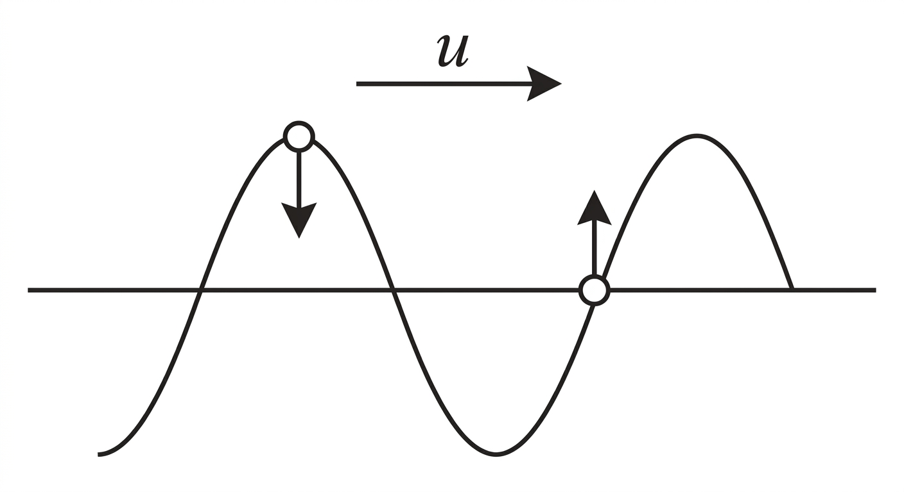

#### 四个量，只需要记三个关系

- 振幅 A：质点能偏离平衡位置的最大距离（米）。管“晃多狠”。
- 周期 T / 频率 f：抖一下要多久 / 每秒抖几下。管“多快抖”。
- 波长 λ：波形上相邻两个同相点（比如两个波峰）的距离（米）。管“波多密”。
- 波速 u：波形传播速度（米/秒）。管“传多快”。

> **f = 1 / T　　λ = u · T　　u = λ · f = λ / T**

记忆方法：波长等于“一个周期里波跑的距离”，所以 u = λ / T；频率是每秒几下，所以 f = 1/T。三句话推出全部三个公式。

> **【结论要点】** **波速 u 只由介质本身决定**（空气约 340 m/s，绳波由张力与线密度决定），**与振幅、频率都无关**。换句话说：把绳子抖得快一点，波跑得还是那么快，只是波长变短了。这是初学者最常记反的一条。

### 二、波动方程：把四个参数一个一个读出来

波动方程就是“用公式写下来的一句话：这列波在任何时刻、任何位置的位移是多少”。写成最常用的标准式：

> **y = A · cos[ ω ( t − x / u ) + φ₀ ] = A · cos( ω t − k x + φ₀ )**

把它和上面的四个量对上号——**这一张对照表是整个机械波单元的总钥匙**：

| 方程里的符号 | 物理名字 | 由它算出 |
|---|---|---|
| A | 振幅 | 晃多狠（米） |
| ω（欧米伽） | 角频率，ω = 2π f | f = ω / 2π，T = 2π / ω |
| k（读 ka） | 波数，k = 2π / λ | λ = 2π / k |
| φ₀（读费零） | 初相位 | 描述“零点时刻质点在哪、往哪走” |
| u | 波速 | u = ω / k = λ / T |

**做题流程固定成三步**：① 认标准式 → ② 对表读出 A、ω、k、φ₀ → ③ 需要什么就换算什么。绝大多数机械波选择题，前两步就能定答案。

#### 传播方向怎么判：只看一个减号

行波的标准骨架只有两种：

- y = A cos( ω t − k x + φ )：**同号、异号分开写** → 沿 **+x** 传播。
- y = A cos( ω t + k x + φ )：**同号、加号** → 沿 **−x** 传播。

> **【技巧补充】** 题目里的系数常常没写成 ω、k，而是 a、b 或者 0.2、10π 之类。处理办法是“把系数吸收进括号”：a(x − bt) = −ab(t − x/b)，仍然是 (t − x/b) 型，还是沿 +x。sin 换成 cos 只差一个常数相位，方向不变。

#### 波形图和质点方程怎么互推：延时法

已知“x = x₀ 处的质点方程 y = A cos(ωt + φ₀)”，要求整列波的方程，用**延时法**，一句话：

> **【结论要点】** 波沿 +x 传、速度 u → 波函数 = 把 x₀ 处方程里的 t 换成 ( t − (x − x₀)/u )。波沿 −x 传 → 换成 ( t + (x − x₀)/u )。物理道理：你听到某处的振动，比那里发生晚了 (x − x₀)/u 秒。

反过来，**固定 x 代入**即可从波动方程得到任一质点的振动方程——这一步十二次作业考了很多次，不要跳过。

### 三、读图题的两把钥匙：追波峰法与特殊点法

给一张波形图，问“此刻 x = x₀ 处的质点往哪动”，是最经典的题型。有两条路，熟练之后都很快。

#### 钥匙一：追波峰（平移法）

想象整条波形朝传播方向**微微挪动一点点**（挪得足够小，不改变整体形状），看 x₀ 这个点的新位置比原位置高还是低。

- 挪上去（位移变大）→ 该点正在**向上**运动。
- 挪下去（位移变小）→ 该点正在**向下**运动。

> **【结论要点】** 波往哪儿传，就往哪儿挪；点上去了就向上，点下去了就向下。

#### 钥匙二：特殊点法（不用挪图，直接看）

| 波形图上该点的位置 | 此刻质点速度 v | 此刻加速度 a |
|---|---|---|
| 波峰（y = +A） | v = 0（改方向） | 指向平衡位置（最大） |
| 过平衡位置（y = 0） | |v| 最大 | a = 0（改方向） |
| 波谷（y = −A） | v = 0（改方向） | 指向平衡位置（最大） |

> **【易错提醒】** 振动图上 y 最大处速度为 0；波形图上 x 最大处才是速度为 0。两张图最容易混的就是这一条。

### 四、相位：这一单元真正的命根子

相位可以理解成“这个点正处在抖动的哪个阶段”：波峰？波谷？正在往上走？整套波就是一个不断旋转的“相位表盘”，走一整圈 2π 就是一整个周期 T。

> **相位 = ω t − k x + φ₀　（用角度表示，2π 为一周）**

#### 同一条波上两点的相位差

> **Δφ = k · Δx = 2π · Δx / λ**

这个式子只依赖两点距离，与时间无关——**所以相位差恒定**。记住两件事：

- **谁超前**：沿传播方向，靠前（先被扰动）的点超前。
- **差多少算多少个周期**：Δx = λ 时同相；Δx = λ/2 时反相。

> **【易错提醒】** Δφ = 2πΔx/λ 算出来常常是 3.7π、5.2π 这种数，说明中间绕了好几圈。这时不要硬算小数点，要在选项允许的范围内反推整数 n（例：2πd/λ = 2nπ + …）。十二次选择题第 8 题考的就是这个。

### 五、两列波叠加：干涉

两列波相遇，各点的位移相加。位移同号 → 更强；反号 → 抵消。在空间上固定不变的加强/减弱分布，就叫**干涉条纹**。

要出现稳定条纹（不随时间乱跑），两列波必须满足：

- 频率相同（节拍一样）；
- 振动方向相同（否则只有共同方向的分量能叠加）；
- 相位差恒定（先后关系固定，不乱跳）。

满足后，设两列波到 P 点的总相位差为 Δφ：

| 总相位差 Δφ | 结果 | 合振幅（等幅 A 时） | 光强 / 响度 |
|---|---|---|---|
| Δφ = 2kπ（k = 0, ±1, ±2 …） | **加强** | A₁ + A₂ = 2A | I = 4I₀ |
| Δφ = (2k+1)π | **减弱** | |A₁ − A₂| = 0 | I = 0（完全抵消） |

> **两相干波到 P 点的相位差：　Δφ = 2π(r₁ − r₂)/λ + (φ₁₀ − φ₂₀)**

其中 r₁、r₂ 是两波源到 P 点的路程。第一项是“路上走出来的”相位差，第二项是两波源“生下来就有的”初相位差。

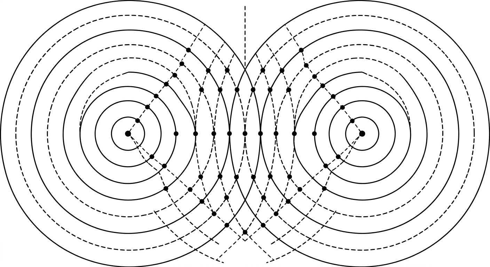

#### 球面波为什么强度按 1/r² 掉

点源发出的波向四面八方摊开，能量守恒，但波面面积按 r² 长大，所以铺到单位面积上的能量按 1/r² 减少。**振幅则按 1/r 减少**（因为强度 ∝ 振幅²）。

> **I ∝ 1 / r²　　A ∝ 1 / r**

> **【技巧补充】** 没有吸收，能量是被“摊薄”了，不是“消失”了。所以球面波传到很远仍然存在，只是变暗。

### 六、驻波：两列反向波叠成的“钉死”的波

两列**等幅、频率相同、方向相反**的波叠加，结果不往前传了，波形钉在原地抖动，这就叫驻波。

> **y = 2A · cos( k x + φ ) · cos( ω t + … )**

把式子拆成两半读：cos(kx+φ) 决定“哪儿不动”，cos(ωt) 决定“什么时候最强”。

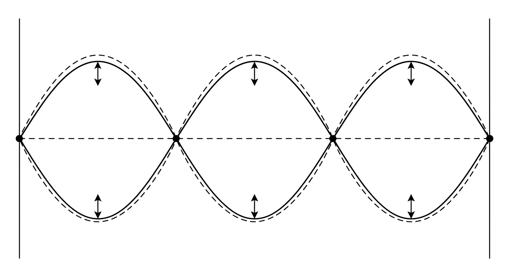

| 名称 | 条件 | 特征 |
|---|---|---|
| **波节**（振幅 = 0） | cos(kx+φ) = 0 | 完全不动的点 |
| **波腹**（振幅 = 2A） | |cos(kx+φ)| = 1 | 振幅最大的点 |

- **相邻波节之间**的距离是 **λ/2**，**相邻波腹之间**也是 **λ/2**；
- **波节到相邻波腹**的距离才是 **λ/4**。
- 同一对相邻波节之间的所有质点，**同相**（一起上下）；隔着波节的两段，**反相**。

> **【易错提醒】** 旧版框架把三种间距都写成 λ/4，是错的。只要记住一个标准画面：波节、波腹、波节、波腹……沿着 x 依次排开，节到腹是 λ/4，那么腹到下一个节还是 λ/4、节到下一个节自然是 λ/2。结论：**同类间距 λ/2，异类间距 λ/4。**

> **【易错提醒】** 驻波里两个质点的相位差只有两种可能：0（同相）或 π（反相）。绝对不能把行波公式 Δφ = 2πΔx/λ 硬套到驻波上——行波和驻波的表达式根本不同。十二次填空第 17 题就是这一类，答案只能是 π 或 0。

#### 驻波的能量：反直觉的重灾区

自由振动里，动能和势能轮流转化、此消彼长。但驻波完全不同：

- 质点在**两端**（位移最大）时：动能 = 0，弹性势能**最大**。
- 质点**过平衡位置**时：动能**最大**，势能 = 0。
- 也就是说，动能和势能**同相**变化——同时最大、同时为零。

> **【反直觉】** 因为两端“卡住”了，弹力做负功把动能不能量又存回形变里；过平衡时形变最小、几乎所有能量都在运动上。整段弦（或气柱）被“锁”住了，所以驻波不向外输运能量。

#### 什么频率才能形成驻波：边界条件

两端固定的弦：第一端必须是波节，第二端也必须是波节，中间必须正好放下整数个半波长：

> **L = n · λ/2　⇒　λ_n = 2L/n，　f_n = n·u/(2L)　（n = 1, 2, 3 …）**

这就是**本征频率**：弦（或两端开口/闭口的气柱）只允许这些特定频率起振，不是随便什么频率都行。十二次计算题 24 就是靠“反射点必须是波节”这个条件定出反射波的相位。

### 七、波的能量与能流

波把能量从一个地方搬到另一个地方。衡量“搬得猛不猛”的量是**能流密度**（也叫波强 I）：单位时间穿过单位面积的能量。

> **I = w̄ · u = ½ ρ A² ω² u**

- ρ：介质密度；A：振幅；ω：角频率；u：波速。
- I ∝ A²ω²：振幅和频率都按平方进——**振幅翻倍，光强变四倍**。

> **【易错提醒】** ① 球面波时 I ∝ 1/r²（第十二次选择题第 6 题）。② 质点动能和势能**同相**、总能量守恒，但**单个质元**的总能量并不守恒（能量在质元之间来回流）。别写“单个质元能量不守恒所以违反能量守恒”。

### 八、多普勒效应：波源和观察者动了会怎样

波源运动 → 波长被压扁或拉长；观察者运动 → 数到的波峰变密或变疏。**介质中的波速 u 永远不变**，它只由介质本身决定（空气里约 340 m/s）。

> **【结论要点】** **源动改波长，观者动改周期。**

写成公式（u 为介质中的波速，v_源、v_观 的正负号表示方向）：

> **f′ = ( u ± v_观 ) / ( u ∓ v_源 ) · f**

- 相向运动：分子 +v_观、分母 −v_源 → f′ 升高。
- 背离运动：分子 −v_观、分母 +v_源 → f′ 降低。

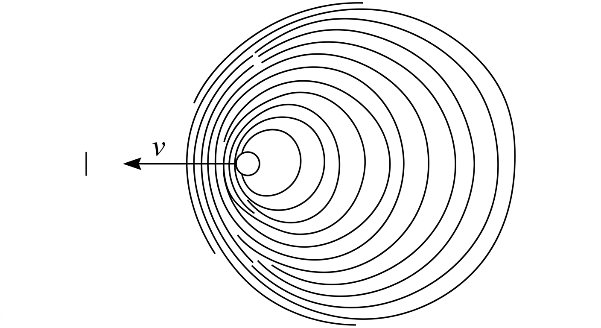

多普勒在超声测速、雷达测速、车祸“逃逸车速认定”里都用到了。

#### 拍：两个频率很接近的声音叠在一起

两列频率接近的波叠加，会出现“一会儿强、一会儿弱”的周期性变化，这个包络的频率叫**拍频**：

> **f_拍 = |f₁ − f₂|**

拍频可以直接用“数包络起伏的次数”量出来，不需要知道 f₁、f₂ 各自多少。

### 九、机械波单元速记与易错

① **读参数三步**：认标准式 y = A cos(ωt − kx + φ₀) → 读 A、ω、k、φ₀ → 换算 λ = 2π/k、f = ω/2π、T = 2π/ω、u = ω/k。
② **方向判别**：同号分开（ωt − kx）→ +x；同号相加（ωt + kx）→ −x。系数可以吸收，sin/cos 不影响方向。
③ **图形第一问**：横轴是 x 就是波形图（拍照），横轴是 t 就是振动图（录像）。
④ **运动方向**：把波形朝传播方向微移，位移变大→向上，变小→向下。
⑤ **相位差**：同一条波上 Δφ = 2πΔx/λ，与时间无关；算出 >2π 的值要反推整数 n。
⑥ **干涉**：Δφ = 2kπ 加强（I = 4I₀），Δφ = (2k+1)π 减弱（I = 0）；球面波 I ∝ 1/r²。
⑦ **驻波**：同类间距 λ/2（波节↔波节、波腹↔波腹），波节↔波腹 λ/4；段内同相、段间反相；驻波两质点相位差只能是 0 或 π；质点动能势能**同相**。
⑧ **能流**：I = ½ρA²ω²u，随波传播；单个质元能量不守恒但总能量守恒。
⑨ **多普勒**：源动改波长、观者动改周期，u 不变；拍频 = |f₁ − f₂|。
⑩ **反射**：反射点为波节 → 反射波在该点反相（半波损失 π）；为波腹 → 不反相。

> **一句话总结** 机械波这一章的命根子只有一个：相位。读参数是读相位，判方向是判相位，判动点是判相位，干涉、驻波、反射全是相位关系的结果。把 y = A cos(ωt − kx + φ₀) 这一句刻进脑子，剩下的都是它的推论。

### 速览表　（先把波想明白 / 波动方程读参数 / 读图题两把钥匙 / 相位是命根子 / 干涉 / 驻波 / 能量与能流 / 多普勒 / 速记）

01　先把波想明白
02　波动方程读参数
03　读图题两把钥匙
04　相位是命根子
05　干涉
06　驻波
07　能量与能流
08　多普勒
09　速记

---

## 第 13 次　波动光学 1：干涉

**本次考点：**相干条件 · 时间/空间相干性 · 双缝 · 薄膜 · 劈尖 · 牛顿环 · 迈克尔逊

### 这一层要怎么读

下面每一节都是“老师讲课”的顺序，不是“考点罗列”。请按这个顺序读：

① 先把“这个东西像什么”读一遍——光像水波、声像人浪、偏振像绳子上的抖动方向。这一段没有任何公式，是给脑子里“搭台子”用的。
② 再读“这一步在干什么”——公式是在解决哪个具体麻烦，不是天降的。
③ 最后才读判据和速记。如果跳到第三步，公式就是一堆需要死记的符号。

> **【技巧补充】** 带“反直觉”“陷阱”“为什么不是”字样的地方，是老师上课一定会停下来强调的地方，也是最容易在选择题里设的坑。看到就慢下来。

> **【结论要点】** 知识框架回答“为什么是这个道理”；后面的逐题解析回答“这道题怎么算”。看不懂题时先回来读框架，不要在题里死磕。

### 一、干涉到底在干什么？

把光想成水波。两列水波相遇，有的地方波峰叠波峰，水就更高；有的地方波峰叠波谷，水就抵消。光也是这样：两束光叠加后，有的地方更亮，有的地方更暗，形成**稳定的**亮暗条纹，这叫**干涉**。

但关键是：不是随便两束光相遇都能形成稳定条纹。必须让两束光“步调关系稳定”，也就是**相干**。

### 二、相干三条件

理想情况下，两束光要相干，必须同时满足下面三个条件。

#### ① 频率相同

频率就是每秒振动多少次。频率相同，波峰波谷的节拍才一样，才能形成固定的加强、减弱位置。

如果频率不同，两束光的相位差会不断变化：这一时刻波峰对波峰，下一时刻波峰对波谷，条纹会快速移动。人眼看到的是平均效果，就看不到稳定干涉。

#### ② 振动方向相同

光波是横波，振动方向垂直于传播方向。如果一束光上下振动，另一束光左右振动，它们不能在同一方向上很好地叠加出强弱分布。

如果振动方向不完全相同，只有共同方向的分量能干涉，干涉效果会变差；如果完全垂直，就不干涉。

#### ③ 相位差恒定

“相位”可以理解为波走到哪个位置：波峰、波谷、上升阶段、下降阶段。“相位差恒定”不是要求两束光相位相同，而是要求它们之间的先后关系固定。

比如一束光总比另一束光晚半个周期，这也是相位差恒定，仍然可以干涉，只是条纹位置会移动。如果相位差随机变化，亮暗位置就随机变化，平均后看不到条纹。

> **【结论要点】** **频率相同、振动方向相同、相位差恒定。** 三个条件缺一不可。

> **【易错提醒】** **频率相同不一定相干**，还要振动方向相同、相位差恒定。看到“两束光颜色一样/波长一样所以能干涉”这种说法，直接排除。

### 三、为什么两个独立钠灯不能干涉？

两个钠灯都发黄光，频率很接近，甚至看起来一样。但它们不能形成稳定干涉。

原因是：普通光源发光是**大量原子各自独立、随机、断续地发光**。两个钠灯之间没有固定相位关系，它们的相位差随机变化。

所以不满足“相位差恒定”，因此不相干。

> **【结论要点】** 两个独立钠灯**频率相同**，但**相位差随机**，所以不能干涉。注意：不是“频率不同”导致，而是“相位差随机”。

> **【技巧补充】** 同一个灯泡的两束光（比如经过分束镜）为什么能干涉？因为它们来自同一批原子、同一段时间的发光，相位关系被“锁”住了。

### 四、时间相干性：看“单色性”和“相干长度”

实际光源不是无限长的纯正弦波，而是一段一段的**波列**。光源的单色性越好，波列越长，时间相干性越好。

时间相干性关心的是这样一个问题：

> **【结论要点】** 同一束光分成两路后，一路走远一点，另一路走近一点，它们还能不能保持固定相位关系？

两路光走的路程差叫**光程差**。光程不是单纯的几何距离，而是光在介质中传播折算成真空中的距离：

> **光程 = 折射率 × 几何路程　　光程差记作 Δ**

如果光程差不太大，两路光到达屏幕时还来自同一段波列，相位关系稳定，能干涉。如果光程差太大，两路光到达时已经来自不同波列，相位关系随机，就不能干涉。

允许的最大光程差叫**相干长度**，记作 L_c。

> **【结论要点】** 光程差 Δ < 相干长度 L_c → 能干涉；光程差 Δ > 相干长度 L_c → 观察不到干涉。

相干长度由光源的单色性决定：

> **L_c = λ² / Δλ　　（Δλ 是光谱宽度）**

Δλ 越小，说明单色性越好，相干长度越长，时间相干性越好。所以：

| 光源 | 单色性 | 相干长度量级 | 结果 |
|---|---|---|---|
| 白光 | 很差，Δλ 很大 | 微米量级 | 薄膜必须很薄才能看到彩色干涉 |
| 钠灯 | 一般 | 毫米量级 | 普通薄膜仍需很薄 |
| 激光 | 极好，Δλ 极小 | 千米量级 | 迈克尔逊等厚膜也能干涉 |

> **【易错提醒】** 时间相干性由光源的**单色性**决定；单色性越好，相干长度越长，时间相干性越好。

### 五、空间相干性：看“光源线度”和“光源大小”

空间相干性关心的是：

> **【结论要点】** 同一时刻，从光源**不同位置**发出的光，能不能当作相干光来用？

普通扩展光源可以看成许多独立的小点光源。每个小点光源都各自随机发光，彼此相位不固定。

- 如果光源很小，接近点光源，那么它各点发出的光相位关系比较一致，空间相干性好。
- 如果光源很大，比如一个大灯丝、大面光源，不同点发出的光互相独立，相位随机，空间相干性差。

典型例子：杨氏双缝实验。如果双缝前面的光源太大，光源上不同点产生的干涉条纹位置会错开。这些条纹叠加后，亮暗互相填平，条纹就看不见了。

> **【结论要点】** 光源越小，空间相干性越好；光源越大，空间相干性越差。

双缝间距越大，对光源尺寸的要求越苛刻。近似关系是：

> **d < λ R / a　　（d：双缝间距；a：光源线度；R：光源到双缝距离；λ：波长）**

这个公式不用死背，记住趋势即可：**光源越小、双缝越近，越容易看到干涉。**

> **【技巧补充】** 两个独立钠灯不相干，主要是因为它们不是同一个光源分出来的，相位差随机；空间相干性则主要讨论**同一个扩展光源的不同部分**。前者是“两个源”，后者是“一个源的两块”。

### 六、获得相干光的两种方法

普通光源各原子独立发光，不能直接拿两个灯去干涉。必须把“同一束光”分开，再让它们相遇。方法有两类。

#### 方法一：波阵面分割法

取同一个波阵面上的两部分作为两个新光源。“波阵面”就是波传播时相位相同的点组成的面。

同一波阵面上的光来自同一光源、同一时刻，相位关系稳定。

- 杨氏双缝干涉
- 菲涅耳双面镜
- 洛埃镜

特点：从同一波前取两部分，初相关系稳定；主要受**空间相干性**限制——光源要小。

> **【易错提醒】** 有些笔记把“薄膜”也放进波阵面分割里，这里容易乱。标准分类是：**双缝干涉属于波阵面分割法；薄膜干涉通常属于振幅分割法。**

#### 方法二：振幅分割法

用反射、透射把同一束光分成两路。比如一束光遇到薄膜，一部分在上表面反射，一部分进入薄膜在下表面反射，再出来。

这两束光来自同一入射光，只是振幅被分开了。

- 薄膜干涉
- 迈克尔逊干涉仪
- 牛顿环
- 劈尖干涉

特点：同一束光被分束，相位关系稳定；主要受**时间相干性**限制——光程差不能超过相干长度。

| 方法 | 怎么分光 | 典型例子 | 主要限制 |
|---|---|---|---|
| 波阵面分割法 | 同一波前取两部分 | 双缝、菲涅耳双面镜、洛埃镜 | 光源要小（空间相干性） |
| 振幅分割法 | 同一束光反射 / 透射分两路 | 薄膜、迈克尔逊、牛顿环、劈尖 | 光程差 < 相干长度（时间相干性） |

### 七、光程与光程差（后面所有薄膜题的地基）

光在真空里走 1 m 和在玻璃里走 1 m，带来的相位变化完全不同：玻璃里光速慢、频率不变，波长被压缩到 λ/n，走同样距离经历的相位就多 n 倍。

> **一段介质的光程 = n · L　　（n 折射率，L 几何长度）**

> **【结论要点】** 在双缝或迈克尔逊的一条光路上插入厚度 e、折射率 n 的薄片，这条光路的光程增加 **(n − 1)·e**（不是 n·e，要扣掉原来空气那一段）。

光程差 δ 决定相位差：

> **Δφ = 2π δ / λ　　（δ 为光程差，λ 为真空波长）**

### 八、明暗条件与半波损失（薄膜题唯一可靠的解法）

先分清三个概念，题目里经常混着出现：

- **几何路程差**：两束光各自走的实际距离之差，比如薄膜的 2d。
- **光程差**：几何路程差按折射率折算，比如膜内的 2nd。
- **半波损失（附加光程差）**：反射时相位突变 π，等效多走 λ/2。

标准做法只有一条：

> **【结论要点】** 光从**光疏介质射向光密介质**（n 小 → n 大）反射时，相位突变 π，等效光程加 λ/2；光从**光密射向光疏**反射时不发生突变。薄膜上下两个表面**各判一次，再相加**。

有了光程差 δ，明暗条件就固定了：

| 观察方向 | 明纹（加强）条件 | 暗纹（减弱）条件 |
|---|---|---|
| 反射光有净半波损失 | δ = (k + 1/2)·λ | δ = k·λ |
| 反射光无净半波损失 | δ = k·λ | δ = (k + 1/2)·λ |
| 透射光（与反射互补） | δ = k·λ | δ = (k + 1/2)·λ |

> **【结论要点】** 反射与透射**互补**：反射亮的地方透射就暗，反射暗的地方透射就亮。题目问“从下往上看”（透射）时，把反射的结果反过来写即可。

> **【技巧补充】** 膜厚 d = 0 时：若上下表面反射中**恰好一次**有半波损失 → 反射暗、透射亮（普通牛顿环中央暗斑）；若两次反射性质**相同**（都突变或都不突变）→ 净相位差 0 → 反射亮。任何膜干涉题做完都拿这条对一遍，几乎不会错。

### 九、四种经典装置一次打通

#### 杨氏双缝（波阵面分割）

- 缝距 d，缝到屏距离 D（D ≫ d），屏上位置 x。
- 明纹：d·sinθ = kλ，屏上 x_k = kλD/d。
- 暗纹：x = (2k+1)λD/2。
- 条纹间距 Δx = λD/d —— **只由 d、D、λ 决定，与缝宽无关**。

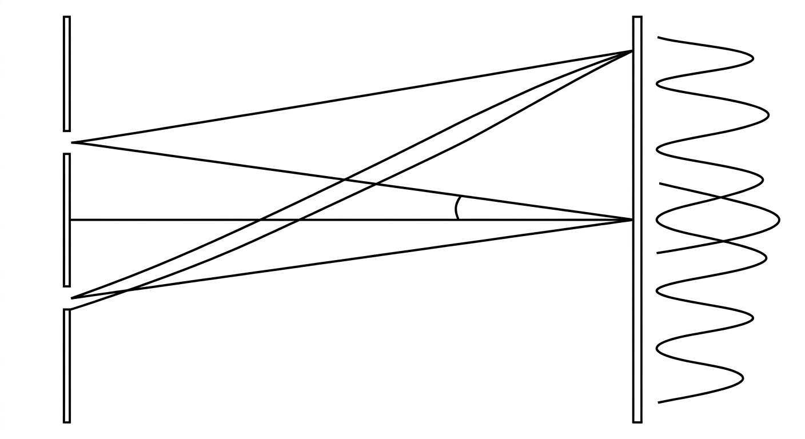

#### 劈尖（振幅分割 · 等厚干涉）

两块玻璃夹一条缝，缝越靠尖端膜越薄。空气膜厚 δ = θx。

- 相邻暗（明）纹对应的膜厚差 Δδ = λ/2。
- 条纹间距 Δx = λ / (2θ)。
- 测微小厚度：h = θL = (λ / 2Δx) · L。
- 测工件缺陷：条纹弯向劈尖尖端（膜薄端）→ 凹陷；弯向宽端 → 凸起；弯曲一个条纹间距 → 深度 = λ/2。

#### 牛顿环（振幅分割 · 等厚干涉）

平凸透镜压在平板上，中间是一圈圈厚度递增的空气膜。反射光中央是暗斑，往外挂着一圈圈明暗交替的圆环。

> **暗环半径　r_k = √( k λ R )　（k = 0, 1, 2, …，k = 0 即中央暗点）**

> **半径平方差　r_(k+m)² − r_k² = m λ R　→　可反推透镜曲率半径 R**

> **【技巧补充】** 膜厚 δ(r) = r²/(2R)，所以固定级次 k 对应固定膜厚 δ = kλ/2，再代回去就是 r² ∝ k → 圆环。注意牛顿环是 r ∝ √k，而劈尖是 x ∝ k（直线）。

#### 两个高频追问

- **浸液体**：光程差变 2nδ → 暗环 r_k = √(kλR/n)，条纹按 1/√n 整体缩小。
- **透镜上移**：中心膜厚增加，各环向中心收缩，环心明暗随 Δ 交替变化。

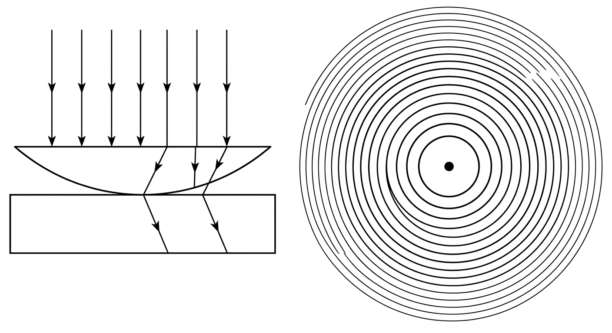

#### 迈克尔逊干涉仪（振幅分割 · 等倾干涉）

光在半透半反镜处被分成两路，各走一圈（等效于两次穿过 M₁′ 与 M₂ 之间的空气层）后重新合成，等效于一个平面平行空气膜，所以光程差是几何路程的两倍 2d·cosθ。

> **动镜移动 Δd → 光程差改变 2Δd → 条纹移动 N 条 → λ = 2Δd / N**

- M₁′ 与 M₂ **垂直**（严格平行）→ 等倾干涉 → 同心圆环。
- M₁′ 与 M₂ 成很小夹角 → 等厚干涉 → 直条纹。

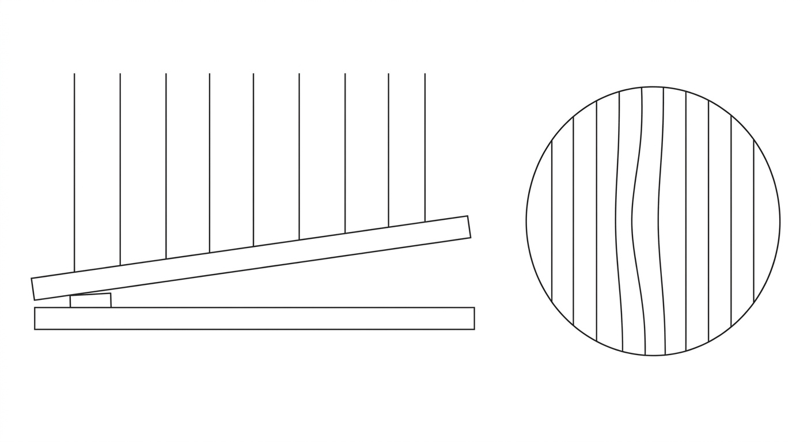

### 十、本节速记与易错清单

① **相干三条件**：频率相同、振动方向相同、相位差恒定。
② **两个独立钠灯不能干涉**：因为相位差随机，不是频率不同。
③ **频率相同不一定相干**：还要振动方向相同、相位差恒定。
④ **相位差恒定 ≠ 相位相同**：一个总比另一个慢半拍也可以干涉。
⑤ **时间相干性**：由单色性、相干长度决定；单色性越好，相干长度越长。
⑥ **光程差 > 相干长度**：观察不到干涉。
⑦ **空间相干性**：由光源线度决定；光源越小，空间相干性越好。
⑧ **双缝干涉**：波阵面分割法。
⑨ **薄膜干涉、迈克尔逊干涉**：振幅分割法。
⑩ **白光相干长度短**：所以薄膜要薄才能看到彩色条纹。
⑪ **插介质片**：光程增加 (n − 1)·e，条纹整体平移但间距不变。
⑫ **半波损失**：光疏→光密反射才突变 π；上下表面各判一次再相加。
⑬ **反射与透射互补**：题目问透射就把反射结果反过来。
⑭ **激光**：单色性好、时间相干性好、空间相干性也好。

> **一句话总结** 干涉的本质是两束光“来自同一源、步调关系稳定”。时间相干性管“光程差能有多大还能认亲”；空间相干性管“光源能有多大还能认亲”。双缝是分波阵面，薄膜是分振幅；薄膜题只有一个入口：先数半波损失，再写光程差。

### 速览表　（干涉在干什么 / 相干三条件 / 两钠灯为何不相干 / 时间相干性 / 空间相干性 / 两种分光方法 / 光程与光程差 / 半波损失与明暗条件 / 四种装置 / 速记）

01　干涉在干什么
02　相干三条件
03　两钠灯为何不相干
04　时间相干性
05　空间相干性
06　两种分光方法
07　光程与光程差
08　半波损失与明暗条件
09　四种装置
10　速记

---

## 第 14 次　波动光学 2：衍射与光栅

**本次考点：**单缝半波带法 · 光栅方程 · 缺级 · 光谱重叠 · 分辨本领

### 这一层要怎么读

下面每一节都是“老师讲课”的顺序，不是“考点罗列”。请按这个顺序读：

① 先把“这个东西像什么”读一遍——光像水波、声像人浪、偏振像绳子上的抖动方向。这一段没有任何公式，是给脑子里“搭台子”用的。
② 再读“这一步在干什么”——公式是在解决哪个具体麻烦，不是天降的。
③ 最后才读判据和速记。如果跳到第三步，公式就是一堆需要死记的符号。

> **【技巧补充】** 带“反直觉”“陷阱”“为什么不是”字样的地方，是老师上课一定会停下来强调的地方，也是最容易在选择题里设的坑。看到就慢下来。

> **【结论要点】** 知识框架回答“为什么是这个道理”；后面的逐题解析回答“这道题怎么算”。看不懂题时先回来读框架，不要在题里死磕。

### 一、光为什么会“拐弯”：衍射

波动有一条绕不开的性质：波遇到障碍物或缝隙时，会**绕过边缘继续传播**。水波绕过石头、声波绕过墙，都是衍射。光当然也一样。

那为什么平时看不见光的衍射？因为衍射是否明显，取决于**缝的尺寸和波长谁大**。

> **【结论要点】** 缝宽和波长差不多（或者缝更小）时，衍射非常明显；缝宽远大于波长时，衍射太弱，被淹没在几何光学里，我们就当光走直线。

| 情形 | 缝宽 a 与波长 λ | 看到的现象 |
|---|---|---|
| 小孔 / 狭缝很窄 | a ≲ λ | 光向四周散开，屏上是一大片明暗相间 |
| 日常狭缝 | a ≫ λ | 只在缝附近看到很窄的一小片衍射，几何光学够用 |
| 圆孔（人眼瞳孔、抛物面） | D ≫ λ | 仍有衍射极限（后面讲分辨本领） |

后面所有公式都在回答“衍射有多强”这一个问题，衡量标准统一用**角宽度**：条纹张开的角度 φ。

#### 先把干涉和衍射分清楚（这俩是亲兄弟）

**惠更斯—菲涅耳原理**是全章的发动机：波前上的**每一点**都是一个新子波源，把所有子波按相位叠加起来，就得到真实的光场。

|  | 干涉 | 衍射 |
|---|---|---|
| 参与叠加的子波 | 可数的几束（双缝 = 2 束，光栅 = N 束） | 同一个波前上**无穷多个**子波源（单缝 = 无穷多条窄带） |
| 条纹 | 等间距，边界锐利 | 中央宽、两侧窄而暗，包络明显 |
| 强弱取决于 | 各束的振幅与相位差 | 缝的宽度与波长（缝越窄越明显） |

> **【结论要点】** **干涉是少数几束的相干叠加，衍射是无数个子波的相干叠加；它们用的是同一条原理，只是数目的差别。**

### 二、单缝夫琅禾费衍射：半波带法（从零讲）

实验装置：单缝 + 会聚透镜 + 屏。平行光垂直照到缝上，屏（焦平面）上出现**中央一条最宽最亮的明纹**，两侧是越来越窄、越来越暗的明暗相间条纹。

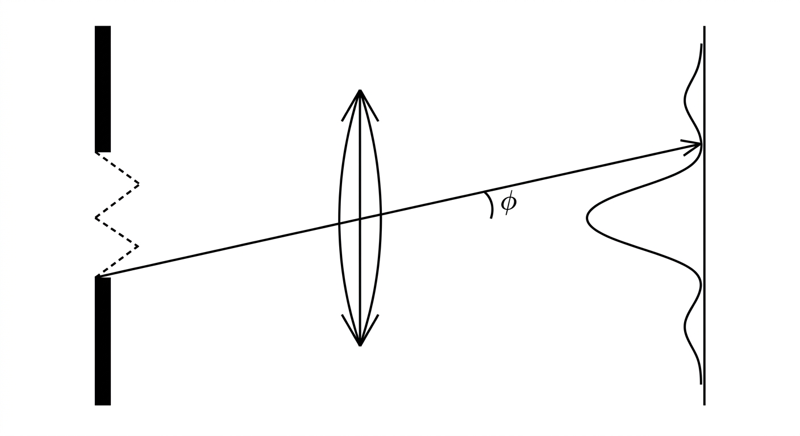

#### 半波带法：把缝切成小块，两两抵消

把宽度为 a 的缝在垂直于光线的方向上，按相位切成一条条“窄条”，每条叫一个**半波带**（缝内相邻两条带的光到屏上某点时恰好差半个波长、相位差 π）。

关键在于：**同一个屏上点，各条带的光程差由 0 一路排到最大**。排到多少，就决定了这一点是明还是暗。

> **【结论要点】** 当 a·sinφ = kλ（k = ±1, ±2, …，**不含 0**）时，缝恰好被分成 k 个完整的半波带，相邻两带两两相消 → 这一点全暗。

> **【反直觉】** k = 0 时 a·sinφ = 0，缝只能被分成**半个**波带，剩下半个没东西可配对抵消，所以中央反而是最亮的中央明纹。这是最容易忘的一句话。

> **第 k 级暗纹：　a · sinφ = k λ　（k = ±1, ±2, ±3 …）**

明纹位置没有精确公式，作近似即可：

> **第 k 级明纹（近似）：　a · sinφ = (2k + 1)·λ / 2　（k = 0, ±1, ±2 …）**

#### 屏上怎么量：把角度换成距离

题目一般不给角度给距离。有透镜时屏就在焦平面上，量起来非常简单：

> **第 k 级暗纹到中心的距离：　x_k = k · λ f / a　（f 为透镜焦距）**

> **中央明纹宽度：　Δx = 2 λ f / a　（左右第一级暗纹之间的距离）**

- 缝越窄（a ↓）→ 中央明纹越宽（Δx ↑）——**衍射最明显**。
- 波长越长（λ ↑）→ 中央明纹越宽。
- 焦距越长（f ↑）→ 屏上量出来的距离越大（**但角宽度不变**）。

> **【易错提醒】** 透镜只改变条纹在屏上的**位置和大小**（把角度线性地映射成距离），不改变衍射图样的**角分布**。所以“焦距变长 → 条纹变宽”是对的，但“焦距变长 → 衍射变强”是错的。

#### 中央明纹跟着谁走：透镜光轴

中央明纹（零级）的位置 = 平行入射光经透镜后的会聚点 = **光轴与焦平面的交点**。所以单缝和屏不动、只把透镜往上挪，中央明纹就跟着往上移。十四次选择题第 1 题考的就是“缝变窄（变宽）+ 透镜上移（上移）”这个组合。

#### 斜入射：公式里减掉一个 θ₀

> **斜入射（与法线成 θ₀）：　a ( sinφ − sinθ₀ ) = k λ**

道理很朴素：中央那道“亮”被挪到了 θ₀ 方向，所以公式里要把它减掉。

### 三、光栅：很多条缝的“集体亮相”

单缝的条纹太暗、位置太散，做不了精密测量。光栅（很多条等宽等距的平行缝）把大量子波的贡献在特定方向上**叠加放大**，形成又亮又锐的主极大——这就是光栅衍射。

光栅常数 d = a + b（缝宽 a 加上不透光部分 b）。

> **【结论要点】** d · sinφ = k λ　（k = 0, ±1, ±2, …，d 为光栅常数）。这是“相邻两缝的程差恰好等于整数个波长”的几何表述。

- k = 0：零级，在 φ = 0 方向，强度最大。
- 最大级次：|sinφ| ≤ 1 ⇒ |k| ≤ d/λ，取满足这个条件的最大整数。
- d 越小（缝越密），同一级 k 的衍射角 sinφ = kλ/d 越大，光谱拉得越开。

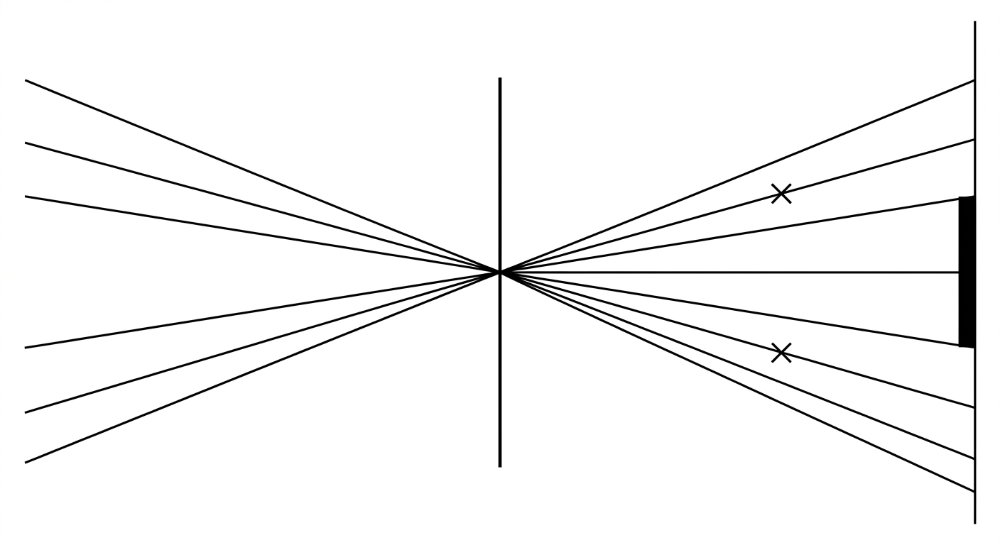

#### 光栅条纹的亮度：被单缝包络调制

光栅主极大不是无穷亮的长条，它的高度被单缝衍射的包络“套”住了。套在亮包络上的级次很亮，套在暗处的级次很弱甚至没有。

所以光栅光谱 = 尖锐的等间隔亮线 × 宽缓的明暗包络。

### 四、缺级：光栅主极大被单缝暗纹吞掉

如果某一级光栅主极大的方向，**正好**也是某一级单缝暗纹的方向，那么这个级次的能量被单缝的零压死了——它就不出现。这叫**缺级**。

> **缺级条件：　d / a = p（p 为整数）时，k = p, 2p, 3p, … 级缺级**

推导只要一行：光栅主极大 d sinφ = kλ，单缝暗纹 a sinφ = k′λ，两式同角度相除得 d/a = k/k′，当 d/a = p 为整数时 k = p、2p、3p… 全部落进暗纹。

- 缝宽 a 与不透光部分等宽（**d = 2a**）→ p = 2 → **所有偶数级缺级**，只剩零级和奇数级。
- 某个衍射图样里数出 N 条亮线，也常用缺级倒推 a 与 d 的比。

> **【易错提醒】** 缺级说的是“光栅主极大落在**单缝暗纹**上”，不是“光栅衍射和单缝衍射互相抵消”。考试爱用这两种说法互换，看清楚主语。

### 五、白光光谱与光谱重叠

白光入射时，第 k 级光谱不是一个点，而是一段连续的颜色区间，范围由可见光的波长上下限决定：

> **第 k 级光谱的角度范围：　k λ_min / d ≤ sinφ ≤ k λ_max / d**

如果第 k 级的长波端超过了第 k+1 级的短波端，两段光谱就会**重叠**：

> **相邻级重叠条件：　k · λ_max ≥ (k+1) · λ_min**

> **【结论要点】** ① 问「第 k 级与第 j 级重叠」：取 k λ₁ = j λ₂（波长与级次成反比）。② 问「第 k 级与第 k+1 级重叠」：用 k λ_max ≥ (k+1) λ_min（连续光谱）。看清题目问的是**特定两级**还是**相邻两级**。

- 零级（k = 0）没有色散，所有颜色叠在一起 → 一条白色亮纹。
- 级次越高，相邻级光谱越容易重叠。

### 六、分辨本领：两个亮点分得开分不开

当两个衍射亮斑叠在一起时，怎么判断“到底是两个还是一个”？需要一个约定标准——**瑞利判据**。

> **【结论要点】** 一个亮斑的**第一级暗纹**恰好落在另一个亮斑的**中央**上时，就认为两者刚好能分辨开。

- 圆孔（望远镜、物镜）：θ_min = 1.22 λ / D，D 为有效口径。
- 显微镜：δ_min ≈ 0.61 λ / (n sin u)，即 d = 0.61λ / NA。
- 光栅：R = λ / Δλ = kN，N 为被照亮的总刻线数，k 为级次。

- 口径 D 越大 → 最小分辨角越小 → 越厉害。
- 波长 λ 越短 → 最小分辨角越小 → 越厉害（**这就是电子显微镜比光学显微镜强的原因**）。
- 光栅上照亮的刻线 N 越多、用越高级次 k → 分辨本领越大。

> **【易错提醒】** θ_min = 1.22λ/D 出来的是**角度**（rad）；如果题目给的是两个物点的**距离差**，还得用小角关系 s = L·θ 换算成线距离。十四次计算题考的就是这一步。

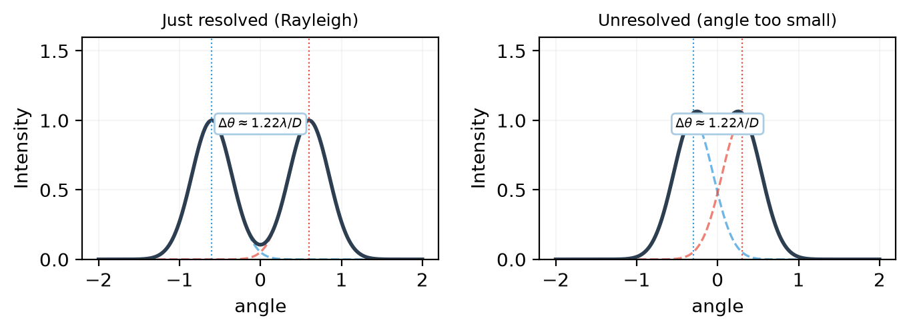

### 七、衍射与光栅单元速记与易错

① **单缝暗纹**：a sinφ = kλ，k = ±1, ±2 …，**没有 k = 0**（那里是中央明纹）。
② **单缝明纹（近似）**：a sinφ = (2k+1)λ/2。
③ **中央明纹宽度**：Δx = 2λf/a；缝越窄、波长越长 → 越宽。
④ **透镜不改变角分布**，只把角度映射成焦平面上的距离。
⑤ **中央明纹跟光轴走**：透镜平移 → 中央明纹随动。
⑥ **斜入射**：a(sinφ − sinθ₀) = kλ。
⑦ **光栅方程**：d sinφ = kλ；最大级次 |k| ≤ d/λ。
⑧ **缺级**：d/a = p 为整数时，k = p、2p、3p … 缺级；d = 2a → 偶数级全缺。
⑨ **光谱重叠**：特定两级 kλ₁ = jλ₂；相邻两级 k λ_max ≥ (k+1) λ_min。
⑩ **瑞利判据**：θ_min = 1.22λ/D；口径越大、波长越短 → 分辨本领越强。
⑪ **光栅分辨本领** R = kN。

> **一句话总结** 衍射题只有一条主线：**把缝切成半波带，看能凑出几对**。凑成整数对 → 暗纹（a sinφ = kλ）；凑不出 → 明纹。光栅题则是**多缝集体亮相**（d sinφ = kλ），再叠加单缝包络去判断缺级；最后用瑞利判据回答“分不分得开”。

### 速览表　（衍射是什么 / 单缝半波带法 / 光栅 / 缺级 / 光谱重叠 / 分辨本领 / 速记）

01　衍射是什么
02　单缝半波带法
03　光栅
04　缺级
05　光谱重叠
06　分辨本领
07　速记

---

## 第 15 次　波动光学 3：偏振

**本次考点：**偏振态 · 马吕斯定律 · 布儒斯特角 · 双折射 · 波片

### 这一层要怎么读

下面每一节都是“老师讲课”的顺序，不是“考点罗列”。请按这个顺序读：

① 先把“这个东西像什么”读一遍——光像水波、声像人浪、偏振像绳子上的抖动方向。这一段没有任何公式，是给脑子里“搭台子”用的。
② 再读“这一步在干什么”——公式是在解决哪个具体麻烦，不是天降的。
③ 最后才读判据和速记。如果跳到第三步，公式就是一堆需要死记的符号。

> **【技巧补充】** 带“反直觉”“陷阱”“为什么不是”字样的地方，是老师上课一定会停下来强调的地方，也是最容易在选择题里设的坑。看到就慢下来。

> **【结论要点】** 知识框架回答“为什么是这个道理”；后面的逐题解析回答“这道题怎么算”。看不懂题时先回来读框架，不要在题里死磕。

### 一、光是横波：偏振到底在说什么

光波是横波——它的电场（光振动）方向垂直于光的传播方向。既然垂直的方向有无穷多个，那光就可以“往不同方向抖”，这就是偏振。

打个比方：绳子上的横波。如果绳子只在**上下**方向抖，叫线偏振；如果绳子上任何一点的振动方向都随时间乱转，就谈不上偏振方向。

> **【结论要点】** 偏振描述的是“光振动的方向分布”，是横波独有的性质——纵波没有偏振。

### 二、四种偏振态

| 偏振态 | 振动方向的分布 | 转动检偏器时的光强变化 | 偏振度 P |
|---|---|---|---|
| **自然光** | 各方向均匀、无规律 | 最强 I 与最弱 I 之比为 2（不消光） | P = 0 |
| **线偏振光** | 固定在一条直线上 | **完全消光**（转 180° 必黑） | P = 1 |
| **部分偏振光** | 某方向占优势但不纯 | 有极小值但**不为零** | 0 < P < 1 |
| **圆偏振光** | 方向匀速旋转、端点画圆 | **完全不变**（无明暗变化） | P = 1 |
| **椭圆偏振光** | 方向旋转、端点画椭圆 | 有变化但**无消光** | P = 1 |

> **偏振度　P = ( I_max − I_min ) / ( I_max + I_min )**

> **【易错提醒】** 只靠一个偏振片（检偏器）**分不出**部分偏振、圆偏振、椭圆偏振——它们都是“有变化但不消光”。必须再插入一片 1/4 波片，把圆偏振变成线偏振，才能判定。十五次选择题第 3、4 题考过。

> **【结论要点】** **能消光 → 线偏振；完全不变 → 圆偏振；有变化但不消光 → 部分或椭圆偏振。**

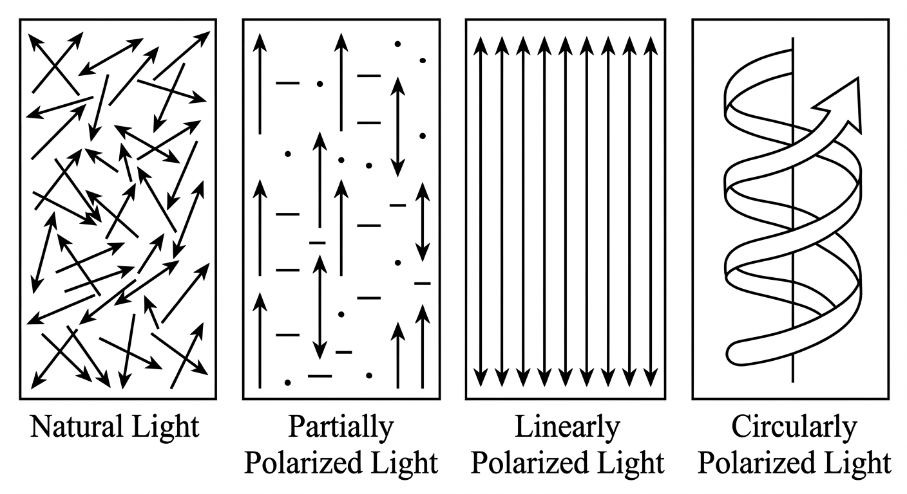

### 三、马吕斯定律：从一个偏振片说起

偏振片的作用是“只放行沿某个方向振动的光”，这个方向叫它的**偏振化方向**（也叫透振方向）。垂直于它的分量被吸收掉。

#### 线偏振光过偏振片：马吕斯定律

设入射的线偏振光强度为 I₀，它的振动方向与偏振片的偏振化方向成夹角 θ。只有平行于偏振化方向的那个分量能通过：

> **I = I₀ cos² θ　（马吕斯定律）**

- θ = 0°（方向平行）→ I = I₀，全部通过。
- θ = 90°（方向垂直）→ I = 0，**完全消光**——这就是“用偏振片判断是不是线偏振光”的方法。
- θ = 60° → I = I₀/4（cos²60° = 1/4）。

#### 自然光过偏振片：先减半

自然光的振动方向随机均匀，任意取一个方向，它都只有一半能量。所以自然光过任何理想偏振片后，强度都变成一半，且出射光**一定是线偏振光**：

> **自然光 I₀ 过偏振片 → I = I₀ / 2**

> **【结论要点】** **只有自然光（或圆偏振光）过偏振片才“减半”；线偏振光过偏振片一律用 I = I₀cos²θ。**做题时先判断入射光的性质，再决定用哪个公式——这是十五次最常见的失分点。

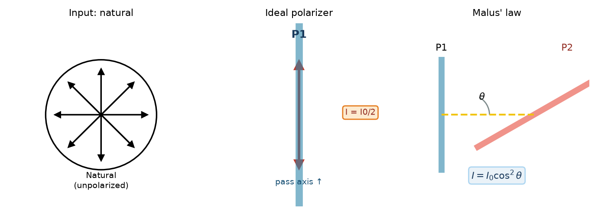

### 四、多片串联：经典“第三片”问题

三片偏振片串在一起时，**不能把角度加起来**，必须**逐片用马吕斯定律**。因为每过一片，出射光一定变成线偏振光，方向就是这一片的偏振化方向。

设第一片的偏振化方向为 A，透射光强 I₁ = I₀/2；第三片与 A 成 θ 角，第四片再与 A 成 45°：

> **I₃ = (I₀/2) · cos²θ · cos²45° = (I₀/4) · cos²θ**

推广成“在两片正交偏振片之间插第 k 片”，每片都乘一个 cos²：

> **I = (I₀/2) · cos²θ₁ · cos²θ₂ · … · cos²θₙ**

> **【结论要点】** 在正交的两片之间插第三片（与第一片成 θ），透射光强为 I = ½ I₀ sin²2θ，**θ = 45° 时透射最强**。所以“偏振片越多不一定越暗”——摆对角度反而变亮。

### 五、布儒斯特定律：让某一份量完全不反射

光斜着射到两种介质的界面上，一部分反射、一部分折射。当入射角取某个特定值时，反射光会变成**完全线偏振光**——这个角叫布儒斯特角 i_B。

> **【结论要点】** ① 反射光为线偏振光，振动方向**垂直于入射面**（s 分量）。② 折射光为部分偏振光。③ 反射光线与折射光线**互相垂直**。

> **tan i_B = n₂ / n₁　（光从 n₁ 射向 n₂）**

> **i_B + r = 90°　（由布儒斯特角 + 折射定律推出）**

记忆方法：i_B 比全反射临界角小（玻璃对空气的临界角约 41.8°）；玻璃射向空气时 i_B ≈ 33.7°，空气射向玻璃时约 56.3°。

> **【结论要点】** 如果线偏振光的振动方向**平行于入射面**（p 分量），以 i_B 入射时**完全没有反射光**（全透射）。反过来问就是：“要从某方向把某偏振完全反射掉，就选 i_B 入射、让振动方向垂直入射面”。

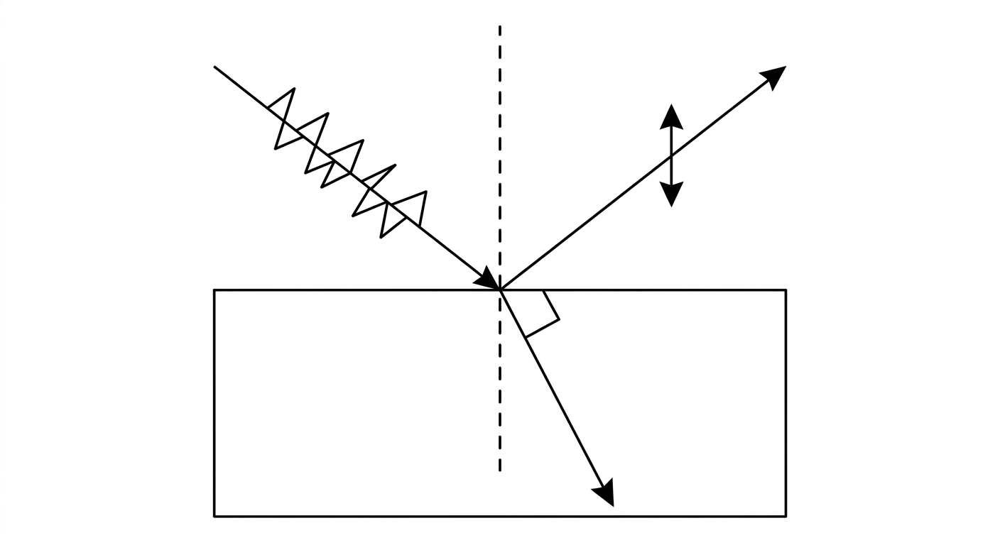

**平板玻璃（两个平行界面）**：以 i_B 入射时，折射角恰好等于“玻璃→空气”界面的布儒斯特角，所以内表面的反射光也是同一方向的线偏振光，两束反射光在反射方向上叠加。

### 六、双折射：光在晶体里裂成两束

像方解石、冰洲石这样的**单轴晶体**，光进去后会分成两束：**o 光**（寻常光）和 **e 光**（非常光），走的方向和速度都不一样。

| 光线 | 波阵面形状 | 传播速度 | 折射率 |
|---|---|---|---|
| o 光（寻常光） | 球面 | 各方向相同，v_o = c / n_o | n_o（常数） |
| e 光（非常光） | 绕光轴的旋转椭球面 | 随方向变化，v_e(θ) = c / n(θ) | 随方向变 |

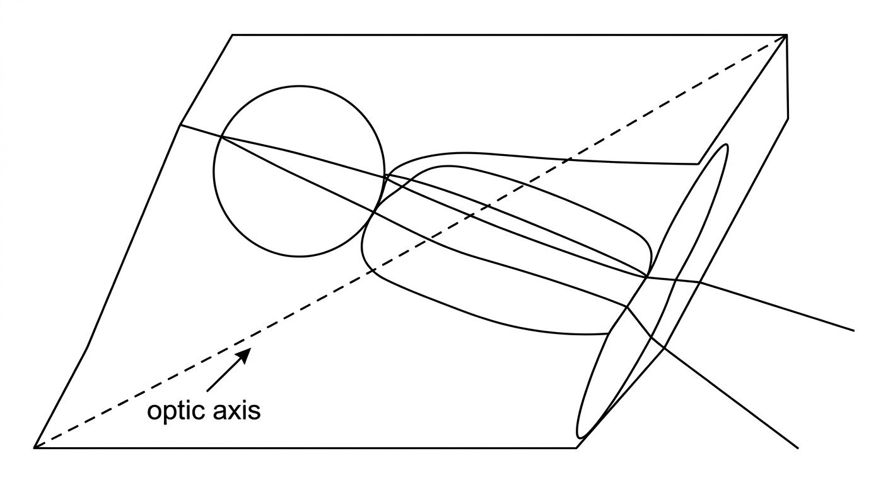

- **沿光轴方向入射**：o、e 速度相同，不发生双折射。
- **垂直光轴入射**：o、e 速度差最大，劈开得最厉害。
- **正晶体**（如石英）：n_e < n_o，e 光跑得快。
- **负晶体**（如方解石）：n_e > n_o，e 光跑得慢。

> **【技巧补充】** 画的是某一时刻 e 光与 o 光波阵面和晶面的交线。交线是**圆** → o 光；交线是**椭圆** → e 光。哪条是 e 光，看椭圆的**长轴方向**。

### 七、波片：把相位差“存起来”再还回去

波片是把晶体**沿光轴平行于表面的方向**磨出来的一片薄片，作用只有一个：给 o 光和 e 光加上一个**固定的相位差**。

> **附加相位差　δ = 2π (n_e − n_o) d / λ　（d 为波片厚度）**

- **1/4 波片**：δ = π/2 → 最小厚度 d = λ / (4 |n_e − n_o|)。
- **1/2 波片（半波片）**：δ = π → d = λ / (2 |n_e − n_o|)。

| 入射线偏振方向与光轴的夹角 | 过 1/4 波片后 | 过 1/2 波片后 |
|---|---|---|
| 0° 或 90°（与光轴平行 / 垂直） | 仍是线偏振光（只加相位） | 仍是线偏振光 |
| 45° | **圆偏振光** | 仍是线偏振光（方向转到 2×45°−原方向） |
| 其他角度 α | **椭圆偏振光** | 仍是线偏振光（方向转到 2α） |

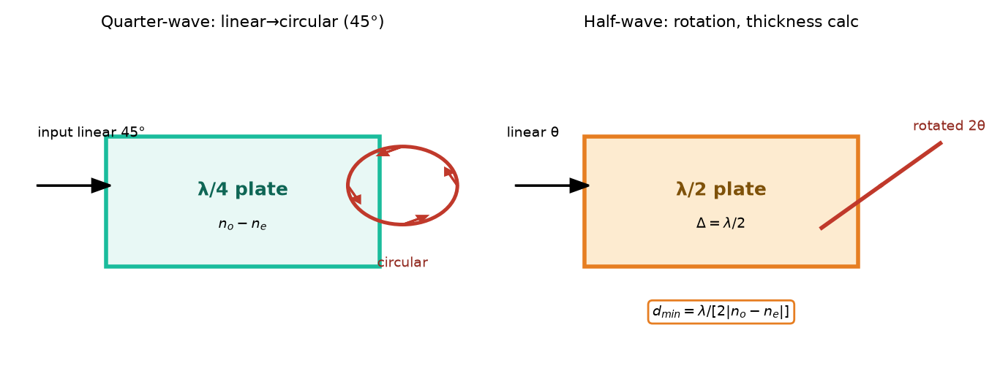

> **【结论要点】** 半波片把两个正交分量的相位差改变 π，等于把它们**互换正负号**。所以它可以把线偏振光的偏振面**转 90°**（只要偏振方向不与光轴平行或垂直），常用来把偏振片转到“消光位置”。

**正交偏振片之间插波片**（光轴与偏振片成 45°）时的透射光强：

> **I = ½ I_in · sin²( δ / 2 )**

- δ = π/2（1/4 波片）→ I = ½ I_in（半透）。
- δ = π（半波片）→ I = 0（**全消光**）。
- δ = 0（不放波片）→ I = 0（与正交偏振片一致）。

> **【易错提醒】** 1/4 波片在正交偏振片之间给的是**最大透射**（半透），半波片给的才是**消光**。口诀：“四分之一开窗，半波关门”。

#### 改变旋向（右旋 ↔ 左旋）

圆偏振光（椭圆偏振光）过 1/4 波片时，如果波片光轴与椭圆长轴的夹角改变，出射光的旋向会翻转；夹角为 0° 或 90° 时退化成线偏振光。

另一条路：先用 1/4 波片把圆偏振变成线偏振光，再把线偏振光旋转 90°，最后再用 1/4 波片变回圆偏振——旋向就反了。

### 八、偏振单元速记与易错

① **自然光**过偏振片 → 强度减半，出射必为线偏振光。
② **线偏振光**过偏振片 → I = I₀cos²θ；θ = 90° 完全消光。
③ **偏振度** P = (I_max − I_min)/(I_max + I_min)：自然光 0，线偏振 1，圆/椭圆偏振 1，部分偏振在 0 与 1 之间。
④ **只转检偏器**：线偏振有消光；圆偏振完全不变；椭圆与部分偏振有变化但无消光（**三者的区分必须靠 1/4 波片**）。
⑤ **多片串联**：逐片用马吕斯，I = (I₀/2)·∏cos²θᵢ；正交两片间插第三片，I = ½I₀ sin²2θ，45° 最亮。
⑥ **布儒斯特角**：tan i_B = n₂/n₁；反射光垂直入射面偏振；反射与折射光线垂直；i_B + r = 90°。
⑦ **p 分量**（平行入射面）在 i_B 入射时**无反射、全透射**。
⑧ **双折射**：o 光球面波阵面、e 光旋转椭球面；沿光轴不发生双折射。
⑨ **波片**只加相位，不改变两个分量相等时的偏振态。
⑩ **半波片**把偏振面转 90°，在正交偏振片之间给**消光**；**1/4 波片**给**半透**，且 45° 入射时把线偏振变圆偏振。

> **一句话总结** 偏振这一章其实只有三句话：**自然光先减半，线偏振用 cos²，波片只加相位。**凡是遇到“完全消光”“强度不变”“没有反射光”，分别对应线偏振、圆偏振、布儒斯特角入射的 p 分量——这三个信号背下来，选择题就有一半不用算。

### 速览表　（偏振是什么 / 四种偏振态 / 马吕斯定律 / 多片串联 / 布儒斯特角 / 双折射 / 波片 / 速记）

01　偏振是什么
02　四种偏振态
03　马吕斯定律
04　多片串联
05　布儒斯特角
06　双折射
07　波片
08　速记

---

## 附录一　答案资料差异与勘误

下列条目会直接影响选项或计算结果。docx 的附录节是同一份列表，两个后端口径一致。

01　第十二次选择第5题：参考答案册选项标号与原卷波形箭头不一致。按原卷箭头向 −x、P 点上升坡判断，质点向 +y，正确为 D：yP=0.01cos(2πt−π/3)。
02　第十二次填空第14题：行波质元的动能与弹性势能都正比于同一 sin² 相位因子；势能减小，动能也减小。
03　第十二次填空第15题：图中 A、B 高度差 40 cm；减弱点 D、E；0.65 s 后 C 点位移为 −20 cm。
04　第十三次选择第7题：透射相长的最小非零厚度为 λ/(2n)（选 D），不要与 λ/(4n) 的另一干涉条件混淆。
05　第十三次填空第15题：两次反射半波损失抵消，尖端为亮；从尖端起第5条暗纹对应 9λ/(4n₂)。
06　第十三次填空第19题：按图示 n=1.50→1.75 与 1.75→1.62 两界面的反射相位判断，接触点为暗纹。
07　第十四次选择第2题：正确选项为 B（电子德布罗意波长更短）；参考答案册标号有误。
08　第十四次填空第18题：按题面单位弧度应写 2.68×10⁻⁷ rad，约等于 0.0554 角秒。
09　第十四次填空第19题：半波带数按 Δ/(λ/2) 计算，答案是 4 个。
10　第十四次计算第21题：波长 ±5% 时角度范围 28.36°–31.67°，跨度约 3.31°。
11　第十四次计算第24题：斜入射下允许级次为 k=−2 至 6，最高为第6级；不是第3级。
12　第十五次选择第3题：按原卷图，C 选项两正交偏振分量最均匀，偏振度最小。
13　第十五次选择第4题：正确选项 C（入射光不可能是圆偏振光）；参考答案册标号有误。
14　第十五次填空第12题：布儒斯特角下无反射的是 p 分量，电矢量应平行入射面。
15　第十五次计算第21题：由 I(60°)=Imax/2 解得自然光与线偏振光强度比为 1:1。
16　第十二次知识框架（旧版）：相邻波节之间（或相邻波腹之间）的间距是 λ/2，只有波节到相邻波腹才是 λ/4；旧版把三种间距都写成 λ/4。V4 知识精讲已更正。
17　第十三次知识框架（旧版）：薄膜干涉属于振幅分割法，不属于波阵面分割法；波阵面分割的典型是双缝、菲涅耳双面镜、洛埃镜。V4 知识精讲已更正。
18　第十三次选择第7题：透射光相长的最小非零厚度为 λ/(2n)（选 D）。λ/(4n) 是反射相长 / 透射相消的最小非零厚度，两者不可互换；content13.py 的旧答案 B 已于 2026-09-29 更正。

## 附录二　重建与校验

- 底稿：`大学物理/课程作业/知识框架精讲_v4.py`（改动后先跑 `python scripts/normalize_quotes.py` 把 « » 转成中文引号）
- 生成 docx：`python scripts/generate_physics_midterm_docx_v4.py`
- 生成本 md：`python scripts/export_framework_markdown.py`
- 审计两者：`python scripts/audit_physics_midterm_v4.py`
- 底稿里的中文引号请一律写成 `«` `»` 占位符——直接写 `“` `”` 会被工具链静默规范化成 ASCII 双引号，导致 Python 字符串截断。
