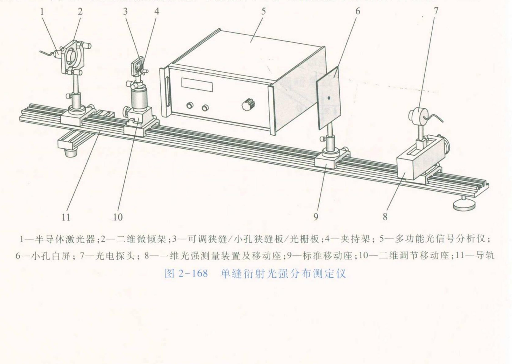
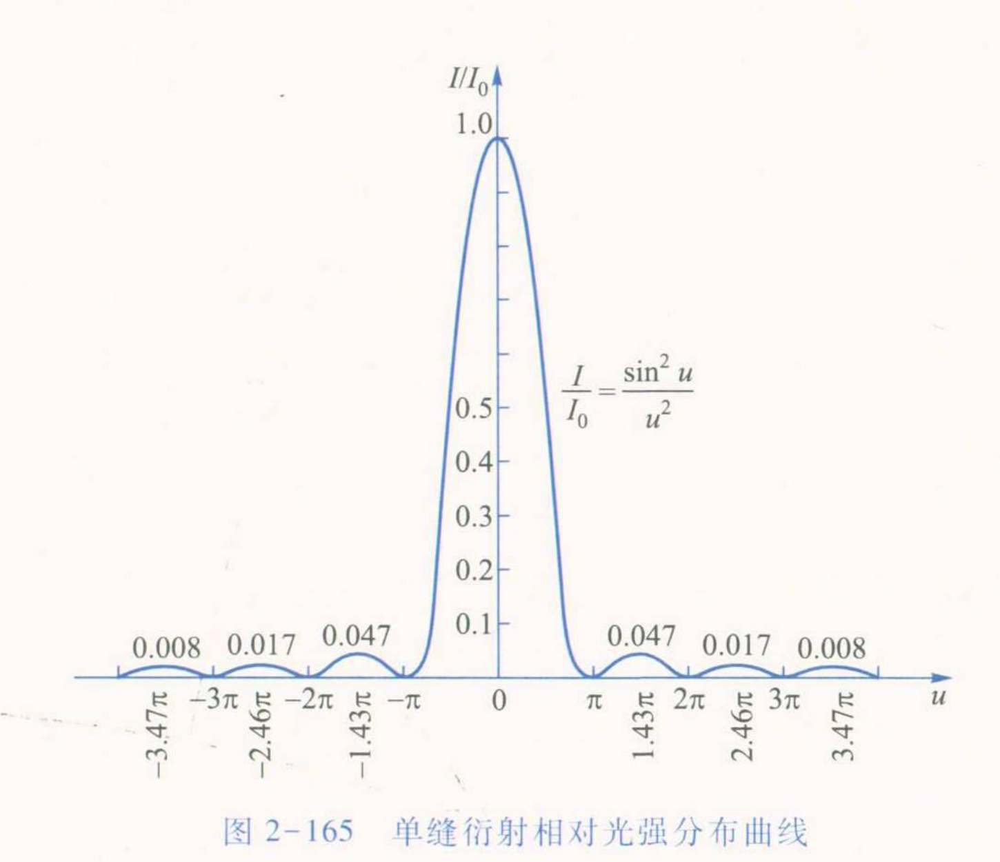

# 大学物理实验预习报告 · 单缝及多种元件衍射的光强分布（实验 2.23）

| 姓名 | 学号 | 班级 | 课程 |
|---|---|---|---|
| 孙承泽 | 2253710052 | 能动强基2501 | 大学物理实验 I-2 |

> 依据：《大学物理实验（第三版）》（高博 主编）实验 2.23，印刷页 225–230。

## 一、实验原理简述

本实验用半导体激光器照明可调狭缝，以硅光电池和一维光强测量装置扫描衍射图样；光电池输出光电流与光强成正比，对中央峰归一化后得到相对分布，并由暗纹位置求缝宽。单缝宽 b、波长 λ 时：

I = I₀(sin u/u)²，u = πb sinθ/λ　(2.23.1)

θ=0 时 I=I₀且I₀∝b²；暗纹满足 sinθₖ = kλ/b，小角度下 θₖ ≈ kλ/b，k=±1,±2,…　(2.23.2)，缝越窄衍射角越大，中央主极大角宽约 2λ/b。设接收屏距狭缝 D、暗纹横坐标 xₖ，则 b = kλD/xₖ　(2.23.3)。双缝透光缝宽 b、不透光挡板宽 a，中心距 d=a+b：

I = I₀(sin u/u)²·4cos²(Δφ/2)，Δφ = 2πd sinθ/λ　(2.23.4)

减小 d 时单缝包络不变，包络内干涉细条纹变疏、数目减少，趋向单缝分布。

## 二、预习思考题与解答

**1. 扫描前为什么要做“关断激光测本底、中央峰电流调到 2000×10⁻⁸～5000×10⁻⁸ A、鼓轮始终单向转动”？若跳过会带来什么偏差？**

① 本底电流：光电池在无光时仍有暗电流，加上杂散光，检流计读数不为零。课本要求先关断激光读取本底并逐点扣除，否则绝对光强 I 整体偏大；中央峰附近相对误差小，但第一、二旁瓣本身仅为中央峰的约 0.047、0.017，叠加未扣除的本底后相对强度会被明显抬高，归一化 I/I₀ 失真。② 量程选择：中央峰电流调到 2000×10⁻⁸～5000×10⁻⁸ A，是让中央峰落在检流计量程中段线性区——过大易饱和削峰，过小则旁瓣信号接近噪声、信噪比差；该区间保证主极大与旁瓣都在有效分辨范围。③ 单向转动：鼓轮通过丝杠带动探头平移，往返转动存在螺距空回差。始终沿同一方向转动可保证位移读数单调、不引入回程间隙；若来回拧动，同一刻度对应的探头实际位置会错位约几十微米级，导致暗纹横坐标 xₖ 读错，按 b=kλD/xₖ 求出的缝宽系统偏大或偏小，且 I/I₀–x 曲线出现错位台阶。图 2-168 中一维光强测量装置的鼓轮与导轨布置正是该扫描机构。

**2. 由暗纹条件和 b=kλD/xₖ，如何理解“中央亮纹宽约 10 mm、从一侧第三级暗纹扫到另一侧第三级、每 0.5–1 mm 等间隔读数、用多级暗纹求平均”的设计？**

① 中央亮纹宽度：按 (2.23.2) 中央主极大半角宽约 λ/b，屏上半宽约 λD/b，全宽约 2λD/b。调缝使该宽度约 10 mm，是兼顾角分辨与扫描行程的选择——过窄则暗纹过密、探头狭缝难以分辨，过宽则旁瓣超出扫描范围。② 扫描范围：从一侧第三级暗纹中心到另一侧第三级，恰好覆盖中央主极大（±1 级之间）加上第一、二级旁瓣及第三级暗纹边界，能完整呈现图 2-165 中中央峰为 1、第一旁瓣 0.047、第二 0.017 的相对分布，并提供 6 个暗纹位置用于定标。③ 等间隔：每 0.5 mm 或 1 mm 读一次，保证 I/I₀–x 曲线采样均匀，峰形与零点不过度欠采样，又不至于数据过密增加随机读数负担。④ 多级平均：b=kλD/xₖ 中 xₖ 与 k 成正比，单一 k 求 b 易受单个 xₖ 读数误差影响；用 k=±1, ±2, ±3 多个暗纹分别求 b 再平均，可减小随机误差并检验 xₖ–k 的线性关系是否符合 (2.23.2)，线性偏离则提示光路未垂直或 D 测量有误。

**3. 按 (2.23.4) 对比 d=0.20 mm 与 0.10 mm 两种双缝时，单缝包络宽度变不变？包络内细条纹的疏密和数目如何变化？为什么先测单缝再看多种元件？**

① 包络由因子 (sin u/u)² 决定，u=πb sinθ/λ 只与单缝宽 b 有关，与中心距 d 无关；因此只要两种双缝的单缝宽 b 相同，包络角宽度 2λ/b 不变。② 细条纹由 4cos²(Δφ/2) 决定，Δφ=2πd sinθ/λ，相邻干涉极大角间隔约 λ/d。d=0.20 mm 时间隔约 0.10 mm 时的一半，条纹更密，同一包络内可容纳的干涉极大数目更多；d=0.10 mm 时条纹变疏、数目减半。课本图 2-167 示意 d 减小时包络内细条纹减少，d 趋近 b 时趋向单缝分布。③ 先测单缝可建立两项基准：一是测出相对光强包络 I/I₀=(sin u/u)² 和缝宽 b，二是掌握本底扣除、归一化、暗纹定标的完整流程；再测双缝时才能把实测曲线分解为“包络×干涉”两因子，验证 (2.23.4) 的因子化预言，并通过对比不同 d 直观理解“单缝衍射是双缝干涉的包络”这一关系。若直接测双缝，包络与干涉混合则难以分离检验。
