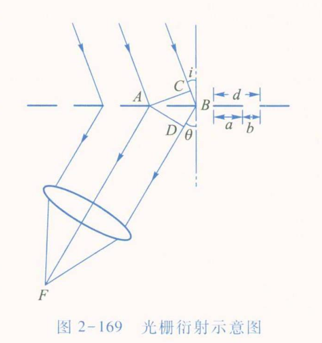

# 大学物理实验预习报告 · 用光栅测量光波波长（实验 2.24）

| 姓名 | 学号 | 班级 | 课程 |
|---|---|---|---|
| 孙承泽 | 2253710052 | 能动强基2501 | 大学物理实验 I-2 |

> 依据：《大学物理实验（第三版）》（高博 主编）实验 2.24，印刷页 230–235。

## 一、实验原理简述

本实验练习分光计的调整与使用，观察光栅衍射光谱并测量汞灯谱线波长；仪器为分光计、光栅、汞灯和平行平面镜。光栅由等间距狭缝组成，刻痕宽 a、透光缝宽 b，光栅常量 d = a+b。入射角为 i、衍射角为 θ 时，相邻缝光程差 Δ = d(sin i+sin θ)，增强条件为 d(sin i+sin θ)=kλ，k=0, ±1, ±2, …　(2.24.1)。垂直入射时 d sinθ=kλ　(2.24.2)，测得衍射角即可由 λ=d sinθ/|k| 求波长。角度按 θ=(θ_A⁽⁻¹⁾−θ_A⁽⁺¹⁾+θ_B⁽⁻¹⁾−θ_B⁽⁺¹⁾)/4　(2.24.3) 由两游标及左右谱线读数平均，以减小分光计偏心差；汞灯各谱线波长离散，零级重合，非零级按波长分开。

## 二、预习思考题与解答

**1. 试设计已知波长测定光栅常量的实验方案，并推导误差计算公式。（课本“思考与讨论”1）**

① 用平行光管照射已知波长 λ₀ 的单色光，使其垂直入射光栅；调望远镜分别对准左右同一谱线的 ±k 级亮线，用游标 A、B 读数并按左右角差求平均衍射角 θ，可重复测量取平均。② 由正入射光栅方程 d sinθ=kλ₀，得到光栅常量 d=kλ₀/sinθ（级次取正的绝对值）。③ 对 d=kλ₀/sinθ 求误差传播：若 λ₀ 和 k 视为准确量，则 Δd/d≈|cotθ|Δθ，Δd≈d|cotθ|Δθ，角度误差 Δθ 用弧度；若 λ₀ 也有误差，最大相对误差可写为 Δd/d≈Δλ₀/λ₀+|cotθ|Δθ。

**2. 为什么要调整光栅平面与平行光管光轴相垂直？如果不垂直，能够测定谱线的波长吗？说明理由。（课本“思考与讨论”2）**

① 光栅平面垂直光轴时，入射角 i=0，通用光栅方程简化为 d sinθ=kλ；左右谱线的测量关系也更对称，能直接按实验所用公式求波长。② 不垂直时仍可测：若 i 已知，用 d(sin i+sinθ)=kλ；若以光栅法线为角度基准测出 ±1 级两侧谱线，联立（2.24.1）可消去 i，得 λ=d[sinθ₊₁−sinθ₋₁]/2。若 i 未知却只测一侧并套用正入射简式，就会产生系统偏差。因此实验调至垂直入射可简化测量并避免这项修正。

**3. 如果用氦灯作光源，已知氦黄光的波长 λ=587.6 nm，所用光栅每厘米有 5 000 条刻痕，试计算该谱线一级、二级的衍射角。（课本“思考与讨论”3）**

① 每厘米 5 000 条刻痕对应光栅常量 d=1/(5 000 cm⁻¹)=2.0×10⁻⁴ cm=2.0×10⁻⁶ m=2 000 nm。② 正入射时 sinθₖ=kλ/d。一级：sinθ₁=587.6/2 000=0.2938，θ₁=arcsin(0.2938)≈17.09°。③ 二级：sinθ₂=2×587.6/2 000=0.5876，θ₂=arcsin(0.5876)≈35.99°；两级均满足 sinθ≤1，因而都能出现。

**4. 已知分光计额定误差为 1′=2.91×10⁻⁴ rad、光栅常量 d 的相对误差为 0.1%，如何估计绿光波长的相对误差？（课本“数据记录与处理”要求）**

由 λ=d sinθ/|k|，对误差限按最大绝对误差线性合成，得 E_λ=Δλ/λ≈Δd/d+|cotθ|Δθ。代入 Δd/d=0.001、Δθ=2.91×10⁻⁴ rad，绿光的相对误差为 E_λ≈0.001+2.91×10⁻⁴|cotθ̄_绿|，即 E_λ(%)≈0.10%+0.0291|cotθ̄_绿|%。这里 θ̄_绿 是实验测得的绿光平均衍射角；课本未给出该实测角，故应在实验后代入数据求数值。误差由光栅常量误差和分光计角度读数误差共同传递而来；按额定误差限估算时线性合成，反映测量不确定限而非重复测量的随机标准差，角度须用弧度。
