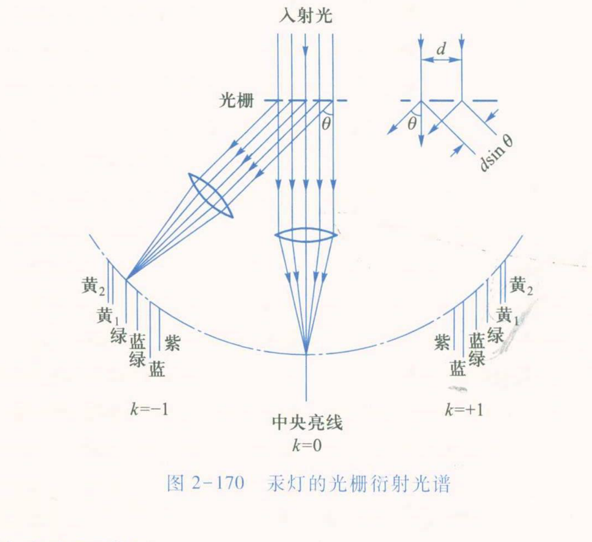

# 大学物理实验预习报告 · 用光栅测量光波波长（实验 2.24）

| 姓名 | 学号 | 班级 | 课程 |
|---|---|---|---|
| 孙承泽 | 2253710052 | 能动强基2501 | 大学物理实验 I-2 |

> 依据：《大学物理实验（第三版）》（高博 主编）实验 2.24，印刷页 230–235。

## 一、实验原理简述

本实验调整分光计，用透射式平面光栅观察汞灯线状光谱并测量谱线波长；仪器为分光计、光栅、汞灯和平行平面镜。光栅相邻透光缝的间距为 d=a+b（a 为刻痕宽、b 为透光缝宽）。入射角 i、衍射角 θ 对应的相邻缝光程差为

Δ = d(sin i+sin θ)

主极大满足 d(sin i+sin θ)=kλ，k=0, ±1, ±2, …　(2.24.1)；按课本约定，法线左侧 θ 为正、右侧为负。垂直入射时 i=0，化为 d sinθ=kλ　(2.24.2)。实验测量左右 ±1 级谱线，并用两个游标的角度差平均以消除偏心差：

θ=(θ_A⁽⁻¹⁾−θ_A⁽⁺¹⁾+θ_B⁽⁻¹⁾−θ_B⁽⁺¹⁾)/4　(2.24.3)

已知 d 后，按 λ=d|sinθ|/|k| 求波长；汞灯各谱线波长离散，零级重合，非零级分开成谱。

## 二、预习思考题与解答

**1. 试设计已知波长测定光栅常量的实验方案，并推导误差计算公式。（课本“思考与讨论”1）**

① 让已知波长 λ₀ 的单色平行光垂直入射光栅。将望远镜依次对准同一谱线左右两侧的 ±k 级亮线，分别记录游标 A、B 的位置；按（2.24.3）用两侧读数差求平均角 θ，并重复测量。这样左右角差消除了望远镜刻度零点的共同偏移，也减小单一游标的偏心影响。图 2-170 中央的 k=0 亮线与两侧 k=±1 光谱说明了读数对象：两侧同一颜色的谱线对应同一波长、相反级次。

② 正入射光栅方程给出

d = |k|λ₀/|sinθ|

选定级次 k 后，代入已知 λ₀ 和实测 θ 即得 d；可分别用不同级次或重复测量的 θ 计算，再取平均。③ 从 d=|k|λ₀/|sinθ| 作误差传播，一阶相对变化满足

δd/d = δλ₀/λ₀−cotθ·δθ

将各误差取最大绝对值，得

Δd/d ≈ Δλ₀/λ₀ + |cotθ|Δθ

若 λ₀ 的标准值视为准确，第一项为零，故 E_d=Δd/d≈|cotθ|Δθ，Δθ 必须用弧度。角度越小，|cotθ|越大，角度读数误差对 d 的影响越明显。

**2. 为什么要调整光栅平面与平行光管光轴相垂直？如果不垂直，能够测定谱线的波长吗？说明理由。（课本“思考与讨论”2）**

① 垂直入射使 i=0，通用光栅方程直接化为 d sinθ=kλ；两侧谱线对称，按本实验的角度测量式即可求 λ，不必另行确定入射倾角。② 若光栅未垂直，仍然可以测波长，但必须修正几何关系：若 i 已知，直接用 d(sin i+sinθ)=kλ。若 i 未知，但以光栅法线为角度基准测出同一谱线的 ±1 级角位置，则由（2.24.1）分别有

d(sin i+sinθ₊₁)=λ，　d(sin i+sinθ₋₁)=−λ

两式相减可消去 i，得到 λ=d[sinθ₊₁−sinθ₋₁]/2。③ 因此“不垂直”并非绝对不能测；但若仍把斜入射数据代入正入射简式 d sinθ=kλ，会产生系统偏差。按课本先调到垂直，是为了让角度定义和计算式直接对应、减少所需修正。

**3. 如果用氦灯作光源，已知氦黄光的波长 λ=587.6 nm，所用光栅每厘米有 5 000 条刻痕，试计算该谱线一级、二级的衍射角。（课本“思考与讨论”3）**

① 刻线密度 N=5 000 cm⁻¹，因此光栅常量

d=1/N=2.0×10⁻⁴ cm=2.0×10⁻⁶ m=2 000 nm

② 正入射光栅方程给出 sinθₖ=kλ/d。一级时 sinθ₁=587.6/2 000=0.2938，故 θ₁=arcsin(0.2938)=17.0856°≈17.09°。③ 二级时 sinθ₂=2×587.6/2 000=0.5876，故 θ₂=arcsin(0.5876)=35.9869°≈35.99°。两者的正弦值都小于 1，所以一级、二级亮纹均存在。

**4. 已知分光计额定误差为 1′=2.91×10⁻⁴ rad、光栅常量 d 的相对误差为 0.1%，如何估计绿光波长的相对误差？（课本“数据记录与处理”要求）**

① 由正入射方程 λ=d|sinθ|/|k|，在级次 k 固定时，一阶相对变化满足

δλ/λ = δd/d+cotθ·δθ

各误差取最大绝对值后，得到

E_λ=Δλ/λ≈Δd/d+|cotθ|Δθ

② 代入课本给定的 Δd/d=0.1%=0.001、Δθ=2.91×10⁻⁴ rad，并令 θ 为实验测得的绿光平均衍射角 θ̄_绿：

E_λ≈0.001+2.91×10⁻⁴|cotθ̄_绿|

换成百分数，E_λ≈0.10%+0.0291|cotθ̄_绿|%。

③ 课本未给绿光的实测角，故实验前只能写出误差表达式，测得 θ̄_绿 后才能得到数值。该误差由光栅常量误差和分光计角度读数误差传播而来；按给出的额定误差限作保守估计时线性相加，不能把它误当成重复测量的随机标准差。
