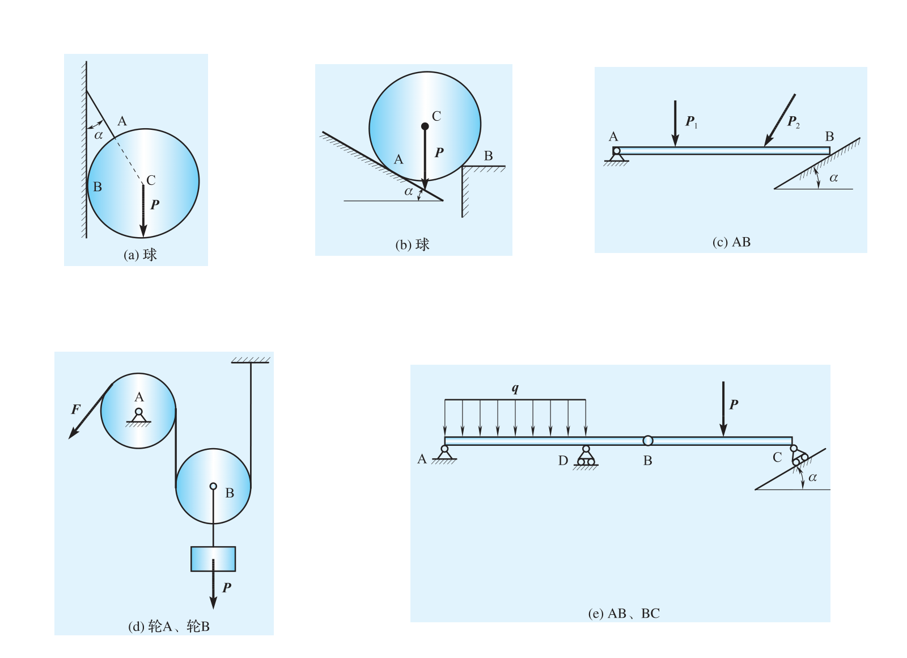
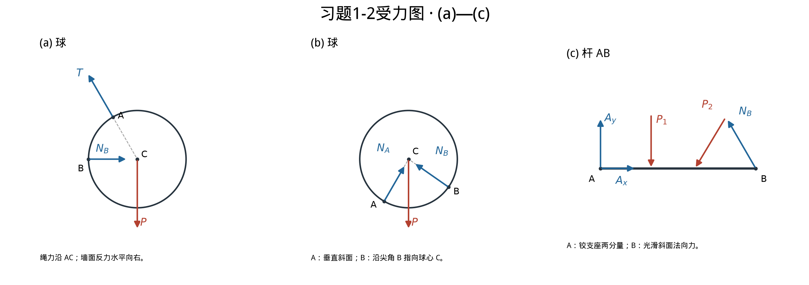
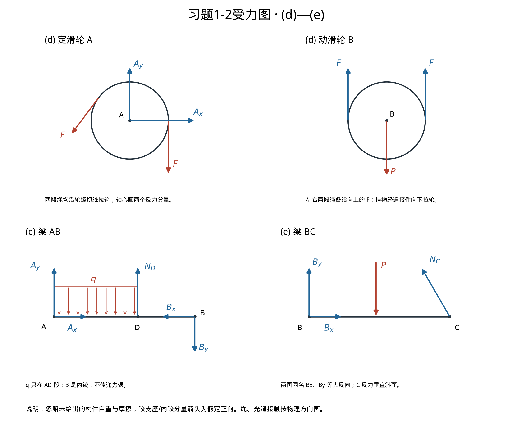

# 2026-09-22 工程力学作业 · 习题1-2参考答案

> 姓名：孙承泽　学号：2253710052　班级：能动强基2501
> 本文件是独立参考答案，**不放进空白作业单**。题目只要求画受力图，不要求计算全部反力。

## 一、题面与来源

**1-2　画出题1-2图中指定物体的受力图。**

指定对象：(a) 球；(b) 球；(c) AB；(d) 轮A、轮B；(e) AB、BC。

- 杨庆生等《工程力学（第三版）》教材页 **25–26**。
- `../框架版教材/工程力学（框架汇编版）.pdf`：PDF **第30–31页**（零基索引29、30）。
- `../资料原件/工程力学（第三版）_1-130.pdf`：PDF **第33–34页**（零基索引32、33）。
- 两处来源已逐页比较文本及72 dpi渲染像素，完全一致。**(d)、(e)在第26页续图，不得漏做。**
- 该书“部分习题参考答案”从第2章开始，**没有1-2的官方答案**；下面为按约束性质独立作出的参考解，不能宣称“与书后答案一致”。

原题全图：

## 二、统一作图约定

1. **先取分离体，再画作用在它身上的全部外力**。去掉墙、绳、支座等约束物，用对应约束力代替。
2. 按本章理想约束模型处理：接触面光滑，绳与滑轮理想；不另加题图未给出的构件自重。球的重力及已标明的载荷必须保留。
3. 绳只能拉，光滑接触力沿公法线、指向被约束物体；固定铰支座画两个正交分量，**不画反力偶**；辊轴支座只画垂直支承面的反力。
4. 铰支座、内铰的未知分量可先假定箭头方向，解出负值表示实际反向；这不适用于任意改变绳拉力或单侧光滑接触压力的物理方向。
5. 图上箭头长度只为辨识，不表示已求得的力的大小；示意角度不作为题设数值。以下同一字母在不同小题中独立使用。

## 三、(a)—(c)

### (a) 球：三力

将球从墙与绳中分离，画出：

- **重力 $P$**：作用在球心 $C$，竖直向下。
- **绳拉力 $T$**：作用在系绳点 $A$，沿绳指向左上方的悬挂点。原图绳的延长线通过球心 $C$，故作用线为 $AC$。
- **墙面反力 $N_B$**：作用在球与墙的接触点 $B$，垂直竖直墙面，水平向右。

三力作用线均通过球心。墙面光滑，**不能再添一个沿墙向上的摩擦力**。

可选自检：图中 $\alpha$ 为绳与竖直墙的夹角。取右、上为正，

$$
\sum F_y=0:\quad T\cos\alpha-P=0,
$$
$$
\sum F_x=0:\quad N_B-T\sin\alpha=0.
$$

于是 $T=P/\cos\alpha$、$N_B=P\tan\alpha$，与箭头方向相符。求这些大小不是本题交付要求。

### (b) 球：三力

- **重力 $P$**：球心 $C$，竖直向下。
- **斜面反力 $N_A$**：接触点 $A$，垂直左下方斜面，沿 $A\to C$ 指向右上方。
- **尖角反力 $N_B$**：右侧台阶尖角接触点 $B$，沿 $B\to C$ 指向左上方。

**关键是 $B$ 点：球接触的是台阶尖角，不是水平顶面的一段，也不是竖直侧面的一段。**对圆与尖角的光滑接触，公法线沿接触点与圆心连线，所以 $N_B$ 既不能想当然画成竖直，也不能想当然画成水平。

两处法向力与重力的作用线都通过球心，不另画切向力。

### (c) 杆 AB：两项载荷、三个反力分量

- 原有 **$P_1$**：保持原作用点，竖直向下。
- 原有 **$P_2$**：保持原作用点，按原图斜向左下；题图没有给它的角度，不擅自添加数值。
- **$A_x,A_y$**：$A$ 为固定铰支座，分别假定向右、向上。
- **$N_B$**：$B$ 为杆端与光滑斜面的接触，垂直斜面指向左上方。

因为斜面与水平面成 $\alpha$，反力可写成

$$
\boldsymbol N_B=(-N_B\sin\alpha,\;N_B\cos\alpha).
$$

这只是同一个 $N_B$ 的分量表示；**若已画合力 $N_B$，不要又把这两个分量作为额外外力画进去。**$A$ 不是固定端，没有反力偶 $M_A$。

## 四、(d)—(e)

### (d) 定滑轮 A与动滑轮 B：分别画两张

理想绳、理想滑轮下，同一根绳的张力处处相等；自由端拉力为 $F$，故各段张力均为 $F$。

**① 取定滑轮 A。**

- 左侧斜绳对轮的拉力 $F$：沿轮缘切线，斜向左下。
- 右侧竖直绳对轮的拉力 $F$：沿右轮缘切线，竖直向下。
- 轮轴在中心 $A$ 的约束力：画 $A_x,A_y$ 两个分量，假定向右、向上。

两项绳力不能漏掉任意一项，不能把绳力随意平移到轮心而不考虑力矩。两项等大切向力对轮心的力矩恰好相反，合矩为零；理想轴承不另画反力偶。

**② 取动滑轮 B。**

- 左侧绳对轮的拉力 $F$：左轮缘，竖直向上。
- 右侧绳对轮的拉力 $F$：右轮缘，竖直向上。
- 挂物经连接件对轮的拉力：在轮心 $B$，竖直向下。挂物静止时，此力大小为 $P$。

这里图中的向下 $P$ **是挂物对轮的连接力，不是动滑轮自身的重力**。轮 $B$ 没有固定轴座，不能再添一套“地基支反力”。

平衡自检：

$$
\sum F_y=0:\quad F+F-P=0
\quad\Longrightarrow\quad P=2F.
$$

两个向上绳力分别在左右切点，关于轮心力矩相消。该等式只是受力图的自检，不取代画图。

### (e) 梁 AB与BC：在内铰 B处分开

约定图上 $B_x,B_y$ 在梁 AB 上分别向左、向下；在梁 BC 上分别向右、向上。它们是两对作用与反作用力。

**① 梁 AB。**

- $A$ 固定铰支座：$A_x$ 向右、$A_y$ 向上（假定）。
- $D$ 水平面上的辊轴支座：$N_D$ 竖直向上（假定）。
- **$q$ 仅作用于 $AD$ 段**：保留该段竖直向下的均布载荷，不延长到 $DB$。
- $B$ 内铰：$B_x$ 向左、$B_y$ 向下。

**② 梁 BC。**

- $B$ 内铰：$B_x$ 向右、$B_y$ 向上，分别与梁 AB 上的力等大反向。
- 原载荷 $P$：保持原作用点，竖直向下。
- $C$ 斜面上的辊轴支座：$N_C$ 垂直斜面，指向左上方，即

$$
\boldsymbol N_C=(-N_C\sin\alpha,\;N_C\cos\alpha).
$$

**内铰不传递力偶**，两张图上都不画 $M_B$。梁 BC 还受 $P$，不是二力杆，不能直接认定铰力沿杆轴线。

如需后续列平衡方程，可以用 $Q=q\cdot AD$ 代替整段均布载荷，作用在 $AD$ 中点；**只能二选一，不能把 $q$ 与 $Q$ 同时当成两份载荷**。把两梁合为整体时，$B$ 点两对内力相消，$A,D,C$ 处外部支反力及 $q,P$ 保留。

## 五、关键结果自查表

| 分离体 | 必须画出的力/分量 | 最容易画错的地方 |
|---|---|---|
| (a) 球 | $P,T,N_B$ | 墙反力水平向右；绳力沿 $AC$ 向左上 |
| (b) 球 | $P,N_A,N_B$ | 尖角 $B$ 的反力沿 $BC$，不是水平或竖直 |
| (c) AB | $P_1,P_2,A_x,A_y,N_B$ | $N_B$ 垂直斜面；$A$ 无反力偶 |
| (d) 轮 A | 两项切向 $F$，轴心 $A_x,A_y$ | 右侧绳力向下，左侧绳力斜向左下 |
| (d) 轮 B | 左右各一个向上 $F$，轮心向下 $P$ | 不漏一项绳力；不多画固定支座反力 |
| (e) AB | $A_x,A_y,N_D$，$AD$ 上的 $q$，$B_x,B_y$ | $q$ 只在 $AD$ 段 |
| (e) BC | 与 AB 反向的 $B_x,B_y$，$P,N_C$ | $N_C$ 垂直斜面；不画内铰力偶 |

## 六、复核与再生成

脚本：`../../scripts/generate_mechanics_homework_20260922.py`。

- **来源复核**：教材两页双源文本及渲染像素比对；高清检查(a)绳线、(b)尖角、(c)铰支座、(d)绳路及(e)三处支座/内铰/均布载荷范围。
- **力学复核**：先做法向与切向的点积检查、两轮绳力的力矩抵消、(a)/(b)示例平衡、(e)两段梁的独立平衡及内铰反向检查，再作图。脚本自选的数值只用于自检，不混入题设或参考结论。
- **排版复核**：空白作业单为A4一页，14条手写横线；XML高度审计24.29 cm/26.70 cm，另有一页PDF示意预览，已逐图肉眼检查。预览由仓级脚本绘制，非Word原生导出；PDF可以直接按一页打印。
- 本次仅完成作业准备与参考解，**用户尚未交卷，不能据此改动课题验收或复习卡等级**。

## 七、用户要求后的独立复核（2026-09-22）

**结论：未发现需要更正的受力图、作用点、方向或公式。**本次不是只重跑原生成脚本：重新逐图对照原题，并新增独立验算脚本 `../../scripts/verify_mechanics_homework_20260922.py`，不导入原生成器。

- (a)：确认α从竖直墙起算，因此T=P/cosα、墙反力P tanα；绳力、法向力与重力共点。
- (b)：确认右接触为台阶尖角，反力必须沿BC；不是按水平顶面或竖直侧面取法向。
- (c)：确认A固定铰支、B光滑斜面接触；P₂左下方向、作用位置保持。另以任意向左/下分量及作用点检验整杆平衡。
- (d)：确认绳路连续；定轮两切向力的力矩相消，动轮两个向上F平衡向下连接力P，P=2F成立于忽略轮重、理想静力条件。
- (e)：确认q只在AD，B为内铰；两侧作用反作用、斜面反力方向正确。两段梁分别以及消去内铰后的整体均检验平衡。
- 独立程序：固定随机种子20260922，**120组参数×7个分离体+整体**；每组检查ΣFx、ΣFy及关于三个不同矩心的ΣM。全部通过。随机长度/角度/载荷只作模型检查，不是原题数据；程序不替代人工几何读图。
- 原件与框架版题目页重新做120dpi像素与文本比对，一致；8张PNG可解码；DOCX压缩包完整、14行留白、署名正常；PDF预览1页，XML占高24.29/26.70cm。未新增未经验证的“Word原生渲染通过”声明。

再运行：`.venv/bin/python scripts/verify_mechanics_homework_20260922.py`。
