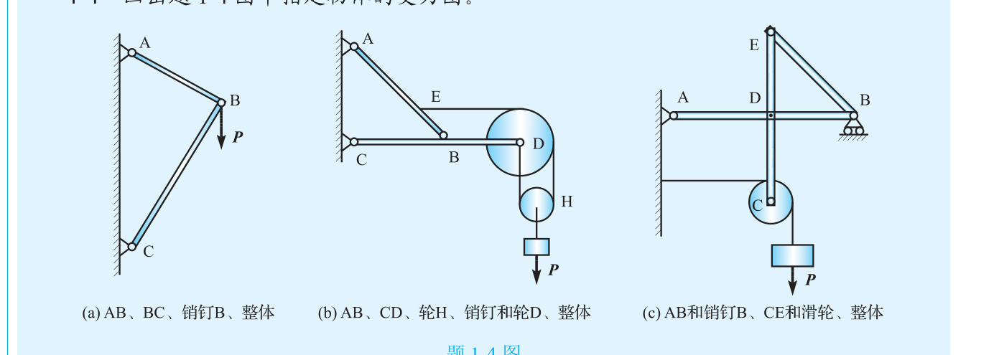
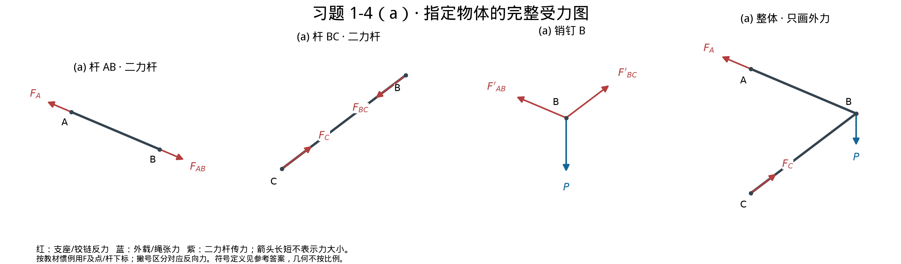
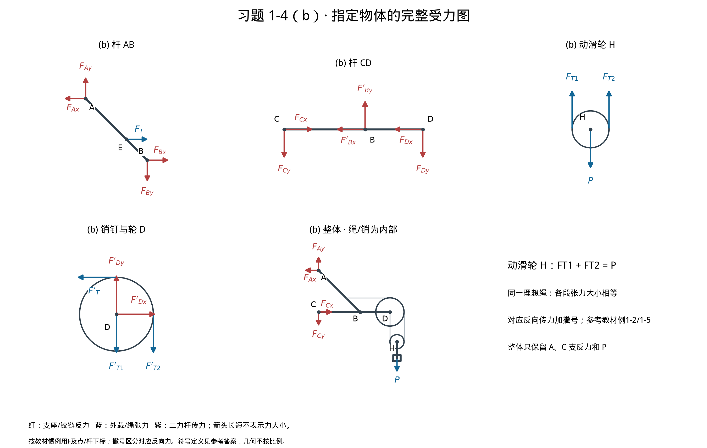
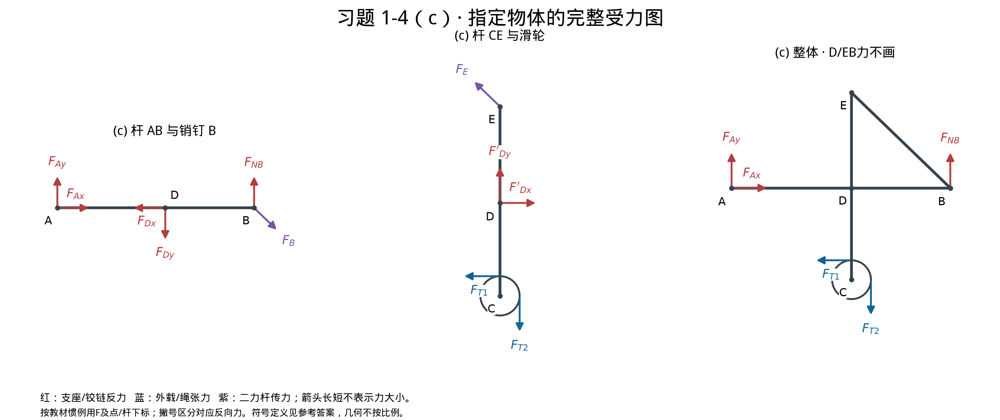
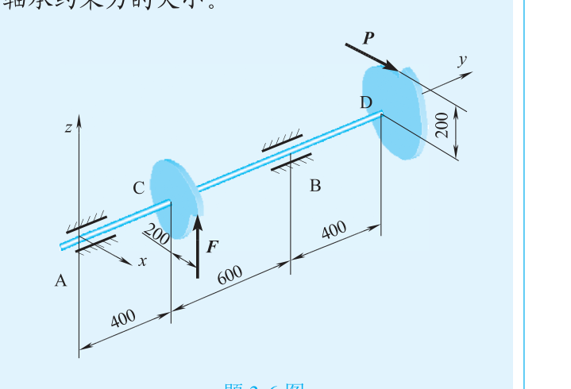
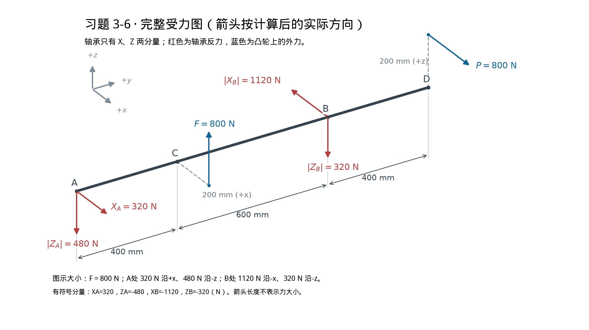
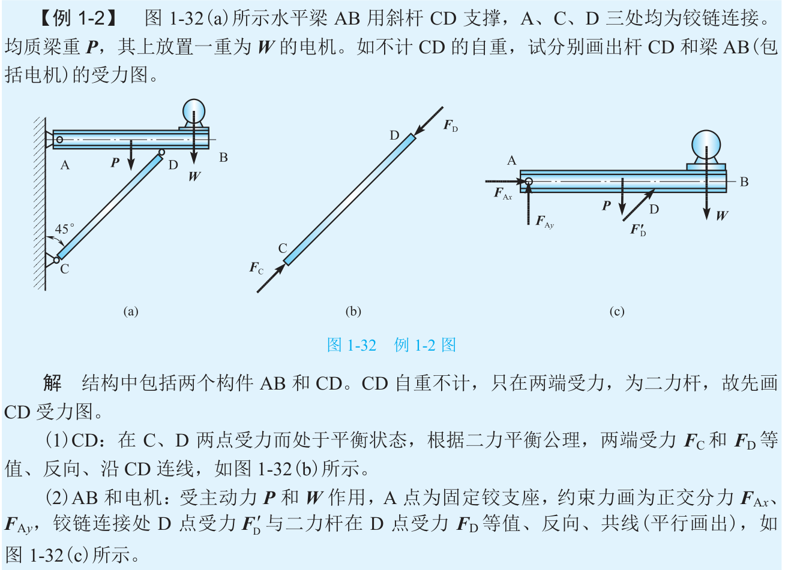
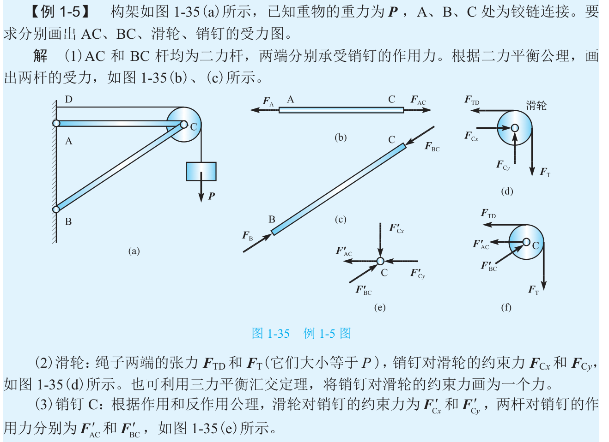

# 2026-09-29 作业 · 参考答案（1-4、3-6）

> 3-6 数值与教材答案页（框架版 PDF **第 289 页**，从 1 开始计页）逐项一致，另经独立向量法复核。
> 1-4 为受力图题，书后无第 1 章答案，按约束性质独立给出，不能声称核对了本题官方答案。
> **2026-10-02 标注校准**：本版采用教材例1-2、例1-5的 F 系列及撇号惯例；此前的
> N_AB,A / N_AB,B 等长后缀属于解释性自定义记号，**已撤换，不作为本稿作业标注**。
> 物理受力关系及3-6结果不变；1-4(c)的D铰两分量已补齐。教材原页标注依据附在文末。

---

## 习题 1-4 · 受力图

**原题图**（教材第26页＝框架版PDF第31页＝原件一卷PDF第34页）：



约定：构件自重和摩擦按题中理想约束忽略；铰链反力画两个正交分量；二力杆两端力
等大、反向、共线；理想绳的各段张力大小相等。图中几何及箭头长度不表示题设尺寸或力的比例。
铰链未知分量的箭头是**假定正向**，不等于未计算便确定了实际方向。

### 本稿采用的教材惯例

- **作用点/构件下标**可以区分不同的力。教材第20页例1-2，二力杆两端分别写 F_C、F_D；并非“所有不同的力都必须加撇号”。
- **另一侧的对应反向受力用撇号**。同例在另一构件上写 F_D′；第22页例1-5，杆上的 F_AC 与销钉上的 F_AC′ 配对。本稿(a)严格按例1-5的形式安排符号。
- 撇号用来区分所定义的一对对应反向力，不是导数。力的大小可以相等，但力矢量反向；绳两端的对应反向传力按教材例1-3同样采用撇号。
- 不同方向/绳段也可以用数字下标，如 F_T1、F_T2。不能因为“两个力不同”就机械地加撇，更不能据此把两个本来同向的绳力画成反向。
- **这是本书实际采用的常见记法，不是唯一合法记法，更不是教师评分保证。**没有任课老师的板书或额外要求，不能断言老师一定不批注；若老师明确指定符号，以其要求为准。

### (a) 对象：AB、BC、销钉B、整体



| 符号 | 所指的力 | 作用点/方向 |
|---|---|---|
| $F_A$ | A处支座对杆AB的力 | A端，沿BA向左上 |
| $F_{AB}$ | 销钉B对杆AB的力 | B端，沿AB向右下 |
| $F'_{AB}$ | 杆AB对销钉B的力 | 销钉B，沿BA向左上 |
| $F_C$ | C处支座对杆BC的力 | C端，沿CB向右上 |
| $F_{BC}$ | 销钉B对杆BC的力 | B端，沿BC向左下 |
| $F'_{BC}$ | 杆BC对销钉B的力 | 销钉B，沿CB向右上 |

- **杆AB**：只受 F_A、F_AB 两个外力，是二力杆。二力等大、反向、沿AB；AB受拉。
- **杆BC**：只受 F_C、F_BC 两个外力，是二力杆。二力等大、反向、沿BC；BC受压。
- **销钉B**：受 F_AB′、F_BC′ 与向下的 P，三力汇交于B。分别与两杆在B端所受的力反向。
- **整体**：只画 F_A、F_C 与向下的 P。内部连接力不画。

**关于原图两个N_AB的结论**：同一根二力杆两端的力大小相等，因此共用一个大小名称并不必然违反力学；
但本稿现用 **F_A / F_AB** 分开表示，更贴近这本教材。F_A与F_AB都作用在AB上，是二力杆的
一对**平衡力，不是第三定律的一对作用力与反作用力**；F_AB与F_AB′作用在杆、销两个物体上，才是
一对作用力与反作用力。另一杆的力大小不默认与AB杆相等。

### (b) 对象：AB、CD、轮H、销钉和轮D、整体



符号定义：E处杆AB受绳力 F_T（向右），轮D顶部受对应的 F_T′（向左）；轮H左、右绳力
分别为 F_T1、F_T2（均向上）；轮D轴心与右侧绳力分别为 F_T1′、F_T2′（均向下）。
同一理想绳使上述各力**大小相等**，均为 P/2。轮H图中向下的 P 是连接件传来的拉力大小，
等于重物重力大小，不是轮H自身的重力。

- **杆AB**：A处两分量 F_Ax、F_Ay；E处 F_T；B处两分量 F_Bx、F_By。共5个力分量，不是二力杆。
- **杆CD**：C处 F_Cx、F_Cy；B处 F_Bx′、F_By′，与AB上的对应分量反向；D处 F_Dx、F_Dy。共6个力分量。
- **轮H**：左、右分别 F_T1、F_T2 向上，连接件拉力 P 向下。由平衡，F_T1＋F_T2＝P；由理想绳，F_T1＝F_T2＝P/2。
- **销钉和轮D（合取）**：顶部切线 F_T′ 向左，右侧切线 F_T2′ 向下，轴心绳端 F_T1′ 向下；另有 F_Dx′、F_Dy′，与CD上的D分量反向。共5个力分量，不能漏轴心的第三项绳力。
- **整体**（杆、销、绳、滑轮及所吊重物一起取）：只画A、C处四个支反力分量和向下的 P。各连接力与绳张力均为内力，不画。

### (c) 对象：AB和销钉B、CE和滑轮、整体



EB两端铰接、中间无载，是二力杆。用 F_B 表示EB对AB/B的力，用 F_E 表示EB对CE/E的力；
因为EB是二力杆，这两项传力等大反向、沿EB，**不是AB与CE直接接触的一对作用反作用**。
B处水平辊轴支座的反力记 F_NB（竖直）。滑轮水平、竖直绳力分别记 F_T1、F_T2，二者大小均等于P。

**D是AB与CE的连接铰：分离任一杆时均须画D两分量，取整体才消去。**

- **AB和销钉B**：A处 F_Ax、F_Ay；D处 F_Dx、F_Dy；B处竖直 F_NB；B处沿EB的 F_B（图示向右下）。共6个力分量。
- **CE和滑轮**：E处沿EB的 F_E（图示向左上）；D处 F_Dx′、F_Dy′，与AB上的对应分量反向；滑轮顶部向左的 F_T1、右侧向下的 F_T2。共5个力分量，两项绳力沿轮缘切线作用。
- **整体**（杆、销、滑轮；绳与重物不包含在对象内）：只画A处两分量、B处 F_NB，以及向左 F_T1、向下 F_T2。D铰力与EB传力为内力，不画。

### 受力图自查

| 检查项 | 应有内容 |
|---|---|
| (a) 杆端和销钉 | 杆AB在B端 F_AB，销钉上 F_AB′；BC在B端 F_BC，销钉上 F_BC′ |
| (a) 同杆两端 | F_A/F_AB与F_C/F_BC分别等大、反向、共线，属于二力平衡 |
| (b) 轮H | 两项向上的 F_T1/F_T2、一项向下的 P；每项绳力大小P/2 |
| (b) 轮D | 顶部 F_T′、右侧 F_T2′、轴心 F_T1′，另有轴心两分量 |
| (b) B、D两侧 | 对应分量加撇，箭头反向 |
| (c) D点 | AB和CE都画D两分量，且对应反向 |
| (c) EB传力 | F_B/F_E沿EB、等大反向；与竖直的 F_NB不同 |
| (c) 绳力 | 水平 F_T1、竖直 F_T2，均沿轮缘切线，大小P |
| 所有整体图 | 只画该研究对象的全部外力，不重复计入内力 |

---

## 习题 3-6 · 求 F 与轴承约束力

**原题图**（教材第 73 页＝框架版 PDF 第 78 页＝原件一卷 PDF 第 81 页）：



### 完整受力图



图中箭头按**实际方向**画；负分量的标签用绝对值表示力的大小，下表保留有符号分量。

**建系**：以 A 为原点，轴沿 y（A→D 为正）；x、z 按原题图，z 竖直向上。
轴承 A、B 为径向轴承，反力各只有 X、Z 两分量，没有 y 向反力和反力偶。

**位置**（mm）：轴线 A＝0，C＝400，B＝1000，D＝1400；
F 的作用点为 `(200,400,0)`，P 的作用点为 `(0,1400,200)`。

**主动力**：C 凸轮上的 F 沿 +z；D 凸轮上的 P＝800 N 沿 +x；对 y 轴的两个力臂均为 200 mm。

### 五个非平凡平衡方程

**(1) 对轴 y 取矩（扭矩平衡），求 F：**

按右手系，F 产生 −y 向力矩，P 产生 +y 向力矩：

ΣM_y＝0：−200F＋200P＝0，故 **F＝P＝800 N**。

**(2) 对 A 取 x 轴力矩，求 Z_B：**

ΣM_x(A)＝0：400F＋1000Z_B＝0，

Z_B＝−400×800/1000＝**−320 N**。

**(3) 沿 z 方向列合力方程，求 Z_A：**

ΣF_z＝0：Z_A＋Z_B＋F＝0，

Z_A＝−800＋320＝**−480 N**。

**(4) 对 A 取 z 轴力矩，求 X_B：**

ΣM_z(A)＝0：−1400P−1000X_B＝0，

X_B＝−1400×800/1000＝**−1120 N**。

**(5) 沿 x 方向列合力方程，求 X_A：**

ΣF_x＝0：X_A＋X_B＋P＝0，

X_A＝−800＋1120＝**320 N**。

本题所有力的 y 分量均为 0，因此第六个方程 ΣF_y＝0 恒成立。
力矩方程统一采用 N·mm；力的结果单位为 N。

### 结果（与教材答案页逐项一致）

| 量 | 有符号分量 (N) | 实际方向 |
|---|---|---|
| F | 800 | +z，向上 |
| X_A | 320 | +x |
| Z_A | −480 | −z，向下 |
| X_B | −1120 | −x |
| Z_B | −320 | −z，向下 |

负号表示实际方向与所设坐标正向相反。各反力分量大小分别为 320、480、1120、320 N。
两处轴承合反力的大小还可写为：

- A：R_A＝√(320²＋480²)＝160√13 ≈ **576.9 N**；
- B：R_B＝√(1120²＋320²)＝160√53 ≈ **1164.8 N**。

### 关键结果自查表

| 检查 | 期望 | 代入结果 |
|---|---|---|
| ΣF_x＝X_A＋X_B＋P | 0 | 320−1120＋800＝0 ✔ |
| ΣF_z＝Z_A＋Z_B＋F | 0 | −480−320＋800＝0 ✔ |
| ΣM_x(A)＝400F＋1000Z_B | 0 | 320000−320000＝0 ✔ |
| ΣM_z(A)＝−1400P−1000X_B | 0 | −1120000＋1120000＝0 ✔ |
| ΣM_y＝−200F＋200P | 0 | −160000＋160000＝0 ✔ |
| 与教材答案（框架版 PDF 第 289 页） | F＝800；320/−480/−1120/−320 | 一致 ✔ |

## 配图复现与核验

在仓库根运行（依赖：numpy、matplotlib、Pillow、pymupdf；核验还需 markdown-it-py、python-docx）：

```bash
.venv/bin/python scripts/generate_mechanics_homework_20260929.py
.venv/bin/python scripts/verify_mechanics_homework_20260929.py
```

生成器先自检再作图；独立核验检查分离体外力完整性、内部力成对反向、合力与力矩、
3-6 的独立线性求解，以及 Markdown 是否**真的渲染出图片且引用文件可解码**。
1-4 的验算用自选示意几何，不代表题设尺寸或官方答案；图像的几何含义仍须人工对照原题复核。
旧入口 `制作解答图-1-4.py`、`制作解答图.py` 仍可运行；`图/解答-1-4.png` 保留为修正后的总图。


## 标注依据：本教材原页，而非本题官方答案

下面两张是教材PDF的**原页裁片**，没有重绘或替换符号。它们只能证明本书的标注惯例，
不代表本题1-4已经获得官方答案或任课老师评分认可。

### 教材第20页 · 例1-2、图1-32

框架版PDF第25页＝原件一卷PDF第28页。图中二力杆两端是 F_C、F_D，另一构件的D点是 F_D′。
原文明确说明两端F_C、F_D等值反向，以及F_D′与杆在D点的F_D等值反向。
这同时证明：**不同作用点可以用不同字母下标；另一侧对应反向力用撇号。**



### 教材第22页 · 例1-5、图1-35

框架版PDF第27页＝原件一卷PDF第30页。杆AC两端写 F_A、F_AC，杆BC两端写 F_B、F_BC；
销钉所受两杆力写 F_AC′、F_BC′。本题(a)的 F_A/F_AB、F_C/F_BC 和销钉上的撇号力采用这一形式。
图中滑轮约束力与销钉所受滑轮力也分别用无撇、有撇的对应分量表示。



**教师要求的边界**：现有资料中没有老师针对习题1-4的符号模板/评分细则。因此可以确认本稿
记法有教材实例依据、受力关系自洽，但不能保证老师绝不批注。若老师明确统一了N、R或其他符号，
应保留这些物理关系，改用其指定符号；不应靠“我已定义过”来忽略课程格式要求。
