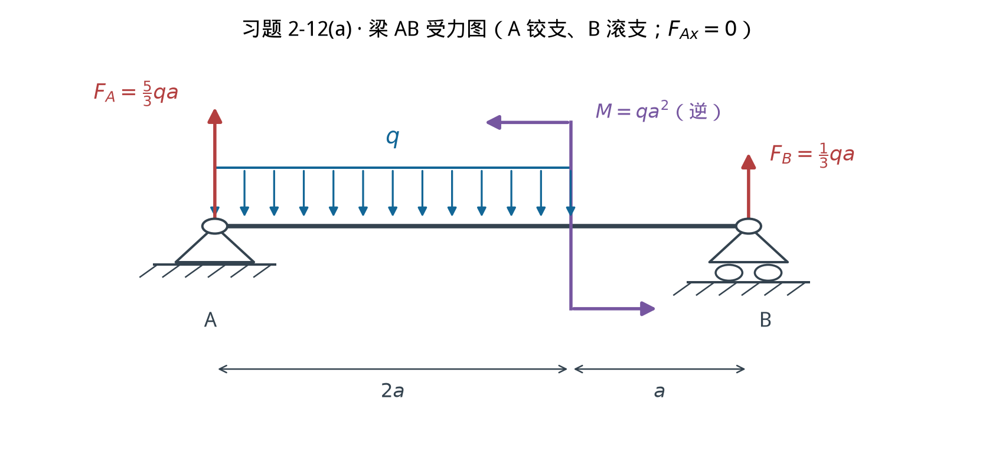
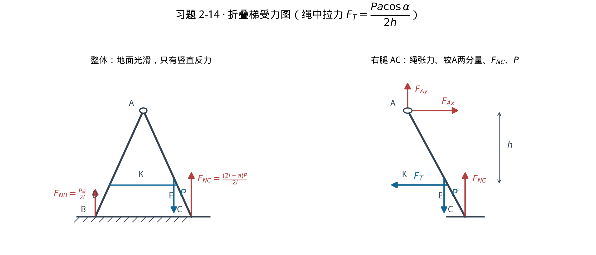
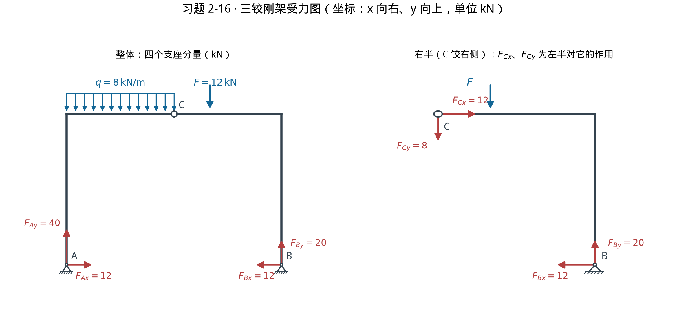

# 2026-10-09 作业参考答案 · 习题 2-12(a)、2-14、2-16

> 用途：导师自检与复盘，**不交这份**；打印手写请用同目录作业单（不含答案）。
> 约定：坐标 x 向右、y 向上；力矩以**逆时针为正**；结果先给方向再给大小。
> 三题均先由 `scripts/generate_mechanics_homework_20261009.py` 内的 numpy 线性系统自检，
> 再与教材答案页（**框架版 PDF 第 289 页**）逐位对照；对不上脚本直接 raise，不出图。
> 受力图见 `图/解答-*.png`（示意，箭头长短不表示力的大小）。

---

## 2-12(a) 梁 AB 的约束力

**受力图**：A 为固定铰，本应两分量；但全梁无水平载荷，故 $F_{Ax}=0$，A 处反力竖直记 $F_A$。
B 为可动铰，反力 $F_B$ 竖直向上。均布载荷合力 $2qa$，作用在 $x=a$（均布段中点）。
力偶 $M=qa^2$ 为**逆时针**（图中上←、下→），力偶对任一点之矩都等于 $+qa^2$。

**方程**（全梁，3 个未知量退化为 2 个）：

$$\sum F_x=0:\quad F_{Ax}=0$$

$$\sum M_A=0:\quad F_B\cdot 3a-2qa\cdot a+qa^2=0 \;\Rightarrow\; F_B=\frac{qa^2}{3a}=\frac{1}{3}qa\ (\uparrow)$$

$$\sum F_y=0:\quad F_A=2qa-F_B=\frac{5}{3}qa\ (\uparrow)$$

**独立校核**（对 B 取矩，不经过上面任一式）：
$-F_A\cdot3a+2qa\cdot2a+qa^2=-5qa^2+4qa^2+qa^2=0$ ✔

**教材答案页对照**：$F_A=\frac{5}{3}qa$，$F_B=\frac{1}{3}qa$ —— **逐位一致**。

---

## 2-14 折叠梯绳中拉力

**几何**：腿与地面夹角 $\alpha$，腿长 $l$，则顶点高 $H=l\sin\alpha$、半跨 $l\cos\alpha$；
$B=(-l\cos\alpha,\,0)$，$C=(+l\cos\alpha,\,0)$，$A=(0,\,H)$。
K 在右腿上、距脚 C 沿腿 $a$，故 $x_K=(l-a)\cos\alpha$。绳 DE 水平，A 到绳的竖直距离为 $h$。

**整体**（地面光滑 ⇒ 只有竖直反力 $F_{NB},F_{NC}$）：

$$\sum F_y=0:\quad F_{NB}+F_{NC}=P$$

$$\sum M_B=0:\quad F_{NC}\cdot 2l\cos\alpha-P\,(x_K+l\cos\alpha)=0
\;\Rightarrow\; F_{NC}=\frac{P(2l-a)}{2l},\qquad F_{NB}=\frac{Pa}{2l}$$

**右腿 AC**（受 $F_{NC}\uparrow$、$P\downarrow$ 于 K、绳张力 $F_T$ 于 E **指向 D（水平向左）**、铰 A 两分量）：

$$\sum M_A=0:\quad F_{NC}\,l\cos\alpha-P\,x_K-F_T\,h=0$$

代入 $F_{NC}$ 与 $x_K=(l-a)\cos\alpha$：

$$F_T\,h=\frac{P(2l-a)\cos\alpha}{2}-P(l-a)\cos\alpha=\frac{Pa\cos\alpha}{2}$$

$$\boxed{F_T=\frac{Pa\cos\alpha}{2h}}\quad(\text{绳受拉})$$

**独立校核**（改用**左腿** AB，不经过右腿方程）：左腿受 $F_{NB}\uparrow$ 于 B、绳张力 $F_T$ 于 D **指向 E（水平向右）**、铰 A 反作用力。
$\sum M_A=0:\ -F_{NB}\,l\cos\alpha+F_T\,h=0 \Rightarrow F_T=\dfrac{Pa}{2l}\cdot\dfrac{l\cos\alpha}{h}=\dfrac{Pa\cos\alpha}{2h}$ ✔ 与右腿结果相同。

**教材答案页对照**：$F_T=\dfrac{Pa\cos\alpha}{2h}$ —— **一致**。副产品 $F_{NB}=\frac{Pa}{2l}$、$F_{NC}=\frac{P(2l-a)}{2l}$。

---

## 2-16 三铰刚架六个约束力分量

**坐标与载荷**：$A(0,0)$、$B(12,0)$、顶梁 $y=8$、铰 $C(6,8)$。
均布载荷合力 $W=q\cdot6=48\ \text{kN}$，作用在 $x=3$；$F=12\ \text{kN}\downarrow$ 作用在 $x=8$（距右角 4m、距 C 2m）。

**整体**：

$$\sum M_A=0:\quad 12F_{By}-48\cdot3-12\cdot8=0 \;\Rightarrow\; F_{By}=20\ \text{kN}\ (\uparrow)$$

$$\sum F_y=0:\quad F_{Ay}=48+12-20=40\ \text{kN}\ (\uparrow)$$

**右半（C 铰右侧：顶梁 C→右角＋右柱）**，对 C 取矩（B 相对 C 为 $(6,-8)$，F 作用点相对 C 为 $(2,0)$）：

$$\sum M_C=0:\quad 6F_{By}+8F_{Bx}-12\cdot2=0 \;\Rightarrow\; F_{Bx}=\frac{24-120}{8}=-12\ \text{kN}$$

即 $F_{Bx}$ 大小 **12 kN，方向向左（−x）**。

$$\sum F_x=0\ (\text{整体}):\quad F_{Ax}=-F_{Bx}=+12\ \text{kN}\ (\rightarrow)$$

**右半投影**（$F_{Cx},F_{Cy}$ 记为左半对右半的作用）：

$$\sum F_x=0:\quad F_{Cx}+F_{Bx}=0 \Rightarrow F_{Cx}=+12\ \text{kN}\ (\rightarrow)$$
$$\sum F_y=0:\quad F_{Cy}+F_{By}-12=0 \Rightarrow F_{Cy}=-8\ \text{kN}\ (\text{即左半压右半向下 }8\ \text{kN})$$

**独立校核**（左半对 C 取矩，A 相对 C 为 $(-6,-8)$，均布合力相对 C 为 $(-3,0)$）：
$(-6)(40)-(-8)(12)+(-3)(-48)=-240+96+144=0$ ✔

**教材答案页对照**：$F_{Ax}=12$、$F_{Ay}=40$、$F_{Bx}=12$、$F_{By}=20$、$F_{Cx}=12$、$F_{Cy}=8$（kN）—— **六个分量大小全部一致**；本稿另给出方向（$F_{Bx}$ 向左、$F_{Cy}$ 为左半对右半向下）。

---

## 关键结果自查表

| 题 | 量 | 结果 | 方向/转向 | 教材答案页 | 核对 |
|---|---|---|---|---|---|
| 2-12(a) | $F_{Ax}$ | 0 | — | （未列，无水平载荷） | 推理 |
| 2-12(a) | $F_A$ | $\frac{5}{3}qa$ | ↑ | $\frac{5}{3}qa$ | ✔ 逐位 |
| 2-12(a) | $F_B$ | $\frac{1}{3}qa$ | ↑ | $\frac{1}{3}qa$ | ✔ 逐位 |
| 2-14 | $F_T$ | $\frac{Pa\cos\alpha}{2h}$ | 绳受拉 | 同式 | ✔ |
| 2-14 | $F_{NB}$ / $F_{NC}$ | $\frac{Pa}{2l}$ / $\frac{P(2l-a)}{2l}$ | ↑ / ↑ | （未列） | 左腿独立复核 |
| 2-16 | $F_{Ax}$ / $F_{Ay}$ | 12 / 40 kN | → / ↑ | 12 / 40 | ✔ |
| 2-16 | $F_{Bx}$ / $F_{By}$ | 12 / 20 kN | ← / ↑ | 12 / 20 | ✔ |
| 2-16 | $F_{Cx}$ / $F_{Cy}$ | 12 / 8 kN | 左半推右半 → / ↓ | 12 / 8 | ✔ |

## 边界说明

- 2-12 只做了 **(a)**（老师指定）；(b) 未做，教材答案页 (b) $F_A=45$kN、$F_B=15$kN 仅作存档记录。
- 2-14 的 $h$ 是**顶点 A 到绳 DE 水平线**的竖直距离（照图标注），不是顶点到地面的高度；
  $a$ 是 **K 到脚 C** 的沿腿距离。这两处读法直接决定结果，已用左右两腿各自取矩互证。
- 2-16 的 F 作用点按图读为**距右角 4m**（即 $x=8$、距 C 2m）；若误读为距 C 4m，
  整体对 A 取矩将得 $F_{By}=22$ kN，与教材答案页不符——故本读法由答案页反向确证。
- 三题解答图为受力分析示意；几何比例不保证与原图一致，尺寸以题面标注为准。
