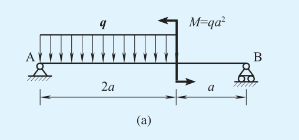
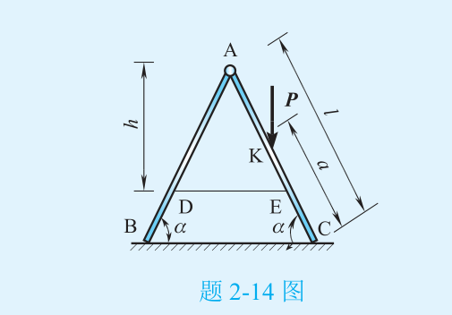
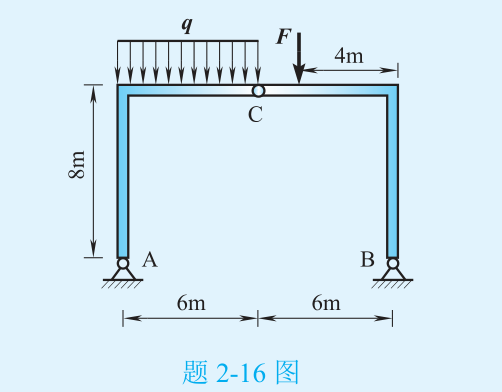

# 2026-10-09 作业题面 · 习题 2-12(a)、2-14、2-16

> 底本：杨庆生、杜家政、雷钧 主编《工程力学（第三版）》（科学出版社）。
> 本批所在章节的页码换算：**框架版 PDF 页＝教材页＋5；原件一卷 PDF 页＝教材页＋8**。
> 下列 PDF 页码均从 1 开始计数，不是程序中从 0 开始的索引。
> 两题所在页（教材53、54）在框架版与原件一卷中，文本和 72 dpi 渲染像素均一致
> （生成脚本 `scripts/generate_mechanics_homework_20261009.py` 内有断言）。

## 习题 2-12（教材第 53 页；框架版 PDF 第 58 页；原件一卷 PDF 第 61 页）

**2-12** 试计算题2-12图所示各梁的约束力。**本批只做 (a)。**

(a) 图读法（照图记录，不推改）：

- 梁 AB：A 端为**固定铰支座**，B 端为**可动铰支座**（滚支）。
- 自 A 起长 **2a** 的区段受**均布载荷 q**（向下）；
- 在距 A 为 2a 处作用**力偶 M＝qa²**，图中上箭头向左、下箭头向右，即**逆时针**；
- 力偶作用点之后至 B 长 **a**。全梁长 3a。

## 习题 2-14（教材第 54 页；框架版 PDF 第 59 页；原件一卷 PDF 第 62 页）

**2-14** 如题2-14图所示，折叠梯子由AB和AC两部分在A点铰接，并在D、E两点用水平绳索相连。梯子放在光滑的水平面上。当重力为P的人站在梯子的K点时，绳中的拉力为多大？

图读法：

- 人字梯：顶点 **A** 为铰；左腿 **AB**、右腿 **AC**，脚 B、C 落在**光滑水平面**（只有竖直反力）；
- **D、E** 分别在左、右腿上，用**水平绳**相连；
- 人重 **P** 竖直向下，作用在**右腿 AC 上的 K 点**；
- 尺寸：**h** ＝ 顶点 A 到绳 DE 水平线的**竖直距离**；**l** ＝ 腿 AC 全长；**a** ＝ K 点沿腿到脚 C 的距离；**α** ＝ 两腿与地面的夹角（两侧同标）。

## 习题 2-16（教材第 54 页；框架版 PDF 第 59 页；原件一卷 PDF 第 62 页）

**2-16** 三铰刚架如题2-16图所示，已知F=12kN，q＝8kN/m，试求固定铰支座A、B和铰链C处的约束力。

图读法（取 x 向右、y 向上，A 为原点）：

- **A(0,0)、B(12,0)** 均为**固定铰支座**；柱高 **8m**；顶梁水平，**铰 C 在顶梁中点 (6,8)**；
- **q＝8kN/m** 布满**左半顶梁**（左上角→C，长 6m）；
- **F＝12kN** 竖直向下，作用在顶梁上、**距右角 4m** 处（即 x＝8，距 C 为 2m）；
- 底跨 6m＋6m。

完整解答与受力图见 [参考答案](参考答案.md)；打印手写用 [作业单](工程力学作业单（2-12a、2-14、2-16）.docx)（**不含答案**）。
