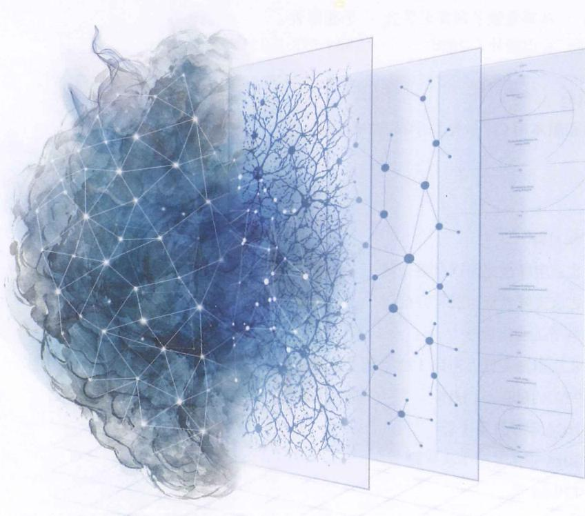
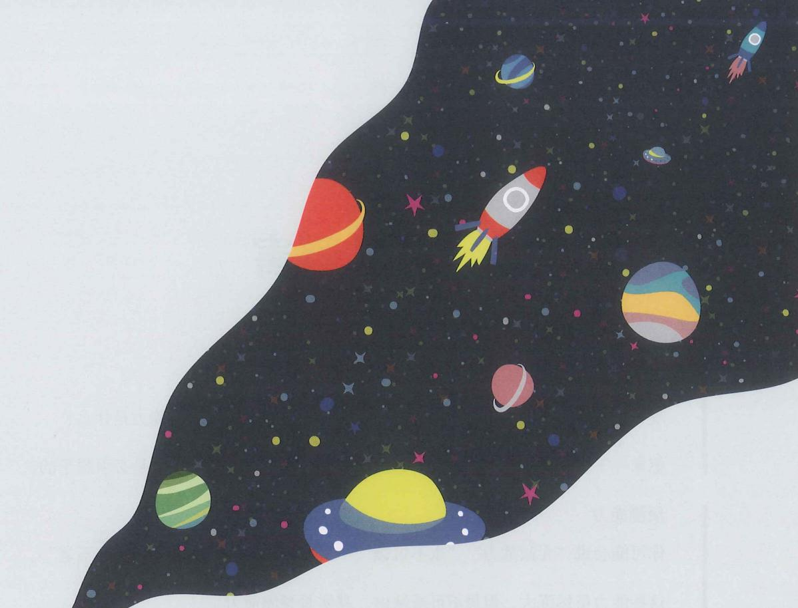

# 从感觉懂了到真正学会

于建国（YJango）著

電子工業出版社

Publishing House of Electronics Industry  

北京·BEIJING

## 内容简介

如今，人类已经为机器学习建立了完整的描述体系，但对人类自身的学习却仍停留在模糊的直觉层面，连“学习是在做什么”“知识是什么”“怎样才算学会”等基本问题，往往只能凭感觉回答，无法准确描述——就如同在物理学出现之前，人们仅凭直觉解释自然现象一样。

缺乏精确的描述体系，就难以有效分析和改进学习。

本书旨在为学习建立一套系统化框架，仿照物理学描述自然现象、医学描述人体与疾病的方式，对学习的目标、知识类型、材料类型、学习方式、验证手段及失败类型，进行系统的分类与定义。

可以说，本书是“学习的解剖学”，能够帮助读者像医生分析病情、工程师分析系统一样，理解、诊断并优化自己的学习。

未经许可，不得以任何方式复制或抄袭本书之部分或全部内容。

版权所有，侵权必究。

## 图书在版编目（CIP）数据

学习观：从感觉懂了到真正学会 / 于建国著。

北京：电子工业出版社，2026.7.--ISBN978-7-121

-53141-5

I. G442

中国国家版本馆 CIP 数据核字第 202648UB98 号

责任编辑：张月萍

印刷：北京宝隆世纪印刷有限公司

装订：北京宝隆世纪印刷有限公司

出版发行：电子工业出版社

北京市海淀区万寿路 173 信箱

邮编：100036

开 本： $720\times 1000$ 1/16

印张：22

字数：457.6 千字

版次：2026年7月第1版

印 次：2026年7月第1次印刷

定价：129.00元

凡所购买电子工业出版社图书有缺损问题，请向购买书店调换。若书店售缺，请与本社发行部联系，联系及邮购电话：（010）88254888，88258888。

质量投诉请发邮件至 zlts@phei.com.cn，盗版侵权举报请发邮件至 dbqq@phei.com.cn。

本书咨询联系方式：faq@phei.com.cn。

## 序言

如果你正在为这样的事苦恼——自己学新东西缓慢，孩子读书吃力，学生成绩总是难以提高——并且试遍了各种“高效方法”，却收效甚微，那么，这本书正是为你准备的。

本书的解决方案与你以往看到的任何一本有关“学习方法”的书都不同。在本书中，不会给你罗列“以教促学、联想记忆、保持专注、定期复习”等达成目标的手段（方法），并非这些手段有问题，而是任何手段都必须由正确的行为目标来驱动，否则就会被执行得走形。

拿增肌来说，增肌的手段是运动，但只有以“肌纤维微损伤”为目标来驱动的运动，才能增肌。如果不明确目标，同样是运动，却可能被执行成减肥。

这正是多数人学习低效的症结所在：他们从一开始就不知道“学习”这一行为究竟在达成什么具体的、可验证的目标，以至于不管什么学习方法（手段），都会被他们执行成低效的学习方法（手段）。就好比习惯了抛石头的人，拿到枪后，还是把它当石头抛。

不妨做个自我检测，假如你（或你的孩子、学生）第一次接触下面这段讲解材料：

函数：自变量的每个取值仅对应唯一一个因变量的取值。

你会怎么学？

是否是：反复阅读，直到“感觉懂了”，然后努力记住这句话？

如果是，那你并不孤单。这可能是世上最普遍的学习方式。可问题在于“感觉懂了”并不是一个明确的行为目标。以感觉来驱动学习，会导致：当时感觉看懂了，转眼又感觉什么都没学；无法通过对照目标来判断是否完成了学习，总是担心做得不够，只能依赖读了几遍、抄了几遍、画了什么图等“仪式”来宣告结束，并错把“记住讲解”等同于“学会知识”，一旦想不起来讲解，就感觉白学了；无法根据“完成度”接着学习，复习实质上变成了重学，学得越多，担子越重。

长此以往，学习就被异化成了一种高消耗、低回报、令人望而生畏的苦役。此时，辛苦寻来的“高效学习法”，只会让学习仪式变得更加复杂。

因此，为了打破这种循环，本书将带你回归源头，为你揭示：在学习中，那个如同“肌纤维微损伤”一般，真正该瞄准的、可验证的行为目标是什么。一旦瞄准了它，再简单的方法在你手中都会变成高效学习法。就像明白了刀的原理，万物皆可为刃。

在此基础上，本书将系统梳理“知识的基本组成、学习材料的种类、材料的选择与使用、学会的验证标准”，为学习搭建一套“诊断 $\rightarrow$ 开方 $\rightarrow$ 执行 $\rightarrow$ 复诊”框架。

换言之，这不是一本为你添加更多执行（学习）技巧的书，而是一本帮你重建学习系统的书。正因如此，如果你期待的是方法清单或速成技巧，本书或许并不适合你；但如果你愿意从根本上重塑自己的学习系统，那么，请翻开下一页。

## 目录

## 第一部分 如何认识世界 / 1

01 何以避害 / 2  

02 类化应对 / 7  

03 模型预测 / 19  

04 抽象层级 / 26  

05 下上结构 / 33  

06 概念世界 / 41  

07 记忆编码 / 53  

08 自主优劣 / 65  

09 类固有观 / 75  

10 创类依据 / 87  

11 理论不一 / 96  

12 知识革新 / 101  

13 概念代理 / 111  

14 能指所指 / 117  

15 语言世界 / 127  

16 脱离现实 / 135

## 第二部分 如何量化学习 / 147

17 信息推测 / 148  

26 下上材料 / 244  

18 判别模型 / 162  

27 下料用法 / 257  

19 联结模型 / 171  

28 上料用法 / 265  

20 坍缩原因 / 184  

29 上料前提 / 271  

21 学习记忆 / 195  

30 下上结合 / 280  

22 四维框架 / 211  

31 验证环节 / 286  

23 创继视角 / 216  

32 判别材料 / 292  

24 不适教育 / 226  

33 联结材料 / 311  

25 下上视角 / 232  

34 渐构靶图 / 330

