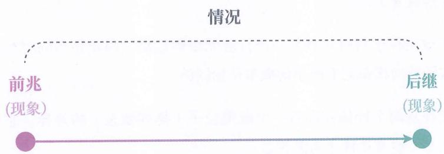

# 第一部分 如何认识世界

我们知道，医学没有“万能药”，只有对症下药；学习也是，没有“万能仪式”，只有因材施教。能否提高学习效率，关键不在于“药”，在于“对症”，也就是：基于学习者的当前状况，分析出合适的讲解材料与学习方式。

想做出科学的分析，就必须理解人脑是如何认识世界的，以及知识本身具有什么样的特性。就像医生需要理解人体构造与疾病机理，才能做出科学诊断。

本书的第一部分，就是要带你梳理大脑是如何利用概念和语言来认识现实世界的。在这一过程中，学习这一行为所应达成的、可被验证的目标，也将自我显现。

注：本书中的段落使用了不同颜色的线条进行标记，蓝色表示抽象描述，红色表示具体例子，黄色表示类比或对比，灰色表示其他说明性内容。对各种类型内容的具体学习方式后续会讲，现在你只需试着将红色和黄色段落的内容，依据对应的蓝色段落的内容进行归纳理解即可。

## 01

## 何以避害

## 什么不能少

现在，请你思考第一个问题：对生命而言，最不可或缺的一项能力是什么？

想象一下, 如果你是女娲, 要让人类生生不息, 造人时, 哪种能力是必须赐予的?

预测能力

你可能会说“无敌战力”“永不饥饿”“百毒不侵”，或是干脆“长生不老”。

这些能力虽然强大，但最不可或缺的，其实是预测能力。

有了预测能力，人就能避开敌不过的猛兽，不食有毒之物，提前种植食物。

倘若没有预测能力，个体将寸步难行，还未来得及衰老，就可能因车祸、中暑或冻伤而亡。我们之所以不会被车辆撞到，是因为大脑预测出了向哪个方向移动能避开车辆；我们之所以能避免被冻伤，也是因为大脑预测出了穿什么衣服可以保持体温。

想象一下，我们要如何消灭一个能够完美预知未来的人？除非他自己想被消灭，否则我们对他的任何不利行为，都会被他提前知晓并规避。

因此，对生命而言，不可或缺的一项能力是预测。

## 时刻预测

之所以很多人没有第一时间想到预测能力，是因为它无时无刻不在运作，反而会像呼吸一样容易被人忽视。

预测能力时刻支撑着我们生存。我们的每一个决策——大到留学、就业、择偶、投资，小到走路、开灯、倒水、购物——都有预测能力在支撑。

## 翻页

哪怕是不经意的翻页动作，也是你基于大脑预测翻页后将会看到后续内容而采取的行动。你平时不会注意到这些预测，但如果翻页后看到的是一片空白，你就会立刻察觉到异样，因为这与你大脑的预测不符。

## 让路

还有一个现象更能说明大脑在时刻进行预测：当两个快要相撞的人为了避让对方时，常常同时移向同一侧，而且往往接着会同时移向另一侧，从而进入一个反复阻挡对方的怪圈。之所以出现这种情况，是因为双方的大脑始终在预测对方的走向，并据此下意识地做出反应。

## 如何塑造

成年人能够预测开水溅到身上会导致烫伤，而年幼的孩子却不能；医生能够预测心脏骤停的患者是否能够恢复，而普通人却无法做到……也就是说，人们对许多事物的预测能力并非先天具备。

那么，预测能力究竟从何而来？我们又该如何塑造预测能力呢？

## 情况

一个办法是记忆曾经发生的情况，等遇到一模一样的情况时，通过回忆来预测会发生什么。

这里的“情况”是指某件事发生前的前兆和之后出现的后继，如图1-1所示。

图 1- 1

## 现象对象

某情况的前兆和后继都被称为“现象”或“对象”。

## 触摸烫伤

例如，“小明触摸开水壶被烫伤了”是一个情况。其中，“小明触摸开水壶”是前兆，“被烫伤了”是后继。二者都是现象 / 对象。

## 经验

已经历的情况，或者说，已见情况，被我们称为“经验”。

这里的“已见”并不局限于视觉范畴，听过和尝过等都属于“已见”。

## 经验预测

我们将 “先记忆经验，当再遇到相同的前兆时，通过回忆对应的后继来进行预测” 这一方式称为 “经验预测”。

经验预测是预测能力的第一处来源。

## 处处未见

经验预测符合我们的直觉，然而在与自然直接交互的物质世界中，这种方式却行不通。

因为经验预测只能用于处理“已见现象该如何应对”。可当人类与自然直接交互时，处处都是未见现象。我们可以利用物理学得出这一结论：

1. 物质世界中的一切都是由大量的微观粒子所组成的。仅一滴水中就含有大约 $1.67 \times 10^{21}$ 个水分子（即使以每秒一亿个水分子的速度计数，也需要约53万年才能数完）。

2. 所有微观粒子每时每刻都在进行着无规则运动，因此在不同时刻，物体的微观粒子排列状态只有极小的概率是相同的。

3. 只要任意两个物体存在着一个微观粒子（排列状态）的差异，它们就是不同的状态（物理学称之为微观态）。

综上所述，在没有经过大脑处理的物质世界中，遇到完全相同现象的概率几乎为零。

## 踏不进河

古希腊哲学家赫拉克利特曾说：人不能两次踏进同一条河流。

我们可以从物理学的角度重新诠释这句话：当一个人踏入河流时，脚下流水的微观粒子排列状态每时每刻都在变化。即使人站在那里不动，从概率上来看，再次遇到该河流具有相同微观粒子排列状态的情况，所需等待的时间可能远远超过人类的寿命，因此“人不能两次踏进同一条河流”。

## 物质世界

这里，我们将未经大脑加工的所有自然现象的集合称为“物质世界”。

## 经验失效

由于在物质世界中，我们每次遭遇的现象均为未见，即使我们记忆了上一刻的经验，也无法应用于未来。

## 非宏观

有人可能会认为，上面讨论的都是微观现象的特性，而我们在日常生活中看到的都是宏观现象，与之无关。

## 仅有微观

事实上，我们的大脑从未真正“听到”或“看到”宏观现象。大脑是一个密闭、无光的舱室，外界的信息无法直接抵达其中。你我所感知到的宏观现象，其实是大脑在接收并处理微观现象后，生成的一种预测结果。

## 看的过程

就拿“看”来说：

首先，物体的反光（现象）会通过瞳孔进入我们的眼睛，并经过屈光系统（包括角膜、晶状体等部分）折射后在视网膜上聚焦。

接着，视网膜上的一亿多个感光细胞会将物体的反光转换成神经电信号。

然后，这些神经电信号会被传递到大脑的视觉皮层，做进一步处理，才会得出关于宏观上意味着什么的预测结果。

也就是说，当大脑“看”世界时，真正接收到的就是微观现象。我们感知到的宏观现象，其实是大脑对微观现象意味着什么的一种猜测。

之所以是猜测，是因为神经电信号的组合太多，大脑几乎见不到相同的组合。即使看同一个人的脸，基于不同光照（强光、弱光等）、不同角度（正脸、侧脸等），大脑接收到的神经电信号组合也都是从未见过的。

## 如何预测

既然经验预测无法发挥作用，而人类又繁衍至今，那么大脑究竟是如何应对物质世界中的未见的呢？

## 主干提要

1. 生命的存活时刻离不开预测。

2. 可以通过记忆经历过的情况，等遇到相同情况时，通过回忆来实现经验预测。

3. 在物质世界中，几乎都是未见情况，导致经验预测无处发力。

4. 宏观现象是大脑对处处不同的微观现象的预测结果。

## 概念提要

◎ 情况：一件事的前兆加后继。

◎ 现象 / 对象：前兆和后继的统称。

◎ 经验：已经历的情况。

◎ 经验预测：先记忆经验，当遇到相同前兆时，通过回忆后继来进行预测的方式。

◎ 物质世界：未经大脑处理的自然现象的集合。
