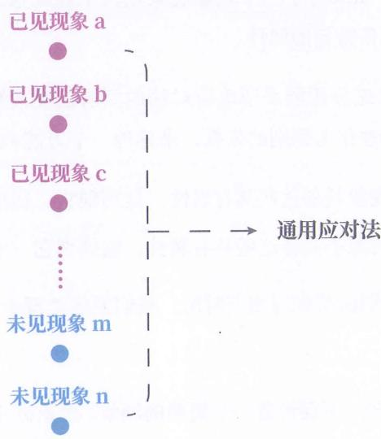
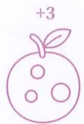
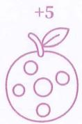
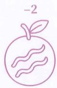
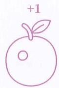
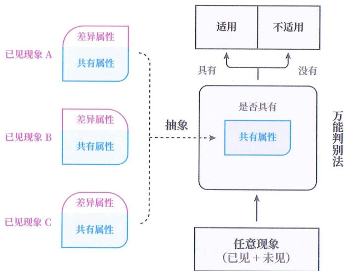
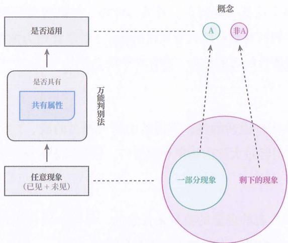
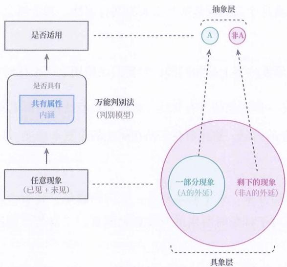
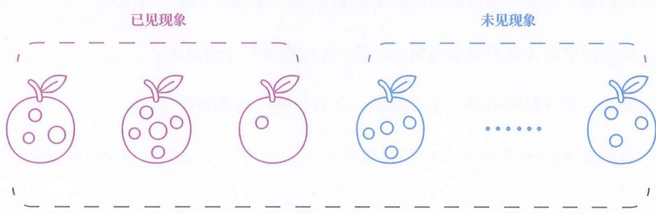

# 类化应对

## 统一应对

由于物质世界中会出现数不清的新情况，大脑不可能把每个前兆现象怎么应对都记住，所以只能从过去的经验中总结出一个通用应对法，简称“应对法”，来应对未见的前兆现象，如图2-1所示。

图2-1

我们也把这种方式称为“类化应对”或“统一应对”。

## 适用判别

有一个问题：世间有无数个现象，大脑要怎么判断，总结出的这个应对法适用于哪些现象？

大脑必须还能判断眼前的现象是否能采用这个应对法，并且能对任何现象都做出这种判断，而这本质上也是对现象群进行类别划分。我们称之为“对现象群的类化”，简称“类化”。

换句话说，类化应对的条件是先对所有现象进行类化。

为了进行类化，我们需要一个万能判别法（简称“判别法”），来判别任意现象是否能采用这个应对法，同时，也是将所有现象划分成“能应对”和“不能应对”两类。

## 如何获得

如何获得万能判别法呢？

## 提取共性

可以肯定的是，如果对于一个现象能采用某个应对法，那该现象必须满足某些条件，或者说具备特定的属性。

因此，我们可以先分析能采用该应对法的所有已见现象都有哪些共有属性，提取出这些共有属性作为判别的依据，来建构一个万能判别法：

◎ 如果眼前的现象具备这些共有属性，就判别它“适用此应对法”。

◎ 如果眼前的现象不具备这些共有属性，就判别它“不适用此应对法”。

最后，用万能判别法搭配通用应对法，我们便能处理未见情况了。

## 拾取问题

为更好地举例说明, 下面设置一个简单的场景。想象你被传送到了一个仅有黑色、白色的二维异世界, 你要通过拾果子积够 100 分来回到现实世界。

这里的每个果子都不相同。你已经拾取了4个果子，它们分别为你+3分、+5分、-2分、+1分，如图2-2所示。

图2-2

现在眼前有一个未见果子，为尽快回到现实世界，你该不该拾取它？

这里，第1个果子的外观是一个前兆现象，+3分是一个后继现象，二者合起来是一个情况，由于这是已见情况，因此也是一个经验。目前你共搜集到了四个经验。

很自然地，你会先分析所有适合拾取的果子都具备哪些共有属性，然后根据眼前的果子是否具备这些共有属性来选择是否拾取。

## 梳理组成

类化应对是刻在我们基因中的本能，我们会无意识地运用它。不要小瞧这种方式，我们对世界的认识，在底层依赖于此，其中更是包含丰富的内容。

所以，接下来我们将逐一梳理类化中的各个环节与组成部分，从而深刻地把握以下概念：抽象、概念、正负概念、判别模型、概念的外延、概念的内涵、具象层、抽象层、模型预测。

## 抽象

我们知道，物质世界中的所有现象，实际上都是不同的，所以提取已见现象的共有属性时，同时也是在忽略它们的差异属性。

这种从一群不同的现象中，忽略差异属性并提取共有属性的行为就是抽象，如图 2-3 所示。

图2-3

## 好果抽象

例如，+3 分的果子、+5 分的果子、+1 分的果子外观都是不一样的，若你忽略它们在圆圈数量和大小方面的差异，提取出“有若干圆圈图案的果子”这个共有属性，就是在抽象。

## 加分抽象

又如，+3 分、+5 分、+1 分这三个后继现象也是不同的，若你忽略它们在所加积分数值上的差异，提取出积分增加这个共有属性，也是在抽象。

## 概念

当抽象出共有属性后，我们就可以利用它建构一个万能判别法了。

如图 2-4 所示，如果用这个万能判别法对世间所有现象都进行判别，就会把世间所有现象划分成两类：

◎ 所有具备此共有属性的现象被划分到一类，姑且称其为“A”。

◎ 所有不具备此共有属性的现象被划分到另一类，姑且称其为“非 A”。

图2-4

尽管 A 并非现实现象，是一个构造出来的类别，但由于我们不再区别对待被划分到 A 的各个现象，而是将它们一视同仁、统一对待，因此我们可以将 A 这个类别也视为一个对象 / 现象，将 A 作为这群现象的代表。我们如何对待 A，就如何对待 A 所代表的每个现象。

同样地，我们也将非 A 这个类别视为一个对象 / 现象，将非 A 作为余下所有现象的代表。我们如何对待非 A，就如何对待非 A 所代表的所有现象（不对待也是一种对待）。

像 A 和非 A 这种代表一群现象的类别，就是我们通常所说的“概念”，也叫“范畴”。

## 加分果

例如，当你抽象出“有若干圆圈图案的果子”这个共有属性后，就可以根据是否具有该共有属性，将世间所有的现象划分成两个类别：

◎ 所有具备 “有若干圆圈图案的果子” 的现象被划分到一类，姑且称其为 “加分果”。

◎ 余下的所有现象被划分到另一类，姑且称其为“非加分果”。

## 你

当我们在跟别人对话时, 对话的对象各式各样, 但我们都会用你这个概念来指代,因为大脑忽略了这群人的身份、外貌、性格、年龄等差异属性，提取出了一组共有属性，并把所有具有此共有属性的现象 / 对象都归为你这个概念，而把所有不具有此共有属性的现象归为了非你这个概念。

## 我

同样地，原本张口说话的我、不说话的我、翻书的我、7岁时的我、30岁时的我都不一样，但经过大脑的抽象和归类后，就都被划分到了我这个概念下。

## 概念要求

一个概念可以代表的现象的数量是任意的，但最少要代表两个现象，否则就没有构造此概念的意义，直接讨论现象本身即可。

## 抽象类化

注意，在类化的过程中必然包含抽象，但抽象本身并不等于类化。

◎ 类化的产物是概念，它通过万能判别法把所有现象划分成了 A 和非 A 两个概念。

◎ 抽象的产物是现象群的共有属性，它通过剔除差异、提取共性，为类化提供依据。

## 果类化

例如，对于图2-2中 $+3$ 分的果子、 $+5$ 分的果子、 $+1$ 分的果子外观，我们对这三个现象进行抽象后，所得到的产物是“有若干圆圈图案的果子”这个共有属性，但类化后得到的产物是加分果和非加分果。同时，由于类化要用到万能判别法，而万能判别法又需要抽象得到的共有属性作为判别依据，所以在类化的过程中必然包含抽象。

## 正负概念

尽管我们讨论概念 A 时，并不会提及非 A，但当大脑构造概念 A 时，必然会同时构造出两个概念——A 和非 A，因为构造概念 A，就是为了区别 A 和非 A。

其中，A 也被称为 “正概念”，而非 A 则被称为 “负概念”。

这种正负是相对于彼此而言的。如果把非 A 视为正概念，那么非非 A（即 A）便

是负概念。

有时，我们会为负概念额外取名，但很多时候不会，所以人们往往不会认为非 A 也是概念。

## 真正的X

我们经常听到人们说“真正的爱情是……”和“真正的勤奋是……”之类的句式，但其实没有所谓的“真正的X”。这类话的作用是额外划分出来一个概念，和“大众通常所理解的X”相区别。

这里，真正的 X 是正概念，非真正的 X 是负概念。

## 一刀两块

构造一个概念就像切蛋糕，即使你只想切出分给自己的那块，一刀下去，也会不可避免地切出不分给自己的那块。切出来的那一块相当于正概念，留下来的那块相当于负概念。

## 俩文件夹

构造一个概念又像创建文件夹。虽然你创建了一个文件夹，把部分文件放入其中，但没被放到文件夹的剩余文件其实也形成了一个“文件夹”。

## 判别模型

构造概念的关键是万能判别法，不过万能判别法只是我们临时拼凑出来的短语。这里为其正式命名，叫“概念判别模型”，简称“判别模型”。

之所以不叫 “判断”，而叫 “判别”，是因为 “别” 具有 “区别” 的含义，刚好可以表达 “与其他概念相区别” 的意思。

判别模型是专门用来判别任意现象属于正概念或负概念的一种模型。

## 好果判模

例如，下面的整个条件分支就是“加分果”和“非加分果”的判别模型：

☐ 如果当前现象具备 “有若干圆圈图案的果子” 属性，就将其归为加分果概念。

◎ 如果当前现象不具备 “有若干圆圈图案的果子” 属性，就将其归为非加分果概念。

## 判别

有了判别模型，自然要运用，而运用判别模型的行为（也就是对一个现象进行概念归类的行为），叫“概念判别”或“概念识别”，简称“判别”。

## 学概念

实际上，在学习任何概念时，都不是在记忆概念，而是在建构概念的判别模型，概念只是判别模型的分类结果。有了判别模型，自然就有了概念。

并且，由于一个判别模型会同时控制两个概念——正概念和负概念，哪怕只想学习一个概念，也不可避免地同时学习对应的负概念。倘若没有学会其负概念，也就意味着没有真正学会这个概念。

## 学信息

例如，学习信息这个概念时，并不是在记忆“信息是用于消除不确定性的事物”这句话，而是在建构一个能判别任意现象是信息还是非信息的判别模型。在学习信息这个概念的过程中，必然在同时学习非信息这个概念。

如果一个人在学习之后，认为任何现象都可以被判别为信息，就相当于没有形成非信息的概念，那实际上他就并没有真正学会信息这个概念。

## 外延

对于被概念所代表的那群现象的整体，也有个名称，叫“概念的外延”（如图2-5所示）：

被划分到 A 之下的所有现象的整体是 A 的外延。

被划分到非 A 之下的所有现象的整体是非 A 的外延。

图2-5

## 好果外延

例如，“加分果”的外延是具备“有若干圆圈图案的果子”属性的所有现象的整体，其中也包括我们没见过但具备该共有属性的现象，如图2-6所示。

“加分果”的外延

图2-6

## 非好外延

“非加分果”的外延则是所有不具备“有若干圆圈图案的果子”属性的现象的集合，不仅仅局限于果子，还包括卡车、面包、牛奶等其他领域的现象，因为这些现象也都不具备“有若干圆圈图案的果子”属性。

## 内涵

既然我们将划分出来的概念也视作一个对象 / 现象，那这个构造出来的现象也有自己的属性，而这个属性就是抽象出来的共有属性。对于概念而言，它叫作“概念的内涵”。

共有属性和内涵在内容上是相同的，但我们在使用这两个词时有不同的视角：

◎ 共有属性是一群现象的共有属性，意味着我们站在一群现象的位置来描述。

◎ 内涵是概念的内涵，意味着我们站在概念的位置来描述。

## 好果内涵

例如，对于 “加分果” 这个概念而言，它的内涵是 “有若干圆圈图案的果子” 这个属性。可对于抽象时所用的众多现象而言，“有若干圆圈图案的果子” 则是共有属性。

## 具象层

从图2-5中还可看出，对现象进行划分前后存在两个层面。

这里的“层面”是指具有多个对象的集合。

我们把划分前，所有现象所在的层面称为“具象层”或“现象层”。

具象层中包含我们需要应对 / 处理 / 研究的对象（现象）。

显然，物质世界也是一个具象层，并且是底层的具象层。

如果将 A 的外延和非 A 的外延合并在一起，等同于撤销了划分，也就变回了具象层。

## 抽象层

我们把划分后的所有概念所在的层面称为“抽象层”或“概念层”。

抽象层中包含着我们为了处理未见的研究对象而构造出来的“现象的代表”，也就是概念。

抽象层至少包含基于一个判别模型所划分出的两个概念，但也可以包含基于多个判别模型所划分出的概念。

## 类比

我们再为各个组成部分做类比：

◎ 现象 / 对象相当于要处理的一个个文件。

◎ 概念相当于文件夹（一种标签）。

◎ 概念的内涵相当于文件夹的属性。

◎ 概念的外延相当于文件夹内所有文件的整体。

◎ 判别模型相当于针对任意文件选择该将其放入哪个文件夹而建构的万能分类器。

◎ 具象层相当于划分前所有文件所处的层面。

◎ 抽象层相当于划分后所有文件夹所处的层面。

## 框架理解

很多人可能会觉得这些内容似曾相识：有人感觉在哲学书籍中见过，有人感觉在逻辑学文献中见过，也有人感觉在编程教材中见过。其实，在哪里见过都不足为奇，因为这些内容本就是人类认识世界的基础，几乎所有学科都会或多或少地呈现它们的影子，只是名称和表述方式略有不同。浆果 $^{1}$ 综合了这些领域的内容，改进出了一个实用版本。

在这方面内容的讲解方式上，浆果也进行了相应调整。大多数人是在逻辑学中首次接触这些内容的，但不少人至今都没理解什么是概念，更别谈将它们应用于生活中了。可能是因为逻辑学强调形式和定义的精准性，反而容易让学习者孤立地去记概念的定义。所以浆果没有沿用传统逻辑学的讲解方式，而是从认知过程的角度出发，以人脑在认识世界时遇到的障碍为切入点，逐步解释为什么必须创造概念，并增加了真正控制概念的核心——判别模型，以及抽象层和具象层这两个框架性组件。

在阅读本书时, 请务必将这些组件放在同一个整体框架中去理解, 不要孤立来看, 就像要理解左, 必须同时把右放在同一个整体框架中, 才能理解。

## 主干提要

1. 为应对未见情况，需要从已有经验中总结一个统一应对法。

2. 运用统一应对法时，需要建构一个能判断适用对象的万能判别法。

3. 为建构万能判别法，需要从已有的适用对象中抽象出共有属性，以是否满足该共有属性为界，将万物分成两类。

4. 构造一个概念，必然会同时造出两个概念——正概念和负概念。

5. 学习概念实际上是在建构此概念及其负概念的判别模型。

6. 每当遇到未见现象时，都先用判别模型（万能判别法）对其进行判别，若具备共有属性，则归为适用的一类，并运用统一应对法，否则不运用。这样便可应对未见情况。

## 概念提要

◎ 类化应对：对一类情况采取的统一应对法。

◎ 万能判别法：判断任意现象属于哪个类别的通用判别方法。

◎ 类化：对现象群进行类别划分的过程。

◎ 抽象：提取一群现象的共有属性的过程。

◎ 共有属性：一群特定现象共有的一组属性。

◎ 类化 vs 抽象：前者的产物是概念，后者的产物是共有属性。

◎ 概念：代表一群特定现象的类别。

◎ 正概念：对一群现象进行类化时必出两个概念中的一个。

◎ 负概念：对一群现象进行类化时必出两个概念中的另一个。

◎ 判别模型：万能判别法的正式称呼。

◎ 判别：运用判别模型对一个现象进行归类的行为。

◎ 概念的外延：一个概念所代表的现象群的整体。

◎ 概念的内涵：概念所代表的所有现象的共有属性。

◎ 具象层：类化前所有现象组成的集合。

◎ 抽象层：类化后所有概念组成的集合。
