# 模型预测

## 拾取决策

梳理完各个环节和组件后，我们再回到拾果子问题：该不该拾取图2-2中的未见果子？

由于该果子并不满足 “有若干圆圈图案的果子” 这个属性，你利用判别模型将其判别到了非加分果的概念，于是采用不拾取这一应对方式。

## 模型预测

可以看出，运用类化应对的关键是模型。我们把这种利用模型来预测的方式称为“模型预测”。模型预测是预测能力的第二处来源。

## 模型

之所以用“模型”这个名称，是因为我们并没有直接在现象层面去逐一应对，而是在脑中构造了一种思维单元（也就是概念），作为一群现象的代表，间接地进行推演和模拟。这就像建造一个手工模型代表真实的建筑、车辆等事物，来做推演和模拟一样。“模型”一词则刚好体现了这种现实替身的特性。

当然，由于这是一种思维中的模型，也可以被称为“心理模型”或“思维模型”。

## 两种预测

现在我们知道了预测能力的两处来源——经验预测和模型预测。

◎ 经验预测可以赋予我们对已见情况的预测能力。

◎ 模型预测有机会赋予我们对未见情况的预测能力。

## 实际加分

为什么说“有机会赋予”呢？因为我们所建构的模型，未必就能对未见情况进

行成功预测。

例如，你预测拾取那个果子会减分，但实际上拾取那个果子会 +3 分，如图 3-1 所示。

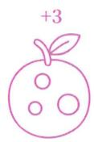

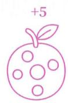

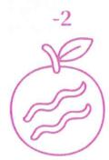

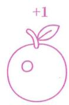

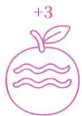

图 3-1

这时你会意识到，其实还有一种抽象方式，也能满足所有已见情况——忽略图案是圆圈还是浪条的差异属性，仅保留具有奇数个封闭图案的属性。

即使你换了这种抽象方式，再来一个未见果子时，依然可能预测失败。因为抽象方式是无限的，我们只能 $100 \%$ 保证所建构模型符合搜集到的所有经验，不能 $100 \%$ 保证所有未见情况都符合这个模型。

## 模型验证

因此，建构模型来预测未见情况时，需要经过验证。如果预测失败了，我们就将失败的情况也纳入已见，更新所建构模型。

拾新果子

例如，你先运用所建构模型，得到一个“拾取后果”的预测，在将它与实际的“拾取后果”进行比对，看看二者是否相同。这就是一次模型验证。

## 压缩能力

由此你会发现，并非所有模型都能预测未见情况。如果我们所建构的模型仅适用于已见，不适用于未见，那该模型就仅具备记忆已见情况的能力。这其实是模型的能力之一，叫作“模型对经验的压缩能力”，简称“压缩能力”。

之所以称其为 “压缩”，是因为不论有多少经验，只要满足同一个共性，就可以被一个模型所概括，进而减少占用的存储空间。

## 压缩拾果

例如，你所建构的第一个模型，虽然不能预测未见果子，但可以将拾取3个果子的经验都压缩在一个模型中。

假如你搜集了拾取 100 个果子的经验，只要找到了它们的共性，同样可以将它们压缩到一个模型中，也就不必挨个回忆这 100 个果子到底是会加分还是会减分。

## 泛化能力

不过，我们更为感兴趣的是模型预测未见情况的能力，我们将这种能力称为“泛化能力”。

如果所建构模型的泛化能力不够强，没达到我们的要求，就称“模型的泛化（能力）不足”。

## 知识

如果我们所建构模型的泛化能力足够强（从未泛化失败过，或是成功率高到我们可以接受的程度），我们就把这个模型称为“知识”。

可见, 知识必须具备可泛化性(普遍性), 能够超越经验, 适用于广泛的未见情况。

## 人非永生

例如，“人非永生”所表达的就是一个知识。它不仅适用于孔子、嬴政等我们已知的过世之人，也适用于笔者本人以及每一位读者，具有超越经验的普遍性。

## 信息

与知识相对的是信息。信息是本身不具备普遍性的单一情况或现象。

## 孔子死了

例如，“孔子死了”所表达的就是信息。它仅适用于孔子一人，属于单个情况，不具有普遍性，本身不能用于推测未见情况。

## 记忆

将已见情况原封不动保存在大脑中的行为，被称为“记忆”。

判别一个行为是否属于记忆，关键在于行为目的：只要其目的是为了保存信息，即使最终没有成功，也被归为记忆。

## 记国庆

例如，某小学生的行为目的是将“中国的国庆节是10月1日”原封不动地保存到脑中，结果失败了。该小学生的行为仍被称为记忆。

## 学习

与记忆相对的是学习。学习是指建构具有泛化能力的模型的行为，也就是塑造预测未见情况的能力的行为。

记忆无须举一反三，但学习必须举一反三，或者说，只有能举一反三的行为才被称为学习。

记忆与学习所针对的对象也不相同：记忆的对象是信息，学习的对象则是知识。

## 记身份证

例如，你把自己的身份证号码保存到脑中，不是学习，是记忆。但如果你在建构一个根据号码来推测未知个体性别的模型，则是学习。

## 历史

又如，你将“秦始皇死于公元前210年”和“苏格拉底死于公元前399年”保存在脑中的行为，不是学习，是记忆。但若你用它们作为经验，来建构人非永生这个可泛化模型，则是学习。

## 仅压缩

如果你的行为目标是压缩拾取果实的那三个经验，而非预测未见情况，那么即使你在建构模型，也不是学习，而是记忆。

## 定义不同

注意，本书对“知识”“信息”“学习”“记忆”这四个词采用的都是专业定义，

而非日常用法。就像“功”在物理学中的含义不同于日常用法一样。

之所以这样，是因为本书并非单纯提供一些启发性的内容，而是要为读者建构一套能够精准描述学习现象的理论体系。这要求本书必须像物理学书籍一样，为每一个术语提供明确的定义，使理论的使用者能够清楚每个名词指代哪些现象。在日常用法中，这些词往往内涵模糊、边界不清，一个现象是否属于学习的判断并不统一。这在需要精准描述现象的理论中，是绝对不允许的。

拿 “学习” 一词来说, 本书中采用的是认知视角下的定义。而在日常用法中, “学习” 一词通常指社会互动层面上的 “向他人获取有价值内容的行为”, 不能准确描述个体内部的认知过程。

例如，按照日常用法，记忆自己的身份证号码不被视为“学习”，而记忆一位名人的名字却被视为“学习”。从认知过程来看，这两种行为本质上并无区别，差别仅在于所记忆内容的社会重要性不同。在本书的定义中，这两种行为都不属于学习，而属于记忆。

又如，有的家长常会说：“别玩了，快去学习。”在日常语境中，“玩”和“学”常被视为对立概念。然而，如果某款游戏被纳入高考科目，那么玩这款游戏又会被家长称为“学习”。从认知过程来看，这两种行为也无本质区别。按照本书的定义，只要一个人在建构可泛化的模型、塑造预测未见情况的能力，就属于学习——无论要预测的情况是来自物理世界，还是游戏世界。

## 渐构

考虑到人们已经习惯了“学习”一词的日常用法，本书为该行为提供了一个别名——渐构。

之所以使用“渐构”这个词，是因为记忆可以保证 $100\%$ 成功，但学习却不一定，哪怕学生已经 $100\%$ 理解了书本或课堂内容。这并不意味着学生做错了什么，而是学习本身就是要超越已见，超越书本和课堂，可没人能确保基于已见情况所建构的模型能 $100\%$ 适用于未见情况。因此，学习必然需要不断在泛化失败中持续迭代和更新脑中的模型。

为了更准确地从名称上体现该行为的本质, 本书将 “建构” 中的 “建” 改为 “渐”,

意为“逐步迭代地建构”。

本书后续出现的“学习”和“渐构”，都指代迭代建构可泛化模型这一含义。

## 词义

凡是本书中专门定义过的词汇，例如“现象”“物质世界”“判别模型”“类化”“抽象”，都要严格按照书中提供的定义来理解和使用，切不可随意从其他资料中照搬（例如，去百度查“类化”的含义，把心理学的含义搬到本书中来用），也不能按照日常用法去理解（例如，在网络用语中，“抽象”有怪诞、令人摸不着头脑之意）。即便这些词在外部语境中有相同或相似的名称，它们在本书中所指的含义也可能完全不同。若不加区分，极易产生误读，导致对整个体系的理解出现偏差。

## 经验何用

至此，我们明确了模型预测中各个名词的含义，为后续的阅读做好了铺垫。

不少读者可能已经产生了疑问：第 01 章明确指出，在物质世界中，经验预测失去了作用。那么，为什么本章还说经验预测是预测能力的一处来源呢？

## 主干提要

1. 预测能力的两处来源——经验预测和模型预测。

2. 模型的压缩能力可实现记忆。

3. 模型的泛化能力可实现学习。

4. 普适性强的模型会被固化为知识。

5. 根据塑造的能力所针对的是已见还是未见，可划分出记忆和学习（渐构）。

## 概念提要

◎ 模型预测：利用模型的泛化能力实现的预测。

◎ 模型：以虚构类别（概念）代替和模拟实际现象的结构。

◎ 模型的压缩能力：模型适用于已见情况的能力。

◎ 模型的泛化能力：模型适用于未见情况的能力。

◎ 知识：普适性足够强的模型。

信息：不表达普遍性的单一情况或现象。

◎ 记忆：塑造重现已见情况的能力的行为。

◎ 学习：塑造泛化未见情况的能力的行为。

◎ 渐构：学习的别名——迭代建构可泛化模型的行为。

## 同类可能

在物质世界中，经验预测之所以无法发挥作用，是因为我们几乎无法遇到相同的现象。

然而，当我们引入类化应对后，情况就发生了改变。

在物质世界中，所遇现象 A 和所遇现象 B 不可能相同，但现象 A 的类别与现象 B 的类别却可以相同。也就是说，我们可以在概念所处的抽象层面遇到 “相同” 的现象。

同类数

例如，把无限正整数集合—— ${1, 2, 3, \ldots, \infty}$ ，设为具象层 / 现象层，从中不断取数字，我们抽不到相同的正整数。

但如果我们用判别模型在正整数集上构造出“偶数”和“非偶数”，那么在这两个概念所处的抽象层面就可以多次遇到偶数和非偶数。

## 类对象化

如果我们将概念本身也视为一种对象 / 现象，并对其进行记忆与回忆，那么经验预测就能在抽象层面发挥作用。

换句话说，如果把类（概念）进行对象化，就能够运用经验预测了。我们把这种操作称为“类对象化”。

我们的确也在这么对待概念——将其视为一种“构造出来的现象 / 对象”，并让其拥有了自己的属性（也就是概念的内涵），以及一套应对法。

## 记中国人

例如，在一座国际旅游城市中，商家很难重复遇到同一个人。此时，在个体层面上的经验预测几乎没用。

不过，商家可以渐构一个判别模型，将所有具体的人划分为中国人和非中国人两个概念。接着，对中国人这一概念进行对象化，在抽象层面记忆和回忆该如何应对中国人。

## 先判后化

不过，进行类对象化的前提是已渐构判别模型。

只有先运用判别模型将各种现象映射到特定概念，在具象层之上构造一个抽象层后，才能对这些概念进行对象化。

类对象化等于把原本的抽象层设定为新的具象层。

## 先判偶数

还用上面的例子来理解，只有渐构好“偶数”和“非偶数”的判别模型，将正整数集映射到“偶数”和“非偶数”所处的抽象层，才能对偶数和非偶数进行对象化，如图4-1所示。这等同于将原本的抽象层设定为新的具象层。

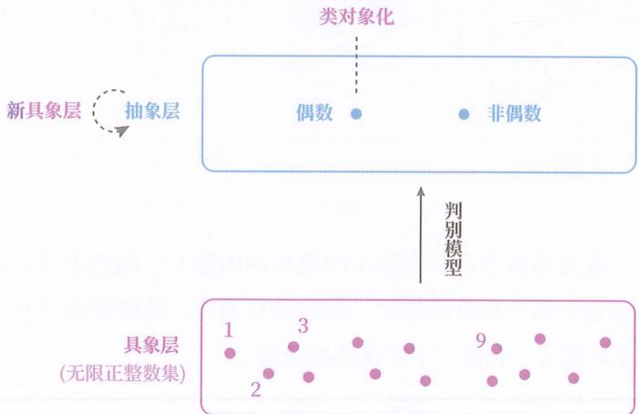

图4-1

## 对象现象

在本书中，对象和现象都表示对象层中的元素，但侧重点不同：

◎ 对象更强调此乃认识目标。

○ 现象更强调此乃归类前的原始状态。

## 能否加层

既然原本的抽象层可被设为新的具象层，一个很自然的问题便出现了：

我们能否像类化具象层那样, 对这个新具象层也进行类化, 构造出更抽象的概念,获得更高的抽象层?

## 水果高层

答案是：可以。

用图 4-2 为例来说明，左侧具象层中的黑点都是形状、颜色、大小、味道等不一的现象。我们可以对这些现象进行类化，构造出橘子、香蕉、核桃、杏子、杏仁、柠檬的概念（图中省略了非橘子等负概念）。

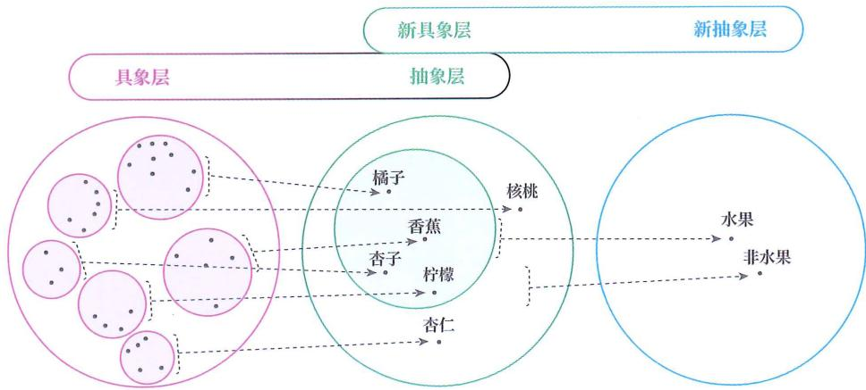

图4-2

由于橘子、香蕉等概念也有属性（即概念的内涵），我们也可以对它们进行抽象——忽略这些概念的差异属性，提取共有属性，从而类化出水果与非水果这两个更抽象的概念，获得一个更高的抽象层。

## 高层类化

也就是说，类化得到的一群概念也可以被类化。

但要注意，抽象和类化操作是针对具象层而言的，并非针对单个对象或类对象化后的单个概念而言。因为只有一群不同的对象才可以被提取共有属性、剔除差异性，单个对象无法进行抽象。

## 水果来源

例如，我们不能对单个的香蕉概念进行抽象，类化得到水果，再抽象出水果，类化得到食物。

我们只能对香蕉、苹果、杏仁等多个概念进行抽象，类化得到水果和非水果。同理，只有把水果、蔬菜、肉类、汽车等概念聚到一起，才能进行抽象，类化出食物和非食物。

## 嵌文件夹

概念群可被类化，就好比在一群文件夹之上还可以创建文件夹。

我们可以在一群文件之上，划分出一级文件夹，也可以在一群一级文件夹之上，划分出二级文件夹，还可以继续嵌套，形成三级、四级文件夹……

## 类金字塔

大脑可以不断重复类化行为。每次类化都相当于在既有的结构之上加盖一层，形成一个“概念金字塔”。大脑对世界的认识，正是依靠“概念金字塔”进行的，如图4-3所示。

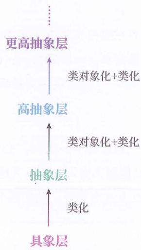

图4-3

## 两可困扰

然而，“概念金字塔”带来了一个困扰——对于任何概念，我们都可以说它是抽象的。

我们可以说动物是抽象的，也可以说人是抽象的，还可以说赢政是抽象的（因为赢政可代表不同年龄的一群赢政）。除了底层的物质现象，“抽象的”这个形容词适用于一切。“具象的”这个词变得多余了。

如何解决这一困扰？

## 绝对层级

其实，这其中存在一个不易察觉的设定：我们默认以绝对层级的方式来对待概念金字塔——也就是说，将物质世界视为第一层，再依次向上数抽象层数。

这种设定非常符合自然逻辑，但却存在致命缺陷。

首先，它会导致“抽象的”一词适用于一切，“具象的”一词几乎没有使用空间。

## 无法贯彻

更关键的是，我们无法真正贯彻绝对层级这个设定。

若采用绝对层级，意味着我们必须一路向下追溯到底层，来确定当前概念所处的绝对层数。

然而在抽象时,忽略差异属性的幅度本身就是任意的——可以每次忽略很少差异,类化多次;也可以忽略大量差异,一步到位。这使得我们无从确定绝对意义上的下一层是什么,也无从判断一个概念在绝对层级中位于第几层。

## 溯人

例如，当我们要追溯人这一概念的下一层时，会想到嬴政、孔子、苏格拉底等个体层面；但二者之间，又能插入女人、非女人这个层级，还能插入身高 170cm 的女人、非身高 170cm 的女人这个层级。到底哪个是绝对意义上的下一层？

## 相对层级

综上，我们必须以相对层级取代绝对层级来对待概念金字塔。

所谓相对层级，就是只考虑当前涉及的概念之间形成的层级关系，对其进行层级排序，并将相对最具象的那一层设为第一层，再依次向上标记各层的层数。

换言之，相对层级只服务于当前思考过程，而非全局的概念金字塔。

## 人动物

例如，当我们的讨论涉及“人”“动物”“生物”三个概念时，先梳理三者的层级关系，再把相对最具象的“人”置于第一层，“动物”和“生物”则依次被置于第二、第三层。如果我们的讨论还涉及哺乳动物、有机体，就再次梳理层级关系，重新排序和标记层数。

## 高层切入

除了类对象化，还有一种情况也会用到经验预测，而且也只能使用经验预测。

因为有了类对象化的能力，所以人类的思维可以在概念金字塔中自由地上下切换，直接思考高层概念。同时，人们还可以将自己思考的对象，通过语言符号传达给他人。

那么，当一个已学过概念 A 的人，向一个没学过概念 A 的人谈起概念 A 时，对后者来说，概念 A 只是一个单一对象，没有外延。在他自己也学会概念 A 之前，这个没学过概念 A 的人对概念 A 的应对只能依靠经验预测。

## 嘉宾

例如，一个员工接到通知，要接待 10 位嘉宾。该员工并不是靠脑中的判别模型将 10 个不同的个体（现象）归类到嘉宾概念下再去应对的，而是直接从他人的语言中，听到了“嘉宾”，那么只能直接回忆嘉宾的应对法，因此是经验预测。

## 背式子

又如，1 在绝对层级下是一个高度抽象的概念，可以代表一滴水、一头牛、一首歌等无数现象。但对于尚未渐构成出“1”的判别模型的小孩子来说，大人让他背诵的“ $1 + 1 = 2$ ”，就只能是一个单一情况，也只能运用经验预测应对——这意味着，他不能从具体的生活现象上升到 $1 + 1 = 2$ ，只有再次通过试卷或从他人口中，看到或听到“ $1 + 1$ ”的符号时，才能回答“=2”。

## 混淆经模

类对象化让经验预测得以发挥，但也带来了新的疑问。

既然任何层级的概念都可以被类对象化为对象，那么任何模型预测是否也都可以被视为经验预测呢？

例如, 当我们要预测浆果能否永生时, 会将其归入 “人” 这个高层概念来预测——这显然属于模型预测; 但如果我们将 “人” 这个概念类对象化为一个对象, 那么这种模型预测不就可以看作经验预测了吗?

我们要如何区分经验预测和模型预测呢？

## 主干提要

1. 在物质世界中虽难遇相同现象，但能遇到同类现象。

2. 类化出的概念可以被对象化。

3. 概念被类对象化后，可以运用于经验预测。

4. 类对象化的前提是已建有对应概念的判别模型。

5. 类化出的概念也可被类化，进而形成金字塔式的层级结构。

6. 绝对层级会让“具象”几乎没有使用空间，也无法判断绝对层数。

7. 以相对层级代替绝对层级，可解决上述问题。

8. 直接从高层切入时，需要用到经验预测。

## 概念提要

◎ 类对象化：将类化得到的概念视为对象进行类化的行为。

◎ 概念金字塔：不断进行类对象化后得到的多层级认知结构。

◎ 绝对层级：以物质世界为第一层，向上累计的层数。

◎ 相对层级：以相对最具象的一层为第一层，向上累计的层数。

## 下上结构

疑惑原因

其实，上述疑惑，是由于没有指明两种预测所针对的目标层面而导致的混乱。

在预测浆果能否永生时，我们所针对的是浆果所在的层面，而非“人”这个抽象概念所在的层面。“人”只是我们对浆果进行预测时，所用的一个“工具”。

因此，更准确的说法应是：用“人”对浆果进行的模型预测。

这个模型预测碰巧可以拆分为如下两步：

第一步：将浆果归入“人”的范畴（模型预测）。

第二步：回忆“人”的应对方式（经验预测）。

注意，并非所有模型预测都能拆出经验预测，这里是一种特殊情况。

然而，我们不能因为第二步是经验预测，就将整个过程称为经验预测，就像我们不能因为鸡蛋中包含蛋清，就把鸡蛋叫作蛋清一样。

之所以有人将上面的模型预测误认为是经验预测，是因为没有固定预测对象所属的层面，临时变更到“人”这个“工具”所处的层面来判断预测类型了。我们判断预测类型，应当看针对浆果所处的层面采用了哪种预测类型。

该如何消除这种混乱呢？

对象层

首先，在讨论任何预测前，应先固定预测对象所属的层面（对象层），也就是相对视角下的第一层。

由于我们的大脑可以在概念金字塔中任意上下穿梭，可以把任何层面的概念作为思考对象，若不固定层面，就会因层面的随意切换而无从讨论。

固定对象层意味着两点：

☐ 固定不变：在本次预测中，所选对象层保持不变。

◎ 类对象化：在本次预测中，对象层中的元素均被视为没有外延的对象。

## 笔者

例如，在某次预测中，我们针对的是“浆果能否永生”，那我们就始终以浆果所处的层面为对象层，并将浆果视为没有外延的对象。

如果不进行类对象化，那么可以将浆果无限向下展开。例如，8岁的浆果、20岁的浆果……哪怕对于8岁的浆果，还可以继续向下展开。例如，正在睡觉的8岁的浆果、正在吃饭的8岁的浆果……没完没了。

## 人

又如，在另一次预测中，我们针对的是“人能否永生”，那我们就始终以“人”所处的层面为对象层，并且不再展开“人”的外延——{嬴政、苏格拉底、图灵等}，而是将“人”当作一个没有外延的对象。

## 参考系

在讨论预测时固定对象层，就相当于在讨论物体运动时固定参考系。在物理学中，不固定参考系，就无法描述物体的运动状态。同样，在预测中，不固定对象层，就无法描述预测类型。

## 多次预测

上面的规范仅针对单次预测，但我们的大脑可以连续进行多次预测。

对于多次预测，则需要将其拆分成多个单次预测。而在不同的单次预测中，对象层可以不同。

## 现象概念

固定了对象层后, 我们就能以相对视角来定义现象 / 对象与概念 / 范畴, 避免 “万

物是概念”的失衡。

◎ 现象 / 对象（相对）被定义为：对象层中的元素。

◎ 概念 / 范畴（相对）被定义为：相较对象层的元素更抽象的元素。

在一个预测中的现象/对象(相对), 可以作为另一个预测中的概念/范畴(相对)。

## 浆果永生

例如，在预测“浆果能否永生”时：

◎ 对象是浆果。

◎ 概念可以选择人。

而在思考“人是否有生长周期”时：

◎ 对象是人。

◎ 概念可以选择动物。

## “经” “模” 区分

更为关键的是，当对象层固定后，我们就能区分经验预测和模型预测了。

区分办法就是看：在预测过程中是否涉及上层概念指导对象层。

◎ 经验预测：不会涉及上层概念指导对象层。

◎ 模型预测：必会涉及上层概念指导对象层。

## 永生预测

例如，如果对“人能否永生”运用经验预测，那就只会停留在人所处的层面，通过回忆“人→不能永生”来进行预测。

如果对“人能否永生”运用模型预测，那就需要一个相较于人而言的上层概念，如动物、生物、有机体等，然后用“动物/生物/有机体能否永生”来预测“人能否永生”。

## 无结构

由此可以看出，经验预测不会同时跨越两个抽象层级，始终停留在对象层。

## 下上结构

模型预测一定会跨越两个抽象层级，是一种由下层和上层所构成的“双层结构”。

◎ 下层，也称“对象层”，由该模型管辖的所有现象 / 对象构成。

◎ 上层，也称“共象层”，由该模型的相关概念构成。

在下层对象和上层概念之间，依靠判别模型进行关联，如图 5-1 所示。

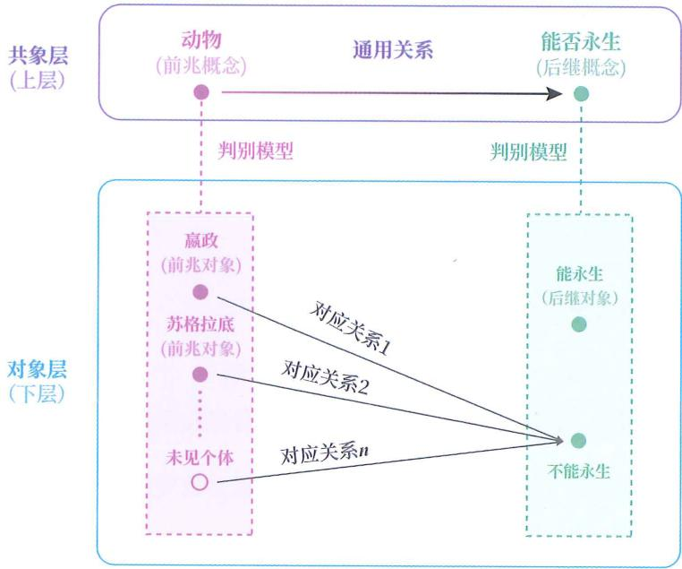

图 5- 1

运用模型预测时，我们靠上层中的前兆概念到后继概念的通用关系来指导下层中的前兆对象到后继对象的关系。这是因为在下层中存在未见情况，无法通过记忆和回忆来应对，只能依靠上层的概念间的通用关系，而我们之所以采用模型预测，恰恰是为了应对未见情况。

在解决实际问题时，下层和上层所扮演的角色不同：

◎ 下层是“实际问题”所处的层面。

◎ 上层是 “工具” 所处的层面。

我们之所以把模型预测的结构称为“下上结构”，而没采用更顺口的“上下结构”，就是为了表达“实际问题所处的下层应放在首位”。

## 应用构造

模型预测分为两个阶段：模型的构造阶段和模型的应用阶段。

下层和上层都是构造阶段的概念，也就是在构造阶段所要选择的。下上结构界定了所构造的模型能解决哪些问题。学习阶段也是构造阶段。在应用阶段，待解决的对象必须在下层之内。

## 区分未见

此前，大家可能会遇到“既像未见又像已见的东西”，不知如何区分。

例如，“浆果能否永生”的问题，看起来像未见情况，但思考到“人能否永生”时，又像已见情况。

## 已见未见

当我们区分了模型预测的下层和上层，并知道下层才是“实际问题”后，上面的混乱也就消除了：

对已见情况和未见情况的区分仅存在于下层(对象层), 不存在于上层(共象层), 因为对象层才是实际问题所处的层面, 而共象层恰恰是为了解决未见情况而被构造出来的。

## 笔者未见

所以，“浆果能否永生”是一个未见情况，恰恰因为我们无法应对这个未见情况，才会将其归入“人能否永生”来解决。

## 模型选择

最后，还有一个至关重要的问题：我们已经构造好了很多模型，如何选择模型来解决具体问题？

## 不必上升

注意，面对已见情况，意味着当事人拥有相应经验（一模一样的情况）。这时不需要选择模型，直接在现象层面回忆对应的经验来进行预测即可。这样反而比运用模型预测更精准。

## 人非永生

例如，当我们针对的情况是“人能否永生”时，直接回忆“人不能永生”即可，不必从“动物不能永生”的层面来进行预测。

## 两必一尽

如果面对的是未见情况，才需要选择模型来应对。

选择时，需遵循两个“必须”、一个“尽量”。

两个“必须”

第一个“必须”：未见情况中的前兆对象和后继对象可被归类为上层的前兆概念和后继概念。

第二个 “必须” ：从前兆概念到后继概念之间，必须存在符合现实的映射关系。

如果同时考虑到模型的使用者，则使用者需要正确渐析出（也就是学会）归类所用的判别模型，以及“从前兆概念到后继概念的映射关系”，也叫“联结模型”。

## 旗杆高

例如，下面的问题对学生 A 来说是未见情况：

一根旗杆竖立在地面上，从旗杆顶部有一根拉绳斜向下拉到地面并固定，绳子长度为26米，绳子的固定端与旗杆底座的水平距离为10米，推测这根旗杆的高度。

首先，在该未见情况中：

☐ 从旗杆顶部拉到地面的绳子可以归类为直角三角形的斜边（c）（前兆概念）。

☐ 绳子的固定端与旗杆底座的水平距离可以归类为直角三角形的直角边(b)(前兆概念)。

☐ 旗杆的高度可以归类为直角三角形的另一条直角边（a）（后继概念）。

其次，从前兆概念到后继概念之间，存在着符合现实的映射关系（ $\sqrt{c^{2}-b^{2}}=a$ ）。

于是，我们便可以选择勾股定理来进行模型预测。

这两个条件缺一不可：

◎ 如果学生 A 只具备归类的判别模型，不具备映射关系，则无法应用。

◎ 如果学生 A 只具备映射关系，不具备归类的判别模型，也无法应用。

## 高不好吗

可能有人会意识到：既然归类是关键，那么只要每次都选择抽象程度足够高、能囊括各种现象的概念，不就可以一劳永逸、不用选了？

## 一个“尽量”

这样做看似一劳永逸，每次都“正确”，但牺牲了实用性。因为概念的层级越高，所代表的现象范围就越广，而且为了同时涵盖如此多样的现象，总结出的共性必然宽泛笼统、缺乏针对性。

因此，除非对正确性有特殊要求，否则在实际应用中，应选择抽象程度尽量低的上层（共象层），也就是覆盖范围尽量窄的下层（对象层）进行模型预测，避免结论过于宽泛、预测精度不足。

## 寿命

例如，当预测“嬴政的最大可能寿命”时：

◎ 若选秦国人作为上层概念，则预测结果大致是60岁。

◎ 若选人作为上层概念，则预测结果大致是 120 岁。

◎ 若选动物作为上层概念，则预测结果大致是 500 岁，几乎无意义。

## 大道理

有时，人们会觉得一些老板的发言很“空”，好似“说了等于没说”。原因就在于：老板需要确保自己的正确性，所以往往倾向于选择抽象层级很高的上层概念来组织发言内容，自然无法照顾到足够具体的实践对象。

## 工具选择

选择模型就像选择工具，尽管通用性强的工具在很多地方都能用上，但往往难以兼顾具体细节。所以在实际应用中，不该一味地追求抽象高度、普遍性高的“工具（共象层）”。

## 何为概念

现在，有了抽象层级和下上结构的知识，我们再回过头来思考一个问题：

为什么概念被称为 “思维的基本单位”？为什么不直接去认识世界？不用概念不行吗？

## 主干提要

1. 为区分两类预测，需要确定相对层级的第一层（对象层）。

2. 对象层针对单次预测而言，可在不同预测中切换。

3. 对象层和共象层是关于模型应用阶段的概念，而非应用阶段的概念。

4. 一个模型能解决对象层之内的问题。

5. 可根据是否为对象层中的元素，明确区分现象 / 对象与概念 / 范畴。

6. 可根据是否涉及上层指导对象层，明确区分经验预测与模型预测。

7. 运用模型预测时，所选共象层应能指导目标对象，且层级要尽量低。

## 概念提要

◎ 对象层：相对层级中的第一层。

◎ 现象 / 对象：对象层中的元素。

◎ 概念 / 范畴：比对象更抽象的元素。

◎ 经验预测：对象层自身的预测。

◎ 模型预测：上层指导对象层的预测。

◎ 下上结构：模型预测的两个抽象层面形成的结构。

○ 构造阶段：构造可泛化模型的阶段。

应用阶段：应用可泛化模型的阶段。

◎ 共象层：下上结构中用于指导对象层的上层。

◎ 已见情况：对象层中已见的情况。

◎ 未见情况：对象层中未见的情况。

## 概念世界

人的大脑之所以不直接认识物质世界，并不是因为不想，而是因为办不到。

一个人即使不眠不休地探索和记录经验，也只能在浩瀚的物质世界中积累零星的经验，但在将来可能遭遇的无穷的未见情况面前，完全不够用。

为了应对无穷的未见情况，大脑不得不采用类化的方式，在物质现象层面之上，构造出一个概念层面，用一个个概念统一应对无穷的现象。这样一来，大脑的应对范围便从有限的已见扩展到了无限的未见，从“点”扩展成了“面”。正如图6-1所示，从9个点扩展为A的外延。

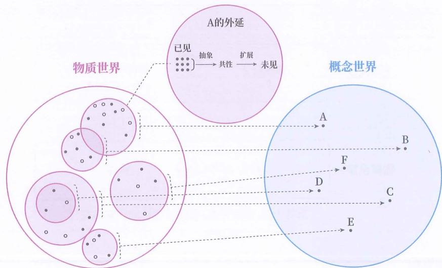

图6-1

这些概念是大脑能够理解和预测世界的基础。这也是为什么我们说“概念是思维的基本单位”的原因。

为了便于指代，我们把概念所构成的思维世界称为“概念世界”。

图 6-1 中并没有展示非 A 到非 F 的过程，但要注意，构造 A 到 F 的时候，非 A 到非 F 也就同时被构造出来了。因此图 6-1 中的概念世界里，共有 A 到 F 和非 A 到非 F，共 12 个概念。

## 物质

这里需要额外说明一下“物质世界”。

因为人脑只能依靠概念来认识和描述物质世界，这就意味着，浆果在讨论没有人类存在的物质世界时，依然用到了物理学中微观粒子的概念。但浆果真正想描述的是未经任何大脑加工的原始存在，当然不能有微观粒子的归类。

换句话说，“物质世界”指的是一个处处不同、未被分类、无法被言说的现象的集合，如图6-2所示。由于浆果不得不运用概念描述它，所以只能选择用物理概念近似地描述。

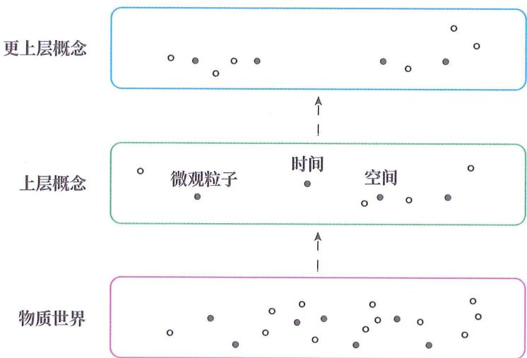

处处不同、未被分类、无法被言说的现象的集合

图6-2

## 非原貌

这种间接的认识方式意味着：我们感知到（看到、听到、闻到等）的所有事物，都不是它们在物质世界中的原始样貌，而是经由判别模型加工后构造出来的抽象类别（本书都称其为“概念”）。

## 图形界面

正如我们在电脑屏幕上看到的图形界面——各种图标、按钮、参数等，都只是一种抽象呈现，并非这些元素在电脑中的原始样貌。大脑感知到的颜色、声音、气味、触感，乃至我们认为的桌子、树、猫这些类别，都不是物质世界本来的样貌，而是脑中的一种“认知界面”。

## 以为原貌

不过，由于大脑只能将物质现象归到概念下来认识，所以通常大家都会以为自己看到的就是物质世界的原貌。

## 就是电脑

这就好比一生都用图形界面来操作电脑的人，往往都会认为图形界面就是电脑本身。

## 怎么避害

到这里，可能会有一些人感到不安和疑惑，觉得：“既然人脑看不到物质世界的原始样貌，那还怎么趋利避害？”

## 把握结构

事实上，趋利避害并不需要看到原始样貌，只需要把握事物之间的关系即可。

即便把事物的原始样貌（类比现实）转换成其他形式（类比概念），只要转换前后事物之间的关系维持不变，就可以趋利避害。

## 车撞人

打个比方，假如有一辆大卡车向我们迎面驶来，即使我们把驶来的卡车想象成霸王龙，把人类想象成小动物，把被撞想象成被吃，我们依然可以避免被大卡车撞到。因为霸王龙、小动物、被吃三者之间的关系与驶来的卡车、人类、被撞之间的关系是相似的。

## 游戏换皮

再拿电子游戏做类比。一款电子游戏，不管是用像素方格构成的粗制画面，还是用以假乱真的精细画面，都可以让玩家通过观察画面来趋利避害，因为在不同画面中玩家操控的角色和游戏中的敌人之间的关系是一样的。哪怕是把同一个敌人的外形修改成外星人、魔法蜥蜴，或是任何其他东西，都不影响这个敌人和玩家角色之间的关系。

## 模型相关

由于我们感知到的事物是判别模型对物质现象的加工结果，因此我们看到、听到的事物不仅仅取决于物质现象本身，还取决于脑中的判别模型。

如图 6-3 所示，即使是同一个物质现象，经过不同人脑中的判别模型加工后，会展现为不同的事物，而每个人脑中的判别模型又取决于此人的经验，以及此人大脑的抽象偏好。

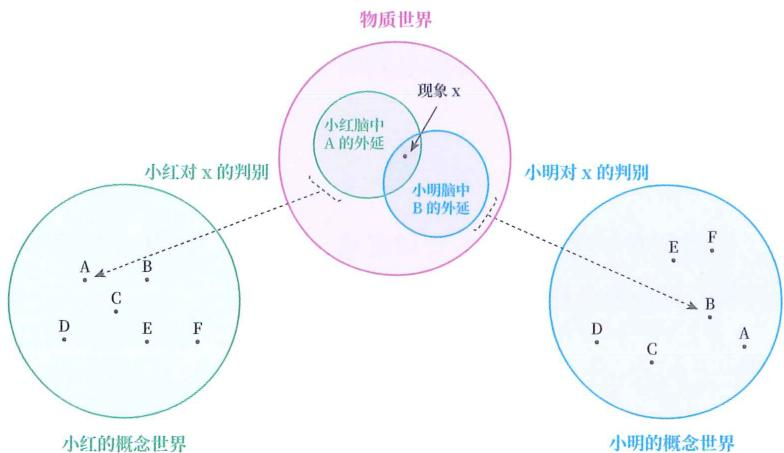

图6-3

## 海豚情侣

图 6-4 所示图画是由视错觉艺术家 Sandro Del-Prete 所创。它生动地展示了大脑看到的事物会受自身判别模型影响。

图6-4

当让孩子来看这幅作品时，他们最有可能看到的是一群活泼的海豚；而对成年人来说，他们往往会看到亲密拥抱的情侣。这是因为小孩子并没有经验来渐构这种判别模型，只能把画中的图案归为海豚。当然，如果是一个没见过海豚的孩子，那他可能只会看到一个内部有着奇怪纹路的瓶子。

另一方面，成年人由于日常经验对判别模型的更新，可能很难再看出来海豚。作品中，海豚是用暗色填充来表现的，共有九头（其中一头仅画出了尾巴）。

这幅作品曾在波士顿科学博物馆的错觉展览馆中展出过，据说有一群修女提出了异议，当被告知一个人的感知是基于过去的经验的之后，异议就平息了。

## 少女巫婆

对于图 6-5 所示的图画，有些人第一眼看到的是少女，有些人第一眼看到的是巫婆。

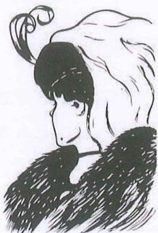

图6-5

看到的是少女还是巫婆，同样取决于观看者脑中的判别模型，也就是取决于观看者的日常经验和大脑的抽象偏好。

请你先试着把这张图分别看成少女和巫婆（少女的耳朵是巫婆的眼睛，少女的脸庞是巫婆的鼻子，少女的项链是巫婆的嘴）。然后试着把这张图看成线条和色块，来体会不同的判别模型会如何影响你对事物的感知。

## 跨服争吵

以上两个例子都是感知层面的，其实我们的认知（感知之上的抽象层面）也同样受到判别模型的影响。

比方说，丈夫在陪妻子练开车时，看到妻子转弯时未打转向灯，立即大声喊道：“转向灯！打转向灯！怎么又忘打转向灯了？！”这时，妻子的眼睛瞪得大大的，愤怒地回应：“你自己开吧，我不练了！”之后两人一直吵个不停。

在丈夫脑中，转弯未打转向灯被自动判别为危险驾驶的概念（范畴）下，大声叫喊被归为关心、着急和保护。然而，在妻子脑中，转弯未打转向灯被自动归为新手错误，大声叫喊被判别为丈夫对自己不耐烦。

在这场争吵中，丈夫都在围绕危险驾驶的概念体系进行阐述，不断解释“继续危险驾驶会给家庭带来什么后果”；而妻子则在围绕丈夫对自己不耐烦的概念体系进行阐述，表达“丈夫继续对自己不耐烦，以后就没法过了”。

夫妻二人看似在因同一件事而争吵，但实际上却是在两个不同的概念体系下阐述着自己的预测，并根据这些预测试图纠正对方的行为。

## 社会事实

这里引用复旦大学王德峰教授用过的一个例子。

王教授的邻居是一位同样爱喝黄酒的社会学教授。一次喝酒时，他表达了自己对哲学的看法，觉得哲学家们只会空谈玄理，对实际问题毫无帮助。

王教授问：“那社会学呢？”

邻居说：“社会学是实证的科学，讨论的是现实问题，从社会事实出发，并给出解决方案。”

对此，王教授问道：“你是如何获取社会事实的？”

邻居回答：“通过观察。”

王教授反问：“你可能观察到社会事实吗？打个比方，某时某地，有两拨人在打架。一个记者要报道此事，可能报道为警匪之战、黑社会内讧或群众纠纷。但这三种报道，都不是记者观察到的。如果真按记者所看的来报道，那就应该是‘两群高级灵长类动物在进行肉体搏斗’。你可以看到物理事件，但社会事实这个东西并不是你看到的。一个物理事件变成社会事实，过程中有个东西是范畴。你报道‘警匪之战’，就是把这件事放到了政治学的范畴中。我们似乎眼睛一睁开就能获得事实，但事实是被范畴构建起来的。”（这里的“范畴”也是“概念”。）

如例中所示，我们对世界的理解全都基于概念，也就是基于大脑为现象所选择的归类结果。哪怕是“两群高级灵长类动物在进行肉体搏斗”也是一种归类，只不过这种归类所用的概念从政治学和社会学转到了生物学。

不同的归类会影响人们对同一现象的看法。当记者选择用警匪之战来报道时，会让观众感到不安，而当记者选择用动物肉搏来报道时，却可能会让观众感到滑稽，但所报道的明明是同一件事。这些区别都是因为大脑是靠概念来为现象选择对应方式的。当大脑主动或被动地进入一套概念体系来“观察”眼前的现象时，就已经被限定好要如何对待眼前的现象了。

## 概念遮蔽

从上面的例子中也可以看出, 利用概念来间接认识世界的方式, 不是没有代价的。

概念是类化的产物，类化需要抽象，抽象又必然会剔除某些属性。所以人们常说，概念是对现象的简化。当我们用概念来描述某个现象时，得到的都只是这个现象的一个侧面或角度。

关键在于：被概念所剔除的属性是否会影响对后继现象的预测。如果不影响，则是有益的归类。

但如果把现象归入了一个不恰当的概念下，导致对预测至关重要的属性被剔除了，那这种归类就会造成认知盲区。

这种因错误归类而导致对关键属性的忽视，被称为“概念遮蔽”。

## 员工“违法”

打个比方，一个农民工为老板努力工作了一整年，却始终被拖欠工资。他多次向老板请求支付应得的薪水。老板见状，立刻在工地拉了一个横幅，上面写着“严厉打击恶意讨薪”。这个农民工急忙解释自己没有恶意讨薪，没有伤害任何人。

这件事原本是一个不涉及价值判断的现象，但雇主将其归到恶意讨薪的范畴后，这件事的细节就被选择性地剔除了，人们的关注点从事情本身转向了员工是否违法。在这个概念归类中，农民工被归为了“加害者”，而老板成了“被加害者”，屏蔽了老板拖欠工资的这一事实部分。

忙于澄清自己并没有违法的农民工，也被套进了恶意讨薪的概念体系内，可能都忘记了自己本来的目的。这便是概念对现象的一种遮蔽。

## 原貌才好

许多人看到 “概念是对现象的简化” 时，容易产生一种错误想法——“用概念来认识世界是不好的，我们应该认识事物的原始样貌”。

我们当然可以不进行概念归类, 就停留在现象层面上来处理, 但这样做的结果是: 除非我们经历过一模一样的情况, 否则无法应对。

举例来说，一个病人看医生，就必须接受被归入某种疾病的概念，他的个体差异也必然会因此而被忽略。这个病人当然可以说“每个人都是独一无二的”，拒绝被归类。但这就等同于拒绝看病，因为医生从未见过此人，不借助概念归类就无从制定任何治疗方案。

因此，正确的态度不是不用概念归类，而是意识到：不适当的归类可能导致概念遮蔽，应谨慎选择我们观察现象时的“眼睛”。尤其在分科思想盛行的今天，人们更容易“手里拿着锤子，看什么都像钉子”，习惯用自己熟悉的概念体系去归类所有问题。

## 多维视角

不过，在实际应用中，我们很难提前知道自己所选的归类方式是否合理。所以，一个实用的策略是：以多个不同领域的概念体系来分析同一个现象，让自己看到现象的多个层面。就好比观察一个物体在不同角度的多张照片，来建立起对这个物体的三维认识。

## 大类小类

不管是为了获得多维视角，还是正常地认识世界，我们都需要不断地扩展自己脑中的概念世界。

概念世界是由一个个概念所构成的，但扩展概念其实是在渐构判别模型。判别模型是连接物质世界与概念世界的桥梁，它负责将物质世界中的现象归为概念世界中的概念。

有些概念所覆盖的现象较多，有些则较少。我们将涵盖现象范围相对较广，或者说外延相对较大的概念，称为“大类概念”，同时将涵盖现象范围相对较窄，或者说外延相对较小的概念，称为“小类概念”。

## 哪个好

在生活中，人们很容易意识到大类概念和小类概念的存在，也往往会不自觉地比较哪个更优。

## 大类更好

一种观点认为：涵盖更多现象的大类概念更为优越。当一个词同时拥有广义和狭义时，有人会认为“广义”才是正确的，理由是：“广义”包罗万象、更加全面，而“狭义”是狭隘的、片面的、阶段性的。这些人往往也倾向于直接学习词语的广义概念，跳过狭义概念的学习，让自己“一步到位”。

持这种观点的人不少，因为人们容易把“狭义”中的“狭”字误解为“狭隘”，下意识地认为“广义概念”和“狭义概念”，一个是褒义词，一个是贬义词。但实际上，“广义”和“狭义”并不带有褒贬的属性。本书也正是为了避免这种误解，才选用“大类”和“小类”来进行命名的。

## 小类更好

另一种观点认为：涵盖更少现象的小类概念才更优越。理由是：小类概念相比大类概念更能精准地描述细微差别，并且不会像大类概念那样因覆盖范围过广，而导致在交流中出现指代不清和误解。

## 使用问题

一个概念好不好用，真的是由外延大小决定的吗？这相当于在问：一个箱子好不好用，是由大小决定的吗？

事实上，既存在大类概念不如小类概念的情况，也存在小类概念不如大类概念的情况。因为这两种情况是概念的运用者引起的，而非外延大小造成的。

## 大小箱子

如果一个人非要用大箱子来装小物品，就会觉得不好用。同样地，如果一个人非要用小箱子来装大物品，也会觉得不好用。

一个快递公司，为了满足广泛的装载需求，必须既要准备大箱子，又要准备小箱子。

## 失衡后果

同理，为了满足广泛的认识需求，我们大脑中的概念世界需要同时具备大类概念和小类概念，否则就会出现“凡物莫不相同”和“凡物莫不相异”的倾向。

## 莫不相同

如果在一个人的概念世界里，仅有大类概念，没有小类概念，便会出现“凡物莫不相同”的倾向，也就是把不该归为同一类的一群现象全归为同一类。

## 没色号

例如，在男生的概念世界里，往往仅有粉色和红色等几个大类概念，于是当他们看到各种口红时，都只能将其归到粉色和红色，无法区分口红间的细微差异。但经常买口红的女生却能区分出更多的红色种类，因为她们脑中拥有更多的小类概念。

## 没乐理

又如，普通人在听乐曲时，往往只能区分好听和难听等几个概念。但从事音乐工作的人，由于长期训练，脑中已经渐构出了许多小类概念，可以敏锐地听出细节差异。

## 没白醋

还有，许多人不管是尝到米醋、陈醋、香醋、白醋、果醋，都只会将其归为醋，因为在他们脑中只有醋这个大类概念。但拥有很多小类概念的厨师，能辨别出十多种不同的醋。

## 没症状

许多家长也遇到过这样的情况：当孩子生病时，询问孩子有什么感觉，孩子通常只会说自己难受，但无法具体描述是恶心、晕眩、乏力，还是发冷，也不能指出哪个身体部位不适。这也是因为孩子没有这些小类概念。

## 莫不相异

反过来, 如果在一个人的概念世界中仅有小类概念 (或没有概念), 就会出现 “凡物莫不相异” 的倾向, 也就是把可以归为同一类的一群现象归为不同类。

没有概念也算在内，是因为这相当于保留物质世界的原貌，把物质世界中的每个现象都视为最微小的概念。

## 没碗概念

想象一个仅能听懂“这是什么”、还不会说话的幼儿。

一次，妈妈指着幼儿眼前的东西说：“这是碗。”

过了两天，妈妈又指着自己眼前的东西说：“这是碗。”

这时幼儿可能会疑惑：“不对啊，‘碗’不是自己眼前的这个东西吗？怎么妈妈眼前的那个东西也是‘碗’？”

这是因为，幼儿仍处于渐构概念世界的初步阶段，还没有完全形成碗的概念，所以在幼儿看来，这两个东西不一样。

## 没对数

再想象下面两个问题：

☐ 问题 A：狼烟可以用来传递信息，一缕狼烟可以表达 2 种可能性，两缕狼烟可以表达 4 种可能性，那要表达 16 种可能性时，需要多少缕狼烟？

☐ 问题 B：投掷一个六面骰子会出现 6 种可能结果，投掷两个会出现 36 种可能结果，当想要有 216 种可能结果时，要投掷几个骰子？

对于脑中没有数学概念的人而言，这两个问题是不同的，意识不到这两个问题都是对数问题（前者的答案是 $\log\_216$ ，后者的答案是 $\log\_6216$ ），也就无法运用对数的相关知识来解决。

## 如何记忆

现在，我们思考另一个问题。既然大脑无法直接认识物质世界，那我们如何记忆物质世界中发生了什么呢？

## 主干提要

1. 人脑只能通过概念世界来间接地认识物质世界。

2. 感知到的事物并非物质的原貌，而是经判别模型归类后的概念。

3. 趋利避害要把握的并非事物的原貌，而是事物之间的关系。

4. 感知到的事物不仅取决于现象本身，还取决于判别模型如何归类。

5. 对现象的归类必会剔除属性；对与预测后继现象无关的属性可以剔除。

6. 对现象的不当归类会导致关键属性被遮蔽。

7. 克服概念遮蔽的一个办法是用多套概念体系对同一现象进行归类。

8. 概念的好坏不在于外延大小，而在于使用是否得当。

9. 仅有大类概念，会导致“凡物莫不相同”。

10. 仅有小类概念（或没有概念），会导致“凡物莫不相异”。

## 概念提要

◎ 概念世界：一个人脑中所有概念构成的集合。

物质：无法被言说的原始自然现象。

◎ 概念遮蔽：在某个预测中，因对现象的不当归类，导致关键属性被剔除。

◎ 大类概念：外延相对较大的概念。

◎ 小类概念：外延相对较小的概念。

## 记忆编码

## 记忆编码

有了前面的知识，你可以轻松回答上一章末提出的问题：把物质现象先归类到概念下，用这些概念间的关系间接地记忆物质世界发生了什么（如图7-1所示）。

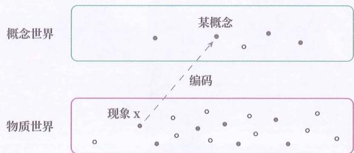

图7-1

这种行为在大脑中非常普遍，不单单对物质现象适用，对任何层面的概念都可以做进一步编码，所以我们有必要专门为其创造一个概念。

由于这一过程涉及把信息从一种形式转换成另一种形式，属于编码这一概念，又因为其作用是给现象选择某种形式用于记忆，所以我们将其称为“记忆编码”。

## 选择容器

我们可以把物质现象比作水：我们没办法直接存储水（类比记忆），需要选择一种容器（类比概念）来存储。为水选择存储容器的行为就相当于记忆编码。

## 电影译名

记忆编码又可以类比为给外国电影选择中文译名。以电影 Inception 为例，它在国内大部分地区被译成《盗梦空间》，在香港地区被译成《潜行凶间》，在台湾地区则被译成《全面启动》。

物质现象就好像 Inception 这部电影，为了让中国观众认识和记忆它，需要把它放到中文概念下。这就类似于记忆编码。不同地区有不同译法，也反映了编码的方式并不唯一。

## 图片编码

下面，我们把图 7-2 所示的图片作为物质现象，来看几个编码的例子。

图 7-2

没有编码：若直接把物质世界的层面作为对象层，也就是没有进行记忆编码，那即使记忆了该现象，也会因物质现象时刻不同，而无法用其指导未来的判别。

较具象的编码: 我们一般能想到的编码方式是, 先将该现象判别到 “两名” “拳击运动员” “正在比赛” 概念下。然后可以通过记忆这几个概念来间接记忆该现象, 还可以连同 “裁判” “观众” “围栏” 等细节一并保留。当然, 还可以更细, 把 “观众的数量” “运动员的长相” “裁判的年龄” 等细节一起加上, 以此类推。

☐ 较抽象的编码：也可以选择抽象程度较高的编码方式，将整个现象判别为“拳击赛”来编码，或者作为“竞技运动”来记忆。

◎ 视觉编码：前两种编码其实都可以归为认知层面的编码，但在认知层面的编码和物质世界的层面之间，还有一个视觉层面的编码，也就是你现在所“看”到的画面本身。这个画面就是人通过反光这一物理现象，以及眼睛（器官）和视觉系统的处理，所得到的抽象类别，就像一个不懂“拳手”“比赛”等高层概念的小宝宝所能看到的画面。你也可以想象，当狗、苍蝇、老鹰观察同一个物质现象时，所看到的画面和人看到的画面是不同的。这就是不同动物的视觉编码所导致的差异。

整个编码过程如图 7-3 所示。

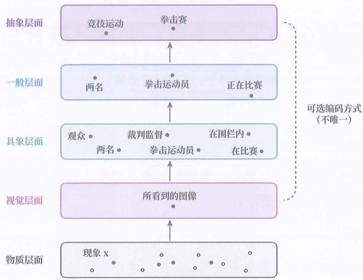

图7-3

## 多层处理

通过上例你会发现，当物质现象进入大脑后，并不是通过单一转换就编码成宏观概念的，而是一种层层加工模式。

## 三个阶段

由于我们无法确定具体有多少层，只能将这些层大致划分成三个阶段：感觉（Sensation）阶段、感知（Perception）阶段和认知（Cognition）阶段。

这三个阶段的划分,类似于我们对少年、中年、老年的划分,只是一个粗略的分类,并没有严格定义界限。

划分依据大致如下：

◎ 感觉阶段：涉及眼、耳、鼻、舌、身的器官层面。

◎ 感知阶段：涉及视觉、听觉、嗅觉、味觉、触觉的知觉层面。

◎ 认知阶段：涉及对所见所闻进一步加工的思维层面。

感知层面上的信息，也就是人们认为自己所接收到的“现实”。

表 7-1 概括了三个阶段的特点。

表 7-1 三个阶段的特点

|  |  |  |  |

| --- | --- | --- | --- |

| 加工阶段 | 加工前 | 加工后 | 加工系统 |

| 感觉阶段 | 物理感觉信号 | 神经电信号 | 眼睛、耳朵等器官 |

| 感知阶段 | 神经电信号 | 概念(低层) | 视觉、听觉等感知系统 |

| 认知阶段 | 概念(低层) | 概念(高层) | 认知系统 |

## 下层依赖

每一个阶段的加工都依赖前一个阶段的加工结果，如果前面的阶段出了问题，后面的阶段就会跟着受影响。

## 器官问题

当眼睛出现问题时，会影响到感觉阶段，进而影响感知和认知阶段，相关现象如弱视、近视等。

## 感知问题

当视觉系统出现问题时，即使眼睛功能正常，感知阶段也会受到影响，相关现象包括失读症（文字辨识障碍）和面盲症（面部辨识障碍）等。

## 自主处理

经过这样层层处理的结果，有些是我们意识所能感知到的，有些则不是。这里需要引入两个新概念——“意识处理”和“自主处理”。

自主处理是指不能被意识直接控制和察觉的大脑处理过程，如紧张反应、颜色判别或快与人相撞时自主躲闪等。

## 颜色判别

现在，请快速判别图 7- 4 中 A 方块和 B 方块的颜色深浅。

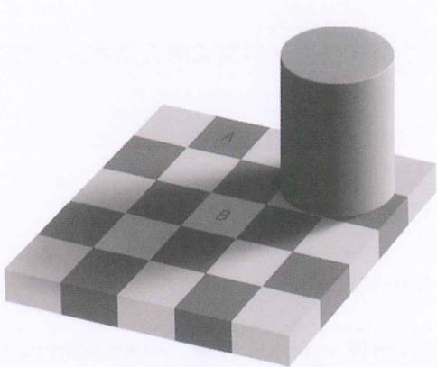

图7-4

你的判别结果应该是：A方块比B方块的颜色更深。这也是很正常的结果。

接着，请你将图7-4中除A方块和B方块外的区域遮挡住，只观察这两个方块。

你会惊讶地发现，A、B 方块的颜色实际上是相同的。二者的 RGB 颜色值均为 (120,120,120)。若不相信，可以使用图像处理软件来检验。

这张图是麻省理工学院的 Edward H. Adelson 教授在 1995 年发表的视觉错觉图(棋盘阴影错觉)。它揭示了人脑对颜色的判别，会受到周围颜色和光影的共同影响，同时佐证了人脑看到的颜色不是客观物质现象，而是概念判别结果。

颜色判别是一瞬间的事，在这个过程中我们也不会意识到眼前的物理反光是如何被判别成不同颜色的。而且，即使你知道 A、B 方块的颜色是相同的，在观察整张图时，你也无法通过意识改变自己对颜色的判别结果。

该例子很好地展示了自主处理的特点。

## 潜意识

自主处理也常被称为“潜意识”或“下意识”。然而，“潜意识”这个词已经被“污染”了。该词原本是描述无须意识参与的处理过程的一个术语，却在很多地方被“污染”成了一种“能够操纵人的行为的、未被开发的神秘潜能”，“潜”字被曲解成了“潜能”。所以，浆果避开“潜意识”这个词，改用“自主”，去凸显无须意识干预的自主处理的属性。

## 意识处理

意识处理是指能被意识直接控制和察觉的大脑处理过程。如连加计算、计数、未来计划等。

## 连加计算

现在，请口算 $17 + 106 - 24$ 。

你可能会先算 $17 + 106 = 123$ ，暂时记住该结果，再算 $123 - 24 = 99$ 。

在计算中，你能意识到每一步计算过程、中间结果和最终结果。你还可以靠意识改变处理方式。例如，先算 $106 - 24 = 82$ ，再算 $17 + 82 = 99$ 。

这就是一个意识处理的例子。

## 指挥乐手

我们可以用管弦乐队来做类比。

一支管弦乐队是由一个指挥和大量乐手共同组成的。

指挥虽然是乐队的“灵魂”，但他无法独自完成演奏，其职责主要在于统筹全局与调整细节，具体乐曲由乐手演奏。

乐手虽然听从指挥演奏，但如何具体实现指挥的要求，则由其凭借专业知识来进行自主处理，此过程不受指挥干预。

大脑的意识处理就如同乐队中的指挥，而自主处理则类似乐队里的乐手，二者相互配合，才使人脑能够应对各种信息处理任务。

## 两种编码

同样地，记忆编码也有意识处理和自主处理之分。这里分别将其命名为“意识编码”和“自主编码”。

自主编码是大脑自主完成的，不需要意识干预，即使不想编码也不行。

所以大家不必看到网络科普文章说“记忆需要编码”，就担心自己“（在意识上）没去编码，导致记不住”。

如图 7-5 所示，自主编码所涉及的大脑区域偏低层。越是低层的记忆编码，越倾向于自主处理；相反，越是高层的记忆编码，越倾向于意识处理。

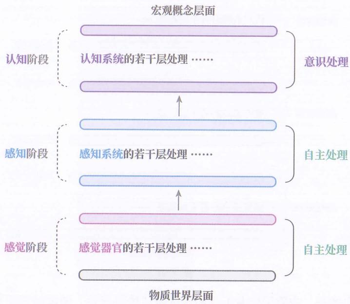

图7-5

这点很好理解，因为越低层意味着越具象，需要保留的细节就越多，而负责整体调控的意识，无法同时对那么多的细节进行比较和处理，所以传递到意识层面的信息，都是去除了大量细节的、容易比较异同的高层抽象类别。

我们可以大致认为，感觉和感知阶段的记忆编码通常属于自主处理，而认知阶段的记忆编码则属于意识处理。

## 两种记忆

通常，人们所说的“记忆”都是指意识编码下的记忆，我们称其为“外显记忆”。

根据记忆编码的分类可知，大脑还可以有自主编码下的记忆。这就意味着，当一个物质现象从物质世界层面转换到认知抽象层面时，大脑会保存一些“中间”判别结果（抽象类别）。这些“中间”判别结果保存在大脑的相对低层的系统中，对意识而言是不可见的，我们称其为“内隐记忆”，如图7-6所示。

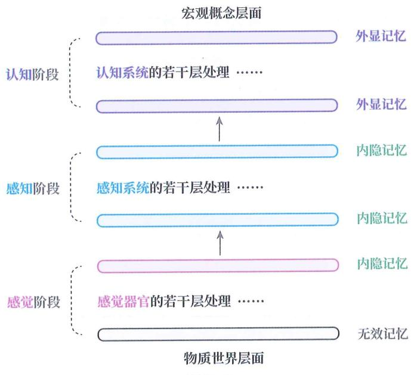

图 7- 6

需要指出的是，内隐记忆并不是经过某些“神秘开发”便能被意识提取的记忆，单纯就是不在意识层面上处理的记忆。

## 苹果内隐

下面拿大脑对被编码为苹果的物质现象（简称“真实苹果”）的处理，来说明什么是内隐记忆。

原始层面：真实苹果是未经任何大脑加工前的状态。此处无法形成有效记忆。

◎ 感觉阶段：真实苹果经过人眼的处理后，会变成神经电信号组合。

☐ 感知阶段：神经电信号组合经过感知系统的编码后，会变成苹果的画像。苹果的画像也是被人们误以为是真实苹果的东西。该阶段涉及很多层处理——感知系统先将神经电信号组合初步判别为可能代表着光强、角、棱、弧等信号的组合，再做层层判别，最后才有了苹果的画像。这些中间处理结果（光强、角等）有时也会被大脑所保存，但无法被意识所感知。这些就是内隐记忆。

☐ 认知阶段: 对大量不同的苹果的画像做进一步抽象, 便能得到红富士、国光、王林等概念, 还可以进一步抽象出苹果和非苹果的概念。这些就是外显记忆了。

## 三词辨析

在心理学中，常把对意识不可见的记忆编码叫作“心理表征”，把对意识可见的抽象类别叫作“概念”。二者本质上都是判别模型所划分出的抽象类别，只不过在能否被意识感知上有差异。

在本书中，表征有“内隐”和“外显”之分，所以不用“心理表征”这个名称。

同理，本书还会用到“内隐概念”和“外显概念”，都用来表达能否被意识感知。

不过，本书在使用“概念”“表征”“记忆”时，分别有不同的侧重。

◎ 使用 “概念” 时：在突出它有别于其他类别的属性。

◎ 使用 “表征” 时：在突出它是被用于替代其他现象的属性。

◎ 使用 “记忆” 时：在突出它是被保存以便日后重现的属性。

## 三词例句

下面用三个例句来展现三个词语的区别。

“概念”例句：“苹果的画像和真实苹果是两个不同的概念。”

“表征”例句：“在大脑中，苹果的画像是对真实苹果的一种表征。不同动物感知到的画像并不相同，因而表征也各有差异。”

“记忆”例句：“当我们回忆真实苹果时，脑中呈现的记忆是苹果的画像。”

## 状态关系

注意，模型不同于概念、表征、记忆。

模型是一种关系，而概念、表征、记忆则都是一种状态。

判别模型对现象的归类结果是概念 / 表征 / 记忆。

水管

可以用流速和水管来类比概念、表征、记忆与模型的关系：

概念、表征、记忆就好比入管前或出管后的水流流速。

模型就好比水管，代表从一个流速到另一个流速的转换关系。

在其他领域，“记忆”和“模型”经常有随意混用的情况。在本书中，将严格按照上述区别来使用这两个词语。

## 编码前提

想用某个概念来对现象进行编码和记忆是有前提的，那就是先渐构出对应的判别模型。

换句话说，具有上层记忆的前提，是先有下层模型，如果没有，就只能停留在下层进行记忆。

## 孩子具象

小孩子的记忆更加具象，这不单纯是因为小孩子记忆力好的缘故，也是由于小孩子没有渐构成出高层模型，无法用更抽象的概念来编码现象，只能用具象概念来进行编码和记忆，因此就保留了更多的细节。

例如，《你想活出怎样的人生》这部宫崎骏的电影，很多大人观看时，都会抱怨“看不懂”。这里的“看不懂”其实指的是找不到某个高层概念对电影进行归类。但小孩子没这个困扰，他们会把电影内容编码成各种神奇的怪鸟、鹦鹉，以及它们之间都发生了什么，由于没有归类到某个高层概念，反而保留了大量细节。

## 渐构内隐

上层记忆的形成离不开下层模型的支持，同样地，下层模型又依赖更下层的记忆作为建模素材。

这就是为什么内隐记忆虽然无法被意识感知，但是仍然至关重要。

当大脑想要对现象产生新感知时，自主系统就需要对更下层内隐记忆进行类化，以得到新的内隐模型。

当大脑发现自己对现象的感知存在缺陷时，想要更新旧感知，也需要用更下层的内隐记忆来调整旧的内隐模型。

## 英语听力

例如，很多中国人初学英语音标 [th] 时，很容易听（感知）成 [s]。尽管他们在意识上知道 [th] 和 [s] 是不同的，也难以在单独听到 “thinking” 或 “sinking” 时

区分二者。

造成该现象的原因是：中文没有 [th] 的音素概念，所以当初学者听到 [th] 的物理声音时，都会被脑中既有的 [s] 判别模型自主编码成 [s] 的音素。

然而，经过长时间的区分练习，学习者会发现自己能够听出[th]和[s]的区别了，可每次练习后，感觉自己并没有记住什么，因此往往十分惊喜。

造成该现象的原因是：每次训练后，大脑实际上会保留一些内隐记忆，也就是从 [th] 的物理声音判别到 [s] 的音素概念的“中间”归类结果。这些“中间”归类结果会被大脑用来更新、调整旧的内隐模型，使其逐渐变成能区分 [th] 和 [s] 的内隐判别模型。此后，当再听到 [th] 的物理声音时，就会被脑中新的内隐模型判别成 [th] 的音素概念了，如图 7-7 所示。

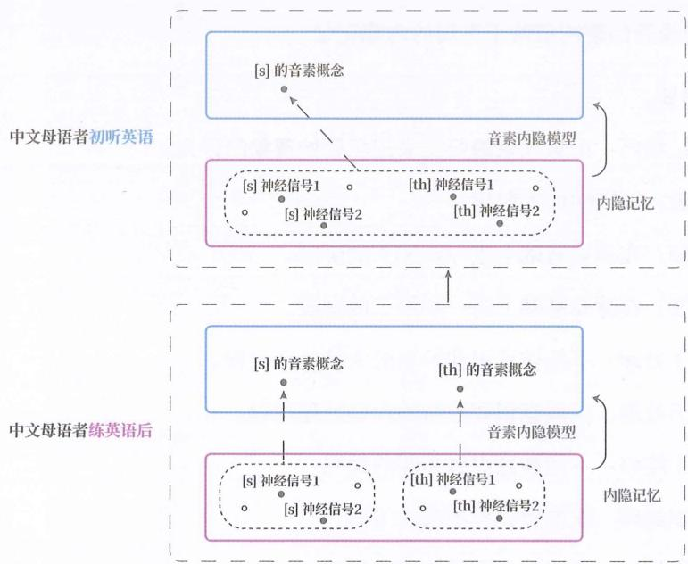

图 7- 7

很多知识的学习，如外语的听音、发音、识字、写字/打字，都是在渐构内隐模型，但学习者往往误以为只要在意识层面懂了就是学会了，于是当自己听懂[th]和[s]的发音讲解时，便不再练习了，跳过了对应内隐模型的渐构。

## 忆型转变

至此，你可能会想到一个问题：大脑对某个任务的执行，是否可以从意识处理

转变成自主处理？两种处理各有什么优劣？

## 主干提要

1. 人脑需要将物质现象编码成某个概念进行记忆。

2. 人脑的编码并非单一转换，而是多层加工。

3. 人脑的多层加工可大致分为感觉、感知和认知三个阶段。

4. 人脑下一层的加工依赖于上一层的结果。

5. 根据能否被意识感知，人脑的加工处理可分为自主处理和意识处理。

6. 编码可分为自主编码和意识编码。

7. 记忆可分为内隐记忆和外显记忆。

8. 运用某概念来编码的前提是已渐构此概念的判别模型。

9. 内隐模型的渐构依赖于下层的内隐记忆。

## 概念提要

◎ 记忆编码：用对现象的归类来记忆原始现象的行为。

◎ 感觉：器官的加工阶段。

◎ 感知：在感觉基础上进一步加工的阶段。

◎ 认知：在感知基础上进一步加工的阶段。

◎ 自主处理：不能被意识和控制的大脑处理过程。

◎ 意识处理：能被意识和控制的大脑处理过程。

◎ 自主编码：不能被意识和控制的编码。

◎ 意识编码：能被意识和控制的编码。

◎ 内隐记忆：不能被意识和控制的记忆。

◎ 外显记忆：能被意识和控制的记忆。

◎ 内隐模型：不能被意识和控制的模型。

◎ 外显模型：能被意识和控制的模型。

◎ 概念 / 记忆 / 表征：用于区分现象 / 用于重现现象 / 用于代替现象。

◎ 模型 vs 概念 / 记忆 / 表征：关系 vs 状态。

## 自主优劣

## 自主化

能否从意识处理转成自主处理，取决于任务的性质。有些任务不行，但许多都可以。

为了方便指代，我们把大脑对某个任务的执行，从只能靠意识处理，变成可以自主处理的转换过程称为“自主化”或“内隐化”。

像 [th] 的听力感知这样的任务，本身就无法依靠意识处理来做到，自然也就谈不上从意识处理到自主处理的自主化了。

一些复合性很强的任务，依赖于多个模型和外部记忆的综合调用，必须依靠意识处理，同样也谈不上自主化。

还有一些任务, 当我们第一次去执行的时候, 脑中并没有针对该任务的内隐模型, 只能依靠意识对多个模型和外部记忆的综合调用来实现。但每次执行后, 脑中会留下相应的内隐记忆。随着大脑对这些内隐记忆的积累和加工, 针对该任务的内隐模型就被渐构出来了, 之后便可用这个内隐模型来直接自主处理该任务, 也就实现了自主化的转变, 如图 8-1 所示。

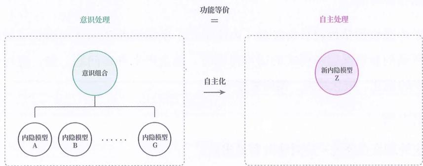

图8-1

## 打字

例如，当我们第一次学习键盘打字时，脑中并没有键盘打字的内隐模型，我们只能通过有意识地将确定字母、寻找键位、判断手指、单次敲击这几个步骤组合在一起，来实现键盘打字。但随着不断实操，大脑会慢慢根据所积累的内隐记忆渐构成键盘打字的内隐模型，也就实现了键盘打字的自主化。

## 培养乐手

如果把新任务类比成新乐器，把大脑类比成乐队，那么自主化就好比：乐队培养了一个专门演奏新乐器的乐手，以后可以交由乐队指挥（类比意识）直接调遣。

## 自主优劣

那自主化了之后，会有什么好处，又有什么坏处呢？

## 多少钱

现在请你以最快速度回答下面的问题：

“笔记本与铅笔加来起共 11 元，笔记本比铅笔贵 10 元，铅笔少多钱？”

很多人会回答 1 元，也就是用 11 元减去 10 元。但铅笔应该是 0.5 元，而笔记本应该为 10.5 元，只有这样才会相差 10 元。

可能你有所防备，答对了。但请你再读一遍问题，会发现其实句子中的“起”和“来”字，“少”与“多”字的顺序颠倒了。

## 几大缺点

从这个例子可以看出，虽然自主处理能让我们轻松快捷地处理任务，但自主处理也容易出错。

由于内隐模型是根据日常经验（内隐记忆）所渐构的局部适用模式（规律），当所遇的新情况超越模式的适用范围时，就会产生许多问题，如：应对误判、知识的诅咒、概念遮蔽、编码繁重等。

## 应对误判

自主处理在选择统一应对法时容易出错。

当遇到非典型问题时，自主处理会很容易因为该问题的某个侧面碰巧符合某个

内隐模型，而将问题判别到错误的概念体系下，以错误的方法去应对。

## 减法误判

上面的“铅笔多少钱”就是很好的例子。这并不是因为我们不够聪明，而是当我们被要求快速执行某任务时，大脑往往会因为时间紧迫，跳过意识，直接做自主处理，于是就用基于平时经验所建立的内隐判别模型，把问题判别成了典型减法来解决。

## 扔垃圾

又如，一个人一手拿着手机，一手拿着饮料，跟朋友聊得正起劲时，结果把手机当喝完饮料的空杯子扔了。

## 吃墨

还有 “王羲之吃墨” 的故事，由于王羲之的意识被写字任务占用了，误把墨汁当成了蒜泥蘸着吃了。

## 魔术引导

魔术可以说就是专门运用“应对误判”的一门艺术。魔术师在表演时，会通过各种手段引导观众的大脑产生误判。比如，有意制造一些符合日常经验但实际“反模式”的特殊情况。

## 知识诅咒

自主处理还容易产生“知识的诅咒”。

当我们首次学习某个新概念时，可以清楚地认识到自己是怎么将某现象判别成特定概念的。但当这个判别过程在我们的脑中自主化后，我们就会无意识地运用这个概念来编码和解释周围的现象，甚至将编码结果视为了现象本身。

于是，我们开始回不到原来的现象层面，很难理解别人为什么和自己不在一个层面上，也很难理解初学者为什么不懂，意识不到自己其实已经运用了一种知识，也就是那个概念的内隐判别模型，而别人脑中未必有这个模型，或者对所讨论的现象用其他概念进行了编码。

当我们尝试指导他人时，由于没有意识到某种知识的存在，也就不会把对方的不理解归因于自己漏讲了某种知识，而认为是其他原因所致。

## 辅导数学

家长辅导孩子学习时，就会出现大量“知识的诅咒”。

想象一下, 一位家长正辅导孩子如何用加减消元法来解方程组, 指着试卷大声说: “来, 先读题。

“笔记本与铅笔加起来共11元，笔记本比铅笔贵10元，铅笔多少钱？”

“我们设笔记本为 $x$ 元，铅笔为 $y$ 元。

“由题可知， $x + y = 11$ ，x - y = 10。

“用第一个方程减去第二个方程，得到 $2y = 1$ ，进而求得 $y = 0.5$ 。

可家长每次讲完一道题，让孩子做新题时，孩子就是做不出来。这使家长愈发不耐烦。因为家长认为，这么简单的加减消元法，孩子不可能学不会，肯定是不认真、没用心。

但真实情况是：孩子不懂的并非加减消元法的步骤，而是不理解什么现象可以被判别为未知数、什么现象可以被判别为方程，也就是缺少未知数和方程的判别模型。

这些基础数学概念的判别对于熟悉相关内容的家长来说已经内隐化、自主化了，家长很难意识到，导致孩子做不出加减消元法题目的真正原因是孩子无法从题中找出能被判别为未知数和方程的现象。

## 概念遮蔽

自主处理还容易导致概念遮蔽：一些不该被剔除细节的现象，也被我们归类成了特定概念，从而遮蔽了该现象的某些关键信息。

## 老板指责

我们都有过这样的经历: 吵架的时候词穷语塞, 事后才反应过来其实能完美反驳。

比方说，一位员工索要加班费，被老板指责：“只顾个人利益，丝毫不肯奉献，不为公司着想。以后公司有什么福利，你觉得还有可能分到你吗？”该员工想回应，却一时语塞，后来才反应过来哪里不对。

这其实就是自主编码所带来的遮蔽。在当时对峙的状态下，员工的大脑无意识地顺着老板提供的概念来编码，并直接在老板所归类的层面上——也就是“自私”的层面上——思考怎么反驳，但“自私不好”这个命题本身是没问题的，所以员工当时语塞。

可问题出在编码之前，那个被归为“自私”的现象原本是什么，以及这种概念编码是否合理。这些都在大脑的自主处理中被暂时遮蔽了，员工的思维完全陷到了“自私不好”的命题网络中，跳不出来了。

## 母语遮蔽

我们学习外语时存在一个有趣现象，也是自主编码带来的遮蔽所导致的。

那就是，成年人初学外语时，总是觉得词汇量不够，想表达的概念不知道用外语怎么说。但实际上，他完全有能力表达，只是他的大脑总是用平时习惯的母语概念进行自主编码，导致意识不到自己只要用层次较低的概念就能表达类似的意思。

比如，某英语初学者想要表达“他具有勤俭节约的优秀品质”，结果不会说“勤俭节约”的英语单词。其实，说“He doesn't waste anything”或“He is good at saving money”就能表达相近的意思了。

## 回撤转码

那么，要怎么避免自主编码所带来的遮蔽问题呢？

一种办法就是将归类后的概念还原到归类前的现象，恢复那些被抽象掉的特殊属性，如图 8-2 所示。

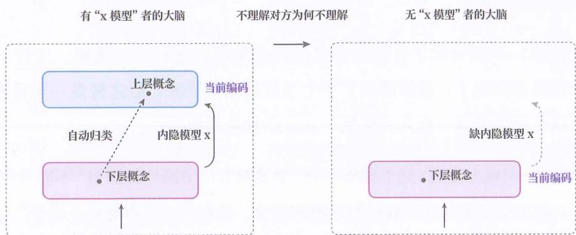

图8-2

我们称该过程为“现象还原”或“编码回撤”。

接着，为还原后的现象重新选择一个更合理的概念编码。我们称其为“重新归类”或“编码转换”，如图8-3所示。

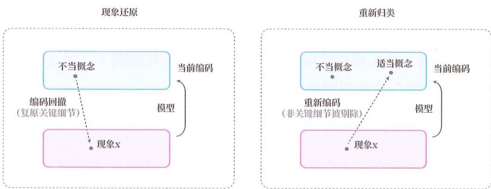

图8-3

通常，现象还原和重新归类是配合使用的，但也可以选择不再归类，而是直接在还原后的现象层面进行处理。

需要明确的是：“现象还原”并非还原到物质现象的层面，而是回到归类前的抽象层级，可能结果不完全相同，但能够尽量去逼近。因此，将现象还原理解为降低抽象层级更为准确。

## 关系回撤

拿“员工被指责”的例子来说，不要在老板所判别的自私和奉献的抽象层面上思考如何反驳，而是先思考原始现象是什么？

思考结果可以是：一个人拿出一部分时间给另一个人做事情，以换取金钱或其他形式的回报。某天，该人被要求额外拿出一部分时间来做事情，而他想要对方给出额外的回报。

这个还原，不仅回撤了自私和奉献的概念编码，连员工、老板、工作、薪水的概念编码都回撤了，整体降到了一个很低的抽象层级。但这只是一种还原方式，还可以选择稍微高一点儿或更低一点儿的抽象层级。

还原后, 我们就会发现, 这个现象中的 “想要对方给出额外的回报” 不能被归为自私, 两个人的关系也不存在可被归为奉献的成分, 反而是 “老板称员工自私” 的行为是老板用来遮蔽 “自己想要员工额外干活, 但不打算给额外回报” 的说辞。

我们可以选择就在这个抽象层级上进行认识，也可以选择重新归类，将双方关系归为交换或交易。重新归类后，我们能更加清楚地意识到，交换行为根本不存在自私和奉献一说，甚至可以反过来把“老板要求员工额外工作，但不给相应报酬”的行为归为剥削。

## 资本论

至此，不得不提卡尔·马克思这位“还原再归类”大师。

马克思在《资本论》中，对薪水、雇佣、资本、劳动等概念统统做了现象还原，将资本主义被政治经济学概念所遮蔽的“不公”和“自我悖论”，全都揭示了出来。因此《资本论》的副书名为“政治经济学批判”，该书是对政治经济学的概念归类的批判。

## 渐构回撤

其实浆果对学习也采用了还原再归类，将社会视角下的“学习”还原到了现象层面，以揭示被社会视角所遮蔽的属性。

## 观看字符

请观看图8-4中的内容10秒钟。

## 43DC65FE87HG

图8-4

由于没有提前告知需记忆图中这串字符，你对它的编码应该是一种无意识干预的自主编码。此时，你可能会像大多数人一样，只能回想起几个字符。

现在，请再次观察图 8-4 中的字符，并有意识地进行记忆。此时，你可能会采取多种不同的编码方式，例如：

◎ 将每两个字符视为一组，记忆成 43-DC-65-FE-87-HG。

◎ 将每四个字符视为一组，记忆成 43DC-65FE-87HG。

◎ 将数字和字母分开，记忆成 436587-DCFEHG，然后交叉排序。

◎ 用数字按顺序代表26个字母，仅记忆436587，再根据各数字确定对应字母。

◎ 在上一种编码的基础上，把 436587 看作 345678，再每两个数调换一次顺序。

你会发现，同样是记忆 43DC65FE87HG，但采用不同的编码方式，会产生不一样的记忆效果，甚至会造成能记住和记不住的巨大差异。也就是说：我们的记忆能力并不是固定不变的，取决于我们对现象的编码方式。

## 编码繁重

## 为什么会产生上面的现象？

我们知道，大脑可以同时保留在意识上的信息量是非常有限的，通常为约4个记忆单元。这也是为什么我们在报电话号码时，会将其分成每组3～4个数字。

但大脑的记忆单元不是数字、字母或汉字，而是概念，只不过一个概念可以代表任何现象，比如一个数字、一对字母或一个故事。不同的编码方式意味着大脑会将所需记忆的内容拆分成不同数量的概念来记忆。就像把一堆水果装进若干个箱子中来保存，根据选用的箱子大小，拆分出的箱子数量就会不一样。当我们的大脑对一个现象采用自主编码时，就可能因为拆分出的概念数量超过工作记忆容量，导致记不住。

我们把不佳的自主编码导致过多的记忆单元被浪费的现象简称为“编码繁重”。

## 组块化

面对编码繁重现象，我们可以有意识地去优化编码方式，减少编码所需的概念数量，使其能够被大脑的工作记忆同时容纳。而这也意味着，我们要将原本靠多个概念所编码的部分仅用一个概念来编码，这种编码优化也被称为“组块化”。

## 字符串

例如，在刚才记忆那串字符时，我们就将“一个概念编码为一个字符”改成了“一个概念编码为两个字符”，甚至改成了“一个概念编码为六个字符”。

## 一箱多装

前面曾把所要记忆的现象比作水果，把概念比作箱子，而组块化就相当于把一个箱子装一个水果改成一个箱子装多个水果，从而减少箱子总数。

## 组块代价

如果你现在上网搜索“组块化”，会发现“组块化”被描绘成了“记忆的神器”。

浆果有必要对这种普遍存在的夸大进行澄清。

组块化现象是真实存在的，但仅仅知道组块化这个概念，以及组块化能帮助优化工作记忆容量这一现象，并不能提升你的记忆力。

原因在于，组块化的运用是有条件的。你必须先经过大量的训练，渐构出对应概念的判别模型，才能用这个概念来编码。这就像，你必须先造出能装多个水果的箱子，才能用一个箱子装多个水果。

然而，一个概念所需整合的内容越多，建立相应判别模型所需的训练量也就越大。这一规律表明，组块化本身并不是提升记忆力的万能钥匙。想象一下，最大的组块化就是将所要记忆的现象直接编码为一个概念，但这种方式所需的训练量过大，以至于我们实际上并无法运用这种编码方式。

## 一生

组块化现象并不神秘，因为我们从小到大一直在不知不觉中进行着组块化。

初学汉语时，我们用一个个偏旁部首来编码汉字。

后来，我们开始将多个偏旁部首视作一个整体，以此来编码汉字。

再后来，我们甚至能将多个汉字视作一个整体，来编码词汇、短语，乃至整句话。

但多数人的组块化也就停留在了编码短语和零星的句子，不是因为不懂组块化的好处，而是段落组块的通用性很差，为了能兼顾到无数个不同段落，所需的训练量已经超出了普通人的承受范围。

## 专业化

很多人所讨厌的专业概念，其实就是组块化的应用。

组块化不是被描述成了“记忆的神器”了吗？为什么还被很多人讨厌呢？因为人们接受不了组块化的代价。

## 组块启示

实际上，组块化最直接的作用是：它让我们明白，通过有意识地编码，有时可以优化自主编码过程中出现的编码单元数量超过工作记忆容量的问题。

这就好比让我们明白，当相机的自动对焦功能无法准确对焦时，转用手动对焦是一个有效办法。

至于提升记忆力，其实组块化给我们的最终指导是：要想提高记忆力，就需要通过努力训练，渐构出更多的判别模型，丰富自己脑中的概念世界。

## 凭何而造

可见，不论是组块化，还是前面所说的还原再归类，都回归到了对概念世界的渐构。

既然概念如此重要，必然有人要追问：概念难道是我们想造就能造的吗？要以什么为依据，来判断一个新造的概念是否科学？

## 主干提要

1. 有些任务可从仅能意识处理转变为可以自主处理。

2. 自主处理虽快，但有应对误判、知识的诅咒、概念遮蔽、编码繁重等缺点。

3. 可通过有意识地进行现象还原 + 重新编码，克服自主编码导致的概念遮蔽。

4. 可通过组块化克服编码繁重问题，降低工作记忆所需的容量。

5. 运用组块化要先渐构对应的判别模型，概念整合涉及的内容越多，渐构的代价越大。

## 概念提要

◎ 自主化 / 内隐化：从仅能意识处理到可以自主处理的转变。

◎ 知识的诅咒：因内隐化而意识不到自己的编码有异于他人的编码。

◎ 现象还原 / 编码回撤：将编码后的概念还原到编码前的原现象。

◎ 重新归类 / 编码转换：对还原后的现象重新进行编码。

☐ 组块化：通过有意识地优化编码方式，减少编码所需的概念数量，降低工作记忆所需的容量。

## 类固有观

## 矫正观念

经过前面章节的铺垫，你实际上已经可以用一句话回答“类固有观是否正确”这个问题了。

但在揭晓答案之前，我们先来看看一个极为普遍的误解，然后给出科学的观点。

## 普遍观念

一种观念是: 物质世界中存在天然固有的类别, 科学地创造概念就是去发现它们。

例如，苹果这个概念之所以正确，是因为在物质世界中，天然固有一类应被划分成“苹果”的现象。即使没有人类，它也早就存在了，人类只是如实地将其找了出来。

这种观念非常普遍，代表了人类的阶段性认识。接下来会解释：

◎ 为什么这种观念是一种误解。

◎ 这种观念会对人产生什么深远影响。

◎ 高中生产生这种观念的原因。

## 难解原因

这个误解之所以难以澄清，一个重要原因是：很多人并不熟悉概念是如何被创造的，甚至连概念是什么都还不清楚，导致他们都没明白这个问题讨论的到底是什么。

因此，在解释为什么这个观念是误解之前，我们需要先回顾概念的创造过程，把问题是什么描述清楚。

## 概念创造

图 9-1 展示了创造概念的三元素：一群现象（对象）、概念（类别）、划分（归类）。

物质世界（左侧大圆）中每个点代表一个现象 / 对象。

○ 划分（归类）将物质世界中所有现象分为两类。

○ 划分出的两类就是两个概念(类别),在概念世界(右侧大圆)中以两个点表示。

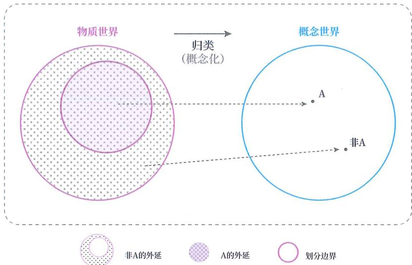

图 9- 1

创造概念的过程就是：对世间所有现象做出两类划分的过程。

## 建文件夹

这就好比你的电脑里有一堆文件（类比各种现象），你要创建一个新文件夹（类比一个概念），将其中一部分文件放进去，而剩下的文件则自动构成另一个文件夹。

创造概念的过程就相当于：把所有文件划分到两个文件夹的过程。

## 问题翻译

那么，问 “以什么为依据来判断一个新造概念是否科学”，其实相当于问 “以什么为依据来判断划分出的文件夹是否科学”。

## 观念翻译

那个普遍观念——“物质世界中存在天然固有的类别，科学地创造概念就是去发现它们”，相当于“待分类的那群文件存在着天然固有的类别，即使没有你，这些类别也存在，你按照天然类别去划分文件夹就是科学的”。

这个观念也意味着“文件群自身已经决定了该如何划分文件夹，与你无关”。

## 建夹依据

这样描述，你就能察觉哪里不太对了——如何划分文件夹怎么可能与你无关。

对同一群文件：

◎ 当你的处理目标是剪辑视频时，你会按照视频和非视频划分文件夹。

◎ 当你的处理目标是区分处理进度时，你会按照已处理和未处理划分文件夹。

◎ 当你的处理目标是腾出空间时，你会按照有用和无用划分文件夹。

你之所以要创建文件夹，本来就是为了区分处理不同文件，倘若连处理目标都没有，那怎么划分文件夹都无所谓了，甚至连划分文件夹的行为都是多余的。

## 抽象依据

你是否还记得，本书在讲解什么是抽象时，总是与统一应对法一同介绍？

原因在于：如何划分类别不能脱离对这些类别的处理目标而单独存在。

为了划分类别（概念），我们需要对一群现象进行抽象——也就是忽略其中的无关差异，保留关键共性。那么，我们如何判断哪些差异是无关的、哪些共性是关键的呢？

这完全取决于我们对所分类别的应对目标，也就是人的主观意图。

对于物质世界中的现象，抽象和类化的方式有无数种，仅凭物质现象本身并不能决定如何抽象和如何划分类别，只有结合如何处理所划分的类别这一主观目标，才能决定。

## 数的划分

举个例子。当我们对所有正数进行类化时，单凭这群正数本身能决定如何划分

概念吗？

不能。只有结合对所划分概念（类别）的处理方式，才能决定：

◎ 当对类的处理是预测能否被均分成两份时，才会把所有正数中的 2、4、6、8、10 等数字划分成一类，称其为“偶数”。

◎ 当对类的处理是预测是否有需要的存储容量时，才会把所有正数中的 128、256、512、1024 等数字划分成一类，称其为 “2 的幂”。

◎ 当对类的处理是预测作为定价能否被顾客看起来更便宜时，才会把所有正数中的 9.9、99、199、398 等数字划分成一类。如果这个概念还没有名字，可以新起一个，比如 “定价尾数”。

## 类固有观

此时，我们再回到那个普遍观念：

在物质世界中，存在着天然固有的类别。即便没有人类，这些类别也早已存在。而科学地创造概念，就是要发现这些固有类别，并据此如实创造概念。

我们把这种观念称为“类别固有观”、“类固有观”或“概念固有观”。

类固有观错在哪？

没错，它把主观目的扔了。

类固有观实际上是将一个人对一群物质现象的主观划分权从自身剥离了出去，交给了一个想象出来的“物质世界自己对现象的划分”，并将这种想象出来的固有划分视为“真理”、“客观”和“科学”。

## 误解问题

那不熟悉概念是什么和概念的创造过程的人，会怎样误解这个问题呢？

由于他们还不清楚 “依据什么创造概念等价于依据什么给现象群分类”，会误把现象和概念当成同一个东西，于是就把类固有观解读成 “物质世界天然存在现象”，把 “否定类固有观” 解读成 “否认物质现象的天然存在”。

可实际上，这个问题的关键根本不是物质现象是否天然存在，而是划分方式是

否天然存在。

正确的解释是: 物质现象存在, 但划分方式和划分出来的概念都不是天然存在的, 是人构造出来的。

类固有观的问题就在于声称划分方式天然存在、跟人无关。

## 沙漠固有

我们可以把物质世界比作沙漠，把一群物质现象比作一堆沙砾，把概念（类别）比作区域。

一堆沙砾真实存在于沙漠中，但沙漠本身不会把这堆沙砾划分成不同的区域。

实际上，是生活在沙漠中的居民结合自己的生存目的，将这堆沙砾划分成了不同的区域，如高温区和低温区。沙漠没有居民的这种生存目的，不怕冷热，自然不会划分出高温区和低温区。准确地说，沙漠对这堆沙砾不会有任何划分，只会停留在一堆沙砾这个层面。沙漠也没有规定某些沙砾必须被划分到高温区，而不可被划分到危险区或部落 A 的领地。

如果沙漠中的几个部落发生领土争端，一个部落的居民要求所有部落领地的划分要遵照沙漠对这堆沙砾的固有划分，其他居民一定会觉得他们想捣鬼，因为根本不存在所谓的沙漠对这堆沙砾的固有划分。

## 衍生观念

持有类固有观的人，会自然地持有以下的衍生观念：

◎ 客观概念是静止的、永恒不变的，静静地躺在物质世界中，等待人类发现，而且一旦被全部发现，人类便无新的客观概念可创造了。

物质世界中首先存在一个个独立的、客观的概念，然后才有了这些概念间的关系。

◎ 创造客观概念，就是去逼近物质世界固有的划分，越是不加入自己的主观划分，就越能接近“客观”，越能逼近“真理”。

◎ 科学家的工作，只是发现这些天然固有的客观概念，然后找出这些概念间的关系，没有任何主观原创性。不同科学家对同一个问题的研究，只能得出唯一“正确”的概念体系，若出现两个不同的概念体系，必然有一个错了。

## 观念影响

持有这些观念会对人产生什么样的影响呢？下面简单罗列几条：

1. 由于认为客观概念是永恒不变的，所以对概念的学习倾向于单次式建构，而非渐进式建构。认为学习“阶段性”概念是走弯路，应尽量避免；对既有科学概念的更新会难以接受，认为这是对“真理”的挑战。

2. 由于认为客观概念是可独立存在的，所以对概念的学习倾向于单个单个地学习，把重点放在记住定义上，而不是结合与其他概念的关系来学习。

3. 由于认为客观概念是天然固有的，而非人类建构的，所以会以某个概念不是物质世界天然存在的为由，拒绝了解这个概念，会在未验证这些概念实用性的状态下，就直接批评这些概念的持有者是“不科学”的。

4. 由于认为客观概念是不变的、独立的、固有的，所以在不同领域遇到同名的或近似的两个概念时，常常会忽略这两个概念各自所处的关系，把其中一个概念的内涵直接套用在另一个概念上，一旦套用不上，就会非常困惑，觉得要么自己理解错了，要么其中有一个领域对客观概念的发现出错了。

## 移交他人

然而，不论是什么概念，包括科学概念，终究还是由人根据自己的主观目标从物质世界中构造出来的类别。因此，持有类固有观的人从自身剥离出去的对类别的划分权，并没有真的交给物质世界，而是变相交给了他人，并把他人根据物质现象所划分的概念误当作了物质世界的固有划分，然后奉为“客观”和“科学”。

## 双标排斥

生活中存在一些人，坚决排斥儒家、道家、佛家、中医等中国传统概念，理由是“这些概念并非自然界客观存在的”。

这里并非说中国传统概念都是合理的，而是说他们排斥这些概念的理由不合理。

如果以 “非自然界客观存在的” 为由来拒绝这些概念，那就应该拒绝人类的所有概念，因为所有概念都是构造出来的，包括孝、良知、人生意义、时间、能量、分子、三角形、数等。

所以，他们实质上是选择性地排斥概念，对于科学领域的概念不排斥，反而坚信物理和数学概念就是自然界客观存在的。

这恰恰说明了他们并没有真的在做判断，而是把概念的渐构权移交给了他们认可的某种权威，并将权威所渐构的概念错误地等同为自然界自身的概念，并以此为标准去评判其他知识体系。

## 借真袒权

由于类固有观的持有者会不自觉地将自己选中的人装扮成“大自然/上帝/真理”的化身，因此会以维护“大自然/上帝/真理”为名，去偏袒被自己选中的人的权威。换言之，该类持有者会在不自知的情况下，借维护“真理”的名义去偏袒权威（后面简称此情况为“借真袒权”）。

## 让渡话权

我们知道，自19世纪被列强以坚船利炮打开国门之后，中国开始全面学习西方的概念体系。然而，一个新的问题也随之浮现：随着年轻一代的思想中充斥着越来越多的西方概念，如果再进一步持有类固有观，将西方文化对物质现象所划分的概念当作物质现象本身，他们就不会将西方的概念体系当作理解世界的一个框架，而是当作唯一的“真理”框架。

这样，他们就很容易在不自知的情况下，以维护“真理”为名，在国际舞台上将本国的话语权拱手让给他国，还会嘲笑持不同意见的同胞不懂“科学”。

## 两个极端

然而，也有一些群体全盘否定西方的概念体系，这些群体和全盘否定中国传统概念体系的人群相比，并无差异，都是脑中只能容纳一个概念体系，无法将不同的概念体系当作理解世界的多重框架，因此就会从对西方知识的借真祖权，转向对中国传统文化的借真祖权。

## 类天然化

为了预测未见情况，人类会无法自拔地将现象归到一个个类别（概念）下，当然也会把人（作为现象）归到不同的派系、不同的性格类型中去。

例如，MBTI 性格分析就是将人按 16 种类型进行分类、分析和预测的典型例子。

然而，当一个人持有类固有观时，往往不会把这些分类当成一种临时的、有条件的、简化后的分析和预测工具，而是当成人的先天的、宿命般的本性。

一旦类固有观的持有者给自己或他人贴上某个标签，今后就容易主动寻找那些可以支撑这种分类的细节，不断加强对自己或他人的刻板印象，当面对与自我类别不符的事情时，也常常选择回避。例如，一个人被归类为内向性格时，就可能回避那些被认为适合外向性格的工作或活动，限制自己的成长。

## 神化古类

在不同文化中，其实都有一些概念，最初只是对自然或社会规律的现象分类，却在后来被赋予了超自然含义。导致这种现象的部分原因是古人将类固有观施加到了这些概念之上，坚信客观概念是自然界中天然固有的，也就将一些实用性概念转变成了教条和迷信。

我们可以用一个想象的例子来形象化这一点。设想，如果有一群人将本书所划分的概念世界、共象层、对象层、借真袒权等概念，当成自然界中固有的划分，而不是当作为分析和指导学习行为，对不同现象所划分的类别，就会把本书的概念进行超然化、教条化、迷信化，不仅可以以此借真袒权，甚至可以将其改造成一门宗教。

假设千年后，“学渣”“学霸”“学神”等概念的内涵早已丢失，仅留下了名称，那么持有类固有观的后人，搞不好会觉得这些是死后依然存在于自然界的“神明”的称呼。

## 神化今类

这种将概念神秘化的现象并非仅限于古代，它同样存在于对现代科学的理解中。以物理学中的熵增定律为例，它原本是一个分析物理现象的模型，用于预测熵随时间的变化方式。这个模型受限于特定的使用条件，当遇到不满足使用条件的现象时，我们需要切换到其他模型来分析。然而，对于那些持有类固有观的人，会不自觉地将熵增定律看作推动宇宙发展的某种神秘力量，为其赋予了不应有的超自然含义。

同样地，这些人也会不自觉地将原子、分子等物理概念当作世界本身，于是当创新者将量子力学引入一个迥异于经典物理的新模型时，他们会觉得世界本身出了bug（缺陷）。例如，当他们听到“观察者效应引起量子坍缩”时，会理解为“宇宙中存在某种神秘的监视者，不断地观察并影响人类社会”。

## 旧唯物论

其实，在高中教材《思想政治4（必修）生活与哲学》中就有对类固有观的批判，称其为“旧唯物主义”、“机械唯物主义”或“形而上学唯物主义”。

注意，这只是在教材语境中的一种称呼，不同于其他领域对“形而上学”的指代。你可以这样理解教材中的“形而上学唯物主义”：由于人们错将人对物质现象所划分的概念当成了物质世界本身，将他人主观的“心”（概念）当成了客观的“物”，所以合起来可称为“形而上学唯物主义”。

## 为何倒退

虽然教材中就批判过此观点，但不少学生最后学到的，反而就是教材批判的“旧唯物主义”。为什么会这样？

## 多重解读

其中的原因是多方面的：多重解读、阅历不足、应试环境，等等。

一是教材定义不够明确。教材用了“形而上学唯物主义”“静止”“孤立”“片面”“主观能动性”等词汇，但由于没有明确给出这些词汇的定义和背景，而是直接用来在抽象层面进行描述，故导致这些词汇对学生而言可以有多种解读。

## 阅历不足

二是学生阅历不足。即便教材给出了这些词汇的定义，学生也缺乏前置知识来理解这些概念，只能按照词语的大众含义去解读：

☐ 将 “物质世界中存在天然固有的类别” 误解为 “物质现象真实存在”，但这句话其实在讨论分类方式是否天然存在。

◎ 将 “不该静止地认识事物” 误解为 “客观概念依然永恒不变，但人类需要一点点逼近，所以逼近过程不是静止的，是运动的”。

☐ 将 “不要孤立、要全面地认识事物” 理解为 “既要承认好的一面，又要承认坏的一面”，而不是理解为 “不要脱离语境理解概念，要从关系中把握概念的内涵”。

◎ 将 “主观能动性” 理解为 “积极性” 的高端词汇，从而将其误解为 “积极参与寻找物质世界中天然存在的永恒概念”。

## 应试环境

更深层次的原因，藏在现代教育的环境中。

在某些地区，学生从小就置身于一种特殊的环境：

◎ 考高分是学生的首要目标。

◎ 知识的第一应用场景是考卷，能否应用于现实并不属于主要目标。

◎ 相比搞懂知识为何被这般渐构，顺应出卷人的思路显得更为高效。

◎ 老师是知识的权威授予者，学生是知识的被动接受者。

在这种环境中，学生对概念的学习就是在逼近一个个固定不变的（静止）、可独立存在的（孤立）、先于学生而存在的（固有）、学校指定的（唯一）概念。

为了提高得分的效率，学生也容易逐渐放弃对自身概念世界的渐构权，逐渐消磨掉对现象分类的主动性。

这就像一个人被置于一个特定规则的游戏中，自然倾向基于游戏的整体环境来渐构自己的世界观。

## 浆果看法

上面只是分析观念倒退的可能原因，并未涉及价值判断。

接下来，浆果将说一说个人的看法。对于教材，浆果认为不论用哪种解读方式，其核心目标已经达到了，那就是打破神秘迷信和空想。

可以说，绝大多数学生所理解的“唯心主义”和“唯物主义”，与哲学中的“唯心”和“唯物”不太沾边，实际上是有神论+空想和无神论+实证被冠以了“唯心”和“唯物”的名字。但这对年轻的学生而言，已经足够了。

当然，这样也有弊端。其一是占用了“唯心”和“唯物”这两个术语，导致学生今后看到“唯心”的标签就下意识地反对。例如，看到有人说“王阳明心学是唯心主义”，直接想都不想就批判。

另一个弊端是对“辩证法”的误解。如果理解为要看到一个现象的多面性也还好，因为这相当于强调“对一个现象，要用多个不同的概念体系去分析”，强调一种“多元模型思维”。就怕学生误解为“通过同时包含正反两个观点来确保绝对正确”，因为这就如同说“明天要么下雨，要么不下雨”一样，实际上是一种通过避开抉择来确保绝对正确的策略。应试型学生太需要“正确”了，毕竟“正确”意味着“得分”，所以这种误解很容易被应试型学生所采用，而这也容易让其长大后变成一个“无原则的和事佬”或“只会和稀泥的人”。

对于环境，浆果认为学生在高中毕业后，如有条件，应破除类固有观，因为这种观念不仅会影响学生今后对他人知识的继承，还会影响自己对新知识的创造。

诚然，学生放弃对自身概念世界的渐构权后，会更易于教授，便于管理。可如果一种教授方式不能让学生获得在未来独立认识和适应世界的生存能力，也就偏离了教育的目的。倘若学生一辈子无须创新也能生存得很好，持有这种观念并没什么问题。

但在人工智能日益强大的未来，创造力越来越重要。不论学校设置的“游戏规则”多么为学生考虑，学生终有一天会离开学校，独自面对这一切，所以当学生离开高中时，一定要让他们重拾对自身概念世界的渐构权，重拾这份人类相对于机器的优势。中国将来也需要更多能够创造新理论体系的人。

## 依据什么

介绍完了类固有观这个错误观念，你是否明白了什么是科学的观点？构造概念的客观性从何而来？既然不能以“非自然界客观存在的”为理由来拒绝接受概念，那我们应该以什么为依据来拒绝或接受一个概念呢？

## 主干提要

1. “以为科学概念是脱离人而天然存在的”是一种朴素的错误观念。

2. 形成类固有观的一个常见原因是不明白概念是从现象群中被划分出来的构造物，误以为概念就是现象，把“概念是否天然存在”当成了“物质现象是否天然存在”。

3. 物质现象天然存在，但从现象群中类化出的概念并不天然存在于物质世界。

4. 类化不能脱离对类的处理而存在，而类的处理取决于人的主观目标。

5. 对于同一群物质现象，会因不同的主观目标而类化出不同的概念。

6. 由于类固有观持有者认为科学概念是天然存在的，会有以下衍生影响：

（a）当自己所学科学概念被更新时，会认为真理被挑战。

（b）孤立地学习概念；以“非自然界客观存在的”为由，拒绝接受概念。

(c) 认为正确的概念是唯一的; 在不同体系中, 随便挪用近似概念。

1. 由于类固有观持有者把他人主观划分的概念当成天然存在的，会借维护“真理”的名义偏袒权威。

2. 虽然教材批判过类固有观, 但不少应试型学生仍持有类固有观的主要原因是: 在应试环境中对概念的学习就是在逼近一个个固定不变的 (静止)、可独立存在的 (孤立)、先于学生而存在的 (固有)、学校指定的 (唯一) 概念。

## 概念提要

◎ 类固有观：物质世界中存在天然固有的类别，科学地创造概念就是去发现它们。

◎ 借真袒权: 类固有观持有者以维护 “大自然 / 上帝 / 真理” 为名, 对权威的偏袒。

## 创类依据

## 一句话

其实，概念的客观性并非源于“类别固有性”，而源于“关系囊括性”。

下面详细解释。

## AB 关系

如图 10-1 所示。如果我们试图构造出一个概念 A，不论怎么划分 A 的外延，都无所谓对错。A 无法靠物质现象本身来决定。

图 10-1 中未展示非 A。但别忘了，在 A 被创造时，非 A 也必然同时诞生。二者双生双灭。

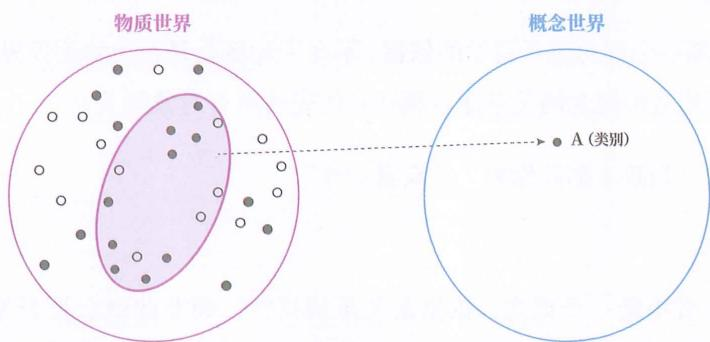

图10-1

然而, 一旦我们同时构造 $\underline{\mathbf{A}}$ 与 $\underline{\mathbf{B}}$ , 并试图在两者之间建立关系 (如从 $\underline{\mathbf{A}}$ 推测出 $\underline{\mathbf{B}}$ ), 情况就不同了。注意, 这里的 $\underline{\mathbf{B}}$ 不可以是非 $\underline{\mathbf{A}}$ , 因为非 $\underline{\mathbf{A}}$ 和 $\underline{\mathbf{A}}$ 本就是 “一体两面”。

如图 10-2 所示, 为了确保 A 与 B 所代表的两群对象间的关系全都能被 A 和 B 之间的关系所归纳, A 所代表的对象群就不能随便划分了, 受到了来自关系的约束。

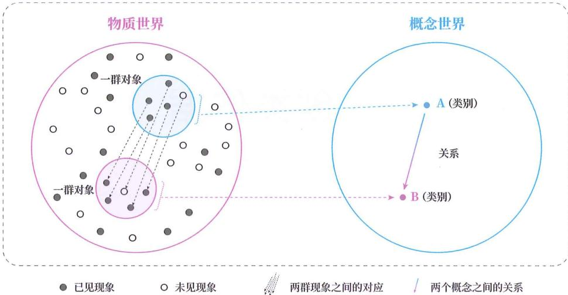

图 10-2

如果不是所有对象间关系都能被概念间关系所囊括，我们就会反过来调整 A 和 B 的抽象方式与外延，直到两者相匹配。

只有当概念间关系能够完全囊括所有对象间关系时，我们所构造的 A 与 B 之间的关系才有意义，而 A 和 B 这两个概念的构造，也是在这时获得了合理性。

## 关系囊括

因此，判断一个概念是否科学的依据，不在于此概念是否为物质世界固有的类别，而在于所构造的概念间关系能否囊括其代表的所有对象间关系。

我们将这一判断依据简称为“关系囊括性”。

## 拒绝依据

我们接受或拒绝一个概念，依据是关系囊括性，而非此概念是否为物质世界的固有类别（简称“类别固有性”）。

实质上，采用类别固有性来做依据，相当于没有依据。因为概念所代表的物质现象存在于物质世界，但没有任何一个被类化出的概念本身实存于物质世界。当人类不存在时，物质现象还存在，但人脑划分出的概念就不存在了。

## 接受力

例如，人们之所以接受力这个概念，不是因为我们找到了力在物质世界中的固有类别, 而是因为力(F)与质量(m)和加速度(a)形成的概念间关系(F=ma), 精确囊括了被“F=ma”所代表的所有对象间关系——无论是马拉车的牵引、手推墙的反作用, 还是磁铁间的吸引与排斥, 这些表面上千差万别的对象间关系, 都可以被概念间关系统一描述和预测 (由于质量和加速度也有各自的概念间关系, 因此准确来说, 力的合理性是靠一套概念网络的囊括性所支撑的)。

如果采用类别固有性来做依据，别说力了，所有概念都不应被接受。

## 拒绝阴虚

上一章说过，一些人拒绝接受中国传统概念的理由不合理。这里就拿中医中的阴虚和盗汗来说明如何合理拒绝。

大致可分为以下几步。

1. 明确外延：先明确阴虚、盗汗各自所代表的现象群（即外延）。一个概念可以代表任何对象 / 现象，只要所代表的现象群（即外延）是明确的即可——对于任何一个现象，我们都能依靠一个判别模型将其始终如一地归入阴虚或非阴虚、盗汗或非盗汗。不能今天归入阴虚，明天归入非阴虚，不能模棱两可，更不能为了让预测成立，反向改变归类依据。

2. 置于关系: 再将这两个概念置于一个关系中, 例如阴虚致盗汗, 即 “肾阴不足, 则夜间入睡后出汗, 醒后汗止; 肾阴充足, 则盗汗消失”。

3. 囊括验证：最后设计实验来验证阴虚致盗汗是否能囊括其代表的所有对象间关系。

如果在第 1 步，概念本身就没有明确的判别模型（并非没学会），则有理由拒绝阴虚。

如果在第 3 步，不能囊括，则有理由拒绝阴虚。

## 先后错位

想必不少人会感到困惑：为什么先固定概念间关系，后固定概念？在理性上能理解，但在直觉上总有种“先后颠倒”的错位感。

这种错位感, 恰恰暴露了大脑认识世界的一种特点。其实, 不是真的 “先后颠倒”, 而是我们的思维习惯了颠倒先后。

所以我们应该反过来问：为什么大脑习惯于将概念视为“先”，反倒将更核心的关系作为“后”？

## 解释两点

接下来解释两点:

1. 为什么关系才是核心，概念是派生物。

2. 为什么大脑反而将作为派生物的概念作为思维起点。

## 拆解认识

人们常把人生比作一条河。这个比喻生动地凸显了我们所生存的物质世界是一个永不停歇、连续变化的动态进程。这个“进程”实际上并无起点和终点。

然而，生存于其中的我们，为了拥有预测能力，不得不进行一种人为的拆解：

1. 从连续的进程中，人为切割出一段进程（这里称之为“一个事件”）。

2. 将一个事件简化拆解成起点状态（静止瞬间）和终点状态（静止瞬间），并用起点到终点的关系来代表这个事件。

之所以要采用这种“化线为点”的方式来认识一个事件，是因为我们的生存依赖于提前预测——只有将一个事件简化拆解成两个状态，让其分别处于当下和未来，我们才能用处于当下的状态提前预测处于未来的状态，从而在实际发生损害之前做出规避。

但这种拆解要认识的东西仍是一个事件，而非被拆解出的两个状态。这就像画两个点来连成线时，想要画的是线，而非点。

如果其中一个状态不与其他状态产生关系, 就不能表达世界的事件/运动/变化/发展, 不能指导我们的生存, 就像未被连接的两个点无法表达线一样。

## 先后颠倒

在每次思考 / 预测时，我们都是以状态为始、以状态为终的，这会给我们一种时刻在以状态为中心的错觉，反而忽略了由状态连接起来的“无形之线”才是我们真正要认识的目标。

这就是我们产生“先后颠倒”错觉的根源：大脑将思维习惯上的先后错误地投射为世界本身的先后了。

## 对象关系

若用书中的术语来描述：上面所说的状态就是对象，而从起点状态到终点状态的关系便是对象间关系。

于是，我们可以说，对象间关系是大脑用来认识世界的简化方式。

注意，这里所说的对象间关系都是单向关系，这意味着，若调换位置，就会变成另一个关系。

## 概念关系

## 那么，概念间关系又是做什么的呢？

正如第 01 章所述，由于我们几乎遇不到两次一模一样的物质现象（对象），大脑没办法在物质现象（对象）所在的层面，直接认识这些对象间关系（代表事件）。

为了能够应对未见事件，大脑不得不在物质层面之上构造出概念层面，利用概念间关系间接地认识同一类对象间关系。

也就是说，构造概念间关系本质上还是在认识对象间关系，它只不过是大脑为了应对未见的对象间关系而构造出来的一种辅助工具，如图 10-3 所示。

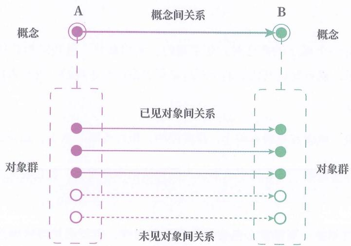

图10-3

但一个孤立存在的概念（也就是不与其他概念产生关系的概念），同样无法表达一类事件。

我们至少需要构造两个概念，并让两个概念间的关系能够囊括其代表的所有对象间关系，才能表达一类事件。

## 虚实颠倒

由于物质对象处处不同，让我们的大脑始终都在用概念间关系来认识世界。我们平时所说的“对象间关系”，在绝对层级的视角下，其实也是概念间关系，只不过是被类对象化后的概念间关系。

这导致在大脑中，概念占据了核心地位，成为思维的基本单位。对大脑而言，概念比任何东西都要“真实”。

所以，当人们第一次意识到概念是大脑构造的、而非物质世界的实存时，就会感到一种“虚实颠倒”的错位感。

这种 “虚实颠倒” 的错位感和 “先后颠倒” 的错位感一样，都是由于大脑将思维习惯上的虚实错误地投射为世界本身的虚实。

## 客观依据

虽然概念是大脑主观构造的，但这并不意味着概念没有客观性。只不过，概念的客观性并不来自于概念在物质世界的实存性（类别固有性），而来自于关系囊括性。

我们构造一个孤立的概念时，是主观的、无约束的，但我们构造的两个概念之间的关系，能否囊括其代表的全部对象间关系却是客观的、有约束的。

## 所唯之物

也就是说，概念在反映本貌上，是虚假的，但在反映关系上，却是真实的。

我们“所唯之物”并非许多人所认为的物质的本来面貌，而是物质之间的关系。

关于这一点，其实在前面学习什么是概念时，就已经可以意识到了：构造概念必然经过抽象，而抽象必然会剔除事物的属性，也就必然导致概念无法反映事

物的原貌。

恰恰是这种“反映关系,不反映本貌”的认识方式,使我们不必将整个外部世界“搬进”大脑才能进行认识,让我们能用脑中神经信号之间的关系来代表物质对象之间的关系,能用语言符号之间的关系来代表现实事物之间的关系。

## 车龙关系

还是用“概念世界”一章中所举的例子。假如有一辆大卡车向我们迎面驶来，即使我们把驶来的卡车想象成霸王龙，把人类想象成小动物，把被撞想象成被吃，我们依然可以避免被大卡车撞到。因为霸王龙、小动物、被吃反映了驶来的卡车、人类、被撞的关系。

## 最初概念

不过，想必还是会有人提出这样一个问题：既然概念的合理性需要由概念间的关系来支撑，那么第一个概念又是依靠什么来确立其自身的？

## 先天概念

其实，人脑并不会完全从零开始构造“第一个概念”。因为从出生起，我们的大脑就已携带了一套由演化塑造的生理预设——它预先决定了我们倾向于将哪些现象识别为可爱，将哪些物质归为食物，又将哪些现象归为光、声音和疼痛。

我们可以将这些由生理预设所构造出的概念称为“先天概念”。它们构成了我们认知大厦的基石与初始框架。

此后，我们对世界所划分的概念，正是在这些先天概念基础上，继续构造的。

## 相互依存

同时，我们还会同时构造相互依存的概念组。这些“依存概念”共同表达了一种关系结构，并不存在谁是“第一个概念”之说。

## 消息结构

例如，发信者、收信者、消息这三个概念是被一起构造的。

若收信者的概念被消解，这三个概念共同所表达的关系结构便崩塌，发信者和消息也会同时丧失意义。若发信者或消息被消解，也是同理。

## 拱桥

依存概念就好比拱桥。尽管拱桥的单个构件都无法独自站立，但当这些构件拼凑在一起，整体形成一个相互支撑、相互依托的结构时，便变成了一个能稳固站立的拱桥。

## 不可拆分

由于依存概念是共同诞生、共同消逝的，学习时应被共同理解，应用时也应被同时迁移。

我们常说的“相对概念”，就是指那些必须与它所依存的概念同时出现才能被正确把握的概念。若孤立地去理解其中某个概念，或单独迁移某个概念到别处时，就会出现难以理解、混淆不清的状况。这也是持类固有观的人最常犯的一个错误。

## 双象

例如，本书所讲的现象（对象）、判别模型（划分规则）、概念（类别），就是一组相互依存的概念。三者整体描述了对现象进行分类的场景：

◎ 分类前的东西被称为现象。

◎ 分类后的东西被称为概念。

◎ 决定分类行为的东西被称为判别模型。

这三个概念相互依存，必须放到同一个结构中去理解，缺失任何一方，剩下的都会丧失意义。

## 父与子

又如，若把父亲、母亲、孩子这三个相互依存的概念拆开，三者所共同表达的关系结构就会崩塌，进而出现父亲和母亲可以是孩子、孩子也可以是父亲或母亲的混淆状况。

## 对数结构

还有，初中数学所教的对数（x）、底数（a）、真数（N）这三个概念也是相互依存的。三者共同表达了了 $x=\log\_{a}N$ 的关系结构。

## 理论唯一

接下来，我们再来破除类固有观的一个衍生观念：不同科学家对同一个问题的研究，真的只能得出唯一正确的概念体系吗？

## 主干提要

1. 概念是否合理在于它所构造的概念间关系能否囊括其代表的所有对象间关系。

2. 应以关系囊括性为依据来拒绝接受概念。

3. 人脑用拆解出的对象间关系来认识世界的动态进程。

4. 概念间关系被用来囊括满足同一规律的所有对象间关系。

5. 以概念为始、为终的思维方式，会让人感觉先有概念、后有概念间关系。

6. 以概念间接认识世界的思维方式，会让人感觉概念是世界的原貌。

7. 概念的构造是主观的，但概念间关系能否囊括其代表的所有对象间关系是客观的。

8. “所唯之物”并非物质的原始样貌，而是物质间的关系。

9. 大脑会在先天概念的基础上构造新概念。

10. 大脑可以同时构造相互依存的多个概念。

11. 学习依存概念时，需要将它们放在一起理解。

## 概念提要

◎ 关系囊括性：“概念间关系能囊括其代表的所有对象间关系”的特性。

○ 类别固有性：“概念脱离于人而天然固有”的特性。

◎ 先天概念：由演化出的生理预设所构造出的概念。

◎ 依存概念：相互依存的多个概念。

## 理论不一

## 文件体系

关于理论体系是不是唯一的问题，下面还是类比文件夹的划分。

根据文件夹划分方式的不同，文件夹所代表的文件群就不同，使得文件夹与文件夹之间的关系也不相同。因此，即使是针对同一群文件，我们也会因为采用不同的文件夹划分方式，而得出不同的文件夹组织体系。

建模不一

同样地，根据概念划分方式的不同，概念所代表的对象群就不同，使得概念与概念之间的关系也不相同。因此，即便是针对同一群对象，我们也可能因为采用不同的概念划分方式，而得出不同的理论体系。

进程划分

为了方便说明，我们构造一个有限事件的例子。

如图 11-1 所示，假设我们要建立概念体系，来反映下面的 8 个事件。

我们可以采用划分方式 I，直接把 8 个事件的起点状态划分为一个概念——概念 A，把终点状态也划分为一个概念——概念 B，并建立从 A 到 B 的关系。

我们也可以采用划分方式Ⅱ，把其中4个事件的起点状态和终点状态，划分成概念A和概念B，建立从A到B的关系。然后，把另4个事件的起点状态和终点状态，划分为概念C和概念D，再建立从C到D的关系。

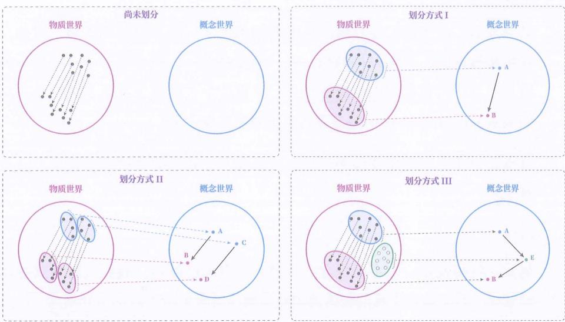

图11-1

我们甚至可以采用划分方式Ⅲ，在划分方式Ⅰ的基础上，再创造一个中间概念——概念E，用从A到E的关系和从E到B的关系来共同表达从A到B的关系。其中，概念E可以不对应物质世界中的任何对象。

除此之外，还可以划分出各式各样的概念体系，由此，你可以很好地体会概念体系的不唯一性。

## 速度划分

再以物理学为例。我们可以划分出速度大小和速度方向这两个概念，来描述物体运动，也可以划分出既有大小、又有方向的单个概念，即速度矢量，来描述物体运动。

## 无力力学

我们在义务教育阶段所学的牛顿力学，是围绕力所构造的力学理论。但拉格朗日力学、哈密顿力学没用力这个概念，通过能量、作用量、广义坐标等概念，同样构造出了力学理论。

这三种力学很好地体现了理论的不唯一性。

## 中介概念

另一方面，由于我们要反映的是对象间的关系，而非对象的本貌，因此，我们在构造概念时，是可以构造出一些“间接概念”，或者叫“中介概念”的，也就是不与任何物质现象对应的概念，只要这个中介概念有助于我们反映对象间的关系（正如图11-1中划分方式Ⅲ所创造的概念E）。

这也是为什么在科学领域中，存在许多找不到对应的物质现象但又十分关键的概念。

## 时间

例如，时间就是一个中介概念。从没有人看见过时间，我们只能看到物体的运动变化。时间就是在我们在描述物质运动的过程中所引入的中介概念。

## 力

在物理学中，力和能量也是中介概念，它们不直接对应于任何物质现象，看不见、摸不着，但在描述物体运动时十分有用，因此其存在是合理的。

## 中间参数

中介概念类似于在 Photoshop 等软件中创造的一些不存在于原始图片中的中间参数。这些参数虽然在原始图片中没有直接对应的对象，是计算出来的，但对于得到最终的处理结果十分有帮助，因此这些中间参数的存在也是合理的。

## 中间结果

假设文件夹 A 保存源文件，而文件夹 B 保存处理后的文件。有时候，为了方便，我们会创建一个文件夹 C 来保存中间处理结果。中介概念就相当于这里的文件夹 C，它帮助我们更有效地推测对象间的关系。

## 趋同何来

然而，一旦我们理解理论的渐构方式不唯一后，就会产生一个问题：为什么不同的人在面对同一群现象时，常常会构造出相似甚至相同的概念？人类在构造

概念时的这种趋同性该怎么解释？

概念的趋同性其实是多种因素共同作用的结果。下面特别指出两个关键因素。

## 多联约束

首先, 我们知道, 当 A 和 B 建立关系时, A 会受到 A 和 B 间关系的约束。此时, 概念 A 的划分仍可能有多种方式。但随着 A 与 C、D、E 等更多概念建立关系后, 施加在 A 上的约束就越来越多, 最终便有可能导致 A 只有唯一的划分方式。

这意味着，人类在最初建立理论体系时，是有较高自由度的，可以有很多种划分概念的方式。但随着概念间关系的逐渐增加，在这些既有关系的基础上，再对某些现象进行概念划分时，可能就只有唯一方式了。

## 交通约束

可以将趋同性类比为城市的道路系统。在一座新建的城市中，规划者是有较高自由度的。但随着道路的增多，每条新路都会受到原有道路网络的约束，有时会使得兼顾既有路线的新路成为唯一选择了。

## 生物基础

其次，人们共享着相似的生存偏好（例如害怕过冷、过热），相似的生理结构（例如两只眼睛、一张嘴），在感知极限上也相似（例如对可见光谱的感知极限）。这一切使得多数人从出生起就具有相似的先天概念。当这些人试图对同一群现象划分概念时，由于受到这些共有的先天概念的影响，所构造的概念自然会表现出趋同性。

## 真理吗

我们现在知道理论不唯一了，那科学理论是永远正确的吗？

## 主干提要

1. 针对同一现象群，可搭建出多个正确的理论体系。

2. 为方便搭建理论，可引入中介概念。

3. 既有概念间关系的约束，会使人们构造出趋同的概念。

4. 相同的生理基础和偏好，会使人们构造出趋同的概念。

概念提要

◎ 中介概念：不与任何物质现象对应的概念。

## 知识革新

## 仅模型

仔细思考一下，当我们建立科学理论时，究竟在追求什么，又在对抗什么？

我们其实是在对抗无限的未见：从有限的已见情况出发，试图建立一套能够泛化无限未见情况的模型。

这种追求和对抗，注定了科学理论不可能成为永远正确的真理。

这就像拿着几张城市街道的照片，却要绘制整个世界的地图。我们可以确保地图准确反映已见的街道，但无法保证它能描绘那些从未见过的角落，也无法保证已见的街道在未来不会被拆除或改造。

因此，只要一套理论是用来反映现实的，除非它所反映的现实本身是静止不变的，否则这套理论就必须随着现实的演变而更新，也就注定不会被冠以“永远正确的真理”之名。

科学理论正是这样一种随着现实变化而持续迭代的模型，刚好也符合“渐构”二字的含义。

在这个意义上，科学理论更应被理解为尚未泛化失败的模型，而非永远正确的真理。

真理执念

然而，很多人在本能上都不愿接受科学的这种渐构本质。

刘慈欣在《三体》中就描绘了一个情节：科学家发现“物理学不存在了”，纷纷选择结束自己的生命。这一情节精准捕捉了公众对科学的普遍想象——将科

学理论视为不可动摇的真理支柱。

但这种 “真理执念”，其实源于人们非常了解科学知识，但对科学知识是如何产生的知之甚少。这跟我们从小接受的教育方式有很大关系。

其实，如果真的出现“物理学不存在了”，科学家恰恰是最不可能崩溃的群体。因为他们比任何人都清楚，自己的工作并非发现永恒真理，而是渐构可泛化模型。当模型泛化失败时，他们会兴奋地更新模型。因此，“物理学不存在了”在他们眼中，不过意味着“可以发新论文了”。

## 受何影响

那么，科学知识又在什么情况下会更新呢？

## 双因素

要回答这个问题，我们首先要了解知识的创造受哪些因素影响。

想必大家都能理解：被认识的事物会影响知识的创造。我们将这种影响称为“客体影响”。

但很多人都不太理解的是：认识者自身也会影响知识的创造。我们将这种影响称为“主体影响”。

此前讲过，知识的创造，始于主体。只有在主体根据自身目标或感知习惯来划分概念后，我们才能讨论所划分的概念之间形成的关系能否反映现实对象间的普遍关系。换言之，知识（一种规律）并不是物质世界自身的产物。它既包含主体的方面——将物质现象主观地划分为概念，又包含客体的方面——物质现象间的实际关系。

由于科学知识的更新受主体与客体双重因素共同影响，所以脱离主体对物质世界的概念划分，去讨论物质世界本身的规律是没有意义的。

## 绘制地图

这里用画地图来做类比。绘制地图前，首先要明确我们的主观目标——是想要宏观视角还是微观视角？是用来展示建筑分布，还是用来指挥交通？是供驾驶车辆时使用，还是为飞机提供导航？

在确定目标(主体因素)后, 我们才能根据道路的实际情况(客体因素)开始绘制。即便是针对相同的道路(客体因素), 也会因主观目标(主体因素)的不同,而绘制出不同的地图。

我们当然会遵照实际道路（客观方面）来绘制地图，但选择展现哪些信息以及如何组织、编排信息等主观因素，早在着手绘制之前就已经蕴含在地图之中了，所以这常常被人们忽略，也容易被误以为是“道路本身的东西”。

## 世界规律

下面举一个例子来说明: 不同的概念划分, 会导致我们渐构出不同的规律(理论)。这个例子可能有些 “套娃”, 需要仔细理解。

前面提到：“脱离主体对物质世界的概念划分，去讨论物质世界本身的规律是没有意义的。”这句话本身也是一个规律。这个规律之所以能成立，是因为我们先在书里划分好了物质世界和规律这两个概念。

物质世界被定义为无人类参与的纯自然世界，意味着它本身就是一个未被划分、无法言说的现象集合。在这个定义下，物质世界不会自己给自己划分概念，除非我们将它拟人化，但即便如此，它也只会将自己划分为一个概念，即世界本身。基于这种划分，我们只能得到“世界是世界”这个结论。

规律被定义为多个“对象间关系”的共性，意味着单个对象不能被归为规律，因为它形成不了关系；一个“对象间关系”也不能被归为规律，因为不构成共有。因此，“世界是世界”这个结论不能被归为规律。

在这样定义物质世界和规律时, 我们才能得出 “脱离主体对物质世界的概念划分, 去谈物质世界本身的规律没意义。”

如果我们改变对物质世界的概念划分方式，将其定义为既包含自然环境，又包含人的认识行为的世界，那么人的概念划分就是物质世界的概念划分，而基于这种定义，我们就会得出另一个规律，即“物质世界会自己划分概念，并拥有自身的规律。”

这两个结论其实并不矛盾，因为它们是基于不同的概念定义所渐构出的。这个例子恰好体现了：不同的概念划分会导致我们渐构出不同的规律。

## 记忆划分

此前所说的内隐记忆和外显记忆，也不是物质世界自己的概念。哪怕在解剖层面上，也不能划分出大脑的某片区域是内隐记忆，另一片区域是外显记忆。

我们之所以如此划分这两个概念，是因为主观上习惯将意识作为思维层面的自我，于是以“能否被意识感知”为界，划分出来了内隐和外显，并在其基础上建立了一套理论。如果换一种划分方式，相应的理论也会大不相同。

## 中西差异

古代中西医的划分差异，也能体现不同的概念划分会带来不同的理论体系。

古代中国人习惯将人体作为一个整体来理解，于是从整体状态上划分出了阴阳、脏腑等概念，发展出了中医，核心目标是通过调节平衡来维持健康。

而古代西医则习惯从“组件拼装”的视角将人体划分成不同器官和系统，核心目标是针对这些“部件”进行单独修复，从而让人恢复健康。

若把电脑比作人体，那么古代中医则习惯于将电脑划分成“关机”“开机”“休眠”等模式，整体调控，而古代西医则习惯于将电脑划分成“CPU”“GPU”“内存”“硬盘”等组件，分别维修。

## 人的定义

我们对人的定义，也反映了主体的影响。

当我们把具体的人作为客体来认识时，尽管客体都一样，但从教师、律师、刑警、艺术家、政治家、社会学家、经济学家等社会分工产生的不同职业出发，对人的定义却千差万别：

◎ 企业 HR 人员的目的是招募和管控，倾向于将人抽象为一种 “资源实体”，保留费用、经验、服从性、潜力等属性。

◎ 外科医生的目的是手术治疗，倾向于将人抽象为一种“血肉实体”，保留骨骼、血液、器官等属性。

☐ 心理医生的目的是心理和行为治疗，倾向于将人抽象为一种“思维实体”，保留情绪、认知、经历等属性。

◎ 销售员的目的是推销产品，倾向于将人抽象为一种“需求实体”，保留购买力、兴趣喜好、消费习惯、决策过程等属性。

☐ 演化生物学家的目的是理解演化历程，倾向于将人抽象为一种“基因实体”，保留基因、适应性、繁衍策略等属性。

之所以会这样，是因为处于特定分工下的人（主体）都是以特定的处理目的与他人（客体）打交道的，由此抽象出各式各样的人。

这里并不存在先天固有的“人”的定义，任何关于“人”的定义都是属于特定的人与人关系或者说社会关系中的。

当社会关系改变时，人与人彼此打交道的方式就会改变，对“人”的定义亦随之改变。

## 异化的人

如果将某个社会关系中的“人”的抽象误当成人先天本质的定义，那这个“人”的抽象就可以被用来异化处于不同社会关系中的具体的人。

注意, 本书中的 “异化” 是指要求某东西按照不属于它所处关系的类别进行转变。

例如，若将演化生物学中的“人”的抽象误当成“人”先天的定义，那就可以用它将所有其他关系中的具体的人都异化成一种剥离文化、道德和情感等属性的、只为留下基因而无所不用其极的机器。

有人读到这里，可能会下意识地觉得“原来这种定义是错的”，然后继续去找那个最接近真理的“人”的定义，这就又陷入了类固有观，即相信存在一个先天固有的、可以脱离社会关系而孤立存在的“人”的定义。前面说过，任何客观概念都依存于其所处的关系中。演化生物学中的“人”的抽象在研究生物演化时是合理的，只是在其他社会关系中未必合理。

再举个例子，若一个人将资本社会关系中的“人”的抽象当成“人”先天固有的本性，那就会认为这是所有具体的人的本性，并将处于情感、家庭、民族等其他社会关系中的具体的人（包括他自己）都异化成单纯追求经济利益的机器。当他遇到违背这一本性的具体的人时，便会认为这些人要么是伪装的、另有所图的，要么是幼稚的、理性不足的。他没能意识到，自己推理时所用的“人”

的抽象是属于资本社会关系的，未必适用于其他社会关系。

## 费的批判

在《关于费尔巴哈的提纲》的第六条和第七条论纲中，马克思批判过费尔巴哈，说他“撇开历史的进程，……假定有一种抽象的——孤立的——人的个体”，而没有看到“他所分析的抽象的个人，是属于一定的社会形式的”，并指出“人的本质不是单个人所固有的抽象物，在其现实性上，它是一切社会关系的总和”。

## 两种推动

现在，我们便能回答知识在什么情况下会更新了。

由于所渐构的知识，既受主体的影响，又受客体的影响，所以不论是主体方面的改变，还是客体方面的变化，都会促使我们对既有理论进行革新。我们分别称其为“主体推动的知识革新”和“客体推动的知识革新”。

## 客体含义

注意，这里所说的“客体变化”指的是被认识的事物的变化，而不是物质世界的变化。

例如，被认识的事物是蔬菜，当我们的计算工具从算盘变成电脑了，并不称其为“客体变了”，只有当蔬菜本身变了，才称其为“客体变了”。

## 客体推动

对于客体推动的知识革新，大家都能理解。

正如现实道路发生了变化，地图 App 也需要跟着更新一样。

我们也可以稍微细化一下，将其分为已见情况的变化和未见情况的新增。

例如，地球环境的变化、社会环境的变化是已见情况的变化，微观量子的初见、新冠病毒的初见是未见情况的新增。

## 主体推动

最难理解的是主体推动的知识革新，也就是主体对概念的划分方式的改变所导致的更新。

由于主观目标、感知习惯、生理基础、宗教信仰等诸多方面，都会影响主体如何划分概念。个体的感知习惯和信仰也受成长经历所塑造。为方便表达，我们将影响个人如何划分概念的感知习惯和信仰等因素整体称为“主体框架”。

之所以称为 “框架”， 是因为客体的因素就像是泥土和砖瓦等搭建模型的材料，而主体的因素就像模具或建筑蓝图一样，决定我们如何搭建模型的内外构造。

## 学论更新

接下来，我们用学习理论的更新作为例子，来凸显主体划分方式的改变会带来理论的更新。

早期人类祖先和其他生物一样，要面对生存挑战，因此他们会将与自然的交互划分为学习，也叫“向自然学习”。这种学习一定是自学和终身的，也一定是先从具象层切入，再上升到抽象层的。我们称之为“自下而上”的学习。基于这种“学习”的概念划分，人类祖先便形成了最早期的“学习理论”。不仅是人类，其他高等动物也都共享着这一“学习机制”，毕竟学习直接关乎生死。只不过这种“学习理论”并不是由我们今天熟悉的意识和语言所建成的，而是自然筛选出来的一种本能，并且只能表现为一种行为，而这个行为在今天被我们称为游戏。游戏包含了早期“学习”概念的所有环节，涉及经验探索、模型渐构、实践验证，并且是一个迭代过程，但其风险被降到了一个可承受的范围内，是一种被保护起来的学习，避免个体在真实的自然交互中死亡。动物的大脑甚至演化出了一种奖励系统，在获取未见经验和模型预测成功时分泌多巴胺，以便让个体持续学习。

当人类发展出外部语言后，先从抽象层切入、再下降到具象层的学习，即“自上而下”的学习便成为了可能，也产生了传授和师父的概念。但由于早期语言并不精准，语言主要被用来引导实践方向，而非抽象模型的精准描述，后来慢慢发展出了师徒制。在这种模式中，“学习”的概念被划分成了基于师父引导而实践，在中国则形成了以修和悟为中心的“学习理念”。

随着人们越来越重视传授者的语录，原有的“学习”概念被细分成了学、思、习、行四个步骤，起点也不再是直接的经验探索，而是向老师请教，也就是前面的“学”字所指代的含义，至于思、习、行则分别指代理解老师的讲解、练习和应用。对应的学习理论则是由这些概念之间的关系所构成的，如学与思、学与习之间的关系。同时，对经典语录的复述要求，又让记和诵的概念被并入了这四个步骤之中。

到了工业革命时期，为经济、高效地普及教育，“自上而下”的教师讲授方式被广泛应用。但由于在义务教育阶段，所有学生不论是否自愿，都要接受一定年限的统一科目的教育，加上采用试卷的考核形式，导致多数学生对“学习”这一概念的划分，缩减到了学和记这两个步骤，也就是课堂听讲+记忆讲解的组合。至于习和行这两个步骤，慢慢与学习相分离。然而，这种在学校所形成的“学习”概念，并不符合校外的实际情况，也不符合大脑演化出的生理特性，于是当学生尝试基于这样的概念划分来搭建“理论”时，必然会遭遇各种错乱。例如：

当一些学生问 “如何激发学习动机” 时, 实际上是在探求, 如何在仅执行听讲和记忆的情况下, 让大脑产生多巴胺奖励。然而, 大脑对学习行为的多巴胺奖励,偏偏就集中发生在习和行的环节。

当一些学生成绩不佳时，就会觉得自己“不擅长学习”。但实际上，学习是刻在生物基因中的本能，这些学生只是不适应缺乏习和行的不完整学习模式。

当一些家长问 “如何让孩子远离游戏、爱上学习” 时，实际上是在探求，如何让孩子喜欢上一种残缺的学习模式，而远离那些能激发大脑产生多巴胺的完整学习模式。

当人们基于这样错乱的“理论”来改造学生时，便会很容易将学生异化成一种老师讲解的“蓄水池”。

当然，科学家们并不像大众这样划分“学习”概念。事实上，不同科学家对学生、教师、学习、知识等概念的划分各不相同。正是这些概念划分上的差异，催生出了不同流派的学习理论。受“唯一答案”的应试思维影响，通常学生们会想要从中找到“最正确”的理论，但正如前面所论述的，没有“最正确”的理论。科学理论之间的区别，主要体现在特定应用场景的便利性上。我们无法脱离应用场景去讨论什么是“最正确”的。

如今，我们随时随地都能接触到优质的授课视频，甚至可以借助 AI 生成无限量的个性化讲解。这一现象表明授课资源的稀缺性正在下降，人们也因此开始重新关注学习的其他环节。另一方面，技术的迅猛发展也使得人们对学习的理解从有年限的回归到了终生的。你会发现，人们对“学习”概念的划分，正在悄然变化，而这将催生出新的学习理论。与此同时，人们还面临着识别伪装成知识的消费诱导和虚假消息以及海量信息难以筛选的新挑战。我们要一并应对这些挑战，重新划分信息、知识、记忆、学习概念，还要能够精准区分假信息和伪知识，并进行能兼顾人与AI的双主体学习，以便让AI协助人类进行知识管理。想必你也猜到了，本书的主要内容正是这种应用场景催生出的学习理论。

## 举例目的

上面的所有例子，不论是中西医、人的抽象，还是学习理论，都不是在讨论哪个理论更好，而是希望通过不同理论在概念划分方式上的差异，让大家体会主体划分方式的改变如何带来理论的更新。

## 科学范式

当你理解了主体的划分方式同样会影响科学理论的形成时，便会意识到，科学家的工作（科研）并非人们通常以为的那种“不带主观性、由谁进行都一样的寻宝过程”。科研工作者更像是对大自然进行“二次创作”的剪辑师，而每位剪辑师都有自己独特的主体框架和“风格”。

当某个建立在特定主体框架之上的理论被广泛接受后，其中所隐含的主体框架、人们据以验证与筛选模型的方式，以及理论内部所构建的核心概念，都会逐渐形成一种规范，并约束着该理论此后的发展与延伸。这种规范，也被科学哲学家托马斯·库恩称为“科学范式”。

## 范式转换

科学范式既是一种规范，也是一种束缚。一个科学结论之所以不被接受，有时并非因为它无法用于解释或预测现实事件，而是因为它不符合当时主流的科学范式。

然而，随着时间的推移，人们会出于种种原因逐渐放弃某些既有的理论体系。此时，原本施加在理论渐构上的束缚被解除，同一组研究对象便会在新的主体框架下被重新理解与渐构，从而诞生出更契合时代的新理论。

当越来越多的人接受这一新理论后，新的规范与约束又会逐渐形成，科学也就从一个范式过渡到另一个范式。

这种科学范式的转换，被托马斯·库恩称为“范式转换”。

库恩认为，科学的进步并非知识的线性积累，而是通过“范式转换”实现的革命性跃迁。

## 新的挑战

在最近四章中，我们讨论了概念的合理性来自何处、理论并不唯一，以及什么会推动知识革新。这些内容会让我们更深刻地理解如何塑造和维护自己的概念世界，进而更好地指导我们的现实活动。

然而，仅仅依靠概念世界，生存依旧困难重重。接下来，你将看到概念世界无法独自应对的三大挑战。

## 主干提要

1. 科学知识不是永远正确的真理，而是尚可接受的可泛化模型。

2. 知识的产生由被认识的事物（客体）和认识者（主体）共同决定。

3. 人与人打交道的方式改变时，人（主体）对人（客体）的定义也会改变，使得任何“人”的定义都仅成立于特定的社会关系中。

4. 被认识物的变化，会推动既有知识的革新。

5. 主体框架(认识者的主观目的、感知方式等)的变化,会推动既有知识的革新。

6. 在已建理论体系等因素的作用下，会逐渐形成一个群体的科研规范，约束后续理论的搭建。

7. 库恩认为科学的进步不是线性积累，而是靠范式转换实现跃迁。

## 概念提要

◎ 主体：认识行为的实施者。

◎ 客体：被主体认识的事物。

◎ 规律：多个对象间关系所共享的关系。

◎ 异化：要求事物按照不属于它所处关系的类别进行转变。

主体框架：影响个人如何划分概念的习惯和信仰等因素的组合。

◎ 科学范式：由已建理论体系和特定时期的方法论所形成的群体科研约束。

◎ 范式转换：科学范式的更换。

## 概念代理

## 例子体会

概念世界无法独自应对的三大挑战分别是缺席挑战、容量挑战和经验挑战。

下面从日常例子入手，逐一说明。

## 场景回想

你一定有过这样的经历：决定去拿某个东西，但到了地方却突然忘了要拿什么。你明明知道那个念头还在脑中，却就是提取不出来。

此时，你会在脑中从头到尾按顺序回想一遍刚才的经历。如果还是想不起来，你会回到最初的位置，把刚才做过的动作再做一遍，借此唤起记忆。

为何我们需要这样回想？

## 字母回想

现在，请你回想 L 的前一个字母是什么。

你大概需要从 A（或者某个熟悉的中间字母）开始背，一直背到 H、I、J、K、L，才能得出答案是 K。可明明 K 就在 L 的前面，为什么大脑需要这样回想？

## 触发线索

由这两个例子可以体会到，我们的思维并不像想象中那样自由。无论是信息回忆还是模型归类，大脑都需要线索。

信息回忆：我们感觉上的“自由回想”，更多地是一种“链式回想”。这也是为何回想 L 的前一个字母是什么，需要将 J 作为 K 的线索，而回想 J 又需要将 I 作为线索，以此类推。

◎ 模型归类：同样地，要激活一个高层概念，也必须有对应的感官线索，也就是需要亲自见到、听到、闻到。因为判别模型只有判别能力。

## 缺席挑战

既然思维活动依赖触发线索，那当多个概念无法同时被触发时，大脑要如何让它们在同一认知空间中相遇并互动呢？

我们将这一挑战称为“线索缺席挑战”。

## 老子牛顿

想象一下，老子、牛顿、网络聊天、宫保鸡丁——这些概念的具体现象不可能同时出现。那我们又如何去思考“老子和牛顿在网上讨论宫保鸡丁的正宗做法”这种问题呢？

## 容量挑战

人脑的工作记忆容量非常有限。一旦概念数量超过工作记忆容量，大脑同样无法将它们整合到一个“认知空间”下思考。

我们将这一挑战称为“记忆容量挑战”。

## 经验挑战

如果仅有概念世界，那每一个模型的渐构都离不开经验的支撑。可现实中，这种对经验的需求程度是我们承受不起的。

我们将这一挑战称为“经验稀缺挑战”。

## 何以破局

要如何应对这三个挑战呢？

## 代理机制

答案是: 让每一个概念都有一个“代理线索”, 当真实的感官线索无法同时出现时, 由这些 “代理线索” 代为唤起对应的概念。

## 跨时整合

有了代理线索后，大脑便能将原本无法同时被触发的概念汇集到同一个认知空

间中，进行整合与加工。

我们将这一优势称为“跨时空整合”。

鱼代老子

例如，用鱼作为老子的代理，用苹果作为牛顿的代理，用渔网作为网络聊天的代理，用花生作为宫保鸡丁的代理。

老子、牛顿、网络聊天和宫保鸡丁的真实现象很难同时出现，但鱼、苹果、渔网、花生却容易同时摆在面前。

语音代理

不过，苹果和鱼等实物代理使用起来仍不够方便。有没有一种能随时唤起的代理呢？

想必你已经想到了答案——特定的空气振动，也就是声音。

我们可以随时发出特定的声音。

## 超验思考

例如，浆果可以依靠朗读下面的句子，让你思考从未经历过的事情：

◎ “一棵树决定掉光叶子来避暑，长满叶子来过冬。”

◎ “一只鱼站在树顶上，给飞过的鸟儿们讲解如何游泳。”

违背常理

你甚至能想象违背常理的事情：

◎ “鲸鱼坐在诗歌上煮了一个微笑。”

◎ “大肠杆菌为了写出宫保鸡丁而无奈地吃了微积分。”

## 文字代理

然而，在没有录音技术时，声音会转瞬而逝，无法保存。

什么代理更能长时间地保存呢？

没错，答案是在石头、竹简、纸张上绘制的特定图案，也就是文字。

## 读书

此时，真正帮助你突破“线索缺席挑战”的，正是文字代理。

## 汇成体系

也正是依靠文字代理，浆果能把自己不同时期的经验和思考整理成体系，呈现给你。

这是仅靠概念世界自身无法办到的事情。

## 扩展记忆

依靠声音和文字等符号的代理机制，我们还可以将无数概念存储在外部，随用随取，变相扩展大脑的记忆容量，增强处理能力。

我们将这一优势称为“扩展工作记忆”。

## 竖式计算

一个典型的例子是竖式计算。例如，在计算 $23 \times 47$ 时，需要通过多步计算才能得到结果，且每一步计算都需要用到上一步的结果。如果不借助概念的“代理线索”将中间结果存储在外部，光靠大脑的工作记忆，很容易在进行后面的计算时忘记前面算出的结果。

## 书写算式

事实上，数学算式和书写符号的发明，极大地推动了数学研究。因为它们允许人们将中间思考过程清晰地保存下来，随用随取，突破了人脑工作记忆容量的限制。

## 语音环

有人会说自己的记忆力很好，不需要借助代理。但在很多情况下，这些人依然借助了代理，只不过并非是文字代理，而是声音代理——通过内部或外部“复读”的方式，让所需信息在工作记忆中不断刷新，变相延长记忆时间。这种方式也叫作“语音环”。

## 图与表

同样的道理，流程图、韦恩图、思维导图等各种图表之所以好用，一个重要原因是它们能帮助大脑突破工作记忆的局限，会增强大脑的认知能力（在字面意义上）。

## 写作

还有一件常被人们低估的事情，那就是写作。

很多人单纯地把写作视为思考结束后记录结果的行为。

但实际上，写作极大地增强了人的认知能力，因为写作也具有跨时空整合和扩展工作记忆的效果。

脱离写作的思考，就如同脱离纸笔的计算，会使认知能力大打折扣。

## 文字视频

提到写作，顺便说说文字的优势。大家都能感觉到文字相比视频有某种优势。对此，一些人会说“文字的信息密度更大”。这种说法虽不准确，但在感受上是对的。

不准确之处在于，视频其实是文字信息 + 视觉信息 + 听觉信息的组合，在视觉信息中也可以包括文字和图表，能提供任意密度的信息。换句话说，信息密度跟是文字还是视频无关，而是由作者控制的，通过文字也可以写出密度很低的信息。

其实，文字相较视频的最大优势在于扩展工作记忆。视频虽然能传递大量信息，但人脑的工作记忆有限，无法同时保存那么多信息，思考时需要常常回顾。而在看视频时，想要回顾，前面的信息已经不在了。虽然视频可以回放，但查找和重播的过程容易让人遗忘其他信息，乃至忘记自己想思考的主题。于是，当人们需要整合信息来思考时，视频常常给人一种“使不上力”的感觉。相较之下，文字全部都呈现在那里，作为大脑工作记忆的一种扩展，允许人们随时将自己所需的信息整合在一起。于是人们便有了文字“信息密度更大”的感觉，这其实指的是“自己需要的信息”。

## 减少经验

那代理机制是如何突破经验稀缺挑战的呢？

## 组织规则

既然有了概念的代理符号，自然会涉及代理符号的组织规则。我们可以运用这些组织规则，零经验地创造出新的概念和新的概念间关系。

## 飞马

例如，可以通过将“飞”+“马”组合成“飞马”一词，来创造出飞马这一概念，而且是零经验地创造。毕竟在物质世界中，我们没见过飞马这种生物。

## 日名变动

在日语中，可以通过动词 + “する”的方式，从名词性概念造出动词性概念。

比如，“勉強”+“する”得到“勉強する”，意为动词性的“学习”。

## 单变复

还有, 在英语中, 可以通过名词 + 复数后缀的方式, 造出该名词的复数概念。比如, 由 “book” 变成 “books”, 得到多本书的概念, 哪怕说话人此生仅见过一本书。

## 英名变动

我们还可以将动词转换成动名词形式，得到新概念。比如，由 “learn” 变成 “learning”，进而表达 “Learning is a fundamental ability of animals”，意为 “学习是动物的基本能力”。

## 如何建立

现在，我们看到了代理机制的好处。

但代理机制究竟是怎样建立的？难道任何东西都可以被用作概念的代理吗？

## 主干提要

1. 单靠概念世界，存在触发线索缺席、工作记忆不够、建模经验不足等挑战。

2. 为克服上述挑战，可为每个概念建立一个代理线索，代替感官线索来唤起概念。

3. 借助代理机制能将无法同时触发的概念汇集到同一认知空间中，进行整合与加工。

4. 通过代理机制，可依靠外部存储在有限的工作记忆下增强大脑的处理能力。

5. 运用代理符号的组织规则，可零经验地创造新概念及其关系。

## 能指所指

## 法律代理

在法律诉讼中，为了清晰描述代理行为，会区分代理人与被代理人，并用“谁是谁的代理”来描述二者的关系。

## 替身演员

在影视拍摄中，为了清晰描述替身行为，会区分“替身演员”与“被替的演员”，并用“谁是谁的替身”来描述二者的关系。

## 符号含义

同样地，当我们讨论概念的代理时，也需要明确区分代理的实施者和承受者。

为此，我们把代理的实施者称为“指代物”或“符号”，把代理的承受者称为“被指代物”或“含义”，而把二者之间的关系称为“指代关系”。

为通俗易懂，本书采用了直白的“指代物”和“被指代物”作为称呼。如果你更偏好专业术语，也可以把指代物称为“能指”，把被指代物称为“所指”。

## 谁有资格

那么，什么可以作为指代物和被指代物呢？

## 指代物

可能不少人以为，只有“声音”、“文字”和“动作”才能作为“指代物”，但实际上，指代物在内容上没有任何限制。

## 言外之意

例如，对于“言外之意”，就是某人说话时的附属行为（措辞、说话时机、是否说话等）作为指代物。在不便拒绝和不便明说的场合中，人们会在用词上保持友好，而将真正意思由词语之外的指代物来传达。

再如，日语中的“いいです”在字面上意为“好”，但人们也用它来拒绝他人的邀请。此时，真正的指代物就不是“いいです”，而是说“いいです”时的面部表情和语气、语调。

## 表情

人们日常说话中的指代物也并非全是词语，还有表情和语气等。这也是为何人们在微信等通信工具中交流时，常常会因为难以区分对方的真正意思而感到不安。

## 需要类化

不过，指代物和被指代物一样，都有形式限制，那就是必须由类化之后的事物，即概念（在绝对意义上）来充当，不可以由未经类化的物质对象来充当。

因为未经类化的物质对象各不相同，如果作为指代物或被指代物，就无法重复使用。

## 刹那指代

例如，如果拿图14-1所示的具体图形作为指代物，由于没有经过抽象，一旦形状稍有不同，就不再是同一个事物了，因此不能作为指代物。

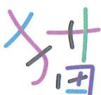

图 14-1

只有经过类化后，该图形脱离了单一书写形态，成了一个类别，才可以作为指代物。这时，无论其形态是宋体、楷体、草书，还是电脑屏幕上的像素字，它们都属于“猫”这个汉字（概念）。

## 模型先行

指代物和被指代物都是概念，这意味着指代关系是大脑在抽象层面上所建立的一种对应关系。

要在抽象层面上实现这种对应，大脑必须事先渐构两个判别模型：

○ 一个用于判别 “什么可以被归为指代物 R”。

○ 一个用于判别 “什么可以被归为被指代物 E”。

## 视为对象

当进入抽象层面后，指代物与被指代物又会被类对象化，被视为对象。指代关系则是在这两个对象之间建立的一种直接对应，而非像模型预测那样是两个概念外延之间的映射。

## 苹果指代

为方便描述，我们将视觉感知层面设为对象层。

如图 14-2 所示，在此层面上，我们对其中一群不同的笔画组合进行抽象，忽略其差异，提取共性后，划分出“苹果”汉字的概念，以及它的负概念（非“苹果”汉字）。

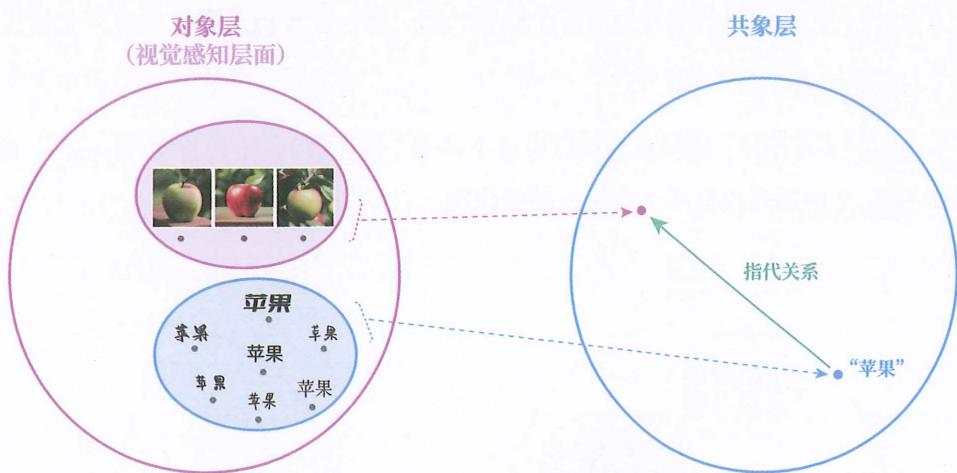

图 14-2

同样地，我们再次抽象，划分出一种特定水果的概念。注意，图中虽然展示的是水果的画像，但这里想表达的是可以吃的水果。

接着，我们让“苹果”汉字作为指代物，让这种水果作为被指代物，建立一个指代关系。当大脑见到“苹果”汉字的任何一个具体现象时，就直接联想到这种水果。

此时，指代物和被指代物这两个概念都被视为了对象。

倘若是模型预测,如图 14-3 所示,从年号到年的天数这两个概念之间的映射关系,

则会考虑具体的年号对应哪个具体的天数。

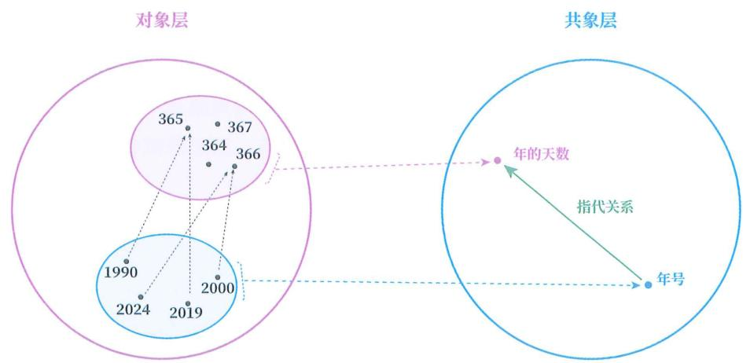

图 14-3

## 多指代

此外，同一个指代物可对应多个被指代物，同一个被指代物可对应多个指代物。

## 苹果手机

如图 14-4 所示, 这种水果可以有多个符号 (指代物), 比如英文 “apple”。而 “苹果” 文字还可以有多个含义 (被指代物), 比如一种手机。

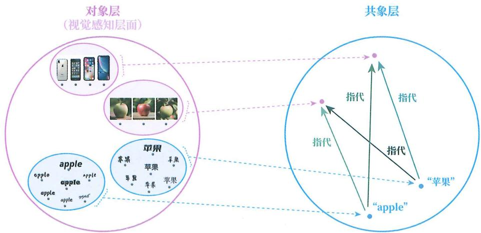

图 14-4

天然规定

那么，指代物和被指代物之间，有没有什么先天的必然规定呢？

## 非天定

答案是：没有。指代物和被指代物之间的指代搭配，可以自由选择。

## 各国苹果

例如，对于苹果这个概念，物质世界中并没有某个先天规定说“非用某个特定的书写符号不可”。不管用哪个符号，都可以实现指代功能。这也是为什么汉语中的书写符号是“苹果”，英语中的书写符号是“apple”，日语中的书写符号是“りんご”。

## 变量命名

又如，在程序编写和数学建模中，人们可以自由地给变量命名。尽管程序员不能使用“保留字”，但在一种编程语言建立之初，创始人也可以自由地选择“保留字”。

## 为何叫它

这也是为何，当家长面对“为什么苹果叫苹果”的提问时，可以给孩子讲述历史典故，可以给孩子介绍词源，但却无法像解释物理定律那样给出一个“天然规定”。

## 可有倾向

注意，这并不是在否定“某些原因会使人们倾向某种指代搭配”。

例如，出于便捷性考虑，人们倾向用便于随时操控的事物作为难以随时操控的事物的指代物，声音也因此成为了人们最常用的指代物。但不选用声音，人们一样可以实现指代效果，比如，运用手语符号。

又如，出于易懂性考虑，人们倾向用与被指代物在形象上相似的事物作为指代物，例如临摹的图画和模仿的声音等。但不选用这种指代物，人们一样可以实现指代效果，只不过会牺牲易懂性。事实上，人们确实会为了便捷性而牺牲易懂性。人们的这种选择也反映了“非天定”这一特点。

## 个人遵守

当一个人建立了指代关系后，为了实现个人目标（如扩展记忆和辅助思考等），该人会自行遵守所建立的指代关系。此时，指代关系是稳固的。

## 编程命名

例如，当一个人给程序中的变量命名后，为了能让程序准确运行，该人会自行遵守自己所建的指代关系。

## 笔记规则

又如，一个人发明了一套记笔记方法，用不同的颜色和标记来代表不同的意思。为了让笔记能有效辅助自己学习或工作，该人会遵守自己所建的指代关系。

## 约定俗成

但在群体使用的自然语言中，情况就复杂了。由于每个人都可以建立不同的指代关系，那么自然语言中的指代关系，就只能依靠人与人之间的约定俗成了。这种约定存在时期和地域的局限性。

## 蒜苗蒜薹

例如，当听到“蒜苗”一词时，不同地区的人会联想到不同的被指代物。

有人会联想到图14-5中左侧的植物，有人则会联想到图中右侧的植物。

图 14-5

不同地区的人，对这两种植物有非常多的别名，而且还会相互重名。

## 指代误解

虽说是约定俗成，但由于每个人的成长经历、知识水平等背景不同，人们仍会频频误解别人的指代。

## 网络争论

网络争论就是最好的例子之一。争论双方都以为彼此在讨论同一个问题，但其实各自对很多词汇的指代并不相同，常常是鸡同鸭讲。

例如，在网络上对于“中医是不是科学”的讨论中，“科学”一词至少就有两种含义（被指代物），一种是从西方演化而来的、创造知识的方法论，还有一种是有效的知识。网友们看似在讨论同一个问题，但有的在讨论“中医是不是西方的方法论”，有的在讨论“中医是不是有效的知识”。

同样地，“情商是否比智商更重要”“语言是否影响思维”“选择是否大于努力”“AI 是否具有意识”……大量的争论都存在“鸡同鸭讲”和“跨服聊天”的现象。

## 语义变迁

同时，这种约定还经常会被打破，并建立起新的约定，使得一个词汇的含义发生显著变化。该现象也被称为“语义变迁”。

## 哈基咪

例如，“哈基咪”是日语“はちみ”的音译，本义是“蜂蜜”，但经过机缘巧合的网络传播，最终在中文里变成了“猫咪”的意思。

## 偷换概念

此外，人们有时也会有意或无意地将一个词约定的所指，从一个概念偷换成另一个概念。这种行为叫作“偷换概念”。偷换概念中的“偷”是“隐蔽”的含义。

不必认为偷换概念一定是负面的。因为语言除了有描述现实的用途，还有争夺权力的用途，也就是让他人按自己的意愿行事。在争夺权力的目标下，人们当然要打破约定的指代关系，不再遵守描述现实时的规则。在以获胜为目的的辩论中，不被发现地偷换概念对辩手而言，更是十分重要的技能。倘若真的完全按照科学结论来辩论，那拿到假命题的一方在开辩之前就该认输。

之所以人们对“偷换概念”存在负面印象，是因为承受方一旦发现，就会指责实施方的偷换行为，但没被发现时，实施方却不会张扬，导致偷换概念的正面意义不常被人们讨论。

## 饭桌下玩

这里举几个偷换概念的例子。

一位妈妈说：“不许在饭桌上玩手机。”

孩子回答：“好的，那我在饭桌下玩。”

对话中，妈妈用“饭桌上”指代用餐期间，而孩子将这个所指替换成了在饭桌的上方。

## 外交回答

还有一个民间流传的外交故事，虽不知真假，但却是非常好的正向例子。

新中国成立之初，有西方记者问中国的领导人：“现在中国有6亿多人口，那么有多少个厕所来解决人们的生理问题？”领导人笑着回答：“两个，一个男厕所，一个女厕所。”

在这个对话中，西方记者用“多少个”指代总体数量，试图通过询问中国的厕所总数来嘲讽中国卫生设施落后。领导人则将“多少个”的指代含义替换成类别数量，避免了直接回答可能令国家形象受损的问题。

## 没人说谎

欧布利德斯也有一段论证：谁说谎，谁就是在说不存在的东西；不存在的东西是没办法说的，因此没有人说谎。

在这段论证中，第一个“不存在的东西”所指的是胡编乱造的东西，但第二个“不存在的东西”的指代，被替换成了未被创造的东西。

## 含义不定

在数学计算和编程中，为了确保准确，人们会先定义、后描述。各种指代关系是确定的。

但在自然语言中，情况又变得复杂了，指代关系需要放置在语句中，才能确定。

## light

例如，我们无法仅靠 “light” 这个单词本身来确定其含义，只有放在句子中才能确定。

◎ The room is filled with light.

◎ This box is very light.

◎ She prefers light colors.

## 意思意思

网络上关于 “意思” 的一个中文考题段子，更能说明自然语言的含义只有放在语句中才能确定。

局长：“你这是什么意思？”

小王：“没什么意思，就是意思意思。”

局长：“你这就不够意思了！”

小王：“小意思，小意思。”

局长：“你这人真有意思！”

小王：“其实也没有别的意思。”

局长：“那我就不好意思了。”

小王：“是我不好意思。”

## 又一利器

当我们建立好概念的代理机制后，我们对世界的认识能力便可以在概念世界的基础上，再加一把利刃。这把利刃就叫作“语言”。

## 主干提要

1. 我们将代理的实施者称为指代物/能指/符号，将承受者称为被指代物/所指/含义。

2. 指代物和被指代物必须是类化后的对象。

3. 建立指代关系，要为指代物和被指代物都渐构判别模型。

4. 同一个指代物可对应多个被指代物。

5. 同一个被指代物可对应多个指代物。

6. 指代搭配没有先天的规定。

7. 自然语言中的指代关系是约定俗成的。

8. 自然语言中的词语会发生语义变迁。

9. 自然语言被用于争夺权力时，经常会出现偷换概念。

10. 自然语言中的词语的指代，是在使用中确定的。

概念提要

◎ 能指：指代物。

◎ 所指：被指代物。

符号：指代物。

◎ 含义：被指代物。

◎ 指代关系：指代物与被指代物之间建立的关系。

☐ 语义变迁：一个符号的所指，从一种约定俗成变成另一种约定俗成。

◎ 偷换概念：在对话中隐蔽地改变符号的所指。

## 语言世界

## 语言

现在，我们便给“语言”一词界定明确的范围，让大家明白本书中的“语言”指代哪些现象。

在本书中，“语言”指：用于代理其他概念的符号及其组织规则所构成的系统。

其中，代理可以是任意形式的符号，如视觉的、听觉的、触觉的、嗅觉的、味觉的、痛觉的，甚至可以是引力波。这意味着，该系统可以仅有语音（听觉符号），也可以仅有文字（视觉符号）。这还意味着，概念地图、流程图等图表（视觉符号）也属于本书中“语言”一词所指的对象。

本书的描述中并未限定这种符号系统的用途。这意味着，这种系统可以仅用于个人思考，而不被用于与他人交流。之所以加“与他人”这个限定词，是因为用于个人思考也可被解释为用于跨时空的自我交流。

本书的描述中用了“系统”一词，代表着代理符号和代理符号的组织规则整体被视为语言。

## 关注目的

你会看到，本书先介绍所关注的语言功能，然后给出“语言”在书中的定义。

因为语言不是孤立存在的，它参与人类的所有活动，可被用于传递信息、渐构知识、增强认知、传承文化、塑造身份、争夺权力、控制机器，等等。不同的目的会影响人们忽略差异、提取共性的方式，导致人们抽象出不同的“语言”概念。仅语言学这一领域，就包含了众多分支学科，如语音学、语法学、语义学、语用学、认知语言学、计算语言学等，每个分支都有不同的研究目标和侧重点，对“语言”的定义也不尽相同。

本质盲求

如果有人看到这里，第一反应是问：“定义不统一是否意味着人类尚未发现语言的本质？”那便说明仍旧没有摆脱类固有观，习惯性地想找到唯一正确的先天固有的本质。

此前明确讲了，没有脱离关系的本质。强行追求唯一的定义，必然导致一个人在理解“语言”时，脱离其关系和情境，犯了与脱离社会关系去定义“人”相同的错误。

例如，“语言对思维的影响”自古以来就是人们热衷争论的议题，至今没有定论。而且，使这一争论变得更加复杂的是，不同领域的人对“语言”采用了不同的定义。有些领域的人倾向于“语言决定思维”，是因为这些人将一些认知能力（如对现象的编码）划分到了“语言”这一概念下，甚至在一些人的语境中，“语言”和“概念”是可以互替的两个词。

而另一些领域的人则将相同的认知能力划分到了“思维”这一概念下，甚至有些人仅把外部的语音划分为语言，自然就更倾向于“思维独立于语言”的观点。

如果一个人认为“语言”只有唯一正确的定义，就难以意识到“语言”一词在上述两个结论中并不是同一个含义，无法理解不同观点的真正意思，容易越看越混乱，不知道该相信什么。

不统咋办

那定义不统一该怎么办呢？

无须办。想理解哪里的结论，就用哪里的定义。

生活中难免遇到重名之人，学术中也会遇到重句之论。遇到重名之人时，我们不会本末倒置地去争论哪个人才是这个名字的“真身”，而是去认识这两个人。当遇到重句之论时，我们也不必纠结哪个结论才是这个句子的“真身”，直接在每个结论中把“重名词”替换成其指代的现象群就可以了。

例如，在上面的例子中，把“语言决定思维”替换成“对现象的编码决定思维”，再把“思维独立于语言”替换成“思维独立于外部的语音”。这样一来，看似矛盾的两句话就不矛盾了。

其实, 针对不同的学科, 根据其研究侧重提前界定 “语言” 一词在其结论中的外延, 恰恰是科学的做法。因为这样可以明确界定其结论的适用对象和不适用对象, 避免人们错误应用其结论。这也是为何本书一定要界定 “语言” 一词在书中指代的是什么。

## 语言子类

接下来介绍三种最常用的语言子类，分别是自然语言、数学语言、编程语言，最后再额外介绍一个子类——图形语言。

注意，分类方式并不是唯一的，有多少种分类原则就有多少种分类方式，并且基于不同分类方式的类别并不一定互斥。

例如，根据书写符号种类，语言可以分为文字语言、图像语言，而文字语言和编程语言并不互斥。

## 自然语言

第一种语言子类是汉语、英语、日语、德语等自然语言，也就是自然演化而来的语言。

自然语言通常都有语音（听觉符号），但不一定具备文字（视觉符号）。比如，许多土著方言就没有文字系统。

## 数学语言

第二种语言子类是数学语言。数学也可被称为语言，因为数学完全符合语言的定义：可用数字代表对象，用字母代表概念，用其他符号来代表不同的关系。这些符号又有严密的组织方式。同时，由于其符号系统具有高度的精确性和一致性，比自然语言更适合描述现实，因此成为了表达科学知识的首选语言。

例如，“物体从高处落下的速度与时间成正比”可用数学语言 v=gt 来表达，其中 v 是速度，g 是重力加速度，t 是时间。这个公式简单明了，避免了自然语言中的歧义。

又如，我们可以用 P 代表 {所有具体的人} 的集合，用 D 代表 {永生，非永生} 的集合，再用映射 $f: P \rightarrow D$ 表示 “从人到是否永生” 的映射关系。最后，用如下公式表示 “人皆有一死”。
