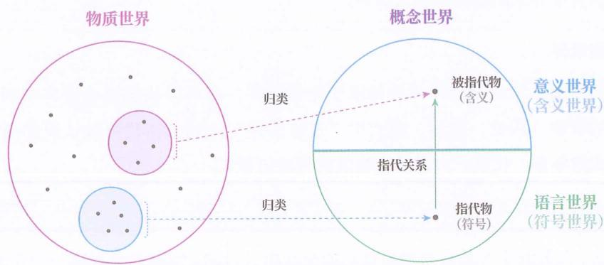
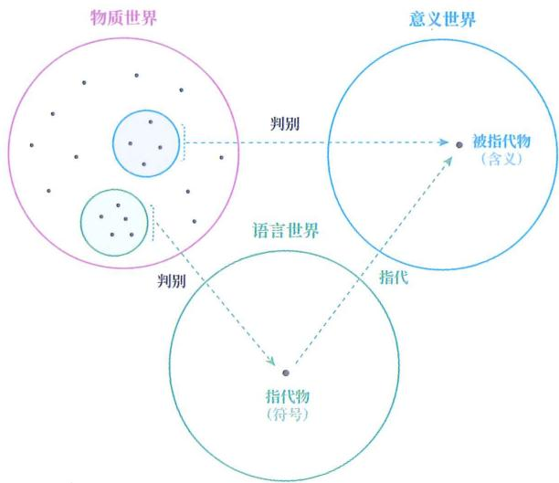
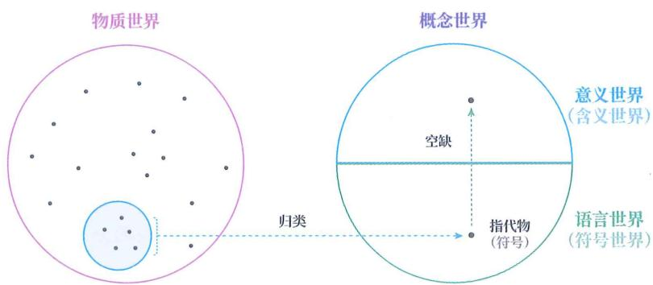
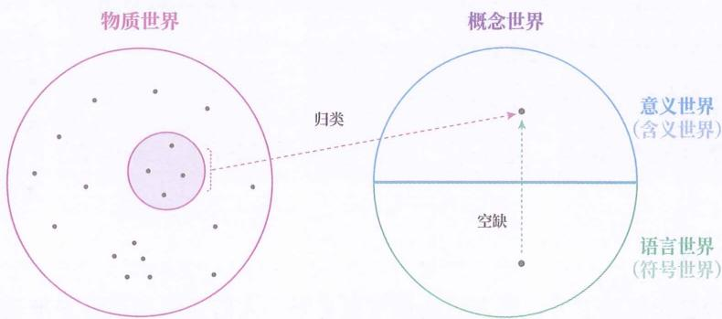

# $f(x) =$ 非永生， $\forall x\in P$

## 编程语言

一套成体系的编程规则也可被称为语言，因为它同样具备代理符号及其组织规则这一特征，可以通过变量、操作符、关键字等符号来表示现实世界中的概念，并通过语法规则来组织这些符号，从而实现描述现实与控制机器。我们同样可以用编程语言写出“人皆有一死”的模型。

不同的编程规则产生了不同的编程语言。例如，Python、Java、C++等语言虽然共享一些基本的符号（如数字、字母、运算符），但它们的符号组织方式（如语法规则、逻辑结构）有所不同，这使得每种编程语言在设计思路、应用领域和功能表现上各具特色。

## 图形语言

流程图、概念地图等图形表达系统也可以被称为语言，这还是因为它们具备代理符号及其组织规则这一特征。

例如，流程图有流程符号、起止符号、输入输出符号等。

本书把这类语言称为“图形语言”，注意要和其他领域(如影视领域)的“图形语言”相区分。此处，我们指代的是有别于纯文字、多用图形来代表不同概念和概念间关系的符号系统。

图形语言的优点是比纯文字更直观，更利于快速检索信息，不过这种“快速”是建立在组织规则简洁的基础上的，所以每种图表的适用范围并没有上面三种语言那么广，不同的应用场景需要使用不同的图表。

## 语言概念

最后说一下语言和概念的区别。其实，本书所选的语言定义，还是很方便区别二者的。

语言和概念都是一种替代品，但替代的对象不同：

◎ 概念是对具体现象群的替代，目的是扩展应对未见现象的能力。

☐ 语言是对概念的替代，目的是在缺乏真实触发线索时，可以代为触发对应概念。

我们可以将上述区别简称为：概念是对现象的扩展，语言是对概念的代理。

## 其他区分

当我们说 “数学思维” 时，是强调数学概念和这些概念间的关系；当我们说 “数学语言” 时，则是强调代表对应数学概念的符号及其组织方式。

同理，我们还可以说“编程语言”和“编程思维”，“图形语言”和“图形思维”，“英语”和“英语思维”。

## 两种符号

由于你我是通过语言交流的，容易说不清楚要表达语言还是概念。为此，本书在有些句中用下画线来强调概念本身，用“”来强调概念的名称，也就是语言。

## 苹果

例如，苹果强调的是大脑对能吃的一种水果所形成的概念，而“苹果”强调的是代表苹果的语言符号。

## 语言世界

根据上述特性，我们可以意识到，符号虽然也属于概念，但却具有其独特的属性，蕴含着许多特殊规律。

为了方便研究，我们将所有指代物和所有被指代物划分为两个子集，将前者称为“语言世界”或“符号世界”，将后者称为“意义世界”或“含义世界”，如图15-1所示。

图 15- 1

## 三大世界

这样一来，在语言活动中，我们就有了三个世界：物质世界、意义世界、语言世界，如图 15-2 所示。

图 15-2

物质世界是我们生存的外部世界，但由于物质现象各不相同，无法被用于直接指导未见事件。

为此，我们通过抽象，在意义世界中得到类与类的关系，以此代表物质世界中发生的事件。

为了使这种类与类的关系外显化，实现辅助思维和群体交流等功能，我们又通过语言世界来间接操控意义世界。

## 现象世界

我们所能认识的事物不单单局限于物质世界，还可以认识概念世界和语言世界中的事物。因此，此后，我们用“现象世界”一词来指代可被认识的所有客体组成的集合，代替三大世界中物质世界的位置。

## 符号学习

最初，人类的学习是在与物质现象的交互中进行的。但随着语言这一中介的出现，人类扩展出了新的学习方式——基于语言材料的学习。这样一来，群体的经验和知识便有了载体，可以跨越时空和个体，不断累积。

## 传递信息

然而，这套语言中介系统，对于个人思考十分有效，但对于群体交流却并不完美，存在诸多前提条件。

如果一个人想仅靠语言向另一个人传递信息，那么双方必须预先渐构成指代物（符号）的判别模型、被指代物（含义）的判别模型，并建立二者之间的指代关系。三者缺一不可。当满足条件的符号足够多了以后，对方还要从文字中确定符号含义。

## 传授知识

如果一个人想仅靠语言向另一个人传授知识，也就是辅助对方在意义世界中渐构可泛化模型，首先要满足传递信息的条件，将语言学习材料传递给对方。随后，对方还要知道该如何运用语言材料来学习，不能将知识的语言描述误当成知识本身去记忆。

## 分析学习

人类天生具备通过与现实互动来学习的能力，但依靠语言材料进行学习则需要后天训练。许多孩子以为自己不擅长“学习”，其实只是不擅长依靠语言学习，不知道拿到语言材料后该怎么运用，以为把语言材料记住就行了。家长往往也不知道，只是要求好好学习，于是很多孩子就更加努力地去记忆语言材料，而非正确地加工语言材料了。一旦这种错误习惯在儿时养成，很多人便认为自己天生不擅长“学习”了，即使长大后也不愿尝试。

有了三大世界的框架，我们才能明白在学习中究竟涉及哪些环节。接下来，我们便要用该框架来分析，不擅“学习”的人到底在哪些环节出了问题。

## 主干提要

1. 以认知功能为核心明确了“语言”一词在书中指代哪些现象。

2. 划分了四个常用的语言子类：自然语言、数学语言、编程语言、图形语言。

3. 人脑依靠符号世界和含义世界共同增强对现实世界的认识能力。

4. 语言的出现让利用语言材料来学习成为可能。

5. 用语言材料来学习，多出一个语义理解环节。

6. 很多人 “不擅长学习”，是指不擅长用语言材料来学习。

概念提要

◎ 语言：代理其他概念的符号及其组织规则所构成的系统。

◎ 自然语言：由人们的约定俗成自然演化出来的语言。

◎ 数学语言：用符号、公理和逻辑规则描述关系的语言。

◎ 编程语言：用于向电脑描述算法和控制其执行的语言。

☐ 图形语言：用图形来代表不同概念和概念间关系的语言。

◎ 概念 vs 语言：对现象的扩展 vs 对概念的代理。

◎ “××”：强调语言。

◎ XX：强调概念。

◎ 语言世界 / 符号世界：所有符号构成的集合。

◎ 意义世界 / 含义世界：所有含义构成的集合。

◎ 现象世界：可被认识的所有客体组成的集合。

## 脱离现实

## 用言来学

我们需要先明确大脑本应如何利用语言来学习。这个过程可以分为四步：理解语义、组织材料、渐构模型、建立指代（可选）。

在没有语言的情况下，学习知识就是在渐构一种下上结构，通过上层的概念间关系来概括下层的无数具体事件，进而获得应对未见事件的能力。当引入语言后，这一目标并未改变，只不过此时的知识（通用模型）不再依靠直接经验来渐构，而是通过指代物来间接地渐构。

因此，用语言学习知识的第一步便是将符号转换为意义，也可以说是从语言世界进入意义世界。这个过程被称为“语义理解”。但当一个人完成语义理解后，也仅仅是接收到了学习材料的信息而已，还未渐构出真正的知识。这就好比仅拿到了食材（类比学习材料），但还未加工成菜肴（类比知识）。

所以，第二步是对学习材料进行整理与编排，区分出哪些是用于渐构概念的，哪些是用于渐构概念间关系的，哪些是具象层面的实例，哪些是抽象层面的归纳。这一步就好比将食材分类，以便确定哪些应该炒、哪些应该炸。

最后一步是渐构模型，也就是基于编排好的学习材料建立起下上结构，并尝试厘清对象与概念之间的关系以渐构判别模型，再尝试厘清不同概念之间的映射关系以渐构联结模型。如果所渐构的模型的泛化能力不够，还需要补充新的学习材料，并重复上述步骤。

如果需要与他人交流或对外存储，则还需要进行额外的第四步——建立指代，也就是给渐构出的概念和概念间关系赋予名称。

## 熵增材料

这里以下面的一段语言材料来举例说明：

将一滴墨汁滴入一杯清水中，随着时间的推移，杯中的液体会越来越“混乱”，墨汁会逐渐分散到整杯水中，形成均匀的混合液体，而不会自发地聚集回一滴墨汁。同样地，将一个烧热的铁球放入冷水中，随着时间的推移，不会出现冷水向铁球转移热量的现象，只会出现铁球向冷水转移热量的现象，直至铁球和水的温度趋于一致。一个孤立系统的熵，随着时间的推移，只会自发增大。该定律被称为“热力学第二定律”或“熵增定律”。

第一步，理解语义——将读到的文字（指代物）转换为对应的含义（被指代物），除了“孤立系统”、“熵”、“混乱”、“热力学第二定律”和“熵增定律”这几个名词，因为这些名词是需要先渐构出概念和概念间关系后，才能建立的新指代。

第二步，组织材料——将理解到的含义分类，整理出墨滴扩散事件和铁球散热事件这两个具象层面的实例，以及孤立系统的熵自发增大这个抽象层面的归纳，再在两个具体事件中，找出孤立系统、熵、混乱这几个概念所对应的具体对象，为渐构模型做准备。

第三步，渐构模型——基于组织好的材料，渐构判别模型和联结模型。比如，渐构“从任意现象到是否为孤立系统”的判别模型；又如，渐构“从孤立系统到熵的变化趋势”的联结模型。

第四步，建立指代——给所渐构的概念和概念间关系赋予名称。比如，将“从孤立系统到熵的变化趋势”联结模型，命名为“热力学第二定律”或“熵增定律”。

不过，单靠这些材料还不能渐构成可泛化性足够强的模型，还需要搜集额外的材料，再重复上述前三步。

哪些误区

那么在这些环节中，会出现哪些差错？

记言代学

在学习过程中，语言材料是一种辅助性的中介物，用于帮助学习者在意义世界中渐构可泛化模型。然而，人们可能搞错学习对象，误将知识的语言材料当成知识本身，错把对语言材料的记忆当成学习，我们把这种误区简称为“记言代学”，也就是“以记忆语言材料来代替学习知识”。

而知识的语言材料又可细分为名称和描述，所以记言代学也可细分为只记名称、只记描述，或二者的组合。

## 只记名称

只记名称就是只记忆概念的名称或概念间通用关系的名称（知识的名称），却没有渐构成相应的概念和概念间关系。

## 只记熵名

拿学习熵增定律的语言材料来举例，记言代学的表现就是仅仅记住了“熵”这个概念的名称或“熵增定律”这个知识的名称，却没有渐构出熵的概念和熵增定律的知识。

## 那鸟叫啥

理查德·费曼是著名的物理学家，他的成功与其父亲的教导有很大的关系。

有一次，一个邻家小孩指着远处的鸟问费曼：“看见那只鸟了吗？你知道那是什么鸟吗？”

费曼回答：“不知道。”

小孩得意地说：“那是 brown-throated thrush！你爸爸什么都没教你！”

但实际上，费曼的父亲曾指着那种鸟对费曼说：“那是 brown-throated thrush，在汉语中叫‘棕喉鸫’，在意大利语、葡萄牙语和日语里也有不同的名字。你可以记住这种鸟在全世界语言中的名字，但当你记住这些名字后，你却仍对它一无所知。所以现在，让我们来谈谈这种鸟的特点。”

正是在这种教导下，费曼很小就理解了知识的名称和知识本身之间的区别。

## 不认识人

只记忆概念或知识的名称，却没渐构概念或知识，就好比仅知道某人的名字，

## 却不认识这个人。

## 空名掩实

不过, 由于只记名称跳过了理解语义、组织材料、渐构模型这三步, 会变得更省力。因此, 当一个人没时间学或学不会某个知识, 又需要让他人以为自己掌握了该知识时, 就可以通过只记名称来应付检验。这一招常被人们应用于面试或谈判中。

## 堆砌术语

你会发现，当人们在谈合作时，常常会提及大量的专业名称，来让自己显得权威和有实力。

## 不做评判

这里只描述现象，不做价值评判。只记名称和只记描述既能形成误区，也有应用场景，关键要看当事人是有意的还是无意的。

## 只记描述

只记描述指只记忆概念的描述或概念间关系的描述，例如概念的定义、定律的表述、定理的公式等。虽然只记描述比只记名称下了更多的功夫，但依然属于记言代学。人们也常用“死记硬背”“机械记忆”等词来指代这种行为。

## 记表述

再拿学习熵增定律的语言材料来举例，记言代学的表现就是仅仅记住了“一个孤立系统的熵，随着时间的推移，只会自发增大”这个热力学第二定律的表述。

## 照本宣科

前面说过，同一个知识可以有多种不同的描述，同一个概念也可以有多种不同的定义，所以，只记描述的人，由于不理解知识，在遇到同一个知识的不同描述时，往往就不认识了。如果这个人是在学校里背了权威的定义，还可能会认为其他定义都是错的。人们也常用“照本宣科”来指代这种行为。

## 别人错了

例如，一个人仅记住了“一个孤立系统的熵，随着时间的推移，只会自发增大”这个热力学第二定律的表述，却没理解热力学第二定律，就可能在听到别人说“不可能把热量从低温物体传递到高温物体而不产生其他影响”时，认为别人说错了。但实际上，这句话是物理学家克劳修斯对热力学第二定律的表述。

## 威廉地理

心理学家威廉·詹姆斯曾在 Talks to Teachers on Psychology 一书中描述过这样一个案例：

我的一个朋友在参观一所学校时，被邀请去检查低年级的地理课。她扫了一眼课本，问道：“假设你在地上挖了一个100米深的洞，你觉得洞底比洞顶更热还是更凉？”全班无人回应。该班的老师说：“我保证他们知道，只是你没有用正确的方式提问。让我来。”于是她拿起书，问道：“地球内部处于什么状态？”班里超过半数的学生立刻回答说：“地球内部处于炙热的熔岩状态。”

这个案例在细节上有些瑕疵，威廉·詹姆斯想用这个案例表达的是：学生只记住了对知识的描述，却没能理解知识，导致换个描述就不认识了。

## 语料背诵

在有些场合，如考试中，有的题目就是在考查语言材料的背诵，尤其是对于低龄的、还不具备理解能力的孩子。面对这种要求，需要一字不差地背诵语言材料，因为此时所要认识的对象并不是语言所指代的含义，而是语言材料本身，那么记忆材料是没问题的。

## 背经

例如，古时候的人们会要求孩童背诵经典，如《中庸》《论语》《孟子》等，其实大人也知道孩童不可能理解太多，就是单纯地要求背诵原文。

## 言存义空

如图 16-1 所示，记言代学的后果就是：仅在语言世界中创建了新的符号，并未在意义世界中渐构出符号所对应的概念和知识，也就是“语言存在，意义空缺”，因此我们把这种状态简称为“言存义空”。

图 16-1

## LLM 模型

有趣的是, 目前存在一种叫作“大语言模型”(LLM)的人工智能, 虽没有意义世界, 只有语言世界, 却能进行一种特殊的 “思考”。这种 “思考” 是依靠单字接龙来实现的——不断由前文来推测概率最大的下一个字, 从而实现问答功能。

换句话说，大语言模型并不是靠意义世界中的概念和概念间关系来回答问题的，而是靠语言世界中符号与符号之间的搭配关系来回答问题的。

## 接龙回答

例如，当你提问大语言模型：“‘白日依山尽’的下一句是？”它就会根据这些文字来推测下一个字，如“黄”，然后根据“‘白日依山尽’的下一句是？‘黄’”推测下一个字是“河”，不断重复，最终得到“‘白日依山尽’的下一句是？‘黄河入海流’”的回答。

若你对细节感兴趣, 可以访问哔哩哔哩网站, 搜索并观看浆果 (YJango) 做的 “【渐构】万字科普 GPT4 为何会颠覆现有工作流” 视频。

## 单字接龙

虽然人脑在某种程度上也可以通过单字接龙的方式来回答问题，但这只是辅助手段，并非人脑的主要思考方式。此外，人脑也无法像大语言模型那样掌握整个人类互联网中的词语搭配规律。

必记言吗

许多人都会关心这样一个问题：记住语言描述是否是学会知识的必要前提？

然而，这个问题其实也有歧义，容易引发无休止的争论，因为这里的“记住”既可理解为长时保存——学完知识后，语言材料也不能忘，也可以理解为瞬时保存——将语言材料临时加载到脑中，哪怕仅停留几秒。

所以，我们换一个问法：遗忘语言材料是否会导致遗忘所学知识？

## 义存言空

这个问题其实等同于: 在人们的脑中, 是否可以仅有知识, 没有语言? 也就是 “义存言空” 的状态。

根据本书对 “语言” 的定义，答案是 “可以”，如图 16-2 所示。

图16-2

这也就意味着，当一个人利用某份语言材料成功渐构出知识后，遗忘这份语言材料并不会导致所学知识消失。这其实就回到了仅有概念世界的状态。只是，若遗忘了名称（指代物），会在与他人交流时产生不便。

不过，此人可以根据所学知识生成其他的语言描述，用词虽不一致，但含义一致。这其实是通过将所学知识在意义世界中转换成其他概念间关系，再用这些有名称的概念所组织的表达，来进行有关该知识的交流。

## 转换热二

例如，一个人利用 “一个孤立系统的熵，随着时间的推移，只会自发增大” 这份语言材料成功渐构成知识后，遗忘了这份语言材料，仍可以在遇到具体现象时，推测出会发生什么，就像没记住 “开水会烫伤皮肤” 这句话的孩子也可以在面对开水时推测出会发生什么一样。

不过，该人可以根据这个知识，生成另一个用词不同但含义相同的描述，比如：“如果把一块空间视为与外部隔绝的区域，那么该区域的微观粒子会随着时间的推移，均匀分散至整个空间，而不会聚集在某个局部。”

但由于该人没记住该知识的名称，在与他人交流时，没办法用“热力学第二定律”直接指代该知识。

## 费曼后记

费曼的故事还有一个有趣的后续，是由于他没记知识的名称而导致出现了交流障碍。

有一次，有人问费曼：“你对 Fitch-Cronin 实验有什么看法？”

费曼皱了皱眉头，疑惑地问：“那是什么？”

对方见状，补充描述了实验内容。

费曼这才恍然大悟，笑着说：“哦，原来是那个啊！我知道了。”

## 语言失效

对于内隐知识的学习，语言的作用更加有限。人们无法用语言来准确描述内隐知识，语言此时只能提供“反馈信号”，来告知学习者当前表现的好坏。

## 游泳绘画

举例来说，在学习游泳、骑车、开车、乐器、绘画、烹饪等内隐知识时，人们不能单纯依靠语言材料，而是主要依靠现实交互。语言在这里主要提供改进方向的信号，并不能用于精准描述内隐知识。学会了，人们也无法用语言精准描述如何做到的；描述了，他人也无法理解——就好比用语言向一个从未见过红色的人描述什么是红色一样。

## 期望偏颇

在这里，你能很自然地意识到知识的描述和知识本身的区别，但对于大众而言，尤其是处于应试教育下的学生，符号和意义往往被混淆。他们会误以为记住对知识的描述就是学会了知识，认为记住语言材料就是学习的前提。因此，当他们看书后没几天就忘了时，便会很焦虑，认为自己没有学到任何东西。他们没能意识到, 书中的内容, 也就是语言材料, 并不是要记的, 而是要用的, 用于渐构知识。

这种对学习的错误认识会导致出现错误的期望和决策。

## 不如不看

例如，一些学生会上网搜索“如何背书”或“如何增强记忆力”，按照网上的方法多次尝试后，发现自己仍会遗忘书中的内容，就开始怀疑自己的天赋，甚至觉得“反正迟早会忘，看了也白看”，进而逃避看书。

## 还有吗

如果学习者没有把对语言材料的记忆当成学习，真的是在运用语言材料，是否就能成功渐构知识了呢？

很遗憾，学习者还可能存在其他误区。

## 知识坍缩

知识是一种下上的双层结构，下层代表具体现象，上层代表抽象规律。应用知识时，则是用上层来指导下层，此时就需要用判别模型先将下层对象归类到上层概念，再依靠上层的概念间关系，也就是联结模型来进行处理。

用语言材料来渐构知识时，可能会使下上的双层结构坍缩成了一层，让知识坍缩成了经验或“悬空的经验”，无法应用于现实。我们将这种现象称为“知识坍缩”。

知识坍缩也可细分为三类: 下层(对象层)丢失、上层(共象层)丢失和下上错配。

## 下层丢失

下层（对象层）丢失只会出现在基于语言材料的学习中，在基于现实交互的学习中并不会发生。原因在于：现实交互中的学习是从下层开始的，学习者接收到的学习材料只有下层的具体对象，上层是靠学习者自己渐构的。相比之下，使用语言材料进行学习时，学习者可以通过符号直接跳到上层，因此下层就可能丢失。

由于大脑认识事物时，必须有下层，于是，原本属于上层的概念会被大脑视为下层的具体经验，结果就产生了一种“悬空的经验”，一种只能在与他人的交谈中或者笔试、口试中才能遇到的特殊经验。

许多人喜欢将书本中的概念定义或知识表述单独拿出来理解，认为这些是“干货”，而其他部分则可有可无。这种做法恰恰最容易导致下层丢失，最终的结果就是：自己只能用这些“干货”来考试或当作谈资，无法转化为解决实际问题的能力。

## 本书丢下

例如，在本书中，带有红色标记的段落（简称红色段落）是下层的叙述，带有蓝色标记的段落（简称蓝色段落）是上层的描述。许多学习者往往忽视红色段落的叙述，单独理解蓝色段落中的某个定义或表述，这样就容易导致下层（对象层）丢失。结果便是：书中的抽象概念被他们的大脑当作了具体对象，可由于在现实中无法直接遇到这种“悬空的具体对象”，这些内容也就只能在语言世界中被作为谈资。

## 上层丢失

上层丢失也称共象层丢失，就是指仅理解了下层的叙述，并未同共象层一起搭建起下上结构，没有渐构出知识。

共象层丢失其实就等于将本该渐构的模型降维成了经验。不过，上层丢失产生的损失并没有下层丢失那么大，因为学习者仍可以用降维得来的经验来解决具体问题，也就是进行经验预测，只不过无法解决未见情况，无法举一反三而已。

## 本书丢上

例如，有的学习者仅仅理解了本书中的红色段落，并没有结合蓝色段落一起搭建下上结构，导致只能解决一模一样的情况，换一个情况就不知道如何解决了。

## 下上错配

最后一个误区是下上错配：下层对象被判别到了错误的上层概念，从而在运用知识时产生推理谬误。

## 系统混乱

例如，在本章前面那个熵增定律的语言材料中：

将一滴墨汁滴入一杯清水中,随着时间的推移,杯中的液体会越来越“混乱”,墨汁会逐渐分散到整杯水中,形成均匀的混合液体,而不会自发地聚集回一滴墨汁。

这里的“混乱”一词是需要渐构的新概念，并不是我们日常所理解的无条理，而是指物理系统中微观粒子的分散程度，分散得越均匀也就越“混乱”，其实用“分散”一词来指代会更好。

如果将心情糟糕、生活不顺、职场受挫等现象错误地判别到熵增的概念下，就会误以为“心情糟糕、生活不顺、职场受挫也是熵增定律所推动的”，产生推理谬误。

## 现实脱离

只记名称、只记描述、下层丢失、上层丢失以及下上错配都会导致我们无法通过语言材料有效地渐构知识。

其中，出现上层丢失，至少学习者还与现实世界相连，只不过模型被降维成了经验，虽无法举一反三，但起码可以用于经验预测、解决现实问题；而其他几种误区则使学习者完全脱离了现实世界，无法解决具体问题：

◎ 只记名称和只记描述都只停留在语言层面。

◎ 下层丢失会导致经验变得空洞无实。

◎ 下上错配则会引发推理上的错误。

## 量化描述

在利用语言材料进行学习时，上述误区十分普遍，甚至让许多人产生了“读书无用”的想法。其实，这种观点的出现并不令人意外。毕竟，我们从小就没有被教过如何学习，也不了解学习过程中可能出现的问题。

如今，借助 “三大世界” 框架，我们已经能够更清晰地描述学习过程中会出现的各种现象。只有在能够清晰描述学习过程的前提下，我们才有依据去设计有效的学习方法。

这也正是本书花费大量篇幅去阐述人脑认识世界的机制的原因。如果在未能描述学习过程的情况下就讨论学习方法，无异于让一位医生在不了解人体生理结构的条件下行医。

接下来，我们将以更严谨、更系统的方式描述学习过程。

## 主干提要

1. 利用语言来学习分四个环节: 理解语义、组织材料、渐构模型、建立指代(可选)。

2. 在语言世界中可能出现的差错有：只记名称、只记描述。

3. 只记名称仅能作为谈资和应对他人的检验。

4. 只记描述，换个说法就不认识了。

5. 若需求就是记忆原文，则可以只记名称 / 描述。

6. 遗忘语言材料不会必然导致遗忘知识。知识可以脱离语言而存在。

7. 学内隐知识时，语言无法提供精准的知识描述，而是提供“反馈信号”。

8. 混淆知识本身和语言材料会导致学习行为和验证方式错误。

9. 下层丢失会让概念变成“悬空的经验”，无法用于指导现实对象。

10. 上层丢失会让知识变成经验，仅能用于重现已见情况，无法举一反三。

11. 下上错配会让知识的应用产生推理谬误。

## 概念提要

◎ 记言代学：以记忆语言材料来代替学习知识本身，分为只记名称和只记描述。

◎ 只记名称：只记知识的名称，没学知识。

◎ 只记描述：只记知识的描述，没学知识。

◎ 言存义空：符号存在、含义缺失的状态。

○ 义存言空：知识存在、指代物缺失的状态。

◎ 知识坍缩：双层结构的知识未被成功渐构。

◎ 下层丢失：仅有上层概念，缺失下层对象。

◎ 上层丢失：仅有下层对象，缺失上层概念。

◎ 下上错配：下层对象被判别到了错误的上层概念。

