# 第二部分 如何量化学习

在理解了大脑如何认识世界之后，我们就可以开始搭建学习框架了。

本书的第二部分，将像用医学的专业概念描述人体和疾病一样，引入一套更为精确的描述方式：通过数学语言，对知识的基本组成、学习材料的不同类型、材料的选择与使用方式、学会的验证标准进行描述；随后，这些内容将作为具体的分析依据与执行方法，被系统地置入“诊断 $\rightarrow$ 开方 $\rightarrow$ 执行 $\rightarrow$ 复诊”的流程中。至此，学习将从一种依赖感觉的活动，变为一个可分析、可调整、可复现的系统。

## 信息推测

## 何谓思考

学习的成果，最终会体现在思考能力上。那么如何描述思考呢？

先看两个例子。

## 打车推测

打出租车时，我们可以查到距离、起步价、每公里计价等信息，而我们需要知道的是总价。于是，我们常会根据距离、起步价、每公里计价等信息去推测总价。

## 打球推测

打羽毛球时，我们可以观测到对手的动作和球的位置等信息，而大脑需要确定的是控制相应肌肉进行反击的神经信号（一种内隐信息）。于是，大脑会根据对手的动作和球的位置等信息去推测反击的神经信号。

## 信息推测

从这两个例子中可以发现思考的一个共性——都是从一堆信息出发，加工，得到另一堆信息。我们可以将大脑的思维过程抽象类化为一种关于信息的加工过程，如图 17-1 所示。

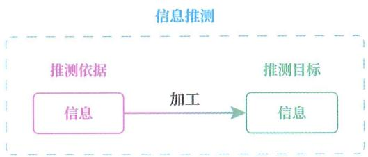

图 17-1

若仅从过程视角来看，我们会忽略信息加工前后的作用，将思维过程称为“信

息加工”或“从输入推测输出”。

但若从功能视角来看，我们则会保留信息加工前后的作用，将思维过程称为“信息推测”或“从已知推测未知”。

基于这两种视角的称呼都可以使用，但本书强调目的，因此采用“信息推测”这个名称。

## 预测

本书之前提到的预测实际上就是信息推测的一种特例，不同之处在于：预测是从当下推测未来，而推测的外延更广，不仅可以从当下推测未来，还可以是（但不限于）：

◎ 从当下推测过去。

○ 从后果推测前因。

◎ 从微观推测宏观。

◎ 从行为推测心理。

◎ 从局部推测全局。

## 基础组件

当然，人脑的思维过程并非总是上例中那样的简单情况，但不论多复杂的思维过程，都可以被拆解成若干个信息推测的组合。

## 做数学题

例如，做数学题的思维过程，就可以被拆解成若干个信息推测的组合，每个信息推测都涉及从输入信息到输出信息的加工。

## 两类推测

信息推测也可分为两种类型——经验推测和模型推测，区别为是否要运用可泛化模型来推测未见信息。

此前讲过经验预测和模型预测，只要将二者扩展一下，去掉“从当下推测未来”的限制，就可以直接扩展到经验推测和模型推测。

## 数学描述

对信息推测有了基础认识后，接下来，我们将运用数学概念对信息推测进行更深入的探讨。毕竟“从一堆信息推测另一堆信息”的表述，只是一种简略说法，缺失很多细节，容易让人以为自己理解了，但实际难以应用。

## 本体数学

在开始探讨之前，需要提醒大家避开两个误区。

首先，数学概念只是我们用来分析和描述思维过程的一个工具，并不是说思维过程在本体上等同于数学。

之所以要提醒大家这一点,是因为生活中经常能听到诸如“X不过是数学/统计学”的言论。这其实也是类固有观的一种表现,因为说话人把“X是Y”的句式解读成了“X在物质世界中的本体是Y”。“不过是”这个用语,也反映了说话人在得知X只是数学后,感叹自己此前高估了X的本体。

## 两种是

实际上，汉语中的“是”有两种含义：一个是经验推测下的“是”，即等同于；另一个是模型推测下的“是”，即被归于。

◎ 当 X 和 Y 的抽象层级没有差异时，“X 是 Y”句式中的“是”意为等同于。

当 X 和 Y 的抽象层级一低一高时，“X 是 Y”句式中的“是”意为被归于，也就是将 X 归类于 Y，暗示着我们接下来将用 Y 的处理方式来处理 X。

## 是 $\mathrm{H}\_{2} \mathrm{O}$

举例说明, “王阳明是王守仁” “水的化学式是 $\mathrm{H}\_{2} \mathrm{O}$ ”, 其中的 “是” 都意为等同于。

但 “苏格拉底是哲学家” 并非在说 “苏格拉底” 在本体上与哲学家这一概念等同，而是说：我们暂时剥离 “苏格拉底” 的部分属性，将其归于哲学家这个概念，并按照哲学家的统一应对法来分析和描述 “苏格拉底”。

## 是数学

同理，当我们用数学概念来描述思维过程时，意味着我们将按照数学概念的统一应对法来处理思维过程，并不是在宣称：思维过程在本体上等同于数学。

## 就是计算

第二个误区：很多人一听到数学，就会下意识地联想到复杂的公式和令人头疼的计算，认为自己不擅长数学，担心看不懂书中的内容。

其实，数学就像汉语，也是一种用来描述世界的语言。

本书内容基本不会涉及计算，你所要做的，就是渐构出一个个数学概念。只要你能像在语文课上造句那样，用这些概念来正确描述（造句）自己平时的思维过程和学习过程，就意味着你掌握了它们。

## 双语描述

能用来描述思维过程的数学概念有很多，为了照顾大多数读者，浆果选用人们熟悉的数学概念进行描述。

在引入数学概念时，浆果会先用日常语言来描述，随后介绍相应的数学描述。

## 输入输出

信息推测的日常描述是“从一堆信息推测另一堆信息”或“从已知推测未知”，若用数学语言来描述，则是“从输入到输出的单向关系”，如图 17-2 所示。

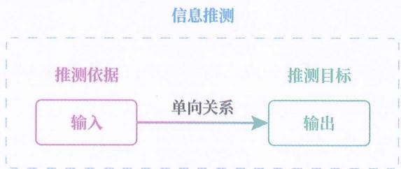

图17-2

之所以这样描述，是因为：信息推测具有方向性，而输入和输出分别意味着关系的起点和关系的终点，刚好适合表达信息推测中的推测依据（输入）和推测目标（输出）。

## 形式约束

输入和输出在本质上是一种“状态”，而二者的关系在本质上是一种“变化/运动”。

但要注意：这里的“状态”和“变化/运动”并不是内容上的，而是形式上的。

即使一个东西在内容上属于一种变化或动作，我们也可以不将其按照关系来处理，而按照输入和输出来处理，只需将其转换成输入和输出的形式即可。

这也意味着：一个东西能否作为输入或输出，并不是客观的，而是人主观选择的，是我们决定要如何描述。

## 词性形式

这就像英语中的词性。虽然游泳这个概念在内容上属于一种动作，但我们也可以不将其按照动词 “swim” 来处理，而按照名词 “swimming” 来处理，只要我们将它变成形式上的名词即可。然后，我们就可以套用 “Swimming is a popular sport” 这个名词的句式。

## 是否可导

再举一个实际例子。

从光的传播时间推测光的传播距离时,会得到二者的关系,姑且称其为“关系A”。此时,光的传播时间是输入,光的传播距离是输出,而关系A既不是输入,也不是输出。但是,在另一个推测中,我们其实可以把关系A视为输入去推测是否可导和是否连续。

## 函数输入

熟悉编程的人更容易理解这一点。在编程中，函数是输入和输出之间的关系，但函数也可以作为输入传递给另一个函数。

## 多输入呢

对于输入和输出的数量，一定有人会好奇：如果遇到从多个输入向多个输出的推测，该如何描述呢？

## 维度

其实，只要引入维度这个数学概念，就可以避免使用“多个输入”的说法。因为无论有多少个“输入”，都可以被视为一个输入的不同维度。“输出”也可以按这个逻辑处理。换句话说，我们将输入或输出看作一个多维向量而不是多个一维标量。

这样做的好处是：我们不必为不同数量的输入和输出建立不同的描述方式，可以使用统一的描述方式来应对各种数量的情况。

我们知道，任何概念都可以被拆分成多个概念，而多个概念也可以被组合为单一概念。所以，无论说“一个概念”还是“一堆概念”都没什么本质差别。但说“一个概念”会更加方便，之后可以在必要的时候，再把“一个概念”详细描述成“一堆概念”。

## 矢量维度

例如,从初中开始,物理就引入了矢量这一概念,也就是既有大小、又有方向的量,而大小和方向就可以被视为两个维度。就拿速度来说,其本身会被视为一个输入或输出,但其包含了两个维度——速度大小和速度方向。

## 打球维度

又如，在打羽毛球的例子中，我们可以将对手的动作和球的位置视为一个输入的两个维度，而不是两个独立的输入。同样地，控制肌肉的神经信号其实也有很多个，我们也可以将它们看作一个输出的不同维度。

## 经验推测

前面说过，信息推测可以细分为经验推测和模型推测两种类型。

当进行经验推测时，信息推测的数学描述会变得更加具体：由“从输入到输出的关系”转变为“从输入常量到输出常量的对应关系”，如图17-3所示。

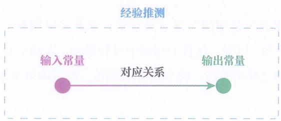

图17-3

## 常量

之所以用常量描述，是因为：经验推测中的输入、输出都是确定的唯一可能状态，不像模型推测中的输入、输出可以是多个可能状态中的任意一个。常量，正是用于表达这种确定的唯一可能状态的特性的。

注意，常量虽有一个“量”字，但它不必是数字，在本质上是状态。

## $3-1=2$

举例来说, 当我们把对象层设为具体数字所处的层面时, 在 “3-1=2” 这一关系中, 3 和 1 是输入常量, 2 是输出常量, 因为 3、1、2 都是确定的唯一可能状态。

但是，在“被减数 - 减数 = 差”这一关系中，被减数和减数不是输入常量，差也不是输出常量，而是变量，因为被减数、减数、差都可以代表 1、2、1.2 等多个可能状态中的任意一个，而非确定的唯一可能状态。

## 对应关系

之所以用对应关系来描述，是因为在经验推测中，输入、输出的关系是两个具有唯一可能状态的对象之间的直接对应，不像在模型推测中的关系是两个可以有多个可能状态的概念之间的映射关系。

在本书中，“对应(关系)”一词专门用来指代一个常量和另一个常量之间的关系。当出现“对应”一词时，也意味着我们将当前讨论的对象视为一个常量。

## 这个苹果

例如，在“这个苹果是酸的”这一关系中，这个苹果是输入常量，酸的是输出常量。这个苹果和酸的之间的关系就是对应关系，因为二者被我们视为常量，都是具有唯一可能状态的对象。

但是，在“苹果是可食用的”这一关系中，苹果可以被我们视为一类事物，包含红苹果、绿苹果、国光、红富士等多个可能状态，不是常量，而是变量。此时，苹果和可食用的之间的关系，就不是对应关系，而是映射关系。

## 实心点

经验推测中的输入常量、输出常量、对应关系，这三者的关系就好比将一个实心点（输入常量）与另一个实心点（输出常量）用一条实线（对应关系）连上。

## 模型推测

同样地，当进行模型推测时，信息推测的数学描述也会更加具体：由“从输入到输出的关系”转变为“从输入变量到输出变量的映射关系”或“从输入空间到输出空间的映射关系”，如图17-4所示。

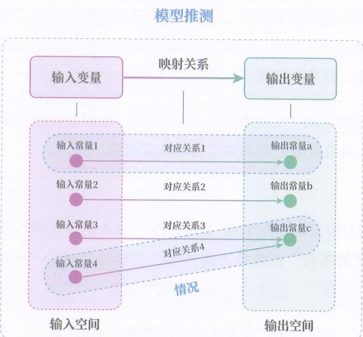

如图 17- 4

## 变量

之所以用变量描述, 是因为: 模型推测中的输入、输出并非确定的唯一可能状态,可以是多个可能状态中的任意一个。变量正是用于表达这种可以在特定范围内任意取值的特性的。

## 酸碱性

例如，“从溶液到酸碱性”的推测中，作为输入（推测依据）的溶液，并非确定的唯一可能状态，可以是温泉水、啤酒、洗衣液、氢氧化钠溶液等多个可能状态中的任意一个，因此是变量。而作为输出（推测目标）的酸碱性也不是唯一可能状态，可以是酸性、中性、碱性等多个可能状态中的任意一个，因此也是变量。

## 空间

我们也可以使用输入空间和输出空间来描述输入变量的可取值范围和输出变量的可取值范围。

可能一些人不熟悉空间这个数学概念，高中教过集合，而空间实际上就是满足特定性质的集合。

在这里，变量对应着自然语言中的概念，空间对应着自然语言中的概念的外延，空间里的元素则对应着自然语言中的外延里的对象。

输入空间和输出空间也有别名，分别叫作定义域和到达域（陪域）。注意与值域相区分，输出的实际取值范围是值域，但输出空间是输出的可能取值范围，因此不是值域，而是到达域。

之所以描述输出空间（到达域），而非值域，是因为在进行信息推测之前，我们只知道可能取值范围，并不知道实际取值范围。

## 寿命有限

例如，在“从人到寿命是否有限”的推测中，输入空间是所有具体的人（如嬴政、孔子）所组成的集合，也就是人的外延，而输出空间是“有限和无限两个可能状态所组成的集合”，也就是是否有限的外延。

尽管通过归纳，我们得出“所有人的寿命都是有限的”，即“输出的实际取值范围都是有限这一个可能状态”，但在描述这个信息推测时，我们应该说“我们在探究人与寿命是否有限的关系”，而不该说“我们在探究人与寿命有限的关系”，因为后者只不过是探究的结果。这也是为什么我们要描述“输入空间和输出空间的关系”，而不是描述“输入空间和值域的关系”。

## 映射关系

至于模型推测中输入（变量）和输出（变量）的关系，则选用映射关系来描述。原因在于：我们进行信息推测时，是为了做决策，需要获得确定的输出结果，而非“既是又是”的输出结果，因此，输入变量在输入空间内的每一个可选取值，都只能对应唯一一个输出取值，不可以对应两个以上的输出取值，否则会得出矛盾的结论。而映射关系就是具有这种约束的变量间的关系，即：输入变量在输入空间的每一个可选取值，都只能对应一个唯一的输出取值。

## 及格映射

例如，“从大学期末分数到是否及格”的推测中，输入空间是0至100的有理数所构成的集合，输出空间是“及格”和“不及格”两个元素所构成的集合。输入变量在0至100范围内的每一个取值，都只能对应一个唯一的输出取值，要么输出 “及格”，要么输出 “不及格”，如果既对应 “及格” 又对应 “不及格”，就相当于没推测。

通常，大学的判定规则都是：当输入为0至59时，都对应不及格，而输入为60至100时，都对应及格，因此这是一个映射关系。若150分为满分，那么输入为0至89时，都对应不及格，输入为90至150时，都对应及格，这又是另一个映射关系。

## 有什么用

当我们渐构好输入 / 输出、常量、变量、维度、空间、对应关系、映射关系这些数学概念后，还可以用它们来更精确地描述思维过程、经验和知识。

## 思维过程

思维过程可以被描述为从输入到输出的推测（加工）过程。

输入是思维过程的起点，也是推测的依据。

输出是思维过程的终点，也是推测的目标。

## 描述经验

事件 / 情况可以被描述为 “从一个输入常量到一个输出常量的对应关系”。

这样一来，我们就能用数学语言来描述经验了，也就是已见情况。

## 描述知识

至于知识，之前我们只能粗略地将其描述为“从一类事物到另一类事物的通用关系”或“多个情况之间的共有关系”，但这些描述仍不能清晰地说明知识的适用范围和作用。

现在，我们有了更好的描述方式。

在一个信息推测（任务）中，我们通常依靠记忆和回忆已见情况（经验），来根据输入推测输出，也就是进行经验推测。我们也可以渐构成一些通用规律。如果某个通用规律不仅能用于推测已见情况（经验）的输入该对应什么输出，还能用于推测广泛的未见情况的输入该对应什么输出，那么这个通用规律就是

基于该信息推测的一个知识。

这里有几个要点：

☐ 知识总是属于某个信息推测（任务）的，但对于同一个信息推测，可以渐构成多个不同知识。

◎ 知识不能仅适用于一种情况，必须能用于推测多种情况，同时包括未见情况。

◎ 知识的映射关系必须符合实际情况。

若用数学语言描述:

◎ 知识是在一个信息推测中对所有输入变量的取值都能推测出正确的对应输出的映射。

◎ 知识的适用范围就是其输入变量的取值范围，也就是它的输入空间。

◎ 知识的作用是帮助我们推测未见情况。

需要注意的是：在描述一个知识时，不能只说它的映射关系，必须说明这个映射关系是“从哪个变量到哪个变量的映射关系”。换句话说，需要输入空间、输出空间、映射关系三个要素，才能完整描述一个知识。

## 惯性定律

举例来说，牛顿第一定律（惯性定律）是一个知识，属于“从受外力为零的物体到物体的加速度的推测规律”。

☐ 知识的输入空间是所有受外力为零的物体组成的集合，元素可以是在桌面上受重力和桌面支持力作用的苹果或不受摩擦阻力作用的滚动的小球等。

☐ 知识的输出空间是所有物体的加速度组成的集合，元素可以是 $-2 \, m/s^{2}$ 、9.8 $m/s^{2}$ 或静止等。

◎ 知识的映射关系是 “所有受外力为零的物体都对应加速度为零（静止或匀速直线运动）”。

☐ 知识的适用范围是所有受外力为零的物体组成的集合。如果某对象不属于物体，则不适用；如果不是受外力为零的物体，也不适用。

## 浮力定律

又如，阿基米德定律（浮力定律）是一个知识，属于“从浸入液体的物体到物

体受到的浮力的推测规律”。

◎ 知识的输入空间是所有浸入液体的物体所构成的集合，元素可以是部分浸入水中的木块或完全浸入油中的铁球等。

◎ 知识的输入可以分成两个维度，即浸入液体的体积和液体的密度。

◎ 知识的输出空间是所有物体受到的浮力的集合。

◎ 知识的映射关系是 $F=\rho*{液}V*{排}g$ 。

◎ 知识的适用范围是所有浸入液体的物体所构成的集合。

## 对照表

表 17-1 展示了自然语言和数学语言的概念对照。

表 17-1 自然语言和数学语言的概念对照表

|  |  |

| --- | --- |

| 自然语言 | 数学语言 |

| 信息推测 / 思维过程 / 认知过程 | 从输入到输出的关系 |

| 对象 / 现象(推测依据) | 输入常量(输入空间的元素) |

| 对象 / 现象(推测目标) | 输出常量(输出空间的元素) |

| 仅对单一情况有效的关系 | 对应关系 |

| 一个对象和另一个对象的个别关系(情况) | 从输入常量到输出常量的对应关系(有序对) |

| 概念(推测依据) | 输入变量 |

| 概念(推测目标) | 输出变量 |

| 推测依据的概念外延 | 输入空间 |

| 推测目标的概念外延 | 输出空间 |

| 对一类情况有效的通用关系 | 映射关系 |

| 一个概念和另一个概念的通用关系(知识) | 从输入空间到输出空间的映射关系(可泛化模型) |

| 知识的适用范围 | 映射的输入空间 |

| 可拆分成多个概念的概念 | 多维向量 |

## 明确入出

可以发现，知识的输入空间表达了知识的适用范围，而知识的输出空间表达了预测目标——能让我们明白该知识可以告诉我们什么信息。

如果一个人在学习某个知识时，不清楚这个知识的输入空间，他就不知道该知识在什么情况下有效、什么情况下无效。如果不清楚知识的输出空间，他就无法判断何时能用上该知识。

因此，我们可以得到学习的第一原则：学习任何知识时，都要先明确该知识的输入空间和输出空间，简称“明确输入输出”。

如何明确

不过，要依靠什么明确输入输出呢？

## 主干提要

1. 思维过程可抽象类化成信息推测过程。

2. 复杂的思维过程可拆解为若干信息推测的组合。

3. 信息推测分为经验推测和模型推测。

4. 思维过程并非本体上是数学，而是可由数学语言所描述。

5. “是”有等同于和被归于两种含义。

6. 推测依据和推测目标可用输入和输出描述。

7. 输入和输出是形式上的，而非内容上的。

8. 任何数量的信息都可以被一个多维输入和一个多维输出所描述。

9. 经验推测和模型推测在数学语言下有了更准确的描述。

10. 经验和知识在数学语言下也有了更准确的描述。

11. 学习任何知识，都需要先明确知识的推测依据（输入）和推测目标（输出）。

## 概念提要

信息推测：从一堆信息到另一堆信息的推测。

◎ 输入：推测依据。

◎ 输出：推测目标。

◎ 维度：描述一个状态时所需的独立参数。

◎ 常量：确定的唯一可能状态。

◎ 经验推测：基于输入常量到输出常量的对应关系所实施的推测。

◎ 对应关系：一个常量和另一个常量之间的对应。

◎ 模型推测：基于输入变量到输出变量的映射关系所实施的推测。

○ 变量：可在特定范围内任意取值的状态。

◎ 空间：变量可取值的范围。

◎ 映射关系：输入变量到输出变量的一种关系（条件是：输入空间的每个取值有且仅有一个对应的输出变量）。

◎ 思维过程：从输入到输出的推测。

◎ 经验：（反映现实的）输入常量到输出常量的对应。

◎ 知识：（反映现实的）输入变量到输出变量的映射关系。

## 判别模型

## 明确外延

想要明确知识的输入和输出，就必须把握概念的外延，因为空间对应着概念的外延，“明确输入空间和输出空间”也就等同于“明确输入和输出中每个概念的外延”。

## 怎么穷尽

不过，概念的外延往往含有未见的具体现象，甚至含有无穷的现象，如图 18-1 所示。要如何把握未见和无穷的现象呢？

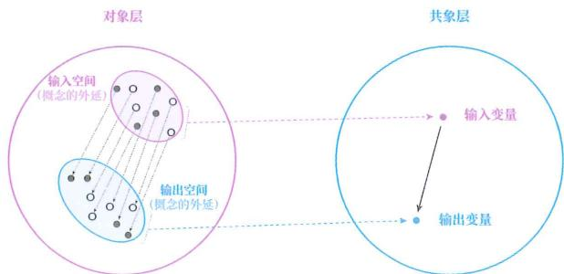

图 18- 1

例如，光的反射定律的输入变量是入射光线、反射面，输出变量是反射光线的方向、反射角。然而，单就反射面这一个概念而言，我们无法见到所有可被归为“反射面”的具体现象，正如我们不可能见到考查光的反射定律的所有高考题一样，那要如何把握反射面的外延呢？

## 依靠判别

其实办法我们早就用过, 那就是抽象类化——通过渐构万能判别法 (判别模型), 将世间所有现象划分成两类。每当遇到一个新现象时, 都用判别模型来判别一下它是否属于这个概念, 进而确定概念的外延。

## 描述模型

判别模型是我们在第 2 章便学过的内容，接下来本章将运用前面学到的输入和输出等数学概念，对其进行更精准的描述。

## 明确模型

不过，你可能察觉到一个潜在问题。我们要依靠判别模型才能明确一个知识的输入、输出，然而判别模型也可以被视为知识，也有输入、输出，那判别模型的输入、输出又要依靠什么来明确呢？

实际上，判别模型的输入、输出直接就能明确，并不需要用额外的模型来明确。这也是判别模型的独特之处。

## 绝对输入

因为判别模型的用途就是判别任意一个对象该被归为哪个概念，所以判别模型的输入空间就是{所有对象/现象}。不论哪个判别模型都是如此，所以就不需要额外的东西来明确判别模型的输入空间了。

我们将 {所有对象 / 现象} 称为 “判别模型的绝对输入空间”。在数学中，与之对应的概念是全集。

## 相对输入

原则上，一个概念的判别模型要能处理{所有现象}，但许多概念只会在某个特定领域中被使用，如图18-2所示。

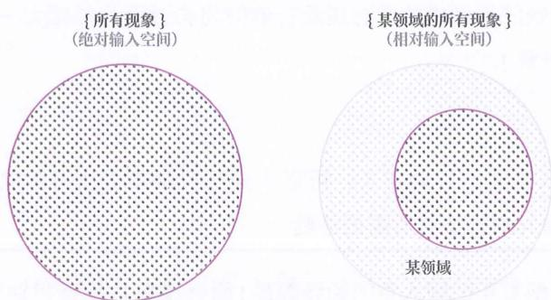

图18-2

这使得在实际中，判别模型的输入空间可被偷懒地设为 {特定范畴下的所有现

象}。我们将其称为“判别模型的相对输入空间”。相对输入空间其实就是对象层。

但在渐构判别模型时，其输入空间就代表着该模型所能应对的范围，将其设定在特定范围内，那么所学到的模型的应对范围也就被缩小了。

然而，这个“特定范畴”也不能过小，必须既有“A的具体对象”，又有“非A的具体对象”，不能仅有一个类别的具体对象，否则就没有渐构判别模型来进行判别的必要了。

## 整数领域

例如，原则上，偶数的判别模型的输入空间是 {所有对象}，应能判别任意一个东西是偶数还是非偶数——像是判别黄河是偶数还是非偶数，判别苹果是偶数还是非偶数，判别 3 是偶数还是非偶数。但由于偶数只在整数的范畴中被使用，使得偶数的判别模型的输入空间在实际应用中，常常被设为 {所有整数}，有时也会被设为外延大一些的范畴，如 {所有数}，但不能设得过小，不能是 {2, 4, 6} 这种仅有 “偶数的具体对象”、没有 “非偶数的具体对象” 的输入空间，否则所学到的模型就只能应对这 3 个情况，并且都是偶数，完全没有渐构这个模型的必要。

## 经济领域

又如，原则上，正外部性的判别模型的输入空间也是{所有对象}，要能判别黄河是正外部性还是非正外部性，接种疫苗是正外部性还是非正外部性，等等。但由于正外部性是经济学范畴下的概念，在实际应用中，其判别模型的输入空间常被设为{经济活动中的所有现象}，有时也会被设为外延大一些的范畴，如{活动中的所有现象}。

## 相对优势

采用相对输入空间的好处在于：可以不必每次都带着所有的具象对象去思考，可以节省渐构判别模型时所需的经验。

不过,判别模型真正的输入空间始终都是{所有现象},毕竟判别模型的别名叫“万能判别法”,必须能用于判别“万物”,被设为{特定范畴下的所有现象}只是一种临时的取巧。由于这样构造的判别模型仅有特定范畴下的判别能力,倘若遇到了所选范围之外的对象，就需要搭配运用其他判别模型，来实现判别“万物”的能力。

## 经济活动

如图 18-3 所示，在渐构正外部性的判别模型时，我们可以将它的输入空间设定为 {经济活动中的现象}。这样就不必带着苹果、偶数、黄河、给压岁钱等对象一起思考了。

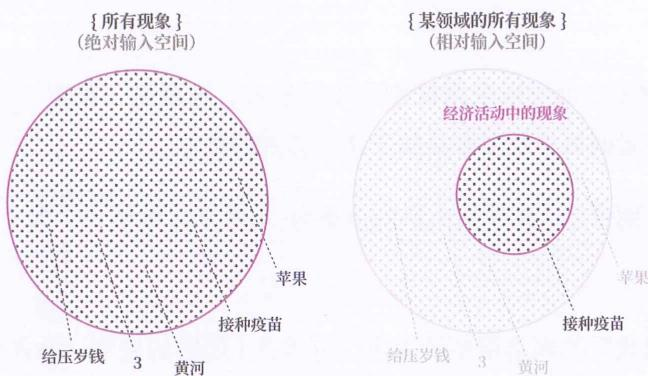

图18-3

不过，我们仍要能判别给压岁钱这种对象属于正外部性还是非正外部性。这时就要搭配经济活动的判别模型来一起进行判别：由于给压岁钱不属于{经济活动中的现象}，所以即使它满足“导致其他主体获利，但获利者无须付出代价”的属性，也不属于正外部性。

## 二类输出

判别模型的输出空间同样不需要额外的模型来明确，因为判别模型的输出常量无非就是此概念或非此概念两个可能结果中的一个。判别模型的输出空间就是{此概念，非此概念}两个可能类别所组成的集合，如图18-4所示。

图18-4

## 偶数输出

例如，“偶数”的判别模型的输出空间就是{偶数，非偶数}——两个标签所组成的集合。

## 正外输出

又如，“正外部性”的判别模型的输出空间就是{正外部性，非正外部性}——两个标签所组成的集合。

## 概率输出

判别模型的输出也可以采用概率分布的形式，也就是：设定一个多维向量作为输出，该向量的每个维度都是属于某个类别的概率。

若是二类判别模型，则输出向量的形态为：[属于 A 的概率，属于非 A 的概率]。

## 偶数概率

例如，“偶数”的判别模型的输出，可以是[偶数的概率，非偶数的概率]这个多维向量，以代表眼前现象属于不同类别的概率。

当向量取值是 $[100\%, 0\%]$ 时，代表属于偶数的概率为 $100\%$ ，属于非偶数的概率为 $0\%$ 。当向量取值是 $[30\%, 70\%]$ 时，代表属于偶数的概率为 $30\%$ ，属于非偶数的概率为 $70\%$ 。

## 直接写出

可见，对于任何一个概念，我们都能直接写出其判别模型的输入、输出，如图18-5所示。

◎ 输入空间：{所有对象}。

◎ 输出空间：{此概念，非此概念}。

◎ 映射关系：

- 如果某对象具备此概念的内涵，则归为此概念。

- 如果某对象不具备此概念的内涵，则归为非此概念。

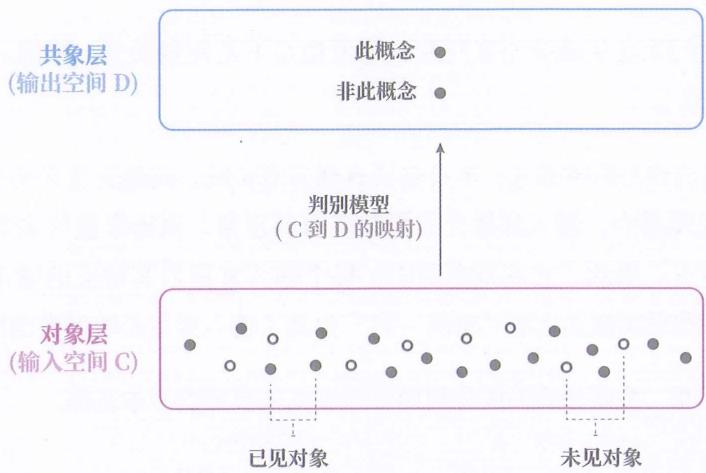

图18-5

## 太极两仪

类化和判别模型，特别像中国古代哲学中的“太极生两仪”。

太极相当于全集，两仪（阴阳）相当于 A（正概念）和非 A（负概念）。太极属于我们无法直接认识的东西。想要让认识能力发挥作用，必须通过划分概念来创造概念世界。我们每次使用判别模型都会划分出两个概念，不断划分下去，最终构成了万物。

不过，这里只是说二者很像，无法确定这是不是“太极生两仪”这句话的本义。

## 多类输出

判别模型的输出空间一般来说由两个类别（正概念和负概念）构成，但在实际应用中也可以由两个以上的类别构成（如小、中、大）。我们将输出有两个类别的判别模型称为“二类判别模型”，将输出有两个以上类别的判别模型称为“多类判别模型”。

多个二类判别模型可以转换成一个多类判别模型，反之亦然。由于可以相互转换，所以后续本书只拿二类判别模型来讲解。

## 划分依据

注意，本书并不是根据成分来区分判别模型的，而是根据用途——当一个模型被用来从全集中划分正概念和负概念时，就被我们归为判别模型。

## 判模用途

因此，我们无法从成分上来判断一个模型是不是判别模型，只能从它的现实意义上来区分。

输入和输出作为数学概念，本身是没有现实意义的，其现实意义是我们赋予的。而在判别模型中，输入常量代表着归类前的现象，输出常量代表着划分出来的类（标签）。因此，在判别模型中，每个输入常量与其对应的输出常量之间，都具有一种现实意义上的“实例－类”关系（输入常量是输出常量的实例）。

“实例 - 类”关系是我们区分判别模型和其他模型的根本依据。

## 偶数判模

图18-6展示了偶数的判别模型。

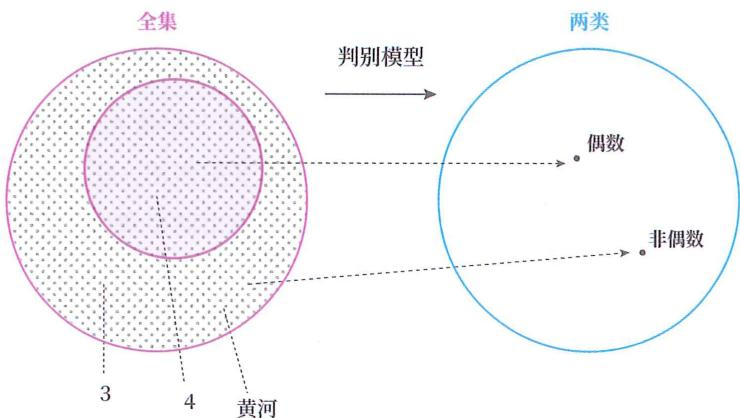

图 18-6

其中，2（输入常量）对应偶数（输出常量），而2是偶数的一个实例。

同理，给压岁钱（输入常量）对应非偶数（输出常量），而给压岁钱是非偶数的一个实例。

每个输入常量与输出常量的对应关系都满足“实例－类”关系，所以它是一个判别模型。

## 暴毙

“从人到能否永生”所描述的模型就不是判别模型。因为在该模型中，赢政（输入常量）对应不能永生（输出常量），而嬴政并不是不能永生的实例，49岁暴毙才是不能永生的实例。

## 判别能力

接着，我们再来看看判别模型所具备的能力，它能做什么，不能做什么。

其实, 判别模型并不能让我们直接得到完整的外延, 我们只能在遇到一个对象时,用它判别属于哪个概念的外延。我们将这种能力称为 “判别能力”。

判别能力不同于具象能力，并不能“由概念（标签）联想可被归为此概念的所有对象”。虽然在理论上我们可以把所有对象都给判别模型，再根据判别结果构造出概念的完整外延，但在实际应用中，我们不可能收集到所有对象，以致判别能力并不能用于凭空罗列概念的完整外延。

## 难举例子

正因如此，我们可以观察到一种现象：某些学霸在遇到具体问题时，能判断这个问题该用什么概念的相关公式来解决。但若反过来问，“当前这个概念的相关公式”可以用来解决“哪些具体问题”，他们往往很难想出多少例子。这正是因为在解决具体问题时，运用的是判别能力，而举例子时，需要的是具象能力。

## 引出联结

用数学概念描述完判别模型后，我们再来看看另一种模型的数学描述。

## 主干提要

1. 明确输入、输出意味着明确输入和输出中每个概念的外延。

2. 知识的输入、输出通常需要用判别模型来明确。

3. 判别模型的输入、输出不需要用其他判别模型来明确，因为可以直接写出。

4. 在实际中，常用判别模型的标准输入来节省建模所需经验。

5. 判别模型可视为一个概念外延（万物）到另一个概念外延（二类）的映射。

6. 多个二类判别模型可以转换成一个多类判别模型。

7. 只能从作用上区分判别模型和其他模型。

8. 判别模型只有判别能力，没有联想能力。

## 概念提要

◎ 判别模型绝对输入空间：所有现象组成的集合。

◎ 判别模型相对输入空间：特定范畴的所有现象组成的集合。

◎ 判别模型二类输出空间：正概念和负概念两个类别组成的集合。

◎ 判别模型多类输出空间：多个类别组成的集合。

◎ 判别模型概率输出变量：一个代表所有类别的概率分布的向量。

◎ 判别模型用途：对现象进行类别划分的模型。

◎ 判别能力：给定一个现象，对其进行概念判别的能力。

◎ 具象能力：给定一个概念，联想此概念的具体实例的能力。

## 联结模型

## 文件夹间

现在，请你把对象层想象成一个硬盘，当我们渐构一个判别模型时，就相当于以内涵为分类依据，把硬盘中的所有文件分类装入两个文件夹。当多个判别模型被渐构后，我们就可以探究文件夹之间的关系了。

不过，由于在这种情况下，文件夹被视为一个标签，是那群文件的代表，因此，探究两个代表之间的关系，实质上是在探究两群文件之间的关系。

## 联结模型

让我们试着以同样的逻辑来理解图 19-1。

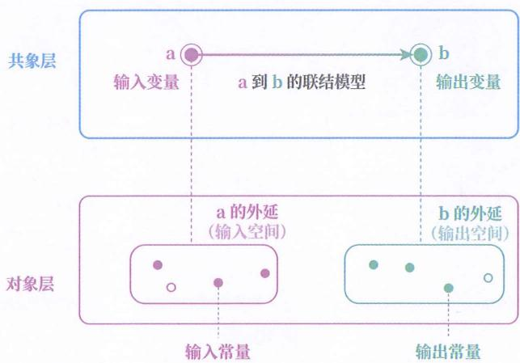

图 19- 1

当我们用 a 的判别模型构造了概念 a，又用 b 的判别模型构造了概念 b 后，我们常常需要根据 a 的具体状态去推测 b 的具体状态。这时就可以探究 a 和 b 这两个概念之间的单向关系了，如从 a 到 b 的单向关系或从 b 到 a 的单向关系。不探究 a 和非 a 的关系是因为它们在构造之时就已捆绑彼此了。

由于在这种情况下，a 和 b 这两个概念是变量，代表“空间”内的“任意常量”，因此探究概念 a 到概念 b 的单向关系，实质上是在探究 a 的外延（输入空间）到 b 的外延（输出空间）的映射关系。

由于这种关系会让孤立的概念（变量）产生联系，因此我们将“从一个划分出的概念（外延）到另一个划分出的概念（外延）的映射”称为“联结模型”。

当我们渐构的联结模型对于输入空间中的所有常量（包括未见对象）都能得出唯一的正确输出常量时（即具有充足的可泛化性），我们就把这种通用的、反映现实的联结模型称为知识。

## 人手指数

如图 19-2 所示, 当我们用人(身份)的判别模型和手指数的判别模型创造了人(身份)和手指数的概念后, 就可以探究 “从人(身份)到手指数的单向关系” 了。这实际上是在探究 “人的外延到手指数的外延的映射关系”, 也就是从 {赢政, 孔子, 李清照, ……} 到 {1, 2, 3, ……} 之间的映射关系。

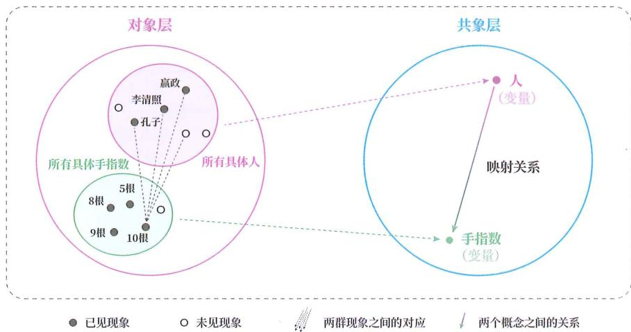

图 19-2

由于这种关系会让人和手指数这两个已划分出的概念（变量）产生联系，因此也被称为“从人（外延）到手指数（外延）的联结模型”。

经探究，我们得出“所有人都对应10根手指”，但这个映射仍有推测失败的情况。如图19-3所示，这时，我们可以在人的外延的基础上再构造一个残疾人的判别模型，得到残疾人和非残疾人这两个概念。然后渐构“从非残疾人到手指数的联结模型”。由于“所有非残疾人都对应10根手指”的映射，对输入空间（非残疾人）中的所有常量（包括未见的非残疾人），都能得出唯一的正确输出常量，我们就把这个通用的、反映现实的联结模型称为一个知识。

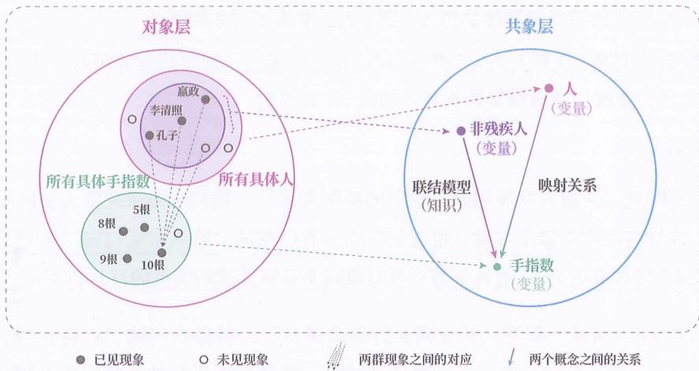

图19-3

从这里也能够看出概念的划分是任意的，还会受到概念间关系的影响。

另外，当我们反过来探究“从手指数到非残疾人”的关系时，会发现，当输入变量的取值为10根手指时，输出变量可以对应多个具体的非残疾人，不满足映射关系的定义，因此它并不是一个知识。

## 常量关系

注意：联结模型一定是两个变量（空间）之间的映射关系。倘若两个概念不被我们视为变量，而是被类对象化为对象（常量）来使用，那么这两个“概念”之间的关系就不是一个联结模型，甚至不是模型，而是一个对象与对象的关系。

## 人和男人

例如，“人包含男人”这个描述就不是一个联结模型，而是对象与对象的关系。因为“人包含男人”中的人和男人都被视为了对象/常量。倘若真的是联结模型，我们则需要寻找{赢政、李清照等所有具体的人}到{赢政、苏格拉底等所有具体的男人}的映射。可“从赢政（具体的人）推测赢政（具体的男人）”或“从赢政（具体的人）推测苏格拉底（具体的男人）”没有意义。

## 男人为人

可能有人觉得 “所有男人都是人” 这句话总该是 “从男人到人” 的联结模型了，但它其实是 “人” 的判别模型在所有具体男人上的批量运用结果。

☐ 如果将 “从男人到是否为人” 模型，改写成空间之间的关系，则是 “{赢政，苏格拉底等所有具体的男人} 到 {人，非人} ” 的映射。

假如真是“从男人到人”模型，则应该是“{嬴政，苏格拉底等所有具体的男人}到{嬴政、李清照等所有具体的人}”的映射。

## 归纳

为了探究 “从输入空间到输出空间的映射关系”，我们需要探究输入空间中的每个常量对应哪个输出常量，也就是找出所有已见的 “输入常量与输出常量的对应关系” 所共享的关系。这种寻找一群对象间关系所共享的关系的行为，叫作 “归纳”。

如图19-4所示，探究“从a到b的联结模型”，就是在归纳“ $\mathrm{a}*1$ 到 $\mathrm{b}*1$ ”“ $\mathrm{a}*2$ 到 $\mathrm{b}*2$ ”“ $\mathrm{a}*3$ 到 $\mathrm{b}*3$ ”“ $\mathrm{a}*4$ 到 $\mathrm{b}*4$ ”这些已见的输入常量与输出常量的对应关系所共享的关系。

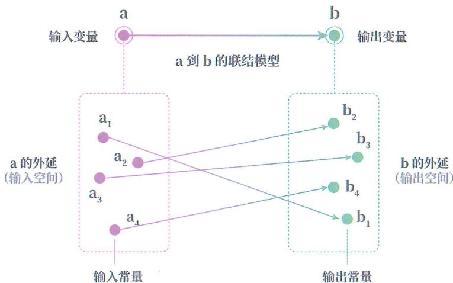

图 19- 4

## 表征

如图 19-5 所示，在归纳输入变量到输出变量的映射关系时，由于输入不方便存储或变体太多等原因，我们可以基于输入计算出一个在推测输出时可以完全代表输入的变量。这种变量被称为“这个输入在该信息推测中的表征”。

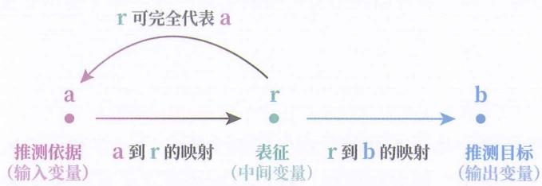

图 19- 5

注意: 不能脱离信息推测单独说“某个输入的表征是什么”, 因为即使是相同输入, 在推测不同输出时也会有不同的表征。

## CT 组合

在医疗诊断中，表征的使用非常普遍。

在从人体数据到是否患新冠病毒感染的推测中，我们会利用核酸检测试剂盒，将人体数据（输入）转换成 C 和 T 组合（表征），其取值空间是 {有 C 有 T，无 C 有 T，无 C 无 T，有 C 无 T}，以此作为人体数据的代表，来推测是否患新冠病毒感染，即 {阴性，阳性，无效}。这个 C 和 T 组合就是人体数据在推测是否患新冠病毒感染时的一个表征。

注意，我们不能说 “C 和 T 组合是人体数据的表征”，要说 “它是人体数据在推测是否患新冠病毒感染时的表征”，因为在推测是否患尿毒症时，该人体数据——C 和 T 组合就不是表征。

## 低烧

再举一个反例。很多疾病都伴随低烧症状，但低烧在此时只能被称为特征，称不上表征，因为它并不能在推测是否患某种疾病时完全代表人体数据。此时的表征往往是低烧、呕吐、乏力等众多特征的组合。

## 联模用途

联结模型的用途是：当我们划分出两个概念，并且确定其中一个概念（变量）所处的具体状态（常量）后，可以利用相应的联结模型去推测另一个概念（变量）所处的具体状态（常量）。

换个说法：联结模型是一个公式，当我们确定了公式中某些字母（输入变量）

的取值（常量）后，就可以利用公式推测出另一些字母（输出变量）的取值（常量）。

## 人会死

例如，当我们划分出了人和能否永生这两个概念后，并有了“从人（变量）到能否永生（变量）”的联结模型，就可以在确定了人（变量）所处的具体状态是苏格拉底（常量）时，用“所有人都会死”这个联结模型，去推测能否永生（变量）所处的状态是不能永生（常量）。

## 三段论

你可能还注意到了判别模型、联结模型与传统三段论的关系。

在三段论中，小前提由判别模型负责，大前提由联结模型负责。

例如：

◎ 人会死（大前提）。

◎ 苏格拉底是人（小前提）。

◎ 苏格拉底会死（结论）。

在这个三段论中，“人会死”是联结模型的映射关系，也是大前提。判别模型将苏格拉底（对象）判别为人（概念），也就提供了小前提。当联结模型按照对“人”的应对法（会死）去处理苏格拉底后，就得到了“苏格拉底会死”的结论。

## 针对对象

需要重点强调的是：联结模型虽是两个概念间的关系，但我们在应用它时，所针对的并不是抽象概念本身，而是概念所代表的具体对象，因为此时的概念只是一群具体对象的代表。

换个说法。我们在运用公式时，所针对的并不是公式里的“字母”本身，而是“字母”所代表的具体数值，因为此时的“字母”只是代表着一群具体数值的代表。

如图 19-6 所示，应用联结模型时，我们所要处理和解决的问题是下层的具体对象如何相互对应。

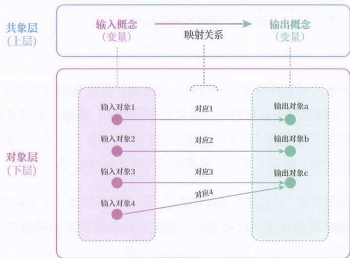

图19-6

## 具体人

例如，“从人到能否永生”这个联结模型所处理和解决的并不是抽象的人，而是具体的人，如“嬴政”“孔子”“苏格拉底”。此时的人（概念）只是{嬴政、苏格拉底等所有具体的人}的代表。

独立

另外，并非任何两个概念之间都能形成联结模型，有些概念间是彼此独立的。

## 预测硬币

例如，抛硬币时，上一次硬币的正反与下一次硬币的正反之间就没有关系，不能由前者推测后者，自然就无法形成联结模型。

## 非归类

联结模型和判别模型一样, 都是根据用途划分出来的类别, 无法根据成分来区分, 因为二者都是空间到空间的映射, 唯一不同的就是用途: 判别模型是用来从全集划分类别的, 联结模型是在划分好的类别之间渐构联系的。前者相当于创建文件夹, 后者相当于建立文件夹之间的映射。

只有被判别模型划分出来的概念之间的映射，才被归为联结模型。全集（万物）并不是划分出来的概念。全集包含一切，没有进行任何类别划分。

在判别模型的每个输入常量与其对应的输出常量之间，都具有一种现实意义上的“实例－类”关系。联结模型则不具备此关系。

## 浓度动作

例如，“从血液酒精浓度到是否饮酒”的模型，虽然其输出空间是{饮酒了，没饮酒}，与判别模型的输出空间在形式上非常相似，但却不是判别模型，而是联结模型。因为在该模型中，200毫摩尔/升对应饮酒了，可200毫摩尔/升并不是饮酒了的实例。饭桌上某老板举杯吞咽红酒才是饮酒了的实例。

从用途上也能看出“从血液酒精浓度到是否饮酒”的模型并不是用来划分概念的，而是用血液酒精浓度这个已经划分好的概念的具体状态去推测是否饮酒的具体状态。

## 非全部

注意：本书对现象和概念采用的是相对意义的定义，是根据对象层来区分的。在本书对“概念”的定义下，判别模型和联结模型构成了全部的概念间关系。

但在日常含义下，“概念”会被用来称呼几乎所有事物，是绝对意义的定义。在日常语境下的“概念间关系”无法由判别模型和联结模型所覆盖。还有相等关系、包含关系和相交关系等也会在日常语境下被称为“概念间关系”，但它们并非本书所指的“概念间关系”。相等关系、包含关系和相交关系既不是判别模型，也不是联结模型，甚至不是模型。

例如，前面提到的“人包含男人”这个包含关系，就不是本书所指的概念间关系，而是对象间关系。

## 对照表 2

判别模型和联结模型的对照表如表 19-1 所示。

表 19-1 判别模型和联结模型的对照表

|  |  |  |

| --- | --- | --- |

| 对照项 | 判别模型 | 联结模型 |

| 用途 | 从全集中划分若干类别,判断任意现象归属于哪个类别 | 在两个划分出的类别之间,用一个类别所处的状态推测另一个类别所处的状态 |

| 输入空间 | {所有现象} | 划分出的概念的外延 |

| 输出空间 | {此概念,非此概念} | 划分出的概念的外延 |

| 构造条件 | (划分类别)想造就造 | (类别之间)未必有关 |

| 输入与输出的常量关系 | 具有“实例-类”关系 | 不具有“实例-类”关系 |

| 用途类比 | 将现实问题转为公式中的符号 | 用一些符号的取值推测另一些符号的取值 |

## 结合应用

从对照表中可以发现：

◎ 判别模型的构造是无条件的、任意的，我们可以随意把一群现象划分成一个概念，但其自身并不能解决任何实际问题。

联结模型一旦被成功渐构，就可以解决实际问题，但却需要判别模型来判断当前的现象是否属于其输入空间，也就是它的适用对象范围。

因此，两种模型必须结合使用才能解决实际问题。用数学语言描述：若想获得解决实际问题的能力，一个人至少在脑中渐构两个判别模型和一个联结模型。另外，如果输入或输出是多维的，那么还要为每个额外维度都渐构一个判别模型。

## 软件界面

下面用软件的图形界面做类比，如图 19-7 所示。

◎ 判别模型相当于在软件数据（类比现象）和软件图标（类比概念）之间建立映射关系，使得图形界面（类比概念世界）可以代表软件（类比现实世界）。

联结模型相当于在软件图标（类比概念）之间建立映射关系，使得 A 图标的数值变化时，B 图标的数值也能正确地跟着变化。

二者必须结合在一起，我们才能运用软件。

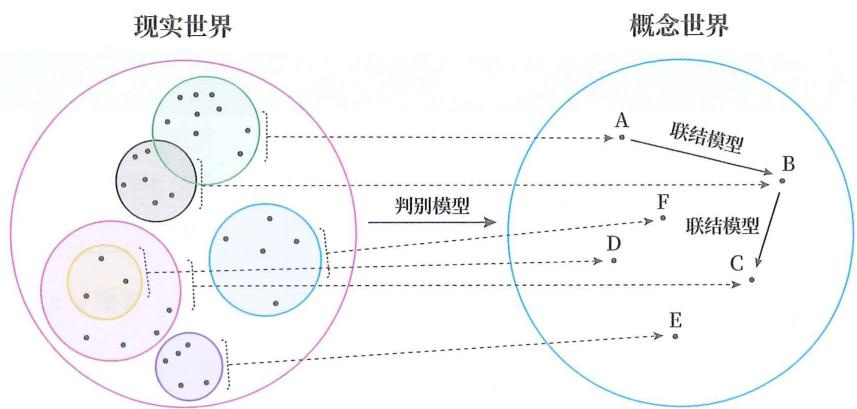

图 19- 7

## 非残手指

接下来，以“正常人有10根手指”这个知识为例完整罗列出“正常人”判别模型、“手指数”判别模型以及“从正常人到手指数”联结模型。

“正常人”判别模型：

◎ 输入空间：{所有对象}，如“嬴政”、8根手指。

◎ 输出空间：{正常人，非正常人}。

注意，由于选用的输入空间是 {所有对象}，而非 {所有人}，因此这里的“非正常人”是 {所有对象} 和 {所有正常人} 的差集，也包括 {所有非人的对象}，如 8 根手指。

“手指数”判别模型：

◎ 输入空间：{所有对象}，如“嬴政”、8根手指。

◎ 输出空间：{手指数，非手指数}。

不描述这两个判别模型的映射关系是因为很难用精准的语言描述，但我们可以不依赖语言渐构它们，所以暂时略写。

“从正常人到手指数”联结模型：

◎ 输入空间：{所有具体正常人}，如“嬴政”。

◎ 输出空间：{所有具体手指数}，如8根手指。

映射关系：所有正常人都对应 10 根手指。

请结合图 19-8 理解。

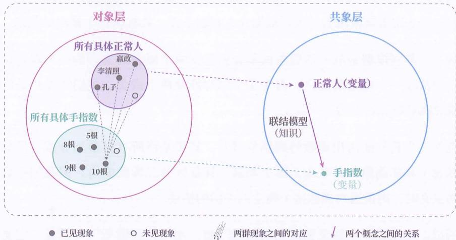

图19-8

若想应用“正常人有10根手指”这个联结模型解决现实问题,就需要依靠“正常人”判别模型帮助我们判别某个具体对象是否可被归为正常人这个概念。

例如，判别“赢政”这个具体对象是否可被归为正常人。发现可以归入，那我们就得出“赢政也有10根手指”。如果某个具体对象被判别模型归为非正常人，那我们便不选用该知识来解决问题。

然而，倘若没有了“正常人”判别模型，就相当于图中的{所有具体正常人}圆圈消失了.我们都不知道正常人这个概念代表哪些对象，“正常人有10根手指”当然也就成了空话。

## 定义判别

需要提醒的是，判别模型不等同于定义。

首先，判别模型是将一个现象判别为某个概念的一种规则，而定义是对判别模型的判别条件（共有属性）的准确表述，也是渐构判别模型的一种学习材料。记住定义不意味着渐构出了判别模型。

例如，记住对数的定义，并不意味着在生活中看到具体的对数现象时，能判断出它可以使用对数的公式来解决。

其次，判别模型分内隐和外显两种，定义只针对外显判别模型。我们无法用语言准确表述判别条件（共有属性），但是可以渐构成内隐判别模型。

例如,我们都能判别出一个现象是否属于悲伤,脑中具有悲伤的(内隐)判别模型,但却无法用语言精准表述我们根据什么判别条件(共有属性)做出的判别。

第三，判别模型是从一群现象的集合到至少两个概念的集合的一个映射，并不单单涉及一个概念的定义，而是至少同时涉及两个概念。我们需要具备区分正概念和负概念的能力。

例如，当我们渐构成偶数的判别模型时，其实是将所有整数划分成了偶数（正概念）和非偶数（负概念）两个类别，具备区分二者的能力。但我们提到偶数的定义时，则仅指对偶数这个概念的内涵的描述。

所以，在描述 “从现象到概念的映射” 时，用 “判别模型” 一词比 “定义” 一词更精准。不过，人们有时也用 “明确定义” 来表达渐构判别模型。

例如，“先明确自由的定义，才能讨论自由的议题”的意思就等同于“先渐构自由的判别模型，才能渐构自由的联结模型”。只不过，“明确自由的定义”容易被人解读为用一句话解释什么是自由，但它实际上的意思是渐构“什么现象该被归为自由的判别依据”，更准确的描述也就是“先渐构自由的判别模型”。

## 分析应用

使用数学语言描述判别模型和联结模型，会变得更加清晰、明确。接下来，我们就来看看用它们描述学习现象有多么清晰。

## 主干提要

1. 当我们用判别模型划分出概念后，就需要在概念（的外延）间渐构映射。

2. 渐构概念间映射是为了根据一个概念所处的具体状态推测另一个概念所处的具体状态。

3. 渐构概念间映射的方式之一是归纳。

4. 在归纳过程中，常会寻找表征。

5. 并非任何两个概念之间都能形成联结模型，有的彼此无关。

6. 判别模型和联结模型是根据作用区分的，前者用于划分类别，后者用于在划分出的类别间构造映射。

7. 注意区分本书定义的“概念”和日常含义中的“概念”。

8. 需要将判别模型和联结模型搭配使用，才能解决现实问题。

## 概念提要

◎ 联结模型：在已划分出的类别之间的映射。

◎ 归纳：寻找多个对象间关系所共享的关系。

◎ 表征：由输入计算而来的可完全代表输入来推测特定输出的变量。

◎ 联结模型的用途：用于根据一个类别的具体状态推测另一个类别的具体状态。

○ 独立：一个变量的取值不影响另一个变量的取值。

## 坍缩原因

## 坍缩原因

我们在第 16 章讨论过下层丢失、上层丢失和下上错配的知识坍缩问题。接下来，我们讨论一下当判别模型和联结模型没能合理结合时，会如何导致知识坍缩。

没能合理结合的情况有：

◎ 既没判别模型，也没联结模型。

◎ 只有判别模型，没有联结模型。

◎ 只有联结模型，没有判别模型。

◎ 有判别模型和联结模型，但错配了。

下面我们逐一进行讨论。

## 双模均无

既没判别模型，也没联结模型，便意味着停留在现象层面，只能应对已见情况，无法应对未见情况。若在学习知识时两种模型均无，便会导致此前说过的上层丢失，对知识的学习变成了对经验的记忆。

## 仅有判模

若仅有判别模型，没有联结模型，就只能将某现象归为某概念（类别），然后就此止步，没有后续处理，无法解决现实问题。

不仅如此，由于脱离了联结模型所提供的概念间关系，导致连判别模型的划分方式是否合理都无法判断了——不论我们怎么渐构判别模型，都无所谓对错了。

若用三段论来描述，则是：仅有小前提，没有大前提，无法推出结论。

## 仅苏是人

例如，不知道人的任何联结模型（如“人非永生”），仅能判别苏格拉底属于人，并不能解决实际问题。就连怎么渐构人的判别模型都无所谓对错了。

## 仅有分类

有些网络科普文章在介绍某生物时，常常带有“界、门、纲、目、科、属、种”的分类信息，如“某鱼属于硬骨鱼纲、鲱形目、鳀科、鲚属”，但这些信息对于一般受众来说，属于无效信息，因为一般受众并没有这些类别的联结模型。

如果想让这些分类信息对一般受众有用，那么受众必须要此前学过，或者未来会学这些类别的联结模型，如“从硬骨鱼纲到繁殖方式”的联结模型，进而可以推测该鱼也具有硬骨鱼纲所拥有的繁殖方式。

## 分无意义

仅有判别模型，没有联结模型，就好比：虽能判别某文件是否属于文件夹 A，但对于文件夹 A 却没有任何后续操作，那么即使能判别，也解决不了实际问题。

不仅如此，由于脱离了对文件夹 A 的处理方式，不论我们以哪种规则去判别某文件是否属于文件夹 A，都无所谓对错了。反正，没有了后续处理，我们可以想怎么判别就怎么判别。

## 仅学概念

由于我们平时所说的“学习概念”其实就是在渐构判别模型，因此一个人不能仅学概念（判别模型），不学概念间关系（联结模型），否则将无法解决现实问题。

不过，不一定需要同时学习，可以先学概念，之后再把此概念的联结模型也学了，这样才能让所学的判别模型有用武之地。

## 仅有联模

接着是对“仅有联结模型，没有判别模型”的讨论。

严格来说，真正意义上的“仅有联结模型，没有判别模型”是不存在的。因为联结模型必然具有下上结构，需要依靠判别模型来提供“从下层到上层的映射”，这样才能确定联结模型中的每个概念所代表的现象群。换句话说，判别模型是

联结模型的前提。

因此，如图 20-1 所示，如果一个人在渐构联结模型时缺少判别模型，那么下上结构就会坍塌，对象层会丢失，同时共象层会被学习者误当成对象层，导致联结模型被学习者当成了单个经验来记忆。这个现象就是我们此前提到的下层丢失。

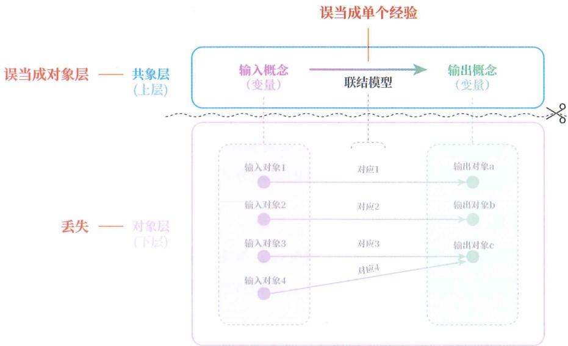

图20-1

## 导致丢下

由于共象层中的概念仅仅是代表着特定现象群的代表，对象层中的具体现象才是联结模型所要解决的问题，因此，当对象层丢失时，学习者便无法判断联结模型可以解决什么问题。

尽管学习者能将联结模型降维成单个经验，但由于这种经验是由判别模型从现实映射上去的，在现实中根本不会遭遇具体现象，没了判别模型，就会变成一种“悬空的经验”，所以学习者也无法靠它在现实中执行经验推测，只能在语言中回忆。也就是说，这种从联结模型降维而来的经验只能用于特定的考试或作为谈资，并不能用于现实问题。

更糟的是，学习者还会误以为自己学会了该知识，进而觉得这是一个“无用的知识”。

## 无效公式

这就好比，某学生学习一个公式（类比联结模型），但没能正确认识公式中的字母代表哪些对象，导致他无法判别哪些现实问题可以套用该公式。

为了完成学习任务，该学生只能把这个公式背下来，使得这个公式被他降维成了“悬空的经验”，在生活中根本不会见到，只能在考试中见到。

同时, 背了该公式的学生还会误以为自己学会了该公式, 进而觉得这个公式是 “生活中根本用不到的知识”, 认为它就是 “学校用来筛选学生的一种无用知识”。

## 对数公式

例如，所有学生都背过对数公式，但很少有学生在生活中用它解决过实际问题。这是因为，这些学生虽记住了对数公式这个联结模型，但缺乏“从具体生活现象到对数、真数、底数”的判别模型，导致学生即使在生活中遇到这些概念的具体生活现象，也无法将其判别到对数、真数、底数的概念下，自然不知道可以用对数公式来解决问题。

但学生又会以为自己学会了该公式，进而觉得对数公式是“生活中根本用不到的知识”，认为它就是“学校用来筛选学生的一种无用知识”。

## 想不到

很多学生在解题时没有思路，一看答案后才发现，自己已经记住了解题用到的公式，可就是没想到要用该公式。很多学生以为这是“公式没记牢”所导致的，于是更加努力地背公式。

实际上，“公式”只是联结模型，而“没想到要用该公式”的真正原因是缺乏公式中各概念的判别模型，改进方式是提高判别模型的可泛化性，而不是去重复背自己已经记住的联结模型。

## 贝叶斯

例如，贝叶斯定理是非常有用又出圈的联结模型。其具体公式如下：

P

(

A

|

B

)

=

P

(

A

)

P

(

B

|

A

)

P

(

B

)

然而，很多人会觉得：自己明明背了公式，可一旦去解决现实问题就毫无头绪。

其实, 毫无头绪不是因为没记牢公式, 而是对公式中 $P(A \mid B)$ 、 $P(A)$ 、 $P(B \mid A)$ 、 $P(B)$ 这四个概念的判别模型的渐构不足, 无法将具体现象判别到这四个符号 (概念) 下。

## 判联错配

有时，虽然学习者在学习联结模型时，没有渐构对应的判别模型，但会下意识地用自己已渐构的其他判别模型去顶替，造成“判别模型和联结模型的错配”，我们将这种现象称为“判联错配”。

判联错配会导致当事人产生逻辑谬误。如图 20-2 所示，由于错配的判别模型会将不适用的对象判别到联结模型的概念下，正确的输入空间（见图中实线圈）被错配的输入空间（见图中虚线圈）顶替了，导致当事人在运用联结模型时，代入不适用的对象。

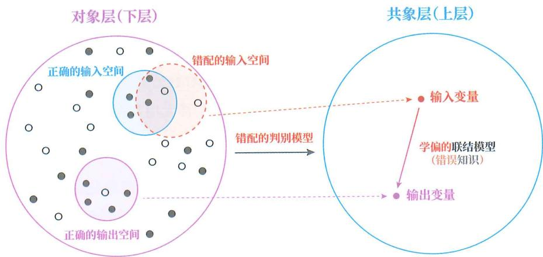

图20- 2

## 人会衰老

结合图20-3来理解，“人会衰老”这句话描述的是“从人到是否会衰老”联结模型。倘若我们用错误的“人”判别模型把机器人、数字人等现象也判别到人的概念下，那么“人”所代表的外延就会改变。于是，当我们再运用“人会衰老”这个联结模型时，便会产生“数字人会衰老”的逻辑谬误。

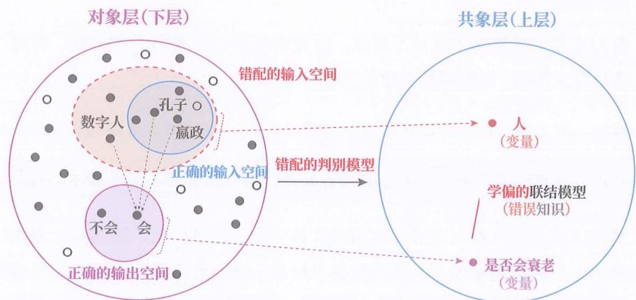

图20-3

如果用传统的三段论来描述，则是：

◎ “人会衰老”（大前提），正确。

◎ “数字人是人”（小前提），判断错误。

◎ “数字人会衰老”（结论），推理谬误。

即，大前提虽然正确，但小前提判别错误，导致结论出现推理谬误。

当然，我们可以通过修改“衰老”判别模型，让数字人的版本过时也被判别到“衰老”的概念下。这样一来，“数字人会衰老”的结论就正确了。但这样做后，原本的“人会衰老”和后来的“人会衰老”就不是同一个联结模型，不是同一个知识了，因为输入和输出空间已经变了。

由此也能反映出，为什么学习任何知识前都要先明确输入空间和输出空间。

女去女组

还有个例子可以说明判联错配所带来的糟糕后果。

假如，某个比赛的举办方规定“女性运动员参加女子组比赛”，我们假定该规定为一个联结模型。并且，举办方的本意是把传统生理性别的判别方式作为规定中“女性运动员”的判别模型。

结果来了一群人，按照自我性别认同的判别模型来执行规定，就会因为判别模型和联结模型不匹配，让比赛一团糟。

无产出工

有人可能觉得判联错配并不常见，觉得谁都能正确判别人和女性。然而，在网络科普文章中，判联错配时常发生。

例如，网上有一篇关于熵增定律的科普文章，文中对熵增定律的表述没啥问题：

在一个孤立系统中，如果没有外力做功，其总混乱度（熵）会不断增大。

然而，由于该作者自身对孤立系统、外力做功、混乱度、熵这几个概念，都未渐构成正确的判别模型，导致他在“科普”熵增定律时，将完全无关的现象判别到了熵增定律这一概念之下，进而得出了下面的两条结论：

在一个企业(套“孤立系统”)里, 如果没有末位淘汰等机制(套“外力做功”), 让无产出的员工(套“熵”)出局, 企业就会变得越来越官僚(套“高熵”)。

在一个人的生活（套“孤立系统”）里，如果不做工、旅行、读书、社交（套“外力做功”），让打翻的牛奶、腐旧的认知、回不去的人（套“熵”）翻篇，生活就会变得越来越混乱（套“高熵”）。

这两条结论是存在的，很多读者在日常生活中都有体会，经该作者这般解释，刚好就和“熵增定律”吻合了，于是很容易产生一种“顿悟”感。因此，很多读者都觉得该作者讲得太好了，认为自己学到了熵增定律。虽然有些读者感觉有问题，但又难以指出错在哪里，仅有少数读者识别出了这属于一种推理谬误。

其实，该作者介绍的熵增定律是真的，那两条结论也确实成立，但该作者将二者联系到一起的推理过程却是错的。那两条结论和熵增定律毫无关系。这种推理谬误就好比：

◎ 大前提：“人需要呼吸”（正确）。

◎ 小前提：“猫是人”（判断错误）。

◎ 结论：“猫需要呼吸”（事实上正确，但不是由人需要呼吸推出来的）。

尽管“猫需要呼吸”是对的，但却不是由“人需要呼吸”推出来的。推理中，“猫是人”这个小前提判断错了。

回到那篇科普文章，该作者其实出现了以下错误判别：

◎ 将企业和个人生活错判到了孤立系统。孤立系统的外延是{所有没有物质和能量交换的物理系统}，就算是断绝社交的个人生活，只要这个人还呼吸，就不是孤立系统。

◎ 将末位淘汰等机制和做工、旅行、读书、社交错判到了做功。这实际上是将生活中的“用功”和物理学中的“做功”这两个概念混淆了。

◎ 将无产出的员工和打翻的牛奶、腐旧的认知、回不去的人错判到了熵。这其实是将熵作为指代负面事物的时髦词了。实际上，熵增定律中的熵是描述物理系统的能量（粒子）分散程度的物理量。

于是，当该作者在这些错判的基础上套用熵增定律时，便产生了推理谬误。

可以用图20-4简明演示该作者出现的判联错配。图中的实线红圈代表正确的“孤立系统的熵”的外延，虚线红圈代表该作者靠错配的判别模型构造出来的错误的“孤立系统的熵”的外延，而“生活的糟糕度和企业的官僚度都必然趋于最大”便是该作者用判联错配的“熵增定律”得到的推理谬误。

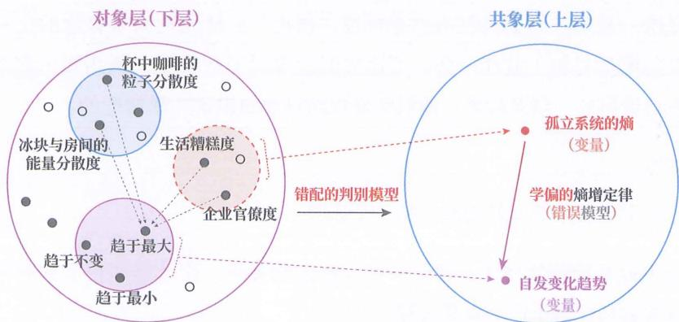

图20-4

有人可能会觉得：那两个结论也没错，虽然该作者的推理过程错了，但结果没啥危害吧？

其实，“企业变官僚”和“生活变糟”的原因纷繁复杂，“成绩下降”对学生来说是“生活变糟”。“生意失败”对商人来说是“生活变糟”。但“成绩下降”和“生意失败”并不是由同一个必然的物理规律所导致的。然而，当该作者将这两种现象作为熵增定律的具体表现来解释时，便会让人以为“企业变官僚”和“生活变糟”都是由同一个“宇宙真理”推动的必然结果，使得两个无关的日常现象被赋予了一个统一的“宿命论”属性。同时，这种推理谬误式的科普文章，还容易让读者接受作者脑中那种判联错配的“熵增定律”。

这就相当于一个学生在黑板上解一道数学题，最后的数字对了，但却是套用一个无关公式得出来的，其他没学过该公式的学生纷纷效仿这种解法。

## 乱猜概念

任何科学知识都是对象群和对象群之间的通用规律。

当知识创造者，如科学家，想创造一个知识时，都会预先设想所要研究的对象群，并用一个个概念来指代这些对象群，再寻找对象群之间的映射关系，经未见情况的验证后，便有了我们在课本上看到的熵增定律等科学知识（也就是联结模型）。但光有联结模型还不行，因为我们并不知道知识创造者在验证时所用的概念究竟指代哪些现象，必须用相匹配的判别模型才能明确。

不幸的是，很多人未能正确认识到判别模型的存在与重要。尤其是持有类固有观的人，认为“科学概念是自然世界先天固有的唯一真理”。既然这些科学概念是唯一真理，那么自己当然也可以“悟出”，从而把科学概念的定义（判别模型的渐构材料）放在一旁。可这实际上等同于自己凭空猜测知识创造者当初是怎么设想的。结果就是：他们所渐构的科学知识是判联错配的。

## 不接受

这也是不少学生学不好物理学的一个原因。

下面先说实际的物理学，再说学生误解的物理学，你就能明白为何前面讲的类固有观容易让学生产生判联错配。

## 一、实际的物理学

首先，早在学习物理学之前，任何人都会在日常生活中下意识地渐构关于物理现象的概念体系（后称“个人自建体系”）。具体来说，就是根据这个人的主体框架，对自己经历的物理现象，渐构一个个判别模型，并在判别模型所划分的概念的基础上，渐构一个个联结模型，形成一个体系，以此来解释和预测物理现象。

虽称为自建体系，但个人自建体系并不意味着错误，在预测很多简单的物理现象时，可以与物理学起到等同效果。这就像很多人没学过逻辑学，但用个人自建体系，也可以在简单逻辑问题上，与逻辑学起到等同效果。

虽称为科学体系，但物理学也不是物质世界天然固有的，可以说是一个特殊的自建体系——由无数人经过千百年迭代所得到的一个“群体自建体系”。因此物理学在概念划分上也具有自建体系所具有的人为规定的特点。例如，质点这一概念的划分，就能明显体现出人为规定的特点，毕竟我们在现实中无法观测到质点。

之所以还推广物理学，是因为个人自建体系虽能预测简单物理现象，但面对不常见的或复杂的物理现象时，常常失效，而物理学相比个人自建体系具有更强的可泛化性（普适性）和融洽性。

## 二、被误解的物理学

然而，不少学生认为物理学中的概念是世界固有且唯一的，相信任何人只要试图理解物理现象，最终都会“悟”出与物理学概念一样的概念。

于是，当他们学习一个物理概念时，总是倾向于把物理概念的定义放在一旁，自己去“悟”，也就自然会将自建体系中的判别模型套用在物理概念上。遇到那种和自建判别模型相匹配的物理概念倒还好，如时间、速度、距离等，可一旦遇到不按常规方式抽象而来的物理概念，他们就无法理解为什么如此人为规定的物理概念是正确的，而自己悟出来的概念却是错误的。例如，为什么做功被物理学规定为“作用力与作用力方向的位移的乘积”，凭什么与作用力垂直的位移不算做功。这种“不理解”本质上是一种不接受，不接受“客观的物理学”有这种人为规定的概念，也不接受别人能“悟出真理”，自己却不行。

结果便是: 这些学生虽接受物理学的概念名称, 却不接受物理学规定的判别模型, 而是采用自建概念体系的判别模型去套用物理学的概念名称和理解物理学定律, 导致自己渐构出了判联错配的 “物理学定律”。

这些学生不知道的是：自己悟出来的概念谈不上错误，而是错配，错配于物理学定律。自己悟出来的概念也能用于渐构可预测物理现象的模型，但需要在所悟概念的基础上渐构新的联结模型，无法套用基于物理学概念所渐构的联结模型，也就是物理学定律。学校传授的是既有的物理学，会以当前的物理学为准去判断继承的对错，而不是去判断“真理”的对错。

## 本书乱猜

对于学习本书的内容，也定会有人放着书里的定义不看，自己凭空去猜、去悟，抑或是用他们认定的“真理体系”判别模型来套本书里的概念外延，对书里的知识进行判联错配的渐构。

例如，“明确输入输出”在书中意为明确知识的输入空间和输出空间，或者说明确输入和输出中每个概念的外延，并厘清推测依据和推测目标。书里的“输入”和“输出”采用的是数学语言中的概念，但一定会有人把“输入”理解为听课、看书等向内充实自我的行为，把“输出”理解为讲课、写书等向外实践的行为，然后把本书的这个原则解释得面目全非。

## 知晓原因

当我们明确了下层丢失、上层丢失、下上错配是由什么产生的，就能知道该如何避免，以及出现此类误区后该针对哪个模型进行训练。

## 划分学习

其实，对任何知识的学习，都可以被拆解为判别模型和联结模型的渐构。本书中剩下的内容将围绕如何学习这两个模型而展开。但在此之前，我们需要正式定义学习，并划分学习的种类。

## 主干提要

1. 既没判别模型，也没联结模型，会导致上层丢失。

2. 仅有判别模型, 没有联结模型, 会无法解决现实问题, 判别模型也无所谓对错。

3. 仅学概念，不学概念间关系，会无法解决现实问题。

4. 仅有联结模型，没有判别模型，会导致下层丢失。

5. 背了公式却在解题时想不起来，不是公式没背牢，而是判别模型没建好。

6. 判联错配会导致下上错配。

7. 类固有观持有者更容易出现判联错配。

8. 理解判联搭配和知识坍缩的关系，可以对症下药。

## 概念提要

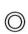

◎ 判联错配：判别模型和联结模型产生了错误的搭配。
