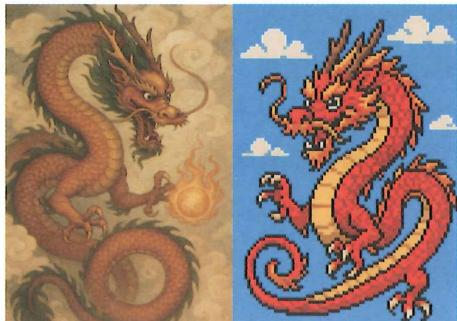

# 学习记忆

## 展开解释

在第 3 章，曾提到本书弃用了 “学习” 和 “记忆” 的日常用法。本章将详细解释弃用的原因，以及新定义的优势。

## 日常含义

那么，在日常语境中，人们所说的“学习”和“记忆”究竟指的是什么呢？

实际上，这两个词在日常语境中并没有唯一、固定的含义。不过，我们可以概括出它们最常见的含义：

◎ 学习：向他人获取有价值的内容。

◎ 记忆：保存已获取的内容。

由此可知，记忆是学习的一环，即：学习 = 先获取内容，再记忆内容。

然而，这样概括出的日常含义有以下不足。

## 缺乏目标

首先，日常含义中的“学习”概念是不合格的，因为作为一个行为，它没有反映出行为的目标。

一旦一个行为没有反映出目标，人们就容易把一些手段误认为是必不可少的步骤，形成束缚。

例如，曾有一段时间，人们不假思索地认为手机一定带有物理键盘，各大手机公司都在比拼耐用、小巧、触感优秀的物理键盘。但当苹果公司在2007年发布了一款彻底摒弃物理键盘的手机后，这些人才意识到，输入信息才是目标，而物理键盘只不过是实现这个目标的一个传统手段，并非必不可少，全触摸屏更能实现该目标。

学习也是同样的道理。学习方法因人而异、因知识而异，因此必须根据目标进行设计。但在日常含义中并未体现出学习作为一种行为究竟在达成什么目标，导致很多学生会把既有手段当成学习必不可少的一环——比如，记忆老师的讲解、记笔记等。

## 版本落后

其次，日常含义中的“学习”和“记忆”无法描述人工智能等新的科技现象。

学生从老师那里获知并记住一句诗，这算是“学习”。如果我们遵照前述的日常含义，那么电脑获得并保存同一句诗，也应该被视为“学习”。但人们并不会说电脑“学习”了这句诗。若追问原因，多数人往往答不上来，只会基于“电脑不是人”这类理由进行搪塞。例如，有人会说：“人有心智，而电脑只有软件和硬件”。

可是，同样依赖软 / 硬件，能击败人类的围棋 AI 却被人们称为 “学会” 了围棋，而过去那种装有围棋游戏的电脑，却不被认为 “学会” 了围棋。

究其原因，在过去，人们并不会接触到人工智能等技术，仅基于学校和社会现象对“记忆”和“学习”进行了划分。这在过去就够用了。但随着AI等技术越来越普及、深入人们的生活，这种旧划分就无法用于区分新的现象了。

这就好比，在过去，人们不会接触到先进的通信技术，于是人们根据“字母的数量”来理解“信息量”就够用了。但随着科技的发展，这种旧划分就无法用于描述复杂的通信现象了。最终是香农重新定义了信息量，从而开创了信息科学。

## 范围狭隘

其实，不仅是新的科技现象无法被区分，就连很多校园之外的现象，也因上面的日常含义被划分到了学习之外。

例如，一个孩子仅通过不断尝试，掌握了转笔能力。该行为基本不会被归为日常语境下的“学习”。因为他既没有从他人那里“获取内容”，也没有“记住”任何知识点。

再比如，一个学生刷题，但没有记住任何公式和文字表述，也没记住自己刷过的题，只是有了解出同类新题的能力。根据日常含义来看，这种刷题也不会被归为“学习”。

## 验证错配

更严重的问题是验证方式的不匹配。按照日常含义判断某情况是否属于“学会”，通常看能否“记住”，但这会带来两种错误判断：

◎ 一名通过刷题获得解题能力的学生，若回忆不起任何公式或文字表述，往往会误以为自己没有学会。

相反，一名记住了定义的学生，会误以为自己已经学会了。

## 遮蔽缺陷

最后，日常含义在本质上是一种基于社会视角的概念划分，如果用它来理解个体的认知过程，就容易产生概念的遮蔽。

比如，许多家长所说的“学习”，其实是以是否有利于考试这一社会标准来界定的——如果某款电子游戏被纳入高考科目，那么玩这款游戏就会被这些家长归为“学习”；反之，如果英语不再属于高考科目，那么练听力便不会被这些家长归为“学习”，而会被归为一种兴趣或娱乐。

然而，从个体认知的角度看，无论是玩游戏还是练听力，其内部的认知机制并无本质差异。可由于一些家长采用了社会视角的概念划分，便看不到这些共性。当他们思考“如何让孩子喜欢学习、远离游戏”时，便会因概念的遮蔽而永远无法得到答案——因为他们实质上是在追求一种矛盾的认知发生机制：让孩子喜爱仅有听讲和记忆、无法通过实践获得反馈的残缺学习模式（对课本的学习），却让孩子远离“学、思、习、行”完备的、更符合大脑工作机制的完整学习模式（对游戏的学习）。

## 如何消除

那本书采用的定义是如何消除这些问题的呢？

## 一般定义

在本书中，学习和记忆都被定义为塑造一种能力的行为，区别在于：

- 记忆是塑造重现已见情况的能力的行为。

◎ 学习是塑造泛化未见情况的能力的行为。

## AI 学习

基于该定义，我们可以清晰地区分电脑中的记忆与学习。

现象 A: 电脑获得并保存一句诗。

这是记忆，因为电脑只能重现这句诗，而不能生成新的诗句。

现象 B：将 100 首旧诗 / 歌词输入训练模型之后，电脑能够生成新的同类作品。这是学习，因为电脑塑造了一种能力，能泛化出未见的同类内容。

现象 C: 学生从老师那里听到并记住一句诗。

这是记忆，因为学生只能重现那句诗。

现象 D: 学生阅读上百首旧诗, 虽一首也没记住, 但由此获得了创作新诗的能力。这是学习, 因为学生获得了泛化新诗的能力。

现象 E: 电脑执行程序员编写的围棋程序。

学习发生在程序员身上,而非电脑上。程序员利用有限的经验抽象出规则(程序),泛化出经验之外的未见情况;电脑只是执行这些规则,没有泛化出程序之外的新情况。

现象 F：电脑执行机器学习算法，根据既有经验泛化出新的围棋下法。

在此现象中，电脑实现了学习。

日常学习

该定义还能用于更广的领域，参考下述现象。

现象 G：一个孩子通过不断尝试，掌握了骑自行车的技巧。

这是学习，因为骑车本质上是在与物质世界互动，其中的情况包括道路的坡度、转弯的角度、风阻的变化、身体的平衡等。这些情况是无限的，无法依靠重现已见情况来应对，必须利用学习泛化出应对未见情况的能力。实际上，孩子的每一次尝试，都在为大脑的自主系统提供新的经验素材，使其能够渐构出一个能够泛化到足以应对各种路况和身体状态的内隐模型。

现象 H: 一个学生在没有记住任何公式的情况下, 仅通过做题掌握了解出未见新题的能力, 但记不住自己刷过的题。

这是学习，因为学生能够解出未刷过的新题。至于能不能重现刷过的旧题，这并不是判断是否学习了的依据。记住公式也不是判断是否学习了的依据，因为通过学习渐构成的模型可以是内隐模型。

现象 I：一个学生不断刷题，但只能解出刷过的原题，不能解出没刷过的新题。这是记忆，因为他只能重现已见情况。

## 记住学会

事实上，在日常中，人们有时也会用到本书中的“学习”的一般定义。

例如，人们常说要“学会做人”和“学会包容”，如果把“学会做人”替换成“记住做人”，就会觉得哪里不对。

这是因为，当我们对别人说“要记住某行为”时，只是要求对方“下一次能想起去实施被嘱咐的行为”，而当我们对别人说“要学会某行为”时，则是在要求对方“以后每次，即使没有被嘱咐，也能懂得如何去实施这类行为”。可见，这里的“记忆（记住）”只要求实施“被嘱咐的行为”，而“学习（学会）”则要求实现“超越被嘱咐的行为”，包含着泛化未见的行为目的。

这也是为什么我们会说“婴儿学会了走路”，而不是“婴儿记住了走路”。

## 标准定义

由于塑造推测未见情况的能力就是在渐构可泛化模型，因此学习还有一个标准定义——渐构可泛化模型的行为。

学习的一般定义的优点是明确行为目标。学习的标准定义的优点在于明确手段，因为它指出了塑造能力的方式，也指出了学习的对象就是可泛化模型，但缺点是容易让人误把手段错当目的，忘记渐构可泛化模型的目标是塑造推测未见情况的能力。

学习的一般定义和标准定义是等价的，大家可以根据情况有选择地使用。

## 二者独立

在本书的定义下，记忆和学习是两个彼此独立的行为——能够重现已见情况，并不代表能泛化未见情况；而能够泛化未见情况，也并不代表能重现已见情况。

因此，一个人可以只记忆而不学习，也可以只学习而不记忆，当然也可能二者同时发生。原因在于：学习时，经验只是大脑渐构模型的原料，一旦模型建成，是否保留原始经验并不影响模型的使用。

## 记不住题

这也解释了为什么许多学生刷了大量题目后，回忆不起刷过的具体题目，但能解出同类新题。

## 病人 HM

基于这种彼此独立的定义，我们讨论一下两个著名的神经科学案例。

第一个案例的主人公是神经科学史上知名的病人——H.M.。

H.M. 在童年时因自行车事故患有严重癫痫，到了 27 岁时频繁昏厥，最终接受外科医生斯科维尔的手术，切除了大部分海马体。这个手术成功控制了他的癫痫，却带来一个严重的副作用：再也无法形成新的长时记忆。

尽管如此，他仍能与人正常对话，智力并未受损，因为短时记忆仍然存在，足以支持大脑对信息进行短暂加工。他可以靠不断复述将一个数字记忆十分钟，但几分钟不复述后，他甚至连“有人告诉过他一个数字”这件事都不记得了。仿佛他的时间被永远停在了手术当天，此后的每一天都从那一刻重新开始。

然而，令人惊讶的是：他仍能学会新技能。实验人员让他透过镜子来描绘五角星。一开始他和普通人一样笨拙，但经过反复练习，他的表现越来越好——尽管他完全不记得自己曾经练习过。

此外，他无法回忆起常来探访他的研究人员的姓名。但若让他从多个名字中选择哪个是研究人员的姓名，他又能选出正确的那个，并能判断对方是“熟面孔”，只是无法回忆相遇的经历。

换句话说，H.M. 可以推测，却不能回忆，就像普通人能认出父亲的脸，但闭上

眼后却无法回忆出脸的细节一样。

若按前述的日常含义，会难以理解 H.M. 的表现，因为在日常含义中，记忆是学习的前提，二者不可独立。

按照本书的定义，就可以十分清晰地理解：H.M.丧失了长时记忆能力，但学习能力完好，他的短时记忆足以让大脑利用经验来渐构出可泛化模型。

## 吉姆·皮克

与 H.M. 在某种程度上相反的，是吉姆·皮克（Kim Peek）的案例。

吉姆·皮克因惊人的记忆力被称为“人脑电脑”（Kimputer）：他几乎过目不忘，能逐字背诵超过9000本书。《雨人》就是以他为原型改编的电影。

但这样一个记忆天才的日常生活却极度困难：他不会自己系扣子，有严重的运动协调障碍，智商测试约80分，难以理解隐喻，抽象能力薄弱。

若按日常含义，记忆能力强意味着学习能力强，因此吉姆·皮克的表现难以让人理解。

但用本书的定义来解释就十分自然：吉姆·皮克的记忆能力完好，但学习能力受损。同时，他的大脑还出现了异常，无法判断什么该记、什么不该记，几乎所有信息都会被无选择地进行长时记忆。

## 成果不同

此外，在本书的定义下，学习和记忆的成果也被明确区分。即使有时二者都用到相同的经验，但区别在于：

◎ 记忆的成果就是信息的复制。

◎ 学习的成果则是用经验或语言材料渐构成的可泛化模型。渐构完成后，模型会被保存，但经验和语言材料不必被保存。

## 绘画雕刻

可以拿一张故宫画（他人的间接经验）来做类比：记忆就好比临摹，得到的成果是故宫画的临摹作品；而学习就好比雕刻，得到的成果是故宫模型，此时故宫画只不过是雕刻模型时所用的一个参照物，而且是一个片面的参照物。需要参照许多张不同角度的故宫画，才能雕刻出足够立体的故宫模型。参照过的故宫画，并不会被保存在所雕刻的故宫模型中。

## 学习程度

根据本书的定义，更容易理解为什么记忆只有“记住了”和“没记住”两种状态，而学习却可分为“入门”“熟练”“精通”“绝妙”“出神入化”等阶段，因为这些阶段衡量的正是所渐构模型的可泛化程度。

◎ “入门”意味着模型可以简单泛化普遍情况。

◎ “精通”意味着模型能够泛化出大量未见的新情况。

## 验证标准

采用日常含义的人们，会用“是否记住”来验证自己“是否学会”。这种验证方式会导致严重的错判：

◎ 明明已经学会的人，以为自己没学会。

◎ 明明没学会的人，却以为自己学会了。

本书的定义清晰地区分了两种行为各自的验证标准：

◎ 验证是否记住：看能否重现已见情况。

◎ 验证是否学会：看能否泛化未见情况。

以此为基础，一个人的学习状况就能被准确判断，而不会被记忆的表现所误导。

## 以为没会

例如，一个学生在考前回忆不起自己学过的内容。如果按照“学习”的日常含义，他会误以为自己没学会，因此焦虑不安。大量学生就是这样用“能否回忆”来判断学习状态的，导致考前十分紧张和不安。

为了消除这种不安，有些学生甚至会强迫自己把所有内容都背下来。但这种为了让自己感觉安全而去背诵的行为，其本质是在错用记忆来取代学习，从而降低学习效率。

如果采用本书的定义，学生应该通过解几道新题来判断自己的学习状态。

## 高中白读

同样地，不少中学生毕业后，回想不起来高中三年学了什么。按照“学习”的日常含义，他们就会以为初、高中白读了。但实际上，这种方式所验证的是他们对学习材料的记忆，而不是运用学习材料所渐构出的可泛化模型。

## 以为会了

相对地，一些学生上完一节课后，能完整复述老师讲的内容，便误以为自己“学会了”，因而不再练习，等到考试时才发现无法解决新问题。

若按本书的定义，他们就会看自己能否处理未见情况，而不是看自己能否重复原句。

## 职考标准

事实上，各类职业考核也都采用本书的一般学习定义——能否推测未见情况。

例如：

◎ 实习医生的考核，是看能否诊断未见病症。

◎ 实习警察的考核，是看能否处理未见案件。

## 费曼学习

非常有名的“费曼学习法”，核心就是“学到能给人讲明白为止”，为什么会成为一个很有效的方法？

其实就是因为它隐含地改变了人们对学习的验证方式。按照日常含义，人们会用自己能否回忆书本内容来判断自己是否“学会了”。但若想给别人讲清楚，就不能简单重复书本原句，还要讲解新情况、举新例子，变相地迫使当事人用未见情况来验证自己的学习。

## 机械记忆

可见，学习的验证方式深刻影响着学习效果。

一旦一个人把学习的验证方式搞错，就容易掉入机械记忆的误区。

这里的“机械记忆”并不是指呆板的、机械式的记忆，而是指一个人把本该用

于学习的语言材料用来记忆了，也就是此前提到的“记言代学”。

由于机械记忆会让学习材料失去其原本对“学习”的意义，虽然对其“学习”了，却容易无法达成学习效果，因此也叫“无意义学习”。与此相对的概念是“有意义学习”，指的是正确运用语言材料来达成学习目标（塑造推测未见情况的能力）的行为。

注意，如果学生的目标就是记忆学习材料，则其行为不属于机械记忆。

## 三个类比

机械记忆就好比：

◎ 本该安装软件，却只是把软件安装包复制了一遍。

◎ 本该参照照片来雕刻模型，却把照片临摹了一份。

◎ 本该持电影票去看电影，却把它折成纸飞机了。

## 机械危害

机械记忆的危害就在于：这种“努力了，却不见效”的经历，容易让学生把自己成绩的不佳归因于“天赋上的不足”，相信“不论自己怎么努力，都不会改变结果”，也就是归因理论中所说的“习得性无助”。一旦学生形成习得性无助，就会认为“成绩已经被天赋所决定，即使尝试也没有意义”，从而产生厌学心理。

即使没有形成习得性无助，养成机械记忆习惯的学生，也会在校园和日常生活中，乃至以后的工作中，对各种电脑软件、乐器、运动，以及略微复杂知识的学习，感到非常吃力。

## 机械环境

当今的一些学生形成了机械记忆，其原因在于：家长和老师虽然不断叮嘱学生要“好好学习”，但其实并没有教过学生什么是学习，学生只能根据平时的经历形成自己的认识和习惯。不巧的是，在低年级的课本中，有很多特殊类型的知识。这种类型的知识近似于经验，也可以通过记忆来掌握。加上低年级的考试形式也较为简单，即便学生采用机械记忆也可以取得好成绩。这使得学生在低年级时容易产生错误的学习认识——把学习和记忆画等号。

## 三傻电影

电影《三傻大闹宝莱坞》中就批判过机械记忆式教学。

老师问：“机器的定义是什么？”

男主角以生活语言回答“机器就是能减少人类劳动的东西”，并举了风扇、电话、电脑、拉链等例子。

按本书的标准，他已经掌握了“机器”这一概念，因为他能判断未见现象是否属于机器。

然而老师却不满意，另一名学生背出教科书上的原句，获得了表扬。

男主角质疑：“我明明表达了同样的意思，更简单。”老师却说：“想通过考试，就背教科书。”

能背出教科书上的原句的学生并不一定真的学会了，因为他未必能判断未见现象是否属于机器。

## 两类学生

下面，浆果用书中的定义去解释校园中的两类误区，让你体会一下——合理的定义可以消除对概念的遮蔽，让现象更加清晰。

在学校，我们经常能看到两类奇怪的学生。他们的外在表现分别是很努力成绩却不好和不努力成绩却不差。按常识，“努力应该带来好成绩”“不努力自然成绩差”。因此，人们常将这两类学生的差异归因于“天赋”，分别贴上“勤奋但不聪明”和“聪明但不勤奋”的标签。

但如果我们弃用日常含义，改用新定义，就能察觉到这种矛盾更可能源于学生认识和学生习惯，而非天赋。

为便于指代，本书接下来会将这两类学生分别称为 E（Exhausted）类学生和 T（Talented）类学生。下面将从经历、认识、习惯和效率四个层面，来解释为何这两类学生会出现这种奇怪的表象。

## E 的认识

E类学生往往是从小很听话的“乖学生”。在低年级时，他们发现只要努力背书，就能获得好成绩和称赞，于是逐渐形成了这样的认识：

◎ “学习就是背书”。

◎ “好好学习就是好好背书”。

◎ “成绩不好就是背得不熟”。

到了高年级，他们仍试图通过努力背书来换取好成绩，但却发现成绩越来越难维持以前水准甚至下滑。根据“成绩不好就是背得不熟”，他们便加倍努力，结果仍达不到预期。

他们无法理解：为什么以前常拿满分的自己，如今却怎么努力都不灵？为什么那些“不努力”的同学反而考得更好？

久而久之，这些问题就被他们归因到“自己天赋不足”。

如果老师在他们考得差时流露出同情，则更会强化这种归因。因为学生会从中读出一种信号：“我的成绩是无法靠努力改善的。”

他们会更努力地记忆，试图改变老师对自己的“勤奋但不聪明”印象，但由于方法错误，常以失败告终，最终导致他们认定了“自己天赋不足”。

## E 的习惯

E 类学生需要有非常明确的 “知识点” 才能学习。如果教材只有例子却没有总结，他们就会因为不知道 “该记什么” 而无所适从。

如果老师上课没有画重点，一些 E 类学生甚至会把老师说的整段话原封不动地记下。于是在课堂上，他们几乎没有时间思考，大量时间都耗在记笔记上。

又因为他们总是用 “能否回忆起知识” 来检验 “是否学会了”，于是就算能流利地背出公式，在考试中也常解不出题。

这一连串机械记忆造成的低效，正是人们认为他们“勤奋却不聪明”的原因。

## T 的认识

T类学生往往是那些从小就调皮的“坏学生”。在低年级时，他们所有的精力都放在了玩耍上，常被老师和家长批评贪玩，所以他们也知道应该看书，可就是提不起兴趣，总忍不住想玩。

然而，他们意外发现：即便没看书，成绩却还不错，尤其是数学常考高分。老师也会说他们“很聪明，就是贪玩”。

这些评价对他们而言是一种“表扬”，让他们产生优越感，渴望获得更多“聪明”标签。

但获取这种标签的方法不是背书，而是解出其他人解不出的难题。于是，他们可能上课走神、抄作业，不记笔记，但一遇到“难题”就会全力以赴去解答，以此证明自己聪明。

这种“歪打正着”的行为，使他们在不断解题的过程中，无意间渐构了可泛化模型。

但在认识上，他们与 E 类学生一样，也认为 “学习就是背书”。因此，他们将自己花时间思考、归纳、解题的行为都排除在 “学习” 之外。这也解释了为什么当他们被问及 “你每天学多久” 时，总是回答：

◎ “我不学习”。

◎ “就上课听听”。

有时他们甚至会刻意掩饰自己的努力，因为他们追求的是“聪明”这一评价，而努力这一行为反而会削弱这种形象。

## T 的习惯

T 类学生的学习并不依赖明确的定义，更多地是通过做题来渐构知识。

这种习惯使得他们不喜欢看定义，往往也看不懂。但他们很擅长归纳，可以从多道题中归纳出自己的理解。而这种理解和教科书上的定义往往也差不多。所以当老师让T类学生背教科书定义时，他们背不出，但考试时，他们却又能解出题来。

很多 T 类学生都讨厌记忆知识，尤其讨厌记忆没有规律的内容，因为这种内容对他们来说难以归纳且会很快遗忘。他们还会对一些人为规定的知识，比如英

语的不规则动词，产生抵触情绪。

由于 T 类学生没有机械记忆的误区，花费在学习上的所有时间都在进行有意义学习，他们的效率会非常高，所以才给人们一种 “聪明却不勤奋” 的印象。

## T转E

然而，由于T类学生同样相信“学习就是背书”，并认为自己的成绩源自“天赋”，而非“学习行为”，所以当他们想要成为“既聪明又勤奋”的学生时，就很容易抛弃自己原有的有意义学习习惯，转向记忆与背诵，陷入了与E类学生一样的无意义学习误区中。这样努力的结果就是：

◎ 文科成绩会提升。

◎ 理科成绩不变，甚至有所下降。

这让他们深感困惑,觉得“自己努力反而变差,不如不努力”,于是对自己的“聪明”产生怀疑。为了缓解这种自我怀疑,他们会给自己刻意制造障碍,躲回了原来的贪玩状态,活在“自己只是没拿出真本事,倘若全力以赴,成功根本不在话下”的想象中,因为没学习而考得不好并不能证明自己“不聪明”。

然而，当他们离开校园，不得不全力以赴的时候，“自己拿出真本事就能成功”的幻象便会被打破，很容易让T类学生也形成习得性无助。

## 优劣概括

从对这两类误区的解释中，你可以体会到，在认知视角的定义下，我们可以分析那些令人难以理解的学习现象，矫正学习误区。

最后,我们做一个总结。书中所采用的定义,相较日常含义来说,有以下几点优势:

◎ 行为目标明确。

◎ 实现手段明确。

◎ 验证方式明确。

◎ 行为成果明确。

◎ 适用现象广泛。

◎ 消除概念遮蔽。

当然，劣势就是人们会不太习惯。如果有人在阅读书中的内容时，产生“学习难道不需要记忆”的疑惑，就意味着他还是在下意识地采用日常含义，把“记忆”一词解读成保存了。

## 注意搭配

随后，我们将在上述定义的基础上，搭建起一套清晰而完整的学习理论。但要注意，应用本书的理论时，不能套用日常用法来理解，否则就会像用日常含义中的“功”去套用物理学中的“功”那样，产生判联错配和推理谬误。

## 细分类型

接下来，我们要在这种定义之上划分出更细致的学习分类，讨论不同子类的学习方法。

## 主干提要

日常含义中的“学习”有含义不固定、行为目标缺失、版本落后、范围狭隘、验证错配、社会属性遮蔽认知属性等缺陷，因此不适合用于搭建学习理论。

1. 本书根据认知塑造方式的不同，明确划分了学习和记忆。

2. 本书定义中，学习和记忆是两个独立的行为——能重现已见，并不代表能泛化未见；能泛化未见，不代表能重现已见。

3. 本书定义中，学习和记忆的成果不同——记忆的成果是信息的复制；学习的成果是可泛化模型。

4. 本书定义中，学习和记忆的掌握程度不同——记忆的掌握分为记住和没记住，学习的掌握根据所渐构模型的可泛化能力分为“入门”“熟练”“精通”“绝妙”“出神入化”等状态。

5. 本书定义中，学习和记忆的验证方式不同——记忆的验证看能否重现已见情况，学习的验证看能否泛化未见情况。

6. 机械记忆会导致无意义学习，甚至习得性无助。

7. 低年级的考试方式容易让学生对学习产生机械记忆的应对习惯。

8. “勤奋但不聪明”和“聪明但不勤奋”两类学生，往往是因错误的学习认识和习惯所致。

## 9. 要结合本书对学习和记忆的定义来应用后续结论，不能套用日常含义。

概念提要

◎ 学习（一般定义）：塑造泛化未见情况的能力的行为。

◎ 学习（标准定义）：渐构可泛化模型的行为。

◎ 记忆：塑造重现已见情况的能力的行为。

◎ 学习的验证：能否泛化未见情况。

◎ 记忆的验证：能否重现已见情况。

◎ 机械记忆：把本该用于学习的语言材料仅用来记忆了。

◎ 习得性无助：长期努力却不见效的经历，使当事人渐构出“即使努力，也不会改变结果”的模型，进而做出不再尝试的决策。

◎ E（Exhausted）类学生：看似“勤奋但不聪明”但实际因错误的学习认识和习惯导致成绩不佳的学生。

◎ T（Talented）类学生：看似“聪明但不勤奋”但实际因不自知的高效学习习惯导致成绩不差的学生。

## 四维框架

## 四维框架

本书对学习的标准定义是渐构可泛化模型的行为，因此我们对学习的划分也将围绕渐构模型的不同方式来展开。

需要明确的是: 任何分类都只能描述学习的一个侧面, 所提供的指导既有独特性, 又有片面性。因此, 为更全面地分析和描述学习的现象和规律, 我们将引入四个视角: 创继维度、下上维度、主体维度与复用维度。

创继维度

创继维度关注模型的渐构是创造还是继承，可分为：

◎ 创验学习：创造并验证可泛化模型。

◎ 继承学习：重建他人的可泛化模型。

创验学习是从无到有的探索，需要学习者自己搜集经验，挖掘因果变量，并设法验证。

继承学习虽省去了创验过程，但却涉及理解他人的语义、材料组织等环节。

区分和掌握这两种学习方式，有助于我们选择各自的对应流程。

下上维度

下上维度关注模型的渐构是自下而上还是自上而下的，可分为：

◎ 自下学习：自下层出发、向上层连接的渐构。

◎ 自上学习：自上层出发、向下层连接的渐构。

自下学习和自上学习都有其特殊的学习材料、学习方式和优势 / 劣势。

区分和掌握这两种学习方式，有助于我们正确运用手上的既有材料和分析日后所需的新材料。

## 主体维度

主体维度关注渐构过程的实施者是谁，以及该实施者具有什么特性，可分为：

☐ 机器学习：由机器作为实施者的渐构。

◎ 人脑学习：由人脑作为实施者的渐构。

人脑学习又可进一步细分为内隐学习和外显学习。

◎ 内隐学习：由人脑自主系统作为实施者的渐构。

◎ 外显学习：由人脑意识系统作为实施者的渐构。

由于不同实施者具有不同的结构和特性，在进行学习时必须采用不同的方式。

例如，虽然机器学习和人脑学习都是在渐构可泛化模型，但机器学习能运用梯度下降法，甚至能将一个模型的参数直接复制到另一个模型上继续训练，而这些操作并不能运用在人脑学习上。

又如，人脑的意识系统可用语言将中间处理过程显示于外部，使得外显学习可以进行有意识的拆分和重组，但却因工作记忆容量有限，使得外显学习无法处理因素量庞大和反应速度要求高的学习。相对地，人脑的自主系统虽能处理因素量庞大和需要快速反应的学习，但却因不被意识感知而无法直接通过语言来渐构模型，需要设计专门的训练方案。

区分和掌握不同主体的学习，有助于我们顺应主体的机制来学习。

## 机学 - 人学

有一个误区需要注意，不要误以为涉及变量、映射、输入 / 输出等概念的就是机器学习。

首先要明白一点：人类从未在某个星球上发现一群会学习的机器，然后归纳总结它们的学习方式，将其命名为“机器学习”。事实恰恰相反——所谓“机器学习”，本质上是将人脑学习要完成的任务交由机器去执行。因此，在学习的行为目标上，机器学习和人脑学习完全一致，都是在渐构可泛化模型。正因为目标相同，对于机器学习和人脑学习来说，都可以用变量、映射、输入 / 输出等数学语言来描述其任务目标。

不过，由于在求学期间大家都没见过用数学语言来描述学习行为，第一次接触这种描述是在机器学习领域，于是很容易误以为这些概念是机器学习独有的。但实际上这些概念只是数学语言的描述，是所有注重量化的学科都会运用的语言。例如，物理学也用函数和变量来描述运动。此外，这些数学语言所描述的东西也不是机器学习独有的，是在哲学、逻辑学、编程语言、语言学中早就存在的概念。

机器学习和人脑学习的不同之处在于技术实现。机器学习依靠的是人们编写的算法，人脑学习依靠的是先天演化出来的大脑机制。在技术实现上，二者也无法参照彼此。例如，怎么让人脑像机器那样利用梯度下降法修改模型参数？哪怕做开颅手术都办不到。

所以，要分清楚机器学习和人脑学习的任务目标和技术实现。

在任务目标上，二者完全一致。机器学习本身就是在完成人脑学习所要完成的任务。在任务目标的描述上，本书提供了两套语言，一套是概念的外延、内涵、规律等这类自然语言描述，一套是变量、空间、模型等这类数学语言描述。

在技术实现上，二者完全不一致。本书也并不涉及任何机器学习的技术实现，因为这些内容需要以微积分、线性代数、概率统计和编程等知识为基础。想要在这方面继续深入的读者，请自己寻找学习材料。

## AI早教

这里顺便说一下 AI 幼龄早教的问题。

机器学习的技术实现对于幼龄孩子而言严重超纲，孩子最后只能不知其所以然地执行固定流程。此类早教的形式大于实质。

机器学习的任务目标不依赖高等数学和编程，因此幼龄孩子可以掌握。但这部分内容不需要专门从机器学习领域入手来学，从逻辑学、语言学领域开始学习，受益更多。

## 复用维度

接着讨论四维框架中的最后一维——复用维度。

复用维度关注模型的渐构是否以及如何复用既有模型，可分为：

◎ 零基学习：不复用既有模型的渐构。

◎ 迁移学习：复用既有模型的渐构。

迁移学习又可进一步细分为正迁移学习和负迁移学习。

正迁移学习：通过改造和重组既有模型从而导致进度变快、难度降低、成本更低的渐构。

☐ 负迁移学习：复用既有模型（多为无意识行为）从而导致进度变慢、难度增加、结果错误的渐构。

正迁移学习的核心在于识别可复用结构，并通过合理地拆分、重组、改造既有模型来加速目标模型的渐构。

负迁移学习的挑战在于识别旧知识何时成为阻碍、如何屏蔽和替换。

区分和掌握这些学习类型，有助于我们加快学习速度和降低学习成本。

## 四维充分

尽管还可以从更多视角对学习加以划分，但这四个维度相对独立（尽管没有完全独立），通过组合即可构成一个十分全面的分析框架。其他重要的分类视角，其实都能在此框架中找到对应的位置。

## 语言划分

例如，我们可以根据是否使用语言材料将学习分为基于语言材料的学习与基于非语言材料的学习。但基于非语言材料的学习所指涉的各种情境，基本上已由主体维度中的内隐学习，以及下上维度中的自下学习所涵盖。

## 重点讲解

若将四个维度充分展开讲解，内容量会非常庞大，极易“劝退”读者。因此，为了用尽量少的篇幅呈现最实用的学习方法，浆果在本书中将重点聚焦于继承学习下的下上维度。

## 主干提要

1. 本书以四个维度对学习进行了细致的类别划分。

2. 创继维度关注模型的渐构是创造还是继承。

3. 下上维度关注模型的渐构是自下而上还是自上而下。

4. 主体维度关注渐构模型的实施者是谁。

5. 人脑学习和机器学习在任务目标上一致，在技术实现上不一致。

6. 复用维度关注模型的渐构是否以及如何复用既有模型。

7. 通过四个维度的组合，可构成一个较为全面的分析框架。

8. 因体量限制，本书的重点放在继承学习下的下上维度。

## 概念提要

◎ 四维框架：划分学习类型的四个维度——创继、下上、主体、复用。

◎ 创验学习：创造并验证可泛化模型。

◎ 继承学习：重建他人的可泛化模型。

◎ 自下学习：自下层出发、向上层连接的渐构。

◎ 自上学习：自上层出发、向下层连接的渐构。

☐ 机器学习：由机器作为实施者的渐构。

◎ 人脑学习：由人脑作为实施者的渐构。

◎ 内隐学习：由人脑自主系统作为实施者的渐构。

◎ 外显学习：由人脑意识系统作为实施者的渐构。

◎ 零基学习：不复用既有模型的渐构。

◎ 迁移学习：复用既有模型的渐构。

◎ 正迁移学习：改造和重组既有模型从而加快速度、降低难度和成本的渐构。

☐ 负迁移学习：错误地复用既有模型从而使速度变慢、难度增加、结果错误的渐构。

## 创继视角

还有学习

这里先简单介绍一下创继视角。

可能你曾对下面的问题感到过疑惑：

◎ 如果世上只剩一个人，那还存在学习吗？

◎ 为什么很多刚入学的研究生会误以为读研就是上课？

当我们引入创继视角后，就能清晰地解释这两个问题。

## 枯草

现在，想象你回到了8岁的童年，在乡间玩耍，闲来无事，随手拽断一根枯草取乐。

当你把3根枯草拧在一起时，发现拽断它们变得困难了。

拧成5根时，更加吃力了。

于是你下意识地进行了抽象和归纳，渐构了一个联结模型，可以根据干植物是否拧在一起和根数推测拽断的费劲程度。其规律是“拧在一起的干植物根数越多，拽断越费劲”。

为了验证这个模型, 你将另一品种的7根干草拧在了一起, 果然拽起来更费劲了。

然后，你把这个模型分享给了小伙伴，隔天他就应用该模型做了一个草绳秋千。

在这个故事中，你和小伙伴都进行了学习，区别是：在你的学习中，你创造并验证了一个可泛化模型，而在小伙伴的学习中，他将你的模型在自己的脑中进行了重建。

## 创验学习

在这里，我们将创造并验证可泛化模型的行为称为“创验学习”。

## 继承学习

而重建他人的可泛化模型的行为则被我们称为“继承学习”。

## 创验流程

创验学习包含以下几步：

1. 搜集数据：搜集众多原始数据，可以是直接数据，也可以是间接数据。

2. 抽象类化：从数据中编码感兴趣的对象，再进一步抽象类化成概念。

3. 建构模型：提出关于从输入（推测依据）到输出（推测目标）关系的猜想。

4. 验证模型：用未见情况来验证模型的泛化能力。

如果泛化失败，则返回 1 ~ 3 步中的某一步，再来一遍，如此往复。整个流程是一个反复迭代的渐构过程。

## 枯草创验

以上面的枯草故事为例。

1. 搜集数据：你在三次拽枯草的过程中，积累了直接数据。在此称其为“数据”，意味着你尚未决定要聚焦于哪个信息，可能是草的颜色，也可能是草的高度；称其为“直接”，则意味着你的数据是从现实交互中直接获得的，而非从他人的语言中获得的。

2. 抽象类化：当你聚焦于 1 根、3 根、5 根时，意味着你明确了对象。随后你又把这些对象类化成了根数这个概念，用于代表 1 根、3 根、5 根，以及未见的具体根数。干植物是否拧在一起和拽断的费劲程度也是这样得到的。

3. 建构模型：你将干植物是否拧在一起和根数作为输入（推测依据），把拽断的费劲程度作为输出（推测目标），猜测二者的关系为“拧在一起，根数越多，越费劲”。这便提出了输入到输出关系的猜想。

4. 验证模型：你用所建模型对未见情况（7根）的推测结果去比对实际结果，便是在验证模型。

在这个故事中没涉及更新模型，如果泛化失败，你就需要跳回第 $1 \sim 3$ 步中的某

一步，再来一遍。

## 继承流程

继承学习的流程也很相似，但每一步都有差异：

1. 获取材料：获取学习材料（如语言讲解、文字记录、动作演示等）。

2. 理解语义：理解学习材料的含义（如划分句子成分、确定多义词在句中的含义等）。

3. 继承判模：根据学习材料重建判别模型，以明确每个概念所代表的对象群，也就是外延。

4. 继承联模：根据学习材料重建联结模型，以明确从输入空间到输出空间的映射关系。

5. 比对模型：根据学习材料判断已建模型和要继承的模型是否一致。

如果比对失败，则返回第 1 ~ 4 步中的某一步，再来一遍，如此往复。这依然是一个“渐构”过程。注意，继承判别模型和联结模型的两步并没有先后顺序。

继承而来的模型，最后还是要用于推测未见。不过，若不先判断自己是否继承了正确的模型，当泛化失败时，就无法判断究竟是自己理解错了，还是学习材料表达错了，或是继承的模型本身的泛化能力有限。这就是要先比对模型的原因。

## 枯草继承

还是以枯草故事为例。

1. 获取材料：你对小伙伴的口头讲解，就是他获取的学习材料。

2. 理解语义：理解口头讲解的含义。

3. 继承判模：他根据你的讲解，渐构干植物是否拧在一起、根数和拽断的费劲程度这三个概念的判别模型，以确定每个概念所代表的现象群。这是在继承概念。

4. 继承联模：他根据你的讲解，渐构从干植物是否拧在一起和根数推测拽断的费劲程度的映射。这是在继承联结模型。

5. 比对模型：他拿起一片枯树叶，问你这是不是所说的“干植物”，你说不是。这便是在比对模型。

比对失败后，由于问题出在你的用词并没有准确表达你的意思，你又补充道：“得要细长的干植物。”这便跳回到了获取材料这步，调整他对干植物所渐构的判别模型。

## 并非被动

继承学习不等同于被动学习，甚至很少被动发生，因为本书中定义的继承学习是一个需要加工和理解学习材料的渐构过程。一个人可以被动地记住学习材料，但很少会在被动状态下用学习材料渐构出可泛化模型。

## 无须教师

继承学习不等同于接受学习，因为接受学习是在有老师教授的学习中所划分的类别，外延更小，而继承学习并不需要有老师参与，可以一个人自行主导。

## 无须完美

至于创验学习，也并非只有创造出完美的模型才算。因为在本书中，学习的一般定义是以目的来判别的，只要目的是塑造可泛化能力，就被归为学习。

## 枯草失败

假如，在枯草故事中你未能渐构成可泛化模型，这依然被归为创验学习。此外，当前的材料力学对这个问题已有更系统的概念体系，还适用于铁丝等其他材料，但这些不影响你在枯草故事中的行为被归为创验学习。

## 一人学习

现在，我们可以回答前面提出的第一个问题了——如果世上只剩一个人，那还存在学习吗？

答案是“存在”。因为一个人依然能跟大自然进行交互、渐构可泛化模型。

之所以有人会犹豫，是因为他们在学校的经历使其仅把继承学习归为学习，于是当世上只剩一个人时，继承他人知识的行为就不存在了。

## 并非科研

注意，创验学习不等同于科研。在本书的概念体系中，科研是创验学习的一个子类。

因为创验学习的判别依据在于所建模型是否是继承而来的，并不要求非要建从未有过的模型，而科研有这个要求。

## 见人下菜

例如，一个5岁小孩在与父母的交互中渐构了一个模型——只要自己闹，父母便妥协。我们会称“这个孩子学会了拿捏父母”。该行为就是创验学习，但不是科研。

## 更加普遍

同时，也不要觉得“创验学习离普通人很遥远，只有继承学习才贴近生活”。

如果从知识的数量来看（包括内隐知识），一个人一生中所渐构的大多数知识均来自创验学习。因为个体并不会时刻获取他人的学习材料，但却会时刻与环境交互，只要与环境产生交互，大脑就会下意识地进行创验学习。

## 儿童创验

例如，儿童从出生开始便不断地进行创验学习，增加对世界的认识。即使一个人从没上过学，也会独自渐构出“东西扔到空中会落下”“开水溅到身上会被烫伤”等模型。

等到了上学年龄,开始继承他人的模型时,很多孩子会反驳老师,比如,不同意“力是改变物体运动状态的原因”。这恰恰证明了,在进行继承学习之前,他们早就自己进行了创验学习。

## 娱乐

其实，玩游戏、看电影等行为，本质上也是创验学习。以看电影为例：

◎ 看新电影就是在搜集新数据。大脑为了鼓励人们搜集新数据，会分泌多巴胺。这也是为何人们能刷一整天的短视频。

◎ 不同观众对相同电影有不同理解，这是因为人们聚焦的对象不同、抽象方式不同，最终渐构出的概念及其关系也不同。

◎ 当人们看完电影后，总会想得出一个个人生道理，大脑也会分泌多巴胺来奖励这个建模行为。这也是为何“学到知识的感觉”也可以成为商品。

◎ 当某人说 “看不懂” 时，不是指他看不懂电影里的事件，而是指他没能将电影事件抽象成合适的概念及其关系。

也就是说，在现代娱乐产业中，有相当一部分消费，在本质上是人们在为创验学习付费。之所以大众普遍没意识到这一点，是因为大众所使用的“研究”“学习”“娱乐”等概念，都是基于社会视角的划分。我们可以通过梳理这种划分的形成来揭示这一点。

在语言尚未形成的时期，人类的远古祖先高度依赖创验学习，不得不亲自经历搜集数据、建构模型、验证模型的全过程。为了增加存活概率，大脑在演化中发展出了对学习进行奖励的机制，通过分泌多巴胺增强个体与环境交互的动机，好奇心和探索欲也因此而诞生。

随着人类社会的发展，逐渐出现了知识生产与知识应用的分工：一部分人专注于创造和验证新知识，被称为“研究员”或“科学家”；另一部分人专注于应用已有知识进行生产，被称为“工程师”。而在形成这种分工之前，每个个体都必须经历一段漫长的知识继承过程。

然而，社会分工并不会抹去大脑在数亿年演化中形成的机制。每个个体，至今依然保留着对创验学习的欲望，市场也根据这些原始欲望创造出了对应的商品帮助人们进行排解。只不过这些排解行为在社会视角下被划分到了娱乐的范畴，因为它们未能促进社会总体知识的增长，却仍要进行着。只有那些有助于扩展社会总体知识的创验学习，才被划分到了科研的范畴。

## 读研任务

现在，我们也能回答“为什么很多刚入学的研究生会误以为读研就是上课”了。

在现代教育设计中，有一个明显的分层——本科生以前的校园学习以继承学习为主，研究生的学习以创验学习为主。研究生的工作就是创造并验证新模型（知识）。刚入学的研究生，由于此前的校园学习经历全是继承学习，所以会认为研究生的学习依然是上课听讲、完成考试。

## 创继特点

以上介绍了如何判别创验学习和继承学习，下面谈谈二者的主要优劣。

## 创验劣势

创验学习最大的劣势是需要不断试错。当我们拿到数据后，便会面临以下问题：

◎ 要关注数据中的哪些对象？

◎ 要将这些对象抽象成什么概念？

哪些概念之间有关联？

○ 关联具体是什么？

这些问题都是开放的，且环环相扣。如果到了某一步走不下去，可能就要回到起点重来，甚至要重新搜集数据。就算每一步都做出了最优选择，最终仍可能得不出可泛化模型。

## 成功因素

例如，一个人搜集了很多个人成长故事。他对成功很感兴趣，于是把能否成功作为输出（推测目标），寻找可以预测成功的输入（推测依据）。随后他将努力和选择作为了备选输入（推测依据），想分析哪一个更能决定成功。

最开始，他认为努力决定成功，后来又觉得是选择更重要。但最后发现，不论哪个结论都不具有普遍性，建模失败。

后来他才意识到，每天花两小时看书既可以被归为努力（这么做），也可以被归为选择（这么做）。也就是说，他在构造努力和选择这两个概念时，本身就没有渐构明确的判别模型，导致概念模糊，因此注定得不到可泛化模型。

甚至，连成长故事也需要重新搜集，因为这些故事已经被讲述者抽象过了，仅保留了讲述者感兴趣的部分。

## 继承优势

继承学习的优势，顾名思义，就是源自于对他人知识的继承。因为省去了搜集数据、建构模型和验证模型的过程，比起创验学习，更省钱也更高效。

## 不解原由

但继承学习的最大缺点，恰恰在于学生没有经历创造的过程，导致学生容易产生两个疑问：

1. 为什么要这样创造概念？

2. 学习这些知识有什么用?

这两个疑问也会带来相应的后果：

1. 如果学生认为概念是天生固有的（类固有观），只是前人发现得早，就会倾向于自己去“悟”，忽略原创者给的定义。

2. 如果学生不明白知识的用途，可能会质疑学习的必要性，对学习产生抵触。

## 不解功

例如，不少学生在学习功的概念时，会疑惑于“为什么功被定义为力和力方向上的位移的乘积”。按照这个定义，手拎水桶平移多远都不做功，可明明费了那么大的力气。

同时，一旦学生认为功是先天固有的概念，就容易忽略教材中的定义，自己去“悟”，进而困惑于“为什么自己悟不出来这样的定义”和“前人是怎么悟出计算公式的”。

哪高效

之前不是说继承学习的效率更高吗？但例子里的学生都产生排斥了，不是低效了吗？

发收协议

这里说的“高效”是指：在学习相同知识时，继承学习的效率上限更高，毕竟能继承既有成果。

但是，这种高效也是有前提的：学生必须能够借助学习材料有效地渐析出知识。

这实际上还涉及语言交流问题。

按理说，想要让交流更高效，在学习材料的发出者和接收者之间，应有明确且统一的“交流协议”，让学生在学习前就能知道会接收到哪些类型的材料、不同类型的材料该如何使用，而发出者/编写材料的人也应遵循相同的协议。

申请效率

大家都知道，使用申请表处理事务的效率很高，例如银行的业务。

为什么？

因为接收者能提前知道会接收到哪类信息，以及不同信息该如何处理。

而且，申请表大都有固定的样式，接收者可以提前知道应到哪个位置查看所需信息。

## 知识不同

不过，继承新知识时，学生不是不知道要讲什么吗？怎么提前知道？

## 明确类型

这里的“提前知道”指的是知道材料的类型，而非材料的内容。

例如，当学生要继承一个概念时，材料的类型会有定义（内涵）、特征、正反例、属性等，供学生渐构概念的判别模型。当学生要继承一个定律时，则材料会在讲解输入、输出概念的基础上，提供二者之间的相关性、关系表述、数学公式等类型的内容，供学生渐构联结模型。

## 单边协议

如果你翻一下高中教材，就会发现，教科书其实就是这么编排学习材料的：开头用生活现象引出问题，然后给出概念的定义，接着逐个讲解特征并提供正反例，再介绍性质和相关命题。

只要学生提前知道这些材料的类型，以及如何正确使用各类材料，就能高效地继承知识。

只可惜，在我们从小到大经历的教育里，这种“协议”是单边的。学生并不知道会接收到哪些材料，以及这些材料应如何使用，都是凭感觉，都是靠教师“喂”，拿到什么就学什么，多为被动，更别谈有选择地组织材料了。

## 厨师做菜

如果把学生比作厨师、教师比作帮厨，那这就好比帮厨准备好了食材，但学生却不知道该如何烹饪，只能按顺序把拿到手的食材一个个扔进锅里。

## 实践补全

并且，继承学习的大多数劣势只有在人们止步于实践、一直停留在思考层面时，才会存在，当结合实际应用后，就不再会是阻碍。

## 由何而生

可见，继承学习确实是更高效的。但仍有不少人还是隐约觉得继承学习低效，那这种感觉究竟是从哪里形成的呢？

## 主干提要

1. 提供更多材料以明确创验学习和继承学习的内涵和其他学习类型的区别。

2. 个人与环境产生交互时，就可以发生创验学习。

3. 创验学习最大的劣势是需要不断试错。

4. 继承学习的最大缺点是不理解为何如此构造概念，以及所学知识的作用。

5. 继承学习的缺点会在实践中自我消解。

6. 明确在继承学习中涉及哪些类型的材料以及材料的用法，能提高学习效率。

7. 在校园中，学习材料的类型和用法通常只有老师明白，学生不明白。

## 概念提要

◎ 创验学习流程：搜集数据、类化概念、建构模型、验证模型的循环。

◎ 继承学习流程：获取材料、继承判模、继承联模、比对模型的循环。

◎ 继承学习 vs 被动学习：继承学习与被动还是主动无关。

◎ 继承学习 vs 有老师学习：继承学习可以不用老师教。

◎ 创验学习 vs 科研：科研是创验学习的子集，要求必须创造未有的知识。

## 感觉来源

实际上，这些人感受到的低效，不是来自于继承学习，而是来自于不适的教育。

此前提到过，现代教育中的很多概念，不是以个体认识视角来划分的，而是以社会需求视角来划分的，因此人们很容易基于社会视角做出一些不符合人脑特点的行为。

我们可以把学习能力分成先天学习能力和后天学习能力。先天学习能力包括出生便具有的好奇心、归纳能力等，后天学习能力主要是利用语言来学习的能力。教育的理想状态是保留先天学习能力，同时增强后天学习能力，但不适的教育不仅无法提升后天学习能力，还会弱化先天学习能力。

## 弱化现象

下面从先天本能、概念错位、方法错位、动机错位、普遍结果、社会改造这几方面，大致描述一下这种弱化是如何产生的。

## 先天本能

人类婴儿从出生开始，就会不断地与周围的环境进行交互，这碰碰、那摸摸，观察所发生的一切，并利用交互得到的经验（数据）渐构对世界的认识。他们很快就能下意识地完成抽象和归纳，自行学会“跌倒会感到疼痛”“冒烟的水会烫嘴”等知识。这种学习能力和学习动机，是人类经过数亿年的演化所形成的生存本能。

## 概念错位

大约在 5 到 8 岁时，孩子就会被送到学校，整天听老师讲课，放学回家做作业，有的还会被辅导班塞满业余时间。

家长和老师反复叮嘱孩子要“好好学习”，但并没解释什么是学习，孩子只能根据校园现象来自行归纳。于是不少孩子便把自己每天上课所做的“听课和看书”归为“学习”。同时，家长也会把所有不利于应试的行为都归为“贪玩”，使得孩子对学习的认识逐渐被改造成与社会视角一致。

## 方法错位

孩子同样不清楚怎么学习，只能再次根据什么行为让自己得到了夸奖来猜测。当家长向亲朋炫耀孩子能背古诗或小九九时，孩子就会把“背诵书中和老师讲的内容”作为怎么学习的答案。于是，对于这些孩子来说，“怎么提升学习能力”自然就变成了“怎么提升背诵和记忆能力”。这也注定了他们会在学习方法的探求上走错方向。

## 动机错位

至于学习动机，也在社会视角的改造下，被替换成了自我强迫。

不同于探索欲、好奇心等这些先天本能的学习动机，社会视角下的学习动机是需要被后天渐构的。

然而，小孩子没有工作经验，父母所说的“学习是为了找到好工作”，对他们来说，只能成为言存义空的一句话。所以直到参加工作前，孩子都会疑惑于为什么要学习，不明白自己为什么不得不每天听课、做作业、考试，去记平时根本用不到的东西。孩子只知道这样可以让父母开心，于是，很多孩子或是为了讨父母开心，或是害怕被惩罚，强迫自己继续做这些事。

## 普遍结果

到了初中阶段，孩子就会出现以下几种反应。

小部分孩子：先天学习能力因为其他幸运的因素被较好保留，同时还能适应随后的高中教学，一路稳步升学，是这套教育模式所筛选出的优胜者。

小部分孩子：始终无法适应这种教学模式，以自己的方式进行逃避或对抗，是这套教育模式的淘汰者。

大部分孩子：先天学习能力被逐渐弱化，或多或少地被记忆和背诵所取代，由

于方法错误，自然也难以适应随后的高中生活，成绩平平。

等到高中毕业，在学校里形成的片面的对学习的认识，会持续影响孩子的余生，以后每当要“学习”什么时，他们就会习惯性地按照在学校里采用的方式来学，期待别人的教授，习惯性地记忆别人的总结，对现象和数据越来越不敏感。

例如，曾有习惯了高中教学方式的学生，在大学实验课上说：“做实验是在浪费时间，不如赶紧写出知识点让我们去记。”

当这些孩子为人父母之后，又会基于自己对学习的认识去要求孩子，不断循环下去。

## 社会改造

现代教育有一种改造力，会将人们先天演化出的学习认识、方法和动机，改造成社会视角下的学习认识、方法和动机。可一些孩子在这种改造中并未成功，还被覆盖掉了先天的学习本能。这便是为什么不适的教育会弱化一部分学生原本就有的学习能力。

## 动物类比

这就好比一只猫头鹰从小被按宠物猫的习性饲养，试着学习“卖萌”来换取被投喂，结果不仅没学成，飞天猎捕的本能也被覆盖掉了。

## 错位理解

社会视角下的学习还会让学生对学习中的不同行为和角色产生错位理解。这里简单罗列几类：

◎ 混淆学习和读书。

◎ 混淆科学和权威。

◎ 混淆验证和评价。

◎ 混淆概念和语言。

## 读书学习

第一种错位理解是混淆学习和读书。

很多学生在离开学校后，觉得自己不再需要“学习”了，还会说“学习没用，不如在社会上磨炼”之类的话。这说明，经过多年的社会化改造，他们对学习的认识已经被局限在了校园中。

“在社会上磨炼”其实就是通过直接经验来渐构知识的创验学习，是最古老、最原始的学习形式，但已经不再被他们视为学习了。“学习”二字，已经被这些学生特指为了读书，也就是基于语言材料的继承学习。

前面说过，语言的描述能力是有限的，并且继承学习又存在无法即时更新这一不足，所以一个人是不可能仅靠继承学习来认识世界的。如果这些学生只是用“学习”指代继承学习，用“磨练”指代创验学习，那也没有什么问题。然而，当面对需要进行创验学习的任务时，如学察言观色、学说话、学交际、学玩游戏，这些学生就因其中的“学”字，便不假思索地采用看书、听讲的继承学习模式。甚至连学游泳、学玩游戏，一些学生都想买本“教材”来学。也就是说，他们确实是对概念出现了混淆，而非指代方式不同。

## 权威科学

第二种错位理解是混淆科学和权威。

刚上学时，孩子面对和自己想法不一样的知识时，会质疑并与老师争论。

但在现行的教育体制中，学校不仅传授知识，还承担着升学选拔的责任。学生很快意识到，在这种选拔中，他们就像运动员，而学校就像裁判，是制定规则的权威，他们想得分就必须遵守规则。久而久之，他们不再质疑，而是形成了一种“老师说什么便是什么，只要能得分”的态度。

同时，若学校以“科学”自居，会让学生认为“科学就是权威说对的东西”。这也是为什么很多学生会问：“科学一定是正确的吗？”在他们心中，这个问题真正的意思是：“科学是权威机构判定为对的东西，那么权威机构就不会犯错吗？”

实际上，科学是一套用来创造和验证知识的方法论，其核心就在于质疑和验证。而作为选拔机构的学校由于缺乏鼓励质疑的环境，在教科学时可能会教出适得其反的效果，那就是“别质疑科学知识”的盲从态度。

## 评价验证

第三种错位理解是混淆验证和评价。

在现有的社会视角下，考试会被用来评价学生，并决定其是否能进入重点班、知名大学。久而久之，学生就会把考试和评价关联在一起。

但在个体认知视角下，考试其实是继承学习的一环，学生需要利用考试来判断知识的掌握情况，决定接下来如何进行渐构。不论考试题目是做错了，还是没做错，都提供了经验和反馈，都有利于学习。有时，甚至做错了比做对了更有利于学习。

然而，由于一些学生把考试单纯视为了评价，就会害怕犯错、逃避考试。不少学生宁可背书十遍，也不愿意去做题，一次又一次地放弃宝贵的学习材料。

为什么这种心态是升学、选拔所导致的呢？

因为孩子在非校园的学习中并不会逃避验证，没有害怕自己的评分受损的心理负担。

例如，一些孩子遇到一款特别难的游戏，会十分兴奋地去尝试，不断基于失败的结果调整自己的策略，并不会担心自己在尝试的过程中暴露错误，甚至会为了得到验证（参加考试）而掏钱（投币玩游戏）购买一次额外机会。

## 概念语言

最后一种错位理解是混淆概念和语言。

前面讲过，大脑是通过语言来间接地表达概念及其关系的。在继承学习中，知识的描述和知识的名称都只是语言符号，并非知识本身，因为这些语言符号是不固定、不唯一的，会在不同的语境中变换指代。这些语言是学习材料。正确的学习方式是运用学习材料来渐构知识。

然而，那些认为“学习就是把书中和老师讲的内容记住”的学生，很容易把语言材料和知识本身混淆，每次学习都着力于记住讲解，努力的方向错了，结果并未渐构出知识，只是把概念的名称和概念的定义记忆了下来。这将导致他们越学越吃力，尤其是在数学概念的学习上。

更糟的是，这种错误认识会伴随他们成长。等他们参加工作后，每当想学习什么新知识时，还是习惯性地去记忆语言符号。

## 引人下上

接下来，我们将进入下上视角（以继承学习为主的下上视角）。该视角是最核心的学习分类方式，没有之一。

## 主干提要

1. 基于社会视角划分的概念，易构造出违背大脑先天机制的“学习”要求。

2. 很多人感觉继承学习低效，是因为将其与校园中的低效学习混淆了。

3. 教育的理想状态是保留先天学习能力，增强后天学习能力。

4. 不适的教育不仅无法提升后天学习能力，还会弱化先天学习能力。

5. 社会视角下的学习常让学生混淆学习和读书、科学和权威、验证和评价、概念和语言。

## 概念提要

◎ 先天学习能力：出生便具有的探索、观察和归纳冲动等学习能力。

◎ 后天学习能力：以语言材料为主、需要后天训练才有的学习能力。

## 下上视角

## 两个困境

在学习中，人们常常会遇到类似下面的困境：

看 “如何写小说” 之类的教程时，里面的案例分析全都看懂了，可一旦下笔，还是写不出来小说。

学习数学中的矩阵、向量等概念时，都能理解，可从来没有在生活中应用过，感觉这些知识没用。

引入下上视角后，这些困境就能被更清晰地理解和解读。

下上视角

此前讲过，任何知识都由下层和上层两部分构成。

下层：包含着实践对象。

上层：包含着抽象规律。

应用知识时, 我们利用上层的规律来指导下层的实践, 只有将下上两层连接起来, 形成一个整体结构, 才算真正学会了一个知识。那么, 我们可以基于 “连接的方向”, 将学习 (渐构) 方式划分为两种:

☐ 一种是从下层出发、向上层连接的渐构，被称为“自下学习”或“自下渐构”。

☐ 一种是从上层出发、向下层连接的渐构，被称为“自上学习”或“自上渐构”。

## 枯草自下

例如，在先前的枯草故事中，你经历的“3根枯草拧在一起，拽起来费力”“5根拧在一起，更难拽断”等事件是下层的具体现象。随后你抽象出干植物、根数、拽断的费劲程度，并由这些概念渐构成“拧在一起的干植物根数越多，拽断越费劲”，便是上层抽象规律。这种从下层具体现象出发，向上层抽象规律连接的渐构，便是自下学习。

## 枯草自上

而在故事中，你的小伙伴先从“拧在一起的干植物根数越多，拽断越费劲”，也就是你对上层抽象规律的语言表述出发，向下层的具体现象进行连接，成功渐构出知识，还应用知识做了一个草绳秋千。这种学习方式便是自上学习。

## 有别直接

注意，要避免把自下学习误解成基于直接经验的学习。自下学习可以基于亲身经历的经验（直接经验），也可以基于他人告知的经验（间接经验）。

## 仅讲事件

假如在枯草故事中，你不告诉小伙伴你总结的抽象规律，只告诉他“3根枯草拧在一起，拽起来费力”“5根拧在一起，更难拽断”等你经历的具体事件，让其自己向上抽象和归纳。那么，小伙伴的学习便会是自下学习，而且是基于间接经验的自下学习。

## 有别归纳

浆果曾在《断墨寻径》科普视频中,用“归纳学习”来命名自下学习,用“指令学习”来命名自上学习,但后来发现这两个名字起得不是很好。原因有两点:

1. “归纳学习”是以学习方式（即归纳）来命名的，而“指令学习”则是以学习材料（即指令）来命名的，名称上不如“自下”和“自上”工整。

2. 自下学习虽然包含对下层对象的归纳，但“归纳学习”这个名称容易让人误解成“仅用归纳思维来进行的学习”。可实际上，在自下学习的过程中，也可以运用其他知识的演绎和类推，并无思维方式上的限制，只不过这些方式最终都会服务于对目标知识的归纳。

## 数列自下

例如，一个学生在学习等差数列求和公式时，可以从下面的几个具体实例出发：

$1 + 2 + 3 + \dots +100 = (1 + 100)\times 100 / 2 = 5050$

$2 + 4 + 6 + \dots +50 = (2 + 50)\times 25 / 2 = 650$

$5 + 10 + 15 + \dots +200 = (5 + 200)\times 40 / 2 = 4100$

在此过程中，不仅会涉及对三个例子的归纳，而且涉及加法交换律的演绎，还可以涉及梯形面积公式的类推，最终从下层的具体实例连接上层的抽象规律，即“首项加末项乘以项数除以2”。

## 仅自下吗

接着，再来说说创验学习和这两类学习之间的关系。

第一个问题便是：是否只有自下学习才能创造新知识？

这个问题的答案并不是那么明确，取决于我们如何定义“新知识”。

## 奇偶之和

试着考虑下面的情况。

“任意一个偶数与任意一个奇数的和是奇数”。这是一个知识，而且这个知识的创造并不需要对具体实例的归纳，仅用既有知识就能推理得到：

1. 写出偶数和奇数的表达式：偶数为 $2k$ ，奇数为 $2m + 1$ （ $k$ 和 $m$ 都为整数）。

2. 相加并简化： $2k+(2m+1)=2k+2m+1=2(k+m)+1$ 。

3. 根据 $(k + m)$ 为整数，得到 $2(k + m) + 1$ 为奇数。

创造该知识的过程中，运用了下面几个既有知识：

◎ 偶数的定义。

◎ 奇数的定义。

◎ 加法结合律： $2k+(2m+1)=(2k+2m)+1$ 。

◎ 乘法对加法的分配律的逆操作： $2k+2m=2(k+m)$ 。

◎ 整数加法的封闭性：整数 + 整数 = 整数。

## 自上创验

可见，我们确实能仅通过运用若干个既有知识推出另一个知识。那么，“是否只有自下学习才能创造新知识”的答案，就取决于我们如何定义“新知识”了。

◎ 观点 A：这种情况得出了新的概念间关系，因此属于“新知识”的创造。

◎ 观点 B：这种情况只是运用逻辑，将既有知识中原本就蕴含的结论显性化，并没有扩展既有知识的边界，因此不属于“新知识”的创造（这也是为什么有些逻辑学教材说“逻辑不创造新知识”）。

可以发现，这两种观点对“新知识”采用了不同的定义。此前讲过，定义问题没有对错之分，两种观点都有道理。

本书认可“演绎是将既有知识中本就蕴含的结论显性化”这一观点，但对新知识采用观点A中的定义，因为这样更便于描述学习现象。如果采用观点B中的定义，只有当学习者掌握了既有知识所蕴含的全部结论时，才算“真正学会了”。这种定义难以落实，不利于评估学习成果。

更重要的是：本书关注的是人的学习，而人是有局限性的，没有“上帝视角”。人脑是依靠概念间关系来认识世界的，当概念间关系发生变化时，就会被视为不同的事物。

因此，本书的结论是“自上学习可以创造新知识”。但注意，这是采用了上述定义后的结论。当听到有人说“逻辑不创造新知识”时，切莫单纯地认为对方错了。因为现实活动不是学校考试，没有统一的定义，不同人所说的“新知识”一词，未必指代同一个概念。

## 也有下层

可能有人觉得“自上学习所学的知识，仅有上层，没有下层”。

这是一个常见的误解。实际上，自上学习所学的知识也有下层，没有下层意味着没学会。

例如，龙是前人虚构出来的概念，后人可以将龙作为认识对象，以自上学习的方式来学习。当一个人凭借“龙是具备蛇身、鹿角、鹰爪、鱼鳞的神兽”的抽象描述，成功学会龙的概念后，就能够在看到任何一个具体的龙（哪怕是未见过的）时，将其判别到龙的概念下，如图25-1所示。这便形成了下层。

图 25- 1

如果没有下层，就意味着无法判别一个具体现象是不是龙，当然也就等于没有学会龙这个概念。

其实，自上学习和自下学习一样，都需要渐构模型。自下学习是先从具体对象渐构判别模型，然后指导下层。自上学习是直接根据抽象描述渐构判别模型，指导下层。

很多人在学习数学概念时，其实就处于“仅有上层，没有下层”的“半会不会”状态，导致学习者见到具体问题时，也无法将其判别到对应的数学概念下，更别提应用数学公式解决问题了。

数学科学

额外提一下：

◎ 新的数学知识主要是通过自上学习来创造的。

◎ 新的科学知识主要是通过自下学习来创造的。

不少人在质疑某个知识是否可信时，习惯问一句：“怎么证明？”这种提问并不适用于所有知识。

对于自上学习所创造的知识，如数学定理，可以被证明（如勾股定理的证明）。

对于自下学习所创造的知识，如科学定律，无法被证明。人们接受一个科学模型，只是因为它尚未被证伪或其普遍性达到可接受的程度。

所以，对于数学知识，可问“如何证明”，而对于科学知识，该问“实验结果如何”或“如何验证”（这里的验证指的是怎么设计实验来验证，通常永远无法证明

其为真，只能在一定程度上证明）。

## 归演误区

还有一点值得注意: 不少人因为“归纳无法保证正确, 演绎只要前提对结论就对”, 便觉得 “归纳不如演绎可靠”。

这是一个常见的误解，不少网络科普文章也这样介绍归纳和演绎，形成了“推崇演绎、贬低归纳”的倾向。

其实，“归纳不必然正确，演绎前提对结论就对”这句话本身没错，但它没说清全貌，容易让人草率地得出“演绎比归纳更可靠”。

归纳和演绎分别对应着一个知识的建构阶段和使用阶段，若要比较二者，也要围绕同一个知识的归纳和演绎来比较。

归纳相当于造一个锤子的阶段，演绎相当于用这个锤子的阶段。我们不可能总结说“造锤子不保证成功，用锤子只要所造锤子够好就一定成功，所以造锤子不如用锤子可靠”。那为什么对归纳和演绎，人们把“造”和“用”分离和对立，还得出类似“造不如用”的结论呢？

原因在于：人们把不同知识的归纳和演绎混在一起比较，把本该比较的归纳忽略了，从而误以为演绎的正确性是由演绎本身提供的。但实际上，演绎只是知识的应用，本身不提供任何正误，演绎所得结论是否正确，取决于所用知识（大前提）是否正确，而所用知识（大前提）追根溯源还是归纳而来的。

举个例子，得到“女人非永生”这个知识，可以来自两种方式：

归纳 A：由 “李清照非永生” “武则天非永生” 等个例归纳而来。这种方式不能保证结论正确。

演绎 B：由 “人非永生” 这个大前提演绎而来。这种方式，只要 “人非永生” 正确，结论就一定正确。

看上去似乎演绎 B 比归纳 A 更可靠，但这里其实涉及四个环节：

◎ 归纳 A: 对 “女人非永生” 的归纳。

演绎 A: 对 “女人非永生” 的演绎。

◎ 归纳 B: 对 “人非永生” 的归纳。

○ 演绎 B: 对 “人非永生” 的演绎。

演绎 B 的正确性取决于 “人非永生” 正确与否, 而 “人非永生” 又是归纳 B 得到的。我们需要把演绎 B 和归纳 B 进行比较, 才能意识到这一点。

然而, 如果把围绕不同知识的演绎 B 和归纳 A 进行比较, 就会忽略归纳 B 的存在,进而产生 “归纳不如演绎可靠” 的错觉。

所以，为了避免这种误解，建议大家以后不要单说“归纳”和“演绎”，而要把知识带上，说“对知识 A 的归纳”或“对知识 B 的演绎”。

公理定理

最后，借机讲讲公理和定理的区别。

你可能也好奇过，为什么都是数学知识，有的叫“定理”，有的却叫“公理”？

数学以演绎（证明）闻名，所谓“定理”就是依靠某个知识 A（大前提）演绎（证明）出来的知识。若按照“逻辑不创造新知识”的说法，这个定理是知识 A 中已蕴含的结论。

但知识 A 也需要证明，需要依赖其他知识，例如知识 B，知识 B 的证明又依赖知识 C……当我们不断溯源时，就会追溯到没有其他知识可以证明的知识。这种知识就是公理，即“不可被证明，但为了演绎，就需要将它认作真”。用于演绎的公理，其实就来源于对生活现象的归纳。

不过，也有不是归纳而来的公理。因为数学不是科学，不必非要反映现实，可以根据凭空构思的公理推演出一个另类的“数学宇宙”，而这种凭空构思的公理就不算归纳而来的。

## 三方面

接下来，我们从三个方面讨论自下学习和自上学习的优劣：

◎ 普遍性方面。

◎ 理解性方面。

◎ 脱节性方面。

注意，这里的“优劣”都是相对于彼此而言的。

普遍性上

此前讲过，学习的目的是塑造推测未见情况的能力。其手段是通过比较多个已见情况，挖掘共性（规律），希望这个共性同样被未见情况所具备。

可用的已见情况数量越少，我们就越容易挖掘出仅被已见情况所具备、不被未见情况所具备的共性（规律），模型的可泛化性就越不容易达标。且在自下学习中，可用的已见情况数量通常十分有限，不同组合和不同顺序都会影响所挖掘的共性。面对这种情况，反复试错和验证是必备环节。

所以，在普遍性方面，自下学习的特点就是容易以偏概全、需要反复试错验证。

自上学习由于利用他人总结好的规律表述进行建模，继承了他人的验证成果，所以不容易以偏概全、建模方向明确。

理解性上

既然如此，那是不是只需自上学习就行了呢？

答案是否定的。自上学习在普遍性上的优势，只有在准确理解他人的抽象表述时，才能发挥，如果没能理解，或者曲解，其优势便会降为零，甚至为负。

而自下学习，在基于直接经验时，并不需要理解他人语言；在基于间接经验时，虽然也要理解他人语言，但所需理解的并非抽象表述，而是具象叙述，难度更低。

缺乏对象

自上学习更难理解，一个原因在于：相较自下学习，存在需要后天训练、需要积累经验等前置条件。

还有一个原因：抽象表述容易让人们缺失（可供加工的）对象，导致大脑“无处发力”。

具象叙述是指用具体对象叙述一个事件，这些具体对象都是确定的常量，叙述了什么就是什么，大脑有可供处理的对象。

但抽象表述是指用抽象概念表达一种通用关系，所有抽象概念都相当于有多种可能状态的变量。尤其当表述中的概念就是要学的新概念时，学习者便无法确定这些概念代表哪些对象，导致大脑缺失可供加工处理的对象。

这也解释了为什么人们在面对抽象表述时，常有一种“每个字都认识，却不知在说什么”的无力感。

更糟的是：这种无力感，容易促使学习者只记忆语言表述，而不渐构知识本身。

## 竖式表述

例如，阅读下面这段关于乘法竖式计算的抽象描述：

一个数的第 $i$ 位乘上另一个数的第 $j$ 位，就应该加在积的第 $i + j - 1$ 位上；若和超过10，则向前进1。

其中的一个数的第 $i$ 位、另一个数的第 $j$ 位、积的第 $i + j - 1$ 位、和等概念都相当于有多种可能状态的变量。学习者常常难以确定这些概念代表哪些对象，脑中没有可供加工处理的对象。

## 概念图

之所以概念图可以帮助我们理解概念，一个原因就在于：概念图用一个个图形来代表概念及其关系，可让大脑暂时获得“对象感”，以便进行整体把握。

## 脱节性上

至于脱节性方面，两种学习方式都容易导致双层结构坍塌成单层。

自下学习更容易丢失上层，导致学习者将具体实例原封不动地记忆，以后只能解决和实例一模一样的情况，无法泛化新情况。

自上学习更容易丢失下层,导致学习者所学的抽象概念变为“空中楼阁”,也就是:没有任何现实现象能触发所学概念,只有考试和交流才会触发,因此无法解决实际问题。

## 一个直角

先来看三个自下学习丢失上层的例子。

我们知道，小孩子的思维更偏向于具象。当他们听到实例时，更容易丢失上层，将实例原封不动地记忆。

网上有个视频很典型。

老师在课堂上说：“锐角和钝角有很多种，直角只有一种。”说完指了指长方形的左上角，作为一个例子。

回家后，妈妈问孩子：“长方形的直角在哪儿？”

孩子毫不犹豫地指着长方形的左上角。

妈妈把长方形旋转了 $90^{\circ}$ ，问孩子现在直角在哪儿，孩子还是指左上角。

就这样，四个角轮流变成“左上角”，妈妈都用铅笔标记了，但最后转回原位时，孩子仍坚持只有左上角是直角，其他都不是。

这个孩子就是把长方形的左上角这个老师举的例子，当成具体对象原封不动地记忆了。

## 随例跑偏

初 / 高中课堂上的学生在听讲时，也可能会完全被例子带偏，忘了老师要讲的共性规律是什么。

## 仅懂范例

还有，学习写小说、写论文时，教程中的范例一般都很长，学习者也容易仅关注范例本身，而没去理解范例背后的共性，导致出现本章开篇所说的第一个困境，即：案例分析全都看懂了，可下笔写新内容时，连一丁点儿头绪都没有（若理解了共性，可能会有头绪）。

## 丢-概

上层丢失和以偏概全很像，区别在于：以偏概全起码在试图泛化，而上层丢失指的是丝毫不进行泛化，就把经验当成经验本身，而非建模的材料。不过，在实际应用中，不区分得这么精细也没关系。

## 知识没用

自上学习丢失下层的一个典型例子，就是大家学习了数学中的矩阵、向量等抽

象概念，可以应付考试，却没有在生活中应用过，感觉“学校教的知识没用”。

## 丧失验证

对于自上学习，在丢失下层的情况下，还会产生一个尤为严重的后果：失去验证自身理解的能力。

在学习新知识的过程中，我们需要依靠下层的实践结果来验证自己的理解。如果丢失下层，学习者就会丧失验证能力，陷入“抽象空转”。

## 叶公好龙

以政治课为例，很多学生能把各种政治术语、理论框架背得滚瓜烂熟，可真的遇到政治概念所指的具体现象时，却完全认不出来，哪怕具体现象已经证实了学生的理解有误，由于下层和上层完全被分割，学生依然觉得自己所渐构的上层没错，并重复着政治理论的原文。这属于校园版“叶公好龙”。

## 方式材料

学习完自下学习和自上学习的特性后，我们来复习一下两种学习方式对应的学习材料。

## 主干提要

1. 按本书中的定义，自上学习可以创造新知识（存在自上创验学习）。

2. 自上学习所学的知识，也有下层。

3. 数学知识主要通过自上学习来创造（靠逻辑证明）。

4. 科学知识主要通过自下学习来创造（靠实验验证）。

5. 应把围绕同一个知识的归纳和演绎进行比较，避免得出错误结论。

6. 在普遍性上，自下学习易以偏概全且需反复验证，自上学习不易以偏概全且建模方向明确。

7. 在理解性上，自下学习比自上学习更易理解，自上学习容易缺失对象。

8. 在脱节性上, 自下学习易丢失上层, 自上学习易丢失下层, 进而丧失验证能力。

## 概念提要

◎ 自下学习 vs 仅用归纳的学习：自下学习可同时运用归纳和演绎。

◎ 自上学习 vs 仅用演绎的学习：自上学习可同时运用归纳和演绎。

◎ 自下学习 vs 基于直接经验的学习：自下学习无关经验是直接的还是间接的。

◎ 定理：运用公理和已知定理证明出的知识（自上创验学习得出的知识）。

◎ 公理：用于证明其他定理的前提知识（本身不被其他知识证明）。

◎ 定律: 由大量经验归纳和验证得来的普遍规律(自下创验学习所创造的知识)。
