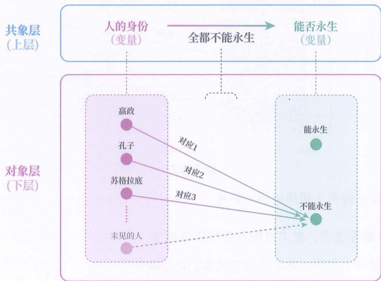
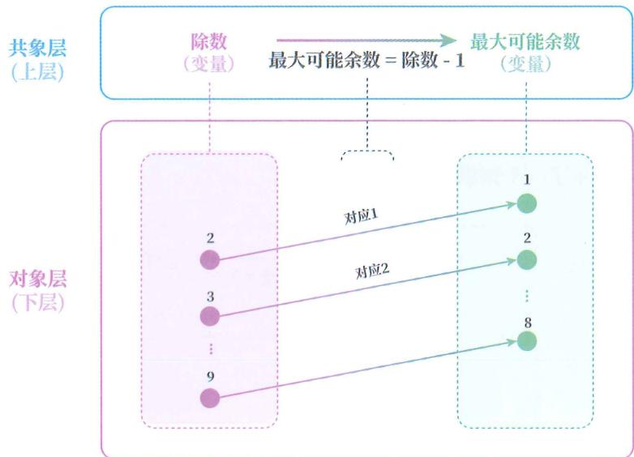
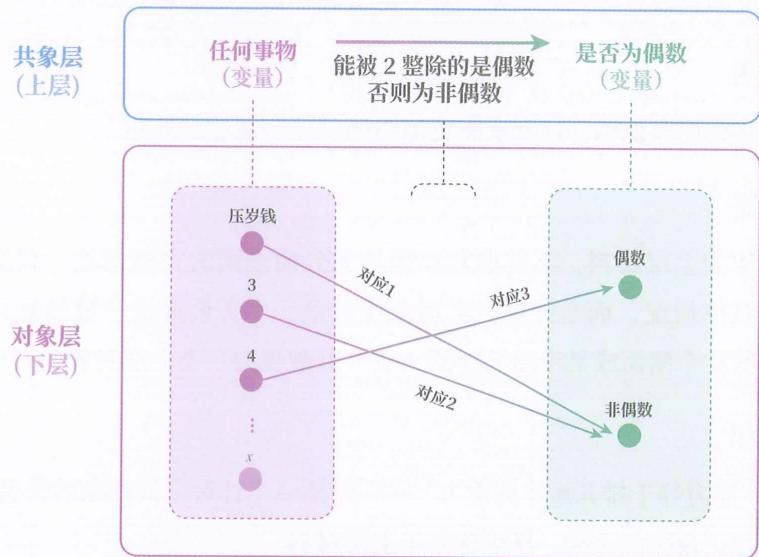
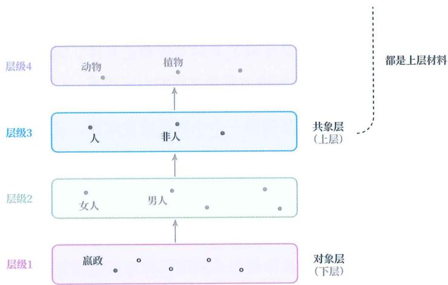
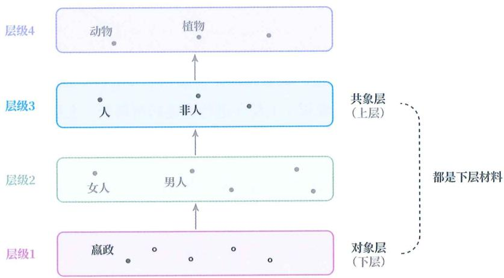

# 下上材料

## 认识材料

正所谓“巧妇难为无米之炊”，认识行为也是一样的，无法凭空进行，需要有认识材料。

根据本书的定义，认识材料可分为两类：

◎ 记忆材料。

◎ 学习材料。

一个材料到底属于哪类，取决于人的主观目的。正如一片树叶，根据主观目的不同，可以是装菜的碟子，可以是吹奏的乐器，也可以是写字的纸张。同理：

当一个材料被我们基于记忆目的使用，也就是原封不动地保存和重现时，它是记忆材料。

当一个材料被我们基于学习目的使用，也就是渐构可泛化模型时，它是学习材料。

## 甲午战争

下面以一段甲午战争的材料为例进行说明。

1894年，为争夺朝鲜控制权，清朝与日本在朝鲜半岛、黄海、辽东等地爆发战争，李鸿章与伊藤博文等为双方核心决策人物，最终清军战败、北洋舰队覆灭，清朝政府被迫签订不平等的《马关条约》。

如果我们的目的是原封不动地记录和重现它，那它就是记忆材料。此时所有的信息都要原样保留，不得抽象，不得遗漏。

如果我们的目的是用它渐构可泛化模型，那它就是学习材料。此时，必须进行抽象，剔除一些无关信息，而根据所关注的概念间关系，抽象的方式也会有所不同。比如，若我们关注的是国家实力和能否获得外交权这两个概念间的普遍关系，那么就会仅保留清朝当时的实力弱和在条约签订上没有话语权这两个信息，得出“弱国无外交”的规律，至于时间和地点等信息，则会将其剔除掉。这也是为什么很多人明明从一个故事中学到了道理，但却记不住细节。

## 误区比较

对于使用记忆材料，可以使用诸如联想记忆法、位置桩记忆法、口诀记忆法等技巧提高效率。总体而言，人们在使用记忆材料时，不存在太多误区，因为大家都知道记忆的目标是重现，即便不借助任何技巧，仅靠不断重复也能记住，无非是效率高低不同。

然而，在使用学习材料时，误区却普遍存在。此类误区带来的后果不单单是效率低下，还有“死活学不会”的困境。其中，最常见、最具危害性的误区是把学习材料当作记忆材料来处理。

本书的重点就是学习材料和对应的学习方式。

## 下料上料

在下上视角下，学习材料可分为下层材料（简称“下料”）和上层材料（简称“上料”）。

由于自然语言的表达较为模糊，我们用数学语言来描述这两类材料。

◎ 下层材料：展现知识中从输入常量到输出常量对应关系的学习材料。

◎ 上层材料：展现知识中从输入空间到输出空间映射规律的学习材料。

## 数经例

存在上层材料意味着已经挖掘出了规律，因此上层材料只会在继承学习中出现。

下层材料在创验学习和继承学习中都会出现,于是我们会听到“数据”“样本”“经验”“例子”“示范”等不同名词。它们都是下层材料,但数据、样本是创验学习中常用的概念,暗含着它们是尚待挖掘规律的下层材料,而例子、示范属于继承学习中常用的概念，暗含着它们是反映特定规律的下层材料。经验在两类学习中都会出现，但更偏向创验学习。

“数据”“经验”“例子”的指代并不统一,本书会按照表26-1所示的区别来使用。

表 26-1 概念指代说明

|  |  |  |

| --- | --- | --- |

|  | 自然语言描述 | 数学语言描述 |

| 数据 | 尚未明确信息推测任务 | 尚未明确输入常量和输出常量 |

| 经验 | 已明确信息推测任务,但未必需要体现规律 | 已明确输入常量和输出常量,但未必需要体现某个映射法则(规律) |

| 例子 | 体现某个规律的具体推测过程 | 体现某个输入常量如何根据映射规律推测出对应的输出常量 |

◎ 简言之：

◎ 指代为 “数据”，意味着尚未明确信息推测任务。

◎ 指代为 “经验”，意味着已经明确信息推测任务，但未必需要体现规律。

◎ 指代为 “例子”，表示能体现某个规律的具体推测过程。

## Vlog

举例说明，假如你是一位登山爱好者，每天都拍摄自己的冒险经历，那你所拍的视频就是数据。因为你只是单纯地记录，还没有决定要从一个信息推测另一个信息，尽管视频中包含了衣食住行各方面的信息。

假如你后来回看视频时，好奇“为何不同海拔煮面时长不同”，整理出下面三个事件的信息：

◎ 事件1：在山脚，用沸水煮面5分钟后，口感软硬适中。

事件2：在海拔1200米的半山腰，用沸水煮面5分钟后，口感略硬，延长煮面时间到8分钟。

事件3：在海拔3000米的山顶，用沸水煮面5分钟后，口感更硬，延长煮面时间到12分钟。

这三个事件对应三条经验（在此称其为经验1、经验2、经验3）。因为你明确了它们的信息推测任务，确定了输入常量和输出常量。

比如，对事件2，你确定了海拔1200米为输入常量，煮面8分钟为输出常量，保留了与此相关的周边信息，但登山地点、日期、天气等因素都被你剔除掉了。

由此也可以看出，经验并不是对事情的纯粹记录，而是经过大脑进一步提炼和编码后的“因果”片段。人的主观选择已经蕴含在经验中了。这也是为什么不同人看到同一件事，产生的记忆会有差异。

但此时，你也只是确定了海拔和煮面时长有关，具体是什么关系还没提及，没有去展现一个普遍规律，所以这些还不是例子。

如果你向一个物理很好的朋友提及此事，他诲人不倦地向你解释压强和沸点之间的普遍关系，并基于你经历的事件2，向你展现这个普遍规律的具体表现，那他所展现的就是例子。该例子和你的经验2的区别在于：输入常量从具体的海拔变成了具体的压强，输出常量从具体的煮面时长变成了具体的沸点。

## 等价称呼

若无特别说明，本书后续出现的“下层材料”和“上层材料”都默认指继承学习下的下层材料和上层材料。此外，本书还有表26-2所示的等价称呼。

表 26-2 等价称呼

|  |  |  |  |

| --- | --- | --- | --- |

| 材料类型 | 全称 | 简称A组 | 简称B组 |

| 继承学习的下层材料 | 实例陈述 | 例子(实例) | 例述 |

| 继承学习的上层材料 | 规律描述 | 描述 | 规述 |

上述简称避开了“规律”一词，选用“描述”、“例述”和“规述”，原因在于，说“3个规律”会给人3个不同规律的感觉，而说“3个描述”和“3个规述”等则更能让人理解为3个上层材料。

## 材料 - 知识

有一个常见误区需要注意，那就是：（学习）材料不等同于知识，记住学习材料不意味着学会了知识。

（学习）材料是扁平的、碎片化的。知识是立体的，结构化的。（学习）材料是用于渐构知识的。

材料就好比食材，知识就好比菜肴。

学习就像做菜，需要将学习材料进行合理的编排和加工，才能转化为自己脑中的知识。

## 付费对象

那为什么这个误区值得特别指出呢？

因为在 “知识付费” 日益流行的今天，不少人都质疑：“这些知识又不是讲者发明的，凭什么要给他付费？”

这种质疑，恰恰混淆了（学习）材料与知识。

或许是“知识付费”这个名称让一些人误以为是在为知识本身付费。可如果真是这样，那我们从小学起就不该交学费——毕竟老师传授的知识也不是他们发明的。

其实，无论是上学交学费，还是为市面上的“知识付费”商品支付费用，本质上都不是在为知识本身付费。因为那些知识没有知识产权上的归属方，学校教的知识甚至属于全人类。我们真正付费购买的是：讲者花时间、精力设计和编排出来的学习材料。

真正能称得上对知识付费的典型行为是付专利费，这才属于“我付钱，是为了使用你拥有法律垄断权的知识”。

若从法律上看，你会发现：在法律上没有针对知识的著作权，仅有针对教学表达形式的著作权，也就是针对学习材料的著作权。

若从目的上看，“知识付费”也并不像买专利那样是为了直接买知识的归属权，而是为了让他人教会自己某个知识。因此，真正付费购买的对象是用于教学的学习材料和教学服务。

## 非一对一

材料和知识之间不是“一对一”关系。同一个知识可以有多个不同的学习材料，即使是上层材料，也可以有多个。

## 人到永生

下面举三个例子来说明“同一个知识可以有多个不同的学习材料”。

同时也请读者体会下面两点：

1. 下层材料是知识中从输入常量到输出常量的对应关系的展示。

2. 上层材料是知识中从输入空间到输出空间的映射关系的展示。

图26-1展示了一个知识的下上结构。

图26-1

对于这个知识，可以有下面两个实例陈述（例子）：

◎ “嬴政（输入常量）死了（输出常量）”

◎ “孔子（输入常量）死了（输出常量）”

也可以有下面两个规律描述（描述）。

◎ “所有人都不能永生”

◎ “人皆有一死”

最大余数

来看图 26-2 中的知识。

图 26-2

它可以有下面两个规律描述（描述）。

◎ “整数除法中，最大可能余数是除数减1”

◎ “r=d-1，其中 r 是最大可能余数，d 是除数”

前者由自然语言表述，后者由数学语言 + 自然语言表述。

还可以有下面两个实例陈述（例子）。

“11÷4=2……3”

“15÷8=1……7”

偶数

最后看图 26-3 中的知识。

图26-3

它可以有下面两个实例陈述（例子）：

◎ “4 是偶数”

◎ “3是非偶数”

还可以有下面三个规律描述（描述）。

◎ “偶数需要是整数”

◎ “偶数需要能被 2 整除”

◎ “偶数是能被 2 整除的整数”

## 材料无限

以上只是展示同一个知识点可以有多个不同的学习材料。事实上，就连不同学习材料的展现顺序也会影响学习效果。

这意味着：哪怕是针对同一个知识进行教学，根据学习材料的类型、个数、编排顺序、措辞等的不同，人们可以制作无数个不同的“知识付费”产品。

评判标准

当明确了付费购买的对象是学习材料后，人们就知道该按照学习材料的优劣去

评判某个知识付费课程的好坏，而不是根据知识是不是讲者发明的来评判。

## 更多说明

接下来补充更多说明，让大家能更加明确例述和规述的外延。

## 不必全面

首先，作为上层材料，不要求它必须是充分而全面的完整描述。只要它不是针对单个具体情况，而是针对一群现象或者是一个普遍规律，哪怕它只描述该普遍规律的某个侧面或某个局部特征，也可以被视为一个上层材料。

## 浮力规律

例如，“浮力等于排开液体的重力”——这是一个针对一群现象的普遍规律描述，并且描述了规律的全貌。显然这属于上层材料。

但像 “浮力与排开的液体有关” 这样的说法，虽然只描述了规律的一个侧面，但它也是针对一群现象的普遍规律，因此也属于上层材料。

## 交代因果

相比之下，下层材料则有所不同。一个合格的下层材料必须同时明确说明知识的一个输入常量与对应的输出常量。

用不太严谨的话来说，一个下层材料（例子）必须同时交代“起因”和“结果”。只交代“起因”，未说明“结果”，就不算是一个下层材料。之所以说“不严谨”，是因为“起因”和“结果”只是输入和输出的一种情况，并不等价，只不过便于大众理解。

## 头孢配酒

例如，“一天，张先生刚吃完头孢，就被几个好友叫出去吃饭，一高兴就喝了几杯酒”，这段材料就不是针对头孢配酒后果的下层材料，因为它没有说明后续发生了什么，究竟是什么事都没发生、过敏还是中毒送医。

上面的材料只有加上“后来，中毒送医了”，才算是头孢配酒后果的一个下层材料。

## 为何不同

为什么下层材料不能是局部陈述，上层材料却可以是局部描述呢？

## 作用不同

这主要是因为我们对材料的使用方式所导致的。

我们对下层材料的使用方式是比较关系的共性和差异性，因此必须提供一个完整的关系，也就是从输入常量到输出常量之间的对应关系，才能用于比较和归纳。

我们对上层材料的使用方式是依照一个个词语重建规律，自然就可以分批次、一个要点一个要点地来渐构。

## 展现规律

不过，若仅交代输入常量和对应的输出常量，则只能称其为经验。若想将其作为一个合格例子，还要展现具体是怎么利用目标知识根据输入常量推测出输出常量的。

## 勾股定理

例如，一个直角三角形，两条直角边的长度分别是3米和4米，根据勾股定理——直角三角形的两条直角边的平方和等于斜边的平方，计算得： $3^{2}+4^{2}=9+16=25$ ，斜边的平方是25，所以斜边是 $\sqrt{25}=5$ 米。

这段材料不仅说明了输入常量（直角边3米和4米）和输出常量（斜边5米），还明确演示了如何运用勾股定理来推导结果，展现了目标知识的作用过程，因此是勾股定理的一个合格例子。

## 上上层呢

我们在 “抽象层级” 章中学过，概念世界并非仅有下和上两个层级，而是像金字塔一样有无数个层级。对共象层（上层）进行描述的材料叫 “上层材料”，那么，比共象层还要抽象一层的学习材料，该叫 “上上层材料” 吗？

比如，“人皆有一死”是上层材料的话，那“动物皆有一死，所以人也皆有一死”该叫“上上层材料”吗？

## 上料范围

不断在名字前加 “上” 会没完没了，所以我们规定：针对同一个知识，共象层及其上层的学习材料，都被称为 “上层材料”。这就意味着对要学的知识的演绎证明也会被归为上层材料，如图 26-4 所示。

图26-4

## 证明步骤

例如，“任意一个偶数与任意一个奇数的和属于奇数”是上层材料，而运用加法结合律、整数加法封闭性等知识对它的演绎证明，也被归为上层材料。

## 下料范围

同样地，从上层（共象层）到下层（对象层）之间，可以穿插存在很多中间层级。对于这些中间层级的材料，我们也都归为下层材料，如图26-5所示。

图26-5

## 男人会死

例如，“人皆有一死”是上层材料（描述），“嬴政东巡暴毙”是下层材料（例子），“男人皆有一死”也是下层材料（例子）。

## 例子层级

这样一来，例子（例述）就有了抽象层级这一属性。

我们也可以根据例子的抽象层级来大致评估例子的好坏：例子的抽象层级越贴近对象层或学习者熟悉的层级越好，越贴近共象层越“糟”。

原因在于：例子的作用就是让学习者自下而上渐构知识，如果其抽象层级过高，学习者脑中并没有这些概念，就难以进行自下学习。该“例子”只是名义上的，学习者实则是在进行自上学习。

这也是为什么有人举例子跟没举一样。更有甚者，仅仅是在规述的基础上增加了限定词，略微缩小了一下概念的外延。

## 好人会死

例如，对“人皆有一死”这个上层材料（规述）举例时，在“人”的前面加上限定词，变成“好人皆有一死”“坏人皆有一死”“男人皆有一死”等，都算例子，但由于距离共象层太近，并不算好例子。相较而言，“嬴政东巡暴毙”和“孔子享年72岁”则是好例子。

## 旗杆举例

又如，对“直角三角形的两条直角边的平方和等于斜边的平方”举例时，把“直角三角形”换成“等腰直角三角形”也算一个例子，但它的抽象层级仍然过高，学习者还是得依靠自上学习，这并不算好例子。相较而言，“高12米的旗杆，影子有5米长，从旗杆顶端拉到影子末端的绳子测得长13米”则是好例子，因为它更贴近人们生活经验所处的抽象层级。

## 故事

人们喜欢故事，也正是因为故事就处于日常生活的抽象层级，任何人都可以毫无压力地利用故事这种下层材料，自下而上地渐构知识。

## 引出用法

通过以上介绍，我们能够区分哪些是上层材料，哪些是下层材料，哪些又可以被进一步称为例子。

接下来，我们将学习这些材料的使用方式。

## 主干提要

1. 一个材料是学习材料还是记忆材料取决于我们的目的。

2. 材料不等同于知识，记住学习材料不意味着学会了知识。

3. 知识付费的付费购买对象是知识的学习材料，而非知识本身。

4. 可对同一个知识编写出无数个学习材料。

5. 共象层及其上层的学习材料都被归为上层材料。

6. 抽象层级介于上层和下层之间的材料都被归为下层材料。

7. 抽象层级越接近对象层的例子越优秀。

## 概念提要

◎ 认识材料：主体认识客体时所用的材料（记忆材料和学习材料的统称）。

◎ 记忆材料：被用于原封不动地保存的材料。

◎ 学习材料：被用于渐构可泛化模型的材料。

◎ 下层材料：展现知识中从输入常量到输出常量对应关系的学习材料。

◎ 上层材料：展现知识中从输入空间到输出空间映射规律的学习材料。

◎ 上层材料 vs 全面描述：上层材料不必是充分而全面的完整描述。

◎ 数据：尚未明确信息推测任务的下层材料。

◎ 经验：已明确信息推测任务但未必要体现规律的下层材料。

◎ 例子：某个知识的具体推测过程的下层材料。

◎ 例子层级：下层材料的抽象层级。

◎ 规述：描述规律的上层材料。

◎ 例述：叙述例子的下层材料。
