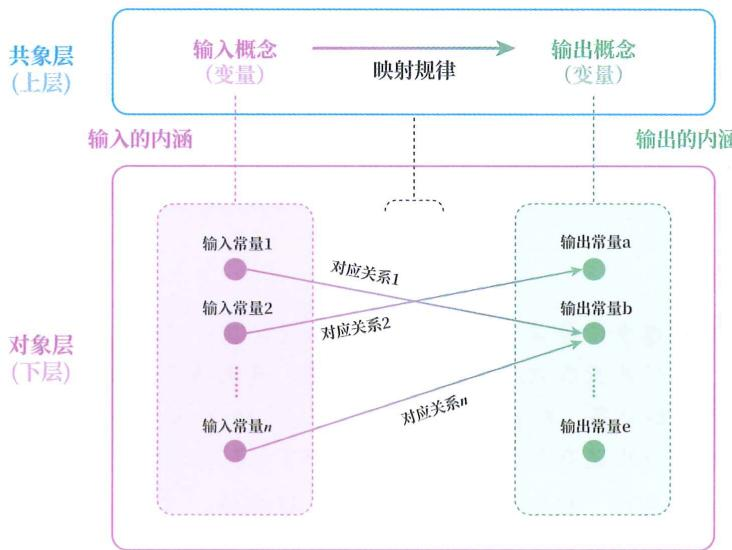
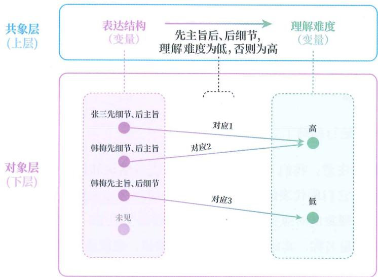

# 下料用法

## 具体下层

我们将根据具体的下层材料来思考“如何使用下层材料来渐构可泛化模型”。下面是两个具体的下层材料。

## 故事 A:

张三跟朋友聊天，说：“你看到那个新闻没有？男子驾车致女友截瘫后，把女友微信拉黑了。”

朋友以为张三想指责该男子，于是顺着说：“这男的也太不负责任了吧。”

张三接着说：“但很多网友表示，这女的出事前在社交媒体上一直装单身，从不晒男友。出事后，才把合照置顶。还有人说，她当时可能把双腿搭在中控台上了，才导致了截瘫。”

朋友一听，觉得张三是想说该女子并不是无辜的，于是顺着说：“那也不能全赖男的，两边好像都有问题。”

张三说：“真假咱也说不好。但你发现没有？以前遇到这种事，网友基本会一边倒骂男的，现在却反过来找女方的问题了。我觉得，这几年发生了太多挑战公众认知的判决，不少人心里有气，就借这件事来表达了。”

朋友这时候才明白，张三不是单纯说谁对谁错，而是想表达最后一句话。

## 故事 B:

一次，韩梅想申请预算，就到办公室向上司汇报：“我们现在的数据处理效率很低，手动导出数据既麻烦又容易出错。我调研了几款工具，有的功能不全，有的价格太高。我还专门做了比对……”讲了五六分钟，上司看了看表，说：“我一会儿还有个会，这事你整理一下材料再说吧。”

从办公室出来后，韩梅向朋友吐槽，朋友提醒她：“你是不是上来就讲细节了？你得先用一句话说明要干什么，再展开细节。”

第二天，韩梅再次找上司，这次一开口就说：“我想申请3万元预算，购买数据分析系统，用来提高运营效率，避免漏数和误判。”然后才开始讲原因和调查过程。上司听完便同意了。

## 提炼规律

这两个下层材料都是针对具体的已见情况的，无法直接用于指导未见情况，材料中也没有出现有关上层规律的表述。

要想用这两个材料来获得推测未见情况的能力，就需要我们自己提炼上层规律，渐构可泛化模型。

## 模型规律

这里先明确一下，什么是模型，什么是上层规律。

图 27-1 展示了一个模型的整体结构。一个模型由彼此联系的下上两层构成。上层规律是能被下层中所有对应关系所共享的映射规律，而映射规律也是从输入空间到输出空间的一种关系。

所以，想确定上层规律，必须确定两个变量，也就是两个概念，然后才能形成这两个概念间的关系。

图27-1

## 抽编寻归

那么，如何使用下层材料来确定两个概念，并形成概念间关系呢？

这个过程可以总结为四种行为：抽象、编码、寻因和归纳。

☐ 抽象：比较多个具体现象，剔除差异属性，提取出共有属性，用来渐构判别模型的过程。

◎ 编码：用判别模型将具体现象归类到特定概念，并用归类后的概念代替原现象的操作。

◎ 寻因：“寻因”意为寻找因素，也就是寻找可由一方推测另一方的输入、输出。

◎ 归纳：从多个输入常量与输出常量的对应关系中找到共有关系的过程。

通过这四个行为，就能在下层材料的基础上提炼出上层规律，并联系下上两层，渐构出模型。我们将下层材料的这种用法简称为“抽编寻归”。

注意：

◎ 抽象和编码常常要进行多次。

◎ 如果当事人脑中已有所需的判别模型，就可以省略抽象步骤，直接进行编码。

◎ 归纳出上层规律后，还要结合判别模型来实现下层和上层的连接。

## 抽象演示

下面拿两个故事为例，具体展示如何抽编寻归。

首先是抽象。

通过比较可以发现:

在故事 A 中，张三说：“我觉得，这几年发生了太多挑战公众认知的判决，不少人心里有气，就借这件事来表达了。”

在故事 B 中，韩梅说：“我想申请 3 万元预算，购买数据分析系统，用来提高运营效率，避免漏数和误判。”

这两段内容虽不相同，但剔除细节，二者都可以被归为主旨概述。

## 同样地：

◎ 在故事 A 中，张三先引入新闻事件，又转述网友的不同观点……

◎ 在故事 B 中，韩梅先提及处理数据既麻烦又易出错，又说到自己调研了工具的性能和价格……

这两段也可以抽象掉差异性，都被归为细节展开。

编码演示

故事A和故事B中的具体现象可以进行如下编码：

◎ 故事 A：张三先进行细节展开，然后进行主旨概述。

◎ 故事 B 第一次：韩梅先进行细节展开，没有进行主旨概述。

◎ 故事 B 第二次：韩梅先进行主旨概述，然后进行细节展开。

进行了第一层编码后，我们还可以对这三个已经被编码过的现象再次进行抽象和编码，得到抽象层级又高一层的表达顺序或表达结构的概念。

使用相同的方式，我们可以抽象、编码出表27-1所示的概念。表中的第一列是抽象概念，第二列是故事A中被归为此概念的具体现象，第三列是故事B中被归为此概念的具体现象。

表 27-1 抽象、编码出的概念

|  |  |  |

| --- | --- | --- |

| 抽象概念 | 故事A中的现象 | 故事B中的现象 |

| 表达结构 | 张三先展开细节,再概述主旨 | 第一次,韩梅先展开细节,未概述主旨;第二次,韩梅先概述主旨,再展开细节 |

| 对话角色 | 讲者是张三,听者是朋友(朋友关系) | 讲者是韩梅,听者是上司(上下级关系) |

| 理解难度 | 听者两次误解,听到概述的主旨后才理解 | 上司第一次没理解;上司第二次理解了 |

| 表达目的 | 闲聊、感叹 | 申请预算 |

| 听者反应 | 疑惑,难以接话 | 第一次不耐烦地打断;第二次点头通过 |

当然，能抽象出的概念还有很多。这里罗列这么多概念，只是为了更详尽地展示，不是说实际使用时有这些必要步骤。在实际学习中，我们只关心推测依据和推测目标，也就是可以作为输入变量和输出变量的两个概念。

## 寻因演示

根据前文可以发现，（讲者）表达结构和（听者）理解难度之间存在相关性，可由前者推测后者。这样，输入和输出就确定了。

当然，可以找到推测关系的因素并不只有一对。这意味着，使用这两个下层材料可渐构的模型并不只有一个。

## 归纳演示

确定了输入和输出后，问题也随之确定了，即：（讲者）表达结构会如何影响（听者）理解难度？

接着就可以进行归纳了。

这里要特别注意：我们不是在抽象层面对表达结构和理解难度这两个词进行归纳，而是对它们所代表的所有具体现象之间的对应关系进行归纳。所以，我们需要将具体现象的对应关系罗列出来，就得到了表27-2所示的内容。在表中，第一行是变量名称，其他行是变量的具体取值，也就是常量。

表 27-2 归纳对应关系

|  |  |

| --- | --- |

| 表达结构 | 理解难度 |

| 张三先细节、后主旨 | 朋友多次误解 |

| 韩梅第一次先细节、后主旨 | 上司没听明白,还打断了她 |

| 韩梅第二次先主旨、后细节 | 上司理解了 |

通过比较这三个对应关系，我们可以归纳出一个上层规律：

◎ 如果讲者采用的表达结构为先主旨、后细节，则听者的理解难度为低。

☐ 如果讲者采用的表达结构为其他（先细节、后主旨，或者没主旨），则听者的理解难度为高。

## 下上连接

光有上层规律还不行，还不足以构成一个模型，因为没有连接下层。

上层规律中的表达结构和理解难度都还只是抽象单元，我们需要利用它们的判别模型去判别任意一个现象是否属于这两个概念的外延，这样才能将上层和下层联系到一起，从而解决实际的未见问题。

至于判别模型，是在抽象过程中利用共有属性来渐构的，或者学习者此前就已经渐构好了。

以上便是下层材料的使用展示。最后，用图 27-2 展示一下整个模型。

图 27-2

注意，为了保持图片简洁，图中仅展示了将故事进一步编码后的现象，这一编码过程需要主旨概述和细节展开这两个概念的判别模型，如果缺失，则无法触达图中的对象层。

## 不擅长

很多习惯了校园学习的学生不太擅长自下学习，甚至不认为这是学习，因为他们习惯了老师在课堂上画重点，然后背定义、背规述，而下层材料中不存在任何关于上层规律的描述，导致他们不知道自己该记什么，会感觉看了又仿佛没看，无处发力。

## 方向无限

之前提到过自下学习的性质，这里稍微说说下层材料的性质。

其一, 使用下层材料可以提炼出来的上层规律不是唯一的。下层材料的数量越少, 可提炼的方向就越多, 所能提炼出来的上层规律也就越多, 但所提炼的规律未必是传授者想传达的规律, 也未必是普遍规律。

## 农夫与蛇

例如，来看《农夫与蛇》这则寓言。

农夫发现一条冻僵的蛇，出于怜悯便将它放进怀里，给它温暖。蛇苏醒后，反而咬死了农夫。

这则寓言可以被提炼出无数个上层规律，例如：

◎ 从行为后果的角度看：“对恶者的仁慈，是对自己的残忍”。

☐ 从社交情感的角度看：“过度付出的人最终一无所有”。

◎ 从信任关系的角度看：“有些人的本性不会因你的善意而改变”。

## 不必表达

其二，尽管在上面的演示中都用语言进行了描述，但其实自下学习的结果不必非用语言表达出来。

判断自己是否渐构出了判别模型和联结模型，就看两点：

◎ 能不能正确判别任意现象该被归为哪个概念。

◎ 能不能从一个概念的具体状态正确推测出另一个概念的具体状态。

## 甜概念

例如，所有人都能根据生活经验渐构出甜和辣等概念的判别模型，尽管我们无法用语言表达它们的共有属性。

## 拿捏模型

又如，小孩子可以渐构出从自我行为推测父母反应的联结模型，如“只要自己闹，父母就满足要求”，但小孩子并没有用语言将该模型表达出来。

何以可能

接着，我们再来看看上层材料的使用方式。

不过，在此之前需要先回答：上层学习何以可能？大脑为什么可以跳过具体经验，直接从上层规律出发向下来渐构知识？这不就像一个人直接出现在高楼层，然后找下楼的路一样神奇吗？

## 主干提要

1. 使用下层材料可以渐构的知识并不唯一。

2. 下层材料的数量越少，建模的方向就越多。

3. 通过从下层材料学来的知识未必都能用语言表达。

## 概念提要

◎ 规律：能被下层中所有对应关系所共享的映射规律。

◎ 模型：可反映现实的下上双层结构。

◎ 抽编寻归：通过抽象、编码、寻因、归纳来加工下层材料以渐构知识的方法。
