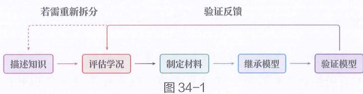
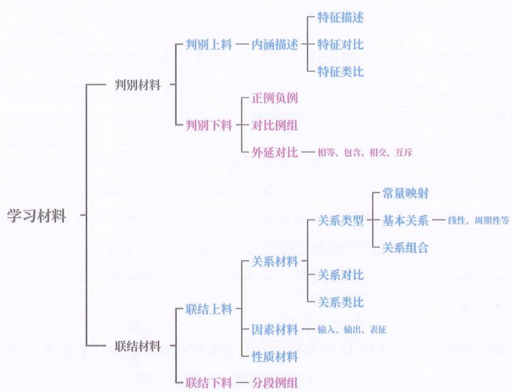
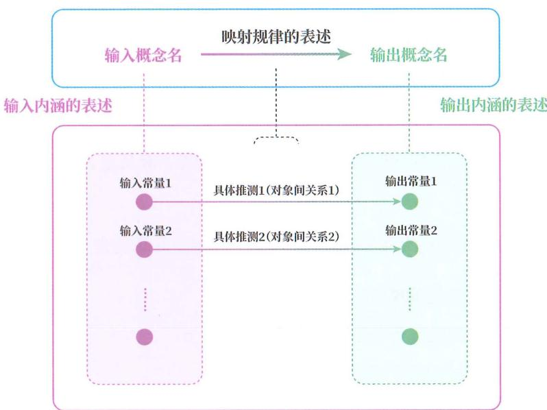
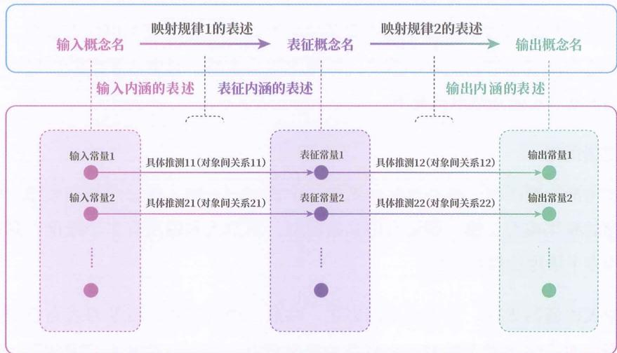
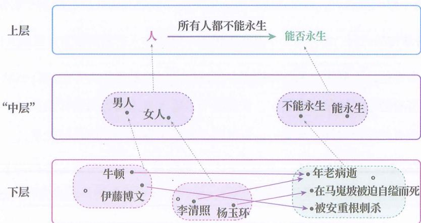
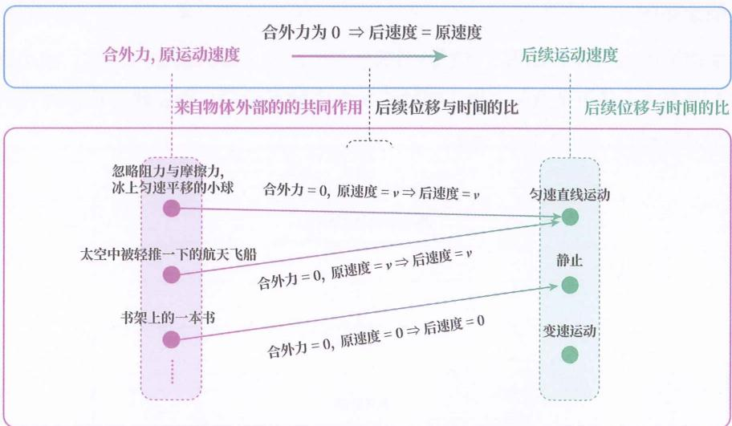
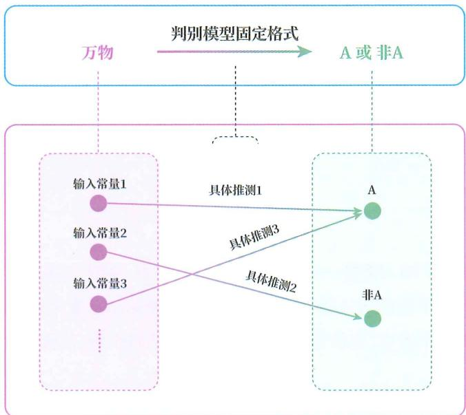
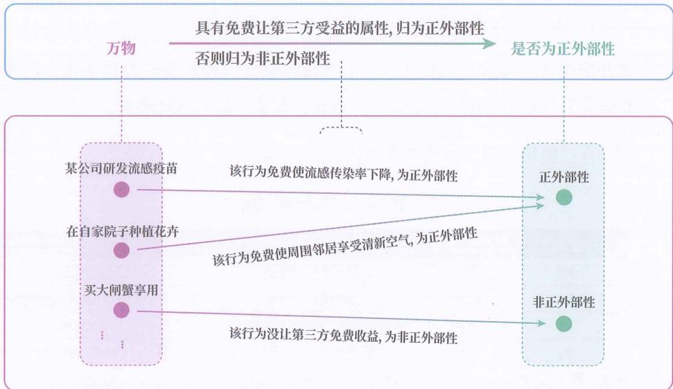

# 上料用法

## 依靠语言

其实，自上学习之所以能直接从上层出发渐构新概念和知识，依靠的是语言世界对概念世界的扩展。

正是这种扩展，让人类不像其他动物那样完全受限于经验，而是能想象出从未经历的事物。

## 鱼讲课

还记得“概念代理”一章中提到的语言能让人超验思考吗？

当时举了一个例子：“一只鱼站在树顶上，给飞过的鸟儿们讲解如何游泳。”

从来没有人有过这种经验，但我们却可以思考它。怎么做到的？

我们确实没见过鱼站在树上讲课，但我们在和腿有关的情境中渐构过站的概念，在和人相关的情境中渐构过讲解的概念，当然也渐构过鱼的概念。我们用符号作为概念的代理，把这些来自不同情境的概念汇聚到同一个时空里，再按照语言的组合规则进行重组，就能想象出从未经历过的事物。

## 形+名

另一个典型的自上学习是定语 + 名词的组合，例如 “正在练瑜伽的” + “蛇”、“绿色的” + “云”。即使一个人在现实中从没见过这些现象，也能靠语言组合出这些概念。

## 超验龙

我们在构造（中国）龙这个概念时，不需要亲眼见过这种生物，只要把蛇身、鹿角、鹰爪、鱼鳞等已有概念组合在一起，构成它的共有属性，就能渐构出“龙”的判别模型。

## 吸血鬼

我们还可以在超验概念的基础上，进一步渐构联结模型。

例如, 有了 “吸血鬼” 概念后, 我们可以利用 “任何吸血鬼接触阳光都会被烧成灰” 这类上层材料, 渐构出一个 “从吸血鬼被光照到后续反应” 的联结模型。

## 旧义重组

明白了自上学习何以可能后，我们便能知道上层材料的使用方式，那就是：依照材料中给出的组合方式，对已有概念进行重组，渐构出待学的知识。我们将上层材料的这种使用方式称为“旧义重组”。

## 重组偶数

比如，学习“偶数是能被2整除的整数”这个材料时，就是依照材料把能被2整除（种差）和整数（属）这两个已知的旧概念，组合出偶数这个新概念。

这种定义方式有个专有名称，叫“属加种差”。之所以这么叫，是因为要先找一个与目标概念最接近的上层概念，再用其他概念修饰和限定它的外延，使其和目标概念的外延一致。

由于目标概念归属于所选的上层概念，因此这个上层概念也被称为“属”；而修饰限定词能根据特征将其与同属的其他成员区分开来，所以叫“种差”。其形式是：新概念 = 差别特征（种差）+ 上层概念（属）。

## 改造积木

这种方式就像拼积木，先挑一个和新造型最像的已有积木（属），再拼上细节积木（种差），拼成你想要的新的积木造型（新概念）。

## 指令

明确给出如何用旧概念重组出新概念的上层材料，也被简称为“指令”或“指示”。

## 隐性用法

旧义重组是上层材料的“显性”用法，上层材料还有一种“隐性”用法。

此前讲过，渐构判别模型时，我们需要找到一组共有属性，作为判断某现象该被归为此概念还是非此概念的判别条件；而渐构联结模型时，则要找到从输入概念到输出概念之间的普遍关系。

那么，除了旧义重组，我们还能用其他方式借助上层材料来实现这两个目标吗？答案是：能。

## 语境赋性

我们知道, 想要在句子中正确使用一个词, 必须遵循特定的语法规则和搭配常识。

这意味着，待学知识的指代物被人们用在某句话中时，语法和常识对这个指代物（词）的约束，就会给它的被指代物（概念）赋予特定的属性。

## 欧佑迪斯

例如，“他把一杯欧佑迪斯递给了我，我一口喝下去，觉得特别暖和。”

这句话虽没有对“欧佑迪斯”的含义进行说明，但语法和常识却给“欧佑迪斯”所指的概念赋予了下面的属性：

☐ “欧佑迪斯”被放置在“一杯”这个量词之后，可推测：它是被放置在杯中的东西。

◎ “欧佑迪斯”是“喝”这个动词的宾语，可推测：它是可直接饮用的液体。

☐ “欧佑迪斯”被喝后，喝的人觉得“特别暖和”，可推测：它是热的或会引起暖感的（如含酒精的饮品）。

## 词络约束

如果一个待学词只出现在一两句话中，恐怕还不足以确定它的含义，但如果被置于足够多样的语句中，与众多其他词形成一个关系网络，它便会受到多重约束，被赋予足够多的属性。利用这些属性，我们的大脑就能渐构成出它的判别模型，也就是学会这个概念。

我们将这种借助隐性关系网络的约束来进行学习（渐构）的方式，称为“词络约束”。

正是因为有词络约束这种学习方式，人们才无须查字典就能在阅读中自然而然

地掌握大量词汇的含义。

## 二者区别

词络约束和旧义重组的区别在于：运用旧义重组时，我们直接根据材料给出的指示进行概念组合；运用词络约束时，材料中并没有给出如何重组概念的指示，我们根据待学词在材料中与其他词所形成的隐性关系网络来确定概念的内涵。

## 数独

如果你玩过数独这种游戏，就能轻松明白这种学习方式。二者都是通过多重关系的约束来确定目标的。

## 君子

我们都知道孔子赞赏君子，但《论语》中并没有“君子”的定义。可我们读《论语》时，依然可以形成“君子”的概念。这是因为在《论语》中，有大量包含“君子”一词的语句，例如：

◎ “君子欲讷于言而敏于行。”——可推测：君子有多做少说的属性。

◎ “君子坦荡荡，小人长戚戚。”——可推测：君子有不拘小节的属性，且君子与小人是对立的概念。

这些语句为“君子”编制了一个隐性关系网络，不断收紧“君子”的意义空间。这便是为何即使没有定义，人们也能通过读《论语》对“君子”形成大致认识，知道至少需要满足哪些条件才能被归为“君子”。

## 学习概念

再以 “学习” 这个词为例讨论一下。没有人教过孩子什么是学习，但孩子却形成了相关认识。这种认识是从哪来的？

其中一部分是通过归纳哪些行为受到了夸奖的自下学习来塑造的。

另一部分是从家长和老师的话中，通过词络约束的方式塑造的，比如：

◎ 父母说“快去学习，别玩了”——学习和玩是对立概念。

◎ 老师说“我们应该向这位同学学习”——学习可以是效仿他人。

◎ 长辈说 “小小年纪，就学会了撒谎” ——学到的东西可以是负面的。

◎ 同学说“军训的这段经历，让我学会了坚持”——学习可以发生在实践中，学到的东西可以是一种品质。

◎ 父母说“你不好好学习，长大了找不到好工作”——学习的好坏，决定未来的就业，也受努力的影响。

由于在家长和老师的话中，“学习”一词往往只隐含了社会视角下的属性，即“学习”这种行为与考分、升学、就业等外部评价和社会反馈的关系，那么孩子由此形成的对“学习”的认识，也只能是一种社会视角下的学习，不能凭借这些言语获得认知视角下的学习，即无法理解“学习”的内部发生过程。

## 语料

也就是说，通过词络约束所能学到的知识，取决于所用的学习材料（如上例中的家长和老师的话）。

将待学词运用在言语中的材料，在本质上也对规律进行了一种抽象描述，也属于上层材料 / 规述的一种，只不过这种描述是间接的。像这种包含待学词的语言用法的材料也被称为“语料”。

## 第一老师

现在你应该更能理解为什么家长是孩子的第一任老师。这并不是因为家长会系统地向孩子讲授知识，而是因为家长在日常交流中会源源不断地生成语料，影响孩子对各种词汇和概念的渐构。由于这些语料本身源于家长的认知结构，因此家长自己的世界模型与价值模型往往会在无形之中被传递给孩子。

比如，“你不好好学习，长大了找不到好工作”这句话，不仅传递了学习与未来职业相关，还间接引入了职业贵贱的概念。这句话说的是不好好学习的不良后果，同时传达了工作有“好”“坏”之分的价值观念。

## 非先天

我们会发现，自上学习不同于自下学习，并非人类与生俱来的学习方式，需要后天训练，也是只有人类才能掌握的学习方式。

## 初生儿

例如，人类婴儿借助自下学习，大约能在3个月时开始学会识别生/熟面孔，5个月时开始学会抓握，一岁多时开始学会走路、学会说“妈妈抱”“吃饼干”等双词组合，但婴儿无法依据“正外部性是指某经济主体的经济活动导致其他经济主体获益，而受益的主体并未为此支付费用”这一特性学会正外部性的概念。

## 牧羊犬

有些人以为动物不会学习，其实很多动物和人类一样，具备出色的自下学习能力，只是无法进行自上学习。

拿以聪明著称的牧羊犬为例，它们可以通过直接交互的自下学习，掌握判断羊群走位和围堵羊群的技巧，甚至还可以学会辨别主人的不同语音并建立与行为之间的对应关系，以此听懂主人的命令。

但你无法通过讲解“先观察羊群的移动趋势，再根据加速度判断接下来的包抄角度”，来让牧羊犬进行自上学习。

## 主干提要

1. 依靠符号以及组织规则对旧知识进行重组，可实现自上学习。

2. 一个词被使用时，会受到语法规则和常识的约束。

3. 一个词在众多语句中受到的多重约束，可用于自上学习新概念。

4. 运用词络约束，人们无须查字典，在阅读中就能学会新词汇。

5. 孩子依靠词络约束可以从家长的语料中无意中学到家长的三观。

6. 自上学习需通过后天训练来精通。

## 概念提要

◎ 旧义重组：依照材料给出的组合方式，对已有概念进行重组，渐构出待学的知识。

◎ 指令：给出如何用旧概念重组出新知识的上层材料。

☐ 词络约束：一个词在众多语句中受到多重约束，这为概念赋予足够的属性，直至形成概念的内涵。

◎ 旧义重组 vs 词络约束：给出重组方式 vs 没给重组方式。

◎ 语料：包含待学词的语言用法的上层材料。

## 上料前提

## 自上前提

自上学习的有效运作依赖三个前提条件：

◎ 掌握前置知识

◎ 掌握语法规则

◎ 明确泛化目标

掌握前置知识和掌握语法规则，是为了能正确地对上层材料进行语义理解。

下面展开说明。

## 掌握前置

第一点，要掌握前置概念和知识。

学习者必须掌握上层材料中用来解释规律的每一个词语和词语所指代的概念，尤其是不能把专业术语理解成日常概念。

## 熵增错配

例如，当人们用 “在一个孤立系统中，其熵（系统的混乱度）总是自发趋于增大” 这个上层材料来学习熵增定律时，除了句中的日常词，如 “中” “其” “总是” “趋于” “增大”，学习者还必须掌握 “孤立系统” “熵” “混乱度” “自发” 等词语在物理学中指代的概念。

如果将这些词解读成日常概念——把“孤立”解读成不跟他人来往，把“熵”和“混乱度”解读成糟糕的或不良的状态，把“自发”解读成主动去做某事，那就不可避免地会把本该学到的科学定律判联错配成一种似是而非的心理学或社会学“规律”，产生推理谬误。

若改用 “在没有能量和物质交换的物理系统中，系统会自发向对应微观态数量最大的宏观态演化” 这个上层材料，可以有效规避这种指代误解，但学习者仍需提前掌握 “微观态” 和 “宏观态” 所指代的概念。

## 积和概念

再拿竖式计算的上层材料举例：

一个数的第 $i$ 位乘上另一个数的第 $j$ 位，其结果应该加在积的第 $i + j - 1$ 位上；若和超过10，则向前进1。

想要用这个上层材料来学习，必须掌握积、和等前置概念。

## 术语壁垒

越是严谨的学科，其专业概念越是环环相扣、层层依赖。没有掌握前置概念，就难以理解更高层的知识，就像盖房子必须逐层搭建一样。数学就是最好的代表。

## 能通俗吗

既然专业概念难懂，那我们就不能全部用通俗概念或日常语言来讲解新知识吗？

## 不可避免

答案是：在一个领域的基础学习阶段，这是可行并且提倡的；但在进阶学习及更高阶段，专业概念的使用则是不可避免的。

一个原因是：随着学习的深入，所研究的关系会愈发复杂，如果始终用日常概念讲解，表述就会变得无比冗长，但人的工作记忆容量有限，处理不了过长的语言表述。试想，若将乘法竖式计算中的积与和替换成它们的定义，表述会变得多么冗长。所以，为了提高沟通效率、降低认知负荷，每个专业领域都会发展出专有名词。这其实就是组块化的实际应用。而运用组块化的代价，就是需要提前渐构概念和记忆名称，这属于“时间换空间”。

另一个原因是：日常概念过于模糊，不同人有不同的理解，而专业知识要求表述严谨和清晰，离不开精确定义的概念。

这便导致在任何需要严谨的领域，都无法避免专业概念的使用。

## 术语之痛

其实，人们真正讨厌的并不是术语，而是学习门槛。

如果只看术语的话，日常生活中的术语并不少：玩游戏时说的“打野”“Gank”，炒股时说的“做空”“爆仓”，职场里说的“KPI”“救火”，“饭圈”中说的“塌房”“代餐”，等等。这些都是人们为了提高沟通效率、降低认知负荷和增强概念精度，而自发创造出来的。

人们对日常术语并不反感，甚至乐于使用，那为什么对专业术语却常常抱有抵触情绪？

人们真正讨厌的，是对前置知识的依赖。

对于日常术语，人们通常可以零基础理解，在使用中就能自然习得；但掌握专业术语，往往依赖一系列的学科前置知识。

比如，没学过映射，就难以理解算子、范畴等数学概念，可要学习映射，又需要先学习集合。

人们普遍不喜欢“回头补课”的感觉。就连看电视剧，许多人都不愿“补剧”，更希望直接进入剧情。因此，人们对专业术语的反感，更多地源于对学习门槛的反感。

但必须承认，专业术语的运用是一种利大于弊的取舍，是任何学科都不会放弃的组块化应用。目前没有鱼和熊掌兼得的办法，遇到专业术语时，只能放平心态，补齐前置知识。

## 自下兜底

此外，有人可能会感到好奇：既然上层材料是用其他更基础的概念去解释待学概念，那么当我们用 B 解释 A，再用 C 解释 B，不断解释，就一定会遇到无法被其他概念所解释的概念，或者遇到 A 解释 B、B 又解释 A 的局面，这时该怎么办？

其实这是正常现象，不是什么“认知漏洞”。因为自上学习的能力并非人们先天就有，需要有一定的基础概念才能启动，而用于“启动”此能力的底层概念，需要借助自下学习来兜底。

所以，面对解释链循环或解释链触底的情况时，运用自下学习即可。

## 左右

例如，遇到 “左是右的反方向，右是左的反方向” 这种循环解释时（说明这两个概念是相互依存的），我们需要在现实交互中采用自下学习的方式，同时渐构出这两个概念。

## 掌握语法

第二点，要掌握语法规则。

学习者必须能根据语法规则正确解析句子——能判断句中不同的成分，明白名词、动词、形容词等词语的组合，不管是有意识还是无意识的。

## 错误组合

例如，对“孤立系统会自发向对应微观态数量最大的宏观态演化”这个上层材料，要能判断出“对应微观态数量最大”是对“宏观态”的限定修饰，是一个定语短语，“演化”是动词。如果把“微观态”和“宏观态”判断成并列关系，或把“宏观态演化”解读成一个名词，就会将句中的概念错误地组合。

## 表述转换

此外，由于语言表达的多样性，有时，一些上层材料并不会明确指出知识中的推测依据和推测目标。

这时，需要学习者不被特定表达所局限，能够根据概念世界和语言世界进行必要的表述转换，还原出推测关系。

## 有毒

例如，“头孢配酒有毒”这句话，实际上介绍了一个“从行为到后果”的推测模型，即从“头孢配酒”这一行为，推测出“会引发身体不良反应”这一后果，但原句使用了“有毒”，是以一种性质的具备来表达的，学习者需要自己将“有毒”转换成“会引发身体不良反应”。

## 负概念

又如, 学习任何概念, 其实都是在同时学习这个概念和其负概念, 本质上是渐构一个二类分类的判别模型。但在实际表达中，人们为了简洁，往往只陈述正概念的定义，省略负概念的描述，需要学习者自己根据正概念的定义转换出来。

以 “偶数是能被 2 整除的整数” 这个上层材料为例，它看似只讲了偶数，但隐含的是一个分类原则。其最完整的表达是：“任何一个事物，如果满足能被 2 整除这个条件，就被归为偶数概念，如果不满足能被 2 整除这个条件，就被归为非偶数 / 奇数概念。”

## 泛化目标

第三点，要明确泛化目标。

掌握基础概念和语法只是确保学习者能读懂上层材料，但读懂后，用上层材料来干什么，有无数的选择。学习者所做的，未必就是学习。这就如同一个人把食材全部备齐之后，可以用食材去做标本，而不是去做菜。

所以，除了能读懂上层材料，学习者还要明白学习作为一种行为，其行为目标到底是什么，自己要朝什么方向努力，怎么样才算达成了行为目标。如果不明确这些，学习者在拿到材料后，仍会不知所措、漫无目的，回到“顺序阅读、通篇记住”的凭感觉式学习方式。

至于学习的行为目标、验证方式，就在本书对学习所下的定义中，即通过渐构可泛化模型，塑造推测未见情况的能力。同时，既然是渐构模型，那模型的下上结构、现象、规律、判别模型、联结模型等定义与作用，也都必须掌握，否则就仿佛一个人要造发动机，却连发动机的组成结构都不明白一样。

这些定义性的内容，常常被人们称为“没有实操性”。想这么说也可以，但实操也是靠这些“没有实操性”的定义引导方向和推导出来的。若缺失了它们，实操就成了盲目操作，没有目标和方向，也不知道什么时候停止。

## 术语介绍

例如，下面是一段对熵的介绍。

熵是一个重要的宏观热力学量，它可以衡量热力学无序和随机性。不可逆过程会使得体系的熵增加。最早卡诺意识到可逆卡诺热机效率最高，避免不可逆过程在提高热机效率上非常重要，提出了卡诺定理。后来克劳修斯在卡诺的研究的基础上，提出了熵的表达式，并且提出可逆过程熵增为零，不可逆过程中会有熵的产生。熵增在物理学理论中有至关重要的意义，最小熵产生原理是非平衡统计物理的基本假设之一。

哪怕一个人具备语法能力和相关常识，并学过上文中出现的所有基础概念，但若没有明确学习的行为目标，就不知道自己要用这段材料来干什么，往往就会顺序阅读，然后以是否读懂或能否记住全文来判断是否学会了。于是，当他真记下全文后，他在认知上会觉得自己学完了熵，可感觉上仍是模糊的。

但如果此人一开始就明确：概念学习实质上就是根据是否满足判别条件来渐构一个能判别任意对象是否该被归为此概念的判别模型。那他在阅读之前就会带着目标，也就是找出一组判别条件。

带着这样的目标再来看材料，很快他就会发现，这段介绍文字虽是“熵是……”的句式，但其实并不是在讲熵的定义。其第一句说的是作用，第二、第三句介绍的是概念的发明者和发明背景，最后一句强调的是概念的重要性。那学习者便能意识到，哪怕自己把全篇背下来，也无法帮助自己学会熵的概念。他需要寻找更多直接或间接带有判别条件的学习材料。

可见，当学习者明确学习的行为目标时，就能以目标为导向，来分析手头的材料是否能达成目标，如果不能，自己又该去找什么样的材料，做到主动掌控学习过程。

## 认知适配

接下来，说说上层材料的普遍性质。

从上面的使用前提可以看出，上层材料并不是对所有人都同样有效，其效果不仅取决于材料自身，还取决于学习者的知识结构。不同人面对同一个上层材料，会有不同的感受：

◎ 有些人会觉得醍醐灌顶，因为刚好适配他的知识结构。

⑥ 有些人会觉得啰里啰唆，因为他觉得有更好的解释方式（相对于他个人）。

◎ 有些人会觉得云里雾里，因为他的知识结构中缺少材料所用的基础概念。

为方便指代，以下把 “上层材料的效果取决于学习者的知识结构” 这一特性称为 “认知适配”。

## 天赋怀疑

上面这段关于认知适配的介绍，看起来就像啰里啰唆的废话，为什么还要提？

这是因为在生活中，有太多人对此是知行割裂的。他们嘴上承认“上层材料的效果取决于学习者的知识结构”，可一旦遇到别人能看懂、自己却看不懂的上层材料，仍会本能地陷入自我怀疑。

这种情况，在从小习惯了老师替自己挑选合适材料的学生进入互联网时，尤为明显。因为互联网上充满了良莠不齐的材料和人人都是“懂王”的评论，而这些学生又习惯了被动接收材料。

比如,点开一篇别人推荐的“必读好文”,评论区里清一色都是“写得太清楚了”“终于搞懂了”之类的赞叹,但自己却读得满头雾水,巨大的挫败感和焦虑就会涌来。为了缓解这种不适,许多人会下意识地把矛头指向材料本身,通过评论“没意义”“写得太差”等方式,来解构“自己不行”的结论。然而,在互联网上,我们会反反复复遇到看不懂的内容,这种反复的对抗会耗干自己的精力。

相反，如果从更深的层次搞明白“为什么上层材料的效果必然取决于学习者的知识结构”，做到真正践行，这种焦虑从最开始就不会存在。并且，我们在遇到看不懂又想掌握的内容时，所思考的就不是否定眼前的材料，而是如何主动挑选材料，从基础开始逐层渐构。

## 言不尽性

上层材料还有一个特性是“言不尽性”：上层材料往往无法覆盖一个知识的全部侧面。

因为上层材料必须依赖意识层面上已渐构的概念来解释和描述新知识，这使得上层材料在解释知识时，常常会出现下面两种情况。

☐ 言不尽：由于意识所能处理的概念数量存在限制，进行解释时，只能突出最核心的几个侧面，无法言尽所有侧面。

☐ 言不出：当解释新概念所需的支撑性概念尚未在意识层面被渐构时，还会出

现我们所说的“无法用语言解释”。

## 何谓爱情

例如，有人在解释 “什么是爱情” 时，会说 “爱情是奉献”。这并不是说 “爱情等同于奉献”，而是说能被归为 “爱情” 的现象具有奉献的属性。

但很明显，奉献并不是爱情的全部属性，因为我们不能仅凭一个现象具有此属性，就判别它为爱情，它还可能是亲情、信仰等。所以，“爱情是奉献”只是解释者用于强调爱情最值得突出的一个属性。

像爱这种无法被言尽的概念，还是得靠基于现实交互的自下学习来渐构，也就是靠亲身实践渐构出足以区分爱情和非爱情的判别模型。

## 描述音乐

再举一个“言不出”的例子。很多人都喜欢听音乐，但在我们的日常语言中，并没有太多用于解释音乐的通用概念。例如，一个长时间听音乐的人，运用自下学习渐构出了一个音乐类型 X，他听到一首具体的歌曲后，可以判断它是否属于 X 类型，但他却完全“言不出”这个音乐类型 X 的内涵。

## 解释转移

许多看似“能言尽”的概念，其实只是因为我们不再继续追问用于解释它们的概念。一旦刨根问底，就会发现它们依然无法被言尽。

## 何谓偶数

比如，偶数，被解释为“能被2整除的整数”，我们觉得已经言尽了。但其实是因为我们默认整数、除法等概念已经清晰、稳固了。如果继续追问什么是数，追问公理体系本身，还是会遇到言不尽的局面。此时我们所依靠的，仍是自下学习所渐构的内隐模型。

## 主干提要

1. 实现自上学习需要掌握前置知识、掌握语法规则、明确泛化目标。

2. 自上学习需要掌握上层材料中用来解释新知识的基础概念。

3. 运用术语的主要目的是提高沟通效率、降低认知负荷和增强概念精度。

4. 自上学习有能力极限，当解释链循环或解释链触底时，需靠自下学习。

5. 自上学习需要根据语法和常识判断句中短语。

6. 自上学习需要进行表述转换,找出知识的推测依据(输入)和推测目标(输出)。

7. 自上学习需要明确上层材料是用于渐构可泛化模型的，而非用于记忆。

8. 上层材料的效果还取决于学习者的知识结构。

## 概念提要

◎ 前置知识：学习材料在解释新知识时所用到的知识。

◎ 表述转换：将知识的一种表述转换为另一种表述。

◎ 言不尽性：语言材料无法覆盖知识的全部侧面的特性。

◎ 解释链：B 解释 A、C 解释 B、D 解释 C 的链条。

◎ 解释链循环：A 解释 B、B 解释 A 的局面。

◎ 解释链触底：无更基础的概念去解释处于链的末端的概念。

## 下上结合

## 各有利弊

至此，你会发现，自下学习和自上学习各有优劣。

自下学习有 “落实感”、易理解，先天擅长，无须借助语言材料也能进行；但建模方向多样、易偏离主题，即便建模方向对了，也易以偏概全，而且需反复试错。

自上学习的建模方向聚焦，不易以偏概全，但需后天训练语言能力、掌握基础概念和使用方法；即便如此，解释力仍有触及不到的区域，材料不易理解，常出现鸡同鸭讲，还容易学成“悬空经验”，当材料不适配时，作用甚至为负。

## 下上结合

那么，最理想的情况是：自下学习和自上学习结合使用，互补不足。

## 结合顺序

在结合使用材料时，自然会形成两种顺序：

◎ 先下层材料（例述），后上层材料（规述），简称“例规编排”。

◎ 先上层材料（规述），后下层材料（例述），简称“规例编排”。

两种编排顺序所带来的第一观感各不相同，正好延续了自下学习与自上学习各自的性质。

## 例规观感

例规编排由于是下层材料先行，会先给人一种看得见、摸得着的“落实感”，但随着阅读下去，往往又会让人产生迷惑感，因为读者虽知道下层材料是什么，但不确定下层材料想表达什么（上层规律）。而当上层材料出现后，就可以给人带来一种豁然开朗的“点题感”和“顿悟感”。

因此，若例规编排运用得当，其观感路径是：熟悉→疑惑→明朗。

## 演讲青睐

这也是为什么例规编排常被用在公共演讲、公众号文章等需要优先营造“顿悟感”、“惊喜感”和“收获感”，但对可泛化性要求又不高的场景中。在这些场景中，下层材料引发的疑惑，恰好能够制造悬念，同时下层材料可以抽象的方向多种多样，能很容易地让司空见惯的日常现象变得新奇而富有意味，引发听众的好评。

然而，正因为下层材料贴近生活、人人都可能有所经历，如果随后的上层材料不能带来新的视角或知识，演讲或文章就容易流于“正确的废话”，而如果不匹配前面的下层材料，也会让人困惑到底——就像看电影时人们产生的那种不明白这些故事在表达什么的迷惑，还会觉得演讲者或文章作者在乱编。

## TED演讲

很多 TED 演讲都是以一个故事作为开篇的，也就是下层材料先行。

例如，Adam Grant 的演讲 The surprising habits of original thinkers，便是以 “七年前，一个学生找到我，想让我投资……” 作为开篇，先讲一个故事——他没有投资一个经过 6 个月还没开始做网站的电商公司，结果这家公司后来发展得极其成功。

## 规例观感

规例编排由于是上层材料先行，会先给人一种语言简练、方向清晰、覆盖全面的感觉。但因为上层规律中的概念都是可在一定范围内取值的变量，也会让读者难以明确“规律说了哪些现象”，从而产生一种“缺失对象”的感觉。当下层材料出现后，缺失的对象被填补，还会对上层规律产生印证作用，由此也给人带来了一种“确认感”。

因此，若规例编排运用得当，其观感路径是：定向 $\rightarrow$ 空泛 $\rightarrow$ 印证。

## 作画先后

可以把例规编排和规例编排类比成作画时先填色、后画轮廓和先画轮廓、后填色。

## 教材青睐

规例编排常被教材采用。首先，最主要的原因是：任何知识都是一类现象的总结，而非单个现象的交代，教材由于要让学生以知识所代表的那一类现象为学习目标，所以会先给上层材料，作为终极目标，然后举例讲解，避免学生理解一个例子后便略过学习目标。其次，例规编排的“绕一圈，再点题”，也不利于教师对教材的反复使用和翻阅。

如果明确知道这种规例编排的教材的正确用法，学习效率可以非常高。但如果不清楚，那么在教材刚给出规述的时候，学生就会产生很强的挫败感、瞌睡感，可能会失去读下去的耐心。

## 数学定义

例如，在学正整数除法的最大余数这个知识时，虽然教材给出 $17 \div 5 = 3 \dots 2$ ，学生很容易明白，但所学的知识并不是仅针对这一个情况，而是一类情况，于是教材便会先给出上层规律，所有具体的数字都会被替换成抽象概念，也就是会把上式中的17替换成被除数，把5替换成除数，把3替换成商，把2替换成余数，然后举一个个例子，最后还要给出新情况来考核学生对知识的掌握。

如果学生不清楚教材的正确用法是先用上层材料画轮廓，再靠下层材料来填充，以为需要把上层材料记忆下来，那么面对抽象的概念就会产生挫败感、瞌睡感，因为学生不明确“最大可能余数 = 除数 -1”在说什么。

## 汇报青睐

在学术汇报、工作汇报等场景中，由于效率优先，常常是上层材料先行，也就是先给概括性结论，后给具体细节。又由于在此类场景中，团队之间已有相对统一的术语和语境，不像公共演讲那样担心听众“听不懂”，所以规例编排更受青睐。

## 适用场景

在表达篇幅有限的场景中，前面的结论十分值得关注，但对于本书所定义的学习而言，这些结论的重要性就会相应减弱。因为本书中的学习，其本身就被定义成需要反复迭代的“渐构”行为，会例一规一例一规一例一规……不断循环。在这种循环中，到底是上料先行，还是下料先行，区别就没那么重要了，不像演讲、汇报等，由于篇幅有限，需要考虑哪个先行来实现特定观感。

## 下上对齐

在下上结合中，除了顺序，还有一点至关重要，那就是下上对齐。

所谓 “下上对齐” 指的就是：上层材料中出现的每个概念（变量），在下层材料中都要有对应的现象（常量）。

下上对齐非常重要，因为倘若不对齐，那下层材料和上层材料就仍是分离的，并未做到真正的结合，这会严重影响学习效果。

## 非对齐

请看下面的学习材料。

上层材料：

正外部性是指某经济主体的经济活动导致其他经济主体获益，而受益的主体并未为此支付费用，其特征如下。（1）经济活动：正外部性适用的对象需要是经济活动。（2）正向影响：对其他经济主体的影响是有益的。（3）无偿性：受益者无须按市场原则支付费用。

下层材料:

例如，接种疫苗、教育、养蜂业。

这段材料就没有实现下上对齐，尽管给出了3个下层材料，但上层材料中提到的特征均未在下层材料（例子）中出现。

## 对齐

上面的上层材料不变，把下层材料换成：

例如，个人花钱接种流感疫苗，对在周围人群中降低疾病传播风险起到积极作用。该现象就是正外部性，因为它符合正外部性的所有特征。（1）经济活动：个人花钱接种疫苗属于经济活动。（2）正向影响：接种疫苗不仅能降低自己的患病风险，还避免了自己成为传染源，降低了其他人被传染的可能性。

（3）无偿性：被降低患病风险的周围人，没有向接种者支付任何费用。

这样才是下上对齐了。

## 完整概例

值得注意的是，对一个概念举例时，完整的例子是：“现象 a 是概念 A”或“现象 b 不是概念 A”。平时大家只说“现象 a”，这是“现象 a 是 / 不是概念 A”的一种简化。

## 疫苗全例

例如，“接种疫苗的特性是正外部性”才是正外部性的完整例子，而单提“接种疫苗”只是“接种疫苗的特性是正外部性”的一种简化。

## 排版对齐

内容上的对齐是下上对齐的基本要求。除了内容对齐，本书还建议在需要时进行排版对齐（也称“格式对齐”）。所谓排版对齐，就是指上层材料采用什么表达结构、概念如何依次出现，下层材料也按照相同的结构来编排，只是将其中的概念替换为对应的具体现象。这样一来，读者在阅读时，就无须反复揣摩内容，能直接通过排版位置判断“哪个现象对应哪个概念”。

## 排版不齐

上面的对齐例子本身就是排版对齐的，如果将下层材料修改如下，就成了非排版对齐。

例如，接种疫苗不仅能保护自己，还能降低他人患病的可能，而且周围人无须为此付费，因此是正外部性。

在这段下层材料里，虽然也提到了“经济活动”“正向影响”“无偿性”这三个特征，但它们的顺序与上层材料不同，呈现方式也没有与上层材料保持一一对应的位置关系。读者必须阅读内容，才能辨认出哪些对应“经济活动”，哪些对应“正向影响”和“无偿性”。

这种情况就属于内容对齐但缺乏排版对齐，读者的理解负担会相对增加，学习效率会相对降低。

## 普遍缺下

以上是有关下上结合的相关知识。

在很多情况下，我们并没有条件进行下上结合。并且，“有上缺下”比“有下缺上”的情况更为普遍，因为上层材料更简短、易于编写和传播。在日常中，人们并不愿花精力去编写一个有大量可考察细节的例子，甚至就连读者也不愿意看例子，原因很简单——文字多。

例如，大家经常能在网上看到“一张纸总结英语语法”之类的学习材料。你或许会感到好奇，既然一张纸能讲完，为什么学校的英语教材那么厚？这是因为学校的教材加入了大量的下层材料，帮助学生去渐构知识，而“一张纸总结英语语法”只有上层描述。但“一张纸”显然更迎合急于求成的大众心理。

## 缺下怎办

恐怕很多人都想问，面对这种“有上缺下”的学习材料，怎么学？

## 主干提要

1. 自下学习和自上学习各有利弊，应下上结合。

2. 例规编排的观感多为：熟悉 $\rightarrow$ 疑惑 $\rightarrow$ 明朗。

3. 例规编排适合需要营造“顿悟感”、“惊喜感”和“收获感”的场景。

4. 规例编排的观感多为：定向→空泛→印证。

5. 规例编排适合教材和汇报。

6. 学习材料若没下上对齐，会导致下上结合失败。

7. 概念的完整例子应是：“现象 a 是概念 A”或“现象 b 不是概念 A”。

8. 排版对齐更便于学习者理解材料,可根据排版来判断“哪个现象对应哪个概念”。

## 概念提要

◎ 下上结合：自上学习和自下学习相结合。

例规编排：先下层材料、后上层材料的下上结合。

◎ 规例编排：先上层材料、后下层材料的下上结合。

◎ 下上对齐：上层材料的概念要对齐下层材料的现象。

◎ 排版对齐：上层材料的概念和下层材料的现象在排版上对齐。

## 31

## 验证环节

## 残缺观念

“有上缺下”固然有所缺失，但这并不意味着我们就束手无策了。很多人觉得“有上缺下”直接就学不了了，这其实源于不完整的学习观念。

前面提到过，在工业革命之后，不少学生对“学习”的划分变成了课堂听讲+记忆讲解，也就是学+思+背的组合，原本属于学习的习和行这两个环节被划分到了学习之外。如果一个人持有的是这样的学习观念，那么一旦遇到“有上缺下”的学习材料，确实就束手无策了。因为他只能处理现有的材料，学习材料的缺失会直接变成学习结果的缺失。

## 验证对策

本书所定义的学习，在进行完阅读材料和理解材料之后并未结束，还有必不可少的验证环节。一旦将学习固有的验证环节加上，那么“有上缺下”的问题就不再那么可怕了。原因有下述两点。

## 验证反馈

学习者在验证时，需要根据对上层材料的理解，去寻找或联想若干下层现象，并加以处理。当然，他的解决方法多半不正确。但正是这种“不正确”可以作为反馈信号，指导他调整对上层材料的理解。

我们将这种反馈信号称为“验证反馈”。

## 实践取经

验证的过程就是实践 / 应用，而下层材料其实就是在实践 / 应用中产生的。所以，哪怕学习者一开始看上层材料时觉得晦涩，只要能基于它大致锁定一个应用场景，就能在验证中获得一个个下层材料，与上层材料形成互补。

这也是为什么很多人原本看不懂上层材料，但在应用场景下乱试一通后却理解了。因为在乱试中，学习者能获得新的下层材料。

## 必有验证

这也引出了学习中不可或缺的一环：模型验证。

无论是自下学习、自上学习，还是下上结合，或是任何方式的学习，都必须经历新现象的验证。原因有下述三点。

## 材料之外

第一点：验证材料在学习材料之外。

我们的记忆所针对的对象是已见情况，所以记忆时所用的材料就可以被用作验证材料，以判断自己是否记忆成功了。但学习所针对的对象是未见情况，学习时所用的材料无法被用作验证材料来判断自己是否学习到位了。所以我们看完学习材料后，还必须经历验证过程，以学习材料之外的未见情况来判断自己的学习程度。

## 迭代依据

第二点：学习需要根据验证反馈来调整下一次建构。

学习并不是在塑造解决单一现象的能力，而是要通过渐构一个模型，来应对有限的已见+无限的未见情况。在渐构过程中，模型不可避免地会仅适用于A、B，不适用于C、D，更新后，又仅适用于A、C，失效于B、D……为提升模型的可泛化性，就必须通过验证获取验证反馈，作为下一次调整模型的依据。并且该过程并非单次建构，而是验证—反馈—调整这样不断循环的“渐构”。倘若缺少验证，大脑便无从知晓该如何修正模型。

## 保存依赖

第三点：模型的保存依赖于验证。

大脑对学习和记忆有不同的保存机制。所记信息是否被保存，主要取决于信息是否足够奇特；但所学模型是否被保存，则取决于模型是否足够通用。而模型的通用性只能通过新现象的验证来判断。这就是为什么我们常常发现，一个知识，即使多次阅读其学习材料，脑中依然没有存住模型，可只要在生活中成功验证或应用了一次，就会被牢牢地保存下来。

以上就是为什么新现象的验证是学习的固有环节。

## 验证模型

验证的方式是从输入空间中随机挑选一个未见的具体对象，观察所建模型在预测该对象上的表现。由此得到的反馈，将被作为大脑后续更新模型的依据。

在任何学习方式中，验证方式都是一样的。

## 找演讲

例如,在上一章的“演讲青睐”中曾提到,不同例规编排方式可能会导致不同观感,其上层规律是:

☐ “惯见现象 + 新奇归纳”（陈下新上）的例规编排往往导致“熟悉→疑惑→明朗→有收获”的观感。

◎ “惯见现象 + 惯见归纳”（陈下陈上）的例规编排往往导致“熟悉→疑惑→废话→无收获”的观感。

☐ “惯见现象 + 牵强归纳”（陈下错上）的例规编排往往导致“熟悉→疑惑→困惑→不可信”的观感。

对这个知识进行验证时，就可以去找几个自己最近读过的公众号文章或听过的公共演讲，看看它们都属于什么样的例规编排，再看看它们给人们的普遍观感是否如上层规律所描述的那样。

## 可无意识

需要注意的是，如何依据反馈来调整模型，并不总是一个有意识的过程。大脑先天具备一套自动调节机制，像骑车、游泳等技能的学习，就依赖这套机制来完成模型的自动渐构。学习者所要做的仅仅是提供合适的学习材料——例如，不同动作导致的跌倒情况，并不需要靠意识去控制模型的渐构过程，也控制不了。

## 验证材料

伴随模型验证一起出现的概念是验证材料。

验证材料和例子/示范一样，都属于下层材料，也都有输入常量（推测依据）与对应的输出常量（推测目标）。之所以将其单独划分出来，并不是因为内容上有差异，而是因为用途不同。

例子的用途是让学习者用来进行抽象、编码、寻因和归纳的，而验证材料的用途是让学习者用来评估当前模型的表现的。

正因如此，验证材料中输入与对应输出的展现并非同时的，而是分先后的：先向学习者提供输入，并要求学习者用脑中的模型来推测输出，然后呈现实际的输出，以供学习者将自己的模型的推测结果和实际的输出进行比较。

## 习题

对于输入和输出均可以被文字化的验证材料，我们又称其为习题。

## 非文字

注意，不能被文字化的验证材料是存在的。例如，乒乓球运动中有关特定发球的验证材料，其输入是发球的视觉信号，其输出是控制接球的肌肉信号。

之所以特别强调这一点，是因为“验证材料”这个名称容易让人误以为它一定是纸质化、书面化的。事实上，这里的“材料”指的是任何形式的信息，包括语言、影像、声音、动作，甚至人与环境交互中自然呈现的即时反馈。

## 例习互转

正因为验证材料和例子只在用途上有差异，在内容上没差异，所以根据学习者的用法，二者可以相互转变。

## 无习题

例习互转本来没什么好提的，但奈何有些人太实在了，拿到一套学习材料，上面说是例子，就真的无论什么时候都把它当成例子来用，然后为没有习题犯愁。明明可以把例子改成习题用。

下面就介绍两个有关例习互转的应用技巧。

## 例习循环

很多教材都是一个规述配上多个例述，所以第一个技巧是：

1. 初理解：先理解规述和 1 到 2 个例子。

2. 例转习：把后续例子都当成习题，遮住答案，先凭借自己的理解去推测。

3. 习转例：完成推测并核对完答案后，再将其改成例子用，和前面的例子一起进行归纳。

## 遗例转习

之所以不能用已读的例子作为习题，是因为我们的大脑可能会直接把例子作为信息记住，导致在进行验证时，无法区分自己是依靠记忆重现出答案，还是依靠模型推测出答案，从而无法保证验证的可靠性。

不过，如果时间长了，学习者已经把某个例子的细节遗忘了，那么这个例子就可以作为习题使用了。所以，另一个可操作的技巧是：把曾经读过但后来遗忘了的例子当成新的习题来做。

## 误转例

有一种常见的误用情况需要注意: 有些人在做习题时, 看完题目就立刻去看答案。这样实际上是把习题当成了例子来使用。如果学习者没意识到这一点, 就会以为自己完成了验证环节, 但实际上并没有真正经历过。这属于例习互转的一种误用。

## 更加细分

前面，我们讨论了下层材料和上层材料的用法：前者体现为“现象：抽象→编码→寻因→归纳”，后者则体现为“符号：旧义重组 + 词络约束”。这可以被看作材料的一般性用法。

再往前，我们还学习过判别模型与联结模型。如果将这两部分结合到一起，会怎样呢？

## 主干提要

1. 将学习视为课堂听讲 + 记忆讲解难以解决 “有上缺下”。

2. 验证反馈可以帮助学习者调整对上层材料的理解。

3. 在验证和实践中可以创造新的下层材料。

4. 记忆的验证材料就是记忆材料。

5. 学习的验证材料必须是学习材料之外的未见情况。

6. 学习需要获取验证反馈以作为下一次建构的依据。

7. 所记信息是否被保存主要取决于信息是否新奇。

8. 所学模型是否被保存主要取决于模型是否普适。

9. 成功地验证模型可让大脑更持久地保存所建模型。

## 概念提要

◎ 模型验证：用未见情况验证所建模型可泛化性的环节。

◎ 验证材料：用于验证所建模型可泛化性的下层材料。

◎ 验证反馈：验证模型的可泛化性时获得的用于指导下次学习的反馈。

◎ 习题：可被文字化的验证材料。

◎ 例习循环：将多余的例子看成习题，验完后再作为例子使用。

◎ 遗例转习：将用过但遗忘了的例子作为习题使用。

## 判别材料

## 特料用法

若将上料和下料的一般用法和判别模型与联结模型结合起来，就能细分出：

◎ 专门渐构判别模型的上层材料

◎ 专门渐构判别模型的下层材料

◎ 专门渐构联结模型的上层材料

◎ 专门渐构联结模型的下层材料

清楚这些专门材料的分类和用法，能让我们更快捷、更有针对性地把握学习材料。

例如，当分析出自己需要更多例子或习题时，还能明确知道需要的是针对什么的例子或习题。

## 内涵描述

我们先从判别模型的上层材料开始。

学习一个判别模型，是在渐构从输入空间到输出空间的一个映射。这里有一个固定格式：如果某现象 x 满足共有属性，则将其归为 A（概念）；如果某现象 x 不满足共有属性，则将其归为非 A（概念）。

倘若我们已经知晓了这个固定格式，那么在学习它时，就可以仅思考如何获取共有属性，获取后，再自己搭配固定格式来渐构判别模型。

于是，我们就可以细分出一个直接表述共有属性的上层材料，在此称其为“内涵描述”或“定义描述”，以便和针对联结模型的上层材料区分开来。

注意，由于任何上层材料都可以利用词络约束来间接地获得共有属性，所以间

接表达共有属性的材料并不被我们归为内涵描述，依然停留在语料这个类别下。

## 内涵用法

既然内涵描述属于上层材料，自然可以对其运用旧义重组和词络约束（搭配有针对性的用法描述）：运用旧义重组和词络约束，获得能判别任意现象是否符合特定概念的共有属性（一组属性），再用这组属性搭配固定格式，完成判别模型的渐构。

## 偶数定义

先从最简单的一个例子开始。

偶数是能被2整除的整数。

这种属加种差的定义就属于一个内涵材料。

我们需要运用旧义重组来理解句义，然后整理出共有属性。

你可能会意识到 “整数” 并非一个属性。这其实需要我们自己转换一下，将 “整数” 转换为 “属于整数” 或 “具备整数所具备的属性”。于是，我们就获得了 “能被 2 整除且属于整数” 这个共有属性。

接着搭配固定格式来形成判别模型：如果某现象 x 满足能被 2 整除且属于整数，则将其归为偶数；如果某现象 x 不满足能被 2 整除且属于整数，则将其归为非偶数。

然后用新的未见情况来验证判别模型：

◎ 数字 1623 不满足能被 2 整除且属于整数，于是将其归为非偶数。

☐ 苹果不满足能被 2 整除且属于整数，于是将其归为非偶数。

◎ 数字 8 满足能被 2 整除且属于整数，于是将其归为偶数。

这便完成了对此内涵材料的使用。

## 遗漏细节

不过，人脑的意识系统在阅读文字时，能处理的单元规模有限，而内涵往往涉及很多属性，如果直接将内涵整体抛给学习者，他们往往处理不过来，会遗漏细节，仅停留在“有一堆属性”这个宏观印象上。同时，这也会让学习者难以运用词络约束，借助每个词的语义网络来获取材料中蕴含的属性，从而对概念的理解流于字面。

## 映射定义

以下面的内涵描述为例：

从一个非空集合 $A$ 到另一个非空集合 $B$ 的一个关系, 使得 $A$ 中的每一个元素, 在 $B$ 中有且仅有唯一的元素与之对应, 称为 “ $A$ 到 $B$ 的一个映射”。

如果仅仅把这段材料抛给学习者，常会出现这样的情况：某位学习者读完材料，认为已经理解了，但遇到了下面的问题。

集合 $A$ 是 ${0,2,4}$ ，集合 $B$ 是 ${0,1,2}$ ，问题 $f: x \to \frac{1}{x}$ 是不是一个映射？

这位学习者觉得这符合定义。然而正确答案却是 “不符合”，原因是：由于 0 不能做分母，集合 A 中存在找不到对应元素的元素，故不满足映射的定义。

这位学习者明明记住了整段内涵描述，但作答时，对“集合A中不能存在找不到对应元素的元素”毫无概念。虽然内涵描述中的“有且仅有”表明了“必须要有”，但他仅关注到了“仅有”，忽视了“且”前面的“有”。

## 特征

因此，在实际学习中，内涵通常会先被拆解为一个个属性，分别呈现，让学习者能清晰地聚焦、对比和理解，然后将它们合并呈现。

于是, 我们可以把共有属性(内涵)中的单个判别依据细分出来, 称其为 “特征”。

当然，所有特征以“且”的关系组合，就变回了共有属性（内涵）。

## 特征描述

对特征进行直接表述的学习材料,我们称其为“特征描述”(有时简称为“特述”)。

我们常看到的“某某性”（如唯一性）在用于判别概念时，就是特征。

质数特征

例如，质数的一个特征为：大于1。

## 特述用法

特征描述也属于上层材料，和内涵描述的用法类似，但在充分必要性上有所不同。

◎ 内涵描述：只要某现象具备此内涵，就一定是对应概念。

◎ 特征描述：满足此特征，不一定是对应概念；不满足则一定不是；只要是这个概念的现象，一定具备此特征。

因此，需要将所有特征组合到一起才能渐构判别模型。

## 质数大1

例如，具备大于1这个特征的现象不一定是质数，但可归为质数的现象，一定具备大于1的特征。

只有将下面两个特征以 “且” 的逻辑组合到一起，才能和固定格式搭配来渐构判别模型：

◎ 大于 1 的自然数

◎ 仅能被1和它本身整除

## 特征拆分

不过,在实际学习中,很多材料往往只提供内涵描述,没有专门的特征描述。对此,一个实用技巧是:自行将内涵描述拆分成若干个特征描述来学习。

这样做的好处不仅在于能清晰地进行聚焦、对比和理解，还能在应用知识时，通过特征的数量提示自己需要逐一比对多个特征，避免遗漏。

## 拆分标准

至于要将内涵描述拆分出多少个特征、如何界定彼此，并没有统一标准，而是取决于学习者自身的理解方式。毕竟，我们不是为了拆而拆，拆分的目的是帮助理解——如果不拆反而更容易理解，那就无须拆分。

## 映射拆涵

还是以前面的内涵描述为例：

从一个非空集合 $A$ 到另一个非空集合 $B$ 的一个关系, 使得 $A$ 中的每一个元素,

在 $B$ 中有且仅有唯一的元素与之对应，称为 “ $A$ 到 $B$ 的一个映射”。

由于有些人容易选择性漏看“有且仅有”，可以将这个内涵描述拆分成三个特征。

◎ 完备性：集合 A 中的每一个元素都必须在集合 B 中有对应的元素（不存在“遗漏”的元素）。

☐ 唯一性：集合 A 中的每一个元素在集合 B 中只能有唯一对应的元素（不能一对多，但可以多对一）。

◎ 非空性：两个集合不能为空集。

拆分时，人们常以“某某性”作为特征的关键词。

应用这一知识时，还可以用数字 3 来提醒自己：判别一个现象是否为映射，需要比对这 3 个特征。

## 特征对比

在学习概念时，经常会遇到这样的情况：两个（或多个）概念十分接近，若单独学习，容易混淆彼此。这也常常跟上层材料的“言不尽性”有关——在讲解概念时，很难将所有属性都一一列出，需要学习者自行补充，而这一补充过程往往容易出现偏差，从而导致混淆。

为了避免这种混淆，人们常常通过对比这些概念的相同点和不同点来帮助学习。概念的对比可以分为两个层面：内涵层面和外延层面。

这里，我们把内涵层面的对比单独划分成一类学习材料和学习行为，称其为“特征对比”。也就是说，当我们通过对比两个（或多个）概念的相同特征和不同特征来帮助学习时，这个行为或材料就被称作“特征对比”。

之所以不用 “内涵对比” 这个名称，是因为对比特征相当于对比内涵，并且在实际学习中，不可能把内涵中的所有属性都列出来对比，只会挑选几个关键特征来进行对比。因此，用 “特征对比” 来命名更聚焦。

划分出 “特征对比” 这一概念，有助于学习者与传授者进行更高效的沟通，在讨论学习材料时，可以更有针对性地表达需求。当我们想请他人讲解某些概念的异同时，就可以明确提出：“能否对这两个概念做一下特征对比？”这样，传授者就能明确理解学习者的真正需求，而不是仅仅停留在复述定义上，或者经过多轮确认才知道学习者想要什么。

如果是专门用于分辨异同的特征对比，也常被称为“辨析”，如“同义词辨析”。

## 矩-平

举例说明,当学习者和传授者都知晓“特征对比”的含义时,学习者可以直接提问:“能否对矩形和平行四边形做一下特征对比?”

此时，传授者就可以很有针对性地回答以下几点。

不同特征：

◎ 角：矩形的四个角都是直角，平行四边形则未必。

◎ 对角线：矩形的两条对角线长度相等，平行四边形则未必。

相同特征：

◎ 对角：二者的对角都相等。

◎ 对边：二者的两组对边都平行且长度相等。

◎ 对角线：二者的两条对角线在交点处相互平分。

这样，学习者就能快速获取自己所需的学习材料，不必通过多次追问才获得想要的解释。

## 特征类比

既然有特征对比，很自然地，还可以有特征类比。二者的核心区别在于：

◎ 特征对比：通过对比两个（或多个）概念的相同特征和不同特征，更好学习这些概念。

◎ 特征类比：通过类比两个（或多个）概念的相似特征，更好学习这些概念。

我们常常说的“A 像 B”，其实就是一种特征类比，它的本质是在强调：A 拥有与 B 相似的某些特征。

## DNA 拉链

例如，若将 “DNA 双螺旋结构就像拉链，由两条链紧密结合在一起” 这段材料用于学习 DNA，或者说用于渐构 DNA 的判别模型，这就是一个特征类比。

## 下料细分

接着来了解一下判别模型的特殊下料。

## 判别下料

我们先以针对判别模型还是联结模型为根据，把下层材料分为两类：

☐ 针对判别模型的，也就是交代一个现象是（或不是）特定概念的下层材料，分成一类，称其为“判别下料”或“判别例述”。

☐ 针对联结模型的，分成一类，称其为“联结下料”或“联结例述”。

注意，判别例述（判别下料）是以判别模型为中心来划分的，而非以概念为中心。两种划分的区别如下：

以概念为中心：A 的例子和非 A 的例子属于针对两个不同概念的例述。

◎ 以判别模型为中心: A 的例子和非 A 的例子属于针对同一个判别模型的例述。

因此, 不论是 “交代一个现象是概念 A” 的例述, 还是 “交代一个现象不是概念 A” 的例述, 都属于同一个判别模型的判别例述。它们只是展示了不同的输出结果 (判别模型有两个可能的输出结果)。

## 正负例

那么，很自然地，我们还可以根据例述所展示的输出结果是 A（正概念）还是非 A（负概念），将判别例述再细分为两类：

◎ 所展示的输出结果是 A（正概念）的判别例述，分为一类，称其为“正例”。

◎ 所展示的输出结果是非 A（负概念）的判别例述，分为一类，称其为“负例”。

正、负例最好结合使用。有时，负例比正例更有助于学习。

需要特别说明的是：这里的“正例 / 负例”仅仅对应于判别模型的输出。有时人们会用“正例 / 反例”进行指代，但“反例”还可表示“违背某个规律的现象”，

那是另一层含义，请勿混淆。

## 质与非质

例如，当学习质数这个概念时，就需要渐构一个划分“质数”与“非质数”的判别模型。这个判别模型有两个可能的输出结果——“质数”与“非质数”。那么在举例时，以下的例子就是正例：

◎ 3 是质数，因为它具备 “只能被 1 和自身整除且大于 1” 的属性。

◎ 11 是质数，因为它具备 “只能被 1 和自身整除且大于 1” 的属性。

以下的例子就是负例：

① 1不是质数，因为它虽具备“只能被1和自身整除”的属性，但不具备“大于1”的属性。

☐ 4 是非质数，因为它虽具备 “大于 1” 的属性，但能被 2 整除，不具备 “仅能被 1 和自身整除” 的属性。

## 负-反

要特别注意区分正负概念与对立概念：

☐ 非 A（负概念）是 A（正概念）在对象层中的补集，也就是对象层中所有不属于 A 的对象。

☐ 对立概念是与 A 在某种意义上相反的概念，但合并二者未必覆盖整个对象层。例如，质数和合数是对立概念，但不是正负概念。质数和非质数才是正负概念。又如，黑与白是对立概念，但不是正负概念。黑与非黑才是正负概念。

判别模型所划分的是正负概念，而非对立概念。

## 对比例组

内涵层面的概念对比属于一种上层材料。当我们要对此举例，也就是通过举例来展现两个概念之间的对比时，如果想达到最佳学习效果，所举的例子应当满足一些要求。

同时给出两个例子 $\mathrm{P}$ 和 $\mathrm{N}$ :

例子 P: 举一个现象, 它符合概念 A 的所有特征, 但不符合概念 B 的所有特征。换句话说, 它既是概念 A 的正例, 同时又是概念 B 的负例。

例子N: 举一个现象, 它符合概念B的所有特征, 但不符合概念A的所有特征。换句话说, 它既是概念B的正例, 同时又是概念A的负例。

其实就是把两个概念的正例与负例各学一遍,来帮助学习者界定两个概念的边界。

我们把这种符合要求的例述命名为“对比例组”。今后但凡需要在举例时突出概念间的对比，最合适的材料就是满足这些条件的。

## 质数奇数

例如，我们要对比质数和奇数，展现二者在内涵层面的特征差异。

◎ 质数：大于 1 且只能被 1 和自身整除的数。

◎ 奇数：除以 2 余 1 的整数。

在举例时，若要满足对比例组的条件，便是下面的例子。

◎ 例子 P（质数的正例 & 奇数的负例）：数字 2 是质数，但不是奇数。

- 2大于1且只能被1和自身整除，因此是质数。

- 2除以2余0，因此是非奇数。

◎ 例子 N（奇数的正例 & 质数的负例）：数字 9 是奇数，但不是质数。

- 9 能被 3 整除，因此是非质数。

9除以2余1，因此是奇数。

## 外延对比

了解了内涵层面上的概念对比和对比例组后, 下面来讨论外延层面上的概念对比。在外延层面上, 我们所对比的就不是两个概念的特征异同了, 而是比较两个概念各自代表的现象群之间的异同。用数学语言来说, 就是比较集合之间的关系。对比的结果有以下几种。

◎ 相等关系：两个概念的外延完全重合。

◎ 包含关系：一个概念的外延被包含于另一个概念的外延之中。

◎ 相交关系：两个概念的外延存在交集。

◎ 互斥关系：两个概念的外延没有交集。

## 四组例子

这里对这几种关系分别举两个例子。

相等关系：

◎ 小于 5 的质数与 2、3

◎ 母亲的姐妹与姨

包含关系:

○ 矩形被包含于平行四边形

◎ 正方形被包含于矩形

相交关系：

◎ 奇数与素数

◎ 老师与男人

互斥关系：

◎ 奇数与偶数

◎ 猫与狗

一种分类

上面仅是一种分类方式，还有更宽泛、更细致的分法。

例如，当引入对象层的概念后，互斥关系还可以有一些细分：

◎ 完全不相交，两个概念的并集刚好就是对象层。

◎ 完全不相交，两个概念的并集被包含于对象层。

## 主干提要

1. 直接运用内涵描述来学习，容易遗漏细节。

2. 先单独理解特征，再组合理解内涵，能有效避免遗漏细节。

3. 没有专门的特征描述时，可从内涵描述中拆解。

4. 可通过特征的数量提示自己需要逐一比对多个特征，避免在判别现象时出现遗漏。

5. 特征拆分的数量取决于学习者自身的需求。

6. 运用特征对比有助于学习概念，并能区分相似概念。

7. 运用特征类比有助于学习概念。

8. A 的例子和非 A 的例子属于针对同一个判别模型的例述。

9. 负例和正例都有助于学习概念。

10. 区分相似概念时，对比例组是最合适的判别例述。

11. 外延对比有助于区分相似概念。

12. 外延对比的结果有：相等、包含、相交、互斥。

## 概念提要

◎ 判别材料：专门渐构判别模型的学习材料。

◎ 联结材料：专门渐构联结模型的学习材料。

◎ 判别上料：专门渐构判别模型的上层材料。

◎ 判别下料：专门渐构判别模型的下层材料。

◎ 判别模型固定格式：如果某现象 x 满足共有属性，则将其归为 A；如果某现象 x 不满足共有属性，则将其归为非 A。

◎ 内涵描述：直接表述共有属性（内涵）的上层材料。

☐ 内涵用法：运用旧义重组和词络约束，获得能判别任意现象是不是特定概念的共有属性（内涵），再搭配固定格式，渐构判别模型。

◎ 特征：共有属性（内涵）中的单个判别依据。

◎ 特征描述：直接描述特征的上层材料。

◎ 特征用法：依据特征描述，搭配“满足此特征的未必是此概念，不满足的则一定不是”的格式，渐构部分判别能力；不断积累特征描述，直至变成内涵，再搭配固定格式，完成判别模型的渐构。

◎ 特征拆分：从内涵描述中拆解出特征描述的行为。

◎ 特征对比：通过对比不同概念的相同和不同特征来帮助学习的行为或材料。

◎ 特征类比：通过类比不同概念的相似特征来帮助学习的行为或材料。

◎ 判别例述：交代一个现象是（或不是）特定概念的下层材料。

◎ 正例：展示的输出结果是正概念的判别例述。

◎ 负例：展示的输出结果是负概念的判别例述。

☐ 对比例组：一组特定的例子。其中一个既是 A 概念的正例，又是 B 概念的负例；另一个既是 B 概念的正例，又是 A 概念的负例。

◎ 外延对比：对比不同概念的外延的行为或材料。

◎ 相等关系：两个概念的外延完全重合。

◎ 包含关系：一个概念的外延被包含于另一个概念的外延之中。

◎ 相交关系：两个概念的外延存在交集。

◎ 互斥关系：两个概念的外延没有交集。

## 综合应用

下面举一个综合应用的例子，目的是将上面讲到的知识尽量全都涵盖。

在讲解过程中，会将思考过程全部用文字展现出来，但这只是为了让大家能够明白每一步的操作，并不是说以后每次学习都要这样写出来。

## 学习材料

下面是一份从互联网上获取的学习材料原文，介绍了负强化的定义。

所谓强化，从其最基本的形式来讲，指的是对一种行为的肯定或否定的后果（报酬或惩罚）。根据强化的性质和目的，可把强化分为正强化和负强化。

负强化也称阴性强化，就是对于符合组织目标的行为，撤销或减弱原来存在的消极刺激或者条件以使这些行为发生的频率提高。

在管理上，正强化就是奖励那些组织上需要的行为，从而加强这种行为；正强化的方法包括奖金、对成绩的认可、表扬、改善工作条件和人际关系、提升、安排担任挑战性的工作、给予学习和成长的机会等。负强化是通过厌恶刺激的排除来增加反应在将来发生的概率的，即减少或取消厌恶刺激来增加某行为在以后发生的概率。

斯金纳提出的强化理论分为两种类型：正强化和负强化。斯金纳认为：人或动物为了达到某种目的，会采取一定的行为作用于环境，当这种行为的后果对其有利时，这种行为就会在以后重复出现；不利时，这种行为就减弱或消失。人们可以用这种正强化或负强化的办法来影响行为的后果，从而修正其行为。所谓强化，从其最基本的形式来讲，指的是对一种行为的肯定或否定的后果（报酬或惩罚），它至少在一定程度上会决定这种行为在今后是否会重复发生。根据强化的性质和目的，可把强化分为正强化和负强化。在管理上，正强化就是奖励那些组织上需要的行为，从而加强这种行为；负强化则是在积极行为预期增加或者已经增加时，为了巩固那些已经增加的积极行为，撤销原来的那些针对与组织不相容的行为做出的惩罚所带来的痛苦。正强化的方法包括奖金、对成绩的认可、表扬、改善工作条件和人际关系、提升、安排担任挑战性的工作、给予学习和成长的机会等。负强化的方法包括撤销批评、处分、降级等，有时恢复减少的奖金也是一种负强化。

## 明确目标

很多人面对这样的材料，脑中想的第一件事就是记住它。结果记不住，暂时记住了也会很快遗忘，导致感到十分挫败。

我们首先要运用的是概念学习的学习目的。这样一来，我们就能在尚未阅读材料之前知晓：自己要从材料中获得能判别任意现象是不是负强化的一组属性，然后搭配固定格式，渐构出判别模型。

## 第一段

先阅读材料的第一段。

所谓强化，从其最基本的形式来讲，指的是对一种行为的肯定或否定的后果（报酬或惩罚）。根据强化的性质和目的，可把强化分为正强化和负强化。

材料开篇并没有解释负强化，而是先解释强化这个上层概念。这种做法十分常见，我们也会将强化的判别模型一并渐构。

这里用的句式是“某某指的是……”，这种句式的谓语部分往往就包含共有属性。

继续分析会发现，“对一种行为的肯定或否定的后果”并不足以作为强化的判

别条件。因为满足这一条件的现象还可能是自满或自负。

因此，我们需要更多关于“后果”的补充说明。

## 第二段

带着这个想法，我们来阅读材料的第二段：

负强化也称阴性强化，就是对于符合组织目标的行为，撤销或减弱原来存在的消极刺激或者条件以使这些行为发生的频率提高。

这一段是负强化的内涵描述，也间接补充了强化定义中的“后果”。因为负强化的“后果”是“行为发生的频率提高”，而作为负强化的上层概念，强化的“后果”也必然是一种与“行为发生的频率提高”相关的后果。

接着，为了避免遗漏细节特征，我们将负强化的内涵描述进行特征拆解。拆解时，我们不仅要运用旧义重组，还要靠词络约束去挖掘材料中未言明的属性。

1. 原本存在一个消极刺激或条件。

2. 存在两个角色，A（行为执行者）和 B（刺激撤销者）——运用“撤销”和“行为”这两个动词的语义网络来推断，必然有两个对应的实施者。

3. A 会做出符合 B 的目标的行为。

4. 针对A做出目标行为，B撤销消极刺激或条件。

5. B的撤销举动，使得A的行为的发生频率提高。

6. 运用 “负强化” 与 “强化” 之间的关系进行推测，强化是一种后果，负强化作为其下层概念，自然也属于一种后果。

拆解后，我们对负强化的内涵有了更清晰的认识。不过，仍有尚未明确之处：

1. 材料说 B 是组织，那 B 可以是人吗？可以是动物吗？或者，非生物行不行？

2. A 和 B 可以是同一主体吗?

3. “刺激”的含义尚不明确，其日常含义——精神打击或惊险、兴奋感等在此不太说得通。这是“同名不同义”的专有概念？

4. “消极”的含义也不明确，其日常含义——不积极态度在此不太说得通。这是专有概念？

5. “行为发生的频率提高”中的“行为”是否只能是完全相同的行为？同类行为行不行？是否任何行为皆可？

第三段

我们继续阅读材料的第三段：

在管理上，正强化就是奖励那些组织上需要的行为，从而加强这种行为；正强化的方法包括奖金、对成绩的认可、表扬、改善工作条件和人际关系、提升、安排担任挑战性的工作、给予学习和成长的机会等。负强化是通过厌恶刺激的排除来增加反应在将来发生的概率的，即减少或取消厌恶刺激来增加某行为在以后发生的概率。

这段材料提及很多种角色和作用，下面逐一说明。

首先，这段材料属于内涵层面上的概念对比。对于这份材料，我们需要找出正强化和负强化的相同特征和不同特征。

◎ 相同特征：二者都用于增加某行为在以后发生的概率。

◎ 不同特征：

- 负强化通过减少或取消厌恶刺激来增加行为发生的概率。

- 正强化通过增加刺激来增加行为发生的概率。（材料没明说，但通过正强化和负强化中“正”和“负”二词是反义关系，再结合材料对正强化的描述，可以推得此结果。）

其次，这段材料中有例子（下层材料），即奖金、对成绩的认可、表扬、改善工作条件和人际关系、提升、安排担任挑战性的工作、给予学习和成长的机会。

对于这种下上结合的材料，我们需要先下上对齐，后下上结合。

◎ 先对齐: 我们先要找出这些例子对应哪个特征。文中说的是“正强化的方法”，但我们要具体到正概念的某一特征。答案是增加刺激。

☐ 后结合：我们接着对这些例子（奖金、认可、表扬等）依据“增加刺激”这个概念进行抽象。抽象后，我们发现，这里的“刺激”确实不是指精神打击或惊险、兴奋感，应该指的是一种外部变化。这样，上面提出的第3点不明确之处便有了答案。抽象结果还表明，正强化的刺激（外部变化），全都是个体喜欢的，即“有益刺激”；再利用反义推理，与负强化有关的“消极刺激”中的“消极”，确实不是指不积极态度，而是指个体不喜欢。如此一来，第4点不明确之处也有了答案。

此外,我们从前后的措辞变化上也能得出上面的结果:前文的措辞是“消极刺激”,在这段材料中改为了“厌恶刺激”。二者应该是同义的。这也帮助我们明确了这种“刺激”是个体不喜欢的。

最后，我们还可以将负强化和正强化作为下层对象，依据“强化”这个概念进行抽象，剔除二者的差异特征——减少厌恶刺激和增加有益刺激，保留增加行为发生概率的属性，再结合这段材料最开始对“强化”的内涵描述——“对一种行为的肯定或否定的后果”，将其中的“后果”细化后，就变成“对一种行为的肯定或否定，导致对方增加该行为发生的概率（一种后果）”。

## 第四段

我们来阅读材料的第四段：

斯金纳提出的强化理论分为两种类型：正强化和负强化。斯金纳认为：人或动物为了达到某种目的，会采取一定的行为作用于环境，当这种行为的后果对其有利时，这种行为就会在以后重复出现；不利时，这种行为就减弱或消失。人们可以用这种正强化或负强化的办法来影响行为的后果，从而修正其行为。

这段材料交代了三点。

1. 强化理论的提出者是斯金纳，这属于需要记忆的信息。

2. 斯金纳的观点：

- 行为后果对个体有利 $\rightarrow$ 行为更可能重复。

- 行为后果对个体不利 $\rightarrow$ 行为减弱或消失。

1. 正强化和负强化的应用：可以通过影响行为后果来修正行为。

第五段

我们继续阅读材料的第五段：

所谓强化，从其最基本的形式来讲，指的是对一种行为的肯定或否定的后果（报酬或惩罚），它至少在一定程度上会决定这种行为在今后是否会重复发生。根据强化的性质和目的，可把强化分为正强化和负强化。在管理上，正强化就是奖励那些组织上需要的行为，从而加强这种行为；负强化则是在积极行为预期增加或者已经增加时，为了巩固那些已经增加的积极行为，撤销原来的那些针对与组织不相容的行为做出的惩罚所带来的痛苦。正强化的方法包括奖金、对成绩的认可、表扬、改善工作条件和人际关系、提升、安排担任挑战性的工作、给予学习和成长的机会等。负强化的方法包括撤销批评、处分、降级等，有时恢复减少的奖金也是一种负强化。

这段材料和上文有很多重复之处（互联网上的材料难免会这样）。处理不规整的学习材料，也是学习能力之一。

这段材料补充了两点：

1. 在强化的内涵描述上，补充了“（后果）会决定这种行为在今后是否会重复发生”。但这一点我们已经通过前面的分析获知了。

2. 提供了新例子——撤销批评、处分、降级、恢复减少的奖金。我们同样需要先下上对齐，后下上结合，明确了它们对应的是减少厌恶刺激，便可以向这个方向进行抽象了。

整理模型

通过上述分析，我们已经获知了所需的内涵。整理如下：

◎ 强化: B 对 A 的行为表示肯定或否定, 导致 A 发生或不发生该行为的概率增加。

◎ 正强化：B 对 A 的行为增加有益刺激，导致 A 发生该行为的概率增加。

◎ 负强化：B 对 A 的行为减少厌恶刺激，导致 A 发生该行为的概率增加。

接着，将这三个内涵搭配固定格式，渐构出三个判别模型（这里就不写出来了）。

验证环节

到此还没完成渐构，还需要进行验证环节。下面是三个新现象：

1. 一名员工准时提交报告，因此原本每天会有的催促电话被取消，结果他以后更频繁地准时提交报告。

2. 一名学生因为考试成绩好，被奖励一台平板电脑，结果他以后学习更主动。

3. 一位经理看到下属加班太多，取消了当时执行的惩罚性考勤制度，但取消后，下属并未表现出更多积极行为。

我们需要利用上面渐构的模型来判别这三个新现象属于哪个概念。

应用模型时，我们可以采用上面提到的技巧——将内涵拆分成3个关键特征，用数字3来提醒自己，每次判定时都要检查3个关键特征：

◎ A 的行为

◎ B 对 A 的行为所给予的刺激（增加有益刺激或减少厌恶刺激）

◎ A 此后发生该行为的概率（是否增加）

于是我们可以得到下面的解答。

验 1：一名员工准时提交报告，因此原本每天会有的催促电话被取消，结果他以后更频繁地准时提交报告。

◎ A 的行为：准时提交报告。

◎ B 对此减少对 A 的厌恶刺激：原本每天会有的催促电话被取消。

◎ A 此后发生该行为的概率（增加）：他以后更频繁地准时提交报告。

判定：验1是强化，且为负强化。

验2：一名学生因为考试成绩好，被奖励一台平板电脑，结果他以后学习更主动。

◎ A 的行为：考试成绩好（努力学习）。

◎ B 对此增加对 A 的有益刺激：奖励一台平板电脑。

◎ A 此后发生该行为的概率（增加）：以后学习更主动。

判定：验2是强化，且为正强化。

验 3：一位经理看到下属加班太多，取消了当时执行的惩罚性考勤制度，但取消后，下属并未表现出更多积极行为。

◎ A 的行为：加班太多。

◎ B 对此减少对 A 的厌恶刺激：取消了当时执行的惩罚性考勤制度。

◎ A 此后发生该行为的概率（没变）：未表现出更多积极行为。

判定：验3不是强化，更别提正、负强化了。

## 案例总结

通过这样的步骤,我们就全面地使用了一份学习材料。我们仍有尚未明确之处(第1、2、5三点)，但这份材料无法为我们解惑。这就需要我们使用其他材料进行下一轮渐构。

你会发现，上述整个过程无非是之前所讲内容的不断重复与应用。但正因为这种反复，如果没有清晰的目标，就很容易在其中迷失。

在前面的演示中，我们在读材料前就预先有了目标，每读完一段，又会更新目标，再带着新目标继续阅读。即使材料读完了，我们仍知道接下来需要阅读哪些材料。这正是本书想强调的：主动掌控自己的学习，而不是被学习材料牵着走，陷入那种“顺序阅读、通篇记住”的凭感觉式学习。

## 联结材料

## 两大分类

专门渐构联结模型的材料（联结材料）可分为两个方向：

☐ 因素材料：用于说明哪些要素彼此相关。

◎ 关系材料：用于说明相关要素之间存在怎样的关系。

## 端和线

若把知识比作从起点 a 到终点 b 的有向线段，那么：

☐ 因素材料就相当于指明起点、中点、终点是什么。

◎ 关系材料则相当于描述有向线段是什么。

注意，这里的“点”代表一个集合，而非一个元素。这里的“有向线段”代表映射关系，而非对应关系。

其次，如果是包含中介变量的知识，虽然其形态是 $a \to r \to b$ ，但我们只要将其拆成两段，就可以用上述方式来描述。

## 因素材料

我们把 “交代一个知识的输入变量、输出变量、中介（表征）变量是什么” 的材料，统称为 “因素材料”。

## 个数辨析

注意，“输入变量”“输出变量”“中介（表征）变量”是数学语言，指代的是任意维度的向量。“一个输入”并非日常语言中的单一概念。如果用日常语言描述因素材料，则是：“交代所有相关因素，并指出哪些因素是推测依据、哪些因素是推测目标、哪些因素是表征的材料。”

## 万有引力

例如，万有引力定律是一个知识。它的输入用数学语言来讲，是一个三维变量，即 $[m\_1, m\_2, r]$ 。若用日常语言描述，则是“三个概念”。

## 因素 - 判别

因素材料与判别材料十分相似，二者都涉及“概念是什么”，区别在于：

◎ 判别材料讲解概念的内涵和如何区分不同概念。并且，在判别材料中可以仅出现一个概念。

☐ 因素材料仅交代哪些概念存在关系，不涉及对概念本身的解释或区分。并且，在因素材料中至少要出现两个概念。

## 生育 - 房价

例如，阅读下面两段学习材料。

☐ 材料 A：“总和生育率是每位女性一生平均生育子女数。”

◎ 材料 B：“总和生育率和房价有关。”

材料 A 是判别材料，因为它在描述总和生育率的内涵，用于区分 “什么现象是 / 不是总和生育率”。并且，它可以仅介绍一个概念。

材料 B 是因素材料，因为它交代了总和生育率和房价之间存在关系，但并未对二者的内涵进行说明。并且，它至少要出现两个概念。

## 因素表达

因素材料在作为学习材料时，常用的句式有：

◎ A 与什么有关：仅交代 A 与哪个概念存在关系，但未交代什么是输入、什么是输出。

◎ A 影响什么：除交代 A 与哪个概念存在关系外，还交代 A 是输入。

◎ A 受什么影响：除交代 A 与哪个概念存在关系外，还交代 A 是输出。

◎ A 依赖什么：除交代 A 与哪个概念存在关系外，还交代 A 是输出。

◎ A 决定什么：除交代 A 与哪个概念存在关系外，还交代 A 是输入。

“影响” “依赖” “决定”等不同的关联词，还表明是否有其他关联因素。

这种句式还有很多，这里不一一列举。总体上，这些句式可分为两类：

交代 A 与什么有关，但不涉及方向性，并未指明什么是输入、输出。

交代A与什么有关，并且涉及方向性，同时指明什么是输入、输出。

## 生育影响

下面对上述已列举的句式分别举例：

◎ 生育率和房价有关。

◎ 房价影响生育率。

◎ 生育率受房价影响。

○ 物体的加速度依赖于施加的力。

○ 物体的速度由初速度和加速度决定。

## 关系材料

我们把交代一个知识的输出变量如何随着输入变量的改变而变化的材料，称为“映射关系材料”，简称“关系材料”。

关系材料必须是对集合间关系的描述，并且是映射关系。它需要满足映射的定义，即：输入空间中的每个元素只能对应一个唯一的输出元素，并且输入空间中的所有元素都必须有对应的输出元素。

## 弹力伸缩

例如，在弹性限度内，弹簧的弹力与弹簧形变量（伸长量或压缩量）可由胡克定律所描述。

在这里，弹簧的弹力并不是一个固定值，可以在特定范围内任意取值，例如，可以是5牛顿，也可以是4000牛顿。

同样，弹簧形变量也不是一个固定值，也可以在特定范围内任意取值，例如，可以是0.2米，还可以是3米。

这个知识——也就是联结模型，描述的是两个范围（集合）之间的映射关系。

当其中一个变量确定取值后，另一个变量也能随之确定。

适用知识

有不少学生在学习联结模型时，认为只有理科知识才能用联结模型表示，文科知识不适用。

实际上，任何知识都可以用联结模型描述，包括文科知识，乃至运动技能。

这些学生之所以这样认为，主要有三个原因，下面将分别解释，顺带讲一些周边知识。

## 知识定义

第一个原因是：他们没有按照本书的定义去明确区分信息和知识，而是按照日常语言的模糊含义，把自己尚不知道的重要内容都称为知识。

## 啥是知识

请阅读下面的材料，并试着判别哪些是在描述知识。

◎ 材料 A：“严重急性呼吸综合征（SARS）最早于 2002 年 11 月出现。”

◎ 材料 B：“小明在 2020 年 3 月染上了新型冠状病毒感染。”

◎ 材料 C: “嬴政死了。”

◎ 材料 D：“人都会死。”

大部分人无法准确、一致地判别这些材料中哪些是在描述知识、哪些是在描述信息。因为人们并没有统一“知识”和“信息”这两个词的含义，对“知识”和“信息”的认识就如同对“学习”和“记忆”的认识一样，都是在日常交流中通过词络约束形成的，并且所形成的概念也大都是社会视角的，而非认知视角的。

比如，大家普遍会将材料 A 归为知识，把材料 B 归为非知识。可材料 A 和材料 B 都是在描述有关病毒传播的时间，在信息形式上没有区别。之所以出现这样的划分，恰恰是因为人们使用的是社会视角，习惯性地将在社会意义上重要的内容视为知识。

在本书的定义下，材料 C 是信息，材料 D 才是知识，因为二者的塑造方式有根本性的不同。前者是一个特殊情况，不需要渐构模型；后者是一类普遍情况，必须渐构模型。不仅如此，本书这样定义还能完美适配信息论。

## 适配语言

本书对知识和信息的定义并非特立独行，这样定义可以与我们的自然语言完美适配。只不过，汉语的灵活性高，并不强制要求显性地表达成分，所以这种适配不易被察觉。但如果使用英语或其他有显性区分特点的语言，我们就很容易发现知识和信息的区别。

## 时态区分

我们可以利用英语等语言的显性区分特点，来辅助区分信息和知识。

一个方法是用时态来区分:

若英语译文用的是一般过去时，则为信息的概率相对较高。

若英语译文用的是一般现在时，则为知识的概率高。

若英语译文用的是一般将来时，则为知识的预测的概率高。

当初学习英语时态时，很多人都不明白在一般现在时的定义中，为什么有“表达普遍真理”这一条。现在，刚好可以结合本书对信息和知识的明确定义，顺便来学习何时使用一般现在时。

## 太阳升起

举例来说，“太阳从东边升起”这个中文表述可能是信息，也可能是知识，还可能是知识的预测。因为汉语并不要求做显性区分。若将这个表述翻译成英语：

The sun rose in the east（一般过去时）：是信息，因为表达的是一个特殊现象。

The sun rises in the east (一般现在时): 是知识, 因为表达的是一类普遍现象。

The sun will rise in the east（一般将来时）：是知识的预测，因为在根据一个知识去推测未来会如何。

反过来, 如果你想用英语表达信息, 则用一般过去时; 若想表达知识(普遍规律), 则用一般现在时; 如果想表达知识的预测, 则用一般将来时。

## 指称区分

另一个方法是用特指、泛指来区分：

若英语译文的主语是泛指（单数、复数），则表达知识的概率较大，尤其是任指（即主语带有“每个”“任意”“任何”等字眼）。

◎ 若英语译文的主语是特指，则表达信息的概率较大。

这个技巧的准确率同样不是 $100\%$ ，可以作为一个辅助判断的手段。

## 人非永生

例如，体会下面的英语句子。

◎ A person is not immortal: 用单数表示的泛指，在描述知识，意为 “随便一个人都是非永生的”。

☐ Humans are not immortal: 用复数表示的泛指，在描述知识，意为 “所有人都是非永生的”。

◎ Everyone is not immortal: 用的是泛指中的任指，在描述知识，意为 “每个人都是非永生的”。

☐ The/This person is not immortal: 用单数表示的特指，在描述信息，意为 “这个特定的人是非永生的”。

The sun rises from the east every day: 虽然主语 sun 是特指，但句子在描述知识。该知识的输入其实是任意一天。

◎ A cup of tea would be great 虽为泛指，但并没有在描述知识，而是在表达说话者想要一杯茶。

## 不会描述

一些人认为只有理科知识才能被联结模型描述的第二个原因是：他们尚未掌握如何用联结模型来描述知识，仍停留在记忆书本原文的层面，就是停留在语言层面。换句话说，他们只能依照书本原文来描述知识，而无法将其转化为联结模型的形式，未能穿透语言层面将知识融于概念世界。

## 谁是输入

试着将下面的表述转化成联结模型的形式（找出输入变量和输出变量即可）。

◎ 表述 A：“孤立系统的熵自发增大。”

◎ 表述 B：“在弹性限度内，弹簧的弹力 F 与弹簧形变量 x 满足线性关系 F=-kx，其中，k 是弹簧的劲度系数。”

◎ 表述 C：“例规编排常用于需要营造‘顿悟感’、‘惊喜感’和‘收获感’的公共演讲中。在公共演讲中，下层材料引发的疑惑能制造悬念，随后的上层材料可以使日常现象显得新奇，引发好评。然而，如果随后的上层材料无法提供新视角或知识，演讲就可能变成‘正确的废话’；如果随后的上层材料与下层材料不匹配，则可能让听众感到困惑，认为故事是乱编的。”

○ 表述 D：“惯见现象 + 新奇归纳的例规编排往往导致熟悉→疑惑→明朗→有收获的观感；惯见现象 + 惯见归纳往往导致熟悉→疑惑→废话→无收获；惯见现象 + 牵强归纳往往导致熟悉→疑惑→困惑→不可信。”

表述 A 和表述 B 都是理科知识，很多人只能指出表述 B 的输入和输出，却说不出表述 A 的输入和输出。因为表述 B 的输入和输出已经明确写出，而表述 A 的需要自己理解。

同样地，虽然表述 C 和表述 D 在描述同一个文科知识，但很多人也只能指出表述 D 的输入和输出，而不能明确指出表述 C 的输入和输出，尽管它们的输入和输出都是不同例规编排与不同听众观感。

因此，事实是：在理科知识中，输入输出关系通常已直接给出，而文科知识则较少如此。当输入输出关系没有明确给出时，不少人未能将书本上的表述转化成联结模型的形式，便误以为“只有理科知识能用联结模型表示，文科知识则不能”。

## 常量映射

此外，还有第三个原因：常量映射的知识或可被拆分成多个常量映射的知识容易让人将其误判成信息。

所谓 “常量映射”，就是输入空间中的每个元素都对应同一个输出元素的映射。这种特点使其看起来很像常量对应常量。

然而，这种映射实际上描述的是一类普遍现象，而非一个特殊现象，因此还是在描述知识。要明确区分知识和信息，关键是看到底有没有输入空间。

## 所有人都

例如，“人皆有一死”就是常量映射类型的联结模型。其输入空间是{所有具体的人}，其输出空间是{会死，不会死}。只不过，在我们探究这两个空间的映射关系后，刚好所有具体的人（每个输入元素）都对应会死（同一个输出元素）。

但它确实描述了一类普遍现象。倘若真的是对信息的描述，则应该改为嬴政 / 李清照 / 孔子等一个具体的人对应会死。

## 其他都

又如，此前提过的“讲者的表达结构到听者的理解难度”的一个映射规律可以写成：

◎ 如果讲者的表达结构为先主旨、后细节，则听者的理解难度为低；

☐ 如果讲者的表达结构为其他（先细节、后主旨，或者没主旨），则听者的理解难度为高。

这其实就是将原来的映射拆分成了两个子映射，也就是前面所说的可被拆分成多个常量映射的知识。

然而，先主旨、后细节依然不是一个情况，而是一类情况。这类情况的输出都对应低理解难度。同样，其他也不是一个情况，而是{所有表达结构}与{先主旨、后细节的表达结构}的补集。这些情况都对应高理解难度。因此，这实际上是将原输入空间——{所有表达结构}分成了两个子空间——{所有先主旨、后细节表达结构}+{所有其他表达结构}，并分别总结规律。

## 回到关系

在这一部分，我们已经了解了为何关系材料必然在交代两个空间的映射关系，而非两个对象的对应关系，并认识了一种特殊的映射类型——常量映射。接下来，我们回到关系材料的学习。

## 关系类型

关系材料的作用，在于交代一个知识的输出变量如何随着输入变量的改变而变化，这一点无须赘述。

然而，能够直接、准确地描述这种关系本身的知识，其实只占全部知识的小部分。大多数知识中的映射关系都难以用语言显性地表达，特别是内隐知识。

因此，关系材料除了可以是交代“关系本身是什么”的材料，还可以是交代“关系类型”的材料。上面提到的常量映射就是关系类型中的一种。

关系类型有两个作用：

1. 当关系本身难以显性化表达时，可以通过交代类型对其进行概括性的说明。例如，“气压越大，沸点越高”。

2. 人们可以对不同的关系类型进行总结，得到关系类型的性质。在学习新的知识时，就能反复利用这些关系类型的性质快速形成认识。例如，当你学了线性关系的性质后，在学习胡克定律这种属于线性关系的知识时，就能利用线性关系的性质快速形成认识。

常见的（映射）关系类型有：常量映射、正相关、负相关、线性、非线性、正比、反比等基本关系类型，以及它们的复合关系。由于前面讲过了常量映射，所以下面对常量映射以外的其他类型稍做介绍，并分别举一个例子。

注意，以下提到的“输入”和“输出”都代表变量。

正相关

正相关关系是指输入和输出的变化方向相同，输入的数值变大 / 变小，输出的数值也跟着变大 / 变小。

例如：“气压和沸点满足正相关关系。”

负相关

负相关关系是指输入和输出的变化方向相反，输入的数值变大 / 变小，输出的数值反而变小 / 变大。

例如：“高原含氧量和海拔高度满足负相关关系。”

线性

线性关系常被解释为“输入和输出的函数图是一条直线”，但这种解释会让初学者不明所以。更直观的解释是：输入和输出之间存在一个恒定的比例。“恒定”意味着该比例不随输入的变化而变，是一个常数，所以其函数图才能画成一条直线。

同时，要注意与管理学中的“线性思维”相区分。“线性思维”是指简单、单一、片面地归因，常被用于贬义，例如指出当事人不充分思考。数学中的“线性”

并无褒贬之意。

例如：“在弹性限度内，弹簧的弹力与弹簧形变量满足线性关系。”

## 非线性

非线性关系是指输入和输出之间的比例关系会随输入的变化而变，并非恒定的常数。

非线性关系有指数关系、对数关系、周期性关系（如三角函数）、平方关系、反比关系等。

例如：“运动量与健康之间是非线性关系，适度的运动有益身体健康，但运动强度过大反而对身体健康不利。”

正比

正比关系是指输入和输出的变化方向相同，并且二者的比例是一个常数，也可以理解为既满足线性关系又满足正相关关系的一种关系。

例如：“在匀速直线运动中，若速度保持不变，路程与时间成正比。”

反比

反比关系是指输入和输出的变化方向相反，并且二者的乘积是一个非零常数。

例如：“在恒定温度下，一定质量的理想气体，压力与体积成反比。”

## 复合关系

复合关系是指输入与输出之间的映射关系并非只符合某种基本关系类型，而是多种关系类型叠加、交织在一起的关系结构。

在现实生活和科学研究中，大多数现象并不只由一个简单的关系类型决定，因此复合关系比单一关系更普遍。例如，一个知识可能在特定区间内是线性的，但超过某个阈值后就变成非线性的。

## 打车价

一个交代复合关系的关系材料是 “打车费用与行驶距离之间的简单关系”，如表 33-1 所示。

表 33-1 打车费用与行驶距离之间的关系

|  |  |  |  |

| --- | --- | --- | --- |

| 阶段 | 条件 | 对应计费规则 | 关系类型 |

| 起步 | 距离≤3km | 10元(固定) | 常量映射 |

| 正常 | 距离>3km | 超出距离×2元/km | 距离正比 |

## 顺带介绍

注意，这里列出这些关系类型并不是为了详细讲解它们，而是想说明——关系材料还可以交代(映射)关系类型。如果真要学习关系类型，请使用专门的学习材料，因为仅了解关系类型还不够，掌握类型 + 类型的性质才能应用。

## 数学误解

其实，你会发现，这些内容就是我们从初中便开始接触的数学知识。刚好，浆果也想借此机会谈谈许多人对数学的几个误解。

## 无用误解

不少学生曾疑惑过：为什么要学生活中用不到的数学？也就是说，这些学生能体会到小学阶段所学的算术公式的实用性，可当逐渐步入函数、集合、微积分等内容的学习阶段后，就越来越难体会到数学与现实生活的联系。

其实，“数学”只是一个统称，指代一群知识。把其中一部分知识放在一起，可以抽象出一种共性；换一组知识，又可以抽象出另一种共性。小学阶段的数学，比如计算商品总价、计算教室面积，恰好会让学生认为数学就是关于数字与计算的学问。

但从本书中，你会发现，数学本身也是一门描述世界的语言。集合、变量、函数及其性质等知识，就是这门语言中的“单词”。只不过，当不少学生第一次接触这些内容时，仍习惯用数字与计算的方式来理解和使用，并未习惯将它们用于描述世界，便产生了“这些知识没用”的感觉。

## 领域捆绑

另一个误解是：将数学概念理解成“领域专有”的概念。

有些人在行为心理学的相关材料中看到“输入”和“输出”，就以为输入－输出是行为心理学领域的概念；又或者，一些人在机器学习的相关材料中看到“输入”和“输出”，就以为输入－输出是机器学习领域的概念。

但实际上，输入 - 输出并不专属于任何一个领域，可被应用于任何领域。上述误解在很大程度上源于没有意识到数学本身是一门抽象的通用语言。

其实，数学中的输入 - 输出与我们在初中时学过的自变量 - 因变量在本质上是一回事。它们本身不代表任何现实意义，因为在被提出时，人们就刻意地抽象掉了现实意义。但正是这种抽象特性，使得它们不局限于单一领域，成为了适用于任何领域的语言。

下面举例说明不同领域对输入 - 输出所赋予的现实意义。

◎ 在行为心理学中:

- “输入”代表外界刺激（如光照、声音等）。

- “输出”代表个体的行为或心理反应（如逃避、愤怒等）。

◎ 在通信工程中：

- “输入”代表发送端传输的原始信号。

- “输出”代表接收端还原或解码后的信号。

◎ 在机器学习的神经网络中:

- “输入”代表神经网络接收的信息。

- “输出”代表神经网络计算的结果。

◎ 在控制理论中:

- “输入”代表施加在系统上的外部信号。

- “输出”代表系统受输入作用后的响应。

## 依托语言

当我们获得了关系材料和因素材料后，对其的使用方式仍然是：运用旧义重组与词络约束，渐构联结模型。

不过，联结模型中的上层规律（即映射关系）存在两种保存方式：一种是不依托语言符号，另一种是依托语言符号。

所谓依托语言符号，是指通过记忆该映射关系所对应的语言表述来保存映射关系。在运用知识时，先用判别模型将现实问题归类为对应概念，再通过回忆映射关系所对应的语言表述，实现从输入到输出的推测。

其优点在于：

◎ 可以快速渐构模型。

◎ 不需要通过大量不同实例反复训练。

◎ 推理精度较高。

其缺点在于：

◎ 遗忘速度快。

◎ 推理速度较慢。

◎ 受工作记忆容量限制，难以处理因素数量较多的任务。

这种依托语言符号的保存方式，只适用于外显知识，尤其适合像数学公式这种高度依赖符号推理的外显知识，但不适用于内隐知识。

## 依托公式

例如，当我们要学习贝叶斯定理时，在渐构出 $P(A|B)$ 、 $P(A)$ 、 $P(B|A)$ 、 $P(B)$ 这四个概念的判别模型，并理解了下面的公式后，可以通过记住该公式（也就是映射关系的语言表述），来保存该映射关系。

P

(

A

|

B

)

=

P

(

A

)

P

(

B

|

A

)

P

(

B

)

在运用贝叶斯定理时, 则是先用判别模型将现实问题归为 $P(A \mid B)$ 、 $P(A)$ 、 $P(B \mid A)$ 、 $P(B)$ 这四个概念, 再通过回忆公式, 由输入 $(P(A)、P(B \mid A)、P(B))$ 推测输出 $(P(A \mid B))$ 。

## 依托只记

依托语言符号的保存方式，不同于只记描述。前者是已渐构出语言表述中每个词汇的含义，只是依托语言符号来保存这些概念之间的关系；而后者则仅仅把语言表述记忆下来，即只有符号，并未渐构出对应概念，因此无法在见到具体现象时，将其正确归类到对应概念，只能在见到相同的语言表述时进行讨论。

## 只记公式

还是拿学习贝叶斯定理为例。若只记描述，就是单纯记忆这个公式，但对于公式中的 $P(A|B)$ 、 $P(A)$ 、 $P(B|A)$ 、 $P(B)$ 究竟代表哪群具体现象，并不清楚，在遇到可被归类为贝叶斯定理的现实问题时，也不认识。

## 直接渐构

不依托语言符号的保存方式，指不利用语言这种中介来保存映射关系，而是在脑中直接形成概念间的映射。

其优点在于:

◎ 模型一旦稳定便不易遗忘。

◎ 推理速度快，可瞬间得到输出的推测。

◎ 不受工作记忆容量限制，能处理因素数量庞大、结构复杂的关系。

其缺点在于:

◎ 无法即刻渐构出模型。

◎ 需要大量不同实例来让大脑自行渐构模型。

◎ 推理精度低。

直接渐构既适用于内隐知识，也适用于多数外显知识（高度依赖符号推理的外显知识除外）。

## 听力技能

例如，对于从物理声音推测语音类别（也就是听力技能）这种内隐知识，就只能运用直接渐构方式，无法依托语言符号来保存映射关系。

因为它涉及的因素过多，有音色、音调、快慢、连读方式、重音分布、节奏结构、背景噪声等。这些因素共同决定了一个具体的物理声音到底对应哪个语音类别。其映射关系极其复杂，即使能写出一个复杂的公式并完全记住，也会因工作记忆容量的限制和推理速度较慢，而无法正常对话。

## 适用选择

有些任务，人类对其既有内隐模型，又总结出了外显模型。这时就需要根据应

用时所需的推理速度与精度，以及渐构成本等因素来选择。

## 水烫伤

例如，“开水溅到身上会被烫伤”这个知识，可以通过记忆语言表述来保存，也可以完全不依托语言符号直接渐构。对此，多数人都不依托语言符号，原因在于：应用这个知识时需要较快的推理速度；由于映射关系简单，两种方式在精度上拉不开差距；生活中有大量的经验可用于直接渐构此类知识。

## 放盐量

又如，根据食物量推测放多少盐的任务，可以依托语言符号渐构外显模型，也可以不依托语言符号直接渐构。

如果是经常做菜的厨师，由于有大量的经验可用于训练模型，倾向于渐构“直接上手”内隐模型。

如果是偶尔尝试做菜的人，由于没时间去训练模型，倾向于选用“克重比例”外显模型。

如果是对精度要求非常高的食品制作，如烘焙糕点等，哪怕能接触大量的经验，操作者也倾向于渐构“克重比例”外显模型。

## 英语语法

还有一个典型例子是英语语法。拿“用 has 还是 have”来说，人类既有“语感”这种内隐模型，又总结出了语法规则这种外显模型。

若应用场景是考试，由于对推理速度无过高的要求，且学生常需要快速掌握，会倾向于依托语言符号去渐构外显模型。

若应用场景是实时对话，由于对推理速度有极高的要求，就需要用大量的例子来让大脑自行渐构内隐模型，而不是完全依靠回忆语法规则来组织句子。这也是为什么很多学生虽然记住了“用 has 还是 have”的语法规则，考试时可得满分，但需要脱口而出时却反复出错。

## 对比类比

同判别材料一样，联结材料也分联结对比和联结类比，分别指对不同联结模型的映射关系进行对比 / 类比的行为或材料。这两种材料同样有助于学习。而且，联结对比还能用于区分相似的联结模型。

## 分段例组

当我们对联结模型举例子时，为了达到理想效果，应将联结模型拆分成多个基础关系类型组合，再对每个基础关系类型举一个例子。我们将这些例子整体称为“分段例组”。

## 打车分段

就拿前面提到的打车费来说，分段例组就是两个例子，分别展示 $3\mathrm{km}$ 以内的计价和 $3\mathrm{km}$ 以外的计价。

## 性质

在现实中，我们经常会遇到“一旦归属于此类别就一定可以推出的结论”。为了增强结论的复用性，我们会将结论抽象类化成一种“类别的附属”，从而能在今后直接迁移、绑定到其他类别之上。

这种可被附属于类别之上、使凡属于此类别的对象必然对应特定结论的东西，就是性质。

## 毒性

例如，人们反复观察到：一旦某种物质被摄入人体，就会稳定地引发伤害反应。为了避免每次都重新描述“会致病、会致死、会损伤机体”等一串结论，人们将这些结论抽象类化成一种可附属在类别之上的东西，称其为“毒性”。

此后,毒性就可以附属于其他类别之上。一旦A类别被附属上“有毒”(具有毒性),我们便可推导出“如果一个对象归属于A类别,那么可知其对机体有损害”这一结论。

## 性质材料

我们将用于交代某一类别具有什么性质的学习材料称为“性质材料”。

由于性质可在某个类别与可推结论之间快速形成联结模型，因此性质材料在本质上也是一种联结材料。

性质材料是最为常见的一类联结材料。在教材中，常见的知识编排方式就是先讲解定义，紧接着讲解性质。

## 磁性材料

例如，“钴具有磁性”就是一个性质材料，它让钴（类别）和能否被磁铁吸引之间快速形成联结模型：只要一个对象可被归为钴这一类别之下，那就必然可推出“能被磁铁吸引”这一结论。

如果你去查阅讲解钴的教材，会发现常见的知识编排方式就是先讲钴的定义，然后讲钴具有的性质（磁性、延展性、耐腐蚀性等）。

## 转换运用

不过，在运用性质材料渐构联结模型时需要进行表述转换。

因为性质材料交代的是“具有某种性质”，需要提前学习该性质，再通过表述转换，才能得知某个类别与可推结论之间的联结模型形式。

## 负外部性

例如，当你拿到“某类企业具有负外部性”这个性质材料时，需要学过负外部性的概念，才能通过表述转换将“负外部性”转换为“企业的经济行为无代价地给第三方带来损害”，从而得知某类企业与是否无代价地给第三方带来损害之间的联结模型形式。

## 特征 / 性质

注意，本书前面章节提到的特征和本章讨论的性质之间的区别在于用途，而非成分。

有人发现，有些特征和性质是同一个属性，于是开始分不清二者。

一个属性究竟是特征还是性质, 并不是固定不变的, 而是取决于它被用来做什么。

当一个属性被用来作为判别一个现象是否属于某个概念的条件时，是特征；当这个属性被用于指出某类别的对象必然对应的结论时，则是性质。

简言之，特征用于作为判别条件，性质用于给出必然结论。

正因如此，根据你的建模目标判断，能被当作特征材料的材料，也可被当作性质材料，反之亦然。

## 可被整除

例如，“偶数可被2整除”这句话，既可以作为特征材料，也可以作为性质材料。

这句话作为特征材料时，它用于渐构判别模型，以判别一个对象是否是偶数。如果一个对象被归为偶数，它必然满足“可被2整除”这个特征，这里的“可被2整除”用于作为判别条件。

这句话作为性质材料时，它用于渐构联结模型：对于可被归为偶数的所有对象，都必然能推测出“可被2整除”这个结论。这里的“可被2整除”用于给出必然结论。

## 主干提要

1. 联结材料可分为因素材料和关系材料。

2. 因素材料中常见的词汇有“影响”“依赖”“决定”。

3.文科知识、理科知识、运动技能都能用联结模型描述。

1. 误以为只有理科知识才能用联结模型表示，主要因为：

- 没按本书定义界定何谓知识。

- 无法将书本讲解转换成联结模型的形式。

- 把常量映射的知识当作了信息。

1. 可用英语时态辅助区分知识和信息：

- 英语译文用的是一般过去时，更可能是信息。

- 英语译文用的是一般现在时，更可能是知识。

- 英语译文用的是一般将来时，更可能是运用知识的预测。

1. 可用英语指称辅助区分知识和信息：

- 英语译文的主语是泛指（单数、复数），更可能是在讲知识。

- 英语译文的主语是特指，更可能是在讲信息。

1. 区分常量映射和信息的关键是看：是否有输入空间。

2. 关系类型可用于快速把握一个知识的映射关系。

3. 将不同的数学知识放在一起，可对数学抽象类化出不同的认识。

4. 数学概念并非领域专属，可用来描述任何学科知识。

5. 依托语言符号适用于外显知识，直接渐构适用于内隐知识和多数外显知识。

6. 直接渐构和依托语言符号在速度、精度、因素容量、成本上各有优劣。

7. 对于既有内隐模型又有外显模型的任务，需根据所需的速度、精度、代价，选择是否依托语言符号。

8. 用性质材料渐构联结模型时需进行表述转换。

9. 某属性是特征还是属性取决于用途：特征用于作为判别条件，性质用于给出必然结论。

## 概念提要

◎ 联结上料：专门渐构联结模型的上层材料。

◎ 联结下料：专门渐构联结模型的下层材料。

◎ 因素材料：交代某知识的输入变量、输出变量和中介变量是什么的联结材料。

☐ 因素材料 vs 判别材料：指明概念 vs 讲解概念。

◎ 关系材料：交代某知识的输出变量如何随输入变量的改变而变的材料。

◎ 常量映射：输入空间中的每个元素都对应同一个输出元素的映射。

◎ 关系类型：对不同映射关系所划分出的子类。

◎ 常见的基本关系类型：常量映射、正相关、负相关、线性、非线性、正比、反比。

◎ 复合关系：由基本关系类型复合而成的关系。

◎ 依托语言符号：通过记忆映射关系的语言表述来保存映射关系。

◎ 直接渐构：不借助语言符号，直接渐构映射关系。

◎ 关系对比：对不同知识的映射关系进行对比的行为或材料。

◎ 关系类比：对不同知识的映射关系进行类比的行为或材料。

◎ 性质：可被附属于类别之上、使类别中的对象必然对应特定结论的东西。

◎ 性质材料：交代特定类别（概念）具有的性质的材料。

◎ 分段例组：一组例子，分别展现复合关系中每个子关系的联结下料。

## 渐构靶图

本章目标

最后一章包含四部分内容。

首先，对“如何运用本书知识来提高继承学习的效率”进行整体总结。

其次，介绍名为“渐构靶图”的辅助工具，以便帮助学习者明确学习目标、掌握当前的学习状态、知道下一步该如何学习。

然后，介绍一种简单实用的记笔记方法。

最后，交代本书尚未展开、未来计划编写的内容。

## 学习诊断

不同人对本书内容会有不同的使用方式，有些人会应用于哲学，有些人会应用于人工智能，有些人会应用于学校学习。这里，浆果仅对“如何运用本书知识来提高继承学习的效率”这一问题，进行一个概括性总结。

需要明确的是，本书讲的“学习方法”并不是一套固定仪式，只要学习前做一遍就能让人拥有魔法，也不是一种调整心态的方法，而是一套分析诊断法——分析学习者当前最需要的学习材料，让其以正确的方式使用这些材料，然后根据验证反馈，重新分析学习者当前最需要的学习材料，如此循环。

对学习者分析得越准确，学习材料使用得越合理，学习效率就越高，就像医生看病一样。因此，本书中的“渐构理论”并不是大众所理解的“学习方法”，而是一种“学习诊断学”，目标是让大家成为自己的“学习诊断师”。这种“学习诊断学”的一大优点在于：可以跟任何学习方法相结合。

## 基本流程

虽然根据前面的内容就能推出创继维度、下上维度、主体维度与复用维度的学习流程，但由于书中并未展开细讲，所以这里仅总结继承学习的流程。

运用本书内容提高继承学习的效率的基本流程是一个五步循环流程：描述知识→评估学况→制定材料→继承模型→验证模型（如图 34-1 所示）。

拿到一个任务时，先明确所掌握的内容是知识，而非信息。对于信息，需要采用记忆的流程，只有继承既有知识的学习才适用图 34-1 所示的流程。

一般来说，这个循环流程在进行到第二次及更多次时，都从评估学况开始，但如果涉及知识的拆分，则从描述知识开始。该循环流程是以模型为单位进行的。

## 描述知识

“描述知识”指描述和分析当前要学习的待学知识。

如果学习者不清楚要学习哪些知识，只是拿到一份学习材料，就要先阅读材料，分析其中所包含的所有待学知识，然后将待学知识用判别模型和联结模型的形式表示。这样可以抓住知识的本质，不被语言讲解所束缚，避免将该知识的另一种解释视为不同知识。

在描述知识时，也涉及将待学知识拆分成若干个子知识（子模型）以分别渐构。在这一部分，其实还会用到知识的分类和迁移学习中的知识拆分（这两大分支并未在本书中展开）。一般来说，一个实用知识能拆分出三个模型：输入概念的判别模型、输出概念的判别模型，以及输入到输出的联结模型。

## 评估学况

“评估学况”指根据知识结构和验证反馈评估学习者学习待学知识时所处的状态。

如果学习者是首次接触待学知识, 就根据学习者的知识结构(历史信息)来推测:

◎ 学习误区：学习者是否出现记言待学、混淆记忆目标和学习目标情况。

◎ 学习偏好：学习者偏好自下学习还是自上学习，偏好哪种下上结合编排顺序。

◎ 坍缩误区：学习者是否出现下层丢失、上层丢失或下上错配情况。

◎ 适配解释：用什么概念向学习者解释待学知识最适合。

◎ 既有知识：学习者的认知结构对待学知识会产生怎样的正迁移和负迁移。

◎ 适配拆分：如何将待学知识拆分成对学习者更友好的子知识。

◎ 掌握情况：学习者对待学知识所建模型的泛化程度。

当有了验证反馈后，要结合验证反馈再次推测所处的状态。倘若连学习者的知识结构（历史信息）也没有，那就只能将一般人在学习该知识时的普遍状态作为先验信息来实施推测。

## 制定材料

“制定材料”指根据所处状态分析学习者当前最适合的学习材料。

在该过程中，会用到本书中的以下知识：

◎ 学习材料的定义：上料、正例、负例、因素材料、关系材料、验证材料等。

◎ 学习材料应满足的条件: 例子应交代 “因果”、对比例组应有两个特定例子等。

◎ 学习材料的性质和优劣：普遍性、理解性、下层材料建模方向不唯一等。

明白定义和性质，才能知道不同学习材料对不同问题的针对性作用。例如：

◎ 当出现概念混淆时，可以增加对比例组、外延对比、特征对比。

◎ 当出现上层丢失时，要提供验证材料让学习者意识到目标不是记住例子，同时引导其接触上层材料。

若学习者已掌握某个子知识，可以将目标知识拆分成该子知识加其他子知识，来形成正迁移。

◎ 当例子起不到下层材料应有的作用时，可能需要降低例子的抽象层级。

学习材料的简单分类如图 34-2 所示。

图34-2

如果已有学习材料，则需要“组织材料”——将针对不同模型的学习材料分门别类地整理好。

例如，在一份材料中有 3 个模型——A、B、C，组织材料时便要将 A、B、C 的学习材料分开，避免把 A 的例子和 B 的例子混在一起而导致建模出现偏差。

在制定材料环节中，还涉及“哪里获得学习材料”的问题，方法有以下几大类。

◎ 教师与专家：找教师与专家帮助制定。

◎ 书籍与教材：从教材、参考书、教辅材料中获得。

◎ 验证与实践：在验证与实践中，自己获得新的下层材料。

◎ 靠 AI 生成：给大语言模型提出明确的要求，让其帮忙生成材料。

这几类方法各有利弊。例如，找教师与专家帮忙往往需要支付高额费用，书籍与教材的获取成本相对低廉，但未必能找到针对自己的材料。

当然，你也可以利用书中提到的几个技巧——特征拆分、例习循环、遗例转习来扩充学习材料。

靠 AI 生成学习材料可能会产生错误，需要自己鉴别。不过，随着 AI 技术的不断发展，该方法将会成为最具性价比，甚至效果最好的方式。

其实，现在的大语言模型已经可以提供一条龙的学习辅助功能，仅仅需要一个理论框架。理论框架的作用就相当于中医理论或西医理论，让 AI 按照不同的理论框架辅助你学习，会得到不同的效果。

本书就是一套学习的理论框架。你可以把书中的有关内容复制到千问、豆包、DeepSeek等大语言模型中，让AI按照本书的理论框架生成最适合你的学习材料。你也可以把学习材料和书中的理论输入AI，让它帮你将学习材料中的知识，按照书中的定义转换成判别模型和联结模型的表示形式。同理，你还可以让AI根据书中的理论分析你的验证反馈，指出你当前的学习问题，并生成可以采取的改进措施。

如果你想对上面介绍的 AI 辅助操作有更直观的认识，可以体验浆果的网站——渐构网（modevol）提供的一些 AI 辅助功能，如 AI 生成例子、生成习题、自动批改、从一段讲解中分析判别模型和联结模型等。登录渐构网，点击首页右上角的“学习”链接，在打开的页面中可找到多种 AI 工具。

AI 最大的优势在于：能每时每刻记录和更新你的知识结构，比你自己还了解你掌握了哪些知识。浆果正在研究和开发这种记录工具，目标是：一个人哪怕只是随意刷到了一个短视频，工具也能分析他学到了什么知识，并将有关内容记录在他的知识结构中。

## 继承模型

“继承模型”指的是正确地使用学习材料在脑中重建待学知识。

在该环节中，要用到本书介绍的旧义重组、词络约束、表述转换、抽编寻归、下上对齐等一般性的学习材料使用方式，以及搭配判别模型的固定格式来运用内涵描述等特殊学习材料的使用方式。

在该环节中，还必须搭配本书中的学习的定义，必须围绕渐构可泛化模型来运用上述使用方式。

## 验证模型

“验证模型”指的是依靠验证材料来评估学习者对待学知识的掌握情况。

验证材料是在制定材料环节中根据学习者的学习状态有针对性地设计的，其设计目的在于尽可能暴露学习者在理解和应用上的问题。

获得验证反馈后，学习流程将回到“评估学况”环节，重新进入“评估学况→制定材料→继承模型→验证模型”循环。该过程不断反复，直至所建知识的泛化能力达标。

在验证环节，要用到本书中对记忆、学习、信息、知识的定义，从而明确：

◎ 记忆所验证的是重现已见情况的能力。

◎ 学习所验证的是泛化未见情况的能力。

◎ 记忆的验证材料就是记忆材料本身。

◎ 学习的验证材料必须是学习材料之外的未见情况。

◎ 任何知识都是一种下上双层结构，要验证是否出现知识坍缩。

## 靶图作用

对于习惯了校园学习方式的人而言，会很难适应书中的这种“规范化”学习方式，即便在意识层面已经充分理解了，可一旦实际开始学习，往往又会回到“顺序阅读、通篇记住”的凭感觉式学习方式。这也是大家常说的“脑子会了，手没会”。

为了克服这种根深蒂固的习惯，浆果定义了一种靶图，把判别模型和联结模型等概念融入其中，帮助大家记录当前的学习状态，以及提示接下来该干什么。

因为该图的主要作用是随时为学习者提供一个明确的目标（“靶”的含义），提醒学习者接下来该怎么学，同时，该图会在迭代建构（“渐构”的含义）中被反复使用，故称“渐构靶图”。

## 靶图要素

如图 34-3 所示，渐构靶图的基本要素有：输入概念名、输出概念名、输入内涵的表述、输出内涵的表述、映射规律的表述、若干个从输入常量到输出常量的

具体推测。

图 34- 3

## 靶图结构

渐构靶图有上下两个方框，分别代表上层和下层。上层包含概念和概念间关系，下层包含对象和对象间关系。

在上层中，输入概念和输出概念之间有一条有向线段，线段上标有映射规律，用来表示概念间关系。同时，映射规律有一条线指向下层的所有具体推测（对象间关系），用来表示这个概念间关系囊括所有从输入常量到输出常量的具体推测（对象间关系）。

在下层中，所有输入常量被一个虚线框圈起来，并有一条线指向输入概念名，线旁标有输入内涵，用来表示这些现象（常量）满足输入内涵，因此被归入输入概念。这个虚线框同时也表示输入概念的外延。输出概念和输出常量之间也有上述关系。输入常量和对应的输出常量通过有向线段连接，线段上标有具体推测过程。

注意两点:

◎ 输入常量的数量等于例子的数量，但输出常量的数量不等于例子的数量。

◎ 输出概念下的虚线框代表陪域，而非值域（输入实际对应的所有输出）。

## 横纵扩展

渐构靶图有两种扩展方式，一种是横向扩展，另一种是纵向扩展。

横向扩展是指在输入到输出的关系中再增加若干变量。

例如，输入→表征（中介变量）→输出，如图 34-4 所示。

图34-4

纵向扩展是指在下上双层结构的基础上再增加若干层。

例如，下层、“中层”、上层，如图 34-5 所示。

图34-5

不过, 扩展后的靶图画起来更复杂。除非想要把各种关系放在同一张图中来观察,

不然，两种扩展方式可以通过额外画一个渐构靶图来实现。最常用的扩展方式是“输入→表征→输出”这种横向扩展（因为需要放在一起整体观察）。

## 靶图原理

渐构靶图能够辅助学习的原理是：时刻提醒使用者有结构地组织和使用不同的要素，纠正“顺序阅读、通篇记住”的不良学习习惯。

因此渐构靶图的本质在于这些要素和要素间的关系，至于用什么方框、线条、颜色等来表示它们，并不重要。即使用的是表格，只要心里默默明确各要素间的关系，也能形成渐构靶图。

## 靶图使用

使用渐构靶图时，核心目标是渐构三个模型——输入概念的判别模型、输出概念的判别模型、输入到输出的联结模型。若输入和输出有多个维度，则需要渐构多个维度的判别模型。

输入内涵的表述、输出内涵的表述、映射规律的表述，由学习者自己总结，它们反映了学习者当前对三个模型的掌握情况。之所以都加上“表述”，是因为学习的真实成果是脑中的模型（无法直接观测），我们只是通过语言表述尽可能全面地反映成果。

随着渐构的进行，学习者要不断更新靶图的这三个表述。不过不必精准，只是作为一种“提示”，自己能懂即可，毕竟语言表述无法完美反映脑中的模型。

随着渐构的进行，学习者要不断积累靶图下层的输入常量到输出常量的具体推测：

◎ 所有的输入到输出的具体推测，要被用于以映射规律为方向进行归纳。

◎ 所有的输入常量（现象），要被用于以输入概念为方向进行抽象。

◎ 所有的输出常量（现象），要被用于以输出概念为方向进行抽象。

积累时要注意，不要把输入现象的细节都抽象掉了，应尽可能地保留细节。同时，在输入常量到输出常量的有向线段旁，要写上运用映射规律的具体推测过程。

学习者的掌握情况要靠验证材料来评估,而非那三个表述,所以必须经历验证环节。

当进入验证环节时，要将靶图的下层里没有的新情况作为验证材料。在靶图的

下层里，只有那些被学习者遗忘的情况才可被作为验证材料。

验证完新情况后，要将该情况添加到靶图的下层，并尝试更新那三个表述。

## 牛一靶图

下面拿牛顿第一定律的学习为例，演示一下渐构靶图的使用。

假如，我作为初学者，拿到了下面的学习材料：

牛顿第一定律表明，假若施加于某物体的外力为零，则该物体的运动速度不变。例如，冰面上匀速直线运动的小球，若忽略空气阻力和摩擦力，会保持匀速直线运动。又如，太空中被轻推一下的航天飞船会保持匀速直线运动。

根据材料，我在图34-6所示的靶图中写入输入概念、输出概念，以及两个例子。

图34-6

接着, 我把两个输入常量——“忽略阻力与摩擦力, 冰上匀速平移的小球”和 “太空中被轻推一下的航天飞船”, 以合外力和原始运动速度为方向进行抽象, 写出输入内涵的一个表述, 也就是: 来自物体外部的共同作用, 位移与时间的比(矢量)。

同理，写出输出内涵的一个表述：后续位移与时间的比（矢量）。

再根据这两个例子，归纳出映射规律的表述：合外力为 $0 \Rightarrow$ 后速度 = 原速度。

这三个表述可以简写，只要个人能看懂即可。

在验证环节，要选用靶图下层以外的情况作为验证材料：“书架上的一本书”。根据牛顿第一定律，推测它的后续运动状态和具体推测过程：受书架的支撑力和重力，合外力为0，原速度为0（静止），后续保持静止。

然后，对照答案。将这个验证材料作为例子，也写入靶图的下层。接着，再试图更新那三个表述。

注意，尽管没有任何输入常量与“变速运动”这个输出常量对应，但它还是被写到了“后续运动速度”下方的虚线框中，因为虚线框代表陪域，而非值域。

填写这些信息的时候, 我会强迫自己摆脱特定语言讲解的束缚, 找到知识的本质, 并时刻明确, 每增加一个新例子, 都需要结合以往的例子来更新对那三个模型的理解。

## 概念靶图

渐构靶图也可以单独用于判别模型的渐构。此时，输入概念为万物，输出概念为A或非A（是否是A），输入内涵和输出内涵不必写，而在映射规律处写判别模型固定格式，如图34-7所示。

图 34-7

## 正外靶图

图34-8展示了辅助渐构“正外部性”判别模型的靶图。

图34-8

靶图中记录了三个具体例子，前两个是正例，第三个是负例。

## 电子靶图

使用渐构靶图可方便地整理同一个知识的不同学习材料，而其缺点也显而易见：当例子的描述文字很多时，会放不下。一个解决方案是做一个电子版的渐构靶图，不显示过多的文字，仅在需要查看时再全部展开。

浆果开发了渐构靶图的线上编辑版。大家可以登录渐构网，打开主页右上角的“创作”下拉菜单，选择“线上文档创作”选项，新建一个文档，然后在文档中输入“/”，从弹出菜单中选择“渐构靶图”选项，即可开始创建。

## 渐构段落

渐构靶图本身就有整理学习材料和记笔记的作用，而且很直观。但大家平时可能没条件去画图，所以浆果设计了“渐构段落”，方便大家通过文字的段落格式来整理学习材料。具体规则如下：

○ 一个段落是一个学习材料（如正例、内涵描述、对比例组）。

☐ 用单个字母和颜色指代不同类型的学习材料。

段落首行放置代表学习材料的字母，再加上材料名（段落名）。

◎ 将代表学习材料的颜色加入段落首行或段落背景。

就是用单个字母和不同颜色，为学习材料建立一种简易的符号语言，以便大家在阅读其具体内容前，就获知学习材料的类型，提前做好准备。

浆果自己使用的语言指代规则如表 34-1 所示。

表 34-1 语言指代规则

|  |  |  |  |

| --- | --- | --- | --- |

| 字母 | 颜色 | 指代的学习材料 | 字母的含义 |

| #d | 蓝色 | 上层材料(规述) | Description |

| #e | 红色 | 下层材料(例述) | Experience/Example |

| #t | 黄色 | 迁移材料(类比或对比) | Transfer |

| #v | 紫色 | 验证材料(习题) | Verification |

| #c 两个汉字 | 灰色 | 自定义(汉字交代类型) | Custom |

之所以在字母前统一加上“#”，是为了与普通正文段落形成明确区别。

段落标识的书写格式为“# + 空格 + 段落名”，以此作为段落的首行。

其中，段落名的作用相当于“记忆锚点”，用于在头脑中组织、定位和回忆不同学习材料。因此，段落名应尽量简短，不超过四个汉字为宜，采用类似成语的概括性表达方式效果最佳。

设置“#c”是为了照顾其他属于学习材料的段落，尤其是信息记忆材料和结构性说明。在这类段落标识中，字母“c”本身并不承担类型区分的作用，而是由后接的两个汉字来说明该段落的类型。例如：

◎ “#c 过渡 段落名” 表示该段落的主要作用为承上启下。

◎ “#c 历史 段落名” 表示该段落主要用于交代某一历史事件。

## 线上编辑

通过上述书写方式，可以利用字母和颜色来区分不同类型的内容。利用颜色来区分不同内容的效果很好，因为颜色本身是一种低认知负担、可并行感知的线索，它不占用语言理解通道，使我们稍微训练就能形成条件反射，从而瞬间完成“类型预判”。

用颜色来区分不同内容，对于平时爱用彩色记号笔的学生来说很容易，可对仅用一支笔记笔记的人来说不方便。所以，浆果开发了一个线上编辑器，可以直接把按上述写法输入的字符解析成对应颜色。

如果你想采用浆果介绍的这种编写方式, 可以登录渐构网, 通过主页右上角的“创作”下拉菜单进入线上文档创作环境, 编写自己的内容。

该线上文档创作环境除了支持渐构段落格式，还支持 Markdown 格式和 LaTeX 公式。同时，针对不同段落还可以应用一些 AI 功能，如缩写、扩写、生成例子、输入 / 输出分析、生成类比、生成习题、AI 批改等。

## 偶数材料

下面以偶数的学习材料为例，展示渐构段落的写法，以及在线上文档中输入字符并解析后的效果，如表 34-2 所示。

表 34-2 渐构段落示例

|  |  |

| --- | --- |

| 源字符 | 渐构网解析后的效果 |

| #d 偶数定义偶数是能被2整除的整数 | 偶数定义偶数是能被整除的整数 |

| #e 4是偶数4是整数,因为4能被2整除 | 4是偶数4是整数,因为4能被2整除 |

| #c作用偶数作用用于判断数量是否可以平均分成两份 | 作用偶数作用用于判断数量是否可以平均分成两份 |

| #t男女奇偶的划分就好比男女的划分 | 男女奇偶的划分就好比男女的划分 |

| #v7是7是偶数吗? | 7是7是偶数吗? |

## 本书编排

你应该注意到了，本书就是参照渐构段落格式编写的。

## 更多内容

一本书的内容过多，很容易“劝退”读者，因此本书只保留了最核心、最常用的部分，而以下内容并未展开。

◎ 创验学习：关于在生活、工作中创造和验证新知识时的现象和规律。

◎ 内隐学习：关于外语听说、运动、乐器、技能等内隐模型的学习现象和规律。

◎ 迁移学习：关于通过拆分知识、复用旧知识学习新知识的现象与规律。

◎ 知识类型：关于不同类型知识的分类方式及其各自的性质。

◎ 语言学习：关于英语、日语等不同语言的学习现象和规律。

☐ 图形辅助：关于如何高效利用思维导图、概念地图等工具辅助学习。

这些内容将在浆果的其他作品中进行讨论。

此外，这套“渐构理论”本身也会不断更新、改进。

预知后续内容，可关注浆果的网站（渐构网）、微信公众号（超智能体），以及哔哩哔哩、抖音等平台账号，获取更新信息与相关内容。

感谢阅读。
