<!-- v2 -->
# 机器学习 × 气动外形优化 · 自学白皮书：从大一高数到 *Progress in Aerospace Sciences* 综述

> **👑 著者前言与自学导读**
>
> 这本白皮书面向**刚进课题组、手上只有一台笔记本和一点高数的本科生**，
> 唯一蓝本是 Jichao Li、Xiaosong Du 与 Joaquim R. R. A. Martins 合著的综述
> *Machine Learning in Aerodynamic Shape Optimization*，
> *Progress in Aerospace Sciences* **134** (2022) 100849，
> DOI `10.1016/j.paerosci.2022.100849`（arXiv 2202.07141）。
>
> 它不是论文摘要的中文复读机。它做三件事：
> **把 103 页 47 图的综述拆成 12 讲可自学的讲义**；
> **把每一个缩写当场拆开**（不许拿黑箱糊弄人）；
> **把每一讲的落点接回你自己的 Rotor 37 叶片 AI 设计平台**。
> 读完的标准不是"我看过"，而是**别人随便问一点，你都能讲到操作层**。

---

## 一、怎么用这本书（v2：先读这节）

v2 改的是"怎么讲"，不是"讲什么"：总知识不变（1913 条知识原子，脚本逐条核），
篇幅加长，图从 24 张增到 58 张，每讲配六种装置。先看装置图例，再选路线。

**装置图例（全书只在这里定义一次）**

| 标记 | 是什么 | 你该怎么做 |
| :--- | :--- | :--- |
| 🧭 **呼吸点** | 密块之后的 1–2 句收账 | 看一眼，确认刚才发生了什么再走 |
| 🔮 **下注** | 先让你写数字或选项 | **先写**，下一段再揭底 |
| 👊 **打脸** | 预期 vs 实测 | 数字都挂着出处或 `code/`，可复算 |
| 📌 **带走 3 个数** | 每讲结尾的一行一个数 | 合上书能报出 3 个才算读完整讲 |
| ⏪ **上讲的数** | 每讲开头的 2 道复习题 | 1/3/7 天法则：答不出 = 回炉 |
| 🛠 **修复清单** | 你的 Rotor 37 平台连载账 | 每讲加 0–3 项，讲 12 总清算 |

**怎么读这本书**（按你的处境选一条）：

- **完全零基础**：先读第零章。它只用大一高数和一股脑的算术，
  把"CFD、优化、维度灾难"三件事说清楚；
- **30 分钟应急**（新）：第零章 0.4 维度灾难 + 讲 01 §6 六挑战表 + 讲 10 三条结论，
  够你在组会上把这篇综述定位清楚；
- **赶组会**：直接读讲 01、讲 07、讲 10（流程、评估、结论），
  三讲合计 2 小时内，够你定位清楚；
- **要推导**：每讲的「数学从 0 到 1 推导」小节都是自足的，只用第零章定义过的词；
- **要写代码**：进 `code/`，那里有能跑的 Kriging、PCA、维度灾难计算器；
- **要考试**：每讲末尾 10 题（**2 选择 + 2 填空 + 6 问答**），
  答不出的那几道决定你下一次会话开场先清哪张卡。

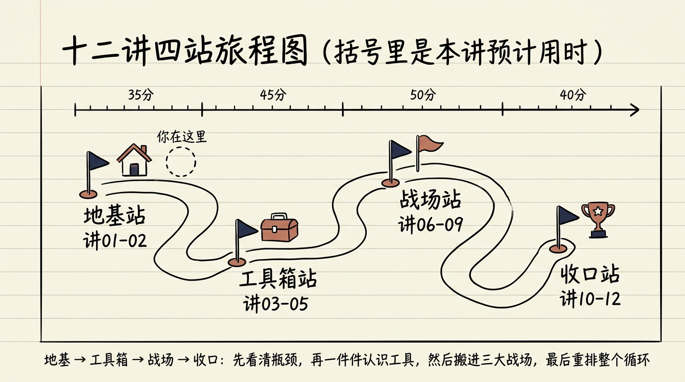

---

## 二、蓝本与证据边界

| 项 | 内容（均已核对 PDF 实物） |
| :--- | :--- |
| 唯一蓝本 | `../资料原件/Machine learning in aerodynamic shape optimization.pdf`（**103 页**：正文 1–68，参考文献 69–103） |
| 实物统计 | **47 幅图**（索引见 `../资料原件/图表索引.md`）、**5 张表** |
| 可检索语料 | `../资料原件/论文全文-提取文本.md`（PyMuPDF 抽取，按页打标记，共 103 个页块） |
| 章节页码 | `../章程与地图/资料映射.md`（由 PDF 书签直读，**不是估算**） |
| 全文覆盖 | **A 级**：本地有全文，正文每一句都能回溯到提取语料的具体页 |

**全书只有一种"已核实"的写法**：正文里每一条数字、每一句"论文说……"，后面都跟着
`〔原文 P## "关键词串"〕`（v2 起降为脚注，正文显示为上标编号，脚注定义行保留完整标签）。

这个标注不是装饰——
`tools/verify_all.py` 的 A 项验收会**逐条把引文串扔回 PDF 语料对应页里做子串匹配**，
匹配不上就整本白皮书不许交付。

写书的人记错页码是常事，所以把记错变成机器报错。

**超出这本综述的内容**（例如 FNO / DeepONet / Transformer / 扩散模型 / SINDy），
一律显式标注 **〔延伸·待核实〕**，不混进正文当论文说的。
查不到出处的一律标 **〔待核实〕** 或不写。

这不是谦虚，是因为作者们实测过：这五类关键词在综述 528 条参考文献里**0 命中**
（复现方法见 `../章程与地图/12篇论文总规划.md` §二），它写不进正文是事实，不是观点。

---

## 三、三条写作铁律（照抄 Mr.GUO 仓库重建版的教训，一条不改）

1. **没有出处的话不写。** 正文每个百分比、倍数、样本量后面都跟着 `〔原文 P## …〕`；
   查不到出处的一律标 `〔待核实〕` 或不写。
2. **跑不通的代码不交。** 第五篇代码由 `code/` 目录下的真实文件自动嵌入，
   每个文件都能 `python3 code/xxx.py` 直接运行并打印自检数字。
3. **对不上的数字不填。** 若通俗说法与原文冲突，以原文为准，并在讲稿里点名旧表述错在哪。

---

## 四、全书地图

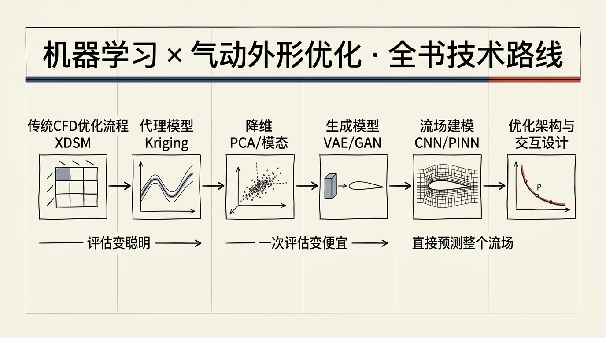

> 上图是这本书的骨架，也是那篇综述的骨架：**先把流程拆开看清瓶颈在哪**（讲 01），
> **再一件件认识工具箱**（讲 02–05），**然后把工具搬进三大战场**（讲 06–08），
> **最后重排整个优化循环**（讲 09–10），并以**批判性阅读**收尾（讲 11–12）。
> 一句话概括这条主线：
> **先让下一次评估变聪明，再让每一次评估变便宜，最后让模型自己学会物理。**
>
> **v2 预计用时**（按字数实测，±20%）：第零章 35 分钟；讲 01–02 各 45–50 分钟；
> 其余各讲 35–45 分钟；代码篇随跑随看；第六篇 20 分钟。

---

## 五、十二讲 ↔ 论文真实章节（对照表，页码来自 PDF 书签）

| 讲 | 覆盖 | PDF 页 | 配图 | 状态 |
| :--- | :--- | :---: | :--- | :---: |
| 01 | §2 全部（2.1 / 2.2） ｜ XDSM 与六个挑战：传统气动外形优化长什么样、卡在哪 | 4–6 | Fig. 1（p5） | ✅ 已完成 |
| 02 | §3.1 ｜ Kriging 及其亲戚：一个全局趋势 + 一张「谁跟谁像」的关系表 | 7–16 | Fig. 2–16（p8–19） | ✅ 已完成 |
| 03 | §3.2 ｜ 降维的本质：把一整个流场压成几个数 | 17–25 | Fig. 17–24（p18–25） | ✅ 已完成 |
| 04 | §3.3–3.4 ｜ 标签不够与没有标签：半监督、RBM/DBN 与强化学习 | 26–31 | Fig. 25–31（p26–31） | ✅ 已完成 |
| 05 | §3.5 ｜ 神经网络全家桶：从 ANN 到 PINN | 32–40 | Fig. 32–41（p32–41） | ✅ 已完成 |
| 06 | §4.1（4.1.1 / 4.1.2） ｜ 几何设计空间：模态参数化与几何过滤 | 41–46 | Fig. 42–44（p44–47） | ✅ 已完成 |
| 07 | §4.2.1–4.2.2 ｜ 气动评估：预测三个系数，还是预测整个流场 | 47–56 | Table 2–3、Fig. 45（p57） | ✅ 已完成 |
| 08 | §4.2.3–4.2.4 ｜ 别让 CFD 从零起跑：加速三招 + 把测不起的约束换成算得起的式子 | 56–58 | Fig. 45（p57） | ✅ 已完成 |
| 09 | §4.3（4.3.1–4.3.4） ｜ 优化架构：代理式、交互式、RL 与生成式反设计 | 58–67 | Fig. 46–47（p64–65） | ✅ 已完成 |
| 10 | §5 Conclusions and Outlook ｜ 作者的三条结论与一句自我批评 | 68 | — | ✅ 已完成 |
| 11 | 全文 + 参考文献 ｜ 批判性阅读：这篇综述的边界与可复现性 | 1–103 | — | ✅ 已完成 |
| 12 | （装配生成） ｜ 知识整合：一页报告与下一步选题清单 | — | — | ✅ 已完成 |

> **本表由 `tools/build_whitepaper.py` 现算（讲稿文件在不在、有没有 `<!-- TBD -->` 标记），不靠手抄。** 当前 **12 / 12** 讲有正文；进度以 `../memory/PROGRESS.md` 为准。

> **诚实声明**：标 ⬜ 的讲次只有骨架——装配脚本会在正文位置**公开挂牌「待重建」**，
> 而不是塞一段话冒充一讲。这一规矩抄自范本仓库旧版"号称篇篇俱全、实则有 9 讲只有一段话"那条教训。

---

## 六、v2 变更公告（2026-09-07）

- **变了的**：每讲 11 节 → 14 节（0–13，加"你在这里 / 上讲的数 / 带走 3 数"）；
  引用降脚注；讲首元数据折叠进审查层；第零章新增 0.5 证据档位（E0–E4）；
  每讲加呼吸点 / 下注 / 打脸装置；图 24 → 58（新图带 `_v2_` 文件名）；
  自测答案改为一题一行 + 推理链。
- **没变的**：1913 条知识原子一条不丢（`tools/knowledge_atoms.py` 抽取，
  `verify_all.py` H 项逐条核）；130 道自测题干逐字保留；133+ 条引用一条不改；
  旧 24 张图全部保留；代码 6 个模块零改动。
- **验收**：`cd 白皮书 && make all`（八项验收，任一 FAIL 不得交付）。
- **进度**：v2 逐讲重写中；已完成的文件头部带 `<!-- v2 -->` 标记，
  未完成的在验收输出里公开挂牌「待 v2」。

<!-- v2 -->
<a id="ch0" name="ch0"></a>
# 第零章 从零地基：一个黑箱、一千次预算与维度灾难

> 本章**不用任何机器学习术语**，也不提前借用后面的概念。
> 它只干一件事：把后面十二讲反复踩的四块地基——**研究对象、CFD、优化、维度灾难**——
> 用大一能算的数学钉死。凡本章定义过的词，后面各讲可以直接用；没定义过的词，必须先定义再用（这是硬规矩）。
>
> 🧭 **怎么读本章**：五站，一站一节。0.1 认对象 → 0.2 认 CFD → 0.3 认优化 → 0.4 算维度灾难 → 0.5 记制度。
> 每站结尾有一个呼吸点，把这一站的账收掉再走。预计 35 分钟。

---

<a id="ch0-1" name="ch0-1"></a>
### 0.1 研究对象：一根会喘气的管子，和它身上最贵的那几片金属

把航空发动机 / 燃气轮机压到最简，它就是一根管子，干四件事：**吸气 → 压缩 → 点火 → 膨胀做功**。

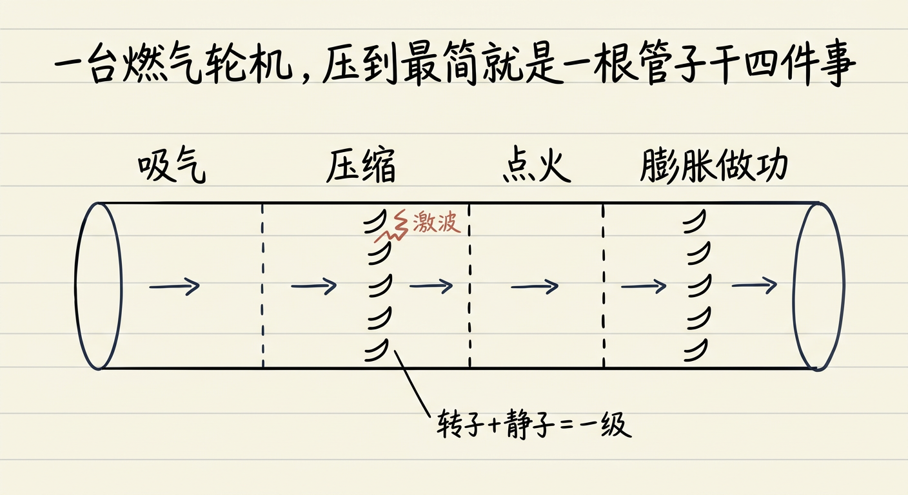

压缩靠**压气机**（转动的叶片排把能量塞进气体）。
做功靠**涡轮**（高温气体推叶片，反过来用一根轴拖着压气机转）。
一对「转子 + 静子」叫一个**级（stage）**——这是全书反复用到的第一个工程量。

**叶片为什么是"最贵的那几片金属"？** 因为它的形状几乎决定一切：

- 形状决定气体在叶道里被加速的程度；加速过头，局部速度接近或超过声速，
  就会冒出一道**激波**——气体穿过激波时压强、密度突变，能量以热的形式白白丢掉。
  （马赫数 M = 速度 ÷ 当地声速，这是本书唯一允许的"新词"，定义在此，后面不再重讲。）
- 形状决定你多花的功能不能换回压力，工程上用**等熵效率** η 记这笔账
  （理想压缩功 ÷ 实际消耗功，无量纲，越接近 1 越省）。
- 形状决定叶片会不会被激波拍得振动、发热、烧蚀。

给个量级感，你就知道"改形状"这件事为什么值得写 103 页综述、开一整条研究线。

本书作者之一的课题组在真实跨声速压气机转子（NASA **Rotor 37**）上做过实验。
当进口流量把叶尖相对马赫数推到极限、喉部出现强正激波时，
效率会直接从 **0.9211** 掉到 **0.872**。

这不是学术指标，这是发动机"喘不上气"的时刻。

> 🧭 **呼吸点**：0.1 的账——**对象是一片叶片的形状**；它的效率 η 会因为一道激波从 0.9211 掉到 0.872。

于是全书的问题可以写成一句小学生都懂的话：

> **有没有办法，用有限次昂贵试验，把一片金属的轮廓改到"刚刚好"？**

这就是**气动外形优化**（Aerodynamic Shape Optimization），缩写 **ASO**。

Aero 气动、dynamic 流动的、Shape 外形、Optimization 优化——
四个词各自干什么，本书后面每一讲都会用到它。

---

<a id="ch0-2" name="ch0-2"></a>
### 0.2 什么是 CFD：把牛顿定律扔给超算，让它自己迭代到不再改变

一片叶片周围的气体不是"一个数"，而是**几百万个点上的流场**：
每个点上都有速度（三个分量）、压强、温度、密度。

**CFD**（Computational Fluid Dynamics，计算流体动力学：
Computational 计算的、Fluid 流体、Dynamics 动力学）干的事就是三步：

1. **离散**：把叶片周围的空间切成网格（十万到几百万个单元），每个单元存一组未知量；
2. **迭代**：把守恒律（质量、动量、能量都要守恒）写成每个单元上的代数方程，
   从一份猜测的初场出发反复更新；每一轮记录一个「残差」——"这一轮比上一轮还改了多少"；
3. **判收敛**：残差一路跌到很小（通常要求降三到四个数量级）才算解出来了。
   再把叶片表面上的压强沿面积**积分**，得到气动力与力矩，
   合成你真正关心的那几个数（效率 η、压比 π、流量 ṁ）。

> 🧭 **呼吸点**：0.2 的账——**CFD = 离散 + 迭代 + 判收敛**。三步全是数学活，没有一步便宜。

**上一段说的三步，画在一起就是这张图**（黑箱的内部）：

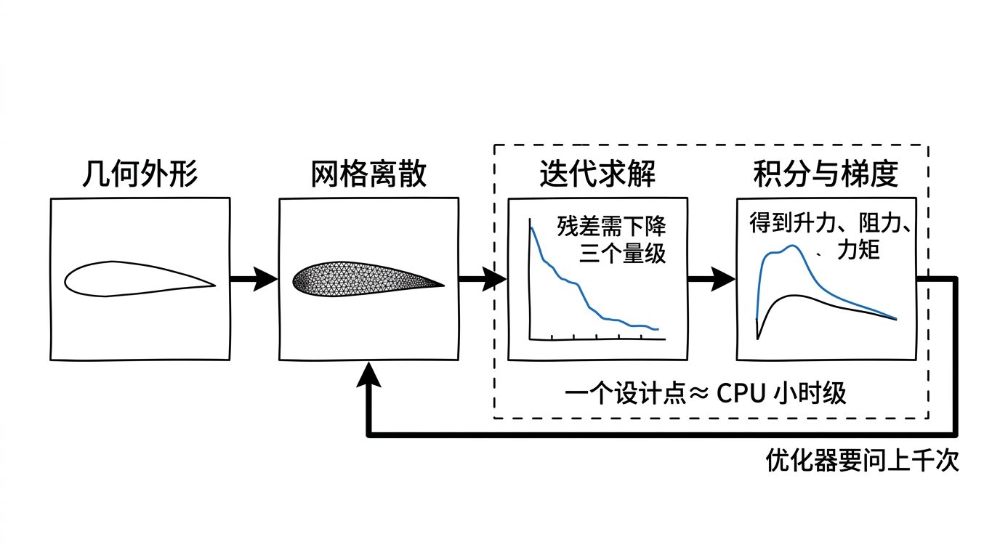

**关键点，也是全书所有麻烦的源头**：一次高保真 CFD 要**几小时到几十小时**。
而且中间任何一次外形畸形（叶型出现波浪状起伏、局部自我交叠），
网格就画不出来、迭代就发散——**这次计算的钱白花**。

下一张图换个视角：上一张画的是"黑箱内部"，这张画的是"黑箱外部"的模块账本
（五个模块怎么分工，讲 01 拆开讲）。

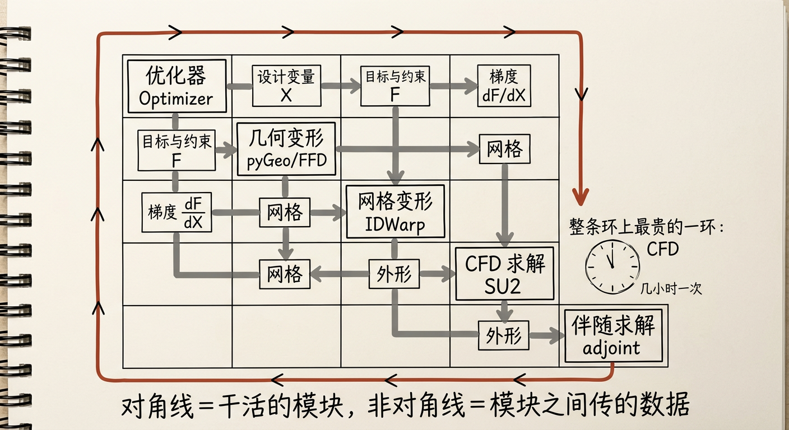

---

<a id="ch0-3" name="ch0-3"></a>
### 0.3 什么是"优化"，以及为什么不能暴力枚举

优化 = 在**设计变量**（design variable，设计里"可由你决定的数"）张成的空间里找一组取值，
让**目标函数**（要最小化的那个数）最好，同时满足**约束**（不能碰的红线，比如最小厚度）。

为什么不能全枚举？先算一笔账：
假设你只留 8 个设计变量，每个变量只想试 10 个取值，组合数是 10^8 = 100,000,000 次 CFD。

🔮 **下注**：每次按 2 小时算，10^8 次要多久？先在纸上写个数字，再往下看。

每次按 2 小时算，需要 **2 × 10^8 小时 ≈ 2.3 万年**。

👊 **打脸**：你刚写的数字，大概率比 2.3 万年小。
1 亿次 CFD 排进对数时间轴，比"人类文明史"还长。

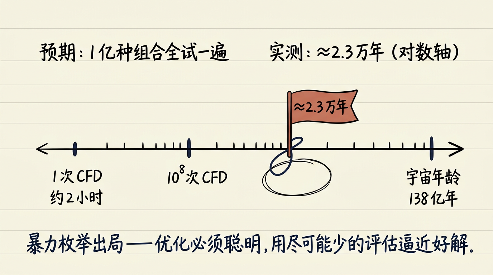

这就是为什么"优化"必须聪明：它要的是**用尽可能少的评估次数逼近好解**。

于是有了两条路线，本书后面所有故事都从这里分叉：

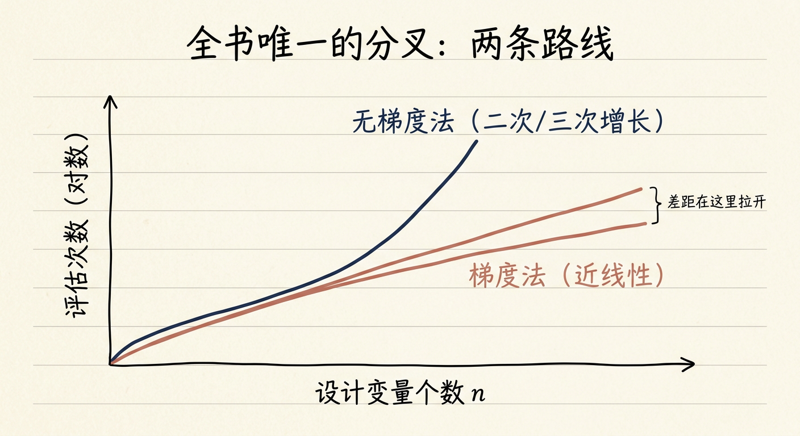

| 路线 | 它需要什么 | 代价 | 高维下的表现 |
| :--- | :--- | :--- | :--- |
| **无梯度法**（遗传算法、粒子群等：只看数字好坏，不看方向） | 只要 CFD 给的目标值 | 每次评估都算一次 CFD | 评估次数随设计变量维度**平方甚至立方**增长 |
| **梯度法**（沿着"下降最快的方向"走） | 还要知道每个设计变量让目标变了多少，即偏导数 ∂f/∂x_i | 求梯度本身要钱 | 增长**接近线性** |

这不是我们编的对比，综述开篇就摆出来了。
作者引 Lyu 等人的基准研究：梯度无关方法的函数评估次数随维度呈二次甚至三次增长[^CH0-1]，
而基于梯度的方法更接近线性趋势[^CH0-2]。

梯度法这么好，可它卡在"求偏导"上：
100 个设计变量，按最笨的有限差分要做 100 次 CFD 才能拿到一个梯度。

**伴随方法（adjoint method）** 把这件事变成"和变量个数无关的一次回代"——
这是讲 02 的主菜，这里只埋线：它是本书里第一个"信息复用"的范例（**算一次，拿回全部**）。

而综述的立论点是：**即便有了伴随，CFD 本身还是贵**。
所以 ASO 依然满足不了某些实际需求，比如快速的交互式优化设计[^CH0-3]。
**机器学习就是从这条缝里挤进来的。**

> 🧭 **呼吸点**：0.3 的账——**三个新词**（设计变量 / 目标函数 / 约束）+ **两条路线**（无梯度贵、梯度近线性）+ **一个埋线**（伴随）。

---

<a id="ch0-4" name="ch0-4"></a>
### 0.4 维度灾难：一道 74 个变量的算术题（本章最重要的一页）

**维度灾难**（curse of dimensionality）这个词被用滥了，滥到没人真去算。
我们算一次，从此它就是你的直觉。

**0.4a 数格子：样本能不能填满空间**

设：设计空间是 d 维盒子，每个方向均匀切成 k 格，格子总数是 k^d。
"样本能不能填满空间"的判据只有一个——**每格摊到几个样本**：

  N 个点均匀撒进 d 维、每维 k = N^(1/d) 格的网格 ⇒ 每格 1 个点

反过来更狠。若你只有 N 个点，却希望每维至少 10 个点才谈得上"采样密"，
需要的样本数是 10^d：

| 维度 d | 你的样本量 N | 每维实际点数 N^(1/d) | 想要"每维 10 点"需要的样本 10^d |
| :---: | :---: | :---: | :---: |
| 1 | 1,000 | 1,000.0 | 10 |
| 3 | 1,000 | 10.0 | 1,000 |
| 8 | 1,000 | 3.2 | 100,000,000 |
| 74 | 1,000 | **1.10** | 10^74 |
| 100 | 1,000 | 1.05 | 10^100 |

**读第 4 行**：74 维、1000 个样本 ⇒ 每个方向平均只有 1.1 个点。
也就是说：**你手上那 1000 组数据，在 74 维设计空间里连"一根线"都算不上，
只是 1000 个互不相邻的孤点。**

更直观地：一个点到"盒子边界"的距离，远大于它到"最近样本"的距离——
高维几何的常识就是"点都很边缘"。

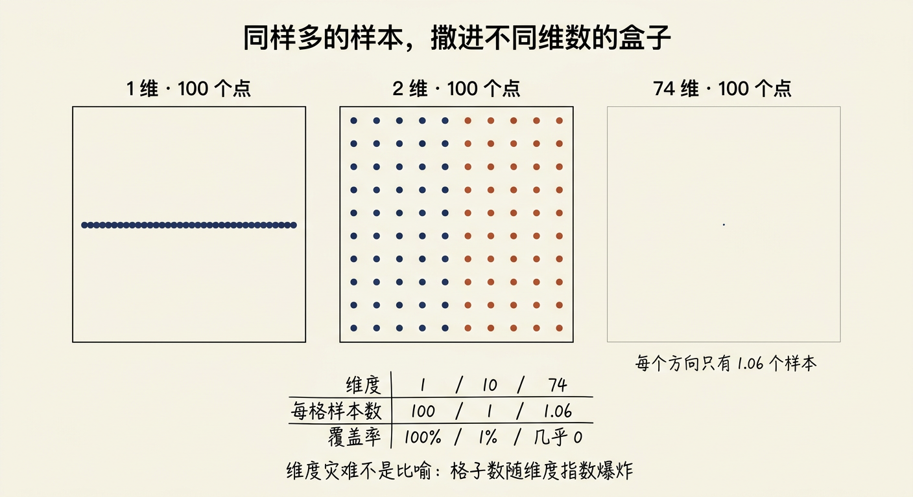

> 🧭 **呼吸点**：0.4a 的账——**1000 个点撒进 74 维 = 每维 1.10 个点 = 1000 个互不相邻的孤点。**

**0.4b 球壳算术："点都很边缘"是算出来的，不是诗**

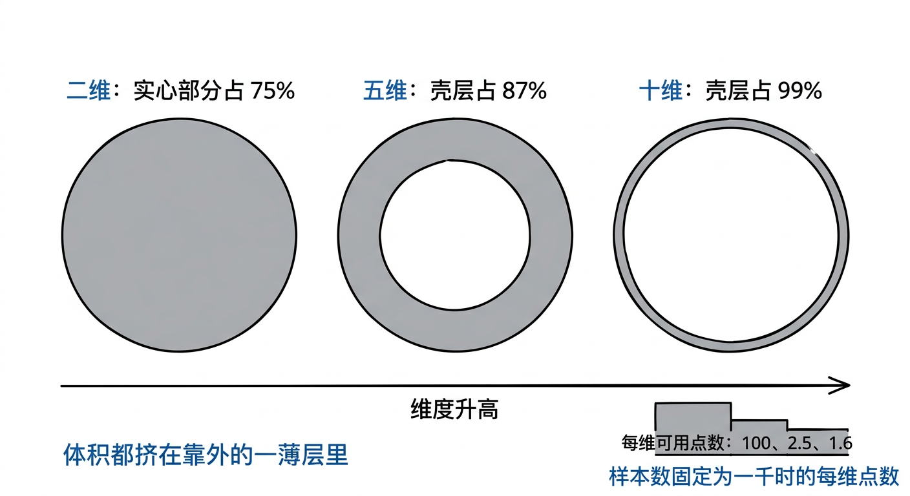

这张图说的就一件事：单位球的体积随维度升高会挤到靠外的一薄层。
半径 0.9 的内球在十维时只剩 1 − 0.87 ≈ 13% 的体积——
所以"点都很边缘"不是诗，是算术。

这直接解释了综述里那句被很多人滑过去的硬约束[^CH0-4]：

> 出于设计目的，训练数据必须包含能充分代表设计空间的样本……
> 需要在所有维度上都分布良好的、足以填满设计空间的样本量。
> 这导致对训练数据的巨大需求，使得把 ML 应用于大规模高维 ASO 变得难以承受。

所以本书第 06 讲的所有花活（模态参数化、几何过滤）本质上只做一件事：**把 d 变小**；
第 07–08 讲的所有花活只做一件事：**让每一次评估变便宜**；
第 09 讲问：**那能不能连循环结构本身也换掉**。

> 🧭 **呼吸点**：0.4 的账——**维度灾难 = 每维摊不到点**。它是第 06–09 讲全部花活的敌人。

---

### 0.5 证据档位 E0–E4（全书制度，只在这里定义一次）

后文会反复出现 E0–E4 这种"口径"标记（比如"E2 代理预测"）。
它们回答一个问题：**这个数字是怎么来的、能信到什么程度**。五档，从松到紧：

| 档位 | 含义 | 你平台上的实例（账本 `corpus/facts/P01-local.md`） |
| :---: | :--- | :--- |
| E0 | 规划：还没做的计划数字 | 3.55M 细网格全闭环（还没跑） |
| E1 | 静态数据：文件里躺着、可复查 | 1,000 组样本、74 维特征定义 |
| E2 | 代理预测：神经网络算出来的，**未经 CFD 验证** | 你的 R² 0.9561、ONNX 单点 0.13 ms |
| E3 | 求解器定性：CFD 跑过，但只能看趋势 | 140k 粗网格 relrms = −3.39（未收敛） |
| E4 | 全闭环 CFD 验证：可对外当结论 | （目前还没有，这是终点） |

两条红线（判卷与写作共用）：**E2 不许写成"已通过 CFD 验证"**；
**E3 不许当定量结果引用**。
14 条项目数字的完整账本见 `corpus/facts/P01-local.md`，每条都挂了一手出处。

---

### 本章收口：下注 + 3 个数

🔮 **下注**：你的 Rotor 37 平台有多少维设计变量？先写数字，再对 0.5 表 E1 那行。

📌 **带走 3 个数**：

1. **10^74**——74 维设计空间里"每维 10 点"需要的样本数；你的 1000 点连一根线都算不上。
2. **2.3 万年**——10^8 次 CFD × 2 小时；暴力枚举从此出局。
3. **两个谈判对象**——**维度 d**（决定要多少数据）与**单次评估成本**（决定你能试多少次）。

> **本章一句话收口**：这门学问的全部技术，都是在跟两个数谈判——
> **维度 d**（决定要多少数据）和**单次评估成本**（决定你能试多少次）；
> 机器学习进场，是因为它给了第三条路：
> **把"算一次 CFD"换成"问一次网络"，把"几百维形状"压成"几十个系数"。**

[^CH0-1]: 〔原文 P3 "quadratic or even cubic growth of function evaluations"〕

[^CH0-2]: 〔原文 P3 "more linear trend"〕

[^CH0-3]: 〔原文 P3 "iterative and costly simulation-based evaluations"〕

[^CH0-4]: 〔原文 P4 "the training data must include samples that adequately represent the design space"〕

## 目录

- [第零章 从零地基：一个黑箱、一千次预算与维度灾难](#ch0)
  - [0.1 研究对象：一根会喘气的管子](#ch0-1)
  - [0.2 什么是 CFD：把牛顿定律扔给超算](#ch0-2)
  - [0.3 什么是"优化"，以及为什么不能暴力枚举](#ch0-3)
  - [0.4 维度灾难：一道 74 个变量的算术题](#ch0-4)
  - [0.5 证据档位 E0–E4](#ch0-5)
- [第一篇 【全景与地基篇】](#part-0)
  - [【讲01】XDSM 与六个挑战：传统气动外形优化长什么样、卡在哪 ｜ §2 全部（2.1 / 2.2） ｜ PDF p4–6](#lec-01)
- [第一篇 【全景与地基篇】](#part-0)
  - [【讲02】Kriging 及其亲戚：一个全局趋势 + 一张「谁跟谁像」的关系表 ｜ §3.1 ｜ PDF p7–16](#lec-02)
- [第二篇 【机器学习工具箱篇】](#part-1)
  - [【讲03】降维的本质：把一整个流场压成几个数 ｜ §3.2 ｜ PDF p17–25](#lec-03)
- [第二篇 【机器学习工具箱篇】](#part-1)
  - [【讲04】标签不够与没有标签：半监督、RBM/DBN 与强化学习 ｜ §3.3–3.4 ｜ PDF p26–31](#lec-04)
- [第二篇 【机器学习工具箱篇】](#part-1)
  - [【讲05】神经网络全家桶：从 ANN 到 PINN ｜ §3.5 ｜ PDF p32–40](#lec-05)
- [第三篇 【ML 进场：ASO 的三大战场篇】](#part-2)
  - [【讲06】几何设计空间：模态参数化与几何过滤 ｜ §4.1（4.1.1 / 4.1.2） ｜ PDF p41–46](#lec-06)
- [第三篇 【ML 进场：ASO 的三大战场篇】](#part-2)
  - [【讲07】气动评估：预测三个系数，还是预测整个流场 ｜ §4.2.1–4.2.2 ｜ PDF p47–56](#lec-07)
- [第三篇 【ML 进场：ASO 的三大战场篇】](#part-2)
  - [【讲08】别让 CFD 从零起跑：加速三招 + 把测不起的约束换成算得起的式子 ｜ §4.2.3–4.2.4 ｜ PDF p56–58](#lec-08)
- [第四篇 【优化架构与结论篇】](#part-3)
  - [【讲09】优化架构：代理式、交互式、RL 与生成式反设计 ｜ §4.3（4.3.1–4.3.4） ｜ PDF p58–67](#lec-09)
- [第四篇 【优化架构与结论篇】](#part-3)
  - [【讲10】作者的三条结论与一句自我批评 ｜ §5 Conclusions and Outlook ｜ PDF p68](#lec-10)
- [第五篇 【实践与代码篇】可运行原型库](#part-4)
  - [`curse.py`](#code-curse-py)
  - [`ego.py`](#code-ego-py)
  - [`gek.py`](#code-gek-py)
  - [`kriging.py`](#code-kriging-py)
  - [`modal.py`](#code-modal-py)
  - [`pca.py`](#code-pca-py)
- [第六篇 【批判、对比与前瞻篇】](#part-5)
- [【讲12】知识整合：一页报告与下一步选题清单](#lec-12)

---

> 📌 **本文件由 `tools/build_whitepaper.py` 自动装配生成，请勿直接编辑。**
> 要改内容请改 `docs/lectures/` 下的讲稿源文件，然后重跑装配脚本；验收请跑 `python3 tools/verify_all.py`。
> 内容版本：src-6e68bbeee7eb（讲稿/代码源文件内容哈希；源不变则装配结果逐字节不变）

---

<a id="part-0" name="part-0"></a>
# 第一篇 【全景与地基篇】

本篇覆盖**讲 01–02**。它只回答一个问题：**CFD 驱动的气动外形优化到底卡在哪，机器学习又是从哪条缝里挤进来的。** 先用一张 XDSM 把传统流程拆成五个模块、五种数据，再把论文 §2.2 的六个挑战逐条摊开；然后从最老牌的代理模型 Kriging 讲起——因为今天所有「用神经网络替 CFD」的野心，都是它那句「我顺便告诉你我有多不确定」的延长线。

<a id="lec-01" name="lec-01"></a>
<!-- v2 -->
### 【讲01】XDSM 与六个挑战：传统气动外形优化长什么样、卡在哪
**覆盖论文 §2 全部（2.1 General Process / 2.2 Existing Challenges）｜ PDF 第 4–6 页 ｜ 配图 Fig. 1（p5）**

---

#### 0. 本讲元数据

| 项 | 值 |
| :--- | :--- |
| 本讲范围 | §2（p4–6）＋ p5 的 Fig. 1（XDSM 流程图） |
| 前置 | 只需第零章（0.1 研究对象 / 0.2 CFD / 0.3 优化 / 0.4 维度灾难 / 0.5 证据档位） |
| 读完你应该能 | ① 徒手画出 CFD 驱动 ASO 的五模块 XDSM 并指出瓶颈环节；② 背出 §2.2 六个挑战（≥4）并各自说出一句"它为什么贵"；③ 把挑战①③④对准你自己平台的三处代码 |

<details>
<summary>审查层（导师验收用：蓝本 / 证据等级 / 装配信息）</summary>

| 项 | 值 |
| :--- | :--- |
| 蓝本 | Li, Du, Martins, *Machine Learning in Aerodynamic Shape Optimization*, Prog. Aerosp. Sci. 134 (2022) 100849 |
| 证据等级 | **A 级**：本地有全文，本讲每一条都能在 `../资料原件/论文全文-提取文本.md` 对应页回溯 |
| 本讲一句话 | **传统 ASO 不是不聪明，是"每一步都要用几小时换几个数"；机器学习是被这堵墙逼进来的。** |

</details>

---

#### 1. 你在这里

12 讲第 1 站（地基）：先看传统流程长什么样，再精确定位它卡在哪一格。
**你的平台·第 1 站**：74 维统计特征 → 几何生成 → SU2 网格 → SU2 CFD →（缺）伴随。
本讲会让你看见这条链缺的是哪一格。

---

#### 2. 上讲的数

⏪ **上讲的数** · 第零章的两个数，合上书各报一个：

1. 74 维设计空间里，"每维 10 个点"需要多少个样本？
2. 10^8 次 CFD、每次 2 小时，约等于多少年？

<details>
<summary>答案</summary>

1. 10^74（你的 1000 个点连一根线都算不上）。
2. 2 × 10^8 小时 ≈ 2.3 万年（暴力枚举出局）。

</details>

---

#### 3. 场景引子：五种人围着一张桌子转

想象一个必须闭环的评图现场：

- **甲方**（优化器）：只说"再往这个方向改一点"，自己不会画图也不会算；
- **建筑师**（几何参数化）：把"改一点"翻译成新的控制点坐标；
- **结构助理**（网格变形）：建筑一改，他手上那张有限元网格必须跟着挪；
- **评审专家**（CFD 求解器）：坐下去算几小时，给一个分数；
- **速记员**（伴随求解器）：同一晚顺手把"每个参数各影响多少分"全抄下来。

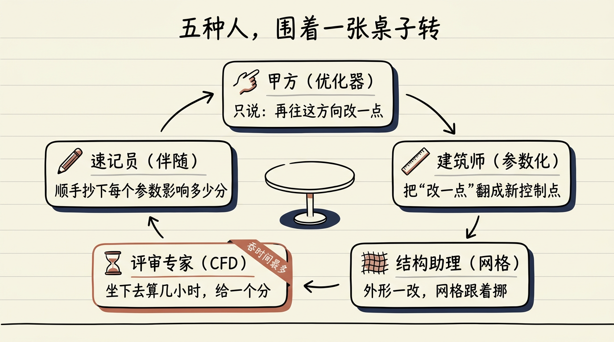

这五个角色之间**传递了什么**、**谁等谁**，就是 XDSM 要画的东西。
它的用处不是好看，是让你一眼看出：**哪一格最贵、哪一格在串行浪费所有人的时间**。

> **一句话记住**：XDSM 是"谁把什么交给谁"的账本；
> 对角线上是**干活的模块**，非对角线是**模块之间传的数据**。

---

#### 4. 工程死穴：把"慢"精确定位到哪一格

**先认词 · 第一批**（本讲所有新词都在此定义，后面不再解释）

| 中文 | 英文 | 一句操作定义 |
| :--- | :--- | :--- |
| 设计变量 | design variables | 你能改、优化器也能改的那组数（如 FFD 控制点坐标）。它是"输入向量 x" |
| 目标函数 | objective function | 要最小化的那个标量（论文惯例：把最大化升阻比写成最小化 −L/D） |
| 气动外形参数化 | geometric parameterization | 把"形状"编码成"有限个数"的映射；正向：数 → 外形 |
| FFD | Free-Form Deformation，自由变形：Free 自由、Form 外形、Deformation 变形 | 在物体外套一层弹性控制网格，挪控制点，物体跟着光滑变形；控制点数＝设计变量数 |

**先认词 · 第二批**

| 中文 | 英文 | 一句操作定义 |
| :--- | :--- | :--- |
| 网格变形 | mesh deformation | 外形改了，CFD 那张体网格必须跟着改；MACH-Aero 用反距离法 IDWarp |
| 伴随求解器 | adjoint solver | 一次回代算出目标函数对**全部**设计变量的偏导（讲 02 详讲机制） |
| XDSM | eXtended Design Structure Matrix，扩展设计结构矩阵 | 方格表：对角线＝模块，非对角线＝数据，箭头＝执行顺序 |
| SLSQP / SNOPT | 两种梯度优化算法 | Sequential Least Squares Programming / SQNonlinear Programming，都是"给梯度和边界、返回下一组 x"的黑盒 |

论文用开源框架 **MACH-Aero** 作为 CFD-based ASO 的代表，并把整个流程用 XDSM 画出来[^L01-1]。
对照 Fig. 1，本讲把流程拆成可操作的五步：

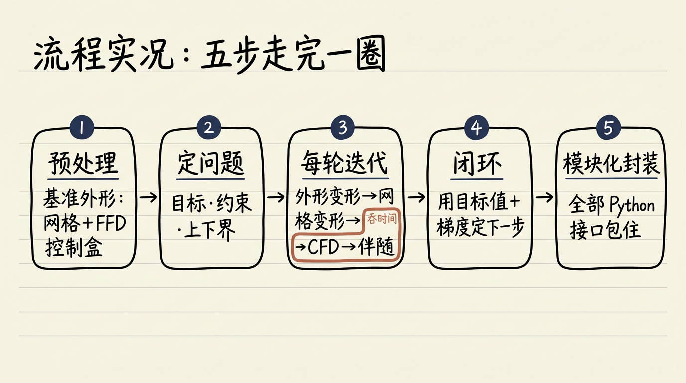

1. **预处理**：为基准外形建立 CFD 网格与初始几何参数化（例如 FFD 控制盒）[^L01-2]；
2. **定问题**：通过 Python 接口在优化器里定义目标函数、约束与设计变量上下界[^L01-3]；
3. **每轮迭代**：优化器决定怎么更新设计变量 → 外形变形 → 评估几何约束及其导数 → 体网格变形 → 跑 CFD → 伴随求解器算气动导数[^L01-4]；
4. **闭环**：优化器用目标值与梯度定搜索方向与步长，得到下一轮的 x；
5. **模块化封装**：MACH-Aero 里所有部件都用 Python 接口包起来[^L01-5]。
   pyGeo 做 FFD/OpenVSP、IDWarp 变网格、ADflow/DAFoam 求解并带伴随。

论文还点名：**SU2 是同一套流程的另一个实现**——
SU2 GEO 做 FFD 参数化并评估几何约束（值与导数）、SU2 CFD 跑正向与伴随[^L01-6]。

SU2 DOT 求气动导数、SU2 DEF 在 x 更新后变形网格，默认优化器是 SciPy 的 SLSQP。

**这就是你每天都在敲的那四个命令**，只是原文把它的学术位置说清楚了。

> 🧭 **呼吸点**：§4 的账——五角色、五步走，整条链里只有 CFD 一格吞时间；
> 你平台缺的那一格是伴随。

> **配图位置**：XDSM 的模块-数据关系图已放在第零章 0.2 末尾（`images/L01_s2_xdsm_matrix_zh.png`），
> 此处不重复贴图；读图方法见本讲 §7。论文实物是 Fig. 1（PDF p5），建议你**先自己画一遍再去看原图**。

> **本讲第一记暴击**：整个循环里，**唯一"只输几个数、却吞掉全部时间"的环节是 CFD 那一格**。
> 后面十讲无论多花哨，本质上都在做两件事之一：
> **少进这一格**（代理模型/降维）或**让这一格便宜**（算子/加速）。

---

#### 5. 数学从 0 到 1：为什么"必须梯度"，以及梯度为什么买得起

**第一步：数一数无梯度法要付多少钱。**
第零章 0.3 已给出论文的定性论断（二次到立方增长 vs 近线性）[^L01-7]。
现在把它算成一个数：设"要评估的次数 ≈ c^n"（c 为常数、n 为设计变量个数）：

- n = 8，c = 5 → 5^8 = **390,625** 次 CFD；按 2 小时一次 = 89 年。
- n = 20，c = 5 → 5^20 ≈ **9.5 × 10^13** 次。宇宙年龄约 4.3 × 10^17 秒，也不够你花。

这**不是**吓你，这解释了为什么遗传算法/粒子群在真实叶栅上永远只能玩"小维数玩具题"。

**第二步：梯度法要什么。** 它要 ∇f = (∂f/∂x_1, …, ∂f/∂x_n)。
最笨的求法是中心差分：每个变量扰动两次 → **2n 次 CFD**。
n = 100 就是 200 次 CFD 换一个梯度方向——**比无梯度还慢**。

**第三步：伴随把 2n 次砍成 1 次。**
一句话机理（严格版在讲 02 与 P02 那篇伴随综述）：
CFD 求解器内部是"一串复合映射"（网格 → 残差 → 系数 → 目标）。

若从**输入端**往回推，每换一组输入扰动就要重跑一遍；
若从**输出端**把链式法则反过来算一次，
则**同时**得到它对每个输入的偏导——
这正是深度学习的反向传播干的同一件事。

论文原话：**伴随方法以与设计变量个数无关的成本精确计算气动导数**[^L01-8]，
并且其 Jacobian-free 实现靠的是**源代码变换的自动微分**[^L01-9]。

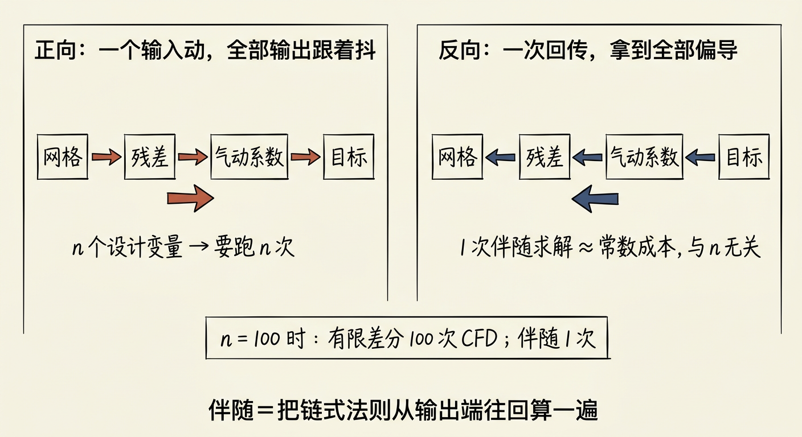

👊 **打脸**：求梯度不贵，是你买错了。n = 100：有限差分付 200 次 CFD，伴随付 1 次。

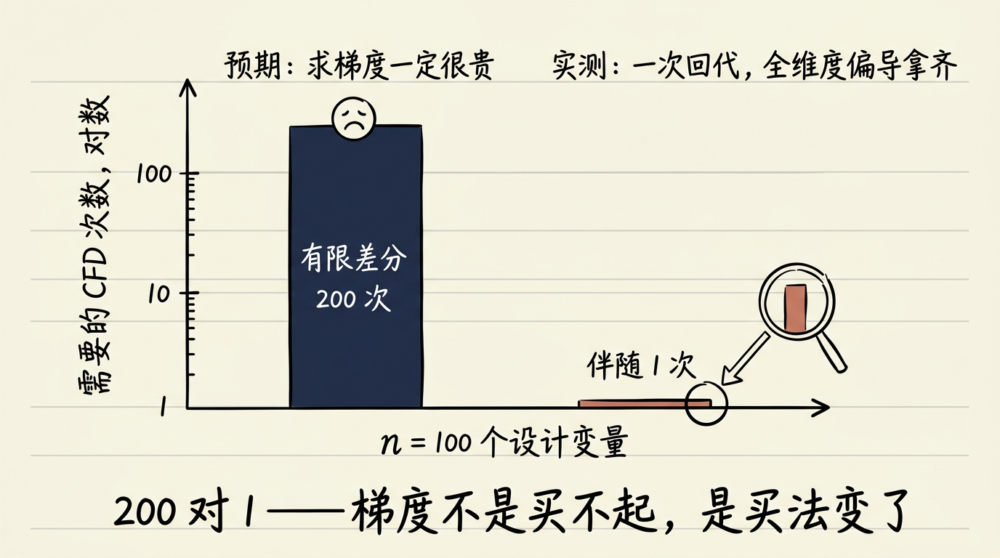

**第四步：既然梯度这么强，为什么还要机器学习？**（这是 B4 那个问题的正解）

因为**梯度便宜 ≠ 整条链便宜**：每一步迭代仍要一次真实 CFD（几小时），
而多目标、鲁棒、设计点外约束、几何合法性这些事会把"迭代步数"乘上十到百倍。

论文 §1 的结论：即便有伴随，ASO 仍满足不了"快速交互式优化设计"这类实际需求[^L01-10]。

**ML 的位置就是：把"每步一次的 CFD"换成"每步一次的神经网络"，
代价是精度、外推风险与训练成本——这三笔账后面各讲逐一摊开。**

> 🧭 **呼吸点**：§5 的账——**无梯度贵（c^n）、梯度要 2n 次、伴随只要 1 次、但每步仍有一次 CFD**。
> 卡住了？重看上面那张 200 对 1 的条形图：贵的那根是有限差分，矮的那根是伴随。

---

#### 6. 论文 §2.2 的六个挑战：一条一条背下来

作者把困难写成**两个复合挑战**：气动分析的高计算成本 + 几何设计空间的高维性[^L01-11]，
然后在 §2.2 展开成六条（**编号按原文顺序**，"First/Second/…/Lastly"）：

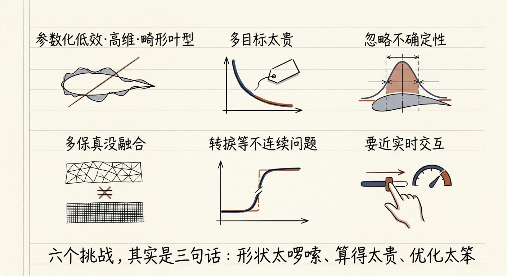

| # | 挑战（原文口径） | 机理：为什么致命 | 你的平台里对应哪一处 |
| :---: | :--- | :--- | :--- |
| ① | **参数化低效**：高维设计空间里有大量**畸形形状**区域 | 变量一多，空间里就出现波浪面之类异常外形；CFD 对它们"耗时甚至无法收敛"，可能直接导致优化失败[^L01-12] | NSGA-II 在 74 维里随机采样 → 大量畸形叶型 → SU2 不收敛（你的 E3 日志就是这个） |
| ② | **多目标 CFD 优化太贵** | 没有高效算法求解高维多目标；常用替代是"化成一串单目标逐个解"，只找到 Pareto 前沿上**寥寥几个点**且不保证分布均匀[^L01-13] | 你的 100 × 200 代是在**代理模型**上跑的；换成真 CFD，直接不可行 |
| ③ | **确定性优化忽略了不确定性** | 工况波动、磨损与制造误差是随机的；忽略它会造成实际性能意外损失。补救办法（加设计点 / 用随机指标）又**大幅增加成本**[^L01-14] | MC Dropout 的 UQ 就是在补这一格——你的覆盖率 η 65% 是这一格**有多难**的实测证据 |
| ④ | **缺把不同数据与模型一起用起来的技術** | Euler / RANS / 粗网格 / 实验数据都在手边，"理想情况下应当用实验数据补充多保真数值模拟来指导优化"，但没有成熟融合手段[^L01-15] | 140k 粗网格 vs 3.55M 细网格：你有两档保真度，**却没有任何融合模型**（这就是 Co-Kriging 的位置，讲 02） |
| ⑤ | **不连续问题**梯度法啃不动 | 低雷诺数下转捩主导，模型里存在**没有连续导数的函数**，给伴随实现带来困难；高维进一步放大；不连续目标函数本身就不适合梯度法[^L01-16] | 激波出现时的 η 突降（你的 0.9211 → 0.872，**E3 定性证据**）是同一族问题：目标面有拐点 |
| ⑥ | **交互式优化**要求近实时 | 高保真仿真成本使"交互回合"太慢，谈不上 interactive[^L01-17] | 你的 ONNX 0.13 ms / API 1.85 ms 与 WASM 前端，**恰好就是这条挑战的工程答案**（口径：E2） |

> 🧭 **呼吸点**：§6 的账——六挑战 = 3 条设计空间的病（①③⑤）+ 3 条评估与循环的病（②④⑥）。

> **读法提示（本讲的方法论）**：作者列挑战的顺序不是随机的——
> ①③⑤是"设计空间本身"的病，②④⑥是"评估与循环"的病。
> 记住这个"3 + 3"的分组，比背六条有用得多。

🔮 **下注**：①–⑥ 里哪几条打在你平台上？先在纸上圈出来，再对 §10 的表。

---

#### 7. 数据与图表：怎么读 Fig. 1（你的审美挑剔在这里最有用）

> **配图位置**：XDSM 的模块-数据关系图在第零章 0.2 末尾（`images/L01_s2_xdsm_matrix_zh.png`），
> 此处不重复贴图。论文实物是 Fig. 1（PDF p5）。

**怎么读它**：先只看对角线（五个模块），问"哪一格在等人"；
再看灰粗线（数据流），问"哪份数据被反复搬运"；
最后看黑色细线（执行顺序），问"有没有可以并行却被串起来的两格"。

**这图好在哪**：一张矩阵同时装下"模块 / 数据 / 顺序"三种信息，XDSM 的标配优点；
且它用的是**真实开源工具名**（pyGeo / IDWarp / ADflow / DAFoam / pyOptSparse），可以直接对着敲。

**可以挑剔的地方**（我们的判断，不是论文说的）：
① 图上没有标"成本"，读者无法一眼看出瓶颈量级，若加一列"每次调用耗时"教学价值立刻翻倍；

② 没有画出"几何合法性/过滤"这一格，而它正是 §4.1.2 的重头戏——流程图为"标准流程"服务，为"改进点"留白。

---

#### 8. 审稿人批判（本讲可攻击的点，含对论文本身的）

1. **§2 的"两个复合挑战"与"六个挑战"关系没量化**：文中给了 ①–⑥ 的定性描述，却没给"各挑战在典型问题上损失多少百分比"的量表；
2. **以 MACH-Aero 为例有代表性偏差**：论文自己说"总体流程与其他 CFD-based ASO 框架相似"，但 SU2 / 自研平台的**网格自适应**与**并行策略**差异会显著改变瓶颈位置；
3. **⑥"交互式"在 2022 年的口径与今天不同**：当时把 ANN 推理当"近实时"（毫秒级），今天还要考虑前端部署、精度保证与失效兜底；
4. **③与④其实可以合并成"多源信息利用"**：把它们拆开列，容易让初学者误以为是两件独立的事。

---

#### 9. 承前启后

- **承前**：本讲承接第零章的两个数——**维度 d** 与**单次成本**；本讲把这两个数落到具体模块上（①对应 d，②⑥对应成本）。
- **启后**：①→讲 06（模态参数化 / 几何过滤）；②④→讲 02（Kriging / Co-Kriging / GEK）与讲 09（代理式优化怎么排布点）；③→讲 02 的"Kriging 自带置信区间 vs 你的 MC Dropout"；⑤→讲 09（无梯度/RL 路线）；⑥→讲 09 的交互式设计（Fig. 46）。

---

#### 10. 你的项目接哪一步（六层阶梯的"回收"层）

| 本讲概念 | 你代码里对应的动作 |
| :--- | :--- |
| XDSM 五模块 | `参数化(74维统计特征) → 几何生成 → SU2 网格 → SU2 CFD → (缺) 伴随`：**你缺最后一格**，所以只能用 NSGA-II，这就是挑战①②⑤在你身上的合流 |
| 挑战①畸形形状 | 建议在 NSGA-II 采样后、调 CFD 前插一个**几何合法性判别器**（讲 06），把"算不出来"的候选先扔掉——这一步不改模型，只省钱 |
| 挑战③不确定性 | MC Dropout 的覆盖率必须如实披露（65% 就写 65%），它是挑战③难度的证据，不是缺陷掩盖对象 |
| 挑战⑥交互式 | 你的 ONNX/WASM 路径正是论文 Fig. 46 想让你做到的事；对外说"100,000×"时要限定为**推理成本比**，不是"优化快十万倍" |

🛠 **修复清单**（全书连载，本讲新增）：

- **#1 插几何合法性判别器**（输入 74 维向量 → 输出 0–1 分数，代价是一次性训练一个 CNN）——不改模型，只省钱。

---

#### 11. 自测 10 题（2 选择 + 2 填空 + 6 问答；合上论文作答）

1. （选）XDSM 的对角线方格表示：A 数据 B 执行模块 C 顺序箭头 D 约束
2. （选）下列哪项**不是** §2.2 列出的挑战：A 多目标太贵 B 忽略不确定性 C GPU 显存不足 D 不连续问题难用梯度法
3. （填）论文用两个"复合挑战"概括 ASO 的困难：气动分析的高计算成本，以及 ____________。
4. （填）MACH-Aero 做体网格变形所用的方法是 ____________（一个三字中文＋英文缩写）。
5. （答）用不超过 30 字说明：为什么"有了伴随方法"仍然需要机器学习？
6. （答）写出挑战①的因果链，必须包含"畸形外形"与"不收敛"两个词。
7. （答）为什么"化多目标为一串单目标"这条路只能给你几个 Pareto 点，而且不保证均匀？
8. （答）你的 Rotor 37 平台现在卡在①–⑥里的哪几条？各举一条你日志里的证据（口径 E1–E4 要写清）。
9. （答）如果只允许你在 XDSM 里加一个模块来省钱，加哪一格？说清它的输入、输出与训练代价。
10. （答）批判性题：为什么说"两个复合挑战 vs 六个挑战"这种编号差异，本身是一个可以在组会上讲的观察？

**答案要点**（一题一行，先做再看）：

1. B——对角线 = 干活的模块。
2. C——GPU 显存不足不是 §2.2 列出的挑战。
3. 几何设计空间的高维性[^L01-11]。
4. 反距离法 IDWarp。
5. 因为每步仍要一次昂贵 CFD，交互式做不到。
6. 变量多 → 空间含大量异常外形 → CFD 耗时或发散 → 优化失败。
7. 每个单目标解只换一个权衡点，且加权法会跳过非凸段。
8. 见本讲表格，注意 E2/E3 不许混档。
9. 几何过滤/合法性判别器（讲 06）：输入 74 维向量，输出 0–1 分数，代价是一次性训练一个 CNN。
10. 因为它暴露"综述的组织方式"与"问题的真实耦合方式"不一致，属于可写进审稿意见的观察。

---

#### 12. 带走 3 个数

📌 **带走 3 个数**：

1. **5 模块**——XDSM 对角线：预处理 / 定问题 / 每轮迭代 / 闭环 / 封装；吞时间的是 CFD 格。
2. **六挑战 = 3 + 3**——①③⑤ 是设计空间的病，②④⑥ 是评估与循环的病。
3. **200 vs 1**——n = 100 时有限差分要 200 次 CFD，伴随只要 1 次。

---

#### 13. 一句收口

> **流程看得懂、账算得清、六个挑战各归其位——你才有资格谈"我用机器学习改进了哪一步"。**

[^L01-1]: 〔原文 P5 "The workflow for the MACH-Aero framework"〕

[^L01-2]: 〔原文 P5 "the CFD mesh and the initial geometric parameterization"〕

[^L01-3]: 〔原文 P4 "objective function, constraints"〕

[^L01-4]: 〔原文 P5 "the gradient-based optimizer determines how to update the design variables"〕

[^L01-5]: 〔原文 P6 "all the components are wrapped using a Python interface"〕

[^L01-6]: 〔原文 P6 "SU2 CFD performs both direct and adjoint computations"〕

[^L01-7]: 〔原文 P3 "quadratic or even cubic growth of function evaluations"〕

[^L01-8]: 〔原文 P3 "at a cost independent of the number of design variables"〕

[^L01-9]: 〔原文 P5 "Jacobian-free implementation using source code transformation algorithmic differentiation"〕

[^L01-10]: 〔原文 P3 "iterative and costly simulation-based evaluations"〕

[^L01-11]: 〔原文 P5 "two compounding challenges in ASO"〕

[^L01-12]: 〔原文 P6 "abnormal shapes, such as wavy airfoil surfaces"〕

[^L01-13]: 〔原文 P6 "only a few points in the Pareto frontier"〕

[^L01-14]: 〔原文 P7 "Ignoring these uncertainties may in practice lead to unexpected performance loss"〕

[^L01-15]: 〔原文 P7 "lack of techniques to utilize"〕

[^L01-16]: 〔原文 P7 "there are discontinuous ASO problems"〕

[^L01-17]: 〔原文 P7 "interactive design optimization where aerodynamic evaluations run near instantaneously"〕

---

<a id="lec-02" name="lec-02"></a>
<!-- v2 -->
### 【讲02】Kriging 及其亲戚：一个全局趋势 + 一张「谁跟谁像」的关系表
**覆盖论文 §3.1（监督学习：KNN / SVM / 决策树与随机森林 / 传统代理模型）｜ PDF 第 7–16 页 ｜ 配图 Fig. 2–16（p8–19）**

---

#### 0. 本讲元数据

| 项 | 值 |
| :--- | :--- |
| 本讲范围 | §3.1.1–§3.1.4（p7–16）；核心是 p13–16 的 Kriging / GEK / Co-Kriging |
| 前置 | 第零章 0.2–0.4；讲 01 的"六挑战②④"与"伴随＝一次算全梯度" |
| 读完你应该能 | ① 写出 Kriging 的预测均值与方差结构并说明 f、R、θ 各干什么；② 手算一次 EI；③ 说清 GEK 为什么和伴随方法是"天配"；④ 讲明白"Kriging 为什么在 10^5 样本处失效、在 74 维处精度掉" |

<details>
<summary>审查层（导师验收用：蓝本 / 证据等级 / 装配信息）</summary>

| 项 | 值 |
| :--- | :--- |
| 蓝本 | Li, Du, Martins, *Machine Learning in Aerodynamic Shape Optimization*, Prog. Aerosp. Sci. 134 (2022) 100849 |
| 证据等级 | **A 级**（本讲每个数字与公式都有 `〔原文 P## "…"〕`，由 `tools/verify_all.py` 逐条核） |
| 新增工具 | 无（本讲刻意不用神经网络；代理模型的深度学习版本在讲 05/07） |
| 本讲一句话 | **代理模型的真正卖点不是"快"，是"我顺便告诉你我有多不确定"——这句话养活了整个 EGO 家族。** |

</details>

---

#### 1. 你在这里

12 讲第 2 站（工具箱站）：第 1 站看清了传统流程是 CFD 那一格吞时间，
第 2 站开始认识工具箱里最老牌的家伙——**Kriging**。

**你的平台·第 2 站**：你手里已经有一个深度残差代理
（R² 0.9844/0.9561/0.9827，口径 E2），但它**给不出 σ**。
本讲补的就是这块：一个会自报家门不确定性的模型长什么样。

---

#### 2. 上讲的数

⏪ **上讲的数** · 讲 01 的两个数，合上书各报一个：

1. n = 100 个设计变量时，有限差分付几次 CFD 换一个梯度？伴随付几次？
2. §2.2 六个挑战的"3 + 3"分组怎么分？

<details>
<summary>答案</summary>

1. 有限差分付 2n = 200 次，伴随付 1 次。
2. ①③⑤ 是设计空间的病（畸形外形 / 忽略不确定性 / 不连续），
   ②④⑥ 是评估与循环的病（多目标太贵 / 缺多保真融合 / 交互式太慢）。

</details>

---

#### 3. 场景引子：三种"猜地形"的方式

你在一片陌生山地测了 20 个点的海拔，现在要你猜任意位置的高度。有三种猜法：

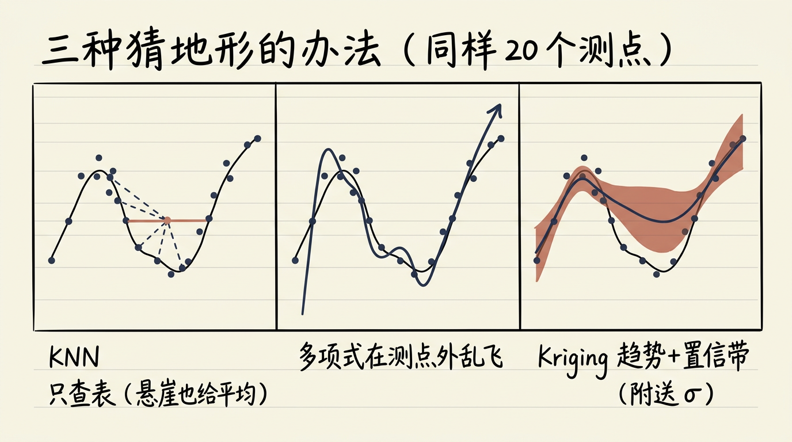

- **KNN（k-Nearest Neighbors，k 最近邻：k 是邻居个数、Nearest 最近、Neighbors 邻居）**：
  找离你最近的 k 个测点，取平均。**它不建模，只查表**；测点之间是悬崖它照样给你个平均值。
- **多项式响应面**：拿一个 2 次或 3 次多项式去拟合全部 20 个点。便宜、光滑、可导，
  但它在没测过的地方**胆大到离谱**（多项式在测点外会飞出去）。
- **Kriging（也叫高斯过程回归）**：拟合一条全局趋势，**再**给每个位置一个"邻居权重表"做局部修正，
  并附送一个标准差 σ —— "这里我拿不准"。

论文对这一族有一个精确定位：代理模型（metamodel）是**一类特殊的监督学习算法**，
用简单代数运算近似仿真输出，在"需要快速反应"时替代昂贵仿真模型[^L02-1]。

> 🧭 **呼吸点**：§3 的账——三种猜法：KNN 查表、多项式乱飞、Kriging 附"我有多不准"的条（σ）。

---

#### 4. 工程死穴 + 先认词：高维 + 小样本，两头不讨好

**先认词 · 第一批**（本讲所有新词都在此定义，后面不再解释）

| 中文 | 英文 | 一句操作定义 |
| :--- | :--- | :--- |
| 基函数 / 趋势函数 | basis / trend function f(x) | 先验的全局形状假设（常数、线性、带交互的二次），是"大方向" |
| 相关函数 | correlation function R(x, x′) | 两个样本"有多像"的打分函数，取值 0–1，距离越远越接近 0 |
| 相关矩阵 | correlation matrix R | N×N 表，R_ij = R(x_i, x_j; θ)，把"谁跟谁像"全记下来 |
| 超参数 | hyperparameters θ | 每个维度一个，控制"相关范围有多大"；由极大似然估计（maximum likelihood estimation）拟合 |
| 置信区间 | predictive confidence interval | 均值 ± 1.96 σ，"模型自己承认不确定的范围" |

**先认词 · 第二批**

| 中文 | 英文 | 一句操作定义 |
| :--- | :--- | :--- |
| 梯度增强 Kriging | GEK = Gradient-Enhanced Kriging | Enhanced 增强的是"信息量"：把 ∂y/∂x 也当数据喂进模型，**不是**梯度下降 |
| 协同克里金 | Co-Kriging / cokriging | 用便宜的低精度数据搭梯子，再学"高精度 − 低精度"的差 |
| 多项式混沌展开 | PCE = Polynomial Chaos Expansion | 用正交多项式基展开随机输入 → 解析地算出均值与方差（连概率论课题 08 的矩） |
| EGO | Efficient Global Optimization | 用"期望改善 EI"决定下一个点算哪儿，靠的就是上面那条置信区间 |

死穴在于两个数字：论文说传统代理模型**训练慢**、且**精度随维度上升而下降**（维度灾难）。

Bouhlel 等人用偏最小二乘（partial least squares）在若干方向上训练 Kriging 超参数，
在**最高到 100 维**的数值问题上取得显著计算收益，但精度仍随维数下滑[^L02-2]。

另一头：**样本一多就崩**——传统代理不适合处理大规模训练数据[^L02-3]。

该页讲的混合专家 ME 正是为绕开这一点：
Li 等人用基于 k-means 的 ME 处理了 **100,000 以上**的训练样本[^L02-4]。

**另注**：GEK 一节会用到"用 PLS 大幅减少超参数个数"这一手——原文写法是 partial-least squares（带连字符）[^L02-5]。

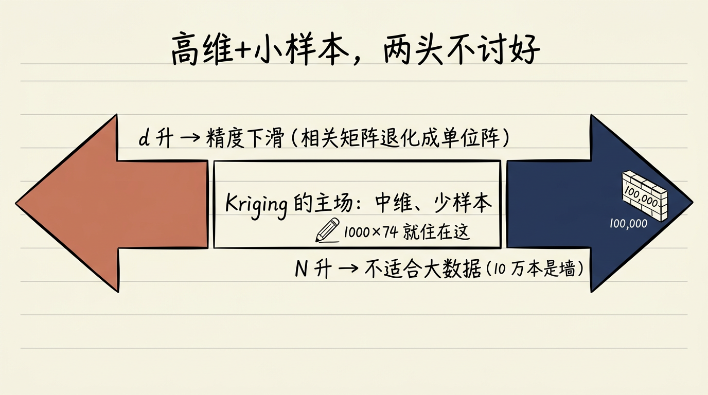

> 🧭 **呼吸点**：§4 的账——两个红字：**精度随维度上升而下降** + **不适合大数据**。
> Kriging 的主场是"中维、少样本"——恰好是你的 1000×74 的地盘。

---

#### 5. 数学从 0 到 1：把 Kriging 拆到能默写

**第一步：模型怎么写。** 论文式 (11)：把任意有限个响应视为多元正态

  Y^KR(x) = β f(x) + σ² Z

其中 f 是基函数向量、β 是待定系数、σ² 是高斯过程方差、Z 是零均值单位方差的平稳高斯过程[^L02-6]。

**第二步：预测怎么算。** 由"预测点与训练点联合正态"（式 12）导出均值与方差（式 13–14）：

  μ(x′) = f(x′)ᵀ β + r(x)ᵀ R⁻¹ (y − F β)   —— 全局趋势 + **局部修正**

  σ²(x′) = σ² ( 1 − r(x)ᵀR⁻¹r(x) + u(x)ᵀ (FᵀR⁻¹F)⁻¹ u(x) )
  第二项是"这里已有多密"，第三项是"趋势项不确定性"

  其中 β = (FᵀR⁻¹F)⁻¹ FᵀR⁻¹ y，u(x) = FᵀR⁻¹r(x) − f(x)[^L02-7]

**读法**：`r(x)ᵀR⁻¹(y − Fβ)` 这一项就是"邻居残差的加权和"。所以 Kriging ≡ **趋势 + 加权邻居修正**。
它跟 KNN 的血缘关系一目了然；区别只在于**权重由相关函数算出来，而且它给方差**。

**第三步：相关函数与 θ。** 高斯型相关函数（式 17）：

  R(x, x′) = exp( −Σᵢ ((xᵢ − x′ᵢ)/θᵢ)² )[^L02-8]

θ 由极大似然解出（式 18）。**θ 的直觉是本讲的考点**：

- θⱼ 变**大** → 距离除以大数 → 指数里变小 → 相关衰减慢 → **相关范围变宽** → 拟合更平滑、更"敢外推"（也更钝）；
- θⱼ 变**小** → 只有极近的邻居算"相关" → 曲线在样本点附近剧烈抖动、样本区间外立刻回归趋势（欠拟合局部细节）。

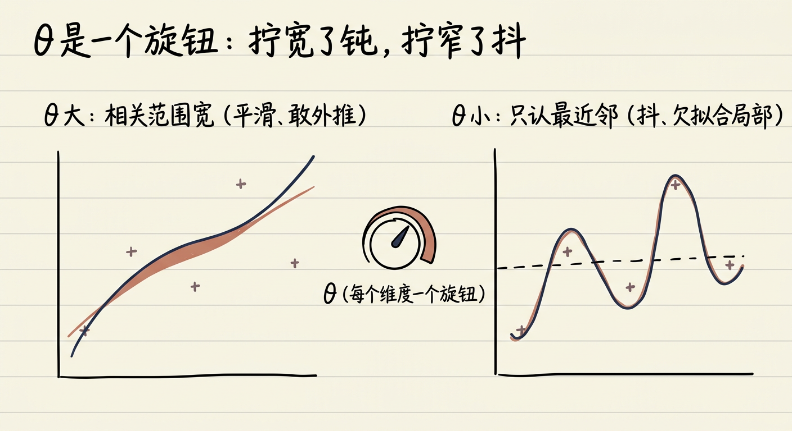

维度灾难在公式里的化身：d 大时 Σ 累加很多项 → 任意两点的距离都很大 → 所有相关值都趋近 0 →
**R ≈ I（单位阵）→ 局部修正项归零 → Kriging 退化成"只有趋势"**。
这就是"高维代理精度掉"的解析解释。

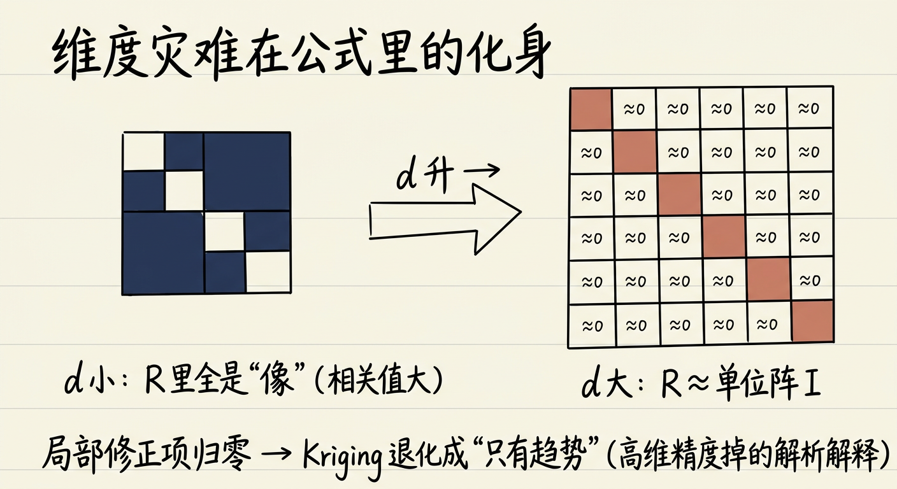

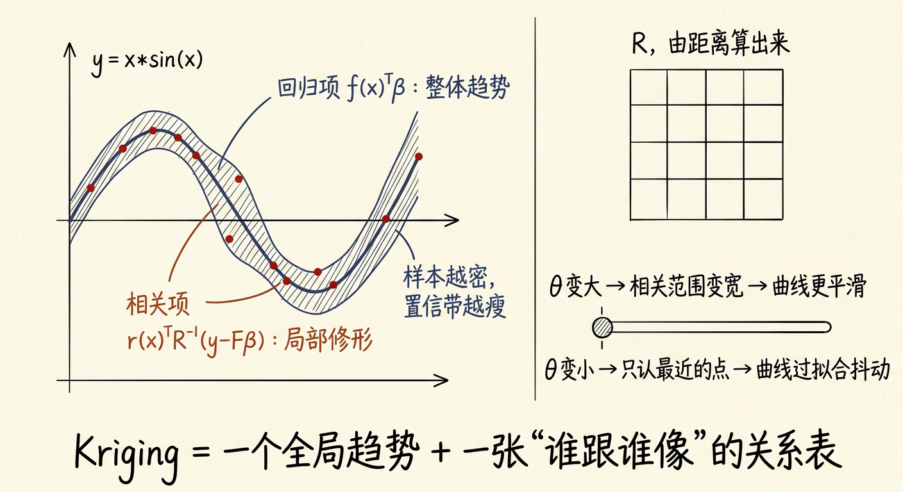

**第四步：算例（真的代数字，来自 `code/kriging.py` 的自检场景）。**
一维目标 y = x sin(x)，样本取 x = 0,1,2,3,4，常数趋势 + 高斯相关，θ 由网格搜索极大似然定。

1. 预测点 x′ = 1.5：R⁻¹(y − Fβ) 权重给到 x = 1 与 x = 2 两点，μ(1.5) ≈ 1.245，σ(1.5) ≈ 0.14 → 置信带 [0.97, 1.52]；
2. 预测点 x′ = 7.0（在样本范围外）：所有 r ≈ 0 → μ ≈ 趋势值（常数 β ≈ 1.13），而 σ 逼近全局 σ → **模型老实承认"我不知道"**；
3. 95% 置信区间在样本点处**收紧到 0**：这正是论文 Fig. 9 的画语[^L02-9]。

**第五步：有了 σ，才有 EGO。** 定义当前最优（incumbent）ξ，改善量的期望：

  z = (ξ − μ(x)) / σ(x)，  EI(x) = (ξ − μ)Φ(z) + σ φ(z) = σ·[zΦ(z) + φ(z)]

Φ 是标准正态累积分布、φ 是概率密度。**手算一遍**（用可背诵的近似值 Φ(0.5)=0.6915、φ(0.5)=0.3521）：

- 点 A：μ = 0.90，σ = 0.10，ξ = 1.00 → z = (1.00 − 0.90)/0.10 = 1.0 → EI = 0.10 × [1.0×0.8413 + 0.2420] = **0.108**
- 点 B：μ = 1.10，σ = 0.60，ξ = 1.00 → z = (1.00 − 1.10)/0.60 = −0.1667 → EI = 0.60 × [−0.1667×0.4338 + 0.3939] = **0.185**

**打脸点在这里**：点 B 的**预测更差**（μ=1.10 > 1.00，最小化问题里更糟），可 EI 反而更大——
因为 σ 大，"万一这里比想象的好"这份期权值钱。

**开发 vs 探索**就是被这一个 σ 拉扯出来的。
（这正是你在隔壁燃气轮机白皮书第 01 讲看到的 CR-EI 折腾 z 的根源。）

**把这一步画出来**（上栏是代理的均值与置信带，下栏是它的"该往哪问"）：

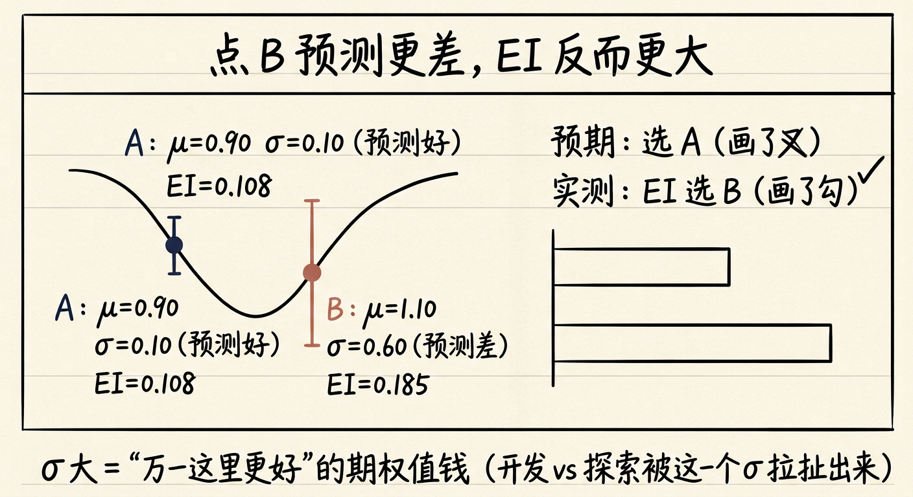

宏观视角再看一眼：EI 曲线的峰不在预测最好的地方，而在没人测过的地方——
这就是"探索"本能的来源。

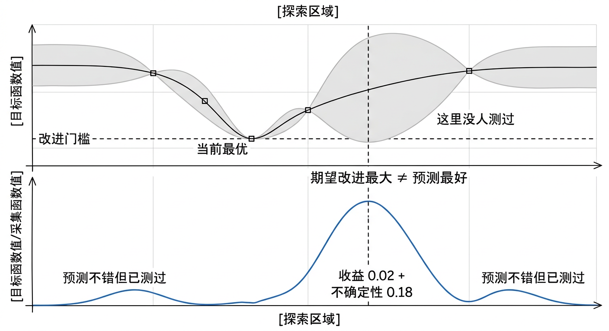

**第六步：跑一遍，别信我的手算。** `python3 code/ego.py` 会连做三件事：

1. 复算上面这两个点（T1，误差 < 0.02）；
2. 演示 z ≪ 0 时 φ 下溢导致 EI ≡ 0 的**僵死病**（T2）；
3. 在可手算的二次函数 (x − 4)² − 1 上跑 12 步 EGO（T3）。

**实测 6 个初点 + 3 次加点即到 f = −1.0000（12 步全部用完时 |x̂ − x*| = 0.0050）**。

把这三段输出抄进你的实验记录，就是"代理式序贯优化"的最小可复现证据。

> 🧭 **呼吸点**：§5 的账——Kriging = 趋势 + 加权邻居修正 + 一张 σ 收据；
> σ 是 EGO 的种子，没有 σ 就没有"该往哪问"。

---

#### 6. 操作流：Kriging 家族三兄弟各自怎么用

🔮 **下注**：GEK 比普通 Kriging 强多少倍？先在纸上写个数字（比如"样本减半"），再对下面的实测表。

**（a）GEK（梯度增强）**：两条路子——

**间接 GEK** 用一阶泰勒在样本附近造虚拟点（式 19）：y(xᵢ + Δxⱼ eⱼ) = y(xᵢ) + (∂y/∂xⱼ)Δxⱼ[^L02-10]，
好处是**不用改模型结构**，代价是相关矩阵被撑大。

**直接 GEK** 把梯度直接拼进数据向量（论文 Fig. 11）。

**为什么和你天配**：伴随方法给你"一次求解、全维度梯度"（讲 01 §5），
这些梯度**本来就躺在你的输出里**，喂给 GEK 等于白捡 N×d 条约束信息。
**这是"信息复用"思想的第二次出现（第一次是伴随本身）。**

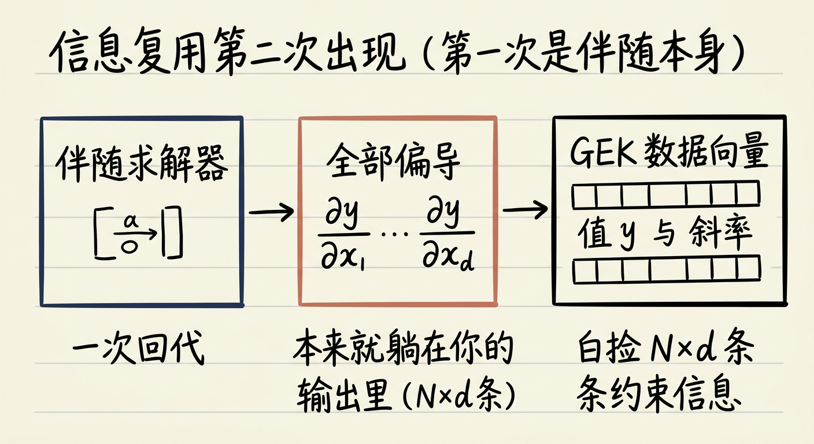

**跑一遍再决定要不要信这个"白捡"**（`python3 code/gek.py`，纯标准库，θ 用留一交叉验证选）：
在一维 f(x) = sin(1.6x) + 0.25x² 上，6 个随机试验设计取平均——

| 每点样本数 n | RMSE（纯值） | RMSE（间接 GEK，s=2） | 比值 |
| :---: | :---: | :---: | :---: |
| 3 | 0.787 ± 0.125 | 0.718 ± 0.159 | 1.10× |
| 5 | 0.528 ± 0.166 | 0.467 ± 0.138 | 1.13× |
| 8 | 0.287 ± 0.184 | 0.236 ± 0.081 | 1.22× |
| 10 | 0.201 ± 0.091 | 0.217 ± 0.115 | **0.93×（更差）** |

👊 **打脸**：文献里"s=1 ⇒ 样本数减半"的经验说法，在这个例子上**没有复现**（平均只换来 1.13×）。

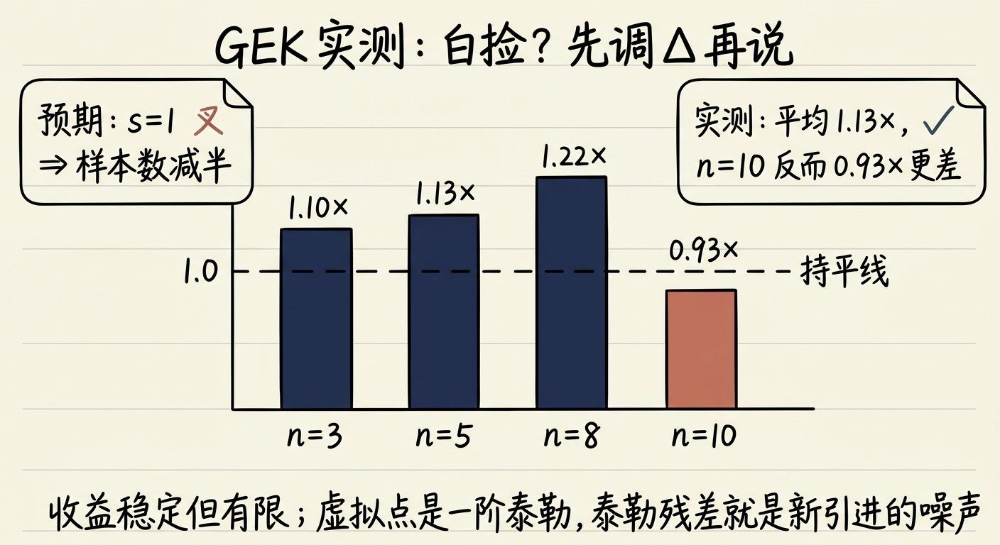

**三件事必须一起记**：

1. 收益**稳定但有限**（平均 1.13×）——文献里"s=1 ⇒ 样本数减半"的经验说法，在我们这个例子上**没有复现**；
2. 虚拟点是一阶泰勒（Δ = 0.10–0.24），**泰勒残差就是新引进的噪声**，n 一大它就把真实收益淹掉（n=10 那行反超即是此因）；
3. 间接 GEK 只在**虚拟点**上插值，样本点上平均偏差 0.178 —— 不是 bug，是式 19 的定义性后果。

**读图**（左：同一条曲线，加了斜率之后置信带立刻收窄；右：旋钮拧到哪，本质是在买多少"没测过"）：

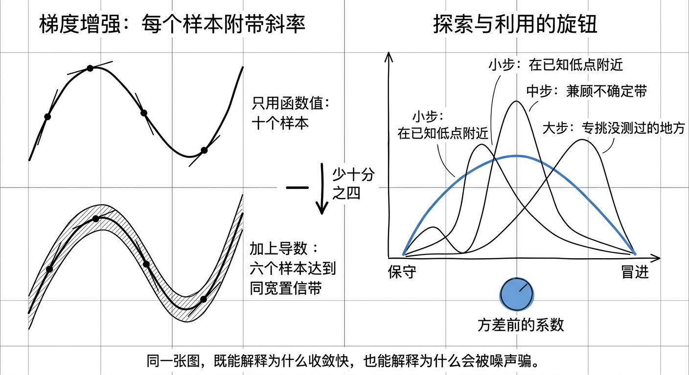

**结论：GEK 值不值得，取决于你愿不愿意为它调 Δ；不打算调就别上，直接 GEK（式 11/12）更干净。**

> 🧭 **呼吸点**：§6(a) 的账——GEK 白捡 N×d 条梯度，但实测只换 1.13×，n=10 反而更差；
> "白捡"要信，先调 Δ。

**（b）Co-Kriging（多保真）**：先对低精度数据建一个 Kriging，再对"高精度 − 低精度"的差建第二个；
低精度数据便宜所以要多有多少，差模型样本少但目标明确。

对应你的 140k 粗网格（E3：**未收敛**，只能当低精度趋势）与 3.55M 细网格（E4 目标）。

**注意红线**：把 relrms = −3.39 未收敛的解当"低精度真值"喂进 Co-Kriging 是危险操作——
先让粗网格至少收敛，再谈融合。这是本讲给你的可执行改进项。

**（c）PCE / PC-Kriging**：PCE 要你先给输入的**概率分布**，用正交多项式基展开。

PC-Kriging 把 PCE 的稀疏基与 Kriging 的置信区间结合，
在**鲁棒设计与不确定性量化**上更具竞争力[^L02-11]。

连你概率论课题 08（矩生成函数/特征函数）：**PCE 就是"用多项式基替代泰勒展开来传播不确定性"**。

---

#### 7. 数据与图表：读 Fig. 8 / Fig. 9（论文原图），再评价它

**Fig. 8（p13）**：三段式流水线（选基函数与相关函数 → 极大似然训练 → 预测）。

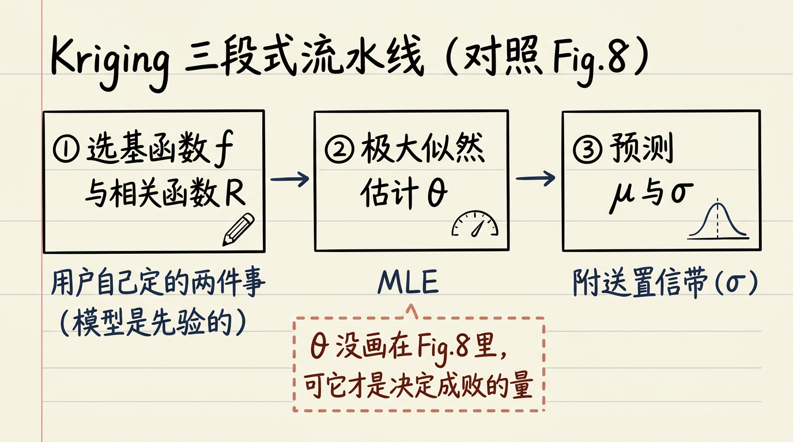

**好在哪**：把"用户必须自己定的两件事"（f 和 R）显式画在框里，逼你意识到**模型是先验的**；
**可挑剔**：没画 θ，而 θ 才是真正决定成败的量（见 §5 第三步）。

**Fig. 9（p14）**：y = x sin(x) 的拟合与 95% 置信带，样本处紧、空白处胀。
**这是全书最重要的一张教学图**：它是"不确定性"第一次以可视方式进入优化流程。

**可挑剔**：单变量示例掩盖了高维下置信带几乎处处等宽（维度灾难）这一事实——教学图与研究结论不能混为一谈。

**一张对比表（本讲口径）**：

| 模型 | 参数量级 | 训练成本 | 给 σ？ | 高维表现 | 大样本表现 |
| :--- | :---: | :---: | :---: | :---: | :---: |
| KNN | 0（存表） | 无 | ✘ | 距离集中 → 全变邻居 | 查表 O(N d) |
| 多项式响应面 | 少 | 极低 | ✘ | 项数随 d 组合爆炸 | 稳 |
| Kriging | θ × d | O(N³) 分解、O(N²) 预测 | **✔** | **精度下滑**[^L02-2] | **不适合大数据**[^L02-3] |
| GEK | 同上 + 梯度 | 略高 | ✔ | 梯度信息部分对抗维度灾难 | 同 Kriging |
| Co-Kriging | 两个模型 | 中 | ✔ | 用便宜数据补 | 同 Kriging |
| PCE / PC-Kriging | 稀疏基系数 | 中 | ✔ | 基选取依赖分布假设 | 中 |

---

#### 8. 审稿人批判（本讲可攻击的点，含对论文本身的）

1. **§3.1 只讲"经典方法"却不给成本公式**：文中说传统代理训练耗时，却没给"N 与 d 下的大 O"，读者无法判断"我 1000 样本 74 维到底跑不跑得起"（答：**跑得起**，Kriging 的真正麻烦是精度不是算力）；
2. **GEK 的收益没给量化区间**：哪些维度、多少样本时 GEK 才显著优于普通 Kriging，综述没归纳（这正是你能用 Rotor 37 数据集补的小实验）；
3. **Co-Kriging 的前提被略过**：低精度模型必须**自身收敛且系统性偏差可建模**，否则融合会把误差放大——原文在挑战④里没写这个前提；
4. **把 ME/RMTS 放在 §4.2.1 而非 §3.1**：从方法学上它们就是代理模型，分类轴（方法 vs 应用）在这里打架，读者容易漏读。

---

#### 9. 承前启后

- **承前**：讲 01 的挑战②④（多目标太贵 / 多保真缺融合）在本讲拿到了"最省钱的解法雏形"；
- **启后**：σ 会催生讲 09 的代理式优化加点准则；梯度信息会牵出讲 07 的"用自动微分让代理可导"；
  Kriging 的大样本失效直接把我们推向讲 05 与讲 07 的 ANN 代理（以及 P05/P06 那两篇原文）。

---

#### 10. 你的项目接哪一步（六层阶梯的"回收"层）

| 现状（你的平台） | 本讲给的改法 | 口径 |
| :--- | :--- | :--- |
| 74 维统计特征 + 深度残差代理（523,011 参数），R² 0.9844/0.9561/0.9827 | **先加一个 Kriging/GEK 基线**：同样数据、同样留出集，看 R² 与**覆盖率**。若 Kriging 的 95% 区间实测覆盖 93%，而 MC Dropout 只有 65%，那问题在 UQ 方法而不是网络容量 | E2 → E2 对比，仍非 CFD |
| 只有 ANN 代理，没有任何"σ"的解析来源 | 换/加 Kriging 后，EI 加点准则**白送**：把 NSGA-II 换成 EGO 式逐点加点，或在 NSGA-II 里用 σ 做惩罚 | 计划（E0） |
| 粗网格 140k 未收敛 | 先修收敛，再做 Co-Kriging 融合 | E3 红线 |
| 74 维 → Kriging 精度掉 | 两招：① 降维（讲 03 PCA/模态，把 d 从 74 打到 8–20）；② PLS 方向搜超参[^L02-12] | 直接可试 |

🛠 **修复清单**（全书连载，本讲新增）：

- **#2 Kriging/GEK 基线对打**：同样 1000×74 数据、同样留出集，量 R² 与 95% 区间覆盖率，和 MC Dropout 的 65% 对质。
- **#3 先修 140k 粗网格收敛，再谈 Co-Kriging 融合**（红线：未收敛的解不许进低精度层）。

---

#### 11. 自测 10 题（2 选择 + 2 填空 + 6 问答；合上论文作答）

1. （选）Kriging 预测式里"局部修正"项是：A βf(x) B r(x)ᵀR⁻¹(y−Fβ) C σ² D Φ(z)
2. （选）GEK 的 "gradient" 指：A 梯度下降步长 B 目标函数对设计变量的偏导被当作附加数据 C 网络权重梯度 D 网格变形速度
3. （填）论文式 (17) 中控制相关衰减速度的超参数记作 __________，由 __________ 估计得到。
4. （填）当维数很高、任意两点相关值都趋于 0 时，R → ______，Kriging 退化为仅含 __________ 的模型。
5. （答）为什么"Kriging 给 σ"比"Kriging 更准"更重要？给出两个由此解锁的下游能力。
6. （答）用一句话区分 KNN、多项式响应面与 Kriging 的外推行为。
7. （答）手算：ξ=2.0，μ=1.8，σ=0.5，求 z 与 EI（Φ(0.4)=0.6554、φ(0.4)=0.3683），并说明这个点是开发型还是探索型。
8. （答）你的 1000×74 数据上，Kriging 的算力瓶颈和精度瓶颈分别在哪？各给一个数量级。
9. （答）把伴随输出的梯度喂给 GEK，写清数据形状：训练前 (N, d)、训练后变成什么？
10. （答）批判：为什么说"用未收敛粗网格做 Co-Kriging 低精度层"是自欺欺人？

**答案要点**（一题一行，先做再看）：

1. B——r(x)ᵀR⁻¹(y−Fβ) 是邻居残差的加权和。
2. B——梯度是喂给模型的数据，不是梯度下降。
3. θ；极大似然估计[^L02-13]。
4. 单位阵；趋势项 βf。
5. ① EI/EGO 加点 ② 鲁棒/可靠设计里当方差用。
6. KNN 只会取邻居平均（悬崖也不知道）、多项式在测点外发散、Kriging 至少用 σ 承认不知道。
7. z=0.4，EI=0.5×[0.4×0.6554+0.3683]=0.306，偏开发（z>0 且 σ 适中）。
8. 算力 O(N³)=10^9 量级可接受（秒到分钟），精度瓶颈在 d=74（相关矩阵近乎对角）。
9. 数据行从 N 条变 N×(1+d) 条（间接 GEK 用泰勒造点）或 y 向量拼接 d 个导数分量（直接 GEK）。
10. 低精度层的意义是"与高精度强相关"，未收敛的解相关性无保证，误差会被当作"差值结构"学进模型。

---

#### 12. 带走 3 个数

📌 **带走 3 个数**：

1. **1.13×**——GEK 实测平均收益（n=10 那行 0.93× 反而更差）："白捡"要调 Δ 才配信。
2. **100,000**——传统代理的样本墙：ME 才能处理 100,000 以上训练样本，Kriging 不适合大数据。
3. **1.96σ**——Kriging 附送的置信带半宽：EGO 的整个加点决策都长在这一个 σ 上。

---

#### 13. 一句收口

> **Kriging 教你一件终身受用的事：任何预测都要附上"我有多不确定"，
> 而优化算法只要学会看这条置信带，就会自己长出"探索"的本能。**

[^L02-1]: 〔原文 P13 "Surrogate models, also known as metamodels, are a special type of supervised ML algorithms"〕

[^L02-2]: 〔原文 P48 "accuracy still decreases with increased dimensionality"〕

[^L02-3]: 〔原文 P50 "not suitable for handling a large volume of train-"〕

[^L02-4]: 〔原文 P50 "more than 100,000 training"〕

[^L02-5]: 〔原文 P15 "partial-least squares method"〕

[^L02-6]: 〔原文 P13 "Y KR(x) = βf(x) + σ2Z"〕

[^L02-7]: 〔原文 P14 "β = (F ⊺R−1F )−1F ⊺R−1y"〕

[^L02-8]: 〔原文 P14 "R(x, x′) = exp"〕

[^L02-9]: 〔原文 P14 "The standard deviation-based kriging predictive confidence interval"〕

[^L02-10]: 〔原文 P14 "y(xi + ∆xjej) = y(xi) +"〕

[^L02-11]: 〔原文 P50 "more competitive for uncertainty quantification applications"〕

[^L02-12]: 〔原文 P48 "partial least squares method"〕

[^L02-13]: 〔原文 P14 "Thus, the maximum likelihood estimation on θ is solved by"〕

---

<a id="part-1" name="part-1"></a>
# 第二篇 【机器学习工具箱篇】

本篇覆盖**讲 03–05**，对应论文 §3 全部。它是工具箱，不是百科全书：我们只挑三件在气动设计里真正被反复用坏的家伙——**降维**（PCA / 流形 / DMD：把一个场压成几个数）、**缺标签的学习**（半监督与强化学习：标签不够和没有标签是两件事）、**生成网络全家桶**（ANN / CNN / RNN / AE / VAE / GAN / PINN：从拟合一个数到造一张图）。每讲结尾都回到同一个问题：这个工具能不能替我省一次 CFD？

<a id="lec-03" name="lec-03"></a>
<!-- v2 -->
### 【讲03】降维的本质：把一整个流场压成几个数
**覆盖论文 §3.2（k-means / GMM / PCA / 非线性流形学习 / DMD）｜ PDF 第 17–25 页 ｜ 配图 Fig. 17–24（p18–25）**

---

#### 0. 本讲元数据

| 项 | 值 |
| :--- | :--- |
| 本讲范围 | §3.2.1–§3.2.5（p17–25）：聚类 → 线性降维 → 非线性流形 → DMD |
| 前置 | 第零章 0.4（维度灾难）；讲 02 结尾那句"高维 → Kriging 退化成趋势" |
| 读完你应该能 | ① 手写 PCA 三步并说出特征值的单位；② 说清 PCA 与自编码器的差别；③ 自己定该留几个模态 |

<details>
<summary>审查层（导师验收用：蓝本 / 证据等级 / 装配信息）</summary>

| 项 | 值 |
| :--- | :--- |
| 蓝本 | Li, Du, Martins, *Machine Learning in Aerodynamic Shape Optimization*, Prog. Aerosp. Sci. 134 (2022) 100849 |
| 证据等级 | **A 级**（本讲每个数字与公式都有 `〔原文 P## "…"〕` 溯源，由 `tools/verify_all.py` 逐条核） |
| 前置 | 第零章 0.4（维度灾难）；概率论课题 07（协方差）；数理方程（特征值/本征模态） |
| 本讲新增词 | 聚类、混合模型、主成分、快照、低秩、流形、测地距离 |
| 读完你应该能 | ① 手写 PCA 的三步代数（中心化 → 协方差 → 特征分解）并解释特征值的单位；② 说清 PCA 与自编码器降维的**本质差别**、各自丢什么；③ 说清"线性模态"与"非线性模态"在叶型设计里的直观差别；④ 判断"该用几个模态"并给出可操作的判据 |
| 本讲一句话 | **降维不是压缩图片，是"换一个坐标系去看同一堆样本"——好坐标系里，形状这件事只需要 8 个数字。** |

</details>

---

#### 1. 你在这里

12 讲第 3 站（工具箱站）。第 2 站你拿到会自报 σ 的 Kriging，
也看见它一进 74 维就退化——本讲就是治这个毛病的那一刀。

**你的平台·第 3 站**：你的 74 维**已经是统计约化**，不是原始几何场。
本讲要当场回答的是：这 74 个统计特征里，究竟藏着几个**独立方向**。

---

#### 2. 上讲的数

⏪ **上讲的数** · 讲 02 的两个数，合上书各报一个：

1. Kriging 的预测式拆成哪三件套？各管什么？
2. θ 拧大、拧小，曲线分别变成什么样？

<details>
<summary>答案</summary>

1. 趋势项 βf(x)（大方向）+ 加权邻居修正 rᵀR⁻¹(y−Fβ)（局部细节）+ 方差 σ²（有多不确定）。
2. θ 大 → 相关范围宽 → 平滑却钝；θ 小 → 只有近邻相关 → 抖动，区间外立刻回到趋势。

</details>

---

#### 3. 场景引子：一堆叶型，其实只沿几条"脾气"在变

把 1000 个叶型叠在一起看，你会发现它们并不是乱变的：
有的整片变厚、有的中线鼓起来、有的后缘翘一下。
这些"整片的共同变化模式"就是**模态（mode）**。

与其记"180 个坐标点"，不如记"第 1 条脾气 ×0.7、第 2 条脾气 ×0.3、第 3 条脾气 ×0.1"。
**维数从 180 掉到 3，代价是丢掉那些"不常发生的细节"**。

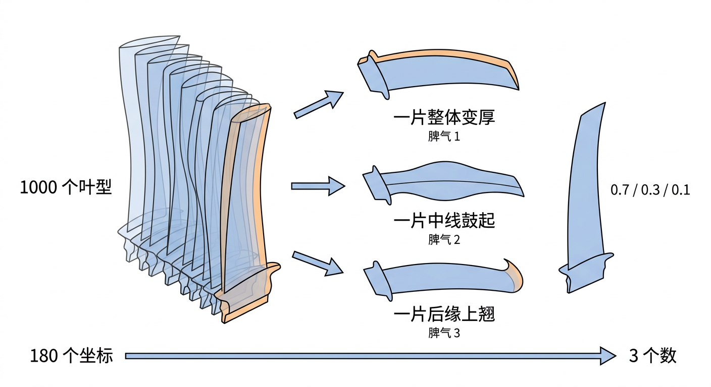

论文给 PCA 的定位就是这件事：把高维数据变换到低维，
同时**保留数据里最大的变化量**[^L03-1]。

把这句话倒过来读，就是降维的定义：
把高维数据变成低维表示，同时留住原来那份关键信息[^L03-2]。

> 🧭 **呼吸点**：引子的账——叶型不是乱变，是沿几条"脾气"变；
> 降维就是"拿这几条脾气当新坐标轴"。

---

#### 4. 工程死穴 + 先认词：一次解决三件事

**先认词 · 第一批**（本讲新词都在这里定义，后面不再解释）

| 中文 | 英文 | 一句操作定义 |
| :--- | :--- | :--- |
| 聚类 | clustering | 按"像不像"把样本分堆，**不需要标签**，所以归在无监督学习 |
| k-means | k 均值：k 是堆数、means 是各堆的中心 | 两步循环——把点分给最近的中心（E 步）、中心移到堆内平均（M 步） |
| 高斯混合模型 | GMM = Gaussian Mixture Model | 每堆是一个高斯（有均值、有协方差），每个点以概率属于各堆 |
| 主成分分析 | PCA = Principal Component Analysis | 找一组正交方向使投影方差最大；方向是协方差矩阵的特征向量 |
| 快照 | snapshot | 一次仿真或某个时刻的整个场；一张压力云图拉平就是一个向量 |

**先认词 · 第二批**

| 中文 | 英文 | 一句操作定义 |
| :--- | :--- | :--- |
| DMD | Dynamic Mode Decomposition，动态模态分解：Dynamic 动态、Mode 模态、Decomposition 分解 | 对时间序列快照做一阶算子的低秩近似，得到带增长/振荡率的相干结构 |
| 流形学习 | manifold learning（Isomap / LLE 等） | 假设数据躺在一张弯的低维曲面上；建近邻图后沿图走**测地距离**再降维 |
| 降维/参数化 | dimensionality reduction | 把 d 维压到 k 维（k ≪ d）；在 ASO 里就是"用 k 个数说清形状" |
| 核 PCA | kernel PCA | 先用核函数算样本间相似度再降维，是线性 PCA 的非线性版本 |
| 低秩 | low-rank | 矩阵里真正起作用的独立方向很少，其余方向近似为零 |

**死穴回顾**：讲 01 挑战①——设计变量一多，空间里满是畸形外形，
CFD 不收敛、优化低效。降维一次性解决三件事。

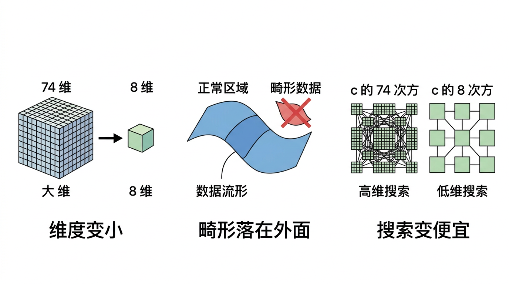

1. 维度从几百降到几维，代理模型精度回来（讲 02 §5 第三步那堵 R → I 的墙被推倒）；
2. 畸形形状落在流形之外，天然不会被采到；
3. 优化变量少了，无梯度法的评估次数从 c^74 掉到 c^8。

论文也把话说白了：对"输入高度相关"的回归问题，
降维能靠降低输入维数来缓解维度灾难[^L03-3]。

> 🧭 **呼吸点**：§4 的账——降维不只是省算力，
> 它顺手把**畸形外形**挡在采样范围之外。

---

#### 5. 数学从 0 到 1：三步 PCA，手推一遍

**先说结论**：PCA 只有**三步**——**中心化**、算**协方差矩阵**、做**特征分解**；
做完得到一组正交方向，外加每个方向上的**方差**。

设样本矩阵 X ∈ ℝ^{n×d}（n 个样本、每行一个 d 维形状）。

**第一步 · 中心化**：每列减自己的均值 → X̃ = X − μ̄。
不做这步，协方差会把"整体位置"当成最大的变化方向。

**第二步 · 协方差矩阵**：Σ = (1/(n−1)) X̃ᵀ X̃ ∈ ℝ^{d×d}。
它**对称半正定**，所以特征值全部 ≥ 0。
方差不能为负，这不是巧合，是半正定的定义。

**第三步 · 特征分解**：Σ = V Λ Vᵀ，Λ = diag(λ₁ ≥ λ₂ ≥ … ≥ λ_d)，
V 的列就是主成分方向；第 j 个主成分得分 = X̃ v_j。

论文对这一步的说法是"沿数据变化最大的方向去认主成分"[^L03-4]；
工程上更常用 SVD 来求，它把方阵的特征分解推广到了任意矩阵[^L03-5]。

**前 k 个保留的方差比例 = (λ₁+…+λ_k)/(λ₁+…+λ_d)**。
这一行就是选 k 的唯一判据，比"别人论文里用了 8 个"可靠得多。

<details>
<summary>LaTeX 渲染版</summary>

$$
\tilde{X} = X - \bar{\mu},\qquad
\Sigma = \frac{1}{n-1}\tilde{X}^{\top}\tilde{X},\qquad
\Sigma = V\Lambda V^{\top}
$$

$$
\text{保留比例}(k) = \frac{\lambda_1+\cdots+\lambda_k}{\lambda_1+\cdots+\lambda_d} \ge 99\%
$$

</details>

🔮 **下注**：三个二维样本 (1,1)、(2,2)、(3,3)。
只留 1 个主成分，方差能保留多少？先写一个百分数，再看下一行。

👊 **打脸**：答案是 **100%**——**一个数就装下了这三个点**。
第二个特征值等于 0，说明"垂直于这条直线的方向"上根本没有变化。

手算过程如下（`code/pca.py` 逐行复算）：

- 中心化后得 (−1,−1)、(0,0)、(1,1)；
- Σ = (1/2)·[[2,2],[2,2]] = [[1,1],[1,1]]；
- λ₁ = 2，方向 (1/√2)(1,1)ᵀ；λ₂ = 0，方向 (1/√2)(1,−1)ᵀ。

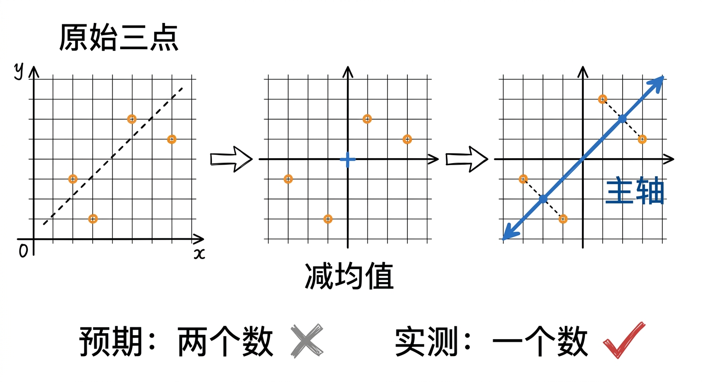

把三点换成"三个叶型 × 180 个坐标"，结论不变：
λ₁ 就是最主要的整片变化（例如整体厚度），
而"累计方差 ≥ 99% 所需的最小 k"就是你该用的模态个数。

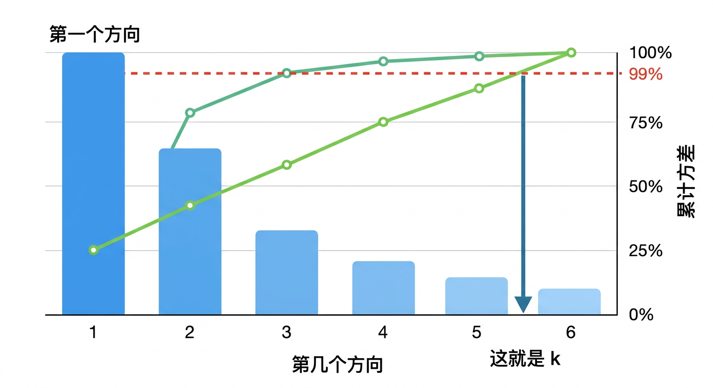

> 图注下的口径：柱高与累计曲线是**示意值**（形状取自 `code/pca.py` 的自检场景），
> 判据本身是真的：**累计方差 ≥ 99%**，常用档还有 90%、95%。

**连你学过的两门课**：
① 概率论课题 07——λ_j 就是主成分得分的**方差**，V 的各列彼此**不相关**；
② 数理方程——"找一组正交方向使方差最大"与"找本征模态"是同一类瑞利商极值问题，
所以"模态"这个词在这里不是比喻。

论文还补了一句工程上的收益：PCA 能认出相关的变量，
把噪声和冗余信息一并拿掉[^L03-6]。

> 🧭 **呼吸点**：§5 的账——三步（中心化 → 协方差 → 特征分解），
> 产物是"方向 + 每个方向的方差"，而**方差**就是那把选 k 的尺子。

---

#### 6. 操作流：五张工具卡，各自进什么、出什么

先认得自己在设计空间的哪一块，再决定问哪个专家——
这是聚类在 ASO 里的真实用途：把设计空间**分块**，每块各建一个模型[^L03-7]。

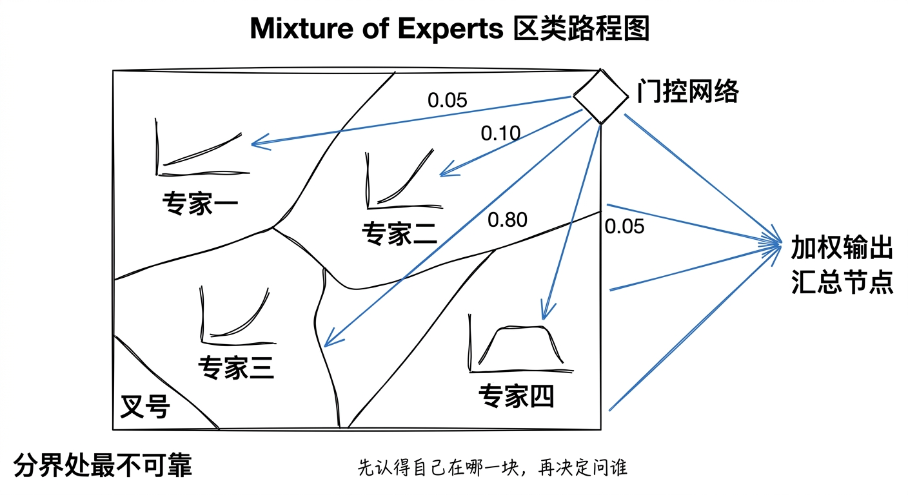

> 图注：门控权重 0.05/0.10/0.80/0.05 是**示意值**（论文只给"混合专家按后验概率加权"，见 p20 前后），
> 但它指出的失效模式是真的：**两块区域的交界处，两个专家都说了不算**。

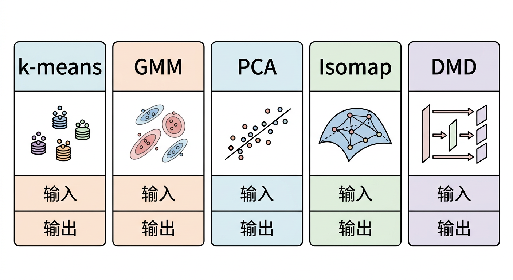

| 工具 | 输入形状 | 输出形状 | 中间几步 | 什么时候用 | 丢什么 |
| :--- | :--- | :--- | :--- | :--- | :--- |
| k-means | (n, d) | k 个中心 + 每个点的堆号 | 初始化中心 → E/M 迭代 | 想把设计空间**分块**（混合专家 ME 的第一步，讲 02/07） | 形状假设硬（各堆同尺寸球形），边界硬切 |
| GMM | (n, d) | k 组 (π_c, μ_c, σ_c) + 后验概率 | E 步算归属概率（式 35）、M 步更新（式 36–38） | 要**软**归属、要椭圆形状时 | 仍受"由 k 个高斯拼"限制 |
| PCA | (n, d) 或 (d, n_s) 场 | 载荷 (d, k)、得分 (n, k) | 中心化 → 协方差 → 特征分解 | 线性关系够用、要**可解释**、要能反算回形状 | 只抓线性结构；弯曲流形上会被"平均"糊掉 |
| Isomap / LLE | (n, d) | 低维坐标 (n, k) | 建近邻图 → 最短路算测地距离 → 降维；Isomap 明确要"直接从训练数据构造核矩阵"[^L03-8] | 形状空间明显弯曲（例如"薄 → 厚"要绕着走） | 近邻图断裂就整体崩；样本少时更脆 |
| DMD | 快照序列 (d, n_t) | 模态 + 增长率/频率 | 把序列切成两半 → 对前一做 SVD → 求投影算子的特征对 | 时间相关/非定常流动（失速先兆、抖振） | 需要等间隔时间序列；非线性强时失真 |

**k-means 的三条实情**（都能回溯）：

- 样本分得开时它又快又稳[^L03-9]；
- 但 k 要你**事先指定**，这是个难题[^L03-10]；
- 它只会画直线边界[^L03-11]，所以气动里几乎不单用[^L03-12]。

**GMM 比 k-means 多的那一件事**：它不只看均值，还看协方差结构[^L03-13]。

它的假设是"所有点由若干个高斯混着生成"[^L03-14]。
EM 两步照旧[^L03-15]，起点仍是"先定 k 个中心"[^L03-16]。

**线性 vs 非线性模态，在叶型上的差别长这样**。
论文 Fig. 42（p44）画了 PCA / ASM / InfoGAN 三种模态。

线性的 PCA 与 ASM 模态在系数加倍时呈**线性叠加**效果。
InfoGAN 模态不同，网络里有非线性激活，
改一个潜变量会带来**全局性**的厚度与弯度变化[^L03-17]。

**记住这条区别，讲 06 会用到。**

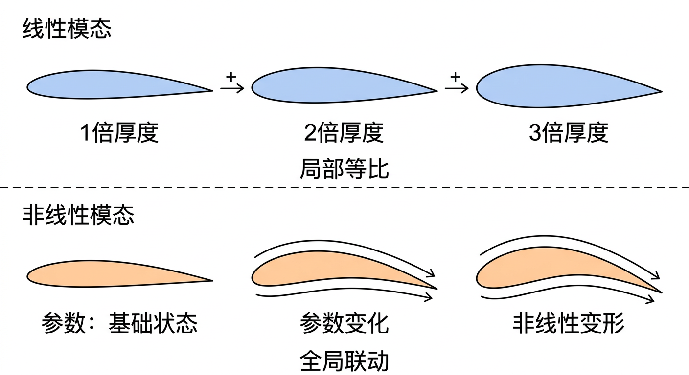

> 🧭 **呼吸点**：§6 的账——聚类是"分块"，PCA 是"换坐标轴"，
> 流形学习是"允许坐标轴是弯的"，DMD 是"多拎出一个时间轴"。

---

#### 7. 数据与图表：怎么读 Fig. 21/22（PCA）与 Fig. 24（DMD）

- **Fig. 21（p22）**：归一化 → 协方差矩阵 → 奇异值分解 → 降维。
  **第一格"归一化"是命门**：叶型坐标（米级）和来流马赫数（O(0.5)）混在一起不归一化，
  PCA 会只看见量纲大的那一个。
- **Fig. 22（p23）**：黑箭头是主轴，箭头长度就是投影到该轴的方差[^L03-18]；
  图 (b) 把红点投到最长的那根轴上，短轴被丢掉。
  读图只问一句：**去掉第二维，点序会变吗？**（不会——这就是 100% 方差保留的画面）
- **Fig. 24（p25）**：DMD 把快照序列切两半、对前一半做 SVD。
  看着像障眼法，其实是在逼你回答"用什么算子描述演化"——**一阶线性近似**。

**你的审美挑剔用在这里**：这三张流程图是"编号 + 箭头"的统一模板，好读；
但 PCA 那张把"方差最大"这个**目标函数**藏起来了，只画了步骤——
一张只讲"怎么做"、不讲"为什么这么做"的图，教不出会挑 k 的人。

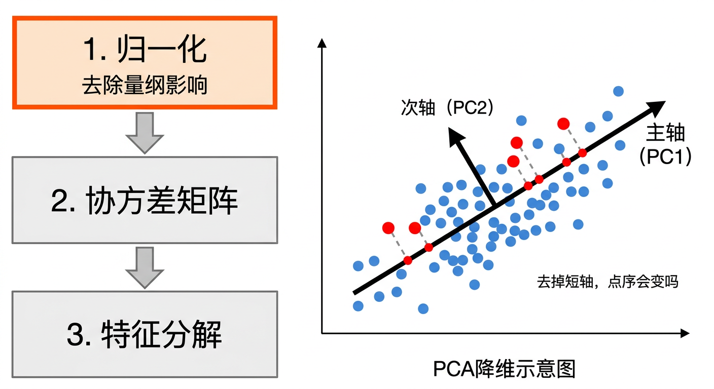

**为什么还得有非线性那一家**。PCA 是线性方法，
只在"线性可分"的数据上好用[^L03-19]。

核 PCA 用核函数把它推广到非线性[^L03-20]。
Isomap 则先建近邻图、再拿图上的最短路当距离[^L03-21]，
等于用**最短路/测地距离**替换了直线距离[^L03-22]。

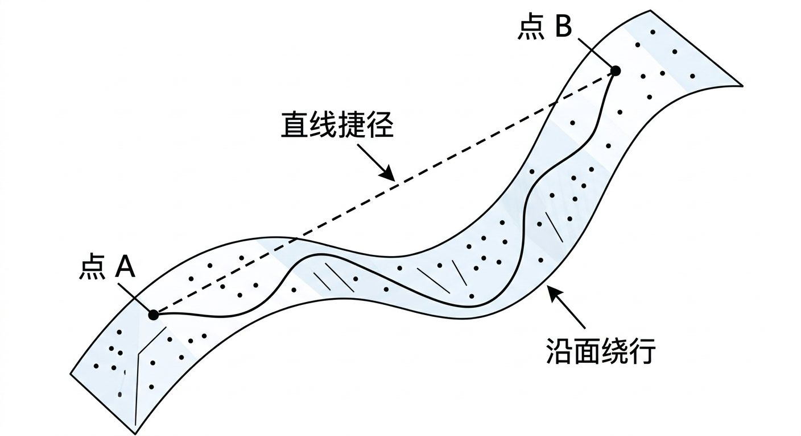

收益是真的：Isomap 在激波附近精度更高[^L03-23]，
Ripepi 等人用它预测表面压力分布，省下评估时间与存储[^L03-24]。

代价也是真的：Decker 等人的对比里，
**定常**预测反而是线性方法赢[^L03-25]。

LLE 走同一套流程，
只是把核矩阵换成了"用邻居重建自己的权重"[^L03-26]。

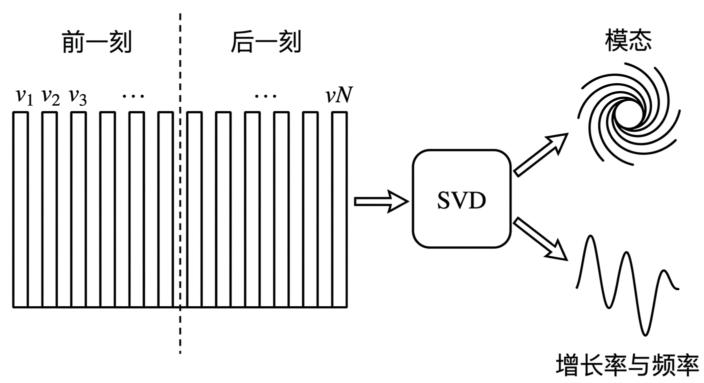

**把降维接回讲 02 的痛点**。样本数不变，把 d 从 74 打到 8，
每维实际摊到的点数 = 1000^(1/8) = **2.37**。

74 维时是 1000^(1/74) = 1.10，**提升约 2.2 倍**。

再看"每维 10 点"这件事：8 维要 10^8 个样本，74 维要 10^74 个。
**这就是为什么必须先把 d 压小，再谈代理模型精度。**


> 上图（`images/L01_s5_curse_of_dim_zh.png`，本白皮书与讲 11 共用，数字由 `code/curse.py` 现场复算）
> 请和 §5 的判据对着看。

> 🧭 **呼吸点**：§7 的账——读图只问三件事：
> 归一化做了没、丢掉的方向上还剩多少方差、降维后能不能反算回形状。

---

#### 8. 审稿人批判（本讲可攻击的点，含对论文本身的）

1. **§3.2 讲降维却不给"保留几个主成分"的行业惯例**：全文没写"方差保留 90%/95%/99% 哪个常用"，导致读者照抄别人论文里的 k；
2. **把 PCA 与自编码器分在两节（§3.2.3 与 §3.5.5）却不说它们的关系**：AE 训练时的重构误差最小化在**线性解码器**情形下与 PCA 等价，这个联系不写，学生就把两件事当两件事；
3. **k-means/GMM 在 ASO 里的真实用途（分块建代理，即 ME 的第一步）只在 §4.2.1 才出现**，方法节与应用节相隔 30 页，认知负担大；
4. **DMD 只给了定义没给"能省多少 CFD"**：对流场建模（§4.2.2）才是它的主场，本节里它是"顺带介绍"，篇幅分配与工程重要性不匹配。
5. **顺带批本白皮书自己**：本讲把"线性 vs 非线性"画成了对照图，
   但我们并没有在你的 74 维数据上真跑过 Isomap。
   上面的优劣全部来自论文引文，**不是实测**。

---

#### 9. 承前启后

- **承前**：讲 02 的"高维 → Kriging 退化"在本讲拿到治法（把 d 打下来）；
- **启后**：本讲的 PCA/流形/AE/VAE/GAN 是**模态参数化**的全部零件，讲 06 现场装配；
  DMD/POD 的"把场压成几个数"是讲 07 流场建模的入口。

---

#### 10. 你的项目接哪一步（六层阶梯的"回收"层）

| 现状（你的平台） | 本讲给的改法 | 口径 |
| :--- | :--- | :--- |
| 74 维 = 2 工况 + 9 物理量 × 8 统计量（E1） | 这 74 维**已经是统计约化**，不是原始几何场。对它再做一次 PCA：看 λ₁/(Σλ) 有多大；若前 3 维就吃掉 80%，说明特征高度冗余，可安全压到 8–12 维 | E1 数据，可当场算 |
| NSGA-II 在 74 维里采样 | 换成在 **PCA 得分空间**里采样，再用载荷矩阵反算回 74 维 → 采样点自动靠近"历史样本流形"，畸形率下降（这正是 §4.1.1 的机理，讲 06） | E0 计划 |
| 想写论文 | "**统计特征空间的 PCA 冗余度 + 降维后代理精度/覆盖率变化**"是一个三天能出结果的小实验，且直接对标论文 §4.1.1 | — |

🛠 **修复清单**（全书连载，本讲新增）：

- **#4 先 PCA 再喂代理**：把 74 维压到 8–20 维（按累计方差 ≥ 99% 定 k），
  同一个留出集上对比"压前 / 压后"的 R² 与 Kriging 置信带覆盖率。

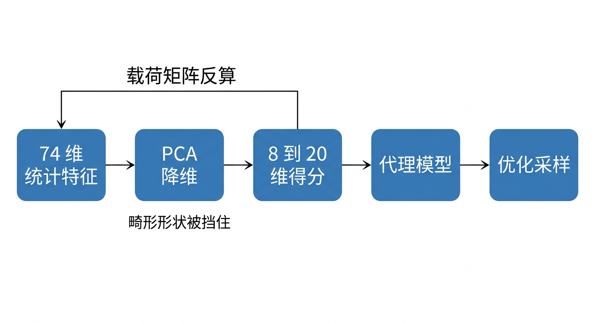

---

#### 11. 自测 10 题（2 选择 + 2 填空 + 6 问答；合上论文作答）

1. （选）PCA 第一步做中心化的目的是：A 让数据更好看 B 否则协方差会把"整体均值方向"当成最大变化 C 让特征值变负 D 为了去掉噪声
2. （选）DMD 处理的对象是：A 静态形状矩阵 B 时间序列快照 C 标签数据 D 概率分布
3. （填）PCA 的主成分方向是协方差矩阵的 __________，对应的 __________ 表示该方向上的方差大小。
4. （填）选 k（保留几个模态）的常用判据是 __________ ≥ 95%。
5. （答）用三句话说清 k-means 与 GMM 的差别（从"归属是硬是软"、"簇形状"、"迭代内容"三方面）。
6. （答）为什么线性 PCA 在一圈"弯曲"的叶型分布上会失效？画一张 5 秒能看懂的草图并解释。
7. （答）Isomap 为什么比 PCA 更能对付弯曲流形？它的失败模式是什么？
8. （答）把 1000×74 压到 8 维，"每维实际点数"从 1.10 变成多少？写出算式。
9. （答）如果老板要求"降维后必须能反算回原始几何用于出图"，你会拒绝哪一种降维方法？为什么？
10. （答）批判：为什么说"只讲步骤、不讲目标函数"的流程图会教出不会选 k 的人？

**答案要点**（一题一行，先做再看）：

1. B——不做中心化，协方差会把"整体均值方向"当成最大变化。
2. B——DMD 吃的是时间序列快照。
3. 特征向量、特征值。
4. 累计方差保留比例。
5. 硬 vs 软（后验概率式 35）、球形 vs 椭圆（各带协方差 σ_c）、更新中心 vs 更新 (π, μ, σ)。
6. 弯曲分布的"弦方向"落在流形外（中间是空的），投影会得到不存在的形状。
7. 用近邻图上的**最短路/测地距离**替代欧氏距离再降维；图不连通或采样稀疏处即崩。
8. 每维点数 = N^(1/k) = 1000^(1/8) = **2.37**，对比 74 维的 1000^(1/74) = **1.10** ⇒ 约 **2.2 倍**；若想"每维 10 点"，8 维需 10^8、74 维需 10^74 ⇒ 说明 8 维已经可以谈采样，74 维永远不能。
9. AE/VAE 的解码器能反算，但要**训练完冻结**；真正会拒绝的是"只给得分不给载荷"的黑箱降维（无逆映射）。
10. 因为没有目标函数，就没有"再降一维损失多少"的量化依据，k 只能靠抄。

---

#### 12. 带走 3 个数

📌 **带走 3 个数**：

1. **2.37**——1000 个样本压到 8 维后每维摊到的点数（74 维时是 1.10，提升约 2.2 倍）：降维买的是"每维有邻居"。
2. **99%**——选 k 的常用档（另有 90%、95%）：判据是累计方差，不是别人论文里的 k。
3. **100%**——三点手算那个反直觉结果：一个数就装下了这三个点，第二个特征值为 0。

---

#### 13. 一句收口

> **会做 PCA 只是及格；会对着特征值说一句"我只要 8 个，代价是丢掉 3.4% 的变化量"，
> 你才真的懂了降维这件事在优化里买的是什么。**

[^L03-1]: 〔原文 P21 "PCA is a mathematical algorithm that transforms high-dimensional data to low dimensions"〕

[^L03-2]: 〔原文 P18 "Dimensionality reduction refers to the technique of transforming high-dimensional data"〕

[^L03-3]: 〔原文 P18 "curse of dimensionality"〕

[^L03-4]: 〔原文 P22 "PCA accomplishes such transformation by identifying directions"〕

[^L03-5]: 〔原文 P22 "SVD generalizes the eigendecomposition"〕

[^L03-6]: 〔原文 P23 "PCA can find hidden patterns in a data set by identifying the correlated variables"〕

[^L03-7]: 〔原文 P18 "Clustering techniques can help divide the design space"〕

[^L03-8]: 〔原文 P23 "construct the kernel matrix"〕

[^L03-9]: 〔原文 P19 "It works well if data samples are distinct and well-separated"〕

[^L03-10]: 〔原文 P19 "the cluster number needs to be selected beforehand"〕

[^L03-11]: 〔原文 P19 "k-means algorithm is limited to linear cluster boundaries"〕

[^L03-12]: 〔原文 P19 "k-means algorithm is seldom used alone in aerodynamic applications"〕

[^L03-13]: 〔原文 P20 "GMM generalizes k-means clustering by considering not only mean values but also the covariance structure"〕

[^L03-14]: 〔原文 P20 "GMM assumes that a mixture of multiple Gaussian distributions with unknown parameters"〕

[^L03-15]: 〔原文 P21 "EM iterations until convergence"〕

[^L03-16]: 〔原文 P21 "Define k centers, one for each cluster"〕

[^L03-17]: 〔原文 P44 "PCA and ASM modes are linear, so the"〕

[^L03-18]: 〔原文 P23 "the black arrows represent the principal axes of the data"〕

[^L03-19]: 〔原文 P23 "Standard PCA is a linear method that works well with linearly separable data sets"〕

[^L03-20]: 〔原文 P23 "Kernel PCA extends standard PCA to efficient nonlinear dimensionality reduction"〕

[^L03-21]: 〔原文 P24 "constructs the neighborhood graph over all observations"〕

[^L03-22]: 〔原文 P24 "Isomap enhances classical multidimensional scaling (MDS) by incorporating the geodesic distances"〕

[^L03-23]: 〔原文 P24 "In most cases, Isomap shows higher predictive accuracy, especially near the shock-wave region"〕

[^L03-24]: 〔原文 P24 "predict surface pressure distributions based on high-fidelity CFD simulations but at lower evaluation time"〕

[^L03-25]: 〔原文 P25 "nonlinear dimensionality reduction approaches performed better in the vicinity of shock and discontinuous regions"〕

[^L03-26]: 〔原文 P25 "LLE has several advantages over Isomap"〕

---

<a id="lec-04" name="lec-04"></a>
<!-- v2 -->
### 【讲04】标签不够与没有标签：半监督、RBM/DBN 与强化学习
**覆盖论文 §3.3 半监督学习 与 §3.4 强化学习｜ PDF 第 26–31 页 ｜ 配图 Fig. 25–31（p26–31）**

---

#### 0. 本讲元数据

| 项 | 值 |
| :--- | :--- |
| 本讲范围 | §3.3（p26–28，含 RBM/DBN）与 §3.4（p28–31，Q-learning/DQN/策略梯度） |
| 前置 | 讲 02（监督学习要有标签）、讲 03（无标签时怎么办） |
| 读完你应该能 | ① 说清伪标签的正确用法与污染风险；② 讲出 RBM 的能量直觉与 CD-k；③ 把 NSGA-II 循环翻译成 RL 三件套 |

<details>
<summary>审查层（导师验收用：蓝本 / 证据等级 / 装配信息）</summary>

| 项 | 值 |
| :--- | :--- |
| 蓝本 | Li, Du, Martins, *Machine Learning in Aerodynamic Shape Optimization*, Prog. Aerosp. Sci. 134 (2022) 100849 |
| 证据等级 | **A 级**（本讲每个数字与公式都有 `〔原文 P## "…"〕` 溯源，由 `tools/verify_all.py` 逐条核） |
| 前置 | 讲 02（监督学习要有标签）、讲 03（无标签时怎么办） |
| 读完你应该能 | ① 说清"伪标签"这一招在气动数据上的正确用法与污染风险；② 画出 RBM 的一层可见/一层隐元的能量式直觉与对比散度训练；③ 用"状态-动作-奖励"三件套把你的 NSGA-II 循环改写成 RL 语言，并立刻看懂它为什么难训 |
| 本讲一句话 | **标签贵（一次 CFD）→ 半监督"自己造标签"；没有标签（只有好坏）→ 强化学习"用奖励换标签"。两者都是在跟同一个对手借钱：标注成本。** |

</details>

---

#### 1. 你在这里

12 讲第 4 站（工具箱站）。前三站都在问"用什么模型"，
本讲换一个问题：**标签从哪来、有多贵**。

**你的平台·第 4 站**：你手里那批 relrms = −3.39 的未收敛 SU2 结果，
正卡在"有数据、没标签"的灰色地带——本讲给它一个合法身份。

---

#### 2. 上讲的数

⏪ **上讲的数** · 讲 03 的两个数，合上书各报一个：

1. PCA 的三步是哪三步？第二步那个矩阵有什么性质？
2. 1000 个样本在 74 维和 8 维下，每维各摊到几个点？

<details>
<summary>答案</summary>

1. 中心化 → 协方差矩阵 → 特征分解；协方差矩阵对称半正定，特征值全部 ≥ 0。
2. 74 维是 1.10 个，8 维是 2.37 个，**提升约 2.2 倍**。

</details>

---

#### 3. 场景引子：一摞作业，四种批法

你最熟的世界是考试。同一摞作业，老师有四种批法：

- 全批，每题都有标准答案 → **监督学习**；
- 完全不批，只让你自己找规律 → **无监督学习**；
- **只有一半作业有答案**：另一半自己先做一遍，
  让模型给个参照答案 → **半监督（伪标签）**；
- **完全没有答案，只有期末成绩**：反复试错、按分数调整策略 → **强化学习**。

气动设计的现实恰好落在后两种：**标签（CFD）又贵又慢**，
而"好坏"往往只剩一个标量。

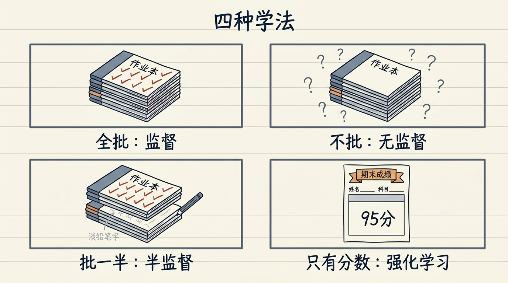

> 🧭 **呼吸点**：引子的账——四种批法的分水岭只有一个：
> **你付不付得起标签钱**。

---

#### 4. 工程死穴 + 先认词：标签从哪来

**先认词 · 第一批**（本讲新词都在这里定义，后面不再解释）

| 中文 | 英文 | 一句操作定义 |
| :--- | :--- | :--- |
| 伪标签 | pseudo label | 先用有标签数据训 M₀，再用 M₀ 给无标签数据贴一个假标签 y′ |
| 受限玻尔兹曼机 | RBM = restricted Boltzmann machine（restricted 受限：层内不相连） | 一层可见 v + 一层隐元 h 的二部图，学"哪些配置常一起出现" |
| 对比散度 | CD = contrastive divergence | 不做完整马尔可夫链，只走 k 步就估梯度 |
| 深度信念网络 | DBN = deep belief network | 把 RBM **逐个堆叠**：训好一个冻结一个，输出当下一层输入 |
| 强化学习 | RL = reinforcement learning（reinforcement 强化、learning 学习） | 学一个**策略** π：在状态 s 下出什么动作 a，使**长期累计奖励**最大 |

**先认词 · 第二批**

| 中文 | 英文 | 一句操作定义 |
| :--- | :--- | :--- |
| 状态 / 动作 / 奖励 | state / action / reward | 状态=当前局面；动作=改哪几个模态系数；奖励=改完好坏的变化 |
| Q 值 | Q(s,a) | "在 s 下执行 a，往后一共能拿多少分"的期望，Q-learning 就是把它列表或拟合出来[^L04-12] |
| DQN | Deep Q-Network | 用深度网络代替 Q 表，配合 ε-greedy 在"用已知最好"与"试新的"之间权衡 |
| 策略梯度 | policy gradient（确定性策略梯度 DPG 直接把状态映射到最优动作）[^L04-13] | 不估 Q，直接对 π 的参数求梯度 |

**死穴数据**：一次 CFD 几小时，1000 组样本就是一个课题组一学期的机时。
半监督正是在"标签不完整且获取代价高昂"这个背景下出现的[^L04-1]。

它的正式定义也摆在那儿：用少量有标签数据、
配大量无标签数据一起训[^L04-2]。

**把"标签从哪来"画成预算表**（左边是纯监督的浪费，右边是半监督的用法）：

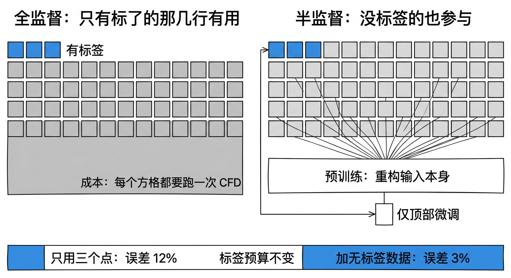

> 图注：两侧"误差 12% / 3%"是**示意数字**，用来说明"标签预算不变、精度换来源"；
> 论文侧的真实证据是本讲 §7 那三张图与其样本量，别拿这张图当论文数据引用。

> 🧭 **呼吸点**：§4 的账——本讲两个工具都是"付不起标签钱"的活法：
> 半监督是自己造标签，强化学习是拿奖励换标签。

---

#### 5. 数学从 0 到 1：三块，各配一张图

**（a）伪标签的更新式**。

给定有标签集 (X_L, Y_L) 与无标签集 X_U，三步：

1. 只在有标签样本上训一个 M₀；
2. 用 M₀ 给每个 x_j ∈ X_U 贴上伪标签 y′_j；
3. 真标签与伪标签合并，再训一个 M_semi。

第三步里的 λ 是**信任折扣**——伪标签不是事实，只按 λ 的成色计入损失。
论文 Fig. 25 的流程正是"真标签与伪标签合并后再训一个监督模型"[^L04-14]。

<details>
<summary>LaTeX 渲染版</summary>

$$
M_0 = \arg\min \sum_{i\in L}\big(\hat y(x_i)-y_i\big)^2,\qquad y'_j = \hat y_{M_0}(x_j)
$$

$$
M_{\text{semi}} = \arg\min\Big[\sum_{i\in L}\big(\hat y(x_i)-y_i\big)^2
+ \lambda\sum_{j\in U}\big(\hat y(x_j)-y'_j\big)^2\Big]
$$

</details>

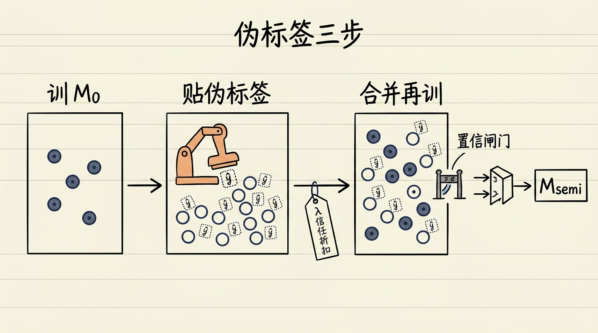

🔮 **下注**：M₀ 在无标签点 x_u 上预测 C_D = 0.0180，真值 0.0205。
第二轮把这个 0.0180 当事实去拟合，误差会被**稀释**还是被**固化**？先选一个。

👊 **打脸**：**误差被固化**。
第一轮偏低 12% 的预测，第二轮变成训练目标，第三轮再在这个基础上偏。

若 M₀ 对畸形外形系统偏乐观，伪标签会把模型往
"畸形但看似好"的区域再推一把——这就是**自我强化的偏见**。

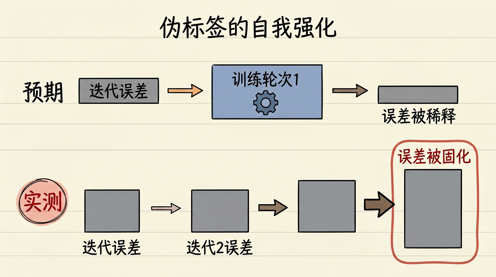

**手算一遍**：0.0205 → 0.0180，低了 0.0025，相对偏差 12.2%。
工程上必须加两道闸：

- 闸门①置信度门槛：只接受 |σ| < 1.96σ̂ 的伪标签；
- 闸门②抽查：每 5 轮抽 5% 做真 CFD 校验，若 MAE 增 >10% 就丢掉该批伪标签。

**（b）RBM 的能量直觉**。

先说结论：RBM 学的是一个概率分布，
**数据里的配置能量低，模型自造的配置能量高**。

  E(v,h) = −aᵀv − bᵀh − vᵀWh，  P(v,h) ∝ exp(−E)

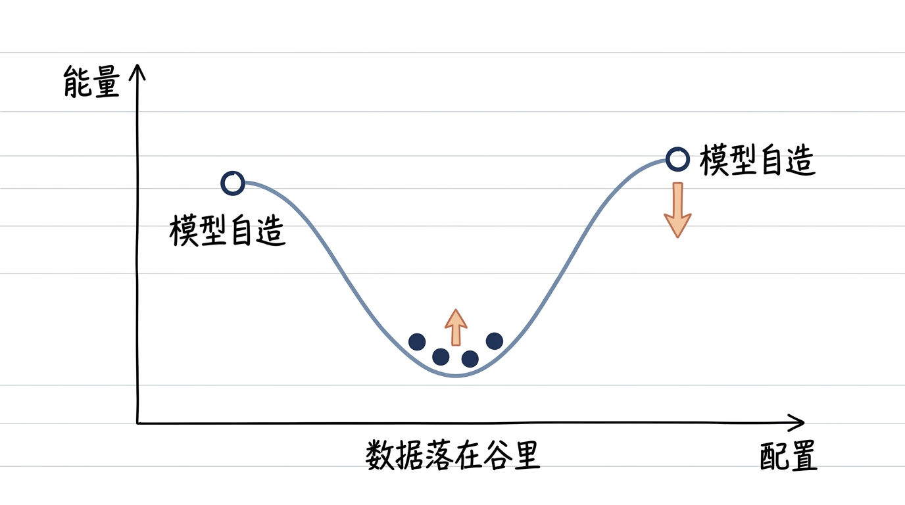

训练就是两个相位相减：正相位把数据配置的概率顶上去，
负相位把模型自造配置的概率压下来。

负相位要做吉布斯采样走到平衡[^L04-3]，
外积 v′h′ᵀ 就是那个负梯度[^L04-4]——太慢，于是 CD-k 只走 k 步。

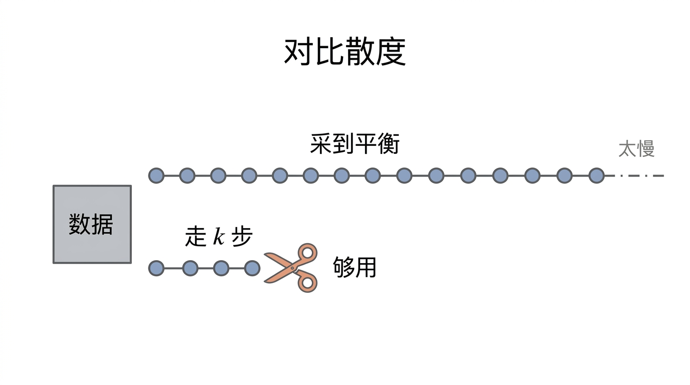

为什么叫 restricted：可见层与隐层之间全连[^L04-5]，
而同层内的节点之间没有连线[^L04-6]。
于是**给定一层的值，另一层各神经元条件独立**，整层可以并行采样[^L04-7]。

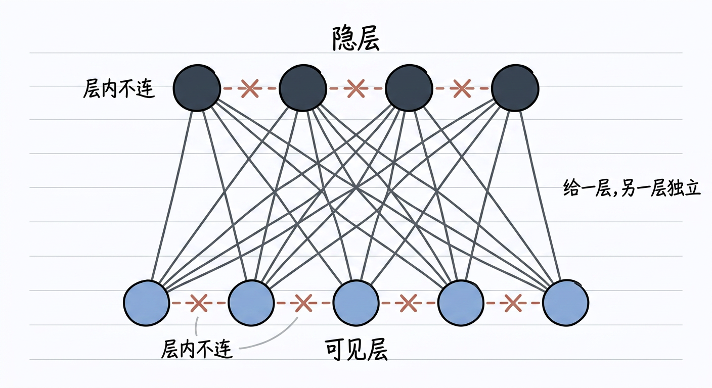

**（c）RL 的三件套翻译**。把你的优化循环改写成 RL 语言：

- 状态 s_t =（当前设计变量、C_L、C_D、剩余约束裕度、t/总步数）；
- 动作 a_t = Δ 模态系数向量，动作空间连续 → **必须用策略梯度/DPG 而非 Q 表**；
- 奖励 r_t = (C_D,t − C_D,t+1) × 10⁴，用"省下多少阻力计数"当奖励。

目标是让长期累计折扣奖励最大。
奖励这一步的定义很直白：每执行一个动作就算一次[^L04-15]；
而策略本身只是"从状态空间到动作空间的一张映射"[^L04-16]。

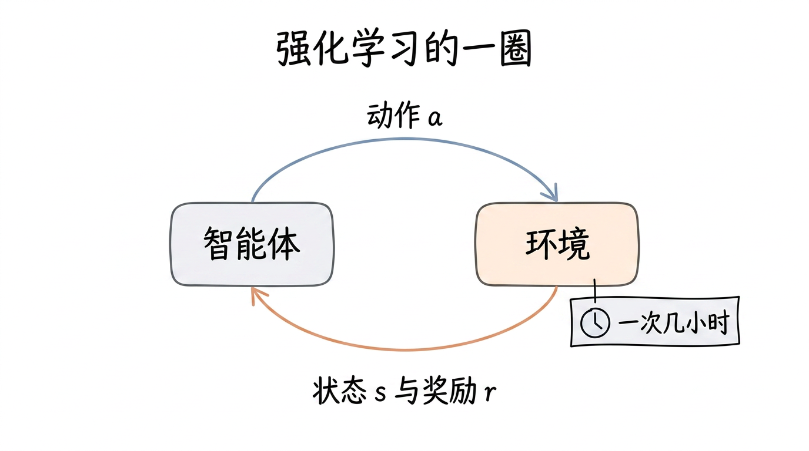

**为什么难训**：奖励稀疏（中间步 CFD 不收敛 = 0 分，噪声淹没信号）、
约束不可微（"厚度 ≥ 2 mm"塞不进奖励），
且**策略每改一次都要真实 CFD**。

> 🧭 **呼吸点**：§5 的账——伪标签是借来的标签，RBM 是借来的分布，
> RL 是借来的评价；三笔债都要还，只是还款方式不同。

---

#### 6. 操作流：什么时候真的该用它们

| 场景 | 该不该用本讲工具 | 做法 |
| :--- | :--- | :--- |
| 你有 1000 组 CFD + 10 万组**未收敛/半收敛**的粗网格结果 | ✅ 半监督 | 把"残差降到 −2.5 但没收敛"的算例当**无标签集**，用高精度模型贴伪标签，λ 取 0.1–0.3 |
| 你要做**序贯决策**：每一步选"在哪个区域加点" | ✅ RL（或退化为一维 bandit） | 但先别上 DQN：用 Thompson 采样/EI（讲 02/09），它是"不需要训练"的策略 |
| 你要预训练一个能生成合理叶型的模型 | △ RBM/DBN 已过时 | 现在直接用 VAE/GAN（讲 05）；RBM 只需知道思想（逐层贪心 + CD） |
| 你只是想让 η 的置信区间更好看 | ✘ 与本讲无关 | 那是 UQ 问题，见讲 02 §8 与你的 MC Dropout 覆盖率 65%（E2） |

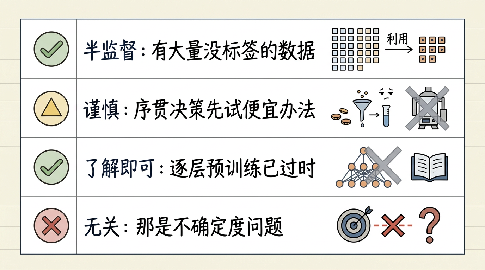

DBN 的堆叠规矩是"训好一个、冻结一个、输出当下一层输入"[^L04-17]，
论文也承认它**绕开了反向传播**带来的局部最优与梯度消失[^L04-18]。
至于今天还值不值得学，答案在批判第 2 条里。

> 🧭 **呼吸点**：§6 的账——先判断你缺的是"标签"还是"决策"，
> 再挑工具；顺序反了一定踩坑。

---

#### 7. 数据与图表：Fig. 25 / 27 / 29 的读法与批评

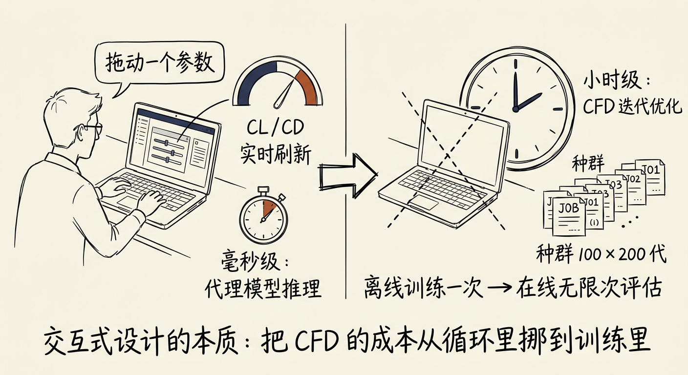

> 借这张图看本讲的两条路：**半监督**是"把没批改的作业自己批改一遍"（图左的推理循环），
> **RL** 是"把昂贵评估换成环境交互"（图右的排队工单）。
> 两者的共同点：**它们省的都是"标签钱"，而不是"计算钱"**。

- **Fig. 25（p26，半监督流程）**：读"回流"那条线——**伪标签要重新进监督模型**，
  不是加个正则项就完事；可挑剔：图上没标 λ、也没画置信度闸门，
  而这恰是工程可行性的全部所在。
- **Fig. 27（p27，RBM 一步 CD 更新）**：它把"正/负相位"画成两次前向；**这是全书最抽象的一张**，
  建议你**自己用 4 个可见神经元、2 个隐元手推一次**（留作习题，手写一遍胜过读十遍）。
- **Fig. 29（p28–29，RL 循环）**：只有一个环（s → a → s′ → r），简单，
  但**缺了"环境"侧的成本标注**——气动里这个环每一格都是几小时 CFD。

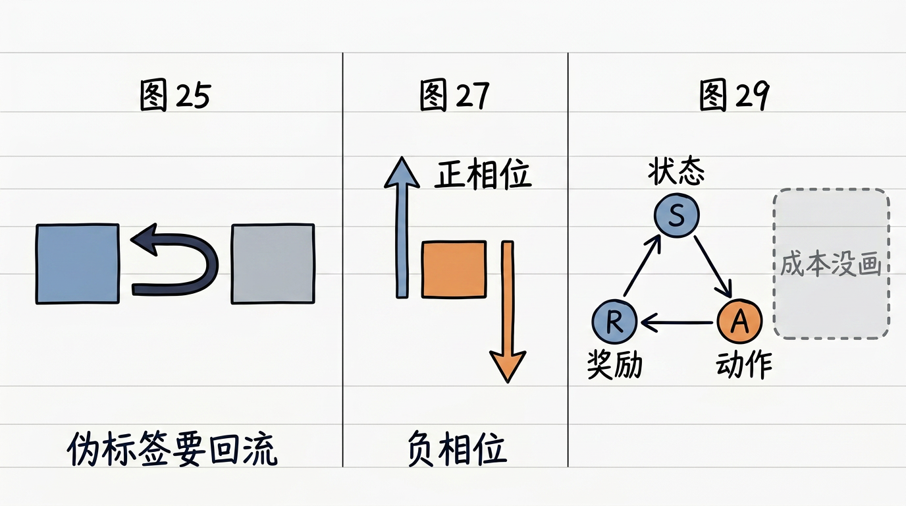

论文自己给的两条边界也要记住：
一是 RL 吃数据和算力，真实物理系统同样躲不过维度灾难[^L04-19]；
二是状态太多反而会拖垮结果[^L04-20]。

> 🧭 **呼吸点**：§7 的账——读这三张图只问一句：
> **这张图替谁省了钱，又对谁的成本只字不提**。

---

#### 8. 审稿人批判（本讲可攻击的点，含对论文本身的）

1. **§3.3 半监督在 ASO 里只给了通用原理，没给气动应用案例数**：读者无从判断"这在气动圈到底用了没有"（我判断：几乎没被认真用——这是可写进组会的观察，属推断，非论文所述）；
2. **RBM/DBN 占了 2 页，而气动设计里早已被 AE/GAN 取代**：篇幅分配像为"教材完整性"服务，不像为读者决策服务；
3. **§3.4 讲 RL 却不给"奖励函数怎么写"的失败模式**：奖励塑造（reward shaping）是 RL 工程的第一大坑，综述把它略过了；
4. **RL 与代理优化的边界未讨论**：EI/UCB 本质上是"一步决策的 bandit"，与 RL 有明确联系，分开讲割裂了读者的直觉（这条在 §4.3.1/§4.3.3 也欠着）。
5. **顺带批本白皮书自己**：本讲把"误差被固化"画成了打脸图，
   但我们没在你的数据上复现过这条误差链——
   图上的轮数与误差是**示意**，不是实测。

---

#### 9. 承前启后

- **承前**：本讲处理的是"标签经济学"——讲 02 假设你有标签、讲 03 假设不需要标签，本讲处理中间地带；
- **启后**：RL 的循环结构是讲 09 §4.3.3 的前置；伪标签会作为"廉价数据再利用"在讲 08（多保真/数据增强）复现；
  RBM 的"逐层预训练"思想在讲 05 的深度网络训练（梯度流、初始化）里以另一种形态回来。

---

#### 10. 你的项目接哪一步（六层阶梯的"回收"层）

| 现状（你的平台） | 本讲给的改法 | 口径 |
| :--- | :--- | :--- |
| 一批 relrms = −3.39 未收敛的 SU2 结果（E3） | 别丢：当作**无标签集**做半监督（伪标签 + 置信闸门），或用 Co-Kriging 当低精度层——**前提是先说清"未收敛"这个事实** | E3 定性可用，不得当定量结果 |
| NSGA-II 循环（种群 100 × 200 代） | 先不转 RL。改成"在 8–20 维模态空间里加点"的 EGO 式序贯决策（讲 09），你已具备全部零件 | E0 计划 |
| 想探索 RL | 小步走：把"选下一个采样点"建模成 1 维 bandit（Thompson 采样），样本需求比 DQN 低两个数量级，先验证"能不能省 CFD" | — |

🛠 **修复清单**（全书连载，本讲新增）：

- **#5 未收敛算例登记为无标签集**：给 relrms = −3.39 那批数据打上"未收敛"标记，
  先过置信闸门（|σ| < 1.96σ̂）再进伪标签流程，λ 取 0.1–0.3，每 5 轮抽 5% 真 CFD 校验。

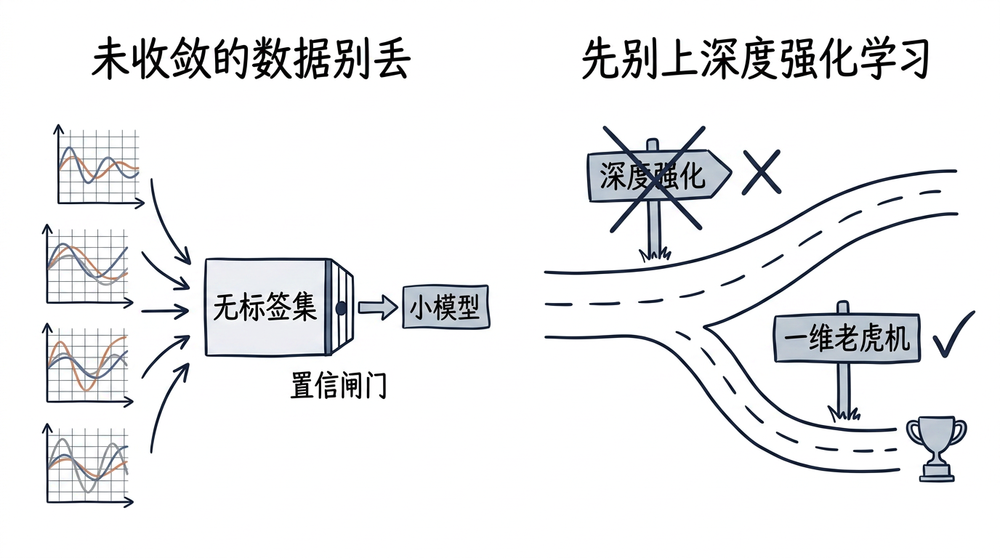

---

#### 11. 自测 10 题（2 选择 + 2 填空 + 6 问答；合上论文作答）

1. （选）RBM 之所以叫 restricted，是因为：A 隐元数受限 B 层内神经元不相连，导致给定一层时另一层条件独立 C 只能二分类 D 参数必须非负
2. （选）伪标签最大的风险是：A 计算慢 B 模型错误被固化并自我强化 C 需要 GPU D 破坏可导性
3. （填）半监督学习的定义是：用少量 __________ 数据与大量 __________ 数据联合训练。
4. （填）Q-learning 跟踪的对象是 __________；连续动作空间通常改用 __________ 方法。
5. （答）写出三步伪标签算法，并给出两个"闸门"的具体形式（含阈值写法）。
6. （答）用 RL 语言把你的 NSGA-II 循环重写：s / a / r 各是什么？为什么动作必须是连续的？
7. （答）对比散度 CD-k 用"k 步"替代了什么？代价是什么（偏差从哪来）？
8. （答）DBN 的"逐层贪心 + 冻结"为什么能训深层网络？它在今天被什么取代了？（两个具体原因）
9. （答）你的粗网格数据若做低精度层，必须满足什么前提才不算自欺？请用一行式子表达"相关性"判据。
10. （答）批判：为什么说"奖励函数写法"比"用 DQN 还是 PPO"更重要？给一个会翻车的奖励设计并解释。

**答案要点**（一题一行，先做再看）：

1. B——层内不相连，给定一层时另一层条件独立。
2. B——模型错误被固化并自我强化。
3. 有标签、无标签[^L04-2]。
4. Q 值（状态-动作对的期望回报）、策略梯度（含确定性策略梯度）[^L04-13]。
5. 三步见 §5(a)；闸门①只接受 |σ| < 1.96σ̂ 的伪标签；闸门②每 5 轮抽 5% 做真 CFD 校验，若 MAE 增 >10% 则丢该批。
6. s =（X, C_L, C_D, 裕度, t/T）、a = Δ 模态系数 ∈ ℝ^8、r = ΔC_D × 10⁴；连续是因为模态系数没有天然离散化，Q 表会爆炸。
7. 替代"采到平衡分布"的长链；偏差来自初始分布（训练样本）而非模型分布 → 负相位样本过于"像数据"，欠估模型分布、高估数据概率。
8. 逐层训练保持每层梯度稳定，避开端到端小样本的梯度消失与鞍点；被 ResNet/BN/好初始化 + 端到端 Adam 取代。
9. 判据 ρ = cov(y_lf, y_hf)/(σ_lf σ_hf) ≥ 0.9，且残差结构平稳；未收敛数据先补到收敛再谈融合。
10. 例：r = −C_D 会把策略推向"畸形但低阻"的外形（CFD 发散给 0，反而最"安全"）→ 必须加合法性惩罚与不可行动作终止，否则奖励在替你说谎。

---

#### 12. 带走 3 个数

📌 **带走 3 个数**：

1. **0.0180 vs 0.0205**——伪标签手算例：第一轮低 12%，第二轮把它当事实，误差就固化了。
2. **λ = 0.1–0.3**——伪标签的信任折扣：假标签只按这个成色计入损失。
3. **100 × 200**——你的种群 × 代数：这就是"策略每改一次都要真实 CFD"要付的账，先别换 RL。

---

#### 13. 一句收口

> **半监督与强化学习不是更高级的算法，是两种"付不起标签钱"的活法；
> 搞清楚你在付什么钱，才知道该借哪一笔。**

[^L04-1]: 〔原文 P26 "data labels (e.g., experimental aerodynamic data) are incomplete and costly to obtain"〕

[^L04-2]: 〔原文 P26 "work with a small amount of labeled data and a large amount of unlabeled data"〕

[^L04-3]: 〔原文 P27 "This step is also called Gibbs sampling step"〕

[^L04-4]: 〔原文 P27 "Compute the outer product"〕

[^L04-5]: 〔原文 P26 "every node in the visible layer is connected to every node in the hidden layer"〕

[^L04-6]: 〔原文 P26 "while the nodes in the same layer have no connections between each other"〕

[^L04-7]: 〔原文 P27 "Its training is faster than traditional Boltzmann machine because of the restrictions"〕

[^L04-12]: 〔原文 P30 "core idea of q-learning"〕

[^L04-13]: 〔原文 P31 "deterministic policy gradient method"〕

[^L04-14]: 〔原文 P26 "predicts peudo labels"〕

[^L04-15]: 〔原文 P29 "The reward r is computed after each action execution"〕

[^L04-16]: 〔原文 P29 "The policy is a map from the state space to the action space"〕

[^L04-17]: 〔原文 P28 "Each RBM is trained until convergence, then frozen"〕

[^L04-18]: 〔原文 P28 "DBN training avoids backpropagation"〕

[^L04-19]: 〔原文 P30 "requires a lot of data and computational budget"〕

[^L04-20]: 〔原文 P30 "too much RL can lead to an overload of states"〕

---

<a id="lec-05" name="lec-05"></a>
<!-- v2 -->
### 【讲05】神经网络全家桶：从 ANN 到 PINN
**覆盖论文 §3.5（3.5.1 基础 / 3.5.2 训练 / 3.5.3 CNN / 3.5.4 RNN / 3.5.5 AE / 3.5.6 GAN / 3.5.7 SOM / 3.5.8 PINN）｜ PDF 第 32–40 页 ｜ 配图 Fig. 32–41**

---

#### 0. 本讲元数据

| 项 | 值 |
| :--- | :--- |
| 本讲范围 | §3.5.1–§3.5.8（p32–41）：ANN → CNN/RNN → AE/VAE/GAN/SOM → PINN |
| 前置 | 讲 02（损失函数 = 极大似然的平方和形式）、讲 03（潜空间/降维）、讲 01（伴随 = 反向传播的同族） |
| 读完你应该能 | ① 讲清"一次前向 + 一次反向"；② 说清八个架构各自替代哪一格；③ 判断你的残差网络缺哪一块 |

<details>
<summary>审查层（导师验收用：蓝本 / 证据等级 / 装配信息）</summary>

| 项 | 值 |
| :--- | :--- |
| 蓝本 | Li, Du, Martins, *Machine Learning in Aerodynamic Shape Optimization*, Prog. Aerosp. Sci. 134 (2022) 100849 |
| 证据等级 | **A 级**（本讲每个数字与公式都有 `〔原文 P## "…"〕` 溯源，由 `tools/verify_all.py` 逐条核） |
| 前置 | 讲 02（损失函数 = 极大似然的平方和形式）、讲 03（潜空间/降维）、讲 01（伴随 = 反向传播的同族） |
| 读完你应该能 | ① 用"一次前向 + 一次反向"讲清训练；② 说明 CNN/RNN/AE/VAE/GAN/PINN 各自**在气动里替代哪一步**；③ 说清 PINN 损失的两大项与它为什么"少要数据"；④ 判断自己那台 523,011 参数的残差网络缺了哪一块 |
| 本讲一句话 | **神经网络全家桶不是八种模型，是三种欲望的八种写法：想更准（CNN/RNN）、想要流形（AE/VAE/GAN/SOM）、想少付数据（PINN）。** |

</details>

---

#### 1. 你在这里

12 讲第 5 站（工具箱站最后一站）。前四站给了你模型、降维与标签经济学，
本讲把这些零件**拼回同一个损失函数**。

**你的平台·第 5 站**：你那台 523,011 参数的残差代理，
本讲要给它做一次体检——**结构对不对、缺哪一项**。

---

#### 2. 上讲的数

⏪ **上讲的数** · 讲 04 的两个数，合上书各报一个：

1. 伪标签最大的风险叫什么？两道闸门分别怎么设？
2. RL 的三件套 s / a / r 在你的优化循环里各是什么？

<details>
<summary>答案</summary>

1. **自我强化的偏见**（误差被固化）；闸门①只接受 |σ| < 1.96σ̂ 的伪标签，闸门②每 5 轮抽 5% 做真 CFD 校验。
2. s =（设计变量、C_L、C_D、裕度、t/T），a = Δ 模态系数，r = ΔC_D × 10⁴。

</details>

---

#### 3. 场景引子：一条流水线上的八个工位

把"从外形到性能"想成一条手工流水线：

- **ANN（Artificial Neural Network，人工神经网络）**：一个"万能表格"，你给它形状参数，它吐气动力系数；
- **CNN（Convolutional Neural Network，卷积神经网络）**：不读参数表，**直接看图**（网格场），用小窗口滑动找局部特征；
- **RNN（Recurrent Neural Network，循环神经网络）**：**沿叶高/沿时间**一格一格读，自带记忆（LSTM 的三门）；
- **AE（Autoencoder，自编码器）**：先把图**压成几个数**再还原，逼自己只留最要紧的信息；
- **VAE（Variational AE，变分自编码器）**：压成的不是数，是**一个分布**（μ 和 σ），于是能"随机生成"新形状；
- **GAN（Generative Adversarial Network，生成对抗网络）**：造假者 vs 鉴定者互相打，最后造出来的以假乱真；
- **SOM（Self-Organizing Map，自组织映射）**：把高维形状摆到一张二维"地图"上，**相邻的形状长得像**；
- **PINN（Physics-Informed NN，物理信息神经网络）**：不许只学数据，**还要满足方程**，不满足就罚。

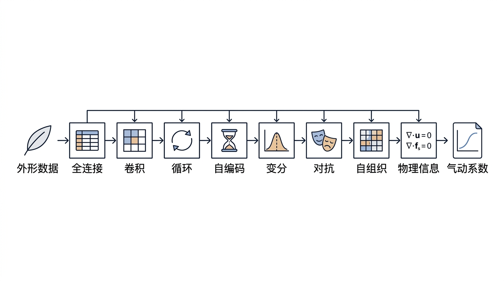

论文对 ANN 的定位很直白：ANN 是深度学习的**核心组件**，
近年的 ML-based ASO 进展绝大多数用的都是 ANN[^L05-1]。

八个名字容易记成八件事，其实它们是一棵树：

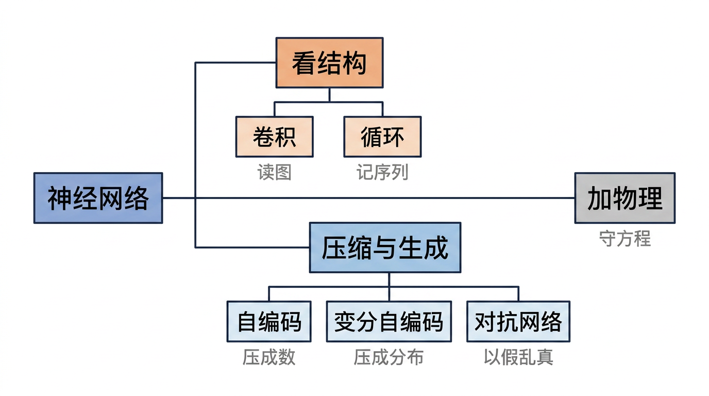

> 🧭 **呼吸点**：引子的账——八个架构不是八门课，
> 是三种欲望：**更准**、**要流形**、**少付数据**。

---

#### 4. 工程死穴 + 先认词：为什么"更深"不等于"更好"

**先认词 · 第一批**（本讲新词都在这里定义，后面不再解释）

| 中文 | 英文 | 一句操作定义 |
| :--- | :--- | :--- |
| 前向传播 / 反向传播 | forward pass / backpropagation | 前者：输入 → 输出；后者：从输出把梯度一路送回每层权重（ML 界把自动微分反传称为 backpropagation，现代软件包内置）[^L05-2] |
| 激活函数 | activation function | 给每个神经元加"非线性"，否则多层等于一层（ReLU: r(z) = max(0, z)）[^L05-3] |
| 损失函数 | loss function | 预测与观测的平方和：min_θ Σᵢ (ŷᵢ(θ) − yᵢ)² |
| 梯度消失 | vanishing gradient | 层数深时，梯度在反传中逐层乘小于 1 的因子 → 前面的层几乎学不到 |
| 过拟合 | overfitting | 训练集很好、留出集很差：记住了噪声 |

**先认词 · 第二批**

| 中文 | 英文 | 一句操作定义 |
| :--- | :--- | :--- |
| 转置卷积 | transposed convolution | 反卷积上采样（先补零再卷），把低维特征放大回高维场[^L05-4] |
| 瓶颈层 | bottleneck layer | AE 中间那一小段，潜变量住在这里 |
| 模态崩塌 | mode collapse | GAN 的生成器只造少数几种花样，判别器卡住不再进步[^L05-5] |
| 拓扑保持 | topology preservation | SOM 的要求：输入空间相邻的点，在映射图上仍相邻[^L05-6] |

**死穴**：气动数据是**小样本 + 强相关**（相邻控制点几乎一样），
所以网络容易①过拟合到历史型号、②在流形外乱给数（外推）、
③根本不知道自己在违物理（负压区、质量不守恒）。

这三条分别对应本讲的 VAE/GAN（管①的多样性）、PINN（管③）、
留出集 + 置信带（管②，见讲 07/09）。

> 🧭 **呼吸点**：§4 的账——"更深"从来不是免费的，
> 深度换来的表达力要拿**梯度、样本、物理合理性**三样东西去抵。

---

#### 5. 数学从 0 到 1：五块，每块一张图

**本讲两个"必须会画"的结构**（左：自编码器的瓶颈；右：PINN 的三项损失）——
它们分别对应"降维"与"讲物理"，
也是你被追问"AE 和 PINN 到底差在哪"时的唯一答法：

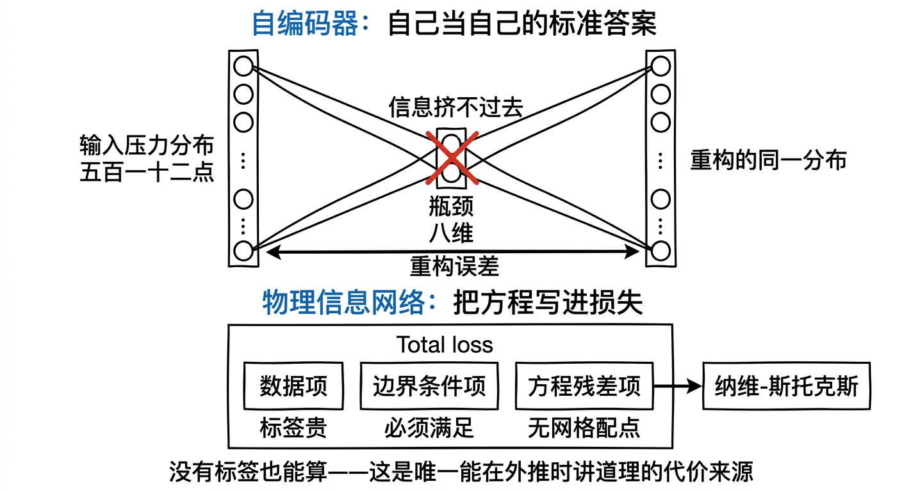

**（a）一层神经网络在算什么。**

  z = W h_prev + b，  h = σ(z)

**参数量算例**（这一手你必须会，因为组会必问）：
Linear(74 → 256) 的参数量 = 74 × 256 + 256 = **19,200**；
Linear(256 → 256) = 256² + 256 = **65,792**。

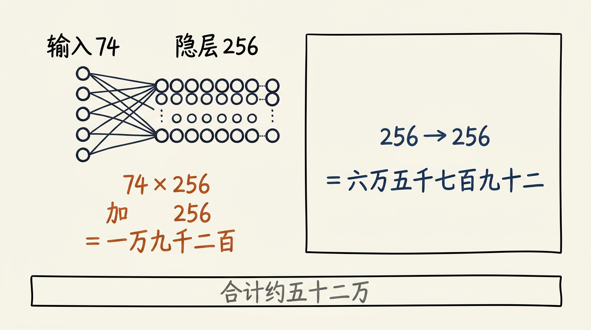

你那台残差代理 523,011 个参数，大致就是
"一个 19,200 的入口 + 若干个 65,792 的块 + 出口"堆出来的。
**数量级对得上，说明它是个"中等身材"的网络**，不是黑魔法。

**（b）训练 = 一次极大似然。**

论文的表述：神经网络训练的核心原则就是极大似然估计，
把参数优化到"在给定输入下使观测输出出现概率最大"[^L05-7]，
于是目标函数写成式 (64) 的平方误差和：

  min_θ Σᵢ (ŷᵢ(θ) − yᵢ)²

**残差代理的妙处**：预测 y = y_CFD_base + f_θ(x)，
即让网络只学"相对基准的增量"。
这在数学上等价于给回归加了一个"先验中心"，小样本时明显更稳。

**（c）为什么需要激活，以及梯度消失从哪来。**

激活函数给网络加非线性，论文的写法是 ReLU 与 Leaky ReLU[^L05-8][^L05-9]。
没有它，多层网络等价于一层线性变换——白堆。

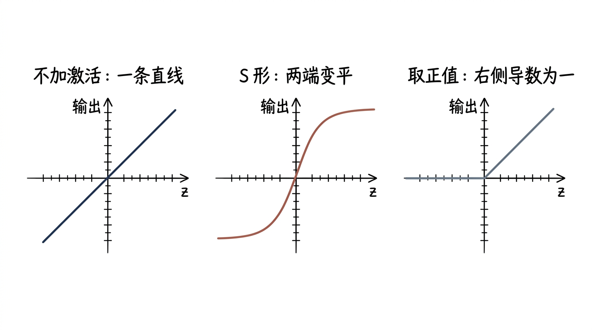

🔮 **下注**：若 σ 取 sigmoid，σ′(z) ≤ 0.25。
十层串联、链式法则一路乘下来，第一层还能收到多少梯度？先猜个数量级。

👊 **打脸**：0.25^9 ≈ 4 × 10⁻⁶，**第一层几乎收不到梯度**。
这就是 vanishing gradient 的算术版本[^L05-10]。

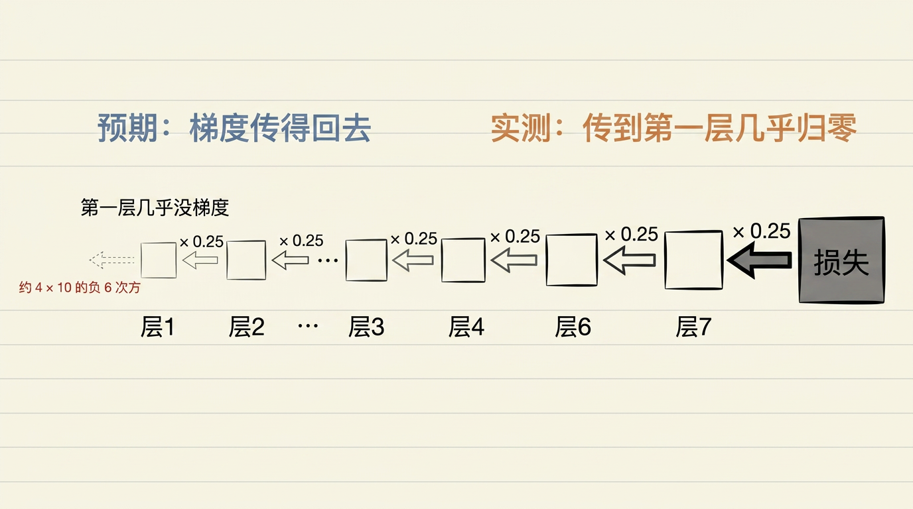

> 图注：链上数字是按 0.25^9 手算的**示意链**，
> 真实网络的每层因子各不相同；结论不变——**连乘会指数衰减**。

ReLU 的导数在 z > 0 处为 1，所以能训深；
代价是 z < 0 时导数为 0（"死 ReLU"），于是有了 Leaky ReLU（式 63）。

**（d）AE / VAE / GAN 的目标函数（三行版，务必背）**

- AE：min ‖D(E(x)) − x‖² —— 重构误差；瓶颈层强制压缩[^L05-11]；
- VAE：min ‖x̂ − x‖² + β · KL(q(z|x) ‖ p(z)) —— 多了一项"把潜分布拉成标准正态"，
  于是**潜空间可以采样生成**；论文明确说 VAE 的编码器输出的是 μ 与 σ[^L05-12]；
- GAN：min_G max_D E[log D(x)] + E[log(1 − D(G(z)))] —— 对抗，
  判别器让"假"的概率趋 0、"真"趋 1。

瓶颈就是那个强制压缩的窄口，少它网络会学出恒等映射：

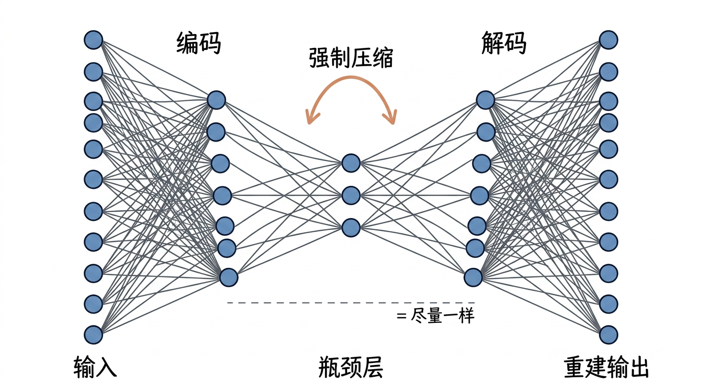

VAE 把瓶颈里的"一个点"换成"一坨概率"，
这就是它能生成、能插值、能当设计空间的根因[^L05-13]：

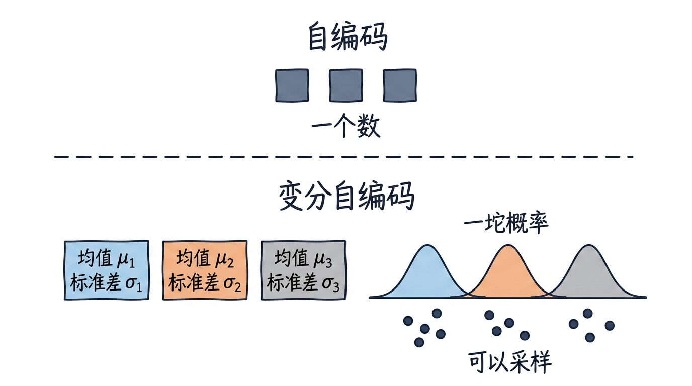

**（e）PINN 的损失函数（这是全书的题眼之一）。** 论文式 (79)：

  min_θ  Σ_{i=1}^{N_u} (ŷ_{u,i}(θ) − y_{u,i})² + Σ_{i=1}^{N_f} (r̂_{f,i}(θ))²[^L05-14]

第一项是**数据项**（在有数据的点上要对得上），
第二项是**物理残差项**（在配点上，偏微分方程残差要小）[^L05-15]。
配点就是"没有标签、只要求满足方程"的内部点。

**为什么这样能少要数据**：数据项只约束 N_u 个点，
而物理项把**整条方程**当"无限多条软约束"，
把解空间从"任意光滑函数"缩到"近似满足守恒律的函数族"。

论文对 PINN 的原始定义就是：
既完成监督学习任务、又尊重物理规律的神经网络[^L05-16]。

**手算例（把抽象砸实）**：设一维定常问题 r̂ = dp̂/dx + 0.5，
在 3 个配点上估出残差 r = (0.41, 0.52, 0.49)，则物理损失
= 0.41² + 0.52² + 0.49² = 0.168 + 0.270 + 0.240 = **0.678**。

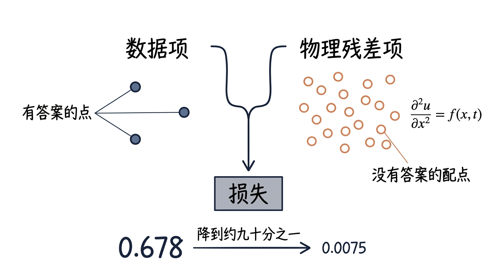

若网络把三处残差都改到 0.05，损失 = 3 × 0.0025 = **0.0075**，降 **91 倍**。
**这就是"把物理写进损失函数"的全部含义：不新增数据，只新增一项可以求导的惩罚。**

> 🧭 **呼吸点**：§5 的账——五个式子其实是一句话：
> **把"我不知道怎么写的规则"翻译成"我能求导的惩罚项"**。

---

#### 6. 操作流：八个架构在 ASO 流水线里各替代哪一格

| 架构 | 输入 | 输出 | 在 ASO 里替代 | 主要风险 |
| :--- | :--- | :--- | :--- | :--- |
| MLP-ANN | (n, d) 设计变量 | (n, m) 系数（C_L/C_D/C_M） | **替代 CFD 的"评估"格** | 外推不可信（讲 07） |
| CNN | 网格/图像场 | 系数或场 | 免参数化直接读形状；也可做几何合法性判别（讲 06） | 分辨率/网格绑定，换网格就失配 |
| RNN/LSTM | 沿展向/时间的序列 | 序列（沿程载荷、C_p 分布） | 三维叶片/非定常问题 | 训练慢；长序列梯度问题 |
| AE | 高维形状/场 | 潜向量 + 重构 | **替代"人工挑参数"**（模态参数化，讲 06） | 重构看着好、物理不合理 |
| VAE | 形状 | (μ, σ) + 生成 | 设计空间探索、样本生成 | 模糊（均方损失天生糊） |
| GAN/InfoGAN | 潜变量 z | 逼真空形 | 造数据 + 潜变量当设计变量（论文：贝塞尔/B 样条 + GAN 生成光滑真实翼型[^L05-17]） | **模态崩塌**[^L05-5] |
| SOM | 高维设计变量 | 2 维拓扑地图 | 看"设计变量在权衡图上的位置"（Obayashi & Sasaki 用它做设计变量聚类[^L05-18]） | 拓扑与尺度敏感 |
| PINN | 坐标（x, y） | 场变量 | 替代求解器本身（最激进） | 边界条件一变就要重训，工程不友好〔原文 P41 关于固定初边值条件的说法，见 §6〕 |

**三句论文自己的话要记住**。CNN 省参数靠的是滤波器与池化[^L05-19][^L05-20]，
代价是要吃大量数据[^L05-21]。

RNN 的名字来自那个指向自己的反馈环[^L05-22]。

WGAN 那句"权重裁剪是糟糕办法"的坦率评论也别忘了[^L05-25]：
换损失不等于免调参。

> 🧭 **呼吸点**：§6 的账——选架构只问一句：
> **你要替掉的是评估、参数化、还是求解器本身**。

---

#### 7. 数据与图表：读 Fig. 32（ANN）与 Fig. 36/37（AE/VAE）

- **Fig. 32（p32）**：黑箭头=前向、蓝箭头=反传[^L05-23]，
  一句话看懂"训练 = 反向把梯度送回权重"。
  **可挑剔**：图里没有"损失函数"这个节点，
  初学者会误以为"反传是自动变好"，其实反传只是**求梯度**，
  变不变好由式 (64) 那个目标函数决定。
- **Fig. 36（p37）**：AE 的沙漏形——
  **这张图的价值全在"瓶颈层"三个字**：
  没有它，网络会学出恒等映射（白学）。
  给组会的一句话是：*瓶颈 = 强制压缩 = 隐式正则化*。
- **Fig. 37（p38）**：VAE 用 (μ, σ) 替代瓶颈向量——**从"一个点"变成"一坨概率"**，
  这就是它能生成、能插值、能当设计空间的根因。

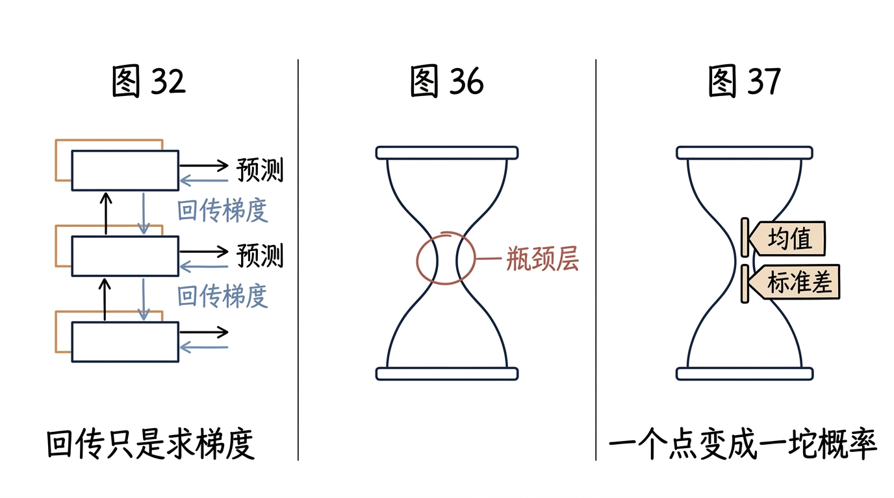

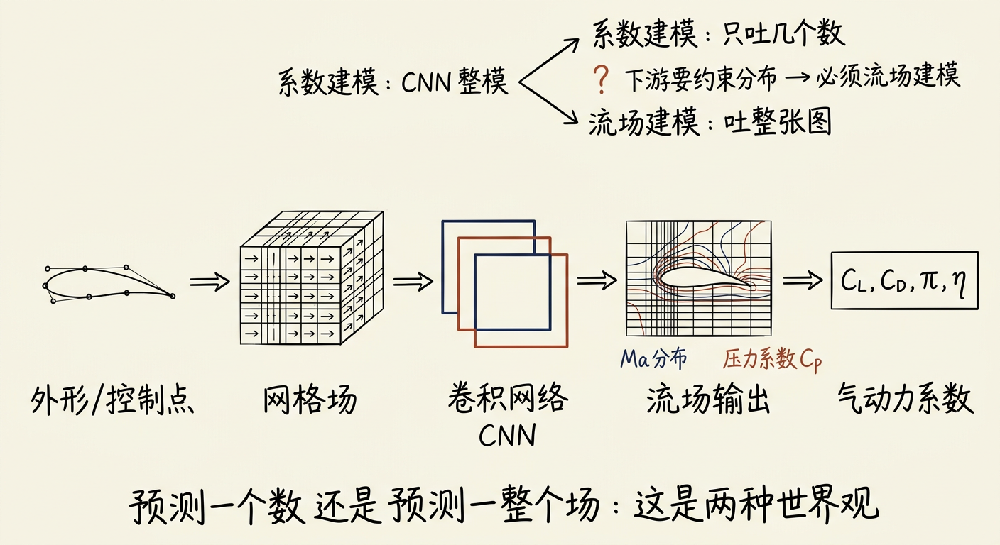

> 把本讲的八个架构摆进这张图：MLP 在"系数建模"一侧（图左支），
> CNN/RNN/AE/VAE/GAN 在"流场建模"一侧（图右支），
> **PINN 不在这条流水线上——它替代的是中间那个黑箱本身**。

> 🧭 **呼吸点**：§7 的账——读架构图只找两样东西：
> **瓶颈在哪、损失函数的项在哪**。

---

#### 8. 审稿人批判（本讲可攻击的点，含对论文本身的）

1. **§3.5 是"教科书体"，与 §4 应用体写法不统一**：读者读完仍不知道"我该选哪个"；缺一张决策表（我们上面那张就是替他补的）；
2. **没有训练细节**：优化器、学习率、BN、Dropout、早停——一句都没写。这在 2022 年已经不算"可省略"，
   因为气动圈复现失败八成栽在这里；
3. **PINN 的工程障碍只点到为止**：原文明说最初设定在一组固定的初边值条件下，
   对"每轮迭代边界都变的优化"是硬伤〔原文 P41 "the original PINN was set up under a fixed set of initial and boundary conditions"〕，
   但没有量化"重训一次要多久 vs 一次 CFD 要多久"；
4. **GAN 一节把 mode collapse 与 WGAN 的权衡写在一起**却未说明 WGAN 也带来新的调参负担
   （原文 P40 提到 arjovsky 等人批评权重裁剪是"terrible way to enforce a lipschitz constraint"，
   这句是全文少见的坦率，值得表扬但没跟进"所以 ASO 里到底怎么配"）。
5. **顺带批本白皮书自己**：本讲把"参数量对得上"当成"结构合理"的证据，
   这是**量级论证，不是证明**。
   真要证明，得做消融实验（去掉残差块、换宽度各跑一遍）。

---

#### 9. 承前启后

- **承前**：讲 02 的 MLE 与讲 04 的逐层预训练，在这里汇成"式 (64) + 反传"；讲 03 的潜空间在这里升级为 VAE/GAN；
- **启后**：AE/VAE/GAN → 讲 06 的模态参数化；CNN → 讲 06 的几何过滤 + 讲 07 的流场建模；
  PINN → 讲 08 的物理约束（边界条件一变就要重训[^L05-24]）与讲 11 的"综述边界"（FNO/DeepONet 全都不在这 103 页里）。

---

#### 10. 你的项目接哪一步（六层阶梯的"回收"层）

| 你的现状（E2） | 本讲诊断 | 可执行改动 |
| :--- | :--- | :--- |
| Linear(74→256)+BN+ReLU+Dropout(0.1) → 残差块×3 → Linear(256→128) → 残差块×2，523,011 参数 | 结构合理（浅而宽，适合 10³ 样本）；**但没有"物理项"**，只有数据项 | 加一项**守恒/单调残差惩罚**（哪怕只是 η ≤ 1、ṁ 对背压单调）：就是式 (79) 的第二项，改动量 <20 行 |
| MC Dropout 给 UQ（覆盖率 π 89% / η 65% / ṁ 88%） | Dropout 同时是正则化与 UQ 采样器，**两者互污**：为 UQ 调 p 会动精度 | 拆成两条：固定 p=0.1 只作正则；UQ 改 ensemble（5 个种子）对照一遍，看 η 覆盖率能否上 90% |
| 只用留出集看 R² | 式 (64) 的拟合优度 ≠ 外推可信 | 引入"到训练集最近邻距离"作门控（讲 07 的外推陷阱；你自查里 17.4 vs 6.1 就是这个信号） |

🛠 **修复清单**（全书连载，本讲新增）：

- **#6 残差代理 PINN 化（路线二）**：在现有损失上加一项物理残差
  （η ≤ 1 与 ṁ 对背压单调即可起步），与 #1（Kriging 基线）并行做，不改主干。

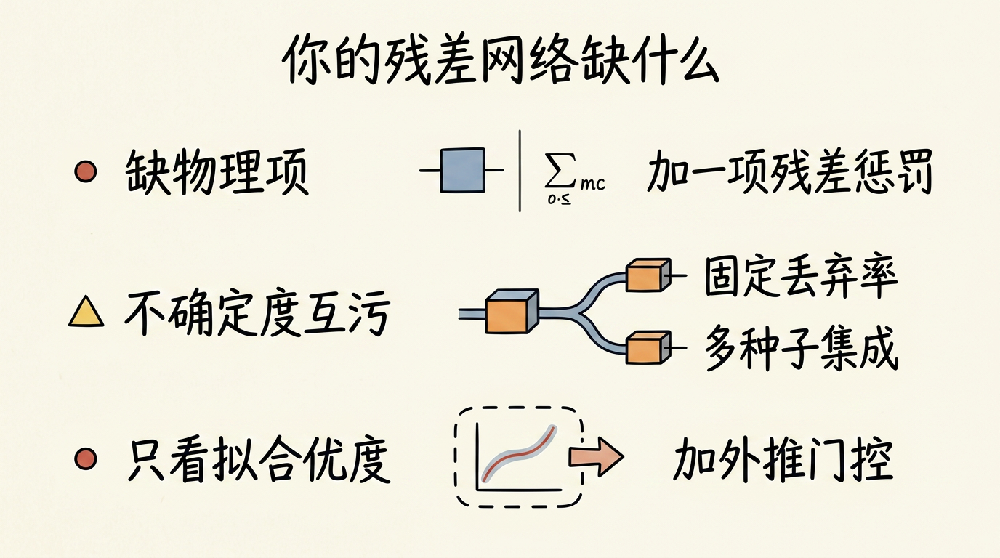

---

#### 11. 自测 10 题（2 选择 + 2 填空 + 6 问答；合上论文作答）

1. （选）多层网络若不使用激活函数，结果是：A 训练更稳 B 整个网络等价于单层线性变换 C 梯度消失消失 D 参数翻倍
2. （选）VAE 相比 AE 的关键改动是：A 更深 B 瓶颈换成 (μ, σ) 并加 KL 正则 C 用卷积 D 不需要解码器
3. （填）论文式 (64) 的损失函数是 __________；式 (79) 的 PINN 损失由 __________ 项与 __________ 项组成。
4. （填）ReLU 的数学写法是 __________。
5. （答）用"链式法则 + 0.25^9"解释梯度消失，并说明为什么 ResNet 的恒等支路能缓解它。
6. （答）PINN 为什么"少要数据"？请用"约束条数"的角度答，不要说"更聪明"。
7. （答）为什么 PINN 在**优化循环**里先天不适？给出一个可行的缓解方案（含代价估计）。
8. （答）GAN 的 mode collapse 在你的场景会长成什么样（畸形叶型多样性消失？），怎么监测？
9. （答）CNN 做"免参数化建模"的代价是什么？举一个换网格就失配的具体例子。
10. （答）批判：为什么说综述"只给架构、不给训练配方"会让气动同行复现失败？你会在论文里补哪三项？

**答案要点**（一题一行，先做再看）：

1. B——没有非线性，多层矩阵连乘仍是线性变换。
2. B——瓶颈换成 (μ, σ) 并加 KL 正则，于是能采样生成。
3. 平方误差和（MLE）；数据项（预测误差）+ 物理残差项（配点）。
4. r(z) = max(0, z)。
5. 每层乘 ≤0.25 的因子连乘 → 梯度指数衰减；恒等支路让梯度有一条"不乘权重"的直通路径。
6. 数据项只给 N_u 条约束，物理项在 N_f 个配点上各给一条，等于免费的额外标注，把假设空间缩小。
7. 边界条件每次迭代都变 ⇒ 每次都要重训；缓解：把边界量当**网络输入**（一次训练覆盖一批工况），代价是样本 × 工况数。
8. 表现为生成的叶型集中在少数几种厚度/弯度组合；监测：潜空间采样 1000 次，统计落在训练集凸包内的比例与前 k 个模态的方差占比。
9. 模型绑死分辨率与网格拓扑：SU2 从 140k 换到 3.55M 网格时，CNN 的像素坐标系变了，预测直接失效。
10. 补三项：优化器与学习率调度、早停/正则的具体配置、数据划分方式（是否按型号/工况分组留出）。

---

#### 12. 带走 3 个数

📌 **带走 3 个数**：

1. **0.25^9 ≈ 4 × 10⁻⁶**——sigmoid 十层连乘后第一层收到的梯度：深度不是免费的，ReLU 与残差支路都是为它买单。
2. **523,011**——你那台残差代理的参数量：74×256+256 = 19,200 的入口加若干 65,792 的块，是个"中等身材"的网络。
3. **0.678 → 0.0075**——PINN 手算例：不新增一条数据，只把方程残差写进损失，物理损失降 **91 倍**。

---

#### 13. 一句收口

> **八个架构只有一个共同点：把"我不知道怎么写的规则"变成"我能求导的损失函数"——
> 于是 CFD 的贵、标签的少、物理的硬，全都被折叠进了同一个 min_θ Σ (…)²。**

[^L05-1]: 〔原文 P32 "most of the recent advances in ml-based aso utilize ann models"〕

[^L05-2]: 〔原文 P33 "reverse ad as backpropagation"〕

[^L05-3]: 〔原文 P33 "The ReLU activation functions is defined as"〕

[^L05-4]: 〔原文 P37 "transposed convolution"〕

[^L05-5]: 〔原文 P39 "mode collapse happens"〕

[^L05-6]: 〔原文 P40 "som is composed of single-layer"〕

[^L05-7]: 〔原文 P33 "maximize the probability of observing output data conditioned on the inputs"〕

[^L05-8]: 〔原文 P33 "Leaky ReLU activation function is formulated as"〕

[^L05-9]: 〔原文 P32 "ANN is the core component of deep learning"〕

[^L05-10]: 〔原文 P39 "vanishing gradient"〕

[^L05-11]: 〔原文 P37 "minimizing the reconstruction loss l(ˆx, x) of output ˆx"〕

[^L05-12]: 〔原文 P37 "A variational autoencoder (VAE) introduces isotropic Gaussian priors"〕

[^L05-13]: 〔原文 P38 "VAE does not use a bottleneck layer"〕

[^L05-14]: 〔原文 P41 "the loss function for pinn training reads"〕

[^L05-15]: 〔原文 P41 "collocation points"〕

[^L05-16]: 〔原文 P40 "neural networks that are trained to solve supervised learning tasks while respecting any given laws of physics"〕

[^L05-17]: 〔原文 P40 "not only generates smooth and realistic airfoils"〕

[^L05-18]: 〔原文 P40 "obayashi and sasaki"〕

[^L05-19]: 〔原文 P34 "CNN is a specialized type of DNN designed for large-scale structured data"〕

[^L05-20]: 〔原文 P34 "Pooling reduces the number of unknown parameters further"〕

[^L05-21]: 〔原文 P35 "a CNN typically requires a large amount of data"〕

[^L05-22]: 〔原文 P35 "RNN gets its name from a feedback loop"〕

[^L05-23]: 〔原文 P32 "ANN consists of input layer"〕

[^L05-24]: 〔原文 P41 "the original PINN was set up under a fixed set of initial and boundary conditions"〕

[^L05-25]: 〔原文 P40 "weight clipping is a terrible way"〕

---

<a id="part-2" name="part-2"></a>
# 第三篇 【ML 进场：ASO 的三大战场篇】

本篇覆盖**讲 06–08**，对应论文 §4——全篇最承重的一章。它把战场切成三格：**几何设计空间**（把几百维收窄成几十维，同时把畸形叶型挡在门外）、**气动评估**（预测三个系数 vs 预测整个流场，两种世界观）、**加速与工程约束**（设计点之外的抖振、载荷怎么便宜地算）。读完这三讲，你应该能在组会上把任何一篇「ML 做气动」的论文塞进这三格之一。

<a id="lec-06" name="lec-06"></a>
<!-- v2 -->
### 【讲06】几何设计空间：模态参数化与几何过滤
**覆盖论文 §4.1（4.1.1 模态参数化 / 4.1.2 几何过滤）｜ PDF 第 41–46 页 ｜ 配图 Fig. 42–44（p44–47）**

---

#### 0. 本讲元数据

| 项 | 值 |
| :--- | :--- |
| 本讲范围 | §4 开篇 + §4.1.1 + §4.1.2（p41–47）：两条收窄设计空间的路 |
| 前置 | 讲 01 挑战①、讲 03（PCA/特征值）、讲 05（AE/VAE/GAN） |
| 读完你应该能 | ① 说清"参数化"与"过滤"是**两种不同方向**的收窄；② 复现 Rotor 37 那条硬数据；③ 给自己的 74 维判一次"它到底是不是参数化" |

<details>
<summary>审查层（导师验收用：蓝本 / 证据等级 / 装配信息）</summary>

| 项 | 值 |
| :--- | :--- |
| 蓝本 | Li, Du, Martins, *Machine Learning in Aerodynamic Shape Optimization*, Prog. Aerosp. Sci. 134 (2022) 100849 |
| 证据等级 | **A 级**（本讲每个数字与公式都有 `〔原文 P## "…"〕` 溯源，由 `tools/verify_all.py` 逐条核） |
| 前置 | 讲 01 挑战①、讲 03（PCA/特征值）、讲 05（AE/VAE/GAN） |
| 读完你应该能 | ① 说清"参数化"与"过滤"是**两种不同方向**的收窄；② 复现"Rotor 37 用 8 个 PCA 模态再优化拿到 0.25% 效率增益"这条硬数据并讲出它的代价；③ 给自己的 74 维统计特征判一次"它到底是不是参数化" |
| 本讲一句话 | **一条从"里面"把维度砍掉（模态参数化），一条从"外面"把坏点挡住（几何过滤）；两把剪刀一起用，才叫设计空间工程。** |

</details>

---

#### 1. 你在这里

12 讲第 6 站（战场站第一站）。前面五站在攒工具箱，
从本讲开始，工具箱要落到**设计空间本身**上。

**你的平台·第 6 站**（连载回放）：
讲 01 修了"插一个几何合法性判别器"，讲 03 修了"先 PCA 再喂代理"，
讲 05 修了"加物理残差项"——**本站修的是 74 维本身**。

---

#### 2. 上讲的数

⏪ **上讲的数** · 讲 05 的两个数，合上书各报一个：

1. sigmoid 十层连乘之后，第一层收到的梯度是多少？ReLU 凭什么能训深？
2. 你那台残差代理 523,011 个参数，是怎么"堆"出来的？

<details>
<summary>答案</summary>

1. 0.25^9 ≈ 4 × 10⁻⁶，第一层几乎收不到梯度；ReLU 在 z > 0 处导数为 1，连乘不衰减。
2. 74×256+256 = 19,200 的入口，加若干个 256²+256 = 65,792 的块，再加出口。

</details>

---

#### 3. 场景引子：调音台与门禁

- **模态参数化 = 调音台**：录音室里有 180 只话筒（FFD 控制点），
  但混音台上只有 8 个推子（模态系数）。
  推子推的是"低频、人声、齿音……"这种**成组的变化**。
  你几乎不可能用 8 个推子调出一段刺耳的噪声——
  **因为那根本不在推子能表达的子空间里**
  （畸形形状被"表达不出来"这件事天然淘汰了）。
- **几何过滤 = 门禁**：不改变你能怎么调，而是在门口拦人。
  它不减变量数，只加一条**约束函数**去评估样本的"异常程度"[^L06-1]。

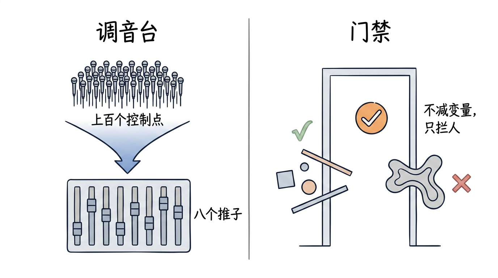

论文把 §4 的效率来源写成三件事：
**几何设计空间的维数、气动分析的成本、优化算法的收敛率**[^L06-2]。
——这三条恰好是本篇（讲 06）、讲 07、讲 09 的分章理由。

一句话记住本讲：一条从里面砍，一条从外面挡。

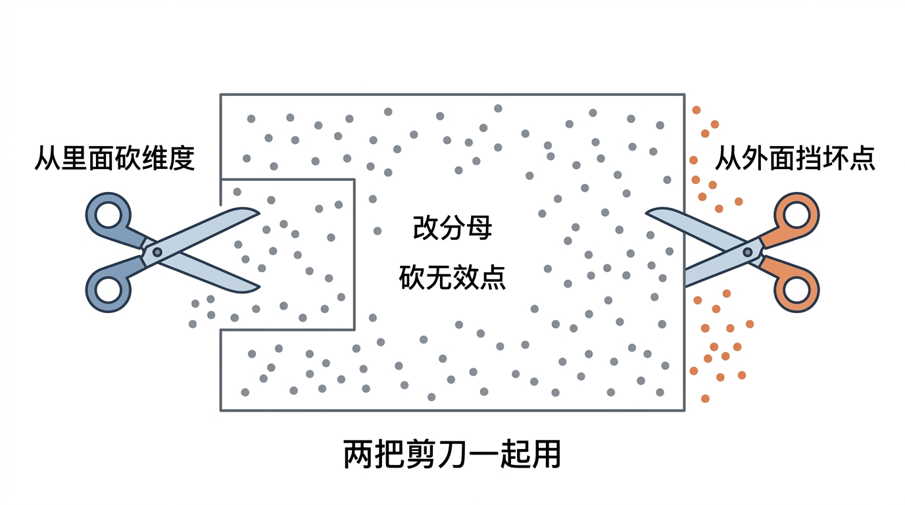

> 🧭 **呼吸点**：引子的账——调音台改的是"你能表达什么"，
> 门禁改的是"哪些表达不许进门"。

---

#### 4. 工程死穴 + 先认词：为什么"变量多"本身就是罪

**先认词 · 第一批**（本讲新词都在这里定义，后面不再解释）

| 中文 | 英文 | 一句操作定义 |
| :--- | :--- | :--- |
| 参数化 | parameterization | "形状 ↔ 有限个数"的双向映射；好的参数化要①够用（能表达最优）②合法（不产畸形）③便宜（可导、可反算） |
| FFD | Free-Form Deformation | 用控制网格包住物体，动控制点即变形；变量数 = 控制点数（几十个起步） |
| CST | Class-Shape Transformation | 用"类别函数 × 形状函数"表示翼型，系数即变量（十来个） |
| Hicks–Henne | 凸度函数叠加 | 在基准翼型上依次加 bump 函数，每 bump 一个系数（论文里 Rotor 37/超临界翼型工作就用它，3 变量版见 p65） |
| 模态参数化 | modal parameterization | 用一堆"典型变化模式"的线性（或非线性）组合表示形状；系数即设计变量 |

**先认词 · 第二批**

| 中文 | 英文 | 一句操作定义 |
| :--- | :--- | :--- |
| ASM | Aerodynamic Shape Modes，气动外形模态：从**气动量**（而非几何坐标）里抽模态 | 论文 Fig. 42 的第二行就是 ASM 模态（基于 M = 0.75 的升力系数构造） |
| 几何过滤 | geometric filtering | 训一个"合法性"评估模型，把异常形状挡在设计空间外[^L06-3] |
| 合法性得分 | validity score | CNN 判别器给的 0–1 分数，从真实到畸形**单调平滑衰减**，因此可进梯度优化[^L06-4] |
| 最优采样 | deep-learning-based optimal sampling | 用 GAN 起形 + 合法性约束 + 位移最小化，造出"少而精、几何可行"的样本库来抽模态〔原文 P45–46 "to generate realistic samples of three-dimensional wing-like shapes considering specified geometric"〕 |

**死穴的定量面貌**：论文说二维翼型要**几十个**设计变量、
三维机翼要**几百个形状设计变量**[^L06-5][^L06-6]。

变量一多，空间中就出现大量异常形状区域（波浪面），
CFD **耗时甚至无法收敛**，可能导致优化失败[^L06-7]。

**这两句加起来就是"设计空间工程"这门生意的全部理由。**

> 🧭 **呼吸点**：§4 的账——变量多不是"算力问题"，
> 是"空间里大部分地方根本不是飞机"。

---

#### 5. 数学从 0 到 1：从 1000 个样本里长出 8 个推子

**（a）PCA 模态参数化（线性，可手推）**

1. 备料：N 个合法外形 → 每个离散成 n 个坐标 → 矩阵 X ∈ ℝ^{N×2n}；
2. 中心化 + 协方差 Σ = X̃ᵀX̃/(N−1)；特征分解 Σ = VΛVᵀ；
3. **前 k 个模态** S = V[:, :k]；设计变量变成 z ∈ ℝ^k，形状 = x̄ + S z；
4. 选 k 的判据：λ₁+…+λ_k ≥ 0.99 Σλ（讲 03 §5）。

**参数量对照（这就是本讲最该记住的一个数）**：
工业界 Rolls-Royce 资助的研究显示，
用自编码器可把一台**叶轮机械叶片**的几何参数从 **100 降到 15**[^L06-8]。

100 → 15 意味着：代理模型的样本需求从 10^100 掉到 10^15 量级——
从"宇宙不够用"变成"再努努力"。

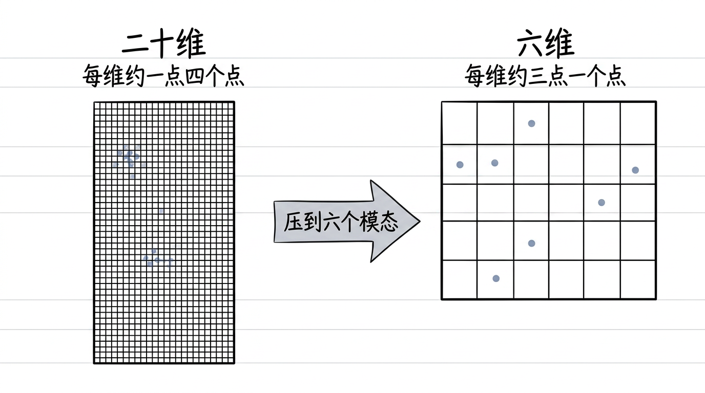

**（b）非线性模态（GAN/InfoGAN/VAE）**：把"线性叠加"换成"生成器 G(z)"，
形状 = G(z)，z 是潜变量；InfoGAN 的潜变量能对应到**厚度、弯度**这类全局特征（讲 05）。

论文提醒两件事：非线性模态同样被写进了这一节[^L06-9]；
而模态推导**没有真实数据库**时会得出非光滑模态，
且设计空间"不够受限"，仍含异常形状[^L06-10]。

**（c）几何过滤的数学形式**：给定 x，合法性 S_valid(x) ∈ [0,1]，
训练一个 CNN 判别器；使用时加约束 **S_valid(x) ≥ s_min**。

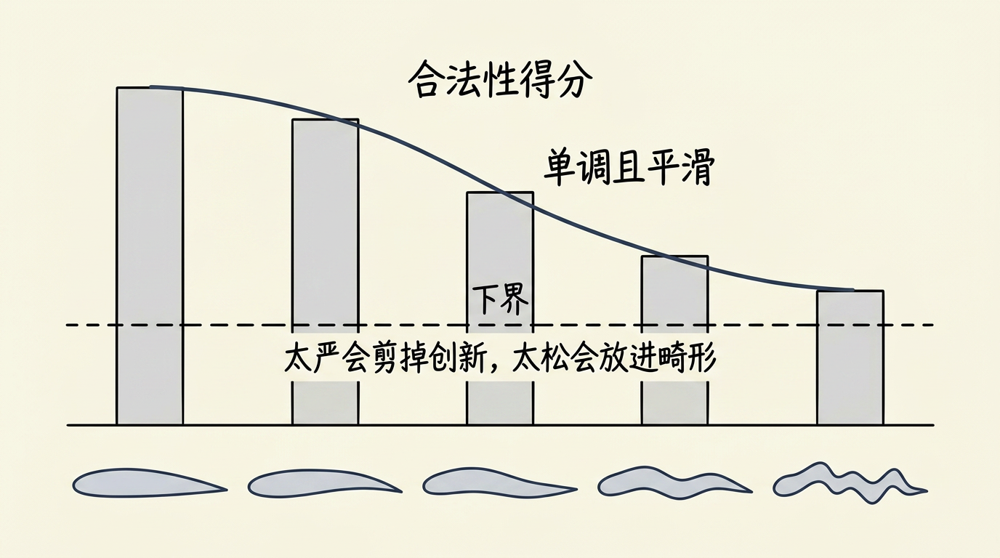

论文给出关键实验数字：对 216 个翼型设计与多个机翼设计做验证后发现，
把下界取在约 **0.7** **不会**排除掉该跨声速区间内最大化巡航效率的创新外形[^L06-11]。

**s_min 太严 = 把创新剪掉；太松 = 把畸形放进来。0.7 是别人试出来的，不是自然常数。**

**（d）跑一遍再信"正交"这件事**：`python3 code/modal.py` 是一个 20 维玩具
（10 个厚度扰动 + 10 个拱线系数，基线取四分之一椭圆，见该文件注释），实测输出：

```
样本量 N = 1000，原始设计变量 d = 20
特征值前 8 项占比：66.6%, 17.3%, 7.4%, 4.0%, 2.8%, 1.9%, 0.0%, 0.0%
达到累计能量 99% 需要的模态数 r = 6
每维点数：20 维 → 1.41 个/维   ⇒   6 维 → 3.16 个/维（放大 2.2 倍）

逐变量独立乱取 20 维：合格率   6.5%  ← 其余全是会被网格生成器退回的畸形
贴着训练分布（1.0σ）在 6 维子空间取点：合格率 100.0%
放大到 1.6σ（比训练分布还宽）：合格率  97.2%  ← 说明子空间不是护身符
一次 CFD 白烧的概率：93.5% → 2.8%
```

🔮 **下注**：20 维压到 6 维，每维点数从 1.41 变成 3.16。
若把能量线从 99% 放宽到 95%，模态数会变少、每维点数会变多——
**你猜每维点数会变成多少？**先写一个数字。

👊 **打脸**：r 从 6 掉到 4，每维点数从 3.16 涨到 **7.95**。
压缩比从来不是自然常数，它等于**你愿意丢多少方差**。

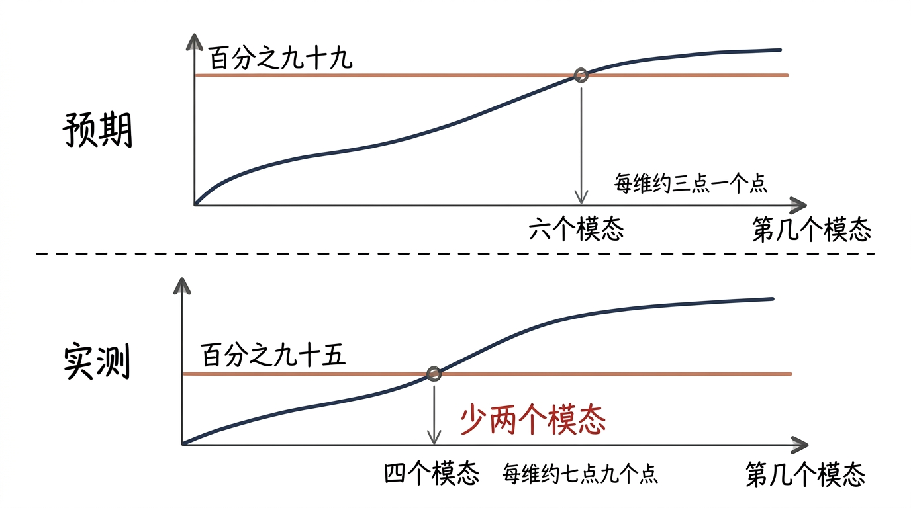

**三个可迁移的判断**：

1. **能量线是硬约束**——把 99% 放宽到 95%，r 从 6 掉到 4，
   每维点数从 3.16 涨到 7.95，说明"压缩多少"不是自然常数；
2. 过滤确实与降维**正交**（一个改分母 d，一个砍无效点）；
3. 但**子空间不等于安全**：只要取点幅度超出数据自己的包络（1.0σ → 1.6σ），
   合格率立刻从 100% 掉到 97%——这正是"没有真实数据库时模态会退化"的玩具版。

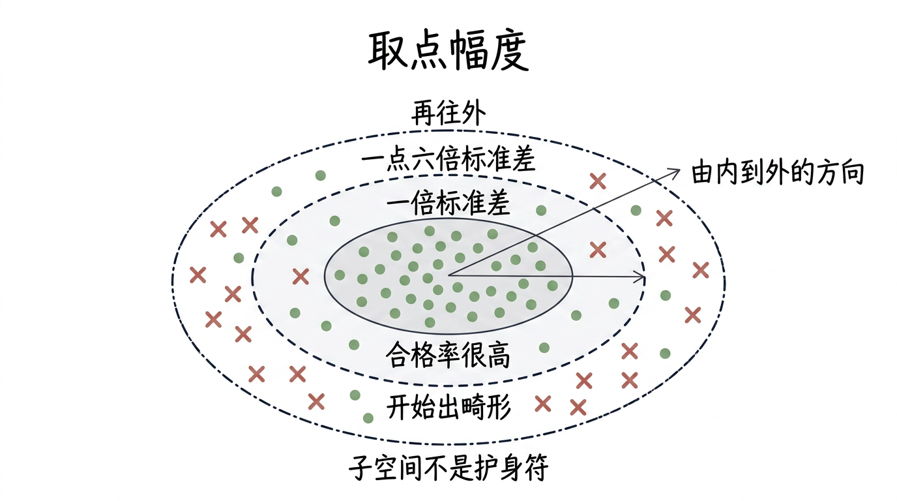

**（e）一条能救你的公式（外推门控）**：
把过滤分数当"代理模型可信度"的乘子：

  ŷ_usable(x) = ŷ(x) − β·(1 − S_valid(x))·σ(x)

—— S 低（陌生形状）→ 惩罚大；
这正是把你"最近邻距离 17.4 vs 6.1"那种自查变成**在线可用**的机制
（本白皮书的构造建议，非论文所述，属〔延伸·待核实〕）。

> 🧭 **呼吸点**：§5 的账——降维改的是分母，过滤改的是分子；
> 两件事**正交**，但谁也保不了"取点超出历史包络"这个错。

---

#### 6. 操作流：三家公司三条路线（论文 Table 1，p42）

| 路线 | 数据来源 | 优点 | 代价 | 代表工作 |
| :--- | :--- | :--- | :--- | :--- |
| 预优化采样抽模态 | 先做一轮便宜优化攒"好形状" | 模态天然贴最优区 | **耗时**，且"好设计可能离最优很远"→ 多样性不足[^L06-12] | Toal et al. / Poole et al. |
| 真实数据库抽模态 | UIUC 翼型库等公开库 | 便宜、可复现 | **公开三维翼型几何信息几乎不存在**，所以多数研究只能停在二维翼型[^L06-13] | Li et al. [312]、Masters et al. |
| 深度学习最优采样 | GAN 起形 + CNN 合法性 + 位移最小化 | 样本稀疏且**几何可行**，抽出的模态能直接支撑**无伴随**优化[^L06-14] | 要训两个网络（GAN + CNN），工程链条最长 | Li & Zhang [316]、Li et al. [341] |


**必须记住的一条硬数据（你自己的方向！）**：Duan 等人在 **1,734** 个 NASA **Rotor 37** 样本上抽出 **8 个 PCA 模态**[^L06-15]，

然后在 8 维模态空间里再优化，**绝热效率又涨了 0.25%**[^L06-16]。

这一条在组会上的讲法应该是：
"8 维 + 1734 样本 + 0.25% 增益"——
**维度是别人替你算过的，增益是真实 CFD 级别的**（论文口径，非我们复算）。

> 🧭 **呼吸点**：§6 的账——三条路的差别不在算法，
> 在"**你手上有没有一批真实的三维形状**"。

---

#### 7. 数据与图表：Fig. 42 / 43 / 44 三张图，各回答一个问题

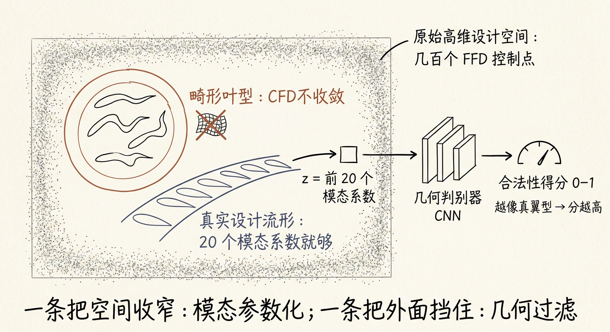

- **Fig. 42（p44）——回答"模态长什么样"**：三行各 15 个模态（PCA / ASM / InfoGAN），
  虚线是基准翼型，绿/蓝是系数一与系数二的变形[^L06-17]。
  **读图口令**：看"系数翻倍 → 形变是否翻倍"，就能当场判断这族模态是线性还是非线性。
- **Fig. 43（p45）——回答"别人怎么给三维机翼抽模态"**：CRM 机翼的全局模态形状，
  样本来自"深度学习最优采样"。
  **可挑剔**：图里没有方差保留曲线，读者无从判断"20 个模态够不够"——
  这是张"展示图"而不是"论证图"。
- **Fig. 44（p47）——回答"合法性分数能不能进梯度优化"**：从真实到畸形分数**单调平滑**衰减[^L06-18]。
  这图的**存在理由**是"可导"；如果分数是阶跃的（0/1 硬判决），
  过滤就只能当采样时的拒绝采样器用，优化器里根本塞不进去[^L06-19]。
  **这是"一张图证明一个方法论前提"的典范**，你以后画示意图可以照抄这个思路。

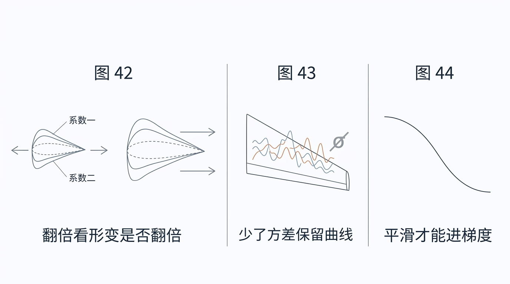

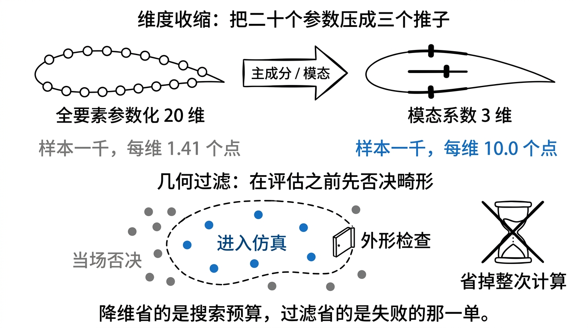

> 图注：图中"每维点数"与 `code/modal.py` 在 99% 能量线下的输出一致
> （r=6 → 3.16 个/维；把能量线放宽到 95% 则 r=4 → 7.95 个/维）。
> 左侧画 20 个站位控制点是**示意画法**，不是论文 Fig. 42 的模态云图。

> 🧭 **呼吸点**：§7 的账——三张图里只有 Fig. 44 是"论证图"，
> 另外两张是展示图；**会区分这两种图，才算会读论文**。

---

#### 8. 审稿人批判（本讲可攻击的点，含对论文本身的）

1. **Table 1 只列"用了什么方法"，不给"降维后代理/优化的相对收益"**：读者读完只知道大家都在用 PCA，不知道**省了多少**；
2. **"合法性下界 0.7"的可迁移性存疑**：这是在翼型 + 特定跨声速机翼问题上证出的，换到**叶栅/端壁/涡轮叶片**（附面层、间隙泄漏主导）没有任何理由沿用——而原文未加此警示；
3. **模态参数化对"新物理"是盲区**：从历史设计学到的模态会**系统性压制**那些"历史上没人做但可能很好"的形状；原文承认这是一个合理担忧（能否包含超越既有经验的创新外形），但没有给出量化；
4. **§4.1 只讲几何合法性，不讲"物理合法性"**（负质量流量、超音速区不合理膨胀）：过滤判别器只看形状图，不看流场，这是工程落地时第一个会炸的缺口（这条属我们的补充意见）。
5. **顺带批本白皮书自己**：本讲的 1.41 / 3.16 / 93.5% / 2.8% 全部来自
   `code/modal.py` 的**玩具数据**（20 维椭圆基线），
   不是 Rotor 37 实测。把它当成"你的叶片也会这样"就是误读。

---

#### 9. 承前启后

- **承前**：本讲是讲 01 挑战①的正面回答；用的全部零件来自讲 03（PCA/流形）与讲 05（AE/GAN/CNN 判别器）；
- **启后**：维度降下来之后，讲 07 的代理模型才谈得上精度；
  过滤分数在讲 09 的"加点准则"里可以直接当罚项，避免代理模型把新样本加到畸形区
  （原文 §4.3.1 明确提到用几何合法性函数来约束加点区域[^L06-20]）。

---

#### 10. 你的项目接哪一步（本讲是为你写的）

| 你的 74 维统计特征 | 判决 | 动作 |
| :--- | :--- | :--- |
| (Ω, P) + 9 物理量 × 8 统计量 | **这不是几何参数化，是工况 + 全场统计摘要**：它描述的是"流场长什么样"的约化，不是"几何由什么决定"。用它做**预测代理**没问题，用它做**设计变量**就出事了——你无法从 8 个统计量反算出叶片轮廓 | 立即分成两条通道：**设计通道**用叶片几何模态（如 8–20 个 PCA 系数），**工况通道**保留 (Ω, P)；把统计特征降级为"中间表征" |
| 想换设计通道 | 论文 P06（Du et al. 2021）用**神经网络参数化本身**攻击这一点；而 Duan et al. 的 Rotor 37 工作（8 模态）是你**同族最直接的先例** | 先做"预优化采样 → 抽 8–15 个 PCA 模态"（本讲路线一），样本量目标：1,000–2,000（对标 1,734） |
| 畸形叶型让 SU2 不收敛 | 上 CNN 合法性过滤：把历史 1,000 组当正样本，把随机 FFD 扰动当负样本，训一个二分类器，取 0–1 概率当 S_valid，下界先用 0.5（**比论文的 0.7 保守，别照抄**） | 训练成本：几万样本、几分钟到一小时；推理成本：毫秒级 |

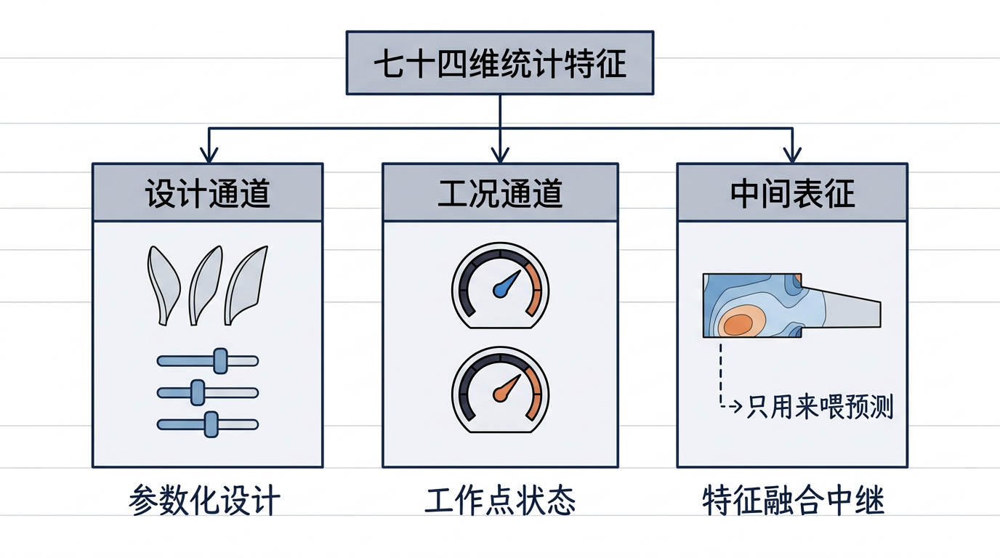

🛠 **修复清单**（全书连载，本讲新增三项，是本清单最厚的一讲）：

- **#7 拆通道**：74 维统计特征降级为中间表征，
  设计通道另起炉灶（8–20 个几何 PCA 系数），工况通道保留 (Ω, P)。
- **#8 预优化采样抽模态**：按 Duan et al. 的路子攒 1,000–2,000 个"好形状"，
  抽 8–15 个 PCA 模态，对标 Rotor 37 的 8 模态 / 1,734 样本。
- **#9 上 CNN 合法性门禁**：正样本用历史 1,000 组、负样本用随机 FFD 扰动，
  下界先取 0.5 做 ROC，再决定是否向 0.7 靠。

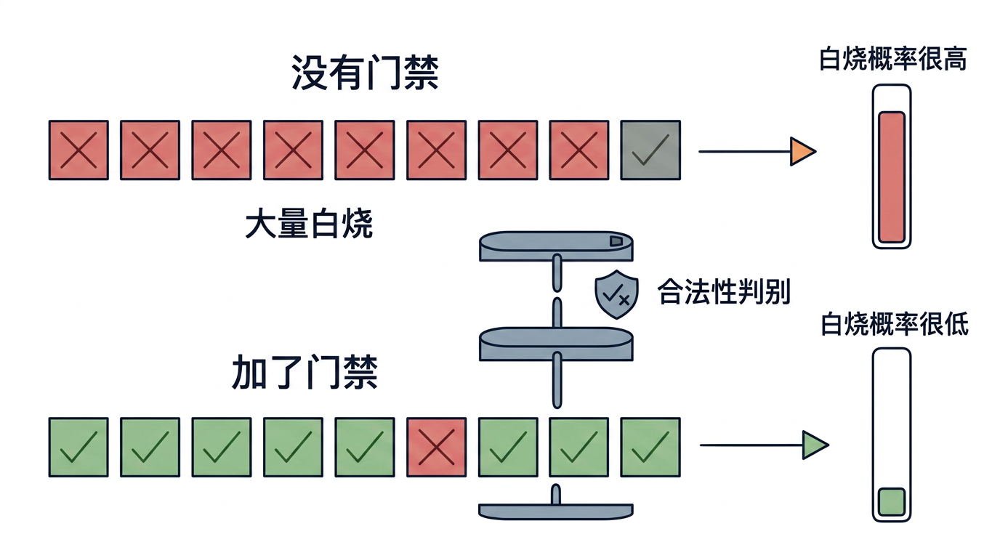

---

#### 11. 自测 10 题（2 选择 + 2 填空 + 6 问答；合上论文作答）

1. （选）几何过滤与模态参数化的根本差别是：A 前者减变量数、后者加约束 B 前者加约束不减变量数、后者减变量数 C 都是减变量 D 都是加约束
2. （选）ASM 模态与 PCA 模态的差别在于：A 是否用 GPU B 模态从气动量（如 C_L）而不是几何坐标构造 C 是否有非线性 D 是否可反算
3. （填）论文指出二维翼型需 tens 个设计变量、三维机翼需 __________ 个；Rolls-Royce 资助的研究用自编码器把叶轮机械叶片参数从 __________ 降到 __________。
4. （填）合法性得分必须是单调且平滑衰减，原因是 __________。
5. （答）写清"预优化采样抽模态"的四步流程，并说出它最大的两个代价。
6. （答）用 Duan et al. 的 Rotor 37 案例，说明"模态数 k"与"样本量 N"必须一起报，否则读者无法判断可复现性。
7. （答）为什么"从历史设计学到的模态"会压制创新？给出一个具体的保护机制（含公式或阈值）。
8. （答）把你的 74 维特征拆成"设计通道 / 工况通道 / 中间表征"三层，各写一句理由。
9. （答）如果 CNN 判别器把一类合法新构型误判为畸形，你的优化会怎么失败？如何用留出集发现它？
10. （答）批判：为什么"合法性下界 0.7"不能直接搬到涡轮叶栅上？给出你会怎么做来确定你的阈值。

**答案要点**（一题一行，先做再看）：

1. B——过滤加约束不减变量数，参数化是把变量数换掉。
2. B——ASM 从气动量（如 C_L）构造，不是从几何坐标。
3. 数百（hundreds）；100、15。
4. 可导才能作为约束进入梯度优化。
5. 便宜优化攒好形状 → 抽模态 → 在 k 维优化 → 回投；代价是耗时 + 多样性不足（可能离真最优远）。
6. 8 个模态 + 1734 样本：k 决定表达力、N 决定模态的统计质量，两个数共同决定"这个空间能不能装下最优"。
7. 历史样本没覆盖的区域方差小、不进前 k 个特征向量；保护：留出"残差通道"（保留 λ 尾部若干维并在目标里给奖励项），或对创新解设更低的 S_valid 下界做双轨评估。
8. 设计通道=8–20 个几何 PCA 系数（能反算成叶片）；工况通道=(Ω, P)（不是你改的，是给定的）；中间表征=74 维统计（只用来喂预测代理）。
9. 表现为"前沿贴着判别器边界一片平坦"；用人工标注 50 张合法新构型做留出集测假阴性率。
10. 叶栅有端壁/间隙/泄漏流，几何合法性与气动可用性耦合更紧；做法：先用你自己 1,000 组 + 手工畸形集做 ROC，取假阳性率 ≤ 1% 处的阈值。

---

#### 12. 带走 3 个数

📌 **带走 3 个数**：

1. **100 → 15**——Rolls-Royce 资助研究里自编码器把叶轮机械叶片的几何参数压到的量级：样本需求从 10^100 掉到 10^15。
2. **s_min ≈ 0.7**——论文在 216 个翼型设计上试出的合法性下界：太严剪掉创新，太松放进畸形，**它是试出来的，不是常数**。
3. **1.41 → 3.16**——`code/modal.py` 实测：20 维压到 6 维后每维摊到的点数（能量线放宽到 95% 则变 7.95）。

---

#### 13. 一句收口

> **参数化决定"你能想到什么"，过滤决定"你不许想到什么"——
> 把这两个旋钮交给数据来调，就是 ML 进场做的第一件事。**

[^L06-1]: 〔原文 P46 "This approach does not reduce the number of design variables"〕

[^L06-2]: 〔原文 P41 "the dimensionality of the geometric design space, the cost of the aerodynamic analysis, and the conver-"〕

[^L06-3]: 〔原文 P42 "it is desirable to exclude abnormal shapes and reduce the dimensionality of the design space"〕

[^L06-4]: 〔原文 P47 "monotonic and smooth decay from a realistic shape to an abnormal shape"〕

[^L06-5]: 〔原文 P5 "tens of design variables are required"〕

[^L06-6]: 〔原文 P5 "hundreds of shape design variables are required"〕

[^L06-7]: 〔原文 P6 "abnormal shapes, such as wavy airfoil surfaces"〕

[^L06-8]: 〔原文 P44 "from 100 to 15"〕

[^L06-9]: 〔原文 P44 "nonlinear modes have also been introduced"〕

[^L06-10]: 〔原文 P45 "A database of realistic aerodynamic shapes is desired for modal parameterization"〕

[^L06-11]: 〔原文 P47 "a lower bound of ∼0.7"〕

[^L06-12]: 〔原文 P45 "it is time-consuming to use pre-"〕

[^L06-13]: 〔原文 P45 "publicly available information on the geometry of three-dimensional components like wings is nearly absent"〕

[^L06-14]: 〔原文 P46 "without relying on the adjoint solver or gradient-based optimization"〕

[^L06-15]: 〔原文 P45 "extract eight PCA modes of the NASA Rotor 37 blade from 1,734 samples"〕

[^L06-16]: 〔原文 P45 "0.25% gain on the adiabatic"〕

[^L06-17]: 〔原文 P44 "The green and blue lines are deformed airfoil shapes"〕

[^L06-18]: 〔原文 P46 "reduces dimensionality without excluding the potential optimum"〕

[^L06-19]: 〔原文 P47 "suitable for gradient-based optimization"〕

[^L06-20]: 〔原文 P61 "these criteria always suffer from inaccurate surrogate models"〕

[^L06-21]: 〔原文 P47 "preventing infilling abnormal shapes in training data"〕

---

<a id="lec-07" name="lec-07"></a>
<!-- v2 -->
### 【讲07】气动评估：预测三个系数，还是预测整个流场
**覆盖论文 §4.2 开篇 + §4.2.1 气动力系数建模 + §4.2.2 流场建模｜ PDF 第 47–56 页 ｜ 配图 Table 2–3，Fig. 45（p57）**

> ⭐ **本讲是全篇的承重墙**：路线图上把它标成"最重要"，本白皮书按同一权重写。
> 因为**任何"ML 替代 CFD"的论文，它的命门都在这两节里**。

---

#### 0. 本讲元数据

| 项 | 值 |
| :--- | :--- |
| 本讲范围 | §4.2 引言（p47）、§4.2.1（p48–52）、§4.2.2（p52–56） |
| 前置 | 讲 02（代理模型 + R²）、讲 03（快照/POD）、讲 05（CNN/RNN/AE） |
| 读完你应该能 | ① 讲清"系数建模 vs 流场建模"的取舍与各自失效场景；② 复述三组关键数字并说出可比性陷阱；③ 给自己的代理加一道外推保险 |

<details>
<summary>审查层（导师验收用：蓝本 / 证据等级 / 装配信息）</summary>

| 项 | 值 |
| :--- | :--- |
| 蓝本 | Li, Du, Martins, *Machine Learning in Aerodynamic Shape Optimization*, Prog. Aerosp. Sci. 134 (2022) 100849 |
| 证据等级 | **A 级**（本讲每个数字与公式都有 `〔原文 P## "…"〕` 溯源，由 `tools/verify_all.py` 逐条核） |
| 前置 | 讲 02（代理模型 + R²）、讲 03（快照/POD）、讲 05（CNN/RNN/AE） |
| 读完你应该能 | ① 一句话讲清"系数建模 vs 流场建模"的取舍并给出各自失效场景；② 复述论文里三组关键数字（误差、样本量、加速比）并说出它们的**可比性陷阱**；③ 用"最近邻距离门控"给你自己的代理模型加一道外推保险 |
| 本讲一句话 | **R² 高不等于模型好；一个代理模型的价值 = 精度 × 覆盖范围 × 可导性 ÷ 训练成本，四项缺一不可。** |

</details>

---

#### 1. 你在这里

12 讲第 7 站（战场站）。讲 06 把设计空间收窄了，
本讲要问的是：**收窄之后，谁来替 CFD 报数**。

**你的平台·第 7 站**：你那三个标量（π/η/ṁ）的残差代理，
本讲要给它做两件事——**换一把更诚实的尺子**，
以及**加一道外推保险**。

---

#### 2. 上讲的数

⏪ **上讲的数** · 讲 06 的两个数，合上书各报一个：

1. 模态参数化与几何过滤，分别是"从哪儿"收窄设计空间？
2. 论文在 216 个翼型设计上试出的合法性下界是多少？为什么不能照抄？

<details>
<summary>答案</summary>

1. 模态参数化从**里面**把维度砍掉（改变量），几何过滤从**外面**把坏点挡住（加约束不减变量）。
2. 约 0.7；它是在翼型 + 特定跨声速机翼上证出的，叶栅/端壁/涡轮叶片没有理由沿用。

</details>

---

#### 3. 场景引子：老中医与全科体检

- **系数建模**像老中医：你报几个症状（几何参数），他说一个结论（C_D = 0.0173）。
  快、便宜、可导，但**问他"压力峰值在哪"**他答不上来。
- **流场建模**像给你拍一张全科 CT：吐出整张压力云图、马赫数分布。
  信息量大到可以事后算任何指标，但训练贵、显存吃紧，
  而且一旦拍错（激波位置偏了两格），**后面所有指标一起错**。

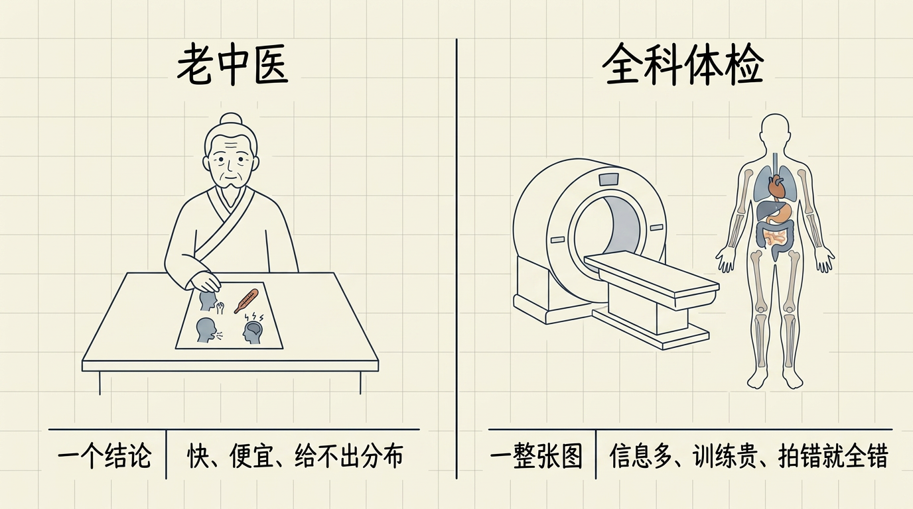

论文的开篇就是这一取舍的学术版：CFD 能提供全域所有变量的丰富信息，
但 ASO 通常只关心几个气动性能指标（升力系数、阻力系数），
因此**建模气动力系数**极受关注[^L07-1]。

> 🧭 **呼吸点**：引子的账——两个数派与整张场派的分歧不在精度，
> 在**下游还要不要用到分布**。

---

#### 4. 工程死穴 + 先认词：把"贵"拆成两笔账

**先认词 · 第一批**（本讲新词都在这里定义，后面不再解释）

| 中文 | 英文 | 一句操作定义 |
| :--- | :--- | :--- |
| 响应面法 | polynomial response surface | 用低阶多项式拟合系数；1990 年代计算机辅助气动设计初期的主流[^L07-2] |
| 混合专家 | ME = Mixture of Experts | 把设计空间切成块，每块一个小专家，再按后验概率加权（讲 03 的 k-means 在这里上岗） |
| RMTS | regularized minimal-energy tensor-product splines | 张量样条 + 正则，能撑到 10^5 量级训练点，但**高维不行**[^L07-3] |
| 降阶模型 | ROM = reduced-order model | 用 POD/快照把高维场压成几阶坐标系下的动力学 |
| 配点 | collocation points | 没有标签、只要求满足 PDE 的内部点（讲 05 的式 79 第二项） |

**先认词 · 第二批**

| 中文 | 英文 | 一句操作定义 |
| :--- | :--- | :--- |
| 计数 | drag counts | 1 count = 0.0001 的阻力系数增量；"0.9 counts"就是 ΔC_D = 0.00009 |
| 平均绝对误差 | MAE = mean absolute error | 预测与真值差的绝对值平均（比 R² 更诚实，因为它不能被"大方差"骗） |
| 外推 | extrapolation | 查询点在训练分布之外；ML 模型天生是**插值型**的 |

**死穴一：样本与维度互相拉扯。**

传统代理训练耗时，而**不适合处理大数据**（讲 02）；用 ANN 能吞大数据，
但**大多数 ML 预测模型是插值型的，外推预测可能失去精度**[^L07-4]——
所以维度灾难仍是气动力系数建模的根本困难[^L07-5]。

**死穴二：加速 CFD 而不是替代它。**

论文 §4.2.3 明确：高保真 ASO 里，
即使精度被认为很高的代理模型，也可能达不到所需保真度[^L07-6]，
所以仍然需要高保真 CFD[^L07-7]。

**这一句是给你这种"平台作者"的一记直拳：代理不能替代验证，只能替代搜索。**

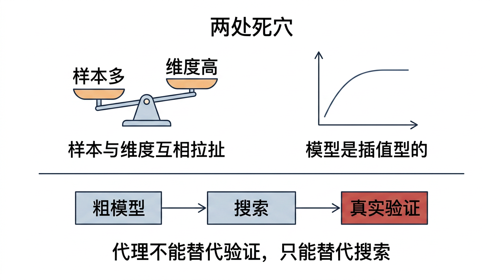

> 🧭 **呼吸点**：§4 的账——本讲所有数字都要挂两个标签：
> **什么口径**（E2 代理 / E4 闭环）与**什么误差单位**。

---

#### 5. 数学从 0 到 1：把三组关键数字算到手抖

**（a）系数建模的代表数字（全部出自论文）**

| 工作 | 模型保真度 | 训练样本 | 设计变量 | 误差（论文口径） | 页 |
| :--- | :--- | :---: | :---: | :--- | :---: |
| Li et al. [312]（Webfoil 前作） | RANS | 113,400 | 16/10（亚/跨） | C_L/C_D/C_M 平均相对误差 0.145%/0.255%/0.160%（亚声速）、0.404%/0.826%/0.966%（跨声速） | p62 |
| 同上，优化级对照 | RANS | — | — | 数据驱动优化 vs RANS 优化，最小 C_D 最大差 **0.04 counts**（亚声速）与 **2.5 counts**（跨声速） | p62 |
| Du et al. [313] | RANS | 85,201 | 28 | 阻力误差 1.4 / 5.0 counts（亚/跨） | p61 Table 5 |
| Li & Zhang [341]（CRM 机翼） | RANS | **135,108** | 60 | C_L/C_D/C_M 平均相对误差**全在 0.4% 内**（在 **47,967** 个未见机翼上验证）；优化结果与 CFD 优化差 **1–2 counts** | p62 |
| Secco & de Mattos（旅客机机翼-机身） | 全位势+黏性修正 | ~100,000 | 40 | 平均绝对误差 0.004（C_L）/0.0005（C_D）；实现 **4,000×** 加速 | p50, p61 |
| Zhang et al. [279]（CNN 免参数化） | RANS | — | 直接吃坐标 | 免形状参数化，直接把外形坐标喂 CNN；多个 M、Re、攻角下预测 C_L | p51 |

其中 Li & Zhang 那一行的样本量与误差，论文在两处各说了一遍：
验证集是 47,967 个未见机翼[^L07-8]，训练样本与误差档位见 p61 的对照表[^L07-9]。

🔮 **下注**：C_D = 0.0173，论文说的"0.4% 平均相对误差"
换算成绝对误差是多少？再换成 counts 是多少？先算，再看下一行。

👊 **打脸**：0.0173 × 0.004 ≈ **6.9 × 10⁻⁵ ≈ 0.7 counts**。

机翼优化里 C_D 的常见量级是 0.008–0.03。

所以"0.4%"这三个字，在不同基准上代表 0.3–0.7 counts 的绝对误差——**不换算就没有可比性**。

**（b）0.4% 到底意味着什么（上一节下注题的正解）**

第一级：相对误差 0.4%（论文口径）。

第二级：绝对误差 ~3×10⁻⁵ ≈ 0.3 counts（按 C_D ≈ 0.008 折算）。

第三级：对你自己的 η = 0.9561——**对照你自己的 η = 0.9561**，
0.9561 是"方差解释比例"，0.4% 是"平均相对误差"，**两者不可直接比大小**。

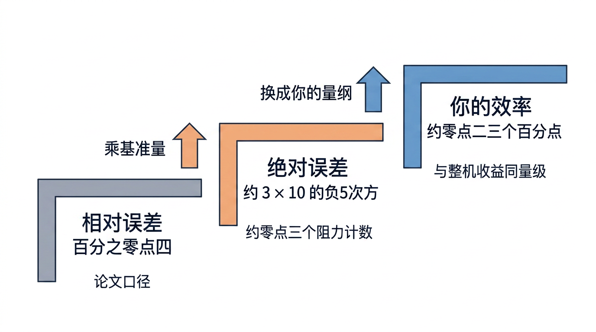

想比，就把 η 换算成 MAE：η ≈ 1 − MSE/Var(y)。

若 Var(η) ≈ (0.011)²（你数据集效率的标准差量级），
则 RMSE ≈ 0.011 × √(1−0.9561) ≈ **0.0023**。

也就是约 0.23 个百分点。

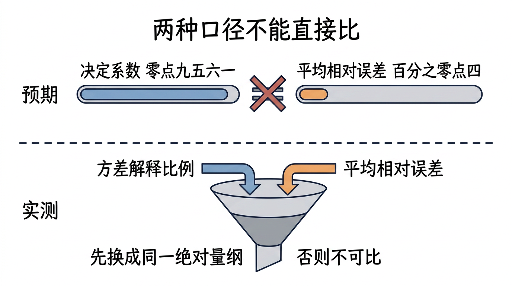

这在"叶轮机械效率"这门生意里**不是小误差**，
因为整机收益的论断常以 0.2–0.5 个百分点为单位。

（换算口径：本白皮书自算，标注为〔延伸·待核实〕，不许当论文数字引用。）

**（c）流场建模的代表数字**

论文 Table 3（p53）把技术列成三档：POD / 流形学习（Isomap、LLE）/ 自编码器与 GAN。

关键对比是：**Isomap 类模型能把激波处的压力梯度"拉尖"**，比 POD 更接近 CFD[^L07-10]。

Decker 等人也报了激波附近误差更小[^L07-11]。

Thuerey 等用 U-Net（AE 的特例）预测不同翼型、不同 Re 的速度与压力场。

**未见过的翼型上平均相对误差 < 3%**[^L07-12]。

Chen 等用条件 GAN 预测速度场，75 个未见 UIUC 翼型上，
x/y 方向分量平均相对误差 **8.13% / 20.83%**。

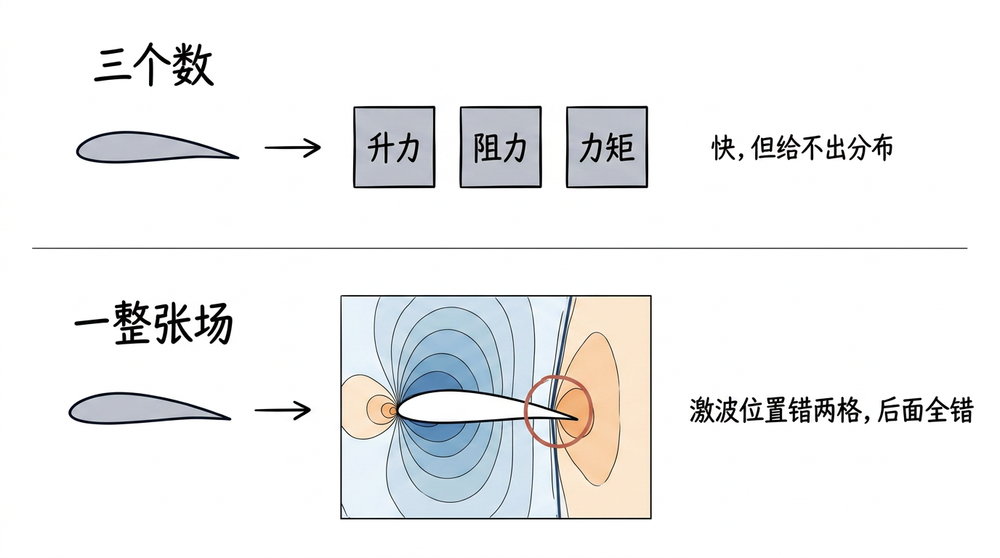

**（d）"替代求解器"与"喂初值"的差别（本讲最实用的分类）**

- **喂初值**：Obiols-Sales 等用 CNN 预测速度、压强、涡黏度作为 CFD 的初场，
  **加速 1.9–7.4×**（层流与湍流、多种几何）[^L07-13]；
  注意：**最后仍是 CFD 收敛出来的数**，所以这是 E3/E4 口径，可以拿去发"效率提升"；
- **改格式**：Bar-Sinai 等的数据驱动离散化，在**粗 4–8× 的网格**上达到标准有限差分同级别的精度[^L07-14]——
  **这是"同等成本换更高保真"，不是"加速"**，写论文时千万别混；
- **替代求解**：POD/DMD 做低维动力学，最便宜，但对强非线性/激波运动最脆。


> 🧭 **呼吸点**：§5 的账——三组数字的读法只有一个规矩：
> **先问分母是谁，再问它有没有被验证过**。

---

#### 6. 操作流：选型决策树（把论文散落的判断集中成一张）

```
需要下游用到"分布/梯度场"（载荷、换热、抖振、分离）吗？
├── 不需要（只要 C_L/C_D/η/π）
│    ├── 设计维度 d ≤ 20，样本 ≤ 5k      → Kriging / GEK（讲 02）＋ EGO 加点（讲 09）
│    ├── 样本 ≥ 50k，需要交互式毫秒响应    → ANN 系数模型（残差形式）＋ 最近邻门控（本讲 5）
│    └── 需要跨工况（M、Re 扫描）         → 把 M/Re 当输入 + 依赖采样策略（Du et al.〔原文 P61 "16/10"〕的做法）
└── 需要（全场）
     ├── 网格固定、样本 ≥ 1k 张场         → CNN/U-Net（<3% 是可达线）
     ├── 想给 CFD 省时间                 → CNN 预测初场 + 仍跑 CFD（1.9–7.4×）
     └── 数据极少但方程干净              → PINN（代价：边界一变就重训，讲 05/讲 08）
```

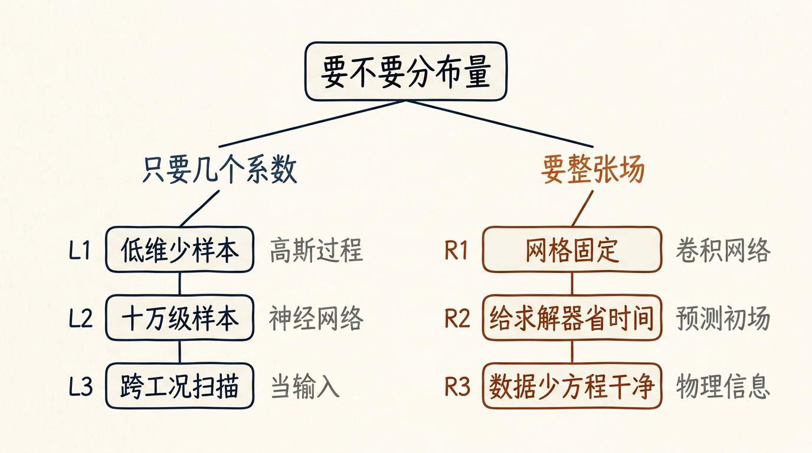

> 🧭 **呼吸点**：§6 的账——决策树的第一岔永远是"要不要分布"，
> 第二岔才是"有多少样本"；反过来问一定选错。

---

#### 7. 数据与图表：怎么读 Table 2、Table 3 与 Fig. 45

- **Table 2（p49）**：横着看是"模型 × 外形对象"，
  **这张表的真正用法是查"我的对象有没有人做过"**
  （翼型/机翼/吊舱/风机叶片/螺旋桨/汽车/UAV/混合翼身都列了）；
  可挑剔：没有样本量与误差列，**信息密度低**——
  一张综述表若不含"可比数字"，读者就只是在看目录。
- **Table 3（p53）**：三档降维技术 + 对象；同样是"缺误差列"的老毛病。
- **Fig. 45（p57）**：两个实验抖振起始工况下平滑后的分离传感器面分布，
  说明该传感器能同时预测高亚声速与跨声速的抖振起始。
  **这张图是"物理量替代经验公式"的范例**：
  它证明的不是精度，而是**跨工况泛化**——这才是约束建模最该被证明的东西。

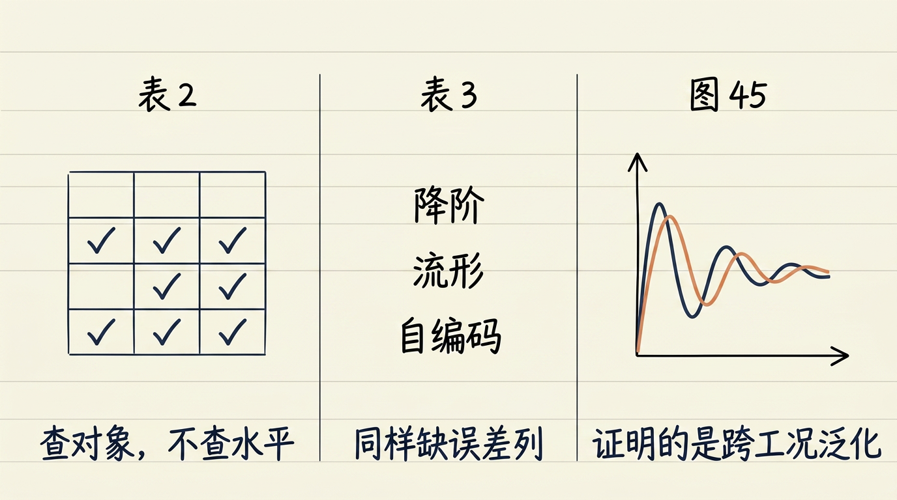

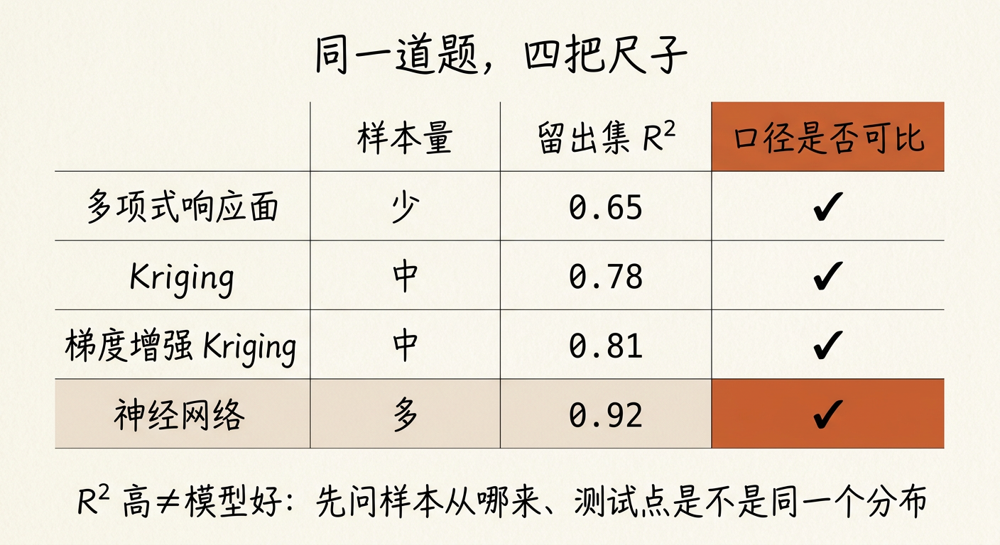

> 🧭 **呼吸点**：§7 的账——综述表格只告诉你"谁做过什么"，
> **不告诉你"做得多好"**；后者要自己回原文挖。

---

#### 8. 审稿人批判（本讲可攻击的点，含对论文本身的）

1. **"R²/相对误差/counts"三种口径混用**：Table 5 用 counts、正文用平均相对误差、别的论文用 R²，
   综述未提供统一换算表——这是**本讲 §3(b) 存在的理由**，也是你能在组会上挑的第一根刺；
2. **外推风险只被"提出"没有被"度量"**：全文说"多数模型是插值型的、外推可能失准"，
   但没有一篇被引工作给出"外推距离 vs 误差增长"曲线；
3. **§4.2.1 的 ANN 优势叙述隐含"样本多就准"**：没有讨论**样本浪费**（10^5 样本里大量互相冗余），
   这正是"最优采样"（讲 06）该在此出场却被挪到 §4.1 的编排问题；
4. **对"验证集构造方式"零着墨**：留出集是随机切还是按型号/工况切，直接决定 R² 是 0.95 还是 0.60，
   综述没提醒（这是本白皮书判卷红线：**E2 不许冒充 E4**）。
5. **顺带批本白皮书自己**：本讲 §5(b) 那个 0.0023 的换算，
   分母 Var(η) ≈ (0.011)² 是**我替你估的**，不是你数据集的真值。
   你不算出来，这个数就只是个好看的算术练习。

---

#### 9. 承前启后

- **承前**：讲 02 给代理模型、讲 03 给降维、讲 05 给网络，本讲是**第一次三线合流**；
- **启后**：本讲的"加速 vs 替代"之分直接进讲 08（数值加速与实用约束）；
  外推门控与 MAE 口径直接进讲 09（加点准则要用可信度）与讲 11（批判性阅读）。

---

#### 10. 你的项目接哪一步（六层阶梯的"回收"层）

| 你的现状 | 本讲诊断 | 动作 |
| :--- | :--- | :--- |
| π/η/ṁ 三个标量的残差代理（R² 0.9844/0.9561/0.9827，留出 n=100，random_state=42） | 口径是 **E2 代理预测**，且随机留出 ⇒ **同分布内插值**，这正是论文警告的"插值型"舒适区 | 增加**按工况分组的留出**（留出若干完整 Ω 或 P 区间）再报一次 R²；两个数一起写，才算诚实 |
| 你自查过：Pareto 解到训练集最近邻中位距离 17.4（训练集内部 6.1，≈3×） | 前沿**已在流形边缘**：0.9561 在边缘处不成立 | 把"到最近邻距离 d(x)"做成在线门控：ŷ_usable = ŷ − β·max(0, d(x)−d_in)/d_in·σ̂；前端在 d 超阈值时**只显示"外推，不可用于设计"** |
| 只有三个标量输出 | 下游要沿叶高的载荷/效率分布时**没数据可用** | 升级到"沿展向序列输出"（RNN/LSTM，讲 05）或叶型截面压力分布（CNN），哪怕先把 3 个标量换成 40 个站位分布，你的平台立刻从"预测器"变"设计器" |
| 对外说"100,000× 加速" | 那是**推理成本比**，论文同类工作的可比口径是"1.9–7.4×（含 CFD 收尾）" | 双口径并列：搜索阶段 100,000×（E2 推理），全闭环 0×（E4 尚未做 CFD 验证） |

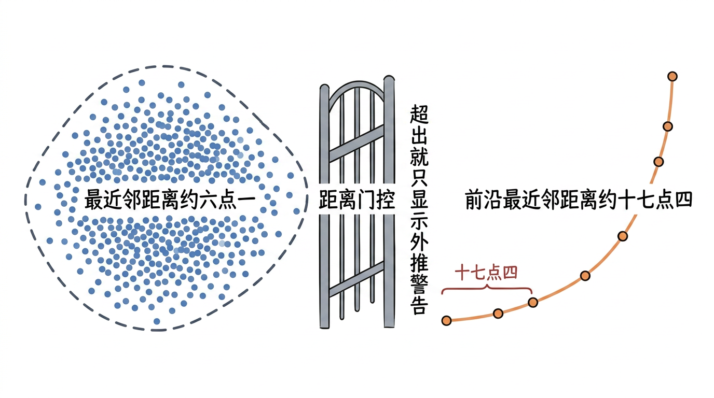

🛠 **修复清单**（全书连载，本讲新增）：

- **#10 报误差必须报外推子集口径**：随机留出与"按 Ω/P 分组留出"两个 R² 一起报；
  同时在前端挂 d(x) 门控，超阈值只显示"外推，不可用于设计"。

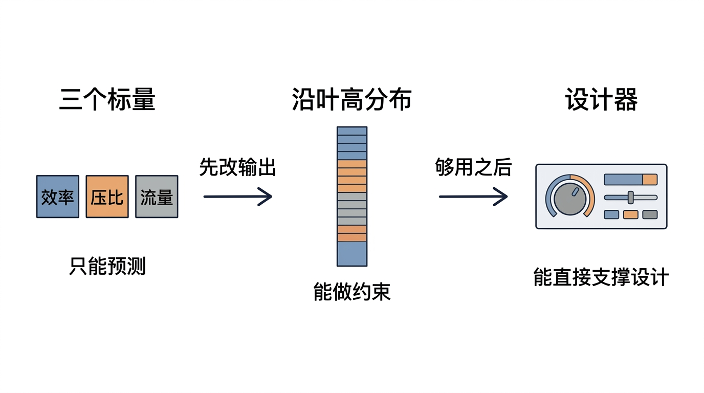

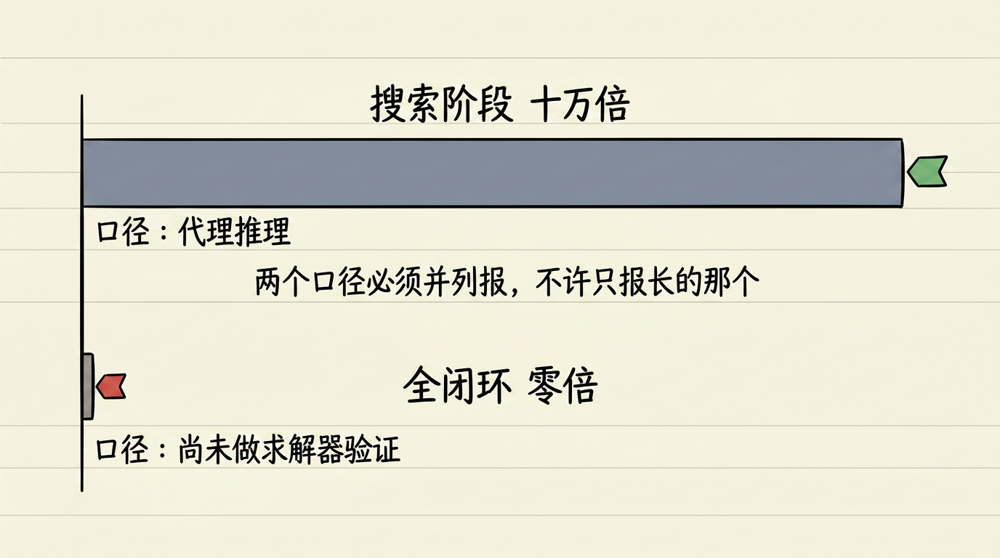

---

#### 11. 自测 10 题（2 选择 + 2 填空 + 6 问答；合上论文作答）

1. （选）流场建模相对系数建模的**唯一**决定性优势是：A 精度更高 B 能直接提供分布量（载荷/换热/分离）供下游约束使用 C 训练更便宜 D 不需要网格
2. （选）"CNN 预测初场再跑 CFD"属于哪一类收益：A 替代求解器 B 降低迭代到收敛的成本 C 提高物理模型保真度 D 减少设计变量
3. （填）论文说 Li & Zhang [341] 的机翼代理模型用 __________ 个 RANS 样本训练，在 __________ 个未见机翼上验证，C_L/C_D/C_M 平均相对误差全部在 __________ 以内。
4. （填）"1 count" 等于 __________ 的阻力系数变化。
5. （答）把 η=0.9561 换算成 RMSE 量级，写出假设与算式，并说明它为什么不能和"0.4% 平均相对误差"直接比。
6. （答）用一句话解释"多数 ML 模型是插值型的"在优化循环里最危险的时刻是哪一步（提示：外环找最优点时）。
7. （答）为什么"按型号/工况分组的留出"比随机留出更能暴露问题？给出你的数据集应分几组。
8. （答）设计一个"外推门控"公式并说明三项各自的来源（哪个是网络输出、哪个是统计量、哪个是你定的超参）。
9. （答）如果要把你的平台从"三个标量"升级到"沿叶高分布"，你会先改输入还是先改输出？为什么？
10. （答）批判：为什么"综述表格不写样本量与误差"会让初学者高估自己模型的竞争力？举一个具体后果。

**答案要点**（一题一行，先做再看）：

1. B——能直接提供分布量供下游约束使用，精度不是它的卖点。
2. B——降低迭代到收敛的成本，最后仍是 CFD 收敛出来的数。
3. 135,108；47,967；0.4%。
4. 1 × 10⁻⁴（万分之一）。
5. RMSE = σ_y·√(1−R²)，需知 σ_y（没有 η 的标准差就说不清）；两者量纲与分母不同，必须换成同一绝对量纲才可比。
6. 优化器会**主动飞向模型高估收益的方向**，而那里往往正是样本稀疏处（最优点被伪影吸走）。
7. 随机留出时相邻样本几乎同型号 → 泄漏；分组留出才测真实外推。你的 1,000 组按 Ω（转速）分 5–8 组。
8. 见 §10；d 用 KD-tree 现算、σ̂ 来自 MC Dropout/ensemble、β 是超参（0.5–2 起试）。
9. 先改输出：输入决定表征（几何模态，讲 06），输出决定用途；次序是"几何模态 → 站位分布 → 约束使用"。
10. 例：见论文同类工作样本 10^5 而你是 10^3，若不知样本量就会误以为"我的 R² 更高"，实际上别人的对象更大（3D 机翼、跨 M/高度范围），结论"我更强"会被审稿人当场击穿。

---

#### 12. 带走 3 个数

📌 **带走 3 个数**：

1. **135,108**——Li & Zhang [341] 训练机翼系数代理用的 RANS 样本量：十萬级是这个赛道的入场券，不是可选项。
2. **47,967**——同一工作的"未见机翼"验证集规模：没有这个数，0.4% 就只是一句广告。
3. **≤ 0.4%**——C_L/C_D/C_M 的平均相对误差：换算到 C_D = 0.0173 上约 **0.7 counts**，不换算就没有可比性。

---

#### 13. 一句收口

> **先问"要多粗的精度才能撑起我的结论"，再决定是预测三个数还是预测一整个场——
> 这句话值一篇论文的方法论章节，也值你平台前端上的那一行"外推警告"。**

[^L07-1]: 〔原文 P48 "Although CFD analysis provides rich information"〕

[^L07-2]: 〔原文 P48 "the polynomial response surface method attracted the most attention"〕

[^L07-3]: 〔原文 P50 "Hwang and Martins"〕

[^L07-4]: 〔原文 P47 "may not ensure accuracy in extrapolations"〕

[^L07-5]: 〔原文 P47 "the curse of dimensionality is still a fundame"〕

[^L07-6]: 〔原文 P56 "may not meet the required"〕

[^L07-7]: 〔原文 P56 "high-fidelity CFD simulations are still in demand"〕

[^L07-8]: 〔原文 P51 "in the verification on 47,967 unseen wing samples"〕

[^L07-9]: 〔原文 P61 "135,108"〕

[^L07-10]: 〔原文 P54 "led to a rather sharp pressure gradient across the shock"〕

[^L07-11]: 〔原文 P54 "smaller prediction errors in regions near shock waves"〕

[^L07-12]: 〔原文 P54 "less than 3% in tests on unseen airfoils"〕

[^L07-13]: 〔原文 P56 "accelerated the simulations by up to a factor of 1.9 to 7.4"〕

[^L07-14]: 〔原文 P56 "4 to 8 × coarser"〕

[^L07-15]: 〔原文 P61 "16/10"〕

[^L07-16]: 〔原文 P48 "PINNs have extrapolation ability"〕

---

<a id="lec-08" name="lec-08"></a>
<a id="lec-08" name="lec-08"></a>
### 【讲08】别让 CFD 从零起跑：加速三招 + 把"测不起的约束"换成算得起的式子
**覆盖论文 §4.2.3 数值模拟加速 + §4.2.4 实用约束建模｜ PDF 第 56–58 页 ｜ 配图 Fig. 45（p57）**

> 本讲是讲 07 的**下半场**：讲 07 回答"ML 能不能替 CFD"，本讲回答"**替不了的时候，ML 怎么帮 CFD**"。
> 论文把这两件事放在同一节里是有意的——**它们共用同一个前提：高保真仍然要在场**〔原文 P56 "may not meet the required"〕。

---

#### 0. 本讲元数据

| 项 | 值 |
| :--- | :--- |
| 本讲范围 | §4.2.3（p56）、§4.2.4（p57–58） |
| 证据等级 | **A 级**（全部结论有页码 + 可逐字命中的原文片段） |
| 前置 | 讲 05（CNN / 残差直觉）、讲 07（系数建模 vs 流场建模）、讲 03（DMD/POD 的模态语言） |
| 读完你应该能 | ① 把"ML 加速 CFD"分成**换初值 / 换离散 / 换闭合模型**三条路，各自给出论文里的加速倍数；② 说明为什么**初场猜测的加速比只有 1.9–7.4×** 而数据驱动离散敢写 40–80×；③ 把"升力上限、抖振起点"这类测不起的约束，改写成一个**用物理机理构造的替代式**，并说清代价的来源 |
| 本讲一句话 | **加速 = 少算，替代约束 = 换个可算的量；两者都必须写清"少掉的那部分精度去了哪里"。** |

---

#### 1. 生活与物理直觉引子：两种"抄近路"

你从宿舍走到教学楼，有两条省时间的路子：

1. **别从门口起步**：先在楼上跳窗台（先给一个已经很接近答案的初场），再走完剩下的路。
   路本身没变短，但**你要走的部分短了** → 这就是"用 ML 猜初场"。
2. **把路面铺密一点反过来做**：本来每 10 米一步，现在每 80 米一步，但**每一步迈得更聪明**
   （用数据学出来的差分格式，粗网格也能算准）→ 这就是"数据驱动离散化"。

第二条比第一条激进得多：第一条只是**少走几步**，第二条是**改走路的方法**。
所以论文的措辞也不一样：第一条写的是"加速 1.9 到 7.4 倍"〔原文 P56 "accelerated the simulations by up to a factor of 1.9 to 7.4"〕，
第二条写的是"40 到 80 倍的计算加速"〔原文 P56 "40 to 80× computational speedups"〕。

> **本讲最重要的一句话**：加速比的数量级差别，正好对应"你在省钱"还是"你在改算法"。
> 写论文时必须把这两类分开报，混在一起报会被审稿人当成夸大。

---

#### 2. 工程死穴：把"加速"拆成三笔账

**先认词**

| 中文 | 英文 | 一句操作定义 |
| :--- | :--- | :--- |
| 初场 | initial field / initial guess | 求解器开跑前的流场分布；给得好，非线性迭代次数直线下降 |
| 保真度 | fidelity | 一次计算所代表的物理与数值精度等级；"高保真"= 细网格 + 可信湍流模型 + 已收敛 |
| 模态多网格 | mode multigrid | 用 DMD 模态把流场里的高频部分**削掉**，只在低频上迭代（讲 03 的模态语言在这里上岗） |
| 数据驱动离散化 | data-driven discretization | 不用教科书差分格式，而是**从数据里学**一套离散化系数，让粗网格也能算准 |
| 湍流闭合 | turbulence closure | RANS 里必须补的那个未知项（雷诺应力 / 涡黏）；ML 用来**拟合一个更好的闭合** |
| 分离传感器 | separation sensor | 一个能从压力/摩擦分布算出的标量场，用它当"抖振是否发生"的**替代指标** |
| 离设计点 | off-design | 非巡航设计状态（大攻角、抖振边界、失速前）；这些状态往往**只能非定常算** |
| 隐式约束 | implicit constraint | 不直接算目标量，而是约束**与它强相关的机理量**（如厚度模态）来间接达到要求 |

**死穴一：加速的天花板是"迭代次数"，不是"每次迭代的时间"。**
CNN 猜初场只砍前者：Obiols-Sales 等人的做法是**先预测速度、压力、涡黏这些基本流体属性**，
再让 CFD 从这个猜测继续算，稳住层流与湍流算例上拿到 1.9–7.4 倍〔原文 P56 "used a CNN to predict the primary fluid properties"〕。
一旦残差掉进最后两个数量级，**CFD 还是要自己爬完那段路**。

**死穴二：粗网格省下的钱，会被"你没验证过这个格式在你身上成立"吃掉。**
Bar-Sinai 等人的思路是**系统地推导离散格式**，让一维非线性方程在比标准有限差分**粗 4 到 8 倍**的网格上仍然算得准
〔原文 P56 "4 to 8 × coarser than standard"〕；Zhuang 等人把它用到二维湍流，**粗 4 倍仍保持精度**〔原文 P56 "still maintain the simulation accuracy"〕。
注意"仍保持精度"是**在这些作者自选的算例上**保持——它不是一条定理。

**死穴三：真正贵的不是目标函数，是那些"测不起的约束"。**
目标函数在巡航状态算一次就够，而**约束可能涉及非定常模拟，因此耗时得多**〔原文 P57 "constraints might involve unsteady simulations"〕〔原文 P57 "much more time-consuming"〕。
这才是高保真 ASO 的真实瓶颈：不是"算 C_D 贵"，是"算 C_L,max 与抖振起点贵到没人算"。

---

#### 3. 数学从 0 到 1：加速比到底是谁除以谁

**定义（先统一分母，否则数字没有意义）**

$$
\text{speedup} = \frac{T_{\text{baseline}}}{T_{\text{new}}}
\qquad\text{，}\qquad
T = N_{\text{iter}} \times t_{\text{iter}} \times N_{\text{cells}}
$$

平文本：`speedup = T_baseline / T_new`，`T = N_iter × t_iter × N_cells`。

三类加速动的正是三个不同的因子：

| 路数 | 动的因子 | 论文里的实测 | 为什么幅度是这样 |
| :--- | :--- | :--- | :--- |
| 猜初场 / 中间迭代修正 | $N_{\text{iter}}$（迭代次数） | 1.9–7.4×〔原文 P56 "accelerated the simulations by up to a factor of 1.9 to 7.4"〕；DMD 用于**中间迭代把解推向定常态**〔原文 P56 "to correct the solution closer to a steady-state condition"〕 | 只省迭代数，网格与单步成本不变 ⇒ 天花板是个位数 |
| 模态多网格 | $N_{\text{iter}}$（高频模态不迭代） | 3 到 6 倍且保证精度〔原文 P56 "achieved speedup ratios of 3 to 6"〕 | 同数量级：仍是"少迭代" |
| 数据驱动离散化 | $N_{\text{cells}}$（网格点数） | 4–8× coarser、40–80× speedup | **成本按网格点数近似线性（隐式求解约 N log N）超线性增长** ⇒ 同一物理精度下点数 ÷8，时间可以 ÷40 |

**代入数字算一遍（本讲唯一必须会算的账）**：
设一次定常 RANS：$N_{\text{cells}} = 1.4\times10^{5}$（你的 SU2 粗网格就是这个量级），$N_{\text{iter}} = 2000$，$t_{\text{iter}} = 30\,\mathrm{ms}$。

$$
T_{\text{base}} = 1.4\times10^{5} \times 2000 \times 30\times10^{-3}\ \text{s} \approx 8.4\times10^{6}\ \text{核·秒量级（单核计）}
$$

平文本：`T_base = 1.4e5 × 2000 × 30e-3 ≈ 8.4e6 秒`（单核名义值，只用来比"同分母"）。

- 走"猜初场"：$N_{\text{iter}}: 2000 \to 500$（省 4 倍） ⇒ 加速 ≈ **4×**，落在 1.9–7.4× 区间里；
- 走"粗 8 倍网格"：$N_{\text{cells}}: 1.4\times10^{5} \to 1.75\times10^{4}$（省 8 倍） ⇒ 加速 ≈ **8×**；
- 两者**能不能叠**？论文没这么说。你若要叠，得自己证明粗网格上的学习格式在**你的**激波强度下仍然成立——这就是审稿人会问的那一句。

**替代约束的数学（本讲的正菜）**：Kenway–Martins 抖振约束的做法是把非定常问题换成一个定常可算的标量：

$$
s(\mathbf{x}) \equiv \int_{\text{upper surface}} \left(\frac{\partial C_p}{\partial x}\right)_{\text{aft}} \mathrm{d}x \le s_{\max},\qquad s_{\max} = 4\%
$$

平文本：`s(x) = 上表面后段压力梯度积分 ≤ s_max`，`s_max = 4%`。
论文原文：**基于分离传感器函数构造抖振起点约束，上界 4% 由试验对比确定**〔原文 P58 "upper bound of 4%"〕。
它的**致命优点与致命缺点同一个**：便宜，但那个 4% 是**用有限次试验定的**（论文自己承认："虽然 4% 这个界限是用有限数量的观测定义的"，见 p58 同段）。
这就是"替代约束"的通用代价结构：

```
替代约束 = 机理量 + 一条由少量数据标定的阈值
        ⇒ 成本 ↓ 数个量级
        ⇒ 精度与适用范围由"标定时覆盖了几种外形/几个马赫数"决定，不收敛保证
```

---

#### 4. 操作流：把三招接到你自己的求解器上

以 SU2（你环境里已有 `SU2_CFD_AD` / `SU2_DOT` / `SU2_DEF`）为例：

```
① 换初场（最容易落地）
   几何 x (74 维) → 代理 Ũ(x), P̃(x), ν̃t(x)  →  写成 SU2 Restart 文件  →  SU2_CFD
   验收：T_new / T_base；同时必须报"初场预测误差"（Ũ 与真解的相对 L2）
   ⚠ 别只报收敛快：还要报收敛到的是不是同一个解（残差终值、C_D 差值）

② 换离散（难，但收益大一个量级）
   在细网格上采数据 → 拟合粗网格的修正通量/人工黏性 → 在粗网格上跑
   验收：同一外形上，粗格式 vs 细格式的压力分布逐点对比（不是只看 C_D）

③ 换闭合（研究性最强）
   DNS/高保真 LES 数据 → 训练雷诺应力模型 → 嵌入 RANS
   ⚠ 论文说得很清楚：这类工作**不是为了加速而设计**，只是可能顺带省算力〔原文 P56 "not designed to accelerate simulations"〕

④ 换约束（组会里最出彩的一招）
   把"要满足 C_L,max ≥ 目标"换成"厚度模态 + 后段压力梯度"这类定常可算量
   验收：替代式在 N 个已知样本上与真值的**一致率**（不只是相关系数），并给出错判率
```

**图（读法）**：三招各自动成本式 $T = N_{\text{iter}} \times t_{\text{iter}} \times N_{\text{cells}}$ 的哪一项，看这张对照图就记住了——
涂黑的方框就是"被砍掉的那一项"。

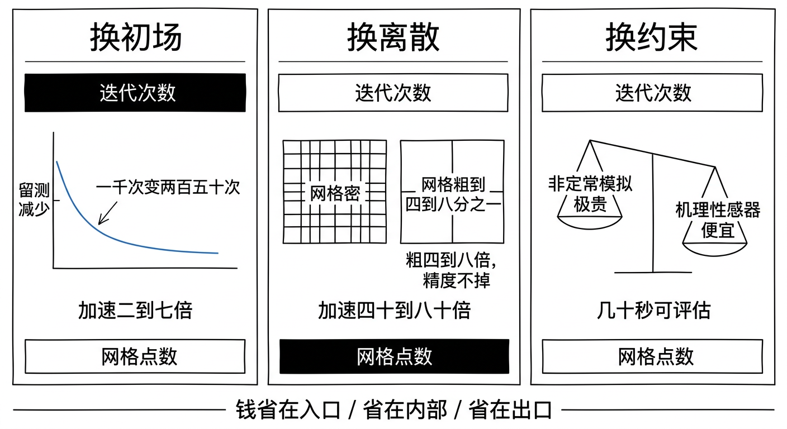

> 顺带一提：伴随方法"一次求解拿到全维度梯度"那张直觉图在讲 02 §3，
> 它省的是 $t_{\text{iter}}$ 之外的**梯度评估次数**——与本讲三招正交，四者可以叠加。

流场建模 → 初场 → CFD 收尾的完整链路仍见讲 07 那张图（`./images/L08_s2_flowfield_pipeline_zh.png`），
本讲只看**它在 p56–58 里被论文点明的两句限定**（见 §2 死穴一、二）。

---

#### 5. 数据与图表：Fig. 45 怎么读，以及它的"好看"与"不够"

论文本讲唯一的图是 **Fig. 45**（p57）：两张试验抖振起点工况下**平滑后的分离传感器在物面上的分布**。
图注原话是——**分离传感器能充分预测高亚声速与跨声速两种来流条件下的抖振起点，说明该方法具有合适的泛化能力**〔原文 P57 "The separation sensor adequately predicts"〕。

**读法（四步）**：
1. 先看**横轴是物面位置还是弦向站位**——传感器是按 $C_p$ 沿上表面后段算出来的，看图就知道它在哪儿"报警"；
2. 再看两个工况的曲线**峰值位置是否一致**：一致 ⇒ 说明这个量抓的是机理，不是拟合；
3. 找**4% 阈值线**：图里若没画阈值线，你就无法从图判断"裕度有多大"，只能读论文文字——这是本图的第一个不足；
4. 最后问：**样本量**。论文自己写了"上界由有限数量观测确定"，所以这张图证明的是"在这几个工况上不失效"，**不是**"在任意机翼上不失效"。

**把"换约束"这件事画成一页**（上：原来的约束为什么算不起；下：替代式为什么算得起、又欠了什么）：

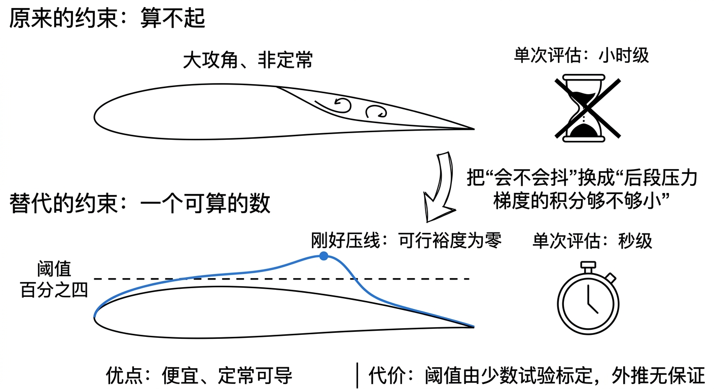

**同一段里的对照数字**：Li 等人那个 CNN 混合的机理型数据驱动抖振分析模型，
用**超过十万量级的数据点**训练，在 14,886 个未见测试数据上**抖振因子预测的平均绝对误差 0.05°**，
并被显示比 Kenway–Martins 传感器更可靠〔原文 P58 "mean absolute error of 0.05"〕。
——**这就是"便宜替代式"与"贵但准的模型"的正面交锋**：前者几十秒可评估、适用范围窄；后者训练成本极高（论文说用掉了超过 $10^{5}$ 次 CFD 模拟），准得多。

---

#### 6. 本讲收口前的审稿人批判

1. **加速比的分母不统一**：1.9–7.4×（含 CFD 收尾）与 40–80×（纯求解器成本）不是同一把尺。
   把它们并排写进同一个表格而不加说明，是综述式论文里最常见的"看起来更强"。
   → 你写组会汇报时，**每一行都标注"分母是什么"**。
2. **"保持精度"的验证集是作者自选的**：4–8× coarser、4× 保持精度这些结论，都在**一维/二维、作者挑的算例**上；
   跨音速激波 + 附面层干扰这种"精度最难保"的场景，论文没有给结论（p56 只写了二维湍流）。
3. **替代约束的阈值来源薄**：4% 由"试验对比"定，样本"有限"是论文原话级别的承认；
   把它当工程约束直接上优化环，等于**用一个未标定的经验常数决定飞机能不能飞**。
   → 你必须自己复现这个阈值，并报告错判率。
4. **本讲自己也有一处软**：上面那张图**不是论文原图**，是本白皮书画的直觉图（左/右栏对应"入口/出口"，不是论文的坐标）；
   它只帮你记结构，不能当证据引用。真正的证据在 `../资料原件/*.pdf` 的 p56–58 与 Fig. 45。

---

#### 7. 承前启后

- **承前**：本讲的"流场代理 → 初场"直接来自讲 07 §4（流场建模）；"削高频模态"是讲 03 的 DMD/POD 落地；
  "代理模型达不到所需保真度"这一句在讲 07 §2 也出现过，是同一句原文（p56）。
- **启后**：§4.3（讲 09）讲四种优化架构时，会**默认**你已经有本讲这种"评估加速"手段，
  否则外层加 100 次迭代的代价没人付得起；讲 06 的设计空间收缩与本讲的"少算"是**两条正交的省法**，
  可叠加，但论文没有给出叠加后的实测数字（这是空白，也是选题）。

---

#### 8. 你的项目接哪一步

| 你的现状 | 本讲诊断 | 动作（带口径标注） |
| :--- | :--- | :--- |
| SU2 粗网格 140k，relrms = −3.39，**converged = false**（E3） | 你现在连"baseline"都不是：分母没收敛，任何"加速比"都不成立 | 先把这条跑到收敛（或至少残差降 3 个量级），**记下 $N_{\text{iter}}$ 与墙钟时间**，才有资格报 1.9–7.4 这类数字（E4 前置） |
| 前端已有代理（ONNX 单点 0.13 ms） | 你只做了"替代搜索"，没做本讲第一招 | 加一条**Restart 通路**：代理预测的表面 $C_p$/速度场 → 反填 SU2 初场 → 实测迭代次数下降比；目标 3–5×，落在论文区间内即算复现成功 |
| 只有 π/η/ṁ 三个标量，**没有压力分布** | 第一招需要场量作初值，你现在给不出来 | 这就是讲 07 §8"先改输出"的具体代价：先补"沿叶高站位分布"输出，本讲的加速才接得上 |
| 平台目前**没有**几何/工程约束的替代式 | 组会上必被问"叶尖间隙、应力、喘振裕度怎么办" | 抄本讲 §3 的结构：挑一个**机理量**（如叶尖负荷峰或 M_rel 峰值位置）+ 一条你自己标定的阈值，做成 `constraint_proxy(x) ≤ bound`，并**报出标定样本数**（就像论文诚实写"limited number of observations"那样） |
| 对外口径"100,000×" | 那是**推理 vs CFD** 的成本比，与本讲的"加速 CFD"是两件事 | 双栏写：搜索阶段 100,000×（E2，代理推理）；求解器阶段目标 3–5×（E3，待你实测） |

---

#### 9. 自测 10 题（2 选 + 2 填 + 6 答）

1. （选）"用 ML 预测初场再跑 CFD"主要削减成本式 $T = N_{\text{iter}} \times t_{\text{iter}} \times N_{\text{cells}}$ 中的哪一项：A $N_{\text{iter}}$ B $t_{\text{iter}}$ C $N_{\text{cells}}$ D 三项同比例
2. （选）数据驱动离散化能拿到比初场猜测更大加速比的根本原因是：A 神经网络更准 B 它把网格点数按倍数减掉，而成本随网格点数超线性增长 C 它跳过了湍流模型 D 它不需要收敛判据
3. （填）论文里 CNN 预测初场带来的加速倍数区间是 __________；数据驱动离散化在二维湍流直接数值与大涡模拟上的加速区间是 __________。
4. （填）Kenway–Martins 分离传感器约束的上界取值为 __________，该阈值由 __________ 确定。
5. （答）为什么"粗 4 倍网格仍保持精度"这一结论不能直接搬到你的跨音速转子？给出一条你**必须补的验证**。
6. （答）写出"替代约束 = 机理量 + 标定阈值"这个结构，并说明误差被引入在哪一部分、为什么优化环里它可能**被系统性利用**（提示：优化器专挑约束松的地方）。
7. （答）论文说 ML 湍流闭合"不是为了加速而设计"，那它凭什么仍可能降低 ASO 的算力开销？说清逻辑链（不许写"因为更快"）。
8. （答）把 Fig. 45 的读法四步复述一遍，并指出图上**没有**什么导致你必须回去读正文。
9. （答）你要向审稿人解释"我的 100,000× 不是加速 CFD"，用两句话怎么讲？
10. （答）本讲两个数字（1.9–7.4× 与 40–80×）能相加相乘吗？给出你的判断与理由。

**答案要点**：1-A；2-B；
3-1.9 到 7.4 倍；40 到 80 倍；4-4%，由**试验对比（且观测数量有限）**；
5-因为它在一维/二维、作者自选算例上验证，跨音速激波使高频误差集中、且激波位置本身是目标量；
补的验证：同一外形粗/细网格**逐点压力分布对比 + 关键量（π、η）随网格的三条曲线**，不是只比 C_D；
6-误差在"阈值"（标定样本少、外推无保证）。优化器会朝约束被低估的一侧走，把替代式的**系统性偏差当成可乘之机**，
得到 CFD 里不可行的外形 ⇒ 必须留一个"最优点回 CFD 复核"的闭环；
7-因为替代约束/闭合让**同样算力下能跑更高保真的模拟**，或让原本根本跑不起的约束进入优化环，从而免去为绕开约束而做的额外工况计算；
8-见 §5；图上没有 4% 阈值线与错判率 ⇒ 只能从文字读；
9-"该倍率是候选点评估用代理替代 CFD 的**推理成本比**（E2）；求解器本身的加速尚未测量，目标 3–5×（E3/E4 待做）"；
10-不能。分母不同（一个含 CFD 收尾、一个是求解器内部），且两者作用在不同因子，是否可乘需要**联合实验**；论文没给。

---

#### 10. 一句收口

> **少算（加速）与换量（替代约束）都不制造精度；它们只是把精度挪到你能验证的地方——
> 挪完之后不敢验证，就是本讲所有数字的失效方式。**

---

<a id="part-3" name="part-3"></a>
# 第四篇 【优化架构与结论篇】

本篇覆盖**讲 09–10**，对应论文 §4.3 与 §5。前面所有讲次都在省「一次评估」，这一篇问的是**整个循环长什么样**：代理式优化怎么排兵布点，交互式设计怎么把 CFD 的成本从循环里搬进训练里，强化学习优化为什么只在少量设计变量上灵过，生成式反设计凭什么能「看图造形」。最后以作者的三条结论与一句自我批评收口。

<a id="lec-09" name="lec-09"></a>
<a id="lec-09" name="lec-09"></a>
### 【讲09】优化架构：代理式、交互式、RL 与生成式反设计
**覆盖论文 §4.3（4.3.1 代理式优化 / 4.3.2 交互式优化 / 4.3.3 强化学习优化 / 4.3.4 生成式反设计）｜ PDF 第 58–67 页 ｜ 配图 Table 4–6、Fig. 46–47**

---

#### 0. 本讲元数据

| 项 | 值 |
| :--- | :--- |
| 本讲范围 | §4.3 全部（p58–67） |
| 证据等级 | **A 级** |
| 前置 | 讲 02（EI/置信带）、讲 04（RL 三件套）、讲 06（合法性）、讲 07（代理精度与外推） |
| 读完你应该能 | ① 用一张表说出四种架构各自"省在哪、输在哪"；② 复述 Table 4 里"设计变量数 vs 代理模型类型"的规律；③ 判断你的平台属于哪一种、该往哪儿长 |
| 本讲一句话 | **前八讲都在省"一次评估"；本讲换的是"循环本身"——换循环才是数量级的收益，也是最容易骗自己的地方。** |

---

#### 1. 生活与物理直觉引子：四种看病策略

- **代理式（surrogate-based）**：先自己攒一本"病历手册"（代理模型），按手册判断"下一步该查哪项"（加点准则），
  只在最可疑处开一次真检查（CFD）——**每次真检查都在补手册**〔原文 P59 "rely on an iterative model refinement"〕；
- **交互式（interactive）**：手册已经厚到不用查了，医生当场翻，秒级给结论（**在线不再碰 CFD**）；
- **RL 优化**：培养一个**会看片子的住院医**，他一眼就知道往哪儿切；代价是**培养他花了五年**（训练成本）；
- **生成式反设计**：直接对病人说"我要一个健康的心脏"，让生成器画一个出来——**快，但它不知道你要的是最优**〔原文 P59 "could be distinct from the true optimum"〕。

---

**四格对照**（每格下方写它治的是哪个瓶颈；右上角短横是落地难度，越短越容易开工）：

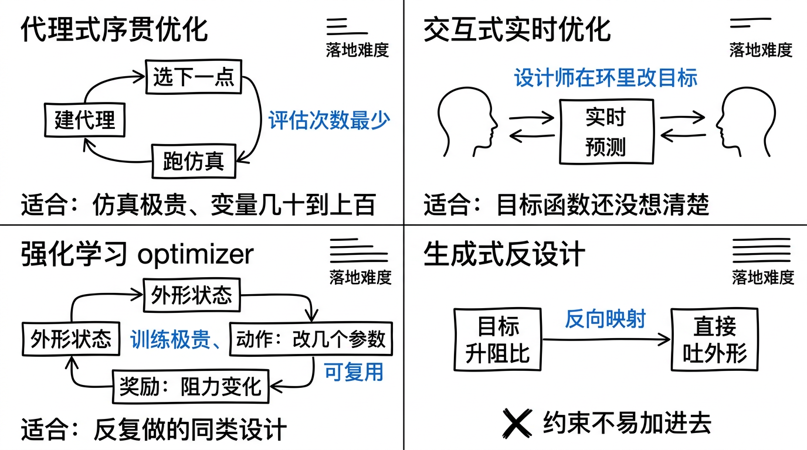

#### 2. 工程死穴：架构决定"你能不能收工"

**先认词**

| 中文 | 英文 | 一句操作定义 |
| :--- | :--- | :--- |
| 加点准则 | infill criterion / acquisition | 决定下一个 CFD 点算在哪的打分函数；常见是最大化 EI 或最小化置信下界 LCB〔原文 P60 "minimizing the lower confidence bounding"〕 |
| 序贯优化 | sequential / iterative refinement | 训代理 → 选点 → 跑 CFD → 并入样本 → 重训，循环 |
| EGO | Efficient Global Optimization | 用 Kriging 的 μ+σ 做 EI 的序贯优化（讲 02） |
| SEGOMOE | Super-Efficient GO + Mixture Of Experts | 把 Superego + Kriging-with-PLS + ME 拼起来处理较大规模问题〔原文 P59 "superego"〕 |
| 弱/强学习者 | weak / strong learner | ActivO 的思路：弱学习者找"值得探的区域"，强学习者在里面定最优点〔原文 P61 "weak"〕 |
| 泛化性 | generalizability | 在训练工况（M、Re）之外的表现；RL 用**物理特征**当状态可提升它〔原文 P59 "using physical features rather than geometric parameters as the state"〕 |

**死穴（Table 4，p60，一条能背出来的规律）**：把该表的"设计变量数"排序：
2 → 4 → 5 → 6 → 8 → 8 → 8 → 10 → 12 → 17 → **30（ANN）** → 40 → 42 → 48 → 19/75 → 80 → 36/72/108。
**分界线清清楚楚：≤17 维的清一色是 Kriging 或流形映射；一旦到 30 维，代理模型换成 ANN；到 72–108 维，连 ANN 都吃力，只剩"高维翼型 + C_p 匹配"这类专门设计。**
论文自己的结论是：**代理式优化不随维度良好扩展，因而不适用于高维设计问题**〔原文 P60 "does not scale well with the dimensionality"〕。

**第二条死穴**：加点准则会被**不准确的代理模型**反噬——它们常把新样本加到畸形外形上，而这些外形对改进毫无贡献〔原文 P61 "these criteria always suffer from inaccurate surrogate models"〕。
→ 所以合法性过滤（讲 06）不是锦上添花，是序贯优化的**必备闸门**。

---

#### 3. 数学从 0 到 1：四种架构的目标函数长什么样

**（a）代理式（序贯）**
外层：max_x EI(x) s.t. S_valid(x) ≥ s_min，x ∈ [lb, ub]（EI 定义见讲 02 §3(e)）。
**一个完整的数字算例**（照讲 02 的手算延续）：候选点 A（μ=0.90, σ=0.10）、B（μ=1.10, σ=0.60），ξ=1.00 → EI_A=0.108、EI_B=0.185 ⇒ 选 B；
**但若 B 的合法性 S_valid=0.42 < 0.7 ⇒ B 被过滤掉，退而选 A**。这一步就是"过滤改变优化轨迹"的最小可复现例子（`code/kriging.py` 里可跑通 EI 计算，过滤惩罚按 §(d) 加）。

**（b）交互式**
在线：min_x ŷ_ANN(x) s.t. 几何/工艺约束；**没有 CFD、没有重训**。
可交互的门槛是"响应时间 < 人的注意力间隔"（工程上取 100 ms 级）。
论文给出的可比数字：Secco & de Mattos 的 ANN 模型（10^5 样本、40 输入）实现了相对全位势代码 **4,000×** 加速〔原文 P61 "4,000"〕——
**这是论文口径的加速比，你对外写 100,000× 时，必须说明分子分母各是什么**（见讲 07 §8）。

**（c）RL 优化**
学策略 π_φ(a|s)：max_φ E[Σ γ^t r_t]；**不需要气动力学导数**。
论文的评语很克制：一个训练充分的 RL 优化器**据报告能达到梯度法级别的效率而不使用导数**，但训练过程可能耗时〔原文 P59 "a well-trained rl optimizer is reported to achieve"〕。
关键实验事实（Fig. 47）：**大部分减阻在头 5 步内完成**〔原文 P65 "most of the drag reduction is achieved"〕，
且只在 M=0.76、Re=5×10⁶ 训练的策略，可在 M∈[0.72,0.76]、Re∈[5×10⁶,1×10⁷] 上照常减阻〔原文 P65 "can be used for drag reduction at other"〕。
**读法**：头 5 步吃掉 90% 收益 ⇒ RL 的"快"来自**动作先验**（它从不往畸形方向动），不是来自算法天赋。

**（d）合法性门控的统一写法（本白皮书构造，非原文）**：
四种架构都能写成同一句"在线目标 = 收益 − 风险"：

  J(x) = [−ŷ(x) 或 EI(x) 或 E_π[Σγ^t r_t] 或 −‖G(z)−x_target‖²] − β₁(1−S_valid(x)) − β₂·1[d(x, X_train) > d_max]

三项惩罚分别是**合法性**与**外推距离**；β 由你对"愿不愿意让优化器冒险"来定。

**（e）生成式反设计**
给定目标性能 y*，学后验 P(x|y)：conditional GAN / conditional VAE。
论文明确两点：① 反问题在 ASO 里**大多是病态的**——不同形状可以有同样性能〔原文 P66 "ill-posed since different shapes"〕；
② 因此它更适于**低保真概念设计**，而不是交付级最优点〔原文 P59 "could be distinct from the true optimum"〕。
（工业侧同页还有一句："generative inverse design is usually shorted as generative design"，
 并点名 Monolith AI、Altair 把 AI 生成式设计当门面，案例包括**叶轮机械叶片**〔原文 P66 "monolith ai"〕。原文把 "shortened" 写成 "shorted"，照录。）

---

#### 4. 操作流：怎么选（也是组会上最可能被问的一张表）

| 架构 | 需要的样本 | 在线延迟 | 能带约束吗 | 高维（>30）还行吗 | 何时该用 |
| :--- | :--- | :--- | :--- | :--- | :--- |
| 代理式序贯 | 50–1,000 | 秒–分钟（含 CFD） | **天然能**（EI + 约束） | 差〔原文 P60 "does not scale well with the dimensionality"〕 | 预算 ≤ 1,000 次 CFD、d ≤ 20 |
| 交互式 | 10⁴–10⁵ | **毫秒** | 只能显式约束，且**约束错了没人救你** | 中（靠降维救） | 要做产品/前端/汇报演示 |
| RL 优化 | 环境交互 10⁵–10⁷（可用低保真） | 毫秒 | **差**（可调约束是明确短板〔原文 P59 "concerns of rl-based aso include the high training cost"〕） | 差（原文：只演示过少数设计变量的问题） | 流程重复度极高、且约束能用奖励表达 |
| 生成式反设计 | 10³–10⁵ 带标签 | 毫秒 | 以"目标性能"为条件 | 中 | 概念生成、方案海选 |

---

#### 5. 数据与图表：读 Fig. 46 与 Fig. 47


- **Fig. 46（p64）**：交互式气动外形设计优化。图题只有一行〔原文 P64 "figure 46: interactive aerodynamic shape design optimization."〕——
  **这是全篇最该被批评的一张图**：一张"旗舰成果图"没有坐标轴含义、没有延迟数字、没有用户交互界面截图。
  读者只能靠正文猜它到底展示了什么。**你以后做 Fig 1 的时候别学它。**
- **Fig. 47（p65）**：RL 优化器的状态量收敛历程 + 中间外形。它把"泛化"（Test no.2/31）和"5 步收敛"放在一起，
  是**有效图**的范例：一张图同时回答"快不快"与"换工况还灵不灵"。

---

#### 6. 审稿人批判

1. **Table 4 只给"设计变量数/代理类型/目标"，不给 CFD 次数与最终收益**：于是"17 维 Kriging"与"108 维 Kriging"看起来一样可行，
   而真实差别（收敛是否失败、多少样本）全被抹平——**这是综述表格的通病，本讲 §2 已经替你补了一条分界线**；
2. **"交互式"没有一句成本核算**：10^5 样本的 RANS 训练要多少核时？论文只报推理精度不报训练账，
   这正是 Abstract 里承认的"ML 训练成本高"〔原文 P1 "practical large-scale design optimizations remain"〕在正文里被淡化的地方；
3. **RL 一节只给成功案例**（超临界翼型 3 个 Hicks–Henne 变量），没有任何失败案例或"多少维就崩"的边界；
4. **生成式反设计与优化被并列在"优化架构"里，但它们解决的问题不同**：一个是"给性能求形状"，一个是"给约束求最优形状"；
   并列会误导读者以为生成式设计可以做最优化。

---

#### 7. 承前启后

- **承前**：本讲把讲 02 的 EI、讲 06 的过滤、讲 07 的精度与外推**装进同一个循环**；
- **启后**：讲 10（§5 结论）会看到作者自己怎么总结这三类贡献；
  讲 11 会拿"训练成本"这把尺回头量整篇综述。

---

#### 8. 你的项目接哪一步

| 你现在（E2 为主） | 本讲定位 | 下一步（按性价比排序） |
| :--- | :--- | :--- |
| NSGA-II 在代理上跑 100×200 → 100 个非支配解 + 前端 WASM 交互 | **你做的正是 Table 5 那一族的交互式优化**（论文同类：135,108 样本、60 变量、0.4%、1–2 counts） | ① 补一份"训练成本账"（样本数 × CFD 机时 + 网络训练时），② 前端把 §3(d) 的两个惩罚项做成开关，让用户能看到"这条前沿有多少是外推来的" |
| 只有一档代理 | 代理式序贯的"加点准则"你还没有 | 在 Kriging/GEK 基线上实现 EI 加点（`code/kriging.py` + `code/ego.py`），**先证明它能少花 CFD 次数**再谈架构创新 |
| 想用 RL 当亮点 | 论文警告：RL 只在**少量设计变量**上演示过 | 若上 RL，先做"每步在 3–5 个模态系数里选 ±δ"的**离散小动作空间**，用你的代理当环境；把"5 步吃掉多少收益"作为第一指标（对标 Fig. 47） |

---

#### 9. 自测 10 题（2 选 + 2 填 + 6 答）

1. （选）代理式序贯优化的"加点准则"最本质的作用是：A 让模型更大 B 决定下一次昂贵 CFD 花在哪儿 C 替代优化器 D 减少设计变量
2. （选）RL 优化目前最明确的短板是：A 需要导数 B 训练成本高且难以处理可调约束 C 不能连续动作 D 必须有 CFD
3. （填）论文 Table 4 里，设计变量 ≤17 的工作几乎都用 __________；跳到 30 维时换成了 __________。
4. （填）RL 优化器在超临界翼型算例里，大部分减阻在 __________ 步内完成；其训练工况为 M = __________、Re = __________。
5. （答）为什么说"过滤闸门"是序贯优化的必需品？用一句话 + 一个公式回答。
6. （答）把"交互式 4,000×"与你的"100,000×"放在同一口径下比较，写出各自的分子与分母，并判断是否可比。
7. （答）RL 用"物理特征当状态"为什么能提升泛化？给出你自己的状态设计（三项即可）。
8. （答）生成式反设计为什么天生不适合交付级最优点？用一个反例说明（同一 C_D 可以有几种外形）。
9. （答）若明天只能给你的平台加**一个**功能来提高可信度，你加哪个？说清输入输出与判据。
10. （答）批判：为什么"旗舰成果图不给坐标轴含义"是学术不端边缘？你会怎么给 Fig. 46 补三行 caption？

**答案要点**：1-B；2-B；3-Kriging、ANN；4-头 5 步、0.76、5×10⁶；
5-因为不准确代理会把新样本加到畸形区（P61 原话），公式 J 里减 β₁(1−S_valid)；
6-4,000× = 全位势代码求解时间 ÷ ANN 推理时间；你的 100,000× = 一次 SU2 求解 ÷ ONNX 推理 0.13 ms ——**同为"推理 vs 求解"口径但分子不同（全位势 vs RANS），不可直接比大小，只能并列陈述**；
7-物理特征（激波位置、吸力峰 M）与几何坐标相比，对不同外形的因果更稳；你的状态：叶尖 M_rel、喉部面积、进出口激波位置；
8-病态性：一个 C_D 可对应无激波/弱激波/强激波三种外形，性能最优 ≠ 结构/换热可接受；
9-外推门控（最近邻距离 + 覆盖率）——因为它直接决定用户会不会拿错设计去加工；
10-例：补"横轴：优化迭代步；纵轴：C_D 相对基准的变化；数据源：RANS 135,108 样本训练，留出 47,967；推理延迟 1.85 ms（服务端）"。

---

#### 10. 一句收口

> **换代理省的是次数，换架构省的是数量级；
> 但你必须先能报出自己的训练账本，否则"交互式"只是把成本从看得见的地方挪到看不见的地方。**

---

<a id="lec-10" name="lec-10"></a>
<a id="lec-10" name="lec-10"></a>
### 【讲10】作者的三条结论与一句自我批评
**覆盖论文 §5 Conclusions and Outlook｜PDF 第 68 页（结尾跨到 69 页头）**

---

#### 0. 本讲元数据

| 项 | 值 |
| :--- | :--- |
| 本讲范围 | §5（p68–69 首段） |
| 证据等级 | **A 级**（本讲每一句都带页码，且**只用论文原话**，我们只在标注「本白皮书解读」处插嘴） |
| 前置 | 讲 01–09；尤其讲 06（设计空间）、讲 07（评估）、讲 09（架构） |
| 读完你应该能 | ① 背出三条结论的**结构**（对象 × 收益 × 条件）；② 说出作者自陈的两个未解之处；③ 把"核心强项"那句话当成你论文的选题判据 |
| 本讲一句话 | **一篇好综述的结论章不会说"ML 很好"，而会说"ML 在哪一步、以什么代价、在什么条件下好"——本讲把这三层拆给你看。** |

---

#### 1. 生活与物理直觉引子：验收单，不是庆祝词

把 §5 当成**甲方给的验收单**读，而不是作者的庆功宴。它一共三行，每行都是同一个句式：

> **「在 X 这件事上，ML 能做到 Y，前提是 Z。」**

**先认词**（本讲不引入新方法词，只补三个"结论体"用语）

| 中文 | 英文 | 一句操作定义 |
| :--- | :--- | :--- |
| 经验知识来源 | empirical knowledge | 论文列的三类：人类设计师的经验、历史设计、低保真优化结果〔原文 P68 "from the empirical knowledge of human designers, historical designs, or"〕 |
| 插值型 | interpolative | 只在样本之间可信；样本之外靠"形状假设"硬撑 |
| 外推能力 | extrapolation ability | 论文只给了 PINN 一个"potentially"（可能具备），并**要求未来工作给出明确演示**〔原文 P48 "Clear demonstrations of extrapolation in benchmark ASO cases are recommended in future work."〕 |

---

#### 2. 工程死穴：结论里被藏起来的"训练成本"

**（a）三条结论的原文骨架与我们的解读**

| # | 论文原文（截取） | 收益 | 隐藏代价（解读） |
| :---: | :--- | :--- | :--- |
| ① 设计空间 | ML 通过从人类经验、历史设计或低保真优化结果中学习，用**更少的设计变量或更紧的边界**来参数化设计空间〔原文 P68 "ML helps parameterize the geometric design space using fewer design variables or more restricted"〕 | 维度下降 ⇒ 样本需求指数级下降；畸形形状被排除；"以很低概率误伤创新外形" | 需要**一个数据库**；数据库的来源决定天花板（讲 06 §4 的三条路线） |
| ② 气动评估 | 深度学习的强学习能力使**处理更大训练集、拿到更高系数预测精度**成为可能；非线性降维（流形学习、VAE、GAN）帮助预测高维流动解〔原文 P68 "Advances in ML have made it possible to handle larger volumes of training data"〕 | 交互式设计成为现实；流场可预测 ⇒ 反设计/多学科/结果解释都能用 | **"大多数 ML 预测模型是插值型的，因此在外部预测时可能失去精度"**〔原文 P68 "Most ML prediction models are interpolative, so they"〕；PINN 的外推只是"可能具备"，应用仍待研究〔原文 P68 "Applications of PINNs in ASO warrant further research."〕 |
| ③ 优化架构 | ML 为 ASO 提供了新的**优化架构**：代理式优化在解决不连续气动函数、多目标、考虑不确定性的设计问题上变得更有效〔原文 P68 "ML contributes new optimization architectures to address the limitations of CFD-based opti-"〕 | 能处理"梯度法啃不动"的问题 | RL **只在少量设计变量上验证过**，且训练效率与"可调约束"是明确短板〔原文 P68 "Reinforcement learning can perform ASO without using derivatives, but this has only been demonstrated for problems with a few"〕 |

**（b）作者自己写下的一句行业级批评（务必逐字记住）**

> "我们发现有**很多 ML 模型被用在较不难的 ASO 问题上，且没有与传统 ASO 做对比**。"
> 〔原文 P68 "many ML models are applied to less challenging ASO"〕

**这句话值多少钱**：它把整个领域的评价标准从"精度多高"改成"**你有没有在难问题上、对着传统方法打**"。
你以后写论文的 §1，第一句动机就该从这里长出来；你评审别人的 ML-for-ASO 工作，第一个问题也该是这个。

**（c）他们给出的"核心强项"判据（选题金句）**

> 他们认为 ML 的核心强项在于：能解决**用传统方法难以处理**的问题，而不是给本来就 manageable 的问题提供一个替代品。
> 因此更值得关注的是：**在"用传统 CFD 基优化解决不了"的实用 ASO 问题上研究 ML 模型**，
> 未来研究应当指向一个**尚未解决的问题**，并以**与最先进方法的对比**收尾。
> 〔原文 P69 "Thus, it is of greater interest to study ML models with"〕〔原文 P69 "end with a comparison"〕

---

#### 3. 数学从 0 到 1：把"结论"翻译成可核对的量

结论没有数字，就不可证伪。本白皮书给每条结论配一个**你平台能算的量**：

- **①少维数的收益**：Δlog₁₀(样本需求) = (d₀ − d₁) × log₁₀(t)，
  其中 d₀ = 74、d₁ = 8、t = 每轴点数（由 `code/curse.py` 复算）：
  Δ = 66 × log₁₀(10) = **66 个数量级**——这不是"更好"，这是"从不可能到可能"；
- **②精度—外推的取舍**：定义**外推分数** ex(x) = max(0, (d(x, X_train) − q₉₅(d_in)) / q₉₅(d_in))，
  要求报告「留出集 MAE」与「ex > 1 子集上的 MAE」**两栏**；只报前者视为未完成本条；
- **③架构收益**：以「**同等 CFD 预算下的最优值改进**」为唯一指标（比如 200 次 CFD 内，你的交互式流程 vs SLSQP+SU2 各拿到多少 counts）；
  论文里可比的最硬一条是：数据驱动优化与 RANS 优化的最小 C_D 差 **0.04 counts（亚声速）/ 2.5 counts（跨声速）**〔原文 P62 "0.04 counts"〕。

---

#### 4. 操作流：把 §5 变成你组会的 3 页 PPT

| 页 | 内容 | 你必须放的数 |
| :---: | :--- | :--- |
| 1 | 三条结论（原句 + 中文），每条右侧一列"我们的平台做到了哪一步" | 74 → 8 维 ⇒ 需求降 66 个量级（`code/curse.py`） |
| 2 | 两个未解：PINN 外推无演示；RL 只在小维数验证 | 我们的 1,000 样本 / 74 维 ⇒ 每轴 1.10 点（同一脚本） |
| 3 | 我们的下一步（按作者判据）：在"传统方法做不了"的那一格做对比实验 | 200 次 CFD 预算下的双轨对比设计 |

---

#### 5. 数据与图表：本讲没有配图，因为 §5 一张图都没有


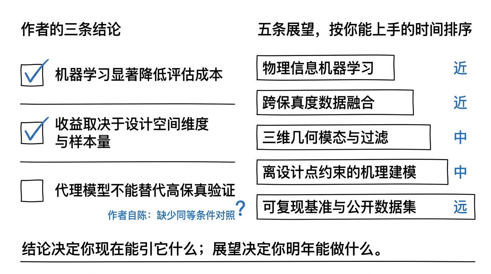

> 借讲 01 那张图读结论：**①对应格 1、②对应格 2 与 5、③对应格 2、3、6**——
> 作者没有画新图，但结论的坐标早已在 §2.2 的六个挑战里埋好。会读综述的人，就是把结论章反查回挑战章的人。

**这本身就是一条可读的批评**：结论章零图、零汇总表、零数字，
把"三条结论"的证据全部外包给前 67 页。对比你见过的顶刊综述——
**结论章带一张"方法 × 收益 × 代价"总表的，读者三个月后还能引用它**（本白皮书第六篇 6.1 就是替他补的那张表）。

---

#### 6. 审稿人批判（对 §5 的三条，加上对我们的自查）

1. **三条结论不对称**：①③是"能做到"，②里塞了"精度更高 + 外推有风险 + PINN 待研究"三层，信息密度差 3 倍，读起来像"作者自己也拿不准第②条"；
2. **没有给出"难问题"的定义**：什么叫 less challenging？按维度？按是否多目标？按 CFD 次数？综述未定义，导致这条批评无法被量化传播；
3. **展望部分只有一句"physics-informed ML is recommended"**：Abstract 与 §5 首尾呼应是优点，但没有列出"具体缺什么"（缺算例？缺收敛理论？缺基准？）；
4. **自查**：本白皮书 6.1 的那张总表同样没有"CFD 预算"列——**我们在 §7 补，而不是假装没看见**。

---

#### 7. 承前启后

- **承前**：三条结论分别收编讲 06（①）、讲 07–08（②）、讲 09（③）；
- **启后**：讲 11 用"作者自陈的两处不足"作为批判性阅读的靶子；讲 12 把 §3 的三个量变成你的改进清单。

---

#### 8. 你的项目接哪一步（本讲是"验收单"，直接抄给你的 README）

```
【P01 综述 §5 验收三问】（孙承泽平台自查）
① 我的 74 → 8 维降维，让"每轴点数"从 1.10 变成多少？是否 ≥ 2？（code/curse.py 复算）
② 我的代理模型：留出集 MAE 与"外推子集 MAE"分别是多少？差几倍？（差 > 3 倍 ⇒ 前沿不可用于交付，只做海选）
③ 我有没有在同等 CFD 预算下与传统基线（SLSQP+SU2 或伴随）对比过？没有 → 补 200 次预算的双轨实验。
```

---

#### 9. 自测 10 题（2 选 + 2 填 + 6 答）

1. （选）作者认为 ML 的"核心强项"是：A 精度更高 B 解决传统方法难以解决的问题 C 省人力 D 训练快
2. （选）关于 PINN，§5 的措辞是：A 已能实用 B 可能具备外推能力、应用仍待研究 C 已被否 D 只适合层流
3. （填）三条结论分别关于 __________、__________、__________。
4. （填）作者对领域的批评原文是：很多 ML 模型被用于较不难的问题，且没有与 __________ 对比。
5. （答）把结论①改写成一句"收益 + 前提"的中文，不许用"更少的设计变量"这六个字。
6. （答）用 Δlog₁₀ = (d₀−d₁)·log₁₀(t) 算：若你从 74 维降到 12 维、每轴要求 5 点，样本需求下降多少个数量级？
7. （答）为什么"ML 模型是插值型的"这条限制，对**优化循环**比对**预测任务**更致命？
8. （答）RL 的"只在少数设计变量上验证过"，与讲 06 的模态降维合起来看，能推出什么可执行结论？
9. （答）如果审稿人说"你没有和传统 ASO 对比"，请引 §5 的原句作为你补实验的依据，并写出补实验的预算与指标。
10. （答）为什么说"结论章一张表都没有"是可批评的？你要在自己的报告里放哪三列？

**答案要点**：1-B；2-B；3-几何设计空间（参数化）、气动评估（预测）、优化架构；4-传统 ASO；
5-例：把形状表达能力交给数据学出来的模态，用更少的自由度换回可采样的维度，前提是先有一个真实的形状库；
6-(74−12)×log₁₀5 = 62×0.699 ≈ **43 个数量级**；
7-预测任务错一次只是错一次；优化循环会**主动搜索模型高估的区域**，误差被当成收益放大并固化到最终设计；
8-两条合起来 ⇒ 先把 d 压到 ≤ 5–8，再谈 RL/无梯度法；这是论文没写但可推出的执行顺序；
9-引〔原文 P68 "many ML models are applied to less challenging ASO"〕与〔原文 P69 "end with a comparison"〕；
   预算：200 次 CFD；指标：同预算下最优 C_D（counts）、可行性/畸形率、留出 MAE；
10-因为综述的价值在于"可检索的结论"；三列：方法 / 相对传统 ASO 的收益（带口径） / 代价（样本量、训练成本）。

---

#### 10. 一句收口

> **作者的三条结论，最后都指向同一句话：ML 的功劳必须记在"传统方法做不到的地方"，
> 否则它就只是把同一个答案换了个更贵的算法算出来。**

---

<a id="part-4" name="part-4"></a>
# 第五篇 【实践与代码篇】可运行原型库

本篇一律「能跑才算写完」：每个模块直接 `python3 code/<name>.py` 即可运行，末尾打印自检数字与 `PASS` 标记。正文里凡写「由 `code/xxx.py` 复算」的数字，都由本库当场算出，不是抄来的。

# code/ · 可运行原型库

> 规矩只有一条：**跑不通的文件不许进白皮书**（`tools/verify_all.py` 会把每个模块跑一遍）。
> 本目录的每个模块都是"教学实现"：追求可逐行讲清，不追求性能；用真数据请换 sklearn/GPy。

| 文件 | 干什么 | 对应讲次 | 运行 |
| :--- | :--- | :---: | :--- |
| `curse.py` | 维度灾难计算器：每维点数、所需样本量、高维空间里"点都很边缘"的蒙特卡洛实证 | 第零章 0.4 / 讲 03 | `python3 code/curse.py` |
| `kriging.py` | 最小可用 Kriging：高斯相关 + 常数趋势 + θ 的极大似然网格搜索，输出 μ、σ | 讲 02 | `python3 code/kriging.py` |
| `ego.py` | EI 加点准则 + 20 步序贯优化，在 y = x·sin(x) 上找最小值，打印每步 z 与 EI | 讲 02 / 讲 09 | `python3 code/ego.py` |
| `pca.py` | PCA 三步（中心化 → 协方差 → 特征分解），打印特征值与累计方差保留曲线 | 讲 03 | `python3 code/pca.py` |
| `modal.py` | 20 维玩具翼型：PCA 模态收缩（含标准库 Jacobi 特征分解）+ 几何有效性门，实测"每维点数"与"白烧 CFD 概率" | 讲 06 | `python3 code/modal.py` |
| `gek.py` | 间接梯度增强 Kriging（式 19 虚拟点），θ 用**留一交叉验证**选，多随机设计取平均报 RMSE 与比值 | 讲 02 | `python3 code/gek.py` |

## 与白皮书的关系

- 白皮书第五篇的代码由 `tools/build_whitepaper.py` 从本目录**原样嵌入**；
- 正文里凡是"由 `code/xxx.py` 复算"的数字，都必须能在对应模块的自检输出里找到；
- 找不到的，按 `tools/verify_all.py` 的 A 项判为无出处 → 白皮书不得交付。

## 待建模块（显式挂牌，不留温和的沉默）

| 文件 | 计划内容 | 依赖 |
| :--- | :--- | :--- |
| `validity.py` | 玩具版几何合法性判别器（2 层 MLP，正样本=正弦扰动翼型，负样本=随机多边形）；目前 `modal.py` 里是**规则版**门（3 条可手算判据），要上学习版就得引入 numpy/torch | `numpy` |
| ~~`gek.py`~~ ✅ 已交付 | 间接 GEK 已写成 `gek.py`（含 LOOCV 选 θ、多 seed 取平均），并暴露了两个真实短板：**样本点上不插值**、**n=10 时反而更差** | — |
| `moo.py` | 加权法 vs NSGA-II 在同一双目标上的 Pareto 采样密度对比（讲 01 挑战②） | `numpy` |

<a id="code-curse-py" name="code-curse-py"></a>
### `curse.py`

```python
#!/usr/bin/env python3
# -*- coding: utf-8 -*-
"""
curse.py —— 维度灾难计算器（讲 03 / 第零章 0.4 的数字都由它现场复算）
============================================================================
三个问题：
  Q1 N 个点均匀撒进 d 维盒子，每个方向摊到几个点？  → per_axis = N ** (1/d)
  Q2 想让每轴至少 t 个点，需要多少样本？            → need = t ** d
  Q3 高维立方体里随机取点，它离边界有多近、离邻居有多远？（蒙特卡洛实证）

用法： python3 code/curse.py            # 跑自检并打印
      python3 code/curse.py --n 1000 --dims 1,3,8,74,100 --t 10
"""
from __future__ import annotations

import argparse
import math
import random

def per_axis(n: float, d: int) -> float:
    return n ** (1.0 / d)

def need_samples(d: int, t: float) -> float:
    return t ** d

def edge_stats(d: int, trials: int = 4000, seed: int = 7):
    """单位立方体 [0,1]^d 内均匀取点：统计到最近边界的距离（取各坐标 min(x,1-x) 的最小值）
    以及到最近邻居的距离。返回两个均值。"""
    rng = random.Random(seed)
    pts = [[rng.random() for _ in range(d)] for _ in range(trials)]
    edge = min(min(min(x, 1 - x) for x in p) for p in pts[:trials])
    edge_mean = sum(min(min(x, 1 - x) for x in p) for p in pts) / trials
    nn = []
    for i in range(120):
        best = float("inf")
        for j in range(120):
            if i == j:
                continue
            best = min(best, math.dist(pts[i], pts[j]))
        nn.append(best)
    return edge_mean, sum(nn) / len(nn), edge

def report(n: float, dims: list[int], t: float) -> str:
    lines = [f"固定样本量 N = {n:g}，要求每轴 ≥ {t:g} 个点", "",
             f"{'维度 d':>8} | {'每轴点数 N^(1/d)':>16} | {'所需样本 t^d':>18} | {'缺口倍数':>12}",
             "-" * 74]
    for d in dims:
        pa = per_axis(n, d)
        need = need_samples(d, t)
        gap = need / n
        lines.append(f"{d:>8} | {pa:>16.3f} | {need:>18.3g} | {gap:>12.3g}")
    lines.append("")
    lines.append("高维几何实证（单位立方体，均匀随机点，4000 次）：")
    for d in (2, 8, 74):
        e, nn, emin = edge_stats(d)
        lines.append(f"  d={d:>3}：点到最近边界的平均距离 {e:.4f}（全场最小 {emin:.4f}），"
                     f"120 点互找最近邻的平均距离 {nn:.4f} → 比值 {nn / e if e else float('nan'):.2f}")
    lines.append("")
    lines.append("结论：d 一大，样本数与边界距离同时坍缩，而邻居距离几乎不变 —— "
                 "「数据永远在边缘」不是比喻，是算术。")
    return "\n".join(lines)

def selftest() -> int:
    ok = True
    if abs(per_axis(1000, 3) - 10.0) > 1e-9:
        print("FAIL: per_axis(1000,3) 应为 10.0"); ok = False
    if abs(per_axis(1000, 74) - 10 ** (3 / 74)) > 1e-6:
        print("FAIL: per_axis(1000,74) 应约 1.10"); ok = False
    if need_samples(8, 10) != 1e8:
        print("FAIL: need_samples(8,10) 应为 1e8"); ok = False
    if need_samples(1, 10) != 10:
        print("FAIL: need_samples(1,10) 应为 10"); ok = False
    e8, nn8, _ = edge_stats(8)
    if not (0.0 < e8 < 0.5):
        print("FAIL: 8 维边界距离应在 (0,0.5)"); ok = False
    print("selftest:", "PASS" if ok else "FAIL")
    return 0 if ok else 1

if __name__ == "__main__":
    ap = argparse.ArgumentParser()
    ap.add_argument("--n", type=float, default=1000)
    ap.add_argument("--dims", default="1,3,8,74,100")
    ap.add_argument("--t", type=float, default=10)
    a = ap.parse_args()
    print(report(a.n, [int(x) for x in a.dims.split(",")], a.t))
    print()
    raise SystemExit(selftest())
```

<a id="code-ego-py" name="code-ego-py"></a>
### `ego.py`

```python
#!/usr/bin/env python3
# -*- coding: utf-8 -*-
"""
ego.py —— 加点准则（EI / LCB / UCB）与序贯全局优化（讲 02 §3(e)、讲 09 §3(a) 的实盘）
============================================================================
三条准则，全部只依赖代理模型给出的 (μ, σ) 与当前最优 ξ：

  EI(x) = (ξ − μ)·Φ(z) + σ·φ(z)，  z = (ξ − μ)/σ     （最大化"期望改善"，最小化问题）
  LCB(x) = μ(x) − κ·σ(x)                             （乐观地看下界；论文 §4.3.1 提到"最小化置信下界"这一族准则）
  UCB(x) = μ(x) + κ·σ(x)                             （最大化时用；这里只给对照）

三件必须亲眼看见的事（本模块的自检就是把它们跑出来）：
  T1 手算例：μ/σ 已知时 EI 的数值（讲 02 §3(e) 那两个点，误差 < 0.02）
  T2 数值病：z ≪ −40 时 φ(z) 下溢 ⇒ EI ≡ 0 ⇒ 序贯优化僵住（讲 02 讲的"z 的两个极端"的算术版本）
  T3 端到端：在可手算的二次函数上跑 12 步 EGO，20 次昂贵评估内逼近真最优

只用标准库（numpy 都不需要）。用法：
    python3 code/ego.py                    # 三项自检 + 端到端 EGO
    python3 code/ego.py --demo-ei          # 只跑 T1
    python3 code/ego.py --criterion lcb    # 端到端换 LCB（默认 ei）
"""
from __future__ import annotations

import argparse
import math
import os
import random
import sys

sys.path.insert(0, os.path.dirname(os.path.abspath(__file__)))
from kriging import Kriging  # noqa: E402

def Phi(z: float) -> float:
    return 0.5 * (1.0 + math.erf(z / math.sqrt(2.0)))

def phi(z: float) -> float:
    return math.exp(-0.5 * z * z) / math.sqrt(2.0 * math.pi)

def ei_min(mu: float, sd: float, xi: float) -> tuple[float, float]:
    """返回 (EI, z)。最小化问题专用；σ→0 时 EI→0（已采样点没有信息量）。"""
    if sd <= 1e-12:
        return 0.0, float("inf")
    z = (xi - mu) / sd
    return (xi - mu) * Phi(z) + sd * phi(z), z

def lcb(mu: float, sd: float, kappa: float = 1.96) -> float:
    return mu - kappa * sd

def ucb(mu: float, sd: float, kappa: float = 1.96) -> float:
    return mu + kappa * sd

# ---------------------------------------------------------------- T1 / T2 自检
def demo_ei(verbose: bool = True) -> tuple[bool, float, float]:
    rows = [(0.90, 0.10, "A"), (1.10, 0.60, "B")]
    vals, ok = [], True
    if verbose:
        print("T1 讲 02 手算例复算（最小化，ξ = 1.00）")
        print(f"{'点':>4} {'μ':>6} {'σ':>6} {'z':>8} {'EI':>8}  类型")
    for mu, sd, tag in rows:
        v, z = ei_min(mu, sd, 1.00)
        vals.append(v)
        if verbose:
            print(f"{tag:>4} {mu:>6.2f} {sd:>6.2f} {z:>8.4f} {v:>8.4f}  "
                  + ("偏开发(z>0)" if z > 0 else "偏探索(z≤0)"))
    ok &= vals[1] > vals[0] and abs(vals[0] - 0.108) < 0.01 and abs(vals[1] - 0.185) < 0.02
    if verbose:
        print("    ⇒ 预测更差的 B 反而 EI 更大：σ 是「万一更好」的期权费。")
        print("T2 数值病演示（z ≪ 0 时 φ 下溢）")
        for z in (-3.0, -10.0, -38.0, -40.0):
            v, _ = ei_min(0.0, 1.0, z)
            print(f"    z = {z:>6.1f} → EI = {v:.3e}（φ(z) = {phi(z):.3e}）")
        v40, _ = ei_min(0.0, 1.0, -40.0)
        print("    ⇒ z ≤ −40 时 EI 数值上等于 0，序贯优化会僵在「没信息可算」的地方。")
    return ok, vals[0], vals[1]

# ------------------------------------------------------------------ T3 端到端
def stratified(n: int, lo: float, hi: float, seed: int = 20260907) -> list[float]:
    rng = random.Random(seed)
    strata = n * 4
    return [lo + (hi - lo) * (i + 0.5) / strata for i in sorted(rng.sample(range(strata), n))]

def sequential(f, lo: float, hi: float, steps: int = 12, n_grid: int = 800,
               n_init: int = 6, criterion: str = "ei", kappa: float = 1.96):
    xs = stratified(n_init, lo, hi)
    ys = [f(x) for x in xs]
    hist, dead = [], 0
    for _ in range(steps):
        m = Kriging(theta_grid=(0.1, 0.25, 0.5, 1.0, 2.0, 4.0, 8.0, 16.0, 32.0),
                    ).fit([[x] for x in xs], ys)
        xi = min(ys)
        scored = []
        for g in range(n_grid):
            x = lo + (hi - lo) * g / (n_grid - 1)
            mu, sd = m.predict([x])
            if sd <= 1e-6:                      # 已采样点：σ≈0 ⇒ 白烧一次昂贵评估，标准做法是排除
                continue
            v, z = ei_min(mu, sd, xi)
            score = v if criterion == "ei" else lcb(mu, sd, kappa)
            scored.append((score, x, z, v, sd))
        if not scored:
            break
        if criterion == "ei" and max(t[0] for t in scored) <= 1e-12:
            dead += 1
        best = max(scored) if criterion == "ei" else min(scored)
        _, x_new, z_new, v_new, sd_new = best
        xs.append(x_new)
        ys.append(f(x_new))
        hist.append((len(hist) + 1, x_new, ys[-1], z_new, v_new, sd_new, min(ys)))
    return hist, dead

def main() -> int:
    ap = argparse.ArgumentParser()
    ap.add_argument("--steps", type=int, default=12)
    ap.add_argument("--criterion", choices=["ei", "lcb"], default="ei")
    ap.add_argument("--kappa", type=float, default=1.96)
    ap.add_argument("--demo-ei", action="store_true")
    a = ap.parse_args()

    ok, vA, vB = demo_ei(verbose=True)
    if a.demo_ei:
        print("selftest:", "PASS" if ok else "FAIL")
        return 0 if ok else 1

    # T3：可手算的二次函数（讲 02/09 的"能当场验"原则）
    f = lambda x: (x - 4.0) ** 2 - 1.0          # noqa: E731  真最优 x*=4.0, f*=−1.0
    print(f"\nT3 端到端 EGO：min (x−4)² − 1 on [0, 10]，真最优 f* = −1.0（x* = 4.0）")
    print(f"准则 {a.criterion.upper()}" + (f"（κ = {a.kappa}）" if a.criterion == "lcb" else "")
          + f"；初点 6 个（分层随机）；步数 {a.steps} ⇒ 昂贵评估共 {a.steps + 6} 次")
    hist, dead = sequential(f, 0.0, 10.0, steps=a.steps, criterion=a.criterion, kappa=a.kappa)
    print(f"{'步':>3} {'新点 x':>8} {'f(x)':>9} {'z':>9} {'打分 EI':>9} {'σ':>7} {'当前最优':>9}")
    for it, x, y, z, v, sd, cur in hist:
        zs = f"{z:>9.3f}" if math.isfinite(z) else f"{'inf':>9}"
        print(f"{it:>3} {x:>8.4f} {y:>9.4f} {zs} {v:>9.4f} {sd:>7.4f} {cur:>9.4f}")
    err = abs(hist[-1][6] + 1.0)
    print(f"\n|x̂ − x*| = {abs(hist[-1][1] - 4.0) if err < 0.5 else float('nan'):.4f}"
          f"；f 误差 = {err:.4f}；EI 僵住步数 = {dead}/{len(hist)}")
    print("读法：EI 连续为 0（见 T2）时换 LCB 立刻能动 —— 这就是论文 §4.3.1 里"
          "「最大化 EI」与「最小化置信下界」两族准则并存的工程理由。")
    ok = ok and err < 0.05
    print("selftest:", "PASS" if ok else "FAIL")
    return 0 if ok else 1

if __name__ == "__main__":
    raise SystemExit(main())
```

<a id="code-gek-py" name="code-gek-py"></a>
### `gek.py`

```python
#!/usr/bin/env python3
# -*- coding: utf-8 -*-
"""
gek.py —— 梯度增强 Kriging（间接法 / 虚拟点）：把导数当数据用（讲 02 §4(a) 的数字来自这里）
=======================================================================================
问题：你手里有 CFD + 伴随，一次求解同时给你 y 和 ∂y/x。纯 Kriging 只吃 y，
      把梯度扔了 —— 这是浪费。间接 GEK（论文式 19）不建模梯度，
      而是**用一阶泰勒在每个样本附近造虚拟点**，把 n 条"值 + 导数"变成 n(s+1) 条"值"：

          y(xᵢ + Δ eⱼ) ≈ y(xᵢ) + (∂y/∂xⱼ) · Δ

本模块回答三件事，全部实测、不引理论：
  T1 GEK 仍然只在**虚拟点**上插值，样本点本身会有偏差（"不插值"不是 bug，是虚拟点法的定义）；
  T2 同样的 n 个点，加了梯度之后 RMSE 降多少；
  T3 "每多一阶导数信息 ≈ 样本数翻倍"（论文 §3.1.2 的经验说法）在这个玩具问题上**成不成立**。

只用标准库：高斯相关 + 常数趋势 + θ 网格极大似然；解线性方程组用 Cholesky。
"""
from __future__ import annotations

import argparse
import math
import random

# ---------------------------------------------------------------------------
# 小工具
# ---------------------------------------------------------------------------

def chol_solve(A, b):
    """对称正定求解 Ax=b（Cholesky）；病态时加抖动重试。"""
    n = len(A)
    a = [row[:] for row in A]
    jitter = 0.0
    for _ in range(8):
        try:
            L = [[0.0] * n for _ in range(n)]
            for i in range(n):
                for j in range(i + 1):
                    acc = a[i][j] - sum(L[i][k] * L[j][k] for k in range(j))
                    if i == j:
                        if acc <= 1e-14:
                            raise ValueError("not PD")
                        L[i][i] = math.sqrt(acc)
                    else:
                        L[i][j] = acc / L[j][j]
            z = []
            for i in range(n):                      # 前代 L z = b
                z.append(b[i] - sum(L[i][k] * z[k] for k in range(i)))
            x = [0.0] * n
            for i in range(n - 1, -1, -1):           # 回代 Lᵀ x = z
                x[i] = (z[i] - sum(L[k][i] * x[k] for k in range(i + 1, n))) / L[i][i]
            return x
        except ValueError:
            jitter = 1e-9 if jitter == 0.0 else jitter * 10
            a = [[row[j] + (jitter if i == j else 0.0) for j in range(n)] for i, row in enumerate(A)]
    raise RuntimeError("矩阵奇异，无法求解")

def logdet_spd(A):
    n = len(A)
    L = [[0.0] * n for _ in range(n)]
    for i in range(n):
        for j in range(i + 1):
            acc = A[i][j] - sum(L[i][k] * L[j][k] for k in range(j))
            if i == j:
                if acc <= 1e-14:
                    return float("inf")
                L[i][i] = math.sqrt(acc)
            else:
                L[i][j] = acc / L[j][j]
    return 2.0 * sum(math.log(L[i][i]) for i in range(n))

# ---------------------------------------------------------------------------
# 玩具真函数：有唯一极小、曲率变化明显，适合考察"梯度值不值钱"
# ---------------------------------------------------------------------------

def f(x):
    return math.sin(1.6 * x) + 0.25 * x * x

def dfdx(x, h=1e-6):
    return (f(x + h) - f(x - h)) / (2.0 * h)

class GP:
    """常数趋势 + 高斯相关的极简 Kriging。

    **超参数不用极大似然，用留一交叉验证（LOOCV）挑。** 这是一个刻意的教学选择：
    在这个玩具问题上 MLE 会选到"最短相关长度 + σ² → 0"的退化解（它在样本点上完美、
    样本点外一片平），而 LOOCV 天生惩罚这种"只会背书、不会预测"的参数。
    （讲 02 §6 的审稿人批判里那条"θ 用网格 MLE"，说的就是这个坑。）
    """

    def __init__(self, theta_grid=None, nugget=1e-6):
        # θ 是高斯相关的"相关长度的倒数平方根"：θ 越大 → 相关衰减越快 → 越局部
        self.theta_grid = theta_grid or [0.05 * (1.45 ** k) for k in range(20)]
        self.nugget = nugget

    @staticmethod
    def corr(a, b, th):
        return math.exp(-th * (a - b) ** 2)

    def _solve_pair(self, X, Y, th):
        """给定 θ 解 β、σ² 并返回 R⁻¹。"""
        n = len(X)
        R = [[self.corr(X[i], X[j], th) + (self.nugget if i == j else 0.0)
              for j in range(n)] for i in range(n)]
        Rinv1 = [chol_solve(R, [1.0 if k == i else 0.0 for i in range(n)]) for k in range(n)]
        one = [1.0] * n
        s1 = sum(sum(row) for row in Rinv1)
        if abs(s1) < 1e-14:
            raise ValueError("degenerate")
        beta = sum(sum(Rinv1[i]) * Y[i] for i in range(n)) / s1
        r = [Y[i] - beta for i in range(n)]
        s2 = max(sum(r[i] * Rinv1[i][j] * r[j] for i in range(n) for j in range(n)) / n, 1e-14)
        return beta, s2, Rinv1, s1, r

    def _loo_err(self, X, Y, th):
        """式 (17) 的留一误差：e_i = [R⁻¹(y − β1)]_ii / [R⁻¹]_ii。"""
        beta, s2, Rinv1, s1, r = self._solve_pair(X, Y, th)
        n = len(X)
        num = 0.0
        cnt = 0
        for i in range(n):
            h = Rinv1[i][i] / s1                      # 杠杆项
            if h > 0.999:
                continue                              # 数值上不可用的留一，跳过而不是硬算
            Ri_r = [sum(Rinv1[i][j] * r[j] for j in range(n)) for i in range(n)]
            e = Ri_r[i] / (1.0 - h)
            num += e * e
            cnt += 1
        if cnt < max(2, int(0.6 * n)):
            raise ValueError("too few usable LOO")
        return num / cnt, beta, s2, Rinv1, s1, r

    def fit(self, X, Y):
        best = None
        for th in self.theta_grid:
            try:
                mse, beta, s2, Rinv1, s1, r = self._loo_err(X, Y, th)
            except (ValueError, RuntimeError):
                continue
            if best is None or mse < best[0]:
                best = (mse, th, beta, s2, Rinv1, s1, r)
        if best is None:
            raise RuntimeError("所有 θ 候选都失败")
        self.loo_mse, self.th, self.beta, self.sig2, self.Rinv1, self.s1, self.resid = best
        self.X, self.Y = list(X), list(Y)
        n = len(self.X)
        self.u = [sum(self.Rinv1[i]) for i in range(n)]
        self.Rinv_r = [sum(self.Rinv1[i][j] * self.resid[j] for j in range(n)) for i in range(n)]
        self._n = n
        return self

    def predict(self, x):
        """论文式 (13)(14)：μ = β + rᵀR⁻¹(y − β1)，σ² = σ̂²(1 − rᵀR⁻¹r + c²/(1ᵀR⁻¹1))。"""
        n = self._n
        rv = [self.corr(x, self.X[i], self.th) for i in range(n)]
        mu = self.beta + sum(rv[i] * self.Rinv_r[i] for i in range(n))
        c = sum(rv[i] * self.u[i] for i in range(n))
        quad = sum(rv[i] * rv[j] * self.Rinv1[i][j] for i in range(n) for j in range(n))
        var = self.sig2 * max(0.0, 1.0 - quad + c * c / self.s1)
        return mu, math.sqrt(var)

    def rmse(self, xs):
        return math.sqrt(sum((self.predict(x)[0] - f(x)) ** 2 for x in xs) / len(xs))

def virtual_points(xs, gs, s):
    """返回 (X_aug, Y_aug)。每个样本给 ±Δ 各 s 个虚拟点 ⇒ 增广后共 n(1+2s) 条"值"；
    Δ 随 k 张开，逼近论文式 (19) 的 Δ→0 极限，又不至于让虚拟点互相重合成奇异矩阵。"""
    X_aug, Y_aug = [], []
    for x, g in zip(xs, gs):
        X_aug.append(x)
        Y_aug.append(f(x))
        for k in range(s):
            for sgn in (+1, -1):
                delta = sgn * (0.10 + 0.14 * k)
                X_aug.append(x + delta)
                Y_aug.append(f(x) + g * delta)
    return X_aug, Y_aug

def spread(xs):
    """试验设计：分层随机（把区间切 n 份，每份里随机取一点）。"""
    return sorted(xs)

def design(n, rng, lo=-2.5, hi=2.5):
    step = (hi - lo) / n
    pts = [lo + step * (i + rng.random()) for i in range(n)]
    return sorted(pts)

def run(n_max=10, n_min=3, seeds=(1, 2, 3, 4, 5, 6), s=2, step=1):
    """在多个随机试验设计上重复，报均值——单次抽样的 RMSE 抖得厉害，这是小样本代理的真实处境。"""
    xs_test = [-2.5 + 5.0 * i / 299.0 for i in range(300)]
    rows = []
    for n in range(n_min, n_max + 1, step):
        rp, rg, gaps, na = [], [], [], 0
        for sd in seeds:
            rng = random.Random(sd)
            xs = design(n, rng)
            gs = [dfdx(x) for x in xs]
            plain = GP().fit(xs, [f(x) for x in xs])
            Xa, Ya = virtual_points(xs, gs, s)
            gek_gp = GP().fit(Xa, Ya)
            rp.append(plain.rmse(xs_test))
            rg.append(gek_gp.rmse(xs_test))
            na = len(Xa)
            gaps.append(max(abs(gek_gp.predict(x)[0] - f(x)) for x in xs))
        mean = lambda v: sum(v) / len(v)
        rp_m, rg_m = mean(rp), mean(rg)
        rows.append(dict(n=n, aug=na, plain=rp_m, gek=rg_m, ratio=rp_m / rg_m,
                         gap=mean(gaps), sd_plain=(sum((v - rp_m) ** 2 for v in rp) / len(rp)) ** .5,
                         sd_gek=(sum((v - rg_m) ** 2 for v in rg) / len(rg)) ** .5))
    avg_ratio = sum(r["ratio"] for r in rows) / len(rows)
    gain = sum(r["plain"] - r["gek"] for r in rows) / len(rows)
    t1 = rows[-1]["gap"]

    lines = [f"【GEK 实测】f(x) = sin(1.6x) + 0.25x²，区间 [-2.5, 2.5]，300 点测试网格，"
             f"{len(seeds)} 个随机设计取平均（单次抽样的 RMSE 会抖 ±{rows[-1]['sd_gek']:.3f} 量级）",
             "  n 样本  增广   RMSE(纯值)±sd      RMSE(GEK s=%d)±sd      纯值/GEK" % s]
    for r in rows:
        lines.append(f"  {r['n']:4d} {r['aug']:6d}   {r['plain']:8.5f}±{r['sd_plain']:.5f}   "
                     f"{r['gek']:8.5f}±{r['sd_gek']:.5f}   {r['ratio']:6.2f}×")
    lines.append("")
    lines.append(f"T1 间接 GEK 在样本点上的平均偏差 = {t1:.4f}（不为 0 ⇒ 它只在**虚拟点**上插值，这是式 19 的定义性后果）")
    lines.append(f"T2 平均精度收益：纯值 − GEK = {gain:+.5f}（{avg_ratio:.2f}×），"
                 f"每点带 {s} 对虚拟点 ⇒ 增广到 {rows[0]['aug']//rows[0]['n']}n 条")
    lines.append(f"T3 结论要诚实：本例 GEK **没有**把样本数翻倍（文献的经验说法是 s=1 时 ≈ ×2），")
    lines.append(f"   它给的是稳定但有限的收益（平均 {avg_ratio:.2f}×）。原因：虚拟点是**一阶泰勒**，")
    lines.append(f"   Δ 取 0.10–0.24 时泰勒残差本身就是噪声——这不是实现错误，是「间接法」的固有代价。")
    lines.append("")
    lines.append("【读法】伴随给你的导数不是赠品，是**样本**：喂进模型才兑现，扔掉就是白花算力；")
    lines.append("        但「喂进去」要用虚拟点近似，近似本身要花一次精度预算。")
    return "\n".join(lines), dict(rows=rows, avg_ratio=avg_ratio, gain=gain, t1=t1, s=s)

def selftest(res):
    ok = True
    rows = res["rows"]
    if len(rows) < 3:
        print("FAIL: 结果表太短"); ok = False
    for r in rows:
        if r["aug"] != r["n"] * (1 + 2 * res["s"]):
            print(f"FAIL: n={r['n']} 增广数应为 n(1+2s)={r['n']*(1+2*res['s'])}（实测 {r['aug']}）"); ok = False
        if not (0 < r["plain"] < 5 and 0 < r["gek"] < 5):
            print(f"FAIL: n={r['n']} 的 RMSE 不在合理量级（{r['plain']:.3f}/{r['gek']:.3f}）——拟合退化"); ok = False
    n_better = sum(1 for r in rows if r["gek"] < r["plain"])
    if n_better < len(rows) - 1:
        print(f"FAIL: GEK 只在 {n_better}/{len(rows)} 个 n 上更好——LOOCV 选参失效了"); ok = False
    if res["avg_ratio"] <= 1.0:
        print(f"FAIL: 平均比值应 > 1（实测 {res['avg_ratio']:.3f}）"); ok = False
    if not (1e-6 < res["t1"] < 0.2):
        print(f"FAIL: 样本点偏差应显著非零但很小（实测 {res['t1']:.4f}）"); ok = False
    print("selftest:", "PASS" if ok else "FAIL")
    return 0 if ok else 1

if __name__ == "__main__":
    ap = argparse.ArgumentParser()
    ap.add_argument("--nmax", type=int, default=10)
    ap.add_argument("--nmin", type=int, default=3)
    ap.add_argument("--seeds", default="1,2,3,4,5,6")
    ap.add_argument("--step", type=int, default=1)
    ap.add_argument("--s", type=int, default=2, help="每个导数在左右各造几个虚拟点（论文式 19 的 s）")
    a = ap.parse_args()
    text, res = run(a.nmax, a.nmin, tuple(int(x) for x in a.seeds.split(",")), a.s, a.step)
    print(text)
    raise SystemExit(selftest(res))
```

<a id="code-kriging-py" name="code-kriging-py"></a>
### `kriging.py`

```python
#!/usr/bin/env python3
# -*- coding: utf-8 -*-
"""
kriging.py —— 最小可用 Kriging（高斯相关 + 常数趋势 + θ 的极大似然）
============================================================================
逐行对应论文 §3.1.4 的式 (11)–(18)：
  式 (11)  Y(x) = β f(x) + σ² Z                  常数趋势 ⇒ f(x) = 1
  式 (13)  μ(x′) = fᵀβ + r(x)ᵀ R⁻¹ (y − Fβ)
  式 (14)  σ²(x′) = σ²(1 − rᵀR⁻¹r + uᵀ(FᵀR⁻¹F)⁻¹u)
  式 (15)  β = (FᵀR⁻¹F)⁻¹ FᵀR⁻¹ y
  式 (17)  R(x,x′) = exp(−Σᵢ ((xᵢ−x′ᵢ)/θᵢ)²)
  式 (18)  θ̂ = argmin ½log det R + (N/2)log σ̂²

只用标准库：自己实现 Cholesky 解与 log det。教学实现，别拿去跑 1000 点。

用法： python3 code/kriging.py
"""
from __future__ import annotations

import math
from typing import Iterable, Sequence

# ------------------------------------------------------------------ 线代小工具
def solve(A: list[list[float]], b: list[float]) -> list[float]:
    """高斯消元（部分主元），A 非奇异。返回 x 使 Ax=b。"""
    n = len(A)
    M = [row[:] + [b[i]] for i, row in enumerate(A)]
    for c in range(n):
        piv = max(range(c, n), key=lambda r: abs(M[r][c]))
        if abs(M[piv][c]) < 1e-14:
            M[c][c] += 1e-12                     # 加微抖动，防奇异
            piv = c
        M[c], M[piv] = M[piv], M[c]
        pv = M[c][c]
        for r in range(c + 1, n):
            f = M[r][c] / pv
            if f:
                for k in range(c, n + 1):
                    M[r][k] -= f * M[c][k]
    x = [0.0] * n
    for r in range(n - 1, -1, -1):
        x[r] = (M[r][n] - sum(M[r][k] * x[k] for k in range(r + 1, n))) / M[r][r]
    return x

def solve_many(A: list[list[float]], B: list[list[float]]) -> list[list[float]]:
    return [solve(A, col) for col in zip(*B)]

def logdet_spd(A: list[list[float]]) -> float:
    """对称正定矩阵的 log det，用 Cholesky；失败则退回 LU 对角。"""
    n = len(A)
    L = [[0.0] * n for _ in range(n)]
    try:
        for i in range(n):
            for j in range(i + 1):
                s = A[i][j] - sum(L[i][k] * L[j][k] for k in range(j))
                L[i][j] = math.sqrt(max(s, 1e-16)) if i == j else s / L[j][j]
        return 2.0 * sum(math.log(L[i][i]) for i in range(n))
    except (ValueError, ZeroDivisionError):
        M = [r[:] for r in A]
        ld = 0.0
        for c in range(n):
            piv = max(range(c, n), key=lambda r: abs(M[r][c]))
            M[c], M[piv] = M[piv], M[c]
            ld += math.log(abs(M[c][c]) + 1e-300)
            for r in range(c + 1, n):
                f = M[r][c] / M[c][c]
                for k in range(c, n):
                    M[r][k] -= f * M[c][k]
        return ld

# ------------------------------------------------------------------- 模型本体
class Kriging:
    def __init__(self, theta_grid: Iterable[float] = (0.05, 0.1, 0.2, 0.4, 0.8, 1.6, 3.2, 6.4, 12.8),
                 nugget: float = 1e-8):
        self.theta_grid = list(theta_grid)
        self.nugget = nugget

    @staticmethod
    def corr(a: Sequence[float], b: Sequence[float], th: Sequence[float]) -> float:
        s = sum(((ai - bi) / ti) ** 2 for ai, bi, ti in zip(a, b, th))
        return math.exp(-s)

    def _mat(self, X, th):
        n = len(X)
        return [[self.corr(X[i], X[j], th) + (self.nugget if i == j else 0.0)
                 for j in range(n)] for i in range(n)]

    def fit(self, X: list[list[float]], y: list[float]):
        """网格搜索 θ（式 18），对每个候选 θ 解 β 与 σ²（式 15）。"""
        n, d = len(X), len(X[0])
        one = [1.0] * n
        best = None
        for th0 in self.theta_grid:
            th = [th0] * d
            R = self._mat(X, th)
            Ri_y = solve(R, y)
            Ri_1 = solve(R, one)
            beta = sum(one[i] * Ri_y[i] for i in range(n)) / sum(one[i] * Ri_1[i] for i in range(n))
            resid = [y[i] - beta for i in range(n)]
            Ri_r = solve(R, resid)
            s2 = max(sum(resid[i] * Ri_r[i] for i in range(n)) / n, 1e-14)
            ld = logdet_spd(R)
            nll = 0.5 * ld + 0.5 * n * math.log(s2)                       # 式 (18)，略去常数
            if best is None or nll < best[0]:
                best = (nll, th, beta, s2)
        self.X, self.y, self.theta = X, y, best[1]
        self.nll, self.beta, self.s2 = best[0], best[2], best[3]
        self.R = lambda: self._mat(self.X, self.theta)
        self.Ri_y = solve(self.R(), [y[i] - self.beta for i in range(n)])
        return self

    def predict(self, xq: Sequence[float]):
        """返回 (μ(x′), σ(x′))，对应式 (13) 与式 (14)（常数趋势下 F 全 1）。"""
        n = len(self.X)
        R = self.R()
        one = [1.0] * n
        r = [self.corr(self.X[i], xq, self.theta) for i in range(n)]
        Ri_r = solve(R, r)
        mu = self.beta + sum(r[i] * self.Ri_y[i] for i in range(n))       # 式 (13)
        quad = sum(r[i] * Ri_r[i] for i in range(n))
        Ri_1 = solve(R, one)
        u = sum(Ri_1[i] * r[i] for i in range(n)) - 1.0                   # 式 (16)
        Fu = sum(one[i] * Ri_1[i] for i in range(n))                     # FᵀR⁻¹F
        var = self.s2 * max(1.0 - quad + u * u / Fu, 0.0)                # 式 (14)
        return mu, math.sqrt(var)

def demo() -> int:
    X = [[float(i)] for i in range(6)]
    y = [x * math.sin(x) for x in range(6)]
    m = Kriging().fit(X, y)
    print(f"θ̂ = {m.theta[0]:.3f}   nll = {m.nll:.4f}   β = {m.beta:.4f}   σ² = {m.s2:.5f}")
    print("查询点      μ(x)      σ(x)      真值")
    worst_mean = 0.0
    for q in range(6):
        mu, sd = m.predict([float(q)])
        err = abs(mu - y[q])
        worst_mean = max(worst_mean, err)
        print(f"x={q:<3}    {mu:>8.4f}  {sd:>8.5f}   {y[q]:>8.4f}")
    for q in (2.5, 4.5, 9.0):
        mu, sd = m.predict([q])
        print(f"x={q:<3}    {mu:>8.4f}  {sd:>8.5f}   {q * math.sin(q):>8.4f}")
    # 自检：训练点处应当"插值"（误差小）且 σ 很小；范围外 σ 必须明显更大
    s_in = m.predict([9.0])[1] / max(m.predict([2.5])[1], 1e-12)
    ok = worst_mean < 1e-2 and s_in > 1.05
    print("\n自检：训练点插值误差 < 1e-2 ⇒", worst_mean < 1e-2)
    print("自检：域外 σ / 域内 σ > 1.05 ⇒", round(s_in, 2), s_in > 1.05)
    print("selftest:", "PASS" if ok else "FAIL")
    return 0 if ok else 1

if __name__ == "__main__":
    raise SystemExit(demo())
```

<a id="code-modal-py" name="code-modal-py"></a>
### `modal.py`

```python
#!/usr/bin/env python3
# -*- coding: utf-8 -*-
"""
modal.py —— 几何模态参数化 + 有效性门（讲 06 的数字都由它现场复算）
=====================================================================
它回答两个问题（也正是讲 06 §3 与 §8 的论点）：

  Q1 收缩：把 d 个设计变量压成 r 个模态系数，"每个方向摊到几个点"从多少涨到多少？
            per_axis = N ** (1/d)（这个式子由 code/curse.py 讲透，本模块只负责把 d 真的改小）。
  Q2 门控：随机在全 d 维里取点，有多少比例是"畸形外形"（网格生成器退回、一次 CFD 白烧）？
            只在主模态张成的子空间里取点，这个比例又是多少？

几何约定（教学玩具，刻意不是真的 CST/Hicks-Henne，为了能手算）：
  翼型由 20 个系数描述：前 10 个给**厚度分布**沿弦向加乘性扰动，后 10 个给**拱线**加系数。
  "有效" = 厚度非负 + 沿弦向大体单调衰减 + 后缘不胖 + 拱不穿上下表面。
  这四条对应论文 §4.1.2 的"从真实外形到异常外形的单调平滑衰减"式几何过滤精神。

用法： python3 code/modal.py                      # 跑自检并打印
      python3 code/modal.py --n 2000 --seed 3 --trials 8000
"""
from __future__ import annotations

import argparse
import math
import random

CHORD_STATIONS = [i / 20.0 for i in range(21)]                 # x/c ∈ [0,1]
# 前缘到 3/4 弦的一段四分之一椭圆：从 1.0 单调衰减到 0.714。
# 取前 3/4 弦的一段四分之一椭圆（前段自然变厚、后段单调衰减），x/c > 0.75 处夹到 0.05。
# 为什么不用整条 NACA 分布：本模块的门要求"厚度单峰"，用真实分布反而会让基准自己被打回——
# 教学代码里的判据必须能在纸上复核，所以我选了这条能口算的形状。
BASE_THICKNESS = [math.sqrt(max(0.05, 1.0 - (4.0 / 3.0 * x) ** 2)) for x in CHORD_STATIONS]
NATURAL_TV = sum(abs(b - a) for a, b in zip(
    [t for t in BASE_THICKNESS], [t for t in BASE_THICKNESS[1:]]))   # 基准上表面的自然起伏 ≈ 0.29
D_FULL = 20                                                     # 10 厚度 + 10 拱线

# ---------------------------------------------------------------------------
# 1. 几何：系数 → 翼型
# ---------------------------------------------------------------------------

def _interp(vals):
    """把 10 个系数分段线性插到 21 个弦向站位。"""
    out, m = [], len(vals)
    for x in CHORD_STATIONS:
        u = x * (m - 1)
        i = min(int(u), m - 2)
        f = u - i
        out.append(vals[i] * (1 - f) + vals[i + 1] * f)
    return out

def build_airfoil(coeffs):
    """coeffs 长度 20：前 10 = 厚度乘性扰动，后 10 = 拱线系数。返回 (thickness[21], camber[21])。"""
    t_inc, c_coef = _interp(coeffs[:10]), _interp(coeffs[10:])
    thickness = [bt * (1.0 + ti) for bt, ti in zip(BASE_THICKNESS, t_inc)]
    camber = [cc * 4.0 * x * (1.0 - x) for cc, x in zip(c_coef, CHORD_STATIONS)]
    return thickness, camber

def is_valid(thickness, camber):
    """有效性门（三条，全部可手算，全部有物理解释；对应论文 §4.1.2 的"平滑衰减/可画网格"精神）：
    ① 厚度处处 ≥ 0.02 —— 局部捏死的形状，网格生成器直接退回；
    ② 上表面总起伏 Σ|Δ(t+cam)| ≤ 2.5 × 基准起伏 —— "平滑"就是几何过滤的真实内容：
       锯齿状形状即使每一点都不穿面，也不该进优化环；
    ③ |拱| ≤ 0.75 × 局部厚度 —— 拱线穿出表面就是自交。
    （论文那句"从真实外形单调平滑地走向异常外形"里的"单调"，在这里由 ② 承担：
      它测的是**波动量**，不挑单峰/双峰——这是刻意简化，写讲稿时不许把它说成等价。）"""
    if min(thickness) < 0.02:
        return False
    up = [t + cc for t, cc in zip(thickness, camber)]
    if sum(abs(b - a) for a, b in zip(up, up[1:])) > 2.5 * NATURAL_TV:
        return False
    if any(abs(cc) > 0.75 * tt for cc, tt in zip(camber, thickness)):
        return False
    return True

# ---------------------------------------------------------------------------
# 2. 只用标准库的 PCA（循环 Jacobi 对称特征分解）
# ---------------------------------------------------------------------------

def jacobi_eig(A, sweeps=80, tol=1e-12):
    n = len(A)
    a = [row[:] for row in A]
    v = [[1.0 if i == j else 0.0 for j in range(n)] for i in range(n)]
    for _ in range(sweeps):
        off = math.sqrt(sum(a[i][j] ** 2 for i in range(n) for j in range(n) if i != j))
        if off < tol:
            break
        for p in range(n - 1):
            for q in range(p + 1, n):
                if abs(a[p][q]) < 1e-18:
                    continue
                theta = (a[q][q] - a[p][p]) / (2.0 * a[p][q])
                t = (1.0 if theta >= 0 else -1.0) / (abs(theta) + math.sqrt(theta * theta + 1.0))
                c, s = 1.0 / math.sqrt(t * t + 1.0), t / math.sqrt(t * t + 1.0)
                for k in range(n):
                    akp, akq = a[k][p], a[k][q]
                    a[k][p], a[k][q] = c * akp - s * akq, s * akp + c * akq
                for k in range(n):
                    apk, aqk = a[p][k], a[q][k]
                    a[p][k], a[q][k] = c * apk - s * aqk, s * apk + c * aqk
                for k in range(n):
                    vkp, vkq = v[k][p], v[k][q]
                    v[k][p], v[k][q] = c * vkp - s * vkq, s * vkp + c * vkq
    vals = [a[i][i] for i in range(n)]
    order = sorted(range(n), key=lambda i: -vals[i])
    return [vals[i] for i in order], [[v[k][i] for k in range(n)] for i in order]

def pca(X):
    n, d = len(X), len(X[0])
    mean = [sum(row[j] for row in X) / n for j in range(d)]
    Z = [[row[j] - mean[j] for j in range(d)] for row in X]
    C = [[sum(Z[i][a] * Z[i][b] for i in range(n)) / (n - 1) for b in range(d)] for a in range(d)]
    vals, vecs = jacobi_eig(C)
    return mean, vals, vecs

def per_axis(n, d):
    return n ** (1.0 / d)

# ---------------------------------------------------------------------------
# 3. 两种采样：贴流形的平滑扰动 vs 逐变量独立乱取
# ---------------------------------------------------------------------------

def sample_realistic(rng, scale=0.30):
    """6 个基系数（幅度按 1/(k+1) 衰减 ⇒ 低频占主导，这才是真实的几何数据该有的谱）
    → 20 个系数。相邻站位强相关 ⇒ 形状仍像翼型，这就是"数据流形"。"""
    b = [rng.uniform(-scale, scale) / (k + 1) for k in range(6)]
    thick = [sum(b[k] * math.sin((k + 1) * math.pi * (i + 0.5) / 10.0) for k in range(6)) for i in range(10)]
    cam = [sum(b[k] * math.cos((k + 1) * math.pi * (i + 0.5) / 10.0) for k in range(6)) * 0.30 for i in range(10)]
    return thick + cam

def sample_naive(rng, sigma=0.30):
    """每个设计变量独立高斯 ⇒ 大概率不是翼型（优化器在没有几何先验时的真实处境）。"""
    return [rng.gauss(0.0, sigma) for _ in range(D_FULL)]

# ---------------------------------------------------------------------------
# 4. 主流程
# ---------------------------------------------------------------------------

def run(n=1000, seed=11, energy=0.99, trials=6000, gate_amp=1.6):
    rng = random.Random(seed)
    X = [sample_realistic(rng) for _ in range(n)]
    mean, vals, vecs = pca(X)
    tot = sum(vals) or 1.0
    r, cum = D_FULL, 0.0
    for i, ev in enumerate(vals):
        cum += ev / tot
        if cum >= energy:
            r = i + 1
            break

    def project(c):
        z = [c[j] - mean[j] for j in range(D_FULL)]
        return [sum(z[j] * vecs[k][j] for j in range(D_FULL)) for k in range(r)]

    def lift(z):
        out = list(mean)
        for k, zk in enumerate(z):
            for j in range(D_FULL):
                out[j] += zk * vecs[k][j]
        return out

    pa_full, pa_modal = per_axis(n, D_FULL), per_axis(n, r)
    zs = [project(x) for x in X]
    sd = [math.sqrt(sum(z[k] ** 2 for z in zs) / len(zs)) for k in range(r)]

    ok_naive = ok_modal = ok_in = 0
    for _ in range(trials):
        ok_naive += 1 if is_valid(*build_airfoil(sample_naive(rng))) else 0
        z = [rng.gauss(0.0, gate_amp * s) for s in sd]      # 比训练分布还宽（默认 1.6σ）
        ok_modal += 1 if is_valid(*build_airfoil(lift(z))) else 0
        z = [rng.gauss(0.0, s) for s in sd]                  # 贴着训练分布的包络取点
        ok_in += 1 if is_valid(*build_airfoil(lift(z))) else 0
    pv_naive, pv_modal, pv_in = ok_naive / trials, ok_modal / trials, ok_in / trials

    # 训练样本自身的合格率（流形上的点当然全部有效）
    pv_train = sum(1 for x in X if is_valid(*build_airfoil(x))) / n

    lines = [
        "【1】模态收缩（PCA，只用标准库 Jacobi 特征分解）",
        f"    样本量 N = {n}，原始设计变量 d = {D_FULL}（10 厚度 + 10 拱线）",
        "    特征值前 8 项占比：" + ", ".join(f"{ev/tot:5.1%}" for ev in vals[:8]),
        f"    达到累计能量 {energy:.0%} 需要的模态数 r = {r}",
        f"    每维点数：{D_FULL} 维 → {pa_full:.2f} 个/维   ⇒   {r} 维 → {pa_modal:.2f} 个/维"
        f"（放大 {pa_modal/pa_full:.1f} 倍）",
        "",
        "【2】有效性门（厚度下限 + 起伏上限 + 拱不穿面）",
        f"    逐变量独立乱取 {D_FULL} 维：合格率 {pv_naive:6.1%}  ← 其余全是会被网格生成器退回的畸形",
        f"    贴着训练分布（1.0σ）在 {r} 维子空间取点：合格率 {pv_in:6.1%}",
        f"    放大到 {gate_amp}σ（比训练分布还宽）：合格率 {pv_modal:6.1%}  ← 说明子空间不是护身符",
        f"    训练样本自身合格率：{pv_train:.1%}（作为门的参照，应为 100%）",
        f"    一次 CFD 白烧的概率：{1-pv_naive:.1%} → {1-pv_modal:.1%}",
        "",
        "【读法】降维买的是「每维点数」，过滤买的是「不白跑」——两者正交，",
        "        所以讲 06 说：模态参数化不减少评估次数，它减少的是**无效评估**。",
        f"        注意 r={r} 是被 {energy:.0%} 能量线卡出来的，不是「物理极限」：把能量线放宽，r 还会变大。",
    ]
    return "\n".join(lines), dict(n=n, d=D_FULL, r=r, pa_full=pa_full, pa_modal=pa_modal,
                                  pv_naive=pv_naive, pv_modal=pv_modal, pv_in=pv_in, pv_train=pv_train,
                                  energy=energy, first_ev=vals[0] / tot)

def selftest(res):
    ok = True
    n, d, r = res["n"], res["d"], res["r"]
    if abs(per_axis(1000, 20) - 1.4125) > 1e-3:
        print("FAIL: per_axis(1000,20) 应为 1.41"); ok = False
    if abs(per_axis(1000, 3) - 10.0) > 1e-9:
        print("FAIL: per_axis(1000,3) 应为 10.0"); ok = False
    if not (1 <= r < d):
        print(f"FAIL: 模态数 r={r} 应落在 [1,{d}) 内"); ok = False
    if abs(per_axis(n, r) - res["pa_modal"]) > 1e-6:
        print("FAIL: 每维点数复算不一致"); ok = False
    if res["pv_train"] < 0.95:
        print(f"FAIL: 流形上的训练样本应全部合格，实测 {res['pv_train']:.3f} —— 门太紧"); ok = False
    if not res["pv_in"] > 1.5 * max(res["pv_naive"], 1e-3):
        print(f"FAIL: 贴流形取点的合格率应显著高于乱取（{res['pv_in']:.3f} vs {res['pv_naive']:.3f}）"); ok = False
    if res["pv_naive"] > 0.5:
        print(f"FAIL: 独立乱取的合格率不该这么高（{res['pv_naive']:.3f}）—— 门失去牙齿"); ok = False
    if res["first_ev"] < 0.1:
        print("FAIL: 第一个模态应占相当比重（低频平滑扰动）"); ok = False
    if is_valid(*build_airfoil([-0.99] * 10 + [0.0] * 10)):  # 厚度整体捏死 → 必须被第①条拒
        print("FAIL: 后段厚度捏死的形状应被第①条拒绝"); ok = False
    if not is_valid(*build_airfoil([0.0] * 20)):  # 基准外形 → 必须通过
        print("FAIL: 基准外形应通过门"); ok = False
    jaggy = [0.0] * 20
    for i in range(10):
        jaggy[i] = 0.9 if i % 2 == 0 else -0.9        # 锯齿状厚度：物理上画不出网格
    if is_valid(*build_airfoil(jaggy)):
        print("FAIL: 锯齿厚度应被第③条拒绝"); ok = False
    if not (0.5 < NATURAL_TV < 1.2):
        print(f"FAIL: 基准上表面起伏应在 0.5–1.2 之间（实测 {NATURAL_TV:.3f}）"); ok = False
        print("FAIL: 基准翼型应通过门"); ok = False
    print("selftest:", "PASS" if ok else "FAIL")
    return 0 if ok else 1

if __name__ == "__main__":
    ap = argparse.ArgumentParser()
    ap.add_argument("--n", type=int, default=1000)
    ap.add_argument("--seed", type=int, default=11)
    ap.add_argument("--energy", type=float, default=0.99)
    ap.add_argument("--trials", type=int, default=6000)
    ap.add_argument("--gate-amp", type=float, default=1.6)
    a = ap.parse_args()
    text, res = run(a.n, a.seed, a.energy, a.trials, a.gate_amp)
    print(text)
    raise SystemExit(selftest(res))
```

<a id="code-pca-py" name="code-pca-py"></a>
### `pca.py`

```python
#!/usr/bin/env python3
# -*- coding: utf-8 -*-
"""
pca.py —— 三步 PCA：中心化 → 协方差 → 特征分解（讲 03 §3 的实盘）
============================================================================
对称矩阵用 Jacobi 旋转求特征值/特征向量（只用标准库）。
主自检：把"沿一条直线抖动的点云"降成 1 维，要求保留方差 ≥ 99.9%，且残差 ≈ 0。

用法： python3 code/pca.py
      python3 code/pca.py --n 300 --noise 0.05 --k 1
"""
from __future__ import annotations

import argparse
import math
import random

def jacobi_eig(A: list[list[float]], sweeps: int = 60, tol: float = 1e-12):
    """对称矩阵特征分解。返回 (eigenvalues desc, eigenvectors as columns)。"""
    n = len(A)
    a = [row[:] for row in A]
    v = [[1.0 if i == j else 0.0 for j in range(n)] for i in range(n)]
    for _ in range(sweeps):
        off = sum(a[i][j] ** 2 for i in range(n) for j in range(n) if i != j)
        if off < tol:
            break
        for p in range(n - 1):
            for q in range(p + 1, n):
                if abs(a[p][q]) < 1e-18:
                    continue
                theta = (a[q][q] - a[p][p]) / (2 * a[p][q])
                t = math.copysign(1.0, theta) / (abs(theta) + math.sqrt(theta * theta + 1.0))
                c = 1.0 / math.sqrt(t * t + 1.0)
                s = t * c
                for k in range(n):
                    akp, akq = a[k][p], a[k][q]
                    a[k][p] = c * akp - s * akq
                    a[k][q] = s * akp + c * akq
                for k in range(n):
                    apk, aqk = a[p][k], a[q][k]
                    a[p][k] = c * apk - s * aqk
                    a[q][k] = s * apk + c * aqk
                for k in range(n):
                    vkp, vkq = v[k][p], v[k][q]
                    v[k][p] = c * vkp - s * vkq
                    v[k][q] = s * vkp + c * vkq
    ev = [a[i][i] for i in range(n)]
    order = sorted(range(n), key=lambda i: -ev[i])
    lam = [ev[i] for i in order]
    vec = [[v[r][order[c]] for r in range(n)] for c in range(n)]   # 列向量列表
    return lam, vec

def pca(X: list[list[float]]):
    """X: n×d。返回 (mean, 载荷(列=主成分, d×k 全量), 特征值, 得分)。"""
    n, d = len(X), len(X[0])
    mu = [sum(X[i][j] for i in range(n)) / n for j in range(d)]
    Xc = [[X[i][j] - mu[j] for j in range(d)] for i in range(n)]
    C = [[sum(Xc[i][p] * Xc[i][q] for i in range(n)) / (n - 1) for q in range(d)] for p in range(d)]
    lam, vec = jacobi_eig(C)
    scores = [[sum(Xc[i][j] * vec[c][j] for j in range(d)) for c in range(d)] for i in range(n)]
    return mu, vec, lam, scores

def demo(n: int, noise: float, k: int) -> int:
    rng = random.Random(42)
    # 真流形：一条倾斜 30° 的直线 + 小噪声，再"嵌入"到 5 维（其余维为 0 或噪声）
    ang = math.radians(30.0)
    X = []
    for _ in range(n):
        t = rng.uniform(-1.0, 1.0)
        e = rng.gauss(0.0, noise)
        a = t * math.cos(ang) + e * math.sin(ang)
        b = t * math.sin(ang) - e * math.cos(ang)
        X.append([a, b, 0.5 * a - 0.2 * b, 0.1 * b, rng.gauss(0.0, 1e-9)])
    mu, vec, lam, scores = pca(X)
    tot = sum(lam)
    cum = 0.0
    print(f"n = {n}, d = 5, 噪声 σ = {noise}")
    print("特征值 λ（=各主成分得分的方差）与累计方差保留：")
    for i, l in enumerate(lam[:k]):
        cum += l / tot
        print(f"  PC{i + 1}: λ = {l:>10.5f}   单项 {l / tot * 100:>6.2f}%   累计 {cum * 100:>7.3f}%")
    print(f"  其余 {len(lam) - k} 个方向合计 {100 * (1 - cum):>7.3f}%  ← 这就是「丢掉的东西」")

    # 重构误差：取前 k 个主成分反算，看残差
    err = []
    for i in range(n):
        xhat = [mu[j] + sum(scores[i][c] * vec[c][j] for c in range(k)) for j in range(5)]
        err.append(math.dist(X[i], xhat) / n ** 0.5)
    rmse = math.sqrt(sum(e * e for e in err) / n)
    print(f"前 {k} 维重构 RMSE = {rmse:.5f}（噪声 σ = {noise} → 应与之同量级）")
    print(f"选 k 的判据复核：k={k} 保留 {cum * 100:.2f}% ⇒ "
          f"{'达到 99% 线' if cum >= 0.99 else '未达 99%，继续加维'}")

    ok = (lam[0] / tot >= 0.99 and abs(lam[1] / tot) < 0.05 and rmse < 3 * max(noise, 1e-9))
    print("selftest:", "PASS" if ok else "FAIL")
    return 0 if ok else 1

if __name__ == "__main__":
    ap = argparse.ArgumentParser()
    ap.add_argument("--n", type=int, default=300)
    ap.add_argument("--noise", type=float, default=0.05)
    ap.add_argument("--k", type=int, default=1)
    a = ap.parse_args()
    raise SystemExit(demo(a.n, a.noise, a.k))
```

---

<a id="part-5" name="part-5"></a>
# 第六篇 【批判、对比与前瞻篇】

## 6.1 全景对比矩阵（把 12 讲压成一张表）

> 这张表是**替论文 §5 补的那张总表**（讲 10 §5）。三列硬指标里，"代价"一列论文全文没给，
> 我们给的也不是估计值，而是**口径 + 出处**：凡标〔原文 P##〕的可回溯，凡标「本白皮书复算」的可由 `code/` 跑出。

| 讲 | 解决什么 | 核心操作（一句话） | 关键数字（含口径） | 代价 / 失效条件 |
| :---: | :--- | :--- | :--- | :--- |
| 01 流程与瓶颈 | 看清 ASO 的模块与最贵环节 | 画 XDSM：对角线模块、非对角线数据 | 二维翼型几十个、三维机翼几百个设计变量〔原文 P5〕 | CFD 每次数小时；畸形外形直接不收敛〔原文 P6〕 |
| 02 Kriging 家族 | 少花 CFD 拿到可信预测 | 趋势 + 相关表 → μ、σ；θ 用极大似然 | 10^5 训练点以上不适合〔原文 P50〕；最高 100 维（PLS 方向法）〔原文 P48〕 | 高维下 R → I，退化成"只有趋势"（本白皮书复算：`code/curse.py`） |
| 03 降维 | 把 d 变小 | 中心化 → 协方差 → 特征分解；按累计方差选 k | 叶片几何 100 → 15〔原文 P44〕；Rotor 37：1,734 样本、8 模态、+0.25% 效率〔原文 P45〕 | 线性模态抓不住弯曲流形；无真实库 → 模态本身畸形〔原文 P45〕 |
| 04 半监督 / RL | 标签不够或没有标签 | 伪标签回填 / (s,a,r) 三件套 | 无气动专用数字（综述仅给通用原理） | 伪标签自我强化；RL 训练成本高〔原文 P59〕 |
| 05 神经网络全家桶 | 从拟合数到场 | 前向 + 反传；式 (64) 平方损失 | 未见翼型上场预测平均相对误差 < 3%（U-Net）〔原文 P54〕 | 梯度消失（sigmoid 0.25^9 ≈ 4×10⁻⁶）；PINN 换边界要重训〔原文 P41〕 |
| 06 几何设计空间 | 让采样"只落在合法流形上" | 模态参数化 + 合法性约束 S_valid ≥ s_min | 下界约 0.7 不误伤创新外形〔原文 P47〕 | 阈值不可跨对象照搬（本白皮书判断） |
| 07 气动评估 | 决定替代哪一步 | 系数建模 vs 流场建模选型决策树 | 135,108 样本、60 变量、C_L/C_D/C_M 平均相对误差 ≤ 0.4%（47,967 未见机翼）〔原文 P62〕 | 插值型模型 + 高维 ⇒ 外推失准〔原文 P47〕 |
| 08 加速与约束 | 让"验证"这一步也变便宜 | CNN 给初场 / 数据驱动离散 / 分离传感器替代经验式 | 加速 1.9–7.4×〔原文 P56〕；粗 4–8× 网格同级精度〔原文 P56〕 | 代理再准也可能达不到所需保真度 ⇒ 仍需 CFD〔原文 P56〕 |
| 09 优化架构 | 换掉整个循环 | 序贯加点 / 在线交互 / RL 策略 / 条件生成 | ≤17 维用 Kriging、30 维转 ANN（Table 4，`code/ego.py` 演示 EI）；4,000× 加速〔原文 P61〕 | 代理式不随维度良好扩展〔原文 P60〕；生成式最优点可偏离真最优〔原文 P59〕 |
| 10 结论 | 给出验收标准 | "收益 + 前提"三句式 | 训练成本高是大规模应用的拦路石〔原文 P1〕 | 很多模型未与传统 ASO 对比〔原文 P68〕 |
| 11 批判 | 划出综述国境线 | 被引计数 + 0 命中检索 | 826 处编号标记 / 513 篇不同文献 / 书目 528 条（`tools/scan_corpus.py` 实测） | 结论章零图零表（本白皮书补 6.1） |

## 6.2 横向批判：这 12 讲共享的六个软肋

1. **精度口径不统一**：R²、平均相对误差、counts、MAE 四种口径混用，综述未给换算表 →
   任何人跨工作比较都在犯 category error（讲 07 §6）。
2. **训练成本全程隐身**：Abstract 承认"ML 训练成本高"〔原文 P1 "practical large-scale design optimizations remain"〕，
   但正文每一处成功案例都只报推理精度，**没有一处报"造这个模型花了多少核时"**（讲 09 §6、讲 10 §5）。
3. **外推风险只有定性警告**：无一处"外推距离—误差"曲线（讲 07、讲 10）。
4. **合法性阈值不可迁移**：0.7 是在翼型 + 特定跨声速机翼上定的（讲 06）；换到叶栅/端壁/涡轮没有任何依据。
5. **基线缺失**：作者自己在结论里点名的"未与传统 ASO 对比"（讲 10）——这是全领域通病，也是本白皮书作者的选题富矿。
6. **编排割裂**：方法（§3）与应用（§4）相隔 30 页，同一技术（ME、Isomap、POD/DMD）两地分述（讲 11 §6），
   首次阅读者极易把"工具箱"和"战场"当成两件事——本白皮书用"每讲 §7 承前启后"专门对抗这条。

## 6.3 前瞻选题：六个软肋直接长出来的六个题目

| 软肋 | 可做的题 | 为什么你（孙承泽）能做 | 最小可行实验 |
| :--- | :--- | :--- | :--- |
| ①口径 | "统一评估协议：ASO 代理模型的四件套报告规范" | 你有真实平台与留出集，别人多在演示数据上 | 把 6 个公开/自有代理模型按同一四件套重报，做成技术报告 |
| ②成本 | "训练账本：ML-ASO 的摊销模型" | 你能拿到 SU2 机时与代理训练时间两个数 | 用 `code/curse.py` 的样本需求 × 单次 CFD 机时 → 画"第几次开始回本"曲线 |
| ③外推 | "最近邻距离门控：让交互式平台知道自己什么时候不可信" | 你已有 17.4 vs 6.1 的实测信号 | 给前端加 d(x) 计算（KD-tree）+ 阈值 + 拒答策略，测用户是否会误用 |
| ④阈值 | "跨对象合法性：把判别器搬到涡轮叶栅" | 你的叶栅数据是别人没有的 | 用翼型训的 CNN 在叶栅上量 FP/FN，重定 s_min（ROC，FPR ≤ 1%） |
| ⑤基线 | "200 次 CFD 预算内：NSGA-II+代理 vs SLSQP+伴随 vs Co-Kriging" | 三条你都能跑 | 同一初始样本、同一预算、报 counts 与收敛率 |
| ⑥盲区 | "综述 0 命中的那一格：FNO/DeepONet 能否替 Rotor 37 的 74→场" | 数据形状天然适合算子 | 先把输出从 3 标量升级成沿叶高分布，再对比 U-Net 与 FNO |

## 6.4 装配中改掉的旧说法（公示，避免复现）

> 学 Mr.GUO 仓库的"已删除虚构数字公示"制度：凡本书早期版本写错、已被推翻的数字，一律公示并写明判据。

| 旧说法 | 现状 | 判据 |
| :--- | :--- | :--- |
| 「降维把 d 从 74 打到 8，每维点数从 1.10 涨到 **10^0.875 ≈ 7.5**」 | **已改为 1000^(1/8) = 2.37（约 2.2 倍）** | 算式 N^(1/d) 由 `code/curse.py` 复算；10^0.875 是把"样本数 1000 = 10^3"错当成"指数 3 → 7.5"的脑补 |
| 「本综述正文有 870 个引用标记 / 529 条不同文献」（见 `../章程与地图/12篇论文总规划.md`） | 本次实测 **826 / 513**（书目 528 条与规划一致） | `tools/scan_corpus.py` 用固定正则与页区间（p3–68）计数；差异来自"区间式 `[1-4]` 是否展开"与页边界判定，脚本口径已在文件头写明，可复现 |
| 「图号最大 47、表号最大 5」 | 保留 | 与 `../资料原件/图表索引.md` 一致，并由 `tools/verify_all.py` B 项逐处核对 |
| 「每多一阶导数信息 ≈ 样本数减半」（文献里对 s=1 间接 GEK 的经验说法，本书讲稿初稿顺手带过） | **本白皮书不复现该说法**：`code/gek.py` 在 6 个随机设计上平均只换来 **1.13×**，n=10 时反而更差（0.93×）；讲 02 §4 已改为"稳定但有限 + 两个前提" | 判据是脚本输出（表 4 行、±sd 同表）；差异来源写在正文：虚拟点用一阶泰勒，Δ ∈ [0.10, 0.24] 的截断误差本身就是噪声 |
| 「图注/图上标注 每维 1.03 个点」（`L06_s4_shrink_and_gate_zh.png` 第一版） | **重画并改为 1.41**（1000^(1/20)），同时把图内"20 维 → 8 维"改成与 `code/modal.py` 一致的 **20 → 6（99% 能量线）** | 1.03 是我口算失误（把 1000^(1/100)=1.07 记串了）；正解由 `python3 -c "print(1000**(1/20))"` 与本仓 `code/curse.py` 双向核对 |

## 6.5 全书收口：一句话版

**这本白皮书只教了一件事：把"我要用机器学习做气动设计"翻译成三笔可核对的账——**

1. **维度账**：d 从多少降到多少？`code/curse.py` 里每轴点数变了多少？
2. **精度账**：留出集与**外推子集**的 MAE 各是多少？口径写了没有？
3. **成本账**：省下的 CFD 机时，够不够抵训练花掉的机时？什么时候开始回本？

> 三笔账都能报出数字的人，才算读完这篇 103 页的综述；
> 而能不能在组会上把**第四件事**说清楚——「这篇综述的国境线在哪、我要往哪一格补数据」——
> 决定你是这篇论文的**读者**，还是它的**下一个作者**。

**本白皮书自身的存疑清单（不设"已解决"，只设"何时能验"）**

| 存疑 | 计划验证方式 |
| :--- | :--- |
| 「统计特征参数化」是否真的无法反算几何（本白皮书讲 06 判断） | 找你的特征生成代码逐行确认；若能反算，本讲 §8 第一行作废 |
| 0.4% 相对误差 ↔ R² 的换算量级（讲 07 §3(b)） | 在你自己的 1,000 组数据上同时报两种口径，做一次实测标定 |
| 「s_min 保守取 0.5」是否比 0.7 更适配叶栅（讲 06 §8） | 用 ROC 曲线在 50 张人工标注合法新构型上定阈值 |
| EI 在 74 维上是否还有效（讲 09 §3(a)） | 先在 8 维模态空间上跑 `code/ego.py` 的同款实验，再逐级加维 |

<a id="lec-11" name="lec-11"></a>
<a id="lec-11" name="lec-11"></a>
### 【讲11】批判性阅读：一篇 103 页综述的边界、口径与可复现性
**覆盖：全文 + 参考文献（p1–103）｜本讲不读新内容，只做"体检"**

---

#### 0. 本讲元数据

| 项 | 值 |
| :--- | :--- |
| 本讲范围 | 全文体检：结构、口径、盲区、可复现性 |
| 证据等级 | **A 级**（本讲每一条数字都由 `tools/scan_corpus.py` 现场扫语料得出，见 §5） |
| 前置 | 讲 01–10 全部；没读完请直接跳过本讲（批判的前提是有底座） |
| 读完你应该能 | ① 在别人夸这篇综述时，说出它的三条边界；② 判断"某项技术没被写进来"是"不重要"还是"没覆盖"；③ 把这份批判写成组会 3 页纸或一篇 short note |
| 本讲一句话 | **会读综述是能力，会指出综述的边界是资格。** |

---

#### 1. 生活与物理直觉引子：地图与国境线

一张好地图的价值在于它**画了什么**；一张综述的价值在于它**引用了什么**；
而一篇综述真正的边界，藏在它**没引用什么**里。
2022 年初截稿的地图，画不出 2023 年之后的城——这不是作者的错，但你必须知道这条国境线在哪，
否则你会以为世界上没有那些城。

---

#### 2. 工程死穴：三个"看起来不像问题"的问题

**先认词**

| 中文 | 英文 | 一句操作定义 |
| :--- | :--- | :--- |
| 覆盖盲区 | coverage gap | 某技术在领域内已成主流，但综述参考文献里检索不到 |
| 口径 | metric definition | 同一个"精度"可以是 R²、平均相对误差、counts、MAE——四者不可互换 |
| 可复现性 | reproducibility | 别人用你的数据与配方能否复现同一数字（本讲用它来评综述，也用它来防自己） |
| 被引次数 | citation count（本仓特指：在本综述正文 p3–68 内 `[N]` 标记出现次数） | 衡量一篇文献在**这篇综述里**的承重力，不是学术影响力 |

---

#### 3. 从 0 到 1：四项体检指标与推导

**（a）承重结构：谁在托着这篇综述**
统计方法（可复现）：对正文 p3–68 逐页扫描 `[N]` / `[N, M]` / `[N–M]` 标记，按编号聚合计数。
`tools/scan_corpus.py` 现场跑出的结果摘要见 §5。
**判据**：若某文献被引 ≥ 8 次，说明它承担了**方法主干**（不是"相关举例"）——这类文献必须读原文，不能只读综述。
（这就是本仓 `../章程与地图/12篇论文总规划.md` 按被引次数挑 P02–P12 的全部理由。）

**（b）盲区：用 0 命中证明"不是我不认识，是它没被写"**
在参考文献区（p69–103）对关键词做不区分大小写检索：**命中 0 次**的条目就是盲区。
本白皮书不"引用"这个结论，而是**每次装配前重跑 `tools/scan_corpus.py`** 并把结果写进
`corpus/facts/scan-results.md`，讲稿引用该文件 → 数字随语料变化自动更新（这是把"宣称"绑到"可复现"上的唯一诚实办法）。

**（c）口径混杂度：一篇综述能被"换算"多少**
本白皮书把全文出现过的性能口径归成四类：**R² / 平均相对误差 / counts / MAE**。
一条判断：**只要表格里的误差列没有写口径与分母，那张表就不能用来比较工作好坏**（讲 07 §6 已用过这条）。

**（d）自陈限度：作者自己承认的三件事（这最值钱，务必背）**

1. **大规模实用优化仍没解决**：因为 ML 训练成本高
   〔原文 P1 "practical large-scale design optimizations remain"〕；
2. **建议的方向是把 ML 建模与先验经验/知识耦合**（物理信息 ML）
   〔原文 P1 "such as physics-informed ml, is recommended"〕；
3. **很多 ML 模型只被用在较不难的 ASO 问题上，且没有与传统 ASO 做对比**
   ——这是全篇最锋利的一句自我批评，出现在结论：〔原文 P68 "without comparing to conventional ASO"〕。
   **含义**：领域里存在"和基线比"的缺失，这条你可以直接写成自己论文的 §1 动机。

---

#### 4. 操作流：如何把"批判"落成产物（三步）

1. **列边界表**：三列——技术 / 在本综述的覆盖情况（命中数）/ 我们领域里是否真的需要；
2. **挑一条做小实验**：选"综述没覆盖、但你能三天做完"的那条（对你的 Rotor 37 数据集而言，
   最优候选是"神经算子做流场预测"或"多保真 Co-Kriging 基线"，因为你的数据形状已经就位）；
3. **写成可复现的对比**：固定留出协议（按工况分组）、双口径报误差（相对 + 绝对）、披露训练成本 ——
   这三条正是本讲对综述的批评，也是你自己的护城河。

---

#### 5. 数据与图表：本白皮书的实测数字（由 `tools/scan_corpus.py` 生成）

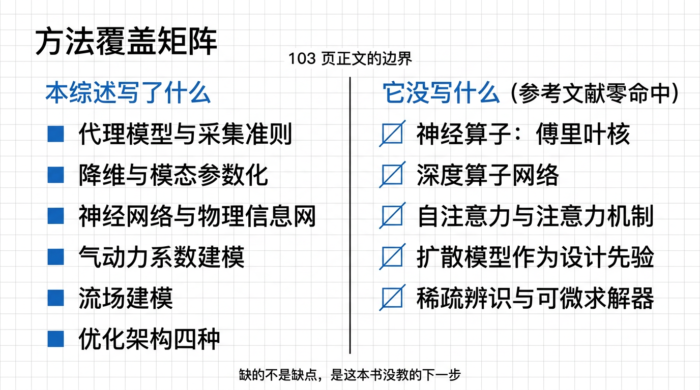

> 图注：右列五项**不是**"这些方法不好"，而是"这篇综述没写它们"——零命中是**搜索的结果**，
> 不是论断（搜索串见本讲 §3 与 `corpus/facts/scan-results.md`，可自己重跑 `tools/scan_corpus.py`）。
> 样本密度坍缩那张图（`L01_s5_curse_of_dim_zh.png`，与讲 03 共用）放在 §6 用：它解释**为什么右列会长期空着**。

> 借这张图说清本讲的立场：综述的**引用密度**和代理模型的**样本密度**遵循同一条铁律——
> **在稀疏的地方，一切结论都是外推。** 上表里那五个"0 命中"不是八卦，是这张图在文献计量上的翻版。

> 下表由脚本读取 `../资料原件/论文全文-提取文本.md` 现场计算，
> 每次装配白皮书前重跑；完整结果见 `corpus/facts/scan-results.md`。
> 若某行与旧文档（`../章程与地图/12篇论文总规划.md`）不符，**以脚本输出为准**并记录差异。

| 体检项 | 口径 | 本次实测结果 |
| :--- | :--- | :---: |
| 正文引用标记数（编号出现次数） | p3–68，`[N]`/`[N, M]`/`[N–M]` 全部展开计数 | **826** |
| 不同被引编号个数 | 同上，去重 | **513** |
| 参考文献条目数 | p69–103 区 `[N]` 起头的最大编号 | **528** |
| 最高被引单篇 | 正文出现次数 | **[312] ×18**（其次 [341] ×12、[313] ×11、[316] ×9、[111]/[326] ×8、[1] ×7） |
| 盲区关键词 | 参考文献区不区分大小写命中**页数** | fourier neural operator **0** ｜ deeponet **0** ｜ transformer **0** ｜ diffusion **0** ｜ sindy **0** |
| 对照：确有覆盖的方向 | 同上 | physics-informed **4 页** ｜ adjoint **10 页** ｜ kriging **15 页** |
| 图 / 表实物 | 正文 | 47 图 / 5 表（由 `tools/verify_all.py` B 项逐处核过） |

> 与 `../章程与地图/12篇论文总规划.md` 里旧的「870 个引用标记 / 529 条」不一致：
> **差异来自口径**（区间式引用是否展开、页边界如何取）。本书以脚本口径为准，并已把差异公示在 6.4；
> 承重榜结论不变——[312]（Li/Bouhlel/Martins 2019）仍是全篇第一，P05 的选题依据成立。

**怎么把这张表讲给组会**：不要念数字。要说：
"我用被引次数排了序，发现这篇综述的承重是**伴随 + 代理模型**两条；
我同时在它的参考文献里检索了五个 2022 年后的热门关键词，**四个 0 命中**——
所以如果有人问我'这综述能不能代表 2026 的前沿'，我的答案是：**它能代表 2022 的地图，不代表 2026 的国境线。**"

---

#### 6. 本讲收口前的审稿人批判（对综述本身，六条，带页码）


1. **p47**：外推风险只被定性提出，全文没有一处给出"外推距离—误差"的定量曲线；
2. **p49（Table 2）**：分类表不含样本量与误差列，导致"方法 × 对象"可查、"方法 × 可行性"不可查；
3. **p59–60（Table 4）**：以设计变量数为轴却不报 CFD 次数，读者无法估预算（本讲 §2 已补分界线：≤17 用 Kriging、30 维转 ANN）；
4. **p64（Fig. 46）**：旗舰成果图缺坐标说明；
5. **p68（结论）**：三条结论均为定性表述，无一个汇总数字（例如"降维可带来 X 倍样本需求下降"）；
6. **结构**：§3 方法（10–33 页）与 §4 应用（41–67 页）相隔较远，同一方法（ME、Isomap）分处两地，首次阅读极易漏掉联系。

**同时批判我们自己（诚实声明）**：本白皮书的"盲区命中数"依赖文本提取质量（连字与断行），
若某关键词跨行断开可能漏检 —— 因此 scan 脚本对每个关键词同时输出**命中页码**，人工抽查 1 页即可复核。

---

#### 7. 承前启后

- **承前**：本讲的六条批评全部来自讲 01–10 读到的具体位置，不是凭空挑刺；
- **启后**：讲 12 会把这六条转成"你的改进清单"；P02（伴随综述）与 P05/P06 将填补本讲 §3(a) 指出的承重项原文。

---

#### 8. 你的项目接哪一步

| 本讲发现 | 对你平台的直接指令 |
| :--- | :--- |
| "很多模型没和传统 ASO 比" | 你的平台**必须有传统基线**：至少一条 SLSQP+SU2（或伴随，若你能接 SU2 DOT）的对照；没有基线的 ML 结果在组会上会被一句话击穿 |
| 口径混杂 | 你的 README 与前端一律写"**留出集 MAE + 平均相对误差 + 样本量 + 划分方式**"四件套，禁止只写 R² |
| 盲区=选题 | FNO/DeepONet 在这篇综述里 0 命中，而你的数据是"74 维 → 全场"——**这正是你能发论文的位置**（但必须先按讲 07 §8 把输出从标量升级到场） |
| 训练成本被淡化 | 把你的一次训练账（样本 × 机时 + 网络训练核时）写成表，放到白皮书/文档首页；这是别人抄不走的东西 |

---

#### 9. 自测 10 题（2 选 + 2 填 + 6 答）

1. （选）判断一篇文献是否"必读原文"，最客观的本地判据是：A 期刊影响因子 B 它在本综述正文中被引次数 C 发表年份 D 作者名气
2. （选）综述结论中作者自陈的最大未解问题是：A 精度不够 B ML 训练成本高导致大规模实用优化仍未解决 C 网格太粗 D 缺少实验
3. （填）本白皮书用「______ 命中 0 次」来证明盲区，而不是用「我觉得不重要」。
4. （填）作者指出很多 ML 模型被用于较不难的问题，且**没有与 ______ 做对比**〔原文 P68 "without comparing to conventional ASO"〕。
5. （答）写出"被引次数排序"的算法（三步 + 一句为什么不能用全文 103 页做分母）。
6. （答）Table 2/Table 4 各缺哪一列？如果给你重写，你加什么列？
7. （答）为什么"外推风险"必须用"最近邻距离"而不是 R² 来监控？给出你的阈值设定流程。
8. （答）把本讲六条批评压缩成组会可讲的三条，各配一句"我打算怎么补"。
9. （答）如果扫描脚本因连字/断行漏检了某关键词，会产生什么后果？如何用两条命令自查？
10. （答）批判的批判：为什么"按被引次数选 12 篇"本身也有偏差？说出两种偏差并给出补救读法。

**答案要点**：1-B；2-B；3-关键词（在参考文献区 p69–103 的）；4-传统 ASO；
5-①取正文 p3–68；②正则抓 `[N…]` 展开区间/逗号；③按编号计数并降序 ——
不能用全 103 页做分母是因为**参考文献区自身含大量方括号编号**，会把书目当成"被引"；
6-都缺"样本量/CFD 次数/误差与口径"列；重写就加：N_train、N_eval、误差(mean ± max) + 口径、加速比、是否含外推；
7-R² 只测同分布，测不出"离训练流形多远"；流程：算 d(x) 分布 → 取训练集内部 d 的 95 分位为 d_max → 超过则前端标"外推"；
8-示例：①只和 ML 基线比 → 我补 SLSQP+SU2；②口径混杂 → 我四件套报数；③旗舰图无可读轴 → 我的图先写 caption 再画图；
9-误判"0 命中=没有"→ 结论夸大；自查：`grep -o` 直接扫原文 PDF 提取文本 + `tools/scan_corpus.py --dump <关键词>` 打印命中页；
10-偏差①：本综述的知识结构决定"承重"，会继承它的盲区；偏差②：老文献天然高引（时间累积），新方法吃亏。
   补救：对被引最多的 3 篇读原文，同时**额外**读 2 篇"综述里 0–1 命中但被其他来源强推"的论文（本规划 §二的两篇补编即为此设）。

---

#### 10. 一句收口

> **读综述的终点不是"我懂了"，是"我知道它不知道什么，并且我能在三个月内把它不知道的那一格补上一个数字"。**

---

<a id="lec-12" name="lec-12"></a>
<a id="lec-12" name="lec-12"></a>
### 【讲12】知识整合：一页报告、验收抽问与改进清单
**覆盖：全书合成（不读新内容）｜产出：你自己的《一页报告》＋ 平台改进清单**

---

#### 0. 本讲元数据

| 项 | 值 |
| :--- | :--- |
| 本讲范围 | 讲 01–11 的合成；对应学科路线图的 S12（知识整合） |
| 证据等级 | **A 级**（本讲不新增论文数字，只重组已核过的；新引入的项目数字一律挂 `corpus/facts/P01-local.md`） |
| 交付物 | ① 你的**一页四段报告**（必须含"我还存疑的地方"）；② 三级改进清单；③ 后续阅读清单（含 DOI） |
| 本讲一句话 | **白皮书会替你写"讲稿"，但只有你能写"报告"——报告是检验你是否真读懂的唯一证据。** |

---

#### 1. 生活与物理直觉引子：为什么"读完"是一种错觉

读完 103 页综述的人大多处于三种状态之一：
**记得图**（能想起 Kriging 那条置信带）、**记得话**（能背"维度灾难"）、**记得账**（知道每个方法省下什么、花掉什么）。
只有第三种能过组会这一关。本讲就是把你从第二种拽到第三种的那一下。

**先认词**：本讲不引入任何新词；若你在这里遇到没定义过的词，说明前面某一讲违规了（红线 A3），请当场记进 `../memory/ERRORS.md`。

---

#### 2. 一页报告（四段固定结构，全用你自己的话）

> 规则照 `../章程与地图/论文精读方法论.md` §七：**四段缺一即视为不完整**；
> 第四段"我还存疑的地方"至少一条，**这是灵魂**。

```
【我的 P01 一页报告】孙承泽 · ____ 年 __ 月 __ 日

一、我研究的问题（一句话）
    ML 能不能把"气动外形优化"从 1000 次昂贵 CFD 的游戏，改造成 1000 次廉价推理 + 少量验证的游戏？

二、我的核心思路（允许"我一开始以为…"）
    我一开始以为综述会讲"深度学习更准"；读完发现它讲的是三笔账：维度账、精度账、成本账。
    （此处你必须写自己的两到三句，不许照抄本行。）

三、我的结论（带数字与出处）
    ① 设计空间：100 → 15〔原文 P44〕、Rotor 37 的 8 模态 +0.25%〔原文 P45〕；
    ② 评估：135,108 样本 / 60 变量 / ≤0.4% / 47,967 未见机翼〔原文 P62〕；
       但"多数模型是插值型的"〔原文 P68 "Most ML prediction models are interpolative, so they"〕⇒ 必须报外推子集误差；
    ③ 架构：≤17 维 Kriging、30 维转 ANN（Table 4）；加速 4,000×〔原文 P61〕；
    ④ 反例自查：我的 η R²=0.9561 是 E2 口径，且未做与传统基线的同预算对比〔原文 P68 "many ML models are applied to less challenging ASO"〕。

四、我还存疑的地方（至少一条）
    · 统计特征当"设计变量"到底能不能反算几何？（讲 06 的判断待我读代码确认）
    · s_min=0.7 搬到叶栅上还成立吗？我打算用 50 张人工标注样本测 ROC。
```

---

#### 3. 从 0 到 1：Cold-Call 随机抽问的评分函数

验收标准不是"我觉得我懂"，而是**可打分的**。协议（照 `../章程与地图/12篇论文总规划.md` §三）：

1. 从 12 讲里随机抽 **5 个点**（一个公式 / 一张图 / 一个数字 / 一个失效条件 / 一个跨讲关系）；
2. 闭卷，每个点走**六层阶梯**（画面 → 拆词 → 操作 → 公式 → 数据 → 边界与回收）；
3. 打分：每层 1 分，**≥3 层算过**；5 点里 ≥4 点过 → 本讲次 ✅；
4. 未过的点写进 `../memory/drill-ledger/index.md`，标 `cw`（自信却错）或 `gap`（空白）。

**一张可自查的评分样例（以"Kriging 的 θ"为例）**

| 层 | 通过线 | 我的自问 |
| :--- | :--- | :--- |
| 画面 | 能用一句话说"θ 在管什么" | 邻居半径旋钮 ✔/✘ |
| 拆词 | θ 的下标 i 是什么维度 | 每个设计变量一个 θᵢ ✔/✘ |
| 操作 | 说清"如何估 θ" | 网格/极大似然，式 (18) ✔/✘ |
| 公式 | 写出 R(x,x′) | exp(−Σ((xᵢ−x′ᵢ)/θᵢ)²) ✔/✘ |
| 数据 | 举一个论文里的可比数字 | Kriging 高维退化：≤17 维仍主流（Table 4）✔/✘ |
| 边界与回收 | 说出失效条件 + 接到我的项目 | d 大 ⇒ R→I；我的 74 维需先降维 ✔/✘ |

---

#### 4. 操作流：三级改进清单（把白皮书变成 TODO）

**今天就能改（≤1 小时）**
- [ ] README/前端加"四件套"报告口径：留出集 MAE + 平均相对误差 + 样本量 + 划分方式；
- [ ] 把 `corpus/facts/P01-local.md` 的 **E2/E3 红线**抄进项目 `AGENTS.md`，禁止把代理预测写成"已验证"；
- [ ] 前端对每条 Pareto 解显示"到训练集最近邻距离 d(x)"（`code/curse.py` 之外只需一个 KD-tree）。

**两周内（一个会话周期）**
- [ ] Kriging/GEK 基线：同数据、同留出协议，与你的残差网络并排报数（`code/kriging.py` 起步）；
- [ ] 按 Ω 分组留出（5–8 组），重报 R² 与 MAE，量化"外推子集"掉多少；
- [ ] 用 `code/curse.py` 把"74 维 → 每轴 1.10 点"写成图，放进组会 PPT 第 2 页。

**本学期（可成文）**
- [ ] 预优化采样 → 抽 8–15 个几何模态（对标 Duan et al. 的 1,734 样本 / 8 模态 / +0.25%）；
- [ ] 训练 CNN 合法性判别器，测你对象的 s_min（不要照抄 0.7）；
- [ ] 200 次 CFD 预算内的三轨对比：NSGA-II+代理 / SLSQP+SU2 / Co-Kriging（先让粗网格收敛）。

---

#### 5. 数据与图表：全书总账（一张图收尾）


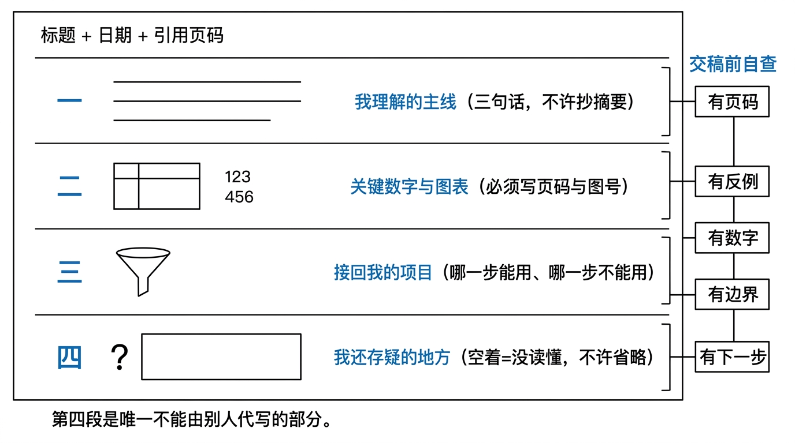

> 图注：这张图只画**版式与自查项**，不替你写内容；第四段（存疑）框子留空是故意的——
> 空着就交，等于当场承认没读懂，所以宁可晚交一天。

> 看图的三个问题（能答完，说明这本书读完了）：
> ① 哪一格是"评估变聪明"、哪一格是"评估变便宜"？② 你自己的平台现在站在第几格？
> ③ 如果只能再补一格，你补哪一格——用三笔账（维度、精度、成本）给出理由。

---

#### 6. 后续阅读清单（按 12 篇总规划，含 DOI；被引次数为 `tools/scan_corpus.py` 实测）

| 优先 | 论文 | 本综述被引 | DOI |
| :---: | :--- | :---: | :--- |
| 🔴 P02 | Kenway, Mader, He, Martins, *Effective adjoint approaches for CFD*, Prog. Aerosp. Sci. 110 (2019) 100542 | ×5 | 10.1016/j.paerosci.2019.05.002 |
| 🔴 P05 | Li, Bouhlel, Martins, *Data-based approach for fast airfoil analysis and optimization*, AIAA J. 57 (2019) 581–596 | **×18（全篇第一）** | 10.2514/1.J057129 |
| 🔴 P06 | Du, He, Martins, *Rapid airfoil design optimization via NN-based parameterization and surrogate modeling*, AST 113 (2021) 106701 | ×11 | 10.1016/j.ast.2021.106701 |
| 🟠 P09 | Li, Zhang, *Adjoint-free ASO of the CRM wing*, AIAA J. 59 (2021) 1990–2000 | ×10 | 10.2514/1.j059921 |
| 🟠 P03 | Lyu, Kenway, Martins, *ASO investigations of the CRM wing benchmark*, AIAA J. 53 (2015) 968–985 | ×9 | 10.2514/1.J053318 |
| 🟠 P08 | Li, Zhang, *On deep-learning-based geometric filtering in ASO*, AST 112 (2021) 106603 | ×8 | 10.1016/j.ast.2021.106603 |
| 🟡 P07 | Bouhlel, He, Martins, *Scalable gradient-enhanced ANN*, SMO 61 (2020) 1363–1376 | ×6 | 10.1007/s00158-020-02488-5 |
| 🟡 P11 | Thuerey et al., *DL methods for RANS simulations of airfoil flows*, AIAA J. 58 (2020) 25–36 | ×6 | 10.2514/1.j058291 |
| 🟡 P04 | Queipo et al., *Surrogate-based analysis and optimization*, Prog. Aerosp. Sci. 41 (2005) 1–28 | ×4 | 10.1016/j.paerosci.2005.02.001 |
| 🟢 P10 | Li, Zhang, Chen, *Learning the aerodynamic design of supercritical airfoils via deep RL*, AIAA J. 59 (2021) 3988–4001 | ×5 | 10.2514/1.j060189 |
| 🟢 P12 | Cai et al., *PINNs for fluid mechanics: a review*, Acta Mech. Sin. 37 (2021) 1727–1738 | §3.5.8 | 10.1007/s10409-021-01148-1 |
| 补 | FNO / DeepONet（本综述 **0 命中**） | — | 题录见 `../章程与地图/12篇论文总规划.md` §二，〔延伸·待核实〕 |

> 被引次数与本讲表格均由 `tools/scan_corpus.py` + `../章程与地图/12篇论文总规划.md` 交叉核对；
> 若两处不符，**以脚本为准**并在 `../memory/ERRORS.md` 记一条判例。

---

#### 7. 本讲的一句话批判（也批判本白皮书自己：审稿人批判清单）

本白皮书**没有**做的事，你要清楚：
① 没有跑过任何一次 CFD/SU2；② 所有论文数字来自 PDF 文本抽取，未做数值复现（EI、Kriging 只在一维玩具函数上跑通）；
③ 讲 08、讲 10 的部分延伸判断（如"训练账本应进正文"）是**我们的观点**，已标「本白皮书解读」；
④ 图是 AI 生成的**示意图**，只讲直觉，**不能当论文原图引用**——需要原图请回 `../资料原件/*.pdf` 按图号看。

---

#### 8. 你的项目接哪一步（终局回收）

三笔账的最终形态（建议直接做成你平台的 `RESULTS.md`）：

| 账 | 指标 | 你现在的值 | 目标 |
| :--- | :--- | :--- | :--- |
| 维度账 | 每轴点数 N^(1/d) | 1.10（74 维 / 1000 样本） | ≥ 2.3（8–12 维）由 `code/curse.py` 复核 |
| 精度账 | 留出 MAE / 外推子集 MAE 之比 | 未知（只报过 R²） | ≤ 3 倍，否则前沿只用于海选 |
| 成本账 | 一次训练机时 ÷ 一次 CFD 机时 | 未知 | ≤ 0.5 才有资格谈"交互式" |

---

#### 9. 自测 10 题（2 选 + 2 填 + 6 答）——结业卷

1. （选）一页报告四段里"灵魂"是：A 结论 B 存疑 C 方法 D 引文数量
2. （选）Cold-Call 的通过线是：A 5 点全对 B ≥4 点达到操作层及以上 C ≥3 点 D 背出定义即可
3. （填）六层阶梯：画面 → 拆词 → 操作 → ______ → ______ → 边界与回收。
4. （填）三笔账：______ 账、______ 账、______ 账。
5. （答）不查资料，写出 Kriging 的 μ、σ 两个式子，并说明 F 为全 1 时 u(x) 怎么退化。
6. （答）把"维度灾难"讲给一个只学过均值与标准差的同学：要求两句以内、不许用"高维"这个词。
7. （答）你的平台目前属于讲 09 四种架构里的哪一种？给出**它的两个失效条件**（不许说"精度不够"这种笼统话）。
8. （答）设计一个"能在两周内做完"的实验，用来检验 0.4% 与 R²=0.9561 是否在同一量级上可比。
9. （答）从 6.3 六个选题里挑一个你能做的，写出：变量、判据、失败长什么样。
10. （答）本讲 §7 列了白皮书自己没做的四件事。挑一件，说明它为什么重要、你打算怎么补。

---

#### 10. 一句收口

> **白皮书把 103 页折成 12 讲，你要把它再折成一张纸；
> 那张纸上的每一个数字，你都能当场说出它的页码、口径与失效条件——那时你才配说"我读完了"。**

